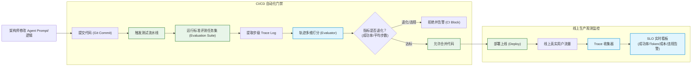
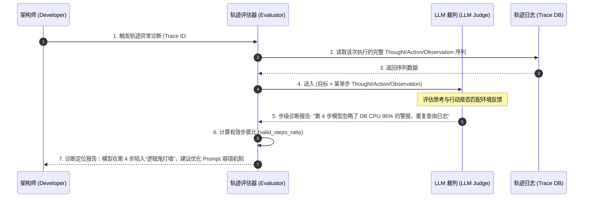

import GlossaryTerm from '@site/src/components/GlossaryTerm';
import GuidedExercise from '@site/src/components/GuidedExercise';
import ResearchNote from '@site/src/components/ResearchNote';
import ChapterMeta from '@site/src/components/ChapterMeta';
import PyRunner from '@site/src/components/PyRunner';
import TradeoffExplorer from '@site/src/components/TradeoffExplorer';
import QuizCard from '@site/src/components/QuizCard';

# M9L10 · Agent 评测与可观测

<ChapterMeta
  time="约 2.5 小时"
  prereqs={[{label: 'M7L10 LLM 评测', href: '../llm-systems/llm-evaluation'}, {label: 'M9L3 ReAct 轨迹', href: './react-pattern'}, {label: 'M6L7 可观测', href: '../cloud-enterprise-industrial/observability-advanced'}]}
  outcome="能评测 Agent 的轨迹（不只最终结果）：用步级和整体指标衡量它是否达成目标、是否高效合理，并用 tracing 让 Agent 可调试可改进。"
  howToUse="先看“只看最终答案不够”，再学轨迹评测和步级指标，最后做 Agent 轨迹评测 lab。"
/>

:::tip Agent 走对了答案，不代表它走的路是对的——要评测整条轨迹
[M7L10](../llm-systems/llm-evaluation) 教过评测 LLM 的输出。但 Agent 是**多步**的，光看“最终答案对不对”远远不够：它可能**蒙对了**（过程一团糟但碰巧对）、可能**绕了大弯**（对了但用了 50 步、烧了大量 token）、可能**违反了约束**（对了但中途越权调了危险工具）。Agent 评测要看**整条轨迹**——每一步合不合理、效率如何、有没有违规——这才能真正衡量和改进它。
:::

## 一、只看最终答案，评不出 Agent 的好坏

对单次 LLM 调用，看输出对不对就够了。但对 Agent，“最终答案对”会掩盖很多问题：
- **蒙对的**：过程混乱、推理错误，但最后碰巧给了对答案——下次就会错。
- **低效的**：答案对，但用了远超必要的步数和成本（[M9L4 没及时停](./stopping-budget)）。
- **违规的**：答案对，但中途调用了不该调的工具、越了权（[M9L9 安全](./agent-guardrails)）。
- **不可复现的**：[非确定（M7L3）](../llm-systems/sampling-decoding)，这次对不代表下次对。

所以 Agent 评测必须**看过程，不只看结果**——评测整条 [轨迹（trajectory）](./react-pattern)。

## 二、三个核心概念（分层）

### 基础：轨迹评测

<GlossaryTerm term="Trajectory Evaluation" definition="轨迹评测：评测 Agent 完成任务的整个过程（每一步的推理、动作、观察），而不只是最终结果。衡量是否达成目标、过程是否合理高效、有无违规步骤。">轨迹评测（trajectory evaluation）</GlossaryTerm>：把 Agent 完成任务的**整个过程**（[ReAct 的 Thought/Action/Observation 序列 M9L3](./react-pattern)）作为评测对象。衡量几个维度：
- **是否达成目标**（结果对不对）。
- **过程是否合理**（每步动作有没有道理、有没有错误步骤）。
- **是否高效**（步数、token、成本——有没有绕弯/空转）。
- **是否合规**（有没有越权、违反约束、调危险工具）。

### 进阶：步级指标与整体指标

- **整体指标**：任务成功率、平均步数、平均成本/延迟、违规率——衡量 Agent 整体表现，用于回归对比（[呼应 M7L10](../llm-systems/llm-evaluation)）。
- **步级指标**：每一步的动作是否有效、工具调用是否成功、是否有重复/空转步——用于**定位**问题出在哪一步（[呼应 M8L9 分维度定位](../rag/rag-evaluation)）。
- 两者配合：整体指标告诉你“Agent 好不好”，步级指标告诉你“问题在哪一步、该怎么改”。

### 深入（选学）：Agent 评测与可观测的工程

- **tracing 是前提**：评测和排错都要靠完整的 <GlossaryTerm term="Trace Log" definition="轨迹日志：智能体在运行期间产生的、详尽记录每一步 Reasoning (推理)、Action (行动参数) 与 Observation (外部反馈) 的结构化执行日志，是进行轨迹评测与异常排错的基础数据。">轨迹记录 (Trace Log)</GlossaryTerm>——每步的输入、推理、动作、参数、结果、耗时、成本。没有 trace，Agent 就是个无法调试的黑盒（[呼应 M6L7 可观测、M9L3 ReAct 轨迹](../cloud-enterprise-industrial/observability-advanced)）。这是 Agent 可运维的基础。
- **评测方式**：成功与否常能用客观信号判（任务完成的硬标准、测试通过）；过程合理性常用 <GlossaryTerm term="LLM-as-judge" definition="大模型裁判：使用大语言模型（通常是能力更强的闭源模型）作为评估器，根据特定的 Prompt 指引和评分标准，对其他 AI 系统生成的文本或执行轨迹进行自动打分和评估的机制。">LLM-as-judge</GlossaryTerm> 评判轨迹（注意其偏差）或人工抽查；效率/合规用规则算（步数、是否调了禁用工具）。
- **建评测集 + 回归**：和 [M7L10/M8L9](../llm-systems/llm-evaluation) 一样，要有代表性任务的评测集，改 Agent（prompt/工具/流程）后跑回归对比、接 <GlossaryTerm term="CI Gate" definition="持续集成门禁：在代码合入干线前自动运行的质量卫士。对 Agent 系统而言，CI 门禁在每次提交代码时运行评测集，自动对比新旧轨迹指标，如果发现成功率退化或违规动作，则拒绝合并代码。">CI 门禁 (CI Gate)</GlossaryTerm>，防止“改好一类任务、退化另一类”。
- **线上可观测**：对线上系统实施 <GlossaryTerm term="SLO Monitoring" definition="SLO 监控：服务等级目标监控。对生产环境下的 Agent 运行状况进行实时监控，关注成功率、步数波动、Token/延迟开销以及违规告警等核心系统指标，保证其在安全与效率的红线内运行。">SLO 监控 (SLO Monitoring)</GlossaryTerm>，监控真实运行的成功率、步数分布、成本、违规告警、降级/审批触发率（[呼应 M6L7 SLO/告警、M7L11 LLM 观测](../cloud-enterprise-industrial/observability-advanced)）。Agent 的成本 and 步数波动大，更要盯。
- **Agent 难评测，是它难上生产的核心原因之一**：多步、非确定、过程复杂——没有好的轨迹评测和可观测，你既不敢信它、也无法改进它。**评测能力往往决定一个 Agent 能不能真正上生产**（[呼应 M9L1 “成熟看失控时怎样、能否复现”](./agent-loop-basics)）。

<ResearchNote
  title="Agent 评测：评整条轨迹，不只评结果"
  source="Agent 评测实践（AgentBench 等）；M7L10 LLM 评测；M6L7 可观测"
  href="https://arxiv.org/abs/2308.03688"
  insight="Agent 多步、非确定，仅看最终结果会掩盖蒙对、低效、违规、不可复现等问题。要做轨迹评测：衡量是否达成目标、过程是否合理、是否高效（步数/成本）、是否合规，用整体指标做回归、步级指标定位问题。完整 trace 是评测和排错的前提。Agent 是否可评测，常决定它能否上生产。"
  application="给 Agent 全程记录 trace（每步推理/动作/参数/结果/成本）；评测整条轨迹（目标达成 + 过程合理 + 效率 + 合规）；建任务评测集跑回归、接 CI；线上监控成功率/步数/成本/违规。用客观信号判成功、LLM-judge/人工评过程合理性、规则算效率合规。把可评测当 Agent 上生产的门槛。"
/>

## 三、智能体评估与可观测图解 (Deep Dive Diagrams)

本节展示智能体评测的四维指标模型、自动化 CI 回归测试门禁架构以及轨迹诊断排错控制流程。

### 1. 结构全景：轨迹评测 vs. 结果评测

```mermaid
graph TD
    classDef bad fill:#ffebee,stroke:#c62828,stroke-width:1.5px;
    classDef good fill:#e8f5e9,stroke:#2e7d32,stroke-width:1.5px;
    classDef eval fill:#e1f5fe,stroke:#0288d1,stroke-width:2px;

    UserQuery["用户复杂任务需求"] --> AgentRun["智能体执行回路 (Agent Loop)"]
    AgentRun --> TraceLog["生成运行轨迹 (Trace Logs)"]
    AgentRun --> FinalAnswer["最终输出答案"]

    subgraph TraditionalEval [传统评估 (结果主义)]
        FinalAnswer --> CheckAns{"只判答案对错?"}
        CheckAns -->|True| PassResult["判定通过 (Pass)"]:::good
    end

    subgraph TrajectoryEval [轨迹评估 (过程主义)]
        TraceLog --> MultiEval["四维联合评估器 (Evaluator)"]:::eval
        MultiEval --> CheckGoal["1. 目标达成度 (Goal Reached)"]
        MultiEval --> CheckReason["2. 步骤合理性 (Step Validity)"]
        MultiEval --> CheckEff["3. 运行效率 (Steps/Tokens Budget)"]
        MultiEval --> CheckSafe["4. 安全合规性 (Compliant)"]
        
        CheckGoal & CheckReason & CheckEff & CheckSafe --> CombinedJudge{"四维全部满足?"}
        CombinedJudge -->|No| RejectTrace["判定失败 (Fail: 揭示绕弯/越权)"]:::bad
        CombinedJudge -->|Yes| PassTrace["判定通过 (Pass: 过程可靠)"]:::good
    end
```

### 2. 控制流程：可观测闭环与评估 CI 门禁



### 3. 时序全景：轨迹排错时序与异常定位



---

## 四、跟我做一遍：Agent 轨迹评测

<PyRunner
  rows={40}
  expect="多维度评一条轨迹"
  code={`def evaluate_trajectory(trace, goal_reached, forbidden_tools, max_good_steps):
    steps = len(trace)
    used = [a for a, _ in trace]
    score = {}
    score["goal_reached"] = goal_reached                       # 1) 目标达成
    failed = sum(1 for _, ok in trace if not ok)               # 2) 过程合理:失败步数
    score["valid_steps_ratio"] = round((steps - failed) / steps, 2) if steps else 0
    score["steps"] = steps
    score["efficient"] = steps <= max_good_steps               # 3) 效率
    violations = [a for a in used if a in forbidden_tools]      # 4) 合规
    score["compliant"] = len(violations) == 0
    score["violations"] = violations
    score["pass"] = (goal_reached and score["efficient"]       # 综合判定
                     and score["compliant"] and score["valid_steps_ratio"] >= 0.8)
    return score

# 轨迹A：达成、高效、合规
trace_a = [("search", True), ("read", True), ("answer", True)]
print("A:", evaluate_trajectory(trace_a, True, {"delete_db"}, max_good_steps=5))

# 轨迹B：蒙对但绕大弯 + 调了禁用工具
trace_b = [("search", True), ("search", False), ("search", True), ("delete_db", True),
           ("read", True), ("read", True), ("answer", True)]
print("B:", evaluate_trajectory(trace_b, True, {"delete_db"}, max_good_steps=5))
print("多维度评一条轨迹")`}
/>

轨迹 A 和 B 都"答对了"，但 B 绕了大弯（7 步超上限）、还调了禁用的 delete_db（违规）——只看结果分不出好坏，看轨迹才暴露 B 的问题。**试试**：构造一个"蒙对的"轨迹（goal_reached=True 但 valid_steps_ratio 很低）看它不 pass；想想真实系统里"过程是否合理"怎么用 LLM-judge 评。

## 四、动手 Lab（必做）

打开 `labs/month09/m9l10_agent_eval/`：

```bash
python labs/month09/m9l10_agent_eval/test_agent_eval.py
```

实现 Agent 轨迹评测：多维度（目标/有效步比/效率/合规）打分，综合判定 pass，能区分"蒙对/绕弯/违规"。

<GuidedExercise
  title="练习指引：实现 Agent 轨迹评测"
  goal="把“评整条轨迹的多维度指标”做成代码——衡量和改进 Agent 的基础。"
  hints={[
    'trace 是 [(action, ok)]；统计步数、失败步、用到的工具。',
    'valid_steps_ratio = (步数-失败步)/步数；efficient = 步数<=上限。',
    'compliant = 没调 forbidden_tools 里的工具。',
    'pass = 目标达成 且 高效 且 合规 且 有效步比达标。'
  ]}
  steps={[
    '实现 evaluate_trajectory(trace, goal_reached, forbidden_tools, max_good_steps)。',
    '算各维度指标（目标/有效步比/效率/合规）。',
    '综合判定 pass。',
    '写测试：好轨迹 pass、绕弯不高效不 pass、调禁用工具违规、蒙对(有效步比低)不 pass。'
  ]}
  checks={[
    '你能解释为什么 Agent 要评轨迹而非只评结果。',
    '你的 lab 能区分蒙对/绕弯/违规的轨迹。',
    '你能说出整体指标和步级指标各自的用途。',
    '你理解 trace 是评测排错的前提、可评测是上生产门槛。'
  ]}
/>

## 架构师深潜（Staff+ 视角）

### 1. Agent 评测维度

<TradeoffExplorer
  title="Agent 评测维度"
  dimensions={['衡量结果', '衡量过程', '可自动算', '定位问题', '防蒙对/绕弯/违规']}
  options={[
    {
      name: '只看最终结果',
      scores: [5, 1, 4, 1, 1],
      note: '看答案对不对。简单，但掩盖蒙对/低效/违规、无法定位。',
      whenToUse: '快速看整体成功率——不够。'
    },
    {
      name: '轨迹评测(过程+结果)',
      scores: [5, 5, 3, 4, 5],
      note: '评整条轨迹的目标/合理/效率/合规。能暴露并定位问题。',
      whenToUse: 'Agent 评测的核心——必备。'
    },
    {
      name: '+ 线上可观测/回归',
      scores: [5, 5, 4, 5, 5],
      note: '评测集回归 + 线上监控成功率/成本/违规。可持续改进、防退化。',
      whenToUse: '生产 Agent 的完整体系。'
    }
  ]}
/>

### 2. "可评测"是 Agent 从玩具到产品的分水岭

回顾 [M9L1](./agent-loop-basics) 说的：判断一个 Agent 是否成熟，看的不是 demo 多惊艳，而是它失控时怎样、能不能复现和改进。这一课给出了答案：**靠轨迹评测和可观测**。没有它们，Agent 是个黑盒——你不知道它为什么对、为什么错、改了之后是变好还是变坏，自然不敢上生产、也无法迭代。有了它们，Agent 才变成一个可度量、可回归、可持续改进的工程产品。这和 [M7L10 评测是 LLM 应用护城河](../llm-systems/llm-evaluation)、[M8L9 评测驱动 RAG 优化](../rag/rag-evaluation)、[M6L6 DORA 高频低风险](../cloud-enterprise-industrial/cicd-pipelines) 是同一条主线：**可度量才可改进，可回归才敢迭代**。Agent 因为多步、非确定、过程复杂，评测尤其难、也尤其关键——这往往是团队 Agent 能力的真正瓶颈。

### 3. 真实案例：Agent 评测难，所以很多 Agent 停在 demo

业界一个普遍现象：Agent demo 满天飞，真正稳定上生产的少。一个核心原因就是评测难：Agent 多步、非确定、过程复杂，"它到底行不行""改了之后好了还是坏了"很难说清。能突破的团队，往往是建立了**任务评测集 + 轨迹评测 + 线上可观测**的体系：用代表性任务集衡量成功率和效率、用轨迹评测暴露过程问题、用 trace 排错、用回归保证迭代不退化、用线上监控盯成本和违规。这套评测体系的投入常常和 Agent 本身一样大——但它是 Agent 从"惊艳 demo"走向"可靠产品"的必经之路。**架构师推动 Agent 落地，第一件事往往不是让 Agent 更聪明，而是让它可评测、可观测。**

### 4. 架构师深问（给自己 30 分钟）

- 你怎么知道你的 Agent "行不行"？只看最终结果，还是评了整条轨迹（过程/效率/合规）？
- 你的 Agent 有完整 trace 吗？出错时能定位到哪一步、能复现吗？改了之后有回归对比吗？
- 你线上盯 Agent 的成功率、步数/成本分布、违规告警吗？成本和步数波动你能及时发现吗？

## 知识自测

<QuizCard
  questions={[
    {
      q: '在生产中，为什么评估 Agent 系统时仅仅评估“最终输出是否正确”是远远不够的？',
      options: [
        'A. 因为最终输出是由外部协调器硬编码拼接的，不能反映模型的真实水平',
        'B. 因为最终输出的评测计算开销远高于中间轨迹的规则计算',
        'C. 答案正确可能会掩盖中途的低效空转（如绕了50步）、违规调用（如调用了越权工具）或碰巧蒙对的逻辑错误，无法保证在其他输入下的稳定性和合规性',
        'D. 轨迹日志 (Trace) 必须上传到公有云才能进行离线打分，存在安全隐患'
      ],
      answer: 2,
      explain: '轨迹评估关注的是智能体的执行过程（Thought-Action-Observation）。只看结果容易在测试集上产生“假阳性”（比如模型绕弯碰巧给出正确答案，但实际上已经消耗了天量 token 并违反了安全红线），必须通过轨迹分析来暴露效率与安全风险。'
    },
    {
      q: '关于智能体评估中的“步级指标 (Step-level)”与“整体指标 (Global)”，以下说法最合理的是？',
      options: [
        'A. 步级指标只适用于开发阶段，线上生产监控应当只看整体成功率指标',
        'B. 整体指标（如任务成功率、平均步数）用于宏观衡量 Agent 整体系统的优劣与退化；步级指标（如有效步骤比、工具报错率）则用来定位具体问题出在哪个环节（如检索结果被忽略）',
        'C. 只要大模型的参数量足够大，整体指标与步级指标会自动对齐，不需要分开评估',
        'D. 步级指标专门用作安全护栏卡点，整体指标只用来计算费用预算'
      ],
      answer: 1,
      explain: '整体指标是系统的“SLO / DORA”指标，说明系统是否健康；而步级指标则是“应用级 Metrics/Traces”，用于在系统不达标或 PR 回归测试失败时，精准诊断出是“检索未命中”还是“工具逻辑出错”导致的缺陷。'
    },
    {
      q: '在 Agent 可观测工程中，如何正确理解“Trace 轨迹记录是可评测与可运维的前提”？',
      options: [
        'A. Trace 日志能够直接注入大模型，作为其非参数记忆的向量存储',
        'B. 如果没有完整的 Trace（包括每步的 Thought/Action/Arg/Observation），Agent 对外部而言就是一个不可解释、不可调试的黑盒；有了 Trace 才能进行事后回放、LLM-judge 打分并实现故障定位与复现',
        'C. 只要开启了 Trace，智能体的多步推理延迟就会自动缩短一半',
        'D. Trace 的唯一目的就是将所有的运行时错误吞掉并降级退出'
      ],
      answer: 1,
      explain: '智能体是多步、状态连贯的动态回路。如果没有记录每一步的 Trace，当最终任务失败或发生安全越权时，架构师无法像调试传统代码那样追踪其决策脉络。Trace 是让 AI 自主行动具备确定性监控与诊断能力的基石。'
    }
  ]}
/>

## 自检清单

- [ ] 我能解释为什么 Agent 要评轨迹而非只评结果。
- [ ] 我的 lab 能多维度评轨迹、区分蒙对/绕弯/违规。
- [ ] 我能说出整体指标和步级指标的用途。
- [ ] 我理解 trace 和可评测是 Agent 上生产的门槛。

## 常见误解

- **"Agent 答案对就是好"**：可能蒙对/绕弯/违规；要评整条轨迹的过程、效率、合规。
- **"Agent 没法评测"**：能——轨迹评测 + 客观信号/LLM-judge/规则 + trace + 回归。
- **"评测是上线后的事"**：可评测是上线的前提；没评测的 Agent 不敢信也改不动。

## 延伸阅读

- [AgentBench (2023)](https://arxiv.org/abs/2308.03688)
- [M7L10 LLM 评测](../llm-systems/llm-evaluation)
- [下一课：何时不该用 Agent](./when-not-agent)
