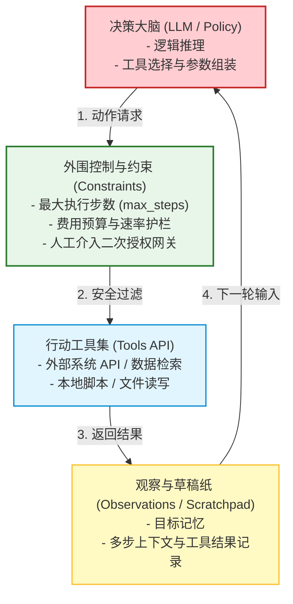
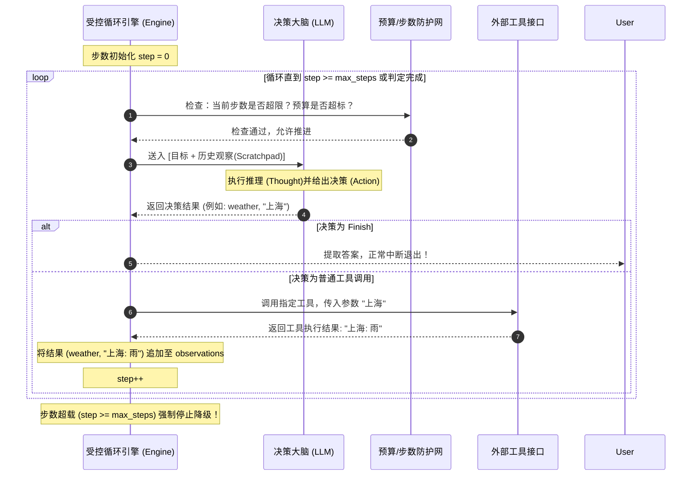
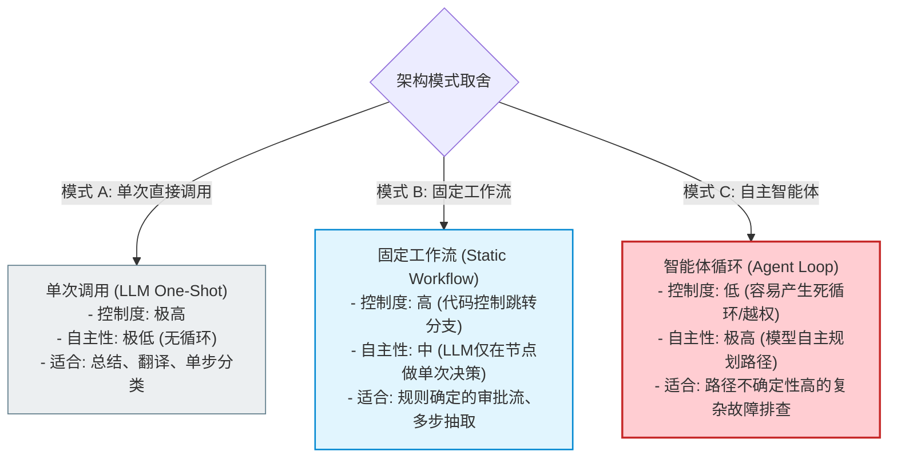

import GlossaryTerm from '@site/src/components/GlossaryTerm';
import GuidedExercise from '@site/src/components/GuidedExercise';
import ResearchNote from '@site/src/components/ResearchNote';
import ChapterMeta from '@site/src/components/ChapterMeta';
import PyRunner from '@site/src/components/PyRunner';
import TradeoffExplorer from '@site/src/components/TradeoffExplorer';
import StepFlow from '@site/src/components/StepFlow';
import QuizCard from '@site/src/components/QuizCard';

# M9L1 · Agent Loop 基础

<ChapterMeta
  time="约 2.5 小时"
  prereqs={[{label: 'M7L6 工具调用', href: '../llm-systems/structured-output-tools'}, {label: 'M7L12 LLM 管道', href: '../llm-systems/capstone-llm-app'}, {label: 'M6L2 调和循环', href: '../cloud-enterprise-industrial/kubernetes-basics'}]}
  outcome="能解释 Agent 的本质是“LLM 在一个受控循环里观察-决策-行动”、区分 Agent 和单次调用/固定 workflow，并实现一个带停止条件的 agent loop。"
  howToUse="先看“单次调用做不了多步任务”，再理解 agent loop，最后做受控循环 lab。"
/>

:::tip Agent = LLM + 一个循环。但能不能用，全看这个循环控制得好不好
[M7L12](../llm-systems/capstone-llm-app) 的管道是**单次**调用：问一次、答一次。但"帮我订一张满足这些条件的机票""调查这个 bug 的根因"这类任务，一次答不完——需要**多步**：看现状、决定下一步、做一步、看结果、再决定……把 LLM 放进这个**循环**，它就成了 Agent。本质很简单，难的是**让这个循环停得下、不跑偏、不闯祸**——这是本月的主题。
:::

## 一、有些任务，一次调用做不完

单次 LLM 调用（[M7L12](../llm-systems/capstone-llm-app)）适合"输入→输出"一步到位的任务（问答、分类、改写）。但很多任务是**多步、依赖中间结果**的：
- "查这三个城市明天的天气，推荐最适合户外的" → 要查三次、再综合。
- "找出代码库里所有用了废弃 API 的地方并列出" → 要搜索、读文件、逐个判断。
- "调查这个订单为什么没发货" → 要查订单、查库存、查物流，根据每步结果决定下一步查什么。

这些任务的下一步**取决于上一步的结果**，没法一次性写死。需要一个循环：**让模型看当前掌握的信息、决定下一步做什么、执行、把结果加进来、再决定**——直到任务完成。

## 二、三个核心概念（分层）

### 基础：Agent loop

<GlossaryTerm term="Agent" definition="智能体：在给定目标下，能观察现状、决定下一步、调用工具、根据结果继续推进任务的系统。LLM 通常是它的“决策大脑”，外面包着循环、工具、记忆、约束等工程。">Agent</GlossaryTerm> 的核心是一个受控的 <GlossaryTerm term="Observe-Decide-Act (ODA循环)" definition="观察-决策-行动循环：智能体在运行期间的基础控制模型。观察外界反馈，由大模型大脑进行思维决策，最终调用对应工具产生行动，并把结果作为下一轮观察的输入。">观察-决策-行动循环</GlossaryTerm>：
1. **观察（observe）**：看当前状态——目标、已知信息、上一步工具结果。
2. **决策（decide/plan）**：LLM 根据观察，决定下一步——调哪个工具、传什么参数，或"任务完成、给出答案"。
3. **行动（act）**：执行模型决定的动作（[调工具 M7L6](../llm-systems/structured-output-tools)）。
4. **回到观察**：把行动结果加入状态，循环继续——直到模型说"完成"或触发[停止条件（M9L4）](./stopping-budget)。

**LLM 是这个循环里的"决策大脑"，但循环本身（怎么观察、怎么执行、何时停）是你写的工程代码。** 这和 [M6L2 K8s 调和循环](../cloud-enterprise-industrial/kubernetes-basics)（观察实际→对比期望→行动）异曲同工——都是"感知-决策-行动"的闭环。

### 进阶：Agent vs 单次调用 vs 固定 workflow

三者是一条自主性递增的谱系：
- **单次调用**：一问一答，无循环（[M7L12](../llm-systems/capstone-llm-app)）。最可控、最便宜，但只能做一步。
- <GlossaryTerm term="Workflow" definition="工作流：预先用代码写死步骤顺序的多步流程（步骤 A→B→C 固定）。可能每步调 LLM，但“下一步是什么”由代码决定，不由模型自主决定。确定、可控、可测。">固定 workflow</GlossaryTerm>：多步，但**步骤顺序由代码写死**（可能每步调 LLM，但流程固定）。确定、可控、好测。
- **Agent**：多步，且**"下一步做什么"由模型自主决定**。在决策过程中，模型通常利用 <GlossaryTerm term="Scratchpad (草稿纸/思考上下文)" definition="草稿纸/思考上下文：智能体用来记录多步执行期间的中间思考过程、工具调用返回与待完成子目标的内存机制。">Scratchpad (思考草稿纸)</GlossaryTerm> 来理清思路，实施如 <GlossaryTerm term="ReAct (推理-行动框架)" definition="推理-行动框架：一种将大模型的逻辑推理（Thought）与行动调用（Action）紧密结合的提示词工程范式，使模型能在行动前生成思维链。">ReAct</GlossaryTerm> 的推理与行动推进。最灵活（能处理预先不知道步骤的任务），但最难控（会跑偏、循环、闯祸）。
- **关键判断**：步骤能预先写死的，用 workflow（更可靠）；步骤依赖运行时结果、无法预先确定的，才用 Agent（[M9L11 详谈](./when-not-agent)）。

### 深入（选学）：从循环本质推出 Agent 的工程挑战

把"LLM 在循环里自主决策"想透，本月所有挑战都自然导出：
- **会不停**：模型可能永远不说"完成"，或反复试同一个失败动作 → 必须有[停止条件、最大步数、循环检测（M9L4）](./stopping-budget)。
- **会闯祸**：模型自主决定调工具，如果工具危险（删数据/花钱）→ 必须有[权限、预算、危险动作护栏（M9L2/L9）](./tools-and-boundaries)。
- **会忘事**：多步之间要记住目标、已做的事、中间结果 → 需要[记忆/scratchpad（M9L6）](./agent-memory)。
- **会跑偏**：复杂任务要先规划再执行、错了要反思纠正 → [规划（M9L5）](./planning-decomposition) + [反思（M9L7）](./reflection-correction)。
- **难调试**：要记录每一步的观察/决策/行动/结果（轨迹 trace），否则无法[评测和排错（M9L10）](./agent-evaluation)。
- **又慢又贵**：每步一次 LLM 调用，N 步就是 N 次（[成本叠加 M7L5](../llm-systems/llm-api-cost-latency)）→ 控制步数、能用 workflow 就别用 Agent。

<ResearchNote
  title="Agent：把 LLM 放进感知-决策-行动的循环"
  source="ReAct (Yao et al., 2022)；Russell & Norvig, AI: A Modern Approach（agent 定义）；现代 LLM agent 实践"
  href="https://arxiv.org/abs/2210.03629"
  insight="经典 AI 里 agent 就是“感知环境、自主行动以达成目标”的实体。LLM agent 把 LLM 作为决策大脑放进“观察-决策-行动-观察”的循环，使其能多步、依赖中间结果地推进任务。核心不是模型本身，而是包裹它的循环、工具、记忆和约束。"
  application="把需要多步、下一步依赖上一步结果的任务用 agent loop 实现：observe（收集状态）→ decide（LLM 选下一步）→ act（执行工具）→ 回到 observe，直到完成或触发停止条件。步骤能预先写死的用 workflow 更可靠.循环的约束（停止/预算/权限/记忆/评测）才是工程重点。"
/>

## 三、智能体循环与控制拓扑图解 (Deep Dive Diagrams)

本节展示智能体在运行期间如何将大模型脑部推理、行动工具反馈与外围工程防护网整合为稳定的闭环控制。

### 1. 结构全景：智能体系统四大核心工程要素

一个在生产环境下可靠运行的智能体，不仅需要一个“大脑”，更需要由观察草稿纸、工具集与护栏规则所组成的躯干。



### 2. 时序全景：受控智能体循环（Observe-Decide-Act Loop）时序流水线

在受控循环中，系统的第一要素是前置状态和步数检查，以防止失控漂移。



### 3. 比较全景：单次调用 vs. 固定工作流 vs. 自主智能体

自主性、灵活性与控制难度在不同应用范式中各具优劣，应根据业务特性进行系统性评估。



## 四、落地实践：受控智能体循环的生命周期阶段

在实现商用级 Agent Loop 时，系统在每个周期运行都需要经过如下四个受控的阶段：

<StepFlow
  steps={[
    {
      title: '1. 状态聚合与上下文组装 (State Aggregation)',
      desc: '在每一轮循环起点，将全局目标、现有 Observations 历史轨迹组装成特定格式（如 Scratchpad），提供给决策大脑。',
      diagram: '全局目标 + 历史轨迹 ──> 结构化上下文 ──> 注入 LLM 大脑'
    },
    {
      title: '2. 脑部推理与决策输出 (Brain Reasoning & Plan)',
      desc: '大模型进行一步逻辑推理（Thought），输出具体的行动意图（Action）与对应的输入参数（Arg）。',
      diagram: '推理 (Thought) ──> 判定是完成 finish 还是调用工具 ──> 组装参数'
    },
    {
      title: '3. 步数与预算安全网拦截 (Gatekeeping Check)',
      desc: '在调用真实工具前，前置经过防护模块，验证当前执行步数未越界（小于 max_steps），且没有重复调用陷入死循环。',
      diagram: '判断步数 < max_steps ──> 防重拦截 ──> 鉴权放行'
    },
    {
      title: '4. 工具执行与观察回灌 (Execution & Observational Feedback)',
      desc: '物理运行工具 API，捕获返回输出，将 (Action, Result) 形式的观察结果追加至历史记忆库，开启下一轮迭代。',
      diagram: '工具执行 ──> 捕获结果 ──> 记忆回灌 ──> 步数递增 step++'
    }
  ]}
/>

## 五、跟我做一遍：一个受控的 Agent Loop

<PyRunner
  rows={38}
  expect="多步推进直到完成或达上限"
  code={`# Agent loop 骨架：observe -> decide -> act -> 回到 observe，带停止条件
def run_agent(goal, policy, tools, max_steps=10):
    state = {"goal": goal, "observations": [], "done": False, "answer": None}
    trace = []
    for step in range(max_steps):
        # 1) decide：LLM(这里用 policy 模拟) 根据状态决定下一步
        decision = policy(state)
        trace.append((step, decision["action"], decision.get("arg")))
        # 2) 完成判断
        if decision["action"] == "finish":
            state["done"] = True
            state["answer"] = decision["arg"]
            break
        # 3) act：执行工具，结果加入观察
        result = tools[decision["action"]](decision["arg"])
        state["observations"].append((decision["action"], result))
    return state, trace

# 模拟工具
def weather(city): return {"北京": "晴", "上海": "雨", "广州": "多云"}.get(city, "未知")
tools = {"weather": weather}

# 模拟“决策大脑”：还没查完三个城市就继续查下一个，查完就 finish
def policy(state):
    cities = ["北京", "上海", "广州"]
    n = len(state["observations"])            # 已查了几个
    if n < len(cities):
        return {"action": "weather", "arg": cities[n]}   # 查下一个
    return {"action": "finish", "arg": "综合天气: " + str(state["observations"])}

state, trace = run_agent("查三城天气", policy, tools, max_steps=10)
print("轨迹:", trace)
print("完成:", state["done"], "| 步数:", len(trace))
print("多步推进直到完成或达上限")`}
/>

模型在循环里一步步查天气、把结果加入观察、查完三个城市就 `finish`——这就是 agent loop 的骨架：observe→decide→act→observe，带 `max_steps` 兜底防失控。**试试**：把 max_steps 设成 2，看任务没完成就被强制停（停止条件的重要性）；想想如果 policy 永远不 finish 会怎样（下节课的循环检测）。

## 六、动手 Lab（必做）

打开 `labs/month09/m9l1_agent_loop/`：

```bash
python labs/month09/m9l1_agent_loop/test_agent_loop.py
```

实现受控 agent loop：observe→decide→act 循环、finish 时停止、达 max_steps 强制停、返回完整轨迹。

<GuidedExercise
  title="练习指引：实现 agent loop"
  goal="把“观察-决策-行动-观察 + 停止条件”做成代码——Agent 的核心骨架。"
  hints={[
    'run_agent：循环里调 policy(state) 得到决策，action=="finish" 则停。',
    '其它 action 当工具名，执行后把 (action, result) 加入 observations。',
    '记录 trace（每步的 action/arg），用于评测和排错。',
    'max_steps 是必须的兜底——防止永不结束。'
  ]}
  steps={[
    '实现 run_agent(goal, policy, tools, max_steps)。',
    '循环：decide → finish 判断 → act → 更新 state。',
    '返回 (最终 state, trace)。',
    '写测试：正常完成、达 max_steps 强制停、轨迹记录正确、工具结果进入观察。'
  ]}
  checks={[
    '你能解释 Agent 的 observe-decide-act 循环。',
    '你的 lab loop 能完成任务、也能被 max_steps 兜住。',
    '你能区分单次调用/固定 workflow/Agent。',
    '你能说出自主循环带来的几类失控风险。'
  ]}
/>

## 七、架构师深潜（Staff+ 视角）

### 1. 自主性谱系

<TradeoffExplorer
  title="从单次调用到 Agent 的自主性谱系"
  dimensions={['处理复杂任务', '可控/可靠', '可测试', '成本/延迟低', '调试难度低']}
  options={[
    {
      name: '单次 LLM 调用',
      scores: [1, 5, 5, 5, 5],
      note: '一问一答。最可控、最便宜、最好测，但只能做一步。',
      whenToUse: '一步到位的任务（问答/分类/改写）。'
    },
    {
      name: '固定 workflow',
      scores: [3, 4, 4, 4, 4],
      note: '步骤代码写死、可能每步调 LLM。确定可控，但只能处理预知流程。',
      whenToUse: '多步但步骤可预先确定——优先于 Agent。'
    },
    {
      name: 'Agent（自主循环）',
      scores: [5, 2, 2, 1, 2],
      note: '模型自主决定步骤、最灵活。但会失控/闯祸/慢/贵/难测，需大量约束。',
      whenToUse: '步骤依赖运行时结果、无法预先写死时。'
    }
  ]}
/>

### 2. Agent 的难点不在“决策大脑”，在“循环的工程”

新手做 Agent 容易把全部精力放在“怎么让模型决策更聪明”（调 prompt、换更强模型）。但 Agent 能不能上生产，**主要取决于循环的工程约束**——停得下吗（停止条件）、不闯祸吗（权限/护栏）、记得住吗（记忆）、查得清吗（轨迹/评测）、不烧穿吗（预算）。这正是前八个月工程思维在 Agent 上的集中体现：把一个**不可靠、会自主行动**的组件，用循环控制、约束、观测包裹成可靠系统。**“Agent 的智能在模型，可靠性在工程”**——这是本月最该带走的认知，也是 [M7L9 “把不可靠组件用可靠”](../llm-systems/hallucination-guardrails) 的升级版（现在这个组件还会自己行动）。

### 3. 真实案例：从“惊艳 demo”到“不敢上线”

Agent 是 demo 最炫、上生产最难的一类 AI 系统。一个 Agent demo 自主完成复杂任务令人惊艳，但真上线常发现：偶尔陷入死循环烧掉一大笔 token、某次自主调用了危险工具造成事故、复杂任务做到一半跑偏且无法复现、出问题不知道是哪一步错的。能跨过这道鸿沟的，不是更强的模型，而是本月这套约束工程：受控 loop + 工具边界 + 停止预算 + 护栏 + 评测。**判断一个团队的 Agent 是否成熟，看的不是它能做多惊艳的 demo，而是它失控/闯祸时会怎样、以及能不能评测和复现。**

### 4. 架构师深问（给自己 30 分钟）

- 你想做的“Agent 任务”，真的需要 Agent 吗？步骤能不能预先写成 workflow（更可靠便宜）？
- 你的 agent loop 有最大步数 and 停止条件吗？模型永不说“完成”会怎样？
- 你记录每一步的轨迹（观察/决策/行动/结果）吗？出问题能定位到是哪一步、能复现吗？

## 知识自测

<QuizCard
  questions={[
    {
      q: '在构建生产级 AI Agent 系统时，以下哪一种说法最准确地描述了系统可靠性的来源？',
      options: [
        'A. 系统可靠性 100% 依赖于底层大模型是否拥有千亿级以上的超大规模参数',
        'B. 大模型仅作为决策大脑提供了逻辑推理能力，而系统的可靠度则完全建立在包裹它的外围工程约束（如最大步数限制、工具鉴权、记忆草稿纸和运行轨迹观测）上',
        'C. 只要把 Sampling Temperature 采样温度设为 0，Agent 循环就绝对不可能发生死循环或跑偏',
        'D. 应该取消一切外部代码拦截，让大模型完全自主掌控计算机'
      ],
      answer: 1,
      explain: '智能体不仅会做出判断，还会自主通过工具接口对物理世界产生副作用。大模型本身缺乏严格的确定性隔离，系统能否在生产上线，完全取决于外围工程为它建立的安全控制循环防护网。'
    },
    {
      q: '当面对一个复杂的企业业务逻辑时，架构师在“固定 Workflow”与“自主 Agent Loop”之间进行方案选型的第一工程原则是什么？',
      options: [
        'A. 无论步骤是否清晰，直接全部引入自主 Agent 以跟上最新技术潮流',
        'B. 只要步骤和逻辑流能够预先编写死，应毫不犹豫地选用确定性的固定 Workflow，仅当下一步完全依赖运行时中间结果、且可能产生无穷路径时才使用 Agent',
        'C. 必须先通过大模型裁判（LLM-as-judge）跑三天评估，然后再决定是否使用 Agent',
        'D. 对高成本、高延迟节点一律使用自主 Agent 循环以加快响应速度'
      ],
      answer: 1,
      explain: '依据 YAGNI 与奥卡姆剃刀原则，固定工作流由于状态跳转完全在代码控制内，具有极高的可预测性、可测性与低成本延迟。只有在任务路径彻底无法预知、高度依赖环境动态反馈的多步复杂探索时，才推荐付出高额成本部署 Agent。'
    },
    {
      q: '为什么在生产级 Agent 循环中，最大执行步数（max_steps）是一个不可或缺的兜底条件？',
      options: [
        'A. 为了降低向量数据库中 Embedding 向量计算的平均延迟',
        'B. 大模型在遭遇外部状态异常或工具报错时，经常会陷入反复重试同一个失败动作的“逻辑鬼打墙”或进入死循环，限制步数是防止 Token 账单被烧穿和系统资源耗尽的硬防线',
        'C. 为了防止大模型因为等待过久而发生内存溢出报错',
        'D. 只要设置了该参数，智能体便能在第 1 步直接给出最终答案'
      ],
      answer: 1,
      explain: '自主循环的一大天然隐患是“不停机”，大模型在复杂的环境负反馈中可能由于逻辑自洽缺陷永远不发出 finish 信号，甚至无限重试。外围代码强制进行 max_steps 的硬约束是防御死循环的基本防御手段。'
    }
  ]}
/>

## 自检清单

- [ ] 我能解释 Agent 的 observe-decide-act 循环本质。
- [ ] 我的 lab agent loop 能完成任务、也被 max_steps 兜住。
- [ ] 我能区分单次调用/固定 workflow/Agent 及取舍。
- [ ] 我理解 Agent 可靠性主要来自循环的工程约束。

## 常见误解

- **“Agent 就是让模型自由发挥”**：那是不可控的 demo；生产 Agent 是受控循环 + 大量约束。
- **“Agent 越自主越好”**：自主性越高越难控越贵，能用 workflow 就别用 Agent。
- **“Agent 难在让模型更聪明”**：难在循环的工程（停止/权限/记忆/评测），不在模型本身。

## 延伸阅读

- [ReAct (Yao et al., 2022)](https://arxiv.org/abs/2210.03629)
- [Anthropic: Building effective agents](https://www.anthropic.com/research/building-effective-agents)
- [下一课：工具使用与边界](./tools-and-boundaries)
