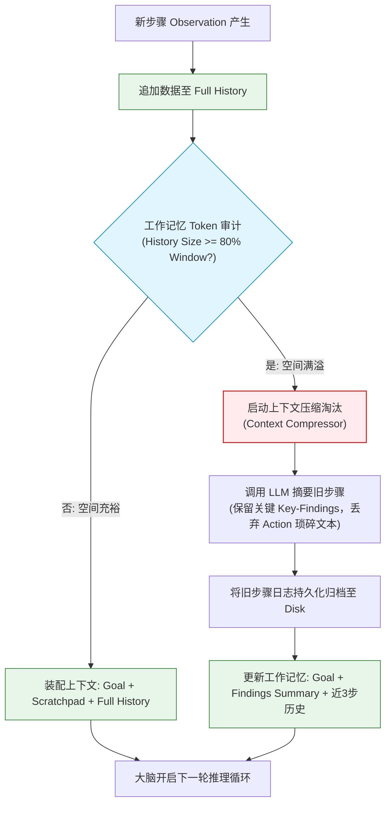

import GlossaryTerm from '@site/src/components/GlossaryTerm';
import GuidedExercise from '@site/src/components/GuidedExercise';
import ResearchNote from '@site/src/components/ResearchNote';
import ChapterMeta from '@site/src/components/ChapterMeta';
import PyRunner from '@site/src/components/PyRunner';
import TradeoffExplorer from '@site/src/components/TradeoffExplorer';
import StepFlow from '@site/src/components/StepFlow';
import QuizCard from '@site/src/components/QuizCard';

# M9L6 · Agent 记忆

<ChapterMeta
  time="约 2.5 小时"
  prereqs={[{label: 'M7L8 上下文管理', href: '../llm-systems/context-memory'}, {label: 'M9L5 规划', href: './planning-decomposition'}, {label: 'M8 RAG', href: '../rag/overview'}]}
  outcome="能为多步 Agent 设计记忆：用 scratchpad 维护当前任务状态、用外部存储做长期记忆、并在 token 预算内管理，避免 Agent“忘了在干嘛”。"
  howToUse="先看“多步后 Agent 忘了目标”，再理解 scratchpad 和长短期记忆，最后做 agent 记忆 lab。"
/>

:::tip Agent 是多步的，但 LLM 是无状态的——记忆这个鸿沟必须你来填
[M7L8](../llm-systems/context-memory) 说过 LLM 无状态、记忆靠每次拼装上下文。Agent 把这个问题放大了：它要跑**很多步**，每步都要记得**目标是什么、已经做了什么、中间得到了什么结果**——否则会在循环里"忘了自己在干嘛"，重复劳动、偏离目标、用过时信息。所以 Agent 必须有专门的记忆：**scratchpad（当前任务的工作记忆）+ 外部存储（跨任务的长期记忆）**。
:::

## 一、多步之后，Agent 忘了在干嘛

没有好记忆的 Agent，跑几步就出问题：
- **忘了目标**：第 8 步时忘了最初要完成什么，开始偏题。
- **重复劳动**：忘了第 3 步已经查过某信息，第 9 步又查一遍。
- **丢失中间结果**：第 5 步算出的关键数据，第 10 步要用时找不到了。
- **上下文爆炸**：把所有步骤的完整记录都塞进上下文，很快[超 **<GlossaryTerm term="Context Window" definition="上下文窗口：大语言模型在单词交互中能够接收并处理的最大 Token 数量上限。限制了智能体的单次工作记忆容量。">上下文窗口 (Context Window)</GlossaryTerm>**、又贵又慢（[M7L2](../llm-systems/tokenization-context)）]。

这都是因为没有专门管理 Agent 的状态。记忆要解决两件事：**让 Agent 在多步中保持连贯**，且**不超 token 预算**。

## 二、三个核心概念（分层）

### 基础：scratchpad（工作记忆）

<GlossaryTerm term="Scratchpad" definition="草稿本/工作记忆：Agent 在一次任务执行中维护的结构化状态——目标、计划进度、已做的步骤、中间结果。每步决策时把它（或其摘要）放进上下文，让 Agent 记得自己在干嘛。">scratchpad（草稿本）</GlossaryTerm>：Agent 在一次任务里维护的**工作状态**——目标、[计划进度（M9L5）](./planning-decomposition)、已执行的动作和结果、关键中间数据。每步决策时，把 scratchpad（或它的摘要）放进上下文，模型就"记得"自己在干嘛。[ReAct 的 Thought/Observation 轨迹（M9L3）](./react-pattern) 本身就是一种 scratchpad——把"想了什么、做了什么、看到什么"记下来供后续步骤参考。

### 进阶：短期/长期/外部记忆

Agent 记忆分三类（[呼应 M7L8](../llm-systems/context-memory)）：
- **短期记忆**：当前任务的 scratchpad（任务结束就清）。风险：**<GlossaryTerm term="Short-term Memory" definition="短期记忆：在 AI Agent 中，通常指在单次任务执行生命周期内，为了维持上下文连贯而保存在上下文窗口中的结构化草稿纸（Scratchpad）或交互历史。">短期记忆</GlossaryTerm>** [上下文污染/爆炸（M7L2）](../llm-systems/tokenization-context)——要摘要、要只留相关的。
- **长期记忆**：跨任务/跨会话要记的（用户偏好、历史项目、学到的经验），存外部（数据库/[**<GlossaryTerm term="Vector Database" definition="向量数据库：专门用于存储和高维向量相似度检索的非关系型数据库。常在长期记忆中作为 Agent 的大容量外部知识存储仓库。">向量数据库</GlossaryTerm>** M8](../rag/overview)），需要时**检索**回来（[这就是 RAG 用在记忆上](../rag/overview)）。风险：隐私、过期信息。
- **外部记忆**：文件系统、数据库、[RAG 知识库](../rag/overview)——Agent 把它们当作可读写的"外部大脑"，不必全塞进上下文。风险：检索错误、[权限越界（M8L10）](../rag/advanced-rag)。

### 深入（选学）：记忆的工程要点

- **记忆 = 上下文工程**：每步该把什么放进上下文，是 Agent 的核心设计——目标 + 计划进度 + 最近几步 + 相关检索结果，而非全部历史。在 [token 预算内（M7L2）](../llm-systems/tokenization-context) 精选，用摘要压缩旧步骤（[M7L8 摘要淘汰](../llm-systems/context-memory)）。
- **结构化 scratchpad 比纯文本好**：把状态存成结构化字段（goal、done_steps、findings、next）而非一坨文本——更可靠、可校验、可程序化更新，模型也更不容易忘/乱。
- **"读 vs 写"记忆**：Agent 既从记忆读（决策时），也往记忆写（记下新结果/经验）。写记忆要去重、要判断"值不值得记"（[呼应 M8L11 知识库去重/新鲜度](../rag/knowledge-base-ops)）。
- **记忆是 Agent 区别于单次调用的关键**：单次调用无状态、Agent 靠记忆维持多步连贯——记忆做得好坏，直接决定 Agent 能不能完成长任务（[呼应 M7L8 上下文工程是竞争力](../llm-systems/context-memory)）。
- **别过度**：简单短任务，[ReAct 轨迹](./react-pattern) 当 scratchpad 就够了，不必上复杂的长期记忆架构（[YAGNI](../design-patterns-lld/change-driven-design)）。长期记忆只在真的需要跨任务记忆时才加。

<ResearchNote
  title="Agent 记忆：用 scratchpad 维持连贯、用外部存储扩展容量"
  source="ReAct（推理轨迹即记忆）；MemGPT（分层记忆，M7L8）；Agent memory 实践"
  href="https://arxiv.org/abs/2310.08560"
  insight="Agent 多步执行需要记住目标、进度、中间结果——靠 scratchpad（工作记忆，放进上下文）维持连贯，靠外部存储（数据库/向量库）做长期/大容量记忆按需检索。核心是上下文工程：在 token 预算内精选该让模型看到的状态，用摘要压缩、结构化存储提升可靠性，避免上下文爆炸和遗忘。"
  application="给多步 Agent 设计 scratchpad（结构化存目标/进度/findings），每步放进上下文；跨任务记忆存外部、按需检索（RAG）；在 token 预算内精选+摘要；写记忆时去重判值。简单短任务用 ReAct 轨迹即可，按需加长期记忆，别过度。"
/>

### 技术架构图解与生命周期演示 (Deep Dive Diagrams & Lifecycle)

#### 1. Agent 分层记忆系统架构 (Hierarchical Memory Architecture)

```mermaid
graph TD
    classDef brain fill:#e1f5fe,stroke:#0288d1,stroke-width:1.5px;
    classDef working fill:#fff9c4,stroke:#fbc02d,stroke-width:1px;
    classDef session fill:#e8f5e9,stroke:#2e7d32,stroke-width:1px;
    classDef external fill:#eceff1,stroke:#607d8b,stroke-width:1px;

    LLM["LLM 决策大脑 (LLM Core)"]:::brain
    
    subgraph ContextMemory [工作/短期记忆 (Context Working Memory - RAM)]
        Scratchpad["结构化草稿纸 (Scratchpad)<br/>- 核心目标 (Goal)<br/>- 规划进度 (Plan)<br/>- 关键观察 (Observations)"]:::working
    end

    subgraph CacheMemory [会话本地缓存 (Session RAM Cache)]
        FullHistory["完整轨迹日志 (Full History Log)<br/>- 原生 Thought/Action 历史"]:::session
    end

    subgraph LongtermStore [外部长期记忆 (Long-term DB Store - Disk)]
        VectorDB["外部向量数据库 (Vector DB)<br/>- 跨任务沉淀经验<br/>- 用户偏好画像 (Profiles)"]:::external
        RelationalDB["传统关系型数据库 / 文件系统<br/>- 归档的完工报告"]:::external
    end

    LLM <-->|1. 实时读取/装配| Scratchpad
    Scratchpad -.->|2. 满溢则滑入| FullHistory
    LLM <-->|3. 语义相似度检索| VectorDB
    LLM -->|4. 任务结束持久化回写| VectorDB & RelationalDB
```

#### 2. 记忆写入与压缩淘汰控制流 (Memory Condensation & Compression Flow)



#### 3. 跨会话长期记忆检索与对齐时序 (Cross-Session Long-Term Memory Sequence)

```sequenceDiagram
autonumber
    participant Orchestrator as 编排协调器 (Host)
    participant VectorDB as 向量记忆库 (Vector DB)
    participant LLM as LLM 大脑 (Brain)
    participant RelationalDB as 关系型数据库 (DB)

    Orchestrator->>VectorDB: 1. 语义检索 (Query: "用户偏好 / 之前是如何做竞品分析的")
    VectorDB-->>Orchestrator: 返回: "用户喜欢以表格输出对比，不想要冗长字眼"
    
    Orchestrator->>Orchestrator: 2. 装配工作上下文 (将偏好注入 Scratchpad)
    Orchestrator->>LLM: 3. 执行单步推理与动作
    LLM-->>Orchestrator: 返回结果: 分析完工
    
    Orchestrator->>RelationalDB: 4. 写入完工报告
    Orchestrator->>LLM: 5. 提取复盘经验 ("这次任务有什么跨会话的经验学到了?")
    LLM-->>Orchestrator: 返回: "竞品 B 备用数据源解析速率更高"
    
    Orchestrator->>VectorDB: 6. 将新经验转换为 Embedding 存入长期记忆
```

#### 4. 交互演示：记忆装配与回写流程

以下展示了 Agent 在执行复杂任务时，记忆各分层机制协作的五个具体阶段：

<StepFlow
  steps={[
    {
      title: '1. 检索用户偏好与对齐初始化',
      desc: '在任务启动阶段，系统从外部向量库中检索关于该任务或当前用户的历史偏好，并注入 Scratchpad 作为全局提示词。',
      diagram: '启动 ──> 检索向量库 ──> 读出: 用户喜欢简洁表格 ──> 固化进 Scratchpad.goal'
    },
    {
      title: '2. 动态短期状态维护',
      desc: '随着步骤推进，Scratchpad 动态记录“已完成任务”和“核心 Findings”，保证模型在每步调用时绝不重复劳动。',
      diagram: '执行查竞品A ──> done.append("查竞品A") ──> findings.update({"A价格": 100})'
    },
    {
      title: '3. Token 警戒线审查与溢出拦截',
      desc: '在每一轮装配 context 时，系统审计 Token 计数。若累积的历史轨迹过厚导致接近上下文窗口警戒线，触发自动淘汰。',
      diagram: '计数: 6600 Tokens ──> 阈值: 8000 Tokens (80%) ──> 触发压缩淘汰机制'
    },
    {
      title: '4. 垃圾回收与摘要压缩 (Condensation)',
      desc: '调用副脑 LLM 对前 10 步的琐碎交互日志进行抽取，凝练为 150 Tokens 的“关键事实纪要”，并将原始日志归档，空出 Token 槽位。',
      diagram: '旧步骤 (3000t) ──> LLM 摘要 ──> 事实纪要 (150t) ──> 释放窗口空间'
    },
    {
      title: '5. 复盘提炼与长期记忆固化',
      desc: '任务执行 finish 阶段。Host 调用 LLM 进行最终复盘，提取对未来具有通用参考价值的经验（如哪些数据源更可靠），存入向量库持久化。',
      diagram: '提取经验: 竞品B备用源响应快 ──> 转向量 ──> 写入 Vector DB 长期记忆'
    }
  ]}
/>

## 三、跟我做一遍：带 scratchpad 的 Agent 记忆

<PyRunner
  rows={38}
  expect="记住目标和已做的、不重复"
  code={`class Scratchpad:
    def __init__(self, goal, budget=200):
        self.goal = goal
        self.done = []          # 已完成的动作
        self.findings = {}      # 中间结果 (key -> value)
        self.budget = budget

    def record(self, action, result):
        self.done.append(action)
        if isinstance(result, dict):
            self.findings.update(result)

    def already_did(self, action):
        return action in self.done           # 避免重复劳动

    def context(self):
        # 每步放进上下文的“工作记忆”：目标 + 进度 + 关键发现（在预算内）
        ctx = "目标:%s | 已做:%s | 发现:%s" % (self.goal, self.done, self.findings)
        return ctx[:self.budget]              # 超预算截断（真实用摘要）

pad = Scratchpad("调研3家竞品并对比价格")
# Agent 每步先看记忆决定下一步
def step(pad, action, result):
    if pad.already_did(action):
        return "SKIP(已做过): " + action      # 记忆防重复
    pad.record(action, result)
    return "DONE: " + action

print(step(pad, "查竞品A价格", {"A价格": 100}))
print(step(pad, "查竞品B价格", {"B价格": 200}))
print(step(pad, "查竞品A价格", {"A价格": 100}))   # 重复 -> 被记忆挡下
print("当前记忆:", pad.context())
print("还记得目标:", pad.goal in pad.context())
print("记住目标和已做的、不重复")`}
/>

scratchpad 让 Agent 记得目标、已做的动作、中间发现——重复的动作被挡下，多步后仍记得最初目标。**试试**：把 budget 设很小，看 context 被截断（真实系统这时该用摘要而非粗暴截断）；想想"竞品 C 还没查"这个进度该怎么表示在记忆里。

## 四、动手 Lab（必做）

打开 `labs/month09/m9l6_memory/`：

```bash
python labs/month09/m9l6_memory/test_memory.py
```

实现 Agent scratchpad：记录已做动作和中间发现、防止重复、在预算内提供工作记忆上下文。

<GuidedExercise
  title="练习指引：实现 Agent scratchpad"
  goal="把“目标 + 进度 + 发现 + 防重复”做成代码——Agent 多步连贯的工作记忆。"
  hints={[
    'Scratchpad 存 goal、done（已做动作）、findings（中间结果）。',
    'record：追加动作、合并 dict 结果到 findings。',
    'already_did：判断动作是否做过（防重复）。',
    'context：拼出目标+进度+发现，在预算内（超了截断/摘要）。'
  ]}
  steps={[
    '实现 Scratchpad：record / already_did / context。',
    'record 把 dict 结果合并进 findings。',
    'context 在 budget 内返回工作记忆。',
    '写测试：记录动作、合并发现、防重复、context 含目标、超预算截断。'
  ]}
  checks={[
    '你能解释 Agent 为什么需要 scratchpad。',
    '你的 lab 能记进度/发现、防重复、控预算。',
    '你能区分短期(scratchpad)/长期(外部检索)记忆。',
    '你理解记忆本质是上下文工程、别过度。'
  ]}
/>

## 架构师深潜（Staff+ 视角）

### 1. Agent 记忆类型

<TradeoffExplorer
  title="Agent 记忆方案"
  dimensions={['维持多步连贯', '跨任务记忆', 'token 成本', '实现简单', '可靠性']}
  options={[
    {
      name: 'ReAct 轨迹即记忆',
      scores: [3, 1, 3, 5, 3],
      note: '把 Thought/Action/Observation 当 scratchpad。简单，但长任务会撑爆上下文、无跨任务记忆。',
      whenToUse: '简单短任务——够用。'
    },
    {
      name: '结构化 scratchpad + 摘要',
      scores: [5, 1, 4, 3, 4],
      note: '结构化存状态、摘要压缩旧步骤。维持长任务连贯、控预算。无跨任务记忆。',
      whenToUse: '复杂多步的单任务。'
    },
    {
      name: '+ 外部长期记忆(检索)',
      scores: [5, 5, 4, 2, 4],
      note: '加数据库/向量库做跨任务记忆、按需检索。最完整，但最复杂、有检索/权限风险。',
      whenToUse: '需跨任务/跨会话记忆时。'
    }
  ]}
/>

### 2. "上下文工程"是 Agent 的核心竞争力

到这里你会发现，Agent 的很多能力——[记忆、规划进度、ReAct 轨迹](./react-pattern)——本质都是同一件事：**每一步该把什么信息放进模型的上下文窗口**。这就是"上下文工程"（[M7L8 提过](../llm-systems/context-memory)）：在有限的 token 预算里，精选出"模型这一步决策真正需要看到的"——目标、计划进度、最近几步、相关检索结果、关键发现——而非把所有历史一股脑塞进去。做得好，Agent 连贯、省钱、不迷路；做得差，要么忘事、要么[上下文爆炸又贵又慢又 **<GlossaryTerm term="Lost in the Middle" definition="迷失在中间：大模型在处理超长上下文时，容易过度关注最开始和最结尾的信息，而忽略/遗忘中间段落内容的现象。">迷失在中间 (Lost in the Middle)</GlossaryTerm>** （[M7L2](../llm-systems/tokenization-context)）]。**同样的模型、同样的工具，上下文工程的好坏能让 Agent 的表现天差地别**——这正在成为 Agent 系统最吃功力的部分，也是架构师最该投入的地方。

### 3. 真实案例：长任务 Agent 的"金鱼记忆"问题

让 Agent 做长任务（几十步的复杂工作）时，一个反复出现的问题是"金鱼记忆"：跑到后面忘了前面的关键信息、忘了目标、重复已做的事——因为要么没好好维护 scratchpad，要么把所有历史塞进上下文导致关键信息被淹没（迷失在中间）。修法就是本课的上下文工程：结构化 scratchpad 维护目标和进度、摘要压缩旧步骤、相关信息按需检索而非全塞、防重复。成熟的长任务 Agent 在记忆管理上投入很大。这也再次印证全月主线：**Agent 的可靠性不在模型多聪明，而在你把它的状态、上下文、约束管理得多好。**

### 4. 架构师深问（给自己 30 分钟）

- 你的 Agent 跑长任务时会"忘事"或重复劳动吗？它的 scratchpad 怎么维护目标和进度？
- 你每步放进上下文的是"全部历史"还是"精选的相关状态"？长任务会不会上下文爆炸/迷失在中间？
- 你需要跨任务/跨会话记忆吗（用户偏好、历史经验）？存哪、怎么检索、怎么防过期和越权？

## 知识自测

<QuizCard
  questions={[
    {
      q: '关于类比计算机操作系统的 Agent 分层记忆系统（如 MemGPT 的设计），以下哪一项描述是正确的？',
      options: [
        'A. 大模型的浮点数参数矩阵类似于主板上的 RAM，是随时可以读写的临时工作空间',
        'B. 上下文窗口（Context Window）类似于 CPU 的 RAM 运行内存，提供极快但容量受限的“工作记忆”；而向量数据库（Vector DB）则类似于 Disk 硬盘，提供慢速但大容量的“外部长期记忆”',
        'C. 向量数据库的检索速度比大模型上下文窗口的直接检索快 100 倍以上，因此应完全废弃短期工作记忆',
        'D. 只要模型开启了长期记忆，大模型的输入窗口限制就自动消失了'
      ],
      answer: 1,
      explain: '在分层记忆模型中，大模型无状态，其上下文窗口（RAM）是其直接用于推理的短期工作记忆（Scratchpad），但容量有限且价格昂贵。外部长期存储（Vector DB/Disk）提供了海量的跨任务冷数据存取，系统需通过检索将长期记忆按需拉回短期记忆中。'
    },
    {
      q: '在长链 Agent 运行中，将每一次工具调用的原始 XML 或 JSON 返回一字不漏地追加到上下文里，会有什么隐患？',
      options: [
        'A. 会导致大模型的 Temperature 参数漂移，产生随机性错误',
        'B. 会迅速撑爆上下文窗口（Context Window）造成成本剧增与首字延迟飙升，并且超长上下文容易触发大模型“迷失在中间（Lost in the Middle）”的缺陷，导致关键信息被淹没',
        'C. 大模型无法识别包含换行符的 JSON 字符串',
        'D. 会使外部向量库中的数据发生逻辑越权错误'
      ],
      answer: 1,
      explain: '直接将原始详细日志堆砌在上下文中是极其简陋的设计。大模型处理超长输入不仅贵且慢，还会引发“Lost in the Middle”的注意力分散。优秀的设计应该进行结构化维护并使用 LLM 进行摘要淘汰压缩（Condensation）。'
    },
    {
      q: '如果需要构建一个跨越多个独立任务会话（比如今天帮用户订机票，明天帮用户查酒店）的客服 Agent，架构师首选的记忆管理设计是什么？',
      options: [
        'A. 把今天订机票的所有原生 Trace 记录一直保存在内存中，第二天接着使用',
        'B. 开启跨任务长期记忆（Long-term Memory），在会话结束时通过大模型提取用户偏好画像（如“不爱坐早班机”），将其以 Embedding 形式固化至外部向量库，在新会话开始前进行语义检索拉回',
        'C. 强行要求用户每天重写一遍旅行偏好 prompt',
        'D. 允许大模型直接读写环境的物理内存，绕过向量数据库'
      ],
      answer: 1,
      explain: '跨任务/跨会话的记忆是“长期记忆”的经典用例。通过在会话尾声进行“记忆固化”，提炼高价值画像经验，并在新会话前“按需激活（Recall）”，能够兼顾个性化服务与极低的 Token 开销。'
    }
  ]}
/>

## 自检清单

- [ ] 我能解释 Agent 为什么需要 scratchpad 维持多步连贯。
- [ ] 我的 lab 能记进度/发现、防重复、控 token 预算。
- [ ] 我能区分短期(scratchpad)/长期(外部检索)记忆。
- [ ] 我理解记忆本质是上下文工程、是 Agent 核心竞争力。

## 常见误解

- **“把所有的工具调用、步骤日志一字不落塞进 Context 就是完美的记忆”**：这是最直觉也是最粗暴的错误方法。这不仅会造成 Token 账单的爆炸，还会因为无关的噪音细节过多，触发“迷失在中间”现象，导致模型彻底忘掉最初的 Goal。上下文必须经过精选、过滤和摘要压缩。
- **“记忆是模型参数的一部分，模型升级了记忆力就自然变强”**：这是一个核心误区。大模型本身是无状态（Stateless）的。系统感知到的“记忆”，本质上是外围工程代码进行的**上下文装配与管理**。模型变聪明会提升理解上下文的能力，但如何收集、筛选、压缩、淘汰和召回记忆，是系统架构师的硬核功力。
- **“我的 Agent 很先进，必须引入向量数据库做长期记忆检索”**：根据 YAGNI 原则，对于绝大多数单次任务的 Agent（例如帮用户写一篇周报），ReAct 轨迹或结构化 Scratchpad 提供的短期工作记忆已完全足够。只有涉及跨任务沉淀、跨会话画像等业务场景，引入长期向量记忆库才具备投资回报比。

## 延伸阅读

- [MemGPT (2023)](https://arxiv.org/abs/2310.08560)
- [M7L8 上下文管理与记忆](../llm-systems/context-memory)
- [下一课：反思与自我纠错](./reflection-correction)
