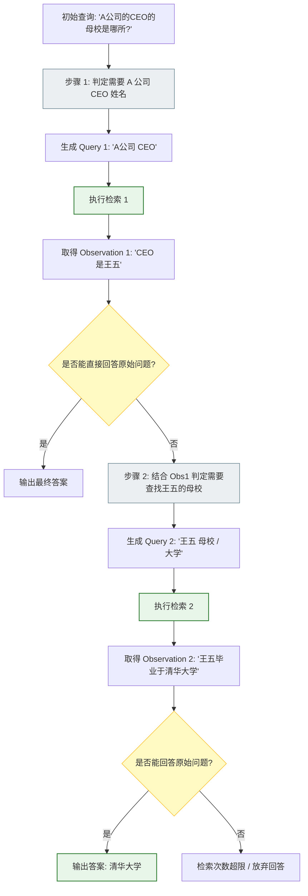

import GlossaryTerm from '@site/src/components/GlossaryTerm';
import GuidedExercise from '@site/src/components/GuidedExercise';
import ResearchNote from '@site/src/components/ResearchNote';
import ChapterMeta from '@site/src/components/ChapterMeta';
import PyRunner from '@site/src/components/PyRunner';
import TradeoffExplorer from '@site/src/components/TradeoffExplorer';
import StepFlow from '@site/src/components/StepFlow';
import QuizCard from '@site/src/components/QuizCard';

# M9L8 · Agentic 检索

<ChapterMeta
  time="约 2 小时"
  prereqs={[{label: 'M8 RAG', href: '../rag/overview'}, {label: 'M9L2 工具边界', href: './tools-and-boundaries'}, {label: 'M8L10 agentic RAG', href: '../rag/advanced-rag'}]}
  outcome="能把检索作为工具接进 Agent，让 Agent 自主决定是否检索、检索什么、是否够答、要不要再检索，并理解它相比固定 RAG 的取舍。"
  howToUse="先看“固定一次检索”的局限，再理解 agentic 检索，最后做自主检索决策 lab。"
/>

:::tip 把 M8 的 RAG，从“固定一步”变成 Agent 手里一个可反复使用的工具
[Month 8 的 RAG](../rag/overview) 是固定流程：每次都“检索一次→生成”。但有些问题不用检索（闲聊、常识）、有些要检索多次（**<GlossaryTerm term="Multi-hop Retrieval" definition="多跳检索：在知识问答中，需要多次迭代查询来串联逻辑链条的检索模式，通常前一步查询的结果作为下一步检索的线索前置条件。">多跳检索 (Multi-hop Retrieval)</GlossaryTerm>**、信息不够再查）、有些要选不同的源。把[检索做成一个工具（M9L2）](./tools-and-boundaries)、放进 [agent loop（M9L1）](./agent-loop-basics)，让 **Agent 自己决定何时检索、检索什么、够不够答、要不要再查**——这就是 agentic 检索（[M8L10 提过的 agentic RAG](../rag/advanced-rag)）。在这一领域，**<GlossaryTerm term="Self-RAG" definition="Self-RAG 框架：一种自我反思的检索增强生成框架。通过引入特殊的反思标记（Reflection Tokens），让模型能够在运行期间自主决定何时检索，以及自评检索文档的相关性和生成内容的 grounding 事实性。">Self-RAG 框架</GlossaryTerm>** 是一种非常有代表性的工作。它把 M8 和 M9 接到了一起。
:::

## 一、固定一次检索的局限

固定 RAG（[M8](../rag/overview)）“每次都检索一次再答”，但现实更复杂：
- **有些问题不该检索**：“你好”、“1+1 等于几”——检索纯属浪费，还可能引入无关噪声。
- **有些要检索多次**：[多跳问题（M8L10）](../rag/advanced-rag)（A 的经理的部门预算）、或第一次检索发现信息不够要再查。
- **有些要选源**：技术问题查文档库、订单问题查数据库——该按问题选不同的检索源。
- **检索够了没**：检索回来的够不够回答？不够该再查、还是该弃答？固定流程不会判断。

这些判断，正适合交给 [Agent 的自主决策（M9L1）](./agent-loop-basics)——把检索变成它能按需调用的工具。

## 二、三个核心概念（分层）

### 基础：检索作为工具

把 M8 的检索包装成 Agent 的一个[工具（M9L2）](./tools-and-boundaries)：`retrieve(query, source)`。然后在 [agent loop](./agent-loop-basics) 里，模型每步可以决定：调 retrieve（去查信息）、还是 finish（信息够了，给答案）。这样**“要不要检索”成了 Agent 的一个决策**，而非固定的第一步。<GlossaryTerm term="Agentic Retrieval" definition="智能体式检索：把检索作为 Agent 可调用的工具，由 Agent 自主决定是否检索、检索什么、用哪个源、检索几次、何时信息足够可以回答——而非固定检索一次再答的流程。">agentic 检索</GlossaryTerm> 的本质：检索从“流程里的固定一步”变成“Agent 工具箱里的一个工具”。

### 进阶：自主决策——查不查、查什么、够没够

Agent 在检索上能做几类自主决策：
- **要不要检索**：判断问题是否需要外部知识（闲聊/常识不需要，省一次检索）。
- **检索什么、用哪个源**：根据问题构造并重写查询（呼应 M8L7 **<GlossaryTerm term="Query Transformation" definition="查询改写 (Query Transformation)：将用户原始口语化查询翻译或改写为更利于向量数据库或搜索引擎索引的精准关键词的检索优化技术。">查询改写 (Query Transformation)</GlossaryTerm>**）、选合适的检索源（文档/数据库/网络）。
- **够不够答 / 要不要再查**：检索回来后判断信息是否足够——够了就答，不够就[再检索一次（多跳）](../rag/advanced-rag) 或换查询，实在不够就[弃答（M7L9）](../llm-systems/hallucination-guardrails)。
- 这就是把 [ReAct（M9L3）](./react-pattern) 用在检索上：Thought（我需要什么信息）→ Action（检索）→ Observation（看检索结果）→ Thought（够了吗）→ ...

### 深入（选学）：agentic 检索的取舍

- **更灵活但更慢更贵更难控**：固定 RAG 是一次检索（可预测、便宜），agentic 检索可能检索 0 到 N 次（灵活，但延迟/成本不确定、要[停止条件 M9L4](./stopping-budget) 防止反复检索）。这是 [M8L10 强调的取舍](../rag/advanced-rag)。
- **何时值得**：问题类型多样（有的不用查、有的要多跳）、需要动态选源、需要“查不够再查”时，agentic 检索的灵活性才值得它的成本。**单一类型的简单问答，固定 RAG 更可靠便宜**——别为了“agentic 听起来高级”就上（[YAGNI](../design-patterns-lld/change-driven-design)）。
- **继承 M8 的所有工程**：agentic 检索里每次使用 **<GlossaryTerm term="Semantic Search" definition="语义检索：基于文本词义的向量嵌入相似度，而非简单的字面关键词精确匹配来查找相关文档的检索技术。">语义检索 (Semantic Search)</GlossaryTerm>** 仍要[混合/重排/权限过滤（M8）](../rag/hybrid-search)、生成仍要[grounding/引用/弃答（M8L8）](../rag/rag-generation)——agentic 只是在外面套了“自主决定检索”的循环，不替代 M8 的检索质量工程。
- **检索工具也要有边界**：作为 [Agent 工具（M9L2）](./tools-and-boundaries)，检索要有权限过滤（[绝不检索越权内容 M8L10](../rag/advanced-rag)）、调用预算（防反复检索烧穿）、审计。

<ResearchNote
  title="Agentic 检索：让 Agent 自主决定检索策略"
  source="Self-RAG (Asai et al., 2023)；ReAct + 检索；M8 RAG 工程"
  href="https://arxiv.org/abs/2310.11511"
  insight="固定 RAG 总是检索一次，但很多问题不需要检索、或需要多次/多源/迭代检索。Agentic 检索把检索作为 Agent 工具，由模型自主决定是否检索、查什么、用哪个源、是否够答、要不要再查（Self-RAG 让模型学会按需检索并自评）。更灵活，但成本/延迟不确定、需停止条件，且仍依赖 M8 的检索质量和生成工程。"
  application="问题类型多样/需多跳/动态选源时，把检索做成 Agent 工具：每步判断查不查、查什么、够没够（ReAct 用在检索上），配权限/预算/停止条件。单一简单问答用固定 RAG 更稳更省。agentic 不替代 M8 的混合/重排/权限/grounding 工程。"
/>

### 技术架构图解与生命周期演示 (Deep Dive Diagrams & Lifecycle)

#### 1. 固定 RAG vs. Agentic 检索架构对比 (Pipeline-RAG vs. Agentic Retrieval)

```mermaid
graph TD
    subgraph FixedRAG [固定 RAG 管道 - 静态单向]
        UserQ1["用户提问 (Query)"] --> RetrieveOnce["检索工具 (1次强制拉取)"]
        RetrieveOnce --> ContextBox["上下文拼接 (Prompt Context)"]
        ContextBox --> LLMGen1["LLM 一次性生成 (Generation)"]
        LLMGen1 --> Answer1["交付答案"]
    end

    subgraph AgenticRAG [Agentic 检索回路 - 动态闭环]
        UserQ2["用户提问 (Query)"] --> AgentLoop["LLM 智能体决策环 (Agent Loop)"]
        AgentLoop -->|思考: 不需要检索| DirectAnswer["直接回答/闲聊"]
        AgentLoop -->|思考: 需要事实支持| CallRetrieve["调用 retrieve(q, source)"]
        CallRetrieve --> VectorDB["向量库 / 外部源"]
        VectorDB -->|返回 chunk| SaveFindings["将 Observation 暂存至 Scratchpad"]
        SaveFindings --> CheckEnough{"信息是否足够?<br/>(Grounding Check)"}
        CheckEnough -->|是| DirectAnswer
        CheckEnough -->|否: 触发多跳| CallRetrieve
    end

    classDef loop fill:#e1f5fe,stroke:#0288d1,stroke-width:1.5px;
    classDef check fill:#e8f5e9,stroke:#2e7d32,stroke-width:1px;
    classDef note fill:#fff9c4,stroke:#fbc02d,stroke-width:1px;
    classAgentLoop:::loop;
    classCheckEnough:::check;
```



#### 2. 自主多跳检索状态执行流 (Multi-Hop Retrieval Control Loop)



#### 3. Self-RAG 反思标记驱动推理机制 (Self-RAG Reflection Token Mechanism)

```mermaid
graph LR
    classDef token fill:#ffebee,stroke:#c62828,stroke-width:1.5px;
    classDef process fill:#e1f5fe,stroke:#0288d1,stroke-width:1px;

    Input["输入 Query"] --> Dec1{"是否需要检索?"}
    
    Dec1 -->|Output: [Retrieve]| CallDoc["检索生成多个候选片段 (d1, d2)"]:::process
    Dec1 -->|Output: [NoRetrieval]| Direct["直接生成回复"]
    
    CallDoc --> AssessRel["评判片段相关性"]:::process
    AssessRel -->|Output: [IsRel]| GenResponse["基于 d1/d2 生成多条候选回复"]:::process
    
    GenResponse --> GroundingCheck["评估事实 grounding 对齐度"]:::process
    GroundingCheck -->|Output: [IsSupported]| FinalSelect["评估综合有用度<br/>Output: [IsUseful]"]:::process
    
    FinalSelect --> SelectBest["选择综合得分最高的候选作为最终输出"]
```

#### 4. 交互演示：智能体检索与决策生命周期

以下展示了 Agent 在执行复杂知识问答时，自主判定检索、动态路由与多步收拢的五个阶段：

<StepFlow
  steps={[
    {
      title: '1. 意图分析与首轮路由',
      desc: '模型分析提问“你好，请问 Spanner 论文的作者有哪些？”。首句“你好”被判为闲聊，直接生成礼貌答复；事实问题触发 RAG 并重写 Query。',
      diagram: '意图识别 ──> 闲聊: 直接回复 ──> 事实提问: 触发检索 ──> Query: Spanner paper authors'
    },
    {
      title: '2. 跨数据库多源路由与查询改写 (Transformation)',
      desc: '系统根据问题类型（技术论文），避开订单数据库，自动选择指向“技术 Wiki 向量库”工具，并对 Query 进行去除口语化的精准翻译。',
      diagram: '选择 Wiki 向量库 ──> 语义改写 ──> 剔除冗余词 ──> 发送检索请求'
    },
    {
      title: '3. 片段抓取与事实暂存',
      desc: '向量检索工具执行，拉回前 3 个相关 Document Chunks，将其装载入短期记忆 Scratchpad 中。',
      diagram: 'retrieve() 运行 ──> 命中作者列表 ──> 写入 scratchpad.findings'
    },
    {
      title: '4. 信息充分性核对与二次追加',
      desc: 'LLM 审计发现，已知作者名单中只有第一作者名字，缺少其他作者机构。系统判定“信息不足以完整解答”，自动构造二跳 Query 追加检索。',
      diagram: '自审信息 ──> 不满足 goal ──> 启动二跳检索: Spanner authors institutions'
    },
    {
      title: '5. 事实对齐 (Grounding) 与输出',
      desc: '两跳线索在 Scratchpad 中融会贯通。模型基于完备的事实信息，生成最终答案并标记引用来源，终结检索。',
      diagram: '二跳结果合并 ──> 确认 Grounding 无冲突 ──> 输出完整答复'
    }
  ]}
/>

## 三、跟我做一遍：自主决定检索的 Agent

<PyRunner
  rows={40}
  expect="按需检索、够了才答、不够再查"
  code={`KB = {"法国首都": "巴黎", "巴黎人口": "约210万"}
def retrieve(q):
    return KB.get(q, "未找到")                       # 检索工具(M8 包装成工具)

def agentic_qa(question, policy, max_retrievals=4):
    state = {"question": question, "retrieved": {}, "retrieval_count": 0}
    for _ in range(max_retrievals + 1):
        decision = policy(state)
        if decision["action"] == "answer":           # Agent 判断信息够了
            return ("ANSWER", decision["content"], state["retrieval_count"])
        if decision["action"] == "no_retrieval":     # Agent 判断不用检索
            return ("DIRECT", decision["content"], 0)
        q = decision["query"]                         # 否则检索(自主决定查什么)
        state["retrieved"][q] = retrieve(q)
        state["retrieval_count"] += 1
    return ("ABSTAIN", "信息不足", state["retrieval_count"])

def policy(state):
    q = state["question"]; r = state["retrieved"]
    if q == "你好":
        return {"action": "no_retrieval", "content": "你好！"}      # 不检索
    if "法国首都" not in r:
        return {"action": "retrieve", "query": "法国首都"}          # 先查首都
    if "巴黎人口" not in r:
        return {"action": "retrieve", "query": "巴黎人口"}          # 再查人口(多跳)
    return {"action": "answer", "content": "巴黎，人口约210万"}      # 够了，答

print("闲聊:", agentic_qa("你好", policy))                          # 0 次检索
print("事实(需多跳):", agentic_qa("法国首都人口", policy))          # 2 次检索
print("按需检索、够了才答、不够再查")`}
/>

闲聊问题 Agent 判断不用检索（0 次）；事实问题它先查首都、再查人口（自主多跳 2 次）、信息够了才答——检索成了 Agent 按需调用的工具，而非固定一步。**试试**：问一个 KB 里没有的问题，看检索到"未找到"后 Agent 应该弃答（ABSTAIN）；想想反复检索时 max_retrievals 怎么防烧穿。

## 四、动手 Lab（必做）

打开 `labs/month09/m9l8_agentic_retrieval/`：

```bash
python labs/month09/m9l8_agentic_retrieval/test_agentic_retrieval.py
```

实现 agentic 检索：Agent 自主决定不检索/检索什么/够了答/不够再查，配检索次数上限防烧穿。

<GuidedExercise
  title="练习指引：实现 agentic 检索"
  goal="把“自主决定检索策略”做成代码——把 M8 的检索变成 Agent 的工具。"
  hints={[
    'policy 每步返回 action：no_retrieval / retrieve(query) / answer。',
    'agentic_qa：no_retrieval 直接答、answer 返回、retrieve 则查并计数。',
    '检索次数有 max_retrievals 上限（防反复检索烧穿）。',
    '检索不到/信息不足应能 ABSTAIN。'
  ]}
  steps={[
    '实现 agentic_qa(question, policy, max_retrievals)。',
    '处理 no_retrieval / answer / retrieve 三种决策。',
    '检索计数 + 上限兜底（超了 ABSTAIN）。',
    '写测试：闲聊 0 检索、多跳 2 检索、信息够才答、上限内不够则弃答、检索结果进入状态。'
  ]}
  checks={[
    '你能把检索作为工具接进 Agent。',
    '你的 lab 能自主决定查不查/查什么/够没够。',
    '你能说出 agentic 检索 vs 固定 RAG 的取舍。',
    '你理解它仍依赖 M8 的检索质量和生成工程。'
  ]}
/>

## 架构师深潜（Staff+ 视角）

### 1. 固定 RAG vs agentic 检索

<TradeoffExplorer
  title="检索方式"
  dimensions={['灵活(多跳/选源)', '可预测成本延迟', '可控/可靠', '实现简单', '适合简单问答']}
  options={[
    {
      name: '固定 RAG(检索一次)',
      scores: [2, 5, 5, 5, 5],
      note: '每次检索一次再答。可预测、便宜、可靠。但不会多跳、不会按需不查。',
      whenToUse: '单一类型的事实问答——多数 RAG 场景。'
    },
    {
      name: 'Agentic 检索',
      scores: [5, 2, 2, 2, 2],
      note: '自主决定查不查/查什么/够没够。灵活、能多跳。但成本延迟不定、难控。',
      whenToUse: '问题类型多样、需多跳/动态选源时。'
    }
  ]}
/>

### 2. agentic 检索是 M8 + M9 的交汇点

这一课把前两个月接到了一起：[M8 的 RAG](../rag/overview) 提供"怎么检索得准"（混合、重排、权限、grounding），[M9 的 Agent](./agent-loop-basics) 提供"怎么自主决策"（loop、工具、停止条件、反思）——agentic 检索就是**用 Agent 的自主决策来编排 M8 的检索能力**。这体现了一个 AI 架构的通用模式：**底层能力（检索、工具、计算）做扎实，上层用 Agent 把它们灵活编排起来。** 但要清醒：agentic 编排不替代底层能力——agentic 检索如果底层 [M8 检索质量差](../rag/rag-evaluation)，再灵活的自主决策也检不到好结果。架构师要分清两层：**先把底层检索做好（M8），再考虑要不要上 agentic 编排（M9）**，而不是指望 agentic 自动让差的检索变好。

### 3. 真实案例：从"总是检索"到"按需检索"

一个常见的真实优化：早期 AI 助手对每个问题都检索（固定 RAG），结果闲聊、常识问题也去查知识库，既慢又引入无关噪声、有时反而答得更差。改成 agentic 检索后，Agent 学会"这个问题不用查"（直接答）、"这个要查两次"（多跳）、"查不到就说不知道"——更快、更准、更省。但也有团队走另一极端：本是简单单一的问答场景，强行上 agentic 检索，结果引入了不确定的检索次数、更高的成本和延迟、更难调试，得不偿失。**判断"固定 RAG 够不够、要不要 agentic"，和判断"用 workflow 还是 Agent"（[M9L11](./when-not-agent)）是同一种架构判断**：按问题的多样性和复杂度选最简单够用的方案。

### 4. 架构师深问（给自己 30 分钟）

- 你的问答场景里，问题类型单一还是多样？有多少不用检索、有多少要多跳？固定 RAG 够用吗？
- 如果上 agentic 检索，检索次数怎么封顶（防反复检索烧穿）？检索工具的权限/审计有吗？
- 你的底层检索质量（M8）调好了吗？别指望 agentic 编排能弥补差的检索。

## 知识自测

<QuizCard
  questions={[
    {
      q: '在评估“固定 RAG 管道”与“Agentic 智能体式检索”架构时，以下哪一项设计准则是最合理的？',
      options: [
        'A. 凡是包含检索功能的系统，都必须无脑升级为 Agentic 检索架构',
        'B. 智能体式检索虽然高度灵活且支持多跳查询，但由于其循环特性会导致不可预测的 API 延迟与 Token 成本，因此对于简单、单一、路径确定性的 FAQ 事实问答，固定 RAG 依然是更稳健、更经济的首选方案',
        'C. 固定 RAG 贴近业务开发，在大模型理解长文本能力提升后已无任何存在价值',
        'D. 只要使用向量数据库，智能体检索的错误率就一定为零'
      ],
      answer: 1,
      explain: '这体现了按需设计的原则。智能体检索由于把检索做成了 Tool 并置于 Loop 中，产生了非确定性的调用次数（0 ~ N 次）。虽然能应对多跳和多源的灵活业务，但在简单问答场景中，固定 RAG 的低首字延迟和成本可预测性具备压倒性的工程优势。'
    },
    {
      q: '智能体式检索（Agentic Retrieval）在技术层面上是 M8（RAG 质量工程）与 M9（Agent 编排架构）的结合。关于它们的关系，以下说法正确的是？',
      options: [
        'A. 智能体自主编排能力（M9）足够优秀时，可以自动提升底层质量极差的索引（M8）的召回效果',
        'B. 智能体编排只是在底层检索之上套了一层“自主调度决策”的控制回路，它完全依赖并继承了 M8 的混合搜索、重排、权限控制与 Grounding 生成工程；若底层检索不准，上层决策再灵活也无法给出正确答案',
        'C. 底层检索工程只负责文本切片，在智能体场景中应全部丢弃并由模型实时上网搜索代替',
        'D. Self-RAG 不需要任何向量数据库的支持，可以完全在模型的权重中完成检索'
      ],
      answer: 1,
      explain: '架构的分层关系决定了底层能力是上层编排的基石。RAG 中的核心挑战（垃圾进、垃圾出）在智能体式检索中同样被放大了。如果没有做好 M8 阶段的混合检索、重排分流、权限隔离，Agent 的自主决策也会面临“基于错误 Observation 进行自欺欺人式决策”的窘境。'
    },
    {
      q: '为什么在实现智能体式检索时，必须为 retrieve() 工具设置调用预算限制（Max Retrievals）？',
      options: [
        'A. 为了防止模型在面对数据库中缺失的冷门问题时，发生由于“找不到答案但又不肯放弃”而产生的循环查表死锁，导致 Token 费用和用户延迟烧穿',
        'B. 因为外部向量数据库只允许单次 session 交互至多 2 次查询',
        'C. 限制 retrieve 能够将向量数据库里的高维向量强制压缩至一维空间',
        'D. 设置预算能够自动为每次检索请求附加加密签名防止劫持'
      ],
      answer: 0,
      explain: '在非确定性智能体设计中，防止失控是首要安全考量。如果外部知识库里确实没有某事实，而 Agent 没有设置检索计数封顶，模型可能会不断改写查询词并不断重试检索（陷入逻辑鬼打墙），从而造成成本骤增。合理的做法是达到上限时立即触发 ABSTAIN（弃答降级）。'
    }
  ]}
/>

## 自检清单

- [ ] 我能把检索作为工具接进 Agent。
- [ ] 我的 lab 能自主决定查不查/查什么/够没够、有上限。
- [ ] 我能说出 agentic 检索 vs 固定 RAG 的取舍、何时用哪个。
- [ ] 我理解 agentic 编排不替代 M8 的底层检索质量工程。

## 常见误解

- **“既然智能体式检索支持多跳自愈，那底层索引建得差一点无所谓，模型自己会反复查”**：这是极其典型的工程幻想。如果底层召回的信息本身就充斥着噪声或严重偏差，模型在第一步得到的 Observation 就是错的，这会导致第二步和第三步的决策方向“满盘皆输”，甚至诱发模型形成幻觉闭环。底层的混合检索、召回重排（M8）依然是决定全局质量的生命线。
- **“凡是先进的系统，都应当使用 Self-RAG 将所有步骤变成自反思 Token 机制”**：Self-RAG 引入了大量的特殊 Token 判别，这需要对基座模型进行微调，或者以极高的 Prompt Overhead 为代价进行 Few-shot 促导。在许多生产场景中，简单的 Router 节点或轻量级工具决策机制，不仅延迟更低、而且行为更加确定可控。
- **“模型判断不需要检索，就百分之百安全，不用担心幻觉”**：当 Agent 判定“此问题属于我的知识库常识，跳过 retrieve 动作直接回答”时，它实际上退回了参数化记忆。这极易诱发事实性幻觉（Fabrication）。在对准确率要求苛刻的场景中，即使模型自信不需要检索，系统依然应使用确定性规则或交叉对比护栏（Grounding Guardrails）进行二次校验。

## 延伸阅读

- [Self-RAG (Asai et al., 2023)](https://arxiv.org/abs/2310.11511)
- [M8L10 高级 RAG（agentic RAG）](../rag/advanced-rag)
- [下一课：Agent 护栏与安全](./agent-guardrails)
