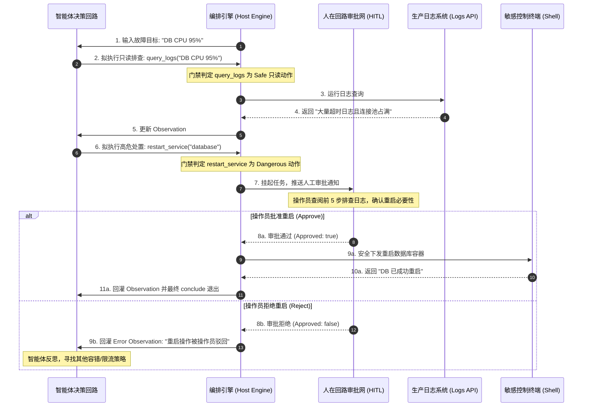
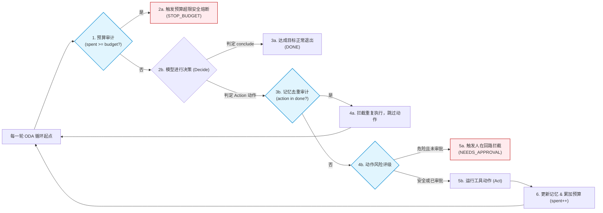

import GlossaryTerm from '@site/src/components/GlossaryTerm';
import GuidedExercise from '@site/src/components/GuidedExercise';
import ResearchNote from '@site/src/components/ResearchNote';
import ChapterMeta from '@site/src/components/ChapterMeta';
import PyRunner from '@site/src/components/PyRunner';
import TradeoffExplorer from '@site/src/components/TradeoffExplorer';
import QuizCard from '@site/src/components/QuizCard';

# M9L12 · Capstone：构建一个可靠 Agent

<ChapterMeta
  time="约 3.5 小时"
  prereqs={[{label: 'Month 9 全部', href: './overview'}, {label: 'M7L12 LLM 管道', href: '../llm-systems/capstone-llm-app'}]}
  outcome="能把本月所有 Agent 工程组装成一个可靠 Agent：受控 loop + 工具边界 + 停止/预算 + 记忆 + 反思 + 护栏 + 轨迹评测，并讲清每一环约束了什么风险。"
  howToUse="把它当一道完整 Agent 设计题：先判断该不该用 Agent，再把本月组件组装成可靠可控的循环，用 lab 跑通。"
/>

:::tip 月末综合题：把一个会自主行动、可能失控的循环，装成一个能上生产的可靠系统
本月你逐个学了 agent loop、工具边界、ReAct、停止预算、规划、记忆、反思、agentic 检索、护栏、评测。现在把它们**组装**成一个可靠 Agent。核心始终是那句话：**Agent 的智能在模型，可靠性在工程**——用受控循环、硬边界、约束、评测，把一个不确定、会自主行动的组件，框成一个可信、可控、可评测的生产系统。
:::

## 一、需求：一个“运维排查助手”Agent

做一个帮 SRE 排查线上问题的 <GlossaryTerm term="SRE Agent" definition="运维智能体：专为站点可靠性工程 (SRE) 场景设计的智能体。能够自动执行故障指标查询、日志检索、依赖检查以及敏感变更等任务，以加快故障诊断与自愈。">SRE Agent (运维智能体)</GlossaryTerm>：给定一个告警，它自主地查日志、查指标、查依赖状态，定位可能的根因、给出处置建议。这是个**适合用 Agent**的任务（[M9L11](./when-not-agent)）——因为“下一步查什么”取决于上一步的发现，步骤不可预先确定。但它也**高风险**——会接触生产系统、可能建议危险操作。正好考验本月全部能力。

## 二、组装一个可靠 Agent

### 基础：受控循环 + 工具边界

- **agent loop（[M9L1](./agent-loop-basics)）**：observe（告警 + 已查到的）→ decide（[ReAct M9L3](./react-pattern)：想下一步查什么）→ act（调工具）→ observe，循环推进。
- **工具边界（[M9L2](./tools-and-boundaries)）**：查日志/指标/状态是只读工具（自主调）；重启服务/改配置是危险工具（M9L9 需经由 <GlossaryTerm term="HITL Gatekeeper" definition="人在回路网关：在智能体执行敏感或不可逆副作用动作前触发拦截，必须由操作员在控制台进行人工审核与二次授权后，方才释放执行权限的拦截器。">人在回路网关 (HITL Gatekeeper)</GlossaryTerm> 审核）。每个工具有 schema/权限/预算/审计。

### 进阶：约束与能力

- **停止/预算（[M9L4](./stopping-budget)）**：最大步数 + 循环检测 + 成本上限与 <GlossaryTerm term="Budget constraints" definition="预算约束：通过对智能体的最大执行步数（Max Steps）和消耗的 Token/费用进行计数，一旦超出预设阈值即强行熔断停止，防止死循环或账单烧穿的硬性工程限制。">预算约束 (Budget constraints)</GlossaryTerm>——防止反复查同一个、烧穿。
- **记忆（[M9L6](./agent-memory)）**：<GlossaryTerm term="Memory Scratchpad" definition="记忆草稿纸：智能体运行时维护的结构化上下文存储。用于暂存当前任务的目标、已执行的历史工具动作（done）以及从工具中提取出的最新事实发现（findings）。">记忆草稿纸 (Memory Scratchpad)</GlossaryTerm> 记住告警、已查的、发现的——不重复查、不忘目标。
- **反思（[M9L7](./reflection-correction)）**：某次查询无果/异常时，反思调整查询策略，而非无脑重复。
- **护栏（[M9L9](./agent-guardrails)）**：处置建议里的危险操作（重启/回滚/删除）必须人审批；防注入（日志里的恶意内容不能劫持 Agent）。

### 深入（选学）：评测、可观测与“先判断该不该用”

- **轨迹评测（[M9L10](./agent-evaluation)）**：评估排查轨迹——是否定位到根因、用了几步、有没有违规查/越权、有没有空转。建评测集（历史故障）跑回归。
- **可观测**：全程 <GlossaryTerm term="Run trace" definition="运行轨迹：智能体在 ODA 循环中执行的 Thought、Action 和 Observation 步骤及其耗时、成本的完整序列记录，用于回归评测和白盒调试。">运行轨迹 (Run trace)</GlossaryTerm>（每步查了什么、发现什么、建议什么），出问题能复盘（[呼应 M6L7](../cloud-enterprise-industrial/observability-advanced)）。
- **它就是 M7 可靠管道 + 自主循环**：[M7L12 的单次可靠管道](../llm-systems/capstone-llm-app) 处理“一次调用”，Agent 是把它放进**受控循环**并加上工具/记忆/反思/护栏——每一环都在约束自主性的风险。整条 Agent = LLM 决策大脑 + 一圈工程约束。
- **先判断该不该用（[M9L11](./when-not-agent)）**：设计任何 Agent 前，先确认这任务真需要自主决策（排查确实需要——边查边定）。如果步骤固定，就别做成 Agent。

<ResearchNote
  title="可靠 Agent = LLM 决策 + 一整套工程约束"
  source="Anthropic, Building effective agents；本月各环节综合；M7L12 可靠管道"
  href="https://www.anthropic.com/research/building-effective-agents"
  insight="可靠的 Agent 不是让模型自由发挥，而是把 LLM 决策放进一个受控循环：工具边界（schema/权限/预算/审计）+ 停止条件（步数/循环/预算）+ 记忆（scratchpad）+ 反思（自我纠错）+ 护栏（危险动作人审批/防注入/沙箱）+ 轨迹评测 + 可观测。每一环约束自主性的一类风险。先判断任务是否真需要 Agent，再组装这些约束。"
  application="设计 Agent：先确认需自主决策（否则用 workflow）；搭受控 loop + ReAct；工具按只读/副作用分级设边界；配停止/预算/循环检测；用 scratchpad 记忆、反思纠错；危险动作人审批 + 防注入 + 沙箱；全程 trace + 轨迹评测 + 线上观测。智能在模型，可靠性在这一圈工程。"
/>

## 三、运维排查智能体架构图解 (Deep Dive Diagrams)

本节通过架构拓扑与交互时序图，展示如何将本月所学的各个安全与效能约束组件拼装为一个生产就绪的“运维排查助手”智能体。

### 1. 结构全景：SRE 运维排查助手架构

```mermaid
graph TD
    classDef brain fill:#ffcdd2,stroke:#c62828,stroke-width:2px;
    classDef state fill:#fff9c4,stroke:#fbc02d,stroke-width:1px;
    classDef tool fill:#e1f5fe,stroke:#0288d1,stroke-width:1.5px;
    classDef monitor fill:#eceff1,stroke:#607d8b,stroke-width:1px;

    UserAlert["1. SRE 告警输入<br/>(e.g., API 5xx 升高)"] --> Orchestrator["2. 编排协调器 (Host Engine)"]
    
    subgraph AgentBrain [智能体大脑与状态]
        Orchestrator <-->|3. 读取/回灌状态| Scratchpad["3. 记忆草稿纸 (Scratchpad)<br/>- 待解决告警 (Alert)<br/>- 已执行动作 (done)<br/>- 已有发现 (findings)"]:::state
        Orchestrator -->|4. 组装 Context 发送| LLMBrain["4. 大脑决策层 (ReAct LLM)"]:::brain
        LLMBrain -->|5. 返回 Thought 与 Action| Orchestrator
    end

    subgraph ProtectiveShield [安全控制与边界]
        Orchestrator -->|6. 校验与路由动作| Gatekeeper["6. 策略门禁网关"]
        Gatekeeper -->|A. 只读动作<br/>(query_logs/query_metrics)| ReadTools["只读工具集"]:::tool
        Gatekeeper -->|B. 危险副作用动作<br/>(restart_service/rollback)| HITL["人在回路审批网 (HITL)"]
    end

    HITL -->|驳回| Terminate["安全中止并提示"]
    HITL -->|批准| WriteTools["敏感动作执行器"]:::tool

    ReadTools & WriteTools -->|7. 返回运行结果| Orchestrator
    
    Orchestrator -.->|8. 记录执行轨迹| Tracer["8. 运行日志收集与评测 (Tracer)"]:::monitor
```

### 2. 时序全景：只读排查与危险动作拦截审批



### 3. 控制回路：智能体自适应控制约束网



---

## 四、跟我做一遍：可靠 Agent 骨架

<PyRunner
  rows={42}
  expect="自主排查、危险动作需审批、有据停止"
  code={`SAFE = {"query_logs", "query_metrics", "check_dependency"}         # 只读工具
DANGER = {"restart_service", "rollback"}                           # 危险工具(需审批)

def run_agent(alert, policy, tools, max_steps=8, budget=6):
    pad = {"alert": alert, "done": [], "findings": []}             # 记忆 scratchpad
    trace = []; spent = 0
    for _ in range(max_steps):
        if spent >= budget:                                        # 停止:预算
            return ("STOP_BUDGET", trace, pad)
        d = policy(pad)
        if d["action"] == "conclude":
            trace.append(("conclude", d["arg"]))
            return ("DONE", trace, pad)
        action = d["action"]
        if action in DANGER and not d.get("approved"):             # 护栏:危险动作需审批
            trace.append((action, "NEEDS_APPROVAL"))
            return ("NEEDS_APPROVAL", trace, pad)
        if action in pad["done"]:                                  # 记忆:不重复查
            trace.append((action, "SKIP_DONE"))
            continue
        result = tools[action](alert)                              # 执行(只读)
        pad["done"].append(action); pad["findings"].append((action, result))
        trace.append((action, result)); spent += 1
    return ("STOP_MAXSTEPS", trace, pad)

tools = {"query_logs": lambda a: "大量超时", "query_metrics": lambda a: "DB CPU 95%",
         "check_dependency": lambda a: "DB 健康度差",
         "restart_service": lambda a: "已重启", "rollback": lambda a: "已回滚"}

def policy(pad):
    done = pad["done"]
    if "query_logs" not in done: return {"action": "query_logs"}
    if "query_metrics" not in done: return {"action": "query_metrics"}
    if "check_dependency" not in done: return {"action": "check_dependency"}
    return {"action": "restart_service"}                           # 危险 -> 触发审批

status, trace, pad = run_agent("API 5xx 升高", policy, tools)
for t in trace: print("  ", t)
print("状态:", status, "(restart 危险动作被拦去审批)")
print("自主排查、危险动作需审批、有据停止")`}
/>

Agent 自主查日志/指标/依赖（只读，自主执行）、记住已查的不重复、定位到 DB 问题，但当它想重启服务（危险）时被护栏拦下、转人工审批——自主但有硬边界，全程有 trace 和停止兜底。**试试**：给 restart 加 `approved=True`（模拟人批准后），看它能执行；让 policy 永远查同一个，看记忆防重复 + max_steps 兜底。

## 四、动手 Lab（必做）

打开 `labs/month09/m9l12_agent/`：

```bash
python labs/month09/m9l12_agent/test_agent.py
```

组装可靠 Agent：受控 loop + 只读自主/危险审批 + 停止预算 + 记忆防重复 + 轨迹记录，验证自主排查、危险动作拦审批、有据停止。

<GuidedExercise
  title="练习指引：组装可靠 Agent"
  goal="把本月全部组件串成一个可靠 Agent：自主但受控、有边界、能停、可评测。"
  hints={[
    'loop：预算检查 → policy 决策 → conclude/危险审批/重复跳过/执行。',
    '危险动作(DANGER 且未 approved) -> NEEDS_APPROVAL 暂停。',
    '记忆 pad["done"] 防重复查；findings 记发现。',
    '每步记 trace；max_steps + budget 兜底。'
  ]}
  steps={[
    '实现 run_agent(alert, policy, tools, max_steps, budget)。',
    '处理 conclude / 危险审批 / 重复跳过 / 执行只读 四类。',
    '维护 scratchpad（done/findings）和 trace、预算计数。',
    '写测试：自主完成只读排查、危险动作需审批、重复查被跳过、预算/步数兜底、trace 记录。'
  ]}
  checks={[
    '你能把本月组件组装成一个受控 Agent。',
    '你的 lab 自主但危险动作必经审批、能停、有 trace。',
    '你能说出每一环约束了哪类风险。',
    '你能先判断"该不该用 Agent"再设计。'
  ]}
/>

## 架构师深潜（Staff+ 视角）

### 1. Agent 成熟度

<TradeoffExplorer
  title="Agent 工程成熟度"
  dimensions={['任务能力', '可控/安全', '可评测/可观测', '成本可控', '建设成本']}
  options={[
    {
      name: '裸 loop(让模型自由发挥)',
      scores: [3, 1, 1, 1, 5],
      note: '一个 loop + 工具。demo 惊艳，但会失控/闯祸/烧穿/难评测。',
      whenToUse: '原型探索。'
    },
    {
      name: '+ 边界/停止/护栏',
      scores: [4, 4, 2, 3, 3],
      note: '工具边界 + 停止预算 + 危险动作审批。可控安全大幅提升。',
      whenToUse: '生产 Agent 的基线。'
    },
    {
      name: '全套(+记忆/反思/评测/观测)',
      scores: [5, 5, 5, 4, 1],
      note: '再加记忆/反思/轨迹评测/可观测。可靠、可改进、可运维。建设成本高。',
      whenToUse: '关键/高价值的生产 Agent。'
    }
  ]}
/>

### 2. 这个 Capstone 是整个 AI 架构能力的集大成

回看你走过的路：[M7 把模型变成可靠组件](../llm-systems/capstone-llm-app) → [M8 给它接上知识（RAG）](../rag/capstone-rag) → M9 让它能自主行动（Agent）。可靠 Agent 把前三个月全用上了：[M7 的可靠管道](../llm-systems/capstone-llm-app)（grounding/校验/缓存/降级/评测）是 Agent 每步决策的基础、[M8 的 RAG](../rag/overview) 是 Agent 的知识工具（[agentic 检索 M9L8](./agentic-retrieval)）、M9 的循环约束让自主行动可控。而贯穿全部的，是从 Month 1 就开始的工程纪律：**校验不可信输入、隔离爆炸半径、容错恢复、可观测、可评测、按需选最简方案、对危险操作最小信任**——这些"传统"系统工程原则，在 AI 系统、尤其 Agent 上不仅没过时，反而更重要。**这正是 "AI Architect" 区别于 "会调 AI API 的人" 的根本**：你能把最强大也最危险的 AI 形态，用扎实的系统工程驯服成可靠的生产系统。

### 3. 真实案例：能上生产的 Agent 长什么样

对比"惊艳 demo Agent"和"生产 Agent"：demo 是一个裸 loop 让模型自由发挥，看着能自主完成复杂任务；生产 Agent 是这个 loop 外面包了一整圈工程——工具最小权限、危险动作人审批、停止条件和预算、记忆和反思、防注入和沙箱、全程 trace 和轨迹评测、线上监控和告警。后者"看起来"没前者酷（因为加了很多约束），但它**能被信任、能上线、能持续改进**。能造出后者的团队，靠的不是更强的模型，而是本月（和整个课程）的工程能力。这是 Agent 时代对架构师的终极考验：**不是让 Agent 更自主，而是让自主的 Agent 可靠**——给它自由，但给自由设好每一道边界。

### 4. 架构师深问（给自己 30 分钟）

- 给你想做的 Agent，先判断：它真需要自主决策吗（还是该 workflow）？如果需要，画出它的完整约束圈。
- 每一道约束（工具边界/停止/护栏/记忆/反思/评测）你都设计了吗？哪一环现在是缺的？
- 最坏情况：模型决策错 + 被注入 + 陷入循环同时发生，你的 Agent 会造成多大损失？每一种你都框住了吗？

## 知识自测

<QuizCard
  questions={[
    {
      q: '以下关于“生产级可靠智能体 (Production-ready Agent)”与“演示版智能体 (Demo Agent)”的工程差异，哪项描述最贴切？',
      options: [
        'A. 演示版使用 Python 实现，生产级必须改用 C++ 重写所有底层 ODA 循环',
        'B. 演示版通常是仅包含一个裸 Loop 的原型，任由模型自由发挥；而生产级则在 Loop 外部包裹了工具边界、最大步数/预算、人在回路审批、防注入及轨迹回归评测等一整圈硬性工程约束',
        'C. 生产级智能体为了适应无限多跳场景，必须废除最大步数（Max Steps）的兜底限制',
        'D. 演示版主要运行在客户端浏览器，生产级只能在移动端 App 中运行'
      ],
      answer: 1,
      explain: '“智能在模型，可靠在工程”。大模型本身无法提供 100% 的确定性与安全隔离。要将 Agent 推向生产环境，核心工作并非调试 Prompt 让它更聪明，而是用传统的工程卡点、沙箱、审批网关将其最坏影响牢牢框死。'
    },
    {
      q: '在运维排查智能体 (SRE Agent) 中，为什么必须把工具区分为“只读”和“副作用 (Dangerous)”两类，并对后者强制引入人在回路审批？',
      options: [
        'A. 限制只读工具的并发查询数，防止将监控系统后台流量打满',
        'B. 只读工具（如查指标/日志）没有不可逆的物理破坏力，可授权自主运行；而重启、回滚、改配置等敏感工具一旦发生决策失控（幻觉/提示词注入）会造成灾难性事故，必须强制将最终确认权留给人',
        'C. 为了防止只读工具的结果被智能体篡改，必须人工审核每一条日志的真伪',
        'D. 只要工具带了 Dangerous 标签，大模型在调用时就会自动降低 Sampling Temperature'
      ],
      answer: 1,
      explain: '依据最小特权与爆炸半径控制原则，智能体可以自主收集环境信息进行“思考”。但任何对物理世界产生副作用（特别是写、改、删、发）的指令，属于高风险卡点，不经 HITL Gatekeeper 拦截将极易造成生产事故。'
    },
    {
      q: '结合本章 Capstone，如何理解传统系统工程原则在 AI 智能体时代的作用？',
      options: [
        'A. 传统的软件工程规范（如输入校验、容器沙箱隔离、日志审计、CI/CD 回归测试）已完全过时，AI 应用需要重新发明技术栈',
        'B. 传统工程原则（如输入校验、沙箱隔离、故障容错、日志审计、最小特权和回归评测）在智能体时代不仅没过时，反而由于模型自身的黑盒不确定性而变得更为关键，是驯服 AI 的生命线',
        'C. 只要模型能力足够强（如实现通用人工智能 AGI），所有外围的工程拦截机制都将变得多余并被废除',
        'D. 只有使用 TypeScript 这种强类型语言，传统的系统设计模式才能被运用到大模型应用中'
      ],
      answer: 1,
      explain: '架构师的职责就是将不确定、不可靠的组件设计为可靠可控的系统。智能体本身虽然具备极强的灵活性和决策力，但在面对数据注入攻击、逻辑鬼打墙和越权行为时，依然必须通过传统的沙箱隔离（Sandbox）、HITL、输入验证和 CI PR 门禁进行立体防御。'
    }
  ]}
/>

## 自检清单

- [ ] 我能把本月组件组装成一个受控、可靠的 Agent。
- [ ] 我的 lab 自主但危险动作必经审批、能停、有完整 trace。
- [ ] 我能说出每一道约束（边界/停止/护栏/记忆/反思/评测）防的是什么。
- [ ] 我能先判断该不该用 Agent，再设计它的约束圈。

## 常见误解

- **"做 Agent 就是写个 loop 让模型跑"**：那是 demo；生产 Agent 是 loop + 一整圈工程约束。
- **"Agent 越自主越强"**：自主性越高越危险；可靠性来自约束，不是放任。
- **"Agent 是全新技术栈"**：它是前三个月 AI 工程 + 前六个月系统工程的集大成。

## 延伸阅读

- [Anthropic: Building effective agents](https://www.anthropic.com/research/building-effective-agents)
- [Month 9 总览](./overview)
- [进入 Month 10：Multi-Agent 与协议](../multi-agent-protocols/overview)
