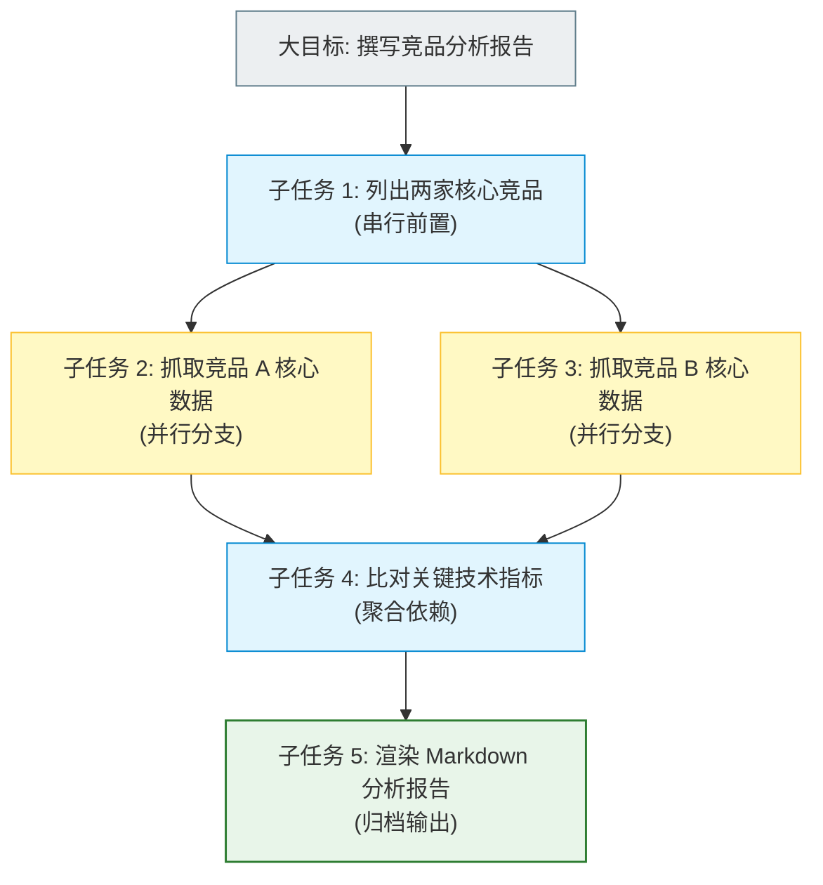
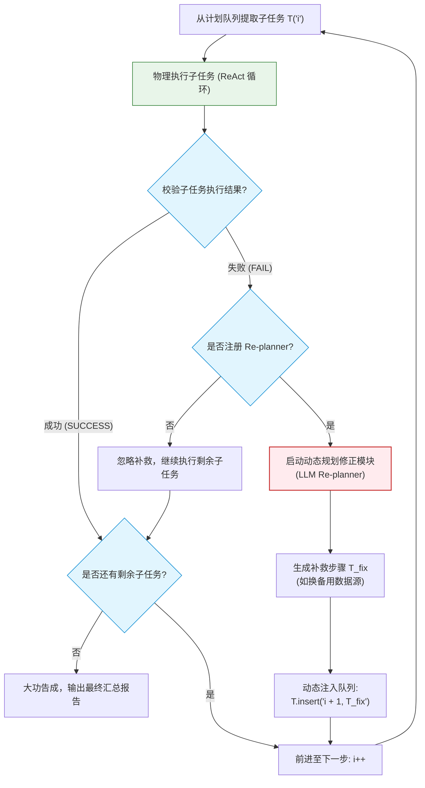

import GlossaryTerm from '@site/src/components/GlossaryTerm';
import GuidedExercise from '@site/src/components/GuidedExercise';
import ResearchNote from '@site/src/components/ResearchNote';
import ChapterMeta from '@site/src/components/ChapterMeta';
import PyRunner from '@site/src/components/PyRunner';
import TradeoffExplorer from '@site/src/components/TradeoffExplorer';
import StepFlow from '@site/src/components/StepFlow';
import QuizCard from '@site/src/components/QuizCard';

# M9L5 · 规划与任务分解

<ChapterMeta
  time="约 2.5 小时"
  prereqs={[{label: 'M9L3 ReAct', href: './react-pattern'}, {label: 'M4L1 封装变化', href: '../design-patterns-lld/change-driven-design'}, {label: 'M2L1 设计方法论', href: '../system-design-bridge/design-methodology'}]}
  outcome="能让 Agent 先把复杂目标分解成子任务、制定计划再执行，并在执行中按需修正计划，避免“走一步看一步”迷路。"
  howToUse="先看“边走边想容易迷路”，再理解 plan-then-execute，最后做任务分解 lab。"
/>

:::tip 复杂任务，先有计划再动手，比“走一步看一步”靠谱得多
[ReAct（M9L3）](./react-pattern) 是“想一步、做一步”——适合步骤不多、边走边定的任务。但目标一复杂（“调研三家竞品、对比五个维度、写成报告”），纯反应式很容易**迷路、漏步、重复劳动**。更好的做法：**先把大目标拆成有序的子任务、定个计划，再逐个执行**，执行中发现不对再修正计划。这就是规划（planning）——让 Agent 像架构师做设计那样，先想全局再动手。
:::

## 一、边走边想，复杂任务容易迷路

纯 ReAct（每步只看当前、决定下一步）对复杂任务有几个毛病：
- **漏步/跳步**：没有全局视图，容易忘记某个必须做的环节。
- **重复劳动**：忘了某步已经做过，又做一遍。
- **顺序混乱**：本该先做 A 再做 B，结果乱序。
- **迷失目标**：多步之后忘了最初要干嘛（[呼应 M9L6 记忆](./agent-memory)）。

就像人做复杂项目会先列计划/大纲，Agent 也需要：**先分解、再规划、后执行**——给多步任务一个骨架。

## 二、三个核心概念（分层）

### 基础：任务分解

<GlossaryTerm term="Task Decomposition" definition="任务分解：把一个复杂目标拆成若干更小、更明确、可执行的子任务。让 Agent 有清晰的步骤骨架，便于逐个完成、追踪进度、不漏不重。">任务分解</GlossaryTerm>：把大目标拆成**更小、更明确、可执行**的子任务。“写竞品分析报告” → ①列出竞品 ②各查资料 ③对比维度 ④汇总成报告。分解的好处：每个子任务足够具体、可单独完成和验证（[呼应 M4 **<GlossaryTerm term="Single Responsibility Principle" definition="单一职责原则 (SRP)：在面向对象设计中，规定一个类仅有一个引起它变化的原因；引申到 Agent 设计中，指拆分出的每个子任务的目标和可验证条件应该是单一且明确的。">单一职责原则 (SRP)</GlossaryTerm>** / 分而治之](../design-patterns-lld/solid-srp-ocp)、[M2L1 设计方法论](../system-design-bridge/design-methodology)），还能追踪“做到哪了”。

### 进阶：plan-then-execute

<GlossaryTerm term="Plan-then-Execute" definition="先规划后执行：Agent 先生成一个完整的子任务计划，再按计划逐个执行（每个子任务内部可用 ReAct）。比纯反应式更有全局观、更少漏步迷路。">plan-then-execute（先规划后执行）</GlossaryTerm>：Agent 先产出一个**完整的子任务计划**（有序列表），再**按计划逐个执行**（每个子任务内部可以用 [ReAct](./react-pattern) 反应式地做）。它和纯 ReAct 的区别：ReAct 是“没有预先计划、每步现想”，plan-then-execute 是“先有计划、再照着做”。前者灵活但易迷路，后者有全局观但要应对“计划赶不上变化”。

### 深入（选学）：计划修正与两种模式的结合

- **计划要能修正**：现实中执行会偏离计划（某子任务失败、发现需要新步骤）。好的 Agent 是<GlossaryTerm term="Plan Revision" definition="计划修正：Agent 执行中发现计划不对（子任务失败、信息变化、需要新步骤）时，回头调整剩余计划，而非死守原计划或推倒重来。结合了规划的全局观和反应式的灵活。">可修正计划</GlossaryTerm>的——执行中根据结果**回头调整剩余计划**，而非死守原计划（[呼应 M9L7 反思](./reflection-correction)）。这结合了规划的全局观和 ReAct 的灵活。
- **分解的粒度**：拆太粗（子任务还是很复杂）等于没拆；拆太细（每步一个子任务）overhead 大。要拆到“每个子任务清晰可执行、可验证”的粒度——这是判断力（[呼应 M4L2 SRP 粒度](../design-patterns-lld/solid-srp-ocp)）。
- **何时需要规划**：简单任务（一两步）直接 ReAct 即可，上规划是过度（[**<GlossaryTerm term="YAGNI" definition="YAGNI 原则：You Aren't Gonna Need It 的缩写，意为“你不会需要它”，即在开发中只编写当前真正需要的功能，避免为未来的假设过度设计。">YAGNI 原则</GlossaryTerm>**](../design-patterns-lld/change-driven-design））；复杂、多步、有依赖关系的任务才值得先规划。
- **规划是更多 token**：生成计划要额外的 LLM 调用和上下文（[成本 M7L5](../llm-systems/llm-api-cost-latency)）——权衡它带来的“少迷路”vs 成本。
- **子任务依赖与并行**：有些子任务有顺序依赖（B 要 A 的结果），有些可并行（独立查三家竞品）——识别依赖并将其建模为 **<GlossaryTerm term="Directed Acyclic Graph" definition="有向无环图 (DAG)：一种由顶点和有向边组成的图结构，在其中任意顶点出发都无法沿着有向边回到自身。在任务规划中，用于表示有依赖关系的子任务图。">有向无环图 (DAG)</GlossaryTerm>** 能极大优化执行效率。

<ResearchNote
  title="规划：给复杂任务一个可执行、可修正的骨架"
  source="Plan-and-Solve（Wang et al., 2023）；Plan-and-Execute；HuggingGPT 任务分解；经典 AI planning"
  href="https://arxiv.org/abs/2305.04091"
  insight="对复杂多步任务，先分解再规划（plan-then-execute）比纯反应式（ReAct）更少漏步、迷路、重复。Agent 先产出有序子任务计划、逐个执行、并在偏离时修正计划。分解粒度和是否需要规划要按任务复杂度判断，简单任务无需规划。"
  application="复杂、多步、有依赖的任务用 plan-then-execute：先让 LLM 把目标分解成清晰可执行的子任务、按序执行（子任务内可用 ReAct）、执行中按结果修正剩余计划。简单任务直接 ReAct。注意分解粒度和规划的额外成本，识别子任务依赖以优化。"
/>

### 技术架构图解与生命周期演示 (Deep Dive Diagrams & Lifecycle)

#### 1. 任务规划拓扑与依赖关系 (DAG Plan Execution)



#### 2. 动态计划修正控制流 (Dynamic Plan Revision Control Loop)



#### 3. 反应式 (ReAct) vs. 先规划后执行 (Plan-then-Execute) 推理路径对比

```mermaid
graph TD
    subgraph ReactivePath ["纯反应式路径 (ReAct) - 易迷失']"]
        R1["目标"] --> R_Thought1["Thought: 查A"] --> R_Action1["Call search(A)"]
        R_Action1 --> R_Obs1["Obs: A 成功"] --> R_Thought2["Thought: 突然想到查C"]:::replan
        R_Thought2 --> R_Action2["Call search(C)"] --> R_Obs2["Obs: C 失败"]
        R_Obs2 --> R_Thought3["Thought: 陷入死结 / 遗忘目标B"]:::replan
    end

    subgraph PlanningPath ["规划执行路径 (Plan-then-Execute) - 条理清晰']"]
        P1["目标"] --> Plan["生成全局计划: (查A, 查B, 对比"]
        
        Plan --> P_T1["执行 T1: 查A (有明确上下文与状态标记)"]
        P_T1 --> P_T2["执行 T2: 查B (不受中间无关信息干扰)"]
        P_T2 --> P_T3["执行 T3: 对比 (全局计划骨架兜底)"]
        P_T3 --> P_Finish["输出结论"]
    end

    classDef replan fill:#ffebee,stroke:#c62828,stroke-width:1px;
```



#### 4. 交互演示：先规划后执行生命周期

以下展示了 Agent 在执行“写竞品分析报告”任务时规划与修正的完整动态流转步骤：

<StepFlow
  steps={[
    {
      title: '1. 全局目标分解与 DAG 生成',
      desc: 'LLM 评估初始大目标，采用 SRP（单一职责）将任务解耦拆分为 5 个清晰可验证的子任务，并标记并行与先后依赖关系。',
      diagram: '目标: 写竞品报告 ──> 生成计划: [列竞品, 查A, 查B, 对比, 报告]'
    },
    {
      title: '2. 子任务照章执行',
      desc: 'Orchestrator 指向第一个子任务“列出竞品”，在局部开启 ReAct 循环或确定性代码获取列表。完毕后，状态标记为 OK。',
      diagram: '执行 T1: 列出竞品 ──> 输出: [竞品A, 竞品B] ──> T1 标记 OK'
    },
    {
      title: '3. 并行与阻断错误捕获',
      desc: '在执行“查竞品B资料”时遭遇目标站点宕机。错误被 Host 防护网拦截，当前执行中断，错误信息被归档提交给 Re-planner。',
      diagram: '执行 T3: 查竞品B资料 ──> 返回: 404/宕机 ──> T3 标记 FAIL'
    },
    {
      title: '4. 动态计划修正 (Re-planning)',
      desc: 'Re-planner 评估“查竞品B资料”失败的原因。LLM 生成补救方案：插入一个补救步骤“改用备用源重查:查竞品B资料”，动态更新任务依赖图。',
      diagram: '触发 Re-planner ──> 插入补救任务 T_fix ──> 执行队列长度加 1'
    },
    {
      title: '5. 任务收拢与最终报告合成',
      desc: '补救任务顺利查出 B 的备份资料。系统继续执行“对比维度”与“汇总报告”的后续计划，最后融汇各阶段 Observation 产出最终回复。',
      diagram: '执行 T_fix 成功 ──> 执行对比与汇总 ──> 输出完整分析报告'
    }
  ]}
/>

## 三、跟我做一遍：plan-then-execute

<PyRunner
  rows={38}
  expect="先规划再逐步执行"
  code={`def plan(goal):                                   # 分解成有序子任务（真实由 LLM 产出）
    return {
        "写竞品报告": ["列出竞品", "查竞品A资料", "查竞品B资料", "对比维度", "汇总成报告"],
    }.get(goal, [goal])

def execute_plan(goal, do_subtask, replan=None):  # 按计划逐个执行，支持修正
    plan_list = plan(goal)
    results = []
    i = 0
    while i < len(plan_list):
        sub = plan_list[i]
        ok, result = do_subtask(sub)
        results.append((sub, "OK" if ok else "FAIL"))
        if not ok and replan:
            fix = replan(sub)
            if fix:
                plan_list.insert(i + 1, fix)      # 计划修正：插入补救子任务
        i += 1
    return plan_list, results

def do_subtask(sub):
    if sub == "查竞品B资料":
        return (False, "资料源不可用")            # 模拟一个子任务失败
    return (True, "完成:" + sub)

def replan(failed_sub):
    return "改用备用源重查:" + failed_sub          # 失败 -> 补一个修正步骤

final_plan, results = execute_plan("写竞品报告", do_subtask, replan)
for sub, status in results:
    print("%-18s %s" % (sub, status))
print("计划被修正(含补救步):", "改用备用源重查:查竞品B资料" in final_plan)
print("先规划再逐步执行")`}
/>

Agent 先把"写竞品报告"分解成 5 个子任务，按序执行；查竞品 B 失败时，计划被修正（插入"改用备用源重查"）而非卡死——这就是 plan-then-execute + 计划修正。**试试**：去掉 replan，看失败的子任务无补救就过去了；想想哪些子任务其实可以并行（查 A 和查 B 资料互不依赖）。

## 四、动手 Lab（必做）

打开 `labs/month09/m9l5_planning/`：

```bash
python labs/month09/m9l5_planning/test_planning.py
```

实现 plan-then-execute：把目标分解成子任务、按序执行、记录进度、失败时按 replan 修正剩余计划。

<GuidedExercise
  title="练习指引：实现规划执行"
  goal="把“分解 + 按计划执行 + 计划修正”做成代码——复杂多步任务的骨架。"
  hints={[
    'plan(goal) 返回有序子任务列表。',
    'execute_plan：用索引遍历（计划可能被插入修正而变长）。',
    '子任务失败且有 replan 时，把修正子任务插入当前位置之后。',
    '记录每个子任务的 OK/FAIL，便于追踪进度。'
  ]}
  steps={[
    '实现 plan(goal) 分解（可用给定映射）。',
    '实现 execute_plan(goal, do_subtask, replan)。',
    '处理失败时的计划修正（插入补救步）。',
    '写测试：正常按序执行、失败触发修正、修正步被执行、无 replan 时失败略过、进度记录正确。'
  ]}
  checks={[
    '你能把复杂目标分解成可执行子任务。',
    '你的 lab 能 plan-then-execute 并修正计划。',
    '你能区分 ReAct（反应式）和规划（先计划）。',
    '你理解分解粒度和何时该用规划。'
  ]}
/>

## 架构师深潜（Staff+ 视角）

### 1. 规划 vs 反应式

<TradeoffExplorer
  title="Agent 的执行策略"
  dimensions={['全局观/少漏步', '灵活应变', '简单任务开销低', '可追踪进度', '成本(token)']}
  options={[
    {
      name: '纯 ReAct（反应式）',
      scores: [2, 5, 5, 2, 4],
      note: '每步现想、灵活。但无全局视图，复杂任务易迷路、漏步、难追踪。',
      whenToUse: '步骤少、边走边定的简单任务。'
    },
    {
      name: 'plan-then-execute',
      scores: [5, 2, 2, 5, 2],
      note: '先规划、有骨架、可追踪进度。但计划可能赶不上变化、生成计划有成本。',
      whenToUse: '复杂、多步、有依赖的任务。'
    },
    {
      name: '规划 + 可修正',
      scores: [5, 4, 2, 5, 1],
      note: '先规划 + 执行中按结果修正。兼顾全局和灵活，但最复杂、token 最多。',
      whenToUse: '复杂且执行会偏离预期的任务——常用组合。'
    }
  ]}
/>

### 2. "分而治之"从代码一路贯穿到 Agent

任务分解是个老朋友：[M4 把大类拆成单一职责（SRP）](../design-patterns-lld/solid-srp-ocp)、[M2L1 把大系统拆成模块](../system-design-bridge/design-methodology)、[M5 把大问题拆成构件](../core-components/overview)——现在是把大任务拆成子任务。**"把复杂的东西分解成可管理、可单独验证的小块"是贯穿整个课程的核心方法论**，在 Agent 上的体现就是任务分解 + 规划。架构师设计 Agent 处理复杂任务时，第一反应应该和设计系统一样：**先分解，把大目标拆成清晰、可执行、可验证的子任务**，而不是指望模型一步到位或边走边凑。能不能把任务分解得好，往往决定了复杂 Agent 能不能可靠工作。

### 3. 真实案例：复杂 Agent 的"先规划"价值

让 Agent 做复杂任务（多文件代码重构、多步数据分析、多源调研报告）时，纯反应式常常做到一半迷路、漏掉关键步骤、或在细节里打转忘了大局。引入"先规划后执行"后明显改善：Agent 先产出清晰的步骤计划（人也能审查这个计划是否合理），再逐步执行，进度可追踪、不易漏步。很多生产级 Agent 框架都内建了规划能力。但也要警惕另一极端——给简单任务也强行规划，徒增成本和延迟。**判断"这个任务该反应式还是先规划"，是 Agent 架构师的一项关键判断**，和"该用 Agent 还是 workflow"（[M9L11](./when-not-agent)）一脉相承：按复杂度选最简单够用的方案。

### 4. 架构师深问（给自己 30 分钟）

- 你的 Agent 任务复杂吗？纯 ReAct 会不会迷路漏步？先规划能改善多少、值不值额外成本？
- 你怎么把任务分解到合适粒度（不太粗也不太细）？每个子任务清晰可执行、可验证吗？
- 执行偏离计划时（子任务失败/需要新步骤），你的 Agent 会修正计划还是死守/卡死？

## 知识自测

<QuizCard
  questions={[
    {
      q: '在构建大语言模型 Agent 系统时，以下关于“纯 ReAct 反应式”与“Plan-then-Execute 规划式”选型的说法，哪一项最准确？',
      options: [
        'A. 规划式范式在任何场景下均比反应式范式表现更好，应完全废弃反应式范式',
        'B. 反应式范式（ReAct）适用于步骤简单、且下一步行为高度依赖运行时即时反馈的任务；而规划式范式则更适用于目标明确、多步骤、有前置依赖关系且执行路径较长的复杂任务',
        'C. 只要模型的参数量小于百亿级，就必须强制选用规划式范式',
        'D. 规划式范式可以免除任何 API 的网络超时问题'
      ],
      answer: 1,
      explain: '依据系统设计的 YAGNI（你不需要它）原则，简单或者探索性的低步数任务直接使用 ReAct 能保持高灵活性和低 Token 开销。只有当任务变得复杂（例如包含多文件重构、多阶段对比等）时，才需要引入先规划后执行以防迷路。'
    },
    {
      q: '在任务分解中，为什么我们需要参考单一职责原则（Single Responsibility Principle / SRP）？',
      options: [
        'A. 因为大模型无法识别多于两个动作的组合 Prompt',
        'B. 引入 SRP 确保拆分出的每个子任务目标单一、边界清晰且能提供确定性的成功验证条件，这极大降低了局部大模型推理的复杂性，使任务进度更易被追踪与度量',
        'C. 只有遵循 SRP，才能使 Agent 的执行轨迹在 JSON 中被完美压缩',
        'D. 遵循 SRP 能够确保大模型不使用任何外部数据库'
      ],
      answer: 1,
      explain: '分而治之是系统设计的核心思想。将一个模糊的大目标拆解成多个小而美、符合单一职责的子任务，每个子任务不仅利于小模型（或单步 ReAct）高准确度执行，同时由于其可验证性强，更便于 Orchestrator 对计划进行逻辑跳转与进度跟踪。'
    },
    {
      q: '为什么“计划修正（Plan Revision）”是 Plan-then-Execute 架构在实际生产中可靠落地所必需的？',
      options: [
        'A. 因为静态的计划永远完美无缺，修正只是为了进行性能优化',
        'B. 真实世界的工具执行环境是不稳定的（例如网络波动、数据源宕机、参数幻觉），如果 Agent 死守静态的初始计划而无法根据错误反馈动态插入补救或分支路径，系统会在遭遇任何局部小故障时瞬间卡死或崩溃',
        'C. 计划修正是为了重置 Agent 内部的所有浮点参数',
        'D. 只要有计划修正，就不需要任何外部工具的 Schema 声明了'
      ],
      answer: 1,
      explain: '“计划赶不上变化”是多步 Agent 物理运行的常态。静态计划类似于没有错误捕获的顺序代码。为了对抗环境的非确定性，系统必须引入“可修正计划”机制，在子任务失败时触发 Re-planner，动态插入修复步，从而提升系统的弹性与自愈力。'
    }
  ]}
/>

## 自检清单

- [ ] 我能把复杂目标分解成清晰可执行的子任务。
- [ ] 我的 lab 能 plan-then-execute 并在失败时修正计划。
- [ ] 我能区分纯 ReAct 和先规划、知道各自适用。
- [ ] 我理解分解粒度的判断和规划的成本权衡。

## 常见误解

- **“大模型足够聪明，直接输入目标让它一步步 ReAct 求解一定能搞定”**：在长链任务中，直接 ReAct 会导致上下文窗口中塞满大量的工具观察（Observation）细节，这会引发严重的“目标游离”或“注意力迷失在中间（Lost in the Middle）”。先规划后执行通过将任务解耦，给模型提供了一个干净、聚焦的上下文骨架，能大幅提升成功率。
- **“既然生成了完整的计划，就应该像传统代码流水线一样雷打不动地执行到底”**：静态计划在面对多变的物理环境时非常脆弱。一旦某个子任务的工具调用抛错，静态管道就会彻底断裂。成熟的设计是允许计划在运行期进行自适应修正（Plan Revision），允许动态插入、替换或删除未来的执行步骤。
- **“规划代表先进性，我的 Agent 平台必须规定所有任务一律前置规划”**：规划是一项昂贵的架构设计，会带来额外的 LLM 推理开销与明显的首字延迟（TTFT）。根据 YAGNI 原则，对于可以用 1-2 步 ReAct 或是简单的固定工作流解决的简单任务，强行规划属于过度设计。

## 延伸阅读

- [Plan-and-Solve Prompting (2023)](https://arxiv.org/abs/2305.04091)
- [下一课：Agent 记忆](./agent-memory)