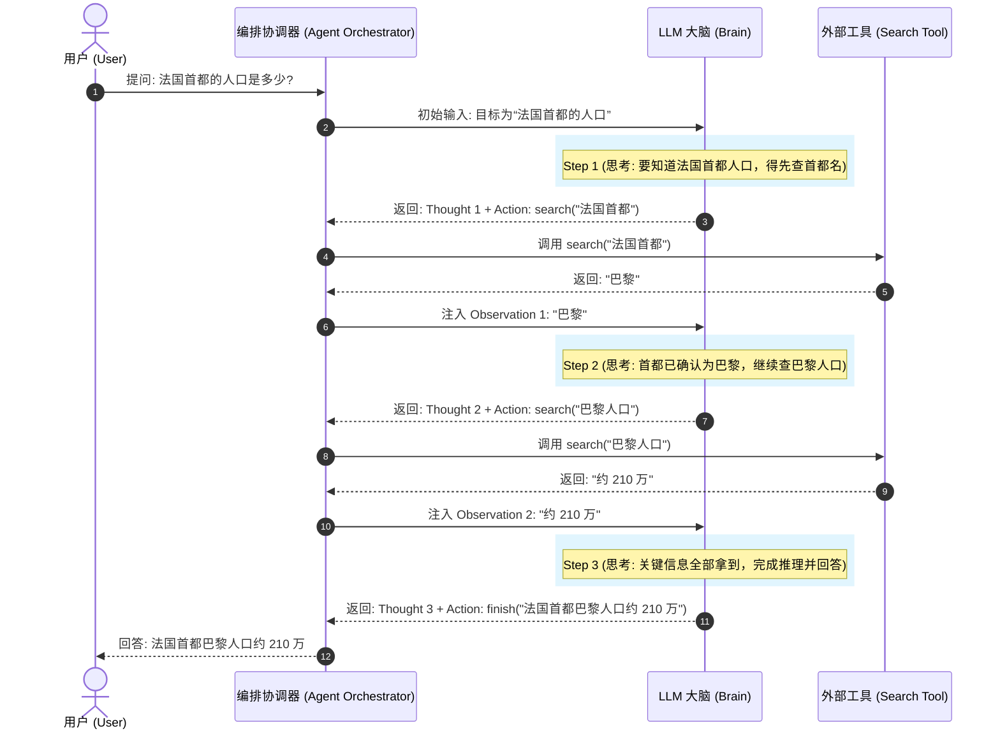

import GlossaryTerm from '@site/src/components/GlossaryTerm';
import GuidedExercise from '@site/src/components/GuidedExercise';
import ResearchNote from '@site/src/components/ResearchNote';
import ChapterMeta from '@site/src/components/ChapterMeta';
import PyRunner from '@site/src/components/PyRunner';
import TradeoffExplorer from '@site/src/components/TradeoffExplorer';
import StepFlow from '@site/src/components/StepFlow';
import QuizCard from '@site/src/components/QuizCard';

# M9L3 · ReAct：推理与行动交织

<ChapterMeta
  time="约 2.5 小时"
  prereqs={[{label: 'M9L1 agent loop', href: './agent-loop-basics'}, {label: 'M9L2 工具边界', href: './tools-and-boundaries'}, {label: 'M7L4 思维链', href: '../llm-systems/prompting-basics'}]}
  outcome="能解释 ReAct 的 Thought/Action/Observation 交织循环、它为什么比“直接行动”更可靠，并实现一个 ReAct 风格的 agent。"
  howToUse="先看“直接调工具不解释”的问题，再理解 ReAct 三段式，最后做 ReAct 轨迹 lab。"
/>

:::tip 让 Agent 在每次行动前先“想一句为什么”，它会更靠谱、也更好调试
[M9L1](./agent-loop-basics) 的循环里，模型直接决定"调哪个工具"。但如果让它**先输出一句推理（Thought：我现在该干嘛、为什么）再决定行动（Action）**，效果往往更好——推理帮模型理清思路、少走弯路（[呼应 M7L4 思维链](../llm-systems/prompting-basics)），而且这串"想→做→看→再想"的轨迹让你能看懂 Agent 在干什么、错在哪。这就是 **ReAct**——最常用、最基础的 Agent 范式。
:::

## 一、直接行动，容易乱也难懂

如果 Agent 每步只输出"调 search('天气')"，不解释为什么，会有两个问题：
- **容易乱**：模型没有"想清楚"就行动，可能调错工具、跳步骤、重复劳动。
- **难懂难调**：你只看到一串工具调用，不知道模型"为什么这么做"——出问题时无法判断是推理错了还是执行错了。

人类做复杂任务时也是"边想边做"：想一下该干嘛、做一步、看结果、再想下一步。让 Agent 也这样**把推理和行动交织**起来，就是 ReAct 的核心思想。

## 二、三个核心概念（分层）

### 基础：ReAct 的三段式

<GlossaryTerm term="ReAct" definition="Reasoning + Acting：让 LLM 交替产出“推理（Thought）”和“行动（Action）”，并把工具返回的“观察（Observation）”喂回去，循环推进任务。推理帮决策、行动获取信息，比纯推理或纯行动都更可靠。">ReAct（推理 + 行动）</GlossaryTerm> 把每一步拆成三段，循环进行：
1. **<GlossaryTerm term="Thought" definition="推理段 (Thought)：在 ReAct 范式中，模型在执行行动前输出的自然语言，说明其当前的状态理解、面临的子目标以及要执行的操作原因。">Thought (推理)</GlossaryTerm>**：模型说出"我现在该做什么、为什么"——理清下一步。
2. **<GlossaryTerm term="Action" definition="行动段 (Action)：模型决策并输出的外部调用意图，包括选定的工具名称（Tool Name）与调用参数（Tool Arguments）。">Action (行动)</GlossaryTerm>**：基于推理，决定调用哪个[工具、传什么参数（M9L2）](./tools-and-boundaries)。
3. **<GlossaryTerm term="Observation" definition="观察段 (Observation)：工具执行完毕后，回馈给大模型的物理真实数据，作为下一轮推理的基础依据。">Observation (观察)</GlossaryTerm>**：工具返回的结果，喂回给模型作为下一轮 Thought 的输入。

`Thought → Action → Observation → Thought → ...` 循环，直到模型 Thought 出"我已经有答案了"，输出 Finish。

### 进阶：为什么交织比"纯推理"或"纯行动"好

- **纯推理（只 **<GlossaryTerm term="Chain of Thought" definition="思维链 (CoT)：引导大模型生成一系列中间推理步骤，从而将复杂问题分解，提升推理能力的技术。">思维链 (Chain of Thought / CoT)</GlossaryTerm>**、不行动）**：模型凭记忆一路推下去，但无法获取外部信息、无法验证中间步骤——容易[幻觉（M7L9）](../llm-systems/hallucination-guardrails)、一步错步步错。
- **纯行动（只调工具、不推理）**：模型不"想清楚"就动手，容易乱调、跳步。
- **ReAct（交织）**：推理帮它**想清楚下一步该获取什么信息**，行动**去获取真实信息**，观察**把真实结果拉回来纠正推理**——三者互相补足。推理让行动有的放矢，行动让推理有据可依（**<GlossaryTerm term="Grounding" definition="事实锚定 / 接地：大模型生成的回复与外部真实世界数据、事实或指定上下文保持一致，通常通过工具调用执行获取客观事实，用以抑制幻觉。">grounding 事实锚定</GlossaryTerm>**）。这是 ReAct 比两个极端都强的原因。

### 深入（选学）：ReAct 的工程价值与变体

- **可解释、可调试**：ReAct 的 Thought 让 Agent 的"想法"显式化——你能看懂它每步在想什么、错在哪（推理错？工具错？观察理解错？），这对 [Agent 评测和排错（M9L10）](./agent-evaluation) 极有价值。
- **Thought 也是给模型自己看的**：把推理写进上下文，相当于模型给自己留的"草稿"（[呼应 M9L6 scratchpad](./agent-memory)），帮它在多步中保持连贯、不忘目标。
- **变体与组合**：ReAct 常和[规划（M9L5）](./planning-decomposition)（先规划再 ReAct 执行）、[反思（M9L7）](./reflection-correction)（行动失败后反思再行动）组合。它是基础范式，上面可叠加更多结构。
- **代价**：Thought 是额外的输出 token（[更慢更贵 M7L5](../llm-systems/llm-api-cost-latency)），简单任务不一定值得。要权衡"推理带来的可靠性提升"vs"额外成本"。
- **别让推理变成空转**：模型可能输出一堆冠冕堂皇的 Thought 却没有实质进展（[循环 M9L4](./stopping-budget)）——推理质量要靠[轨迹评测（M9L10）](./agent-evaluation) 看，不能只看它"显得在思考"。

<ResearchNote
  title="ReAct：推理引导行动，行动校正推理"
  source="Yao et al. (2022), ReAct: Synergizing Reasoning and Acting in Language Models"
  href="https://arxiv.org/abs/2210.03629"
  insight="ReAct 让模型交替生成推理轨迹（Thought）和行动（Action），并把工具的观察（Observation）反馈回去。推理帮模型规划、追踪、处理异常；行动让它从外部获取信息、grounding 到真实世界。相比纯思维链（易幻觉）或纯行动（无规划），ReAct 在交互式任务上更可靠且可解释。"
  application="用 Thought/Action/Observation 三段式实现 agent loop：每步先推理再行动、把工具结果作为观察喂回。它提供可解释的轨迹（利于评测排错），可与规划、反思组合。注意 Thought 的额外成本，简单任务未必需要，并防止推理空转。"
/>

### 技术架构图解与生命周期演示 (Deep Dive Diagrams & Lifecycle)

#### 1. ReAct 核心闭环状态机 (ReAct State Machine Loop)

```mermaid
graph TD
    classDef start fill:#eceff1,stroke:#607d8b,stroke-width:1px;
    classDef thought fill:#e1f5fe,stroke:#0288d1,stroke-width:1px;
    classDef action fill:#fff9c4,stroke:#fbc02d,stroke-width:1px;
    classDef observation fill:#e8f5e9,stroke:#2e7d32,stroke-width:1px;
    classDef finish fill:#ffebee,stroke:#c62828,stroke-width:1.5px;

    Goal["用户初始目标 (Goal)"] --> Init["1. 初始化 Context / Memory"]:::start
    Init --> Thought["2. 推理阶段 (Thought)<br/>- 评估当前状态/历史轨迹<br/>- 产生下一步计划及原因"]:::thought
    
    Thought --> CheckAction{"3. 判断是否终结?"}
    
    CheckAction -->|是 (finish)| Finish["结束阶段 (Finish)<br/>- 输出最终答案给用户"]:::finish
    CheckAction -->|否 (call tool)| Action["4. 行动阶段 (Action)<br/>- 决定调用特定工具与参数"]:::action
    
    Action --> Exec["5. 运行物理工具 (Execute Tool)"]
    Exec --> Observation["6. 观察阶段 (Observation)<br/>- 获取外部反馈事实<br/>- 将结果追加至记忆"]:::observation
    
    Observation -->|反馈事实至 Context| Thought
```

#### 2. 三种推理与交互范式对比 (Comparison of Interaction Paradigms)

```mermaid
graph TD
    subgraph ModeA ["模式 A: 纯思维链 (CoT Only)"]
        CoT1["思考 (Thought 1)"] --> CoT2["思考 (Thought 2)"]
        CoT2 --> CoTAnswer["最终答案 (无依据容易幻觉)"]
    end

    subgraph ModeB ["模式 B: 纯工具调用 (Tool Use Only)"]
        Tool1["调工具 (Action 1)"] --> Tool2["调工具 (Action 2)"]
        Tool2 --> ToolAnswer["最终答案 (无规划容易出错)"]
    end

    subgraph ModeC ["模式 C: 推理与行动交织 (ReAct)"]
        ReThought1["推理 (Thought 1)"] --> ReAction1["行动 (Action 1)"]
        ReAction1 --> ReObs1["观察 (Observation 1)"]
        
        ReObs1 -.->|事实校正| ReThought2["推理 (Thought 2)"]
        ReThought2 --> ReAction2["行动 (Action 2)"]
        ReAction2 --> ReObs2["观察 (Observation 2)"]
        
        ReObs2 -.->|事实校正| ReThought3["推理 (Thought 3)"]
        ReThought3 --> ReFinish["结束并回答 (Finish)"]
    end

    classDef tStyle fill:#e1f5fe,stroke:#0288d1,stroke-width:1px;
    classDef aStyle fill:#fff9c4,stroke:#fbc02d,stroke-width:1px;
    classDef oStyle fill:#e8f5e9,stroke:#2e7d32,stroke-width:1px;

    class CoT1,CoT2,ReThought1,ReThought2,ReThought3 tStyle;
    class Tool1,Tool2,ReAction1,ReAction2 aStyle;
    class ReObs1,ReObs2 oStyle;
```



#### 3. ReAct 多步问题求解时序图 (ReAct Sequence Diagram)



#### 4. 交互演示：ReAct 多步循环执行

以下展示了 Agent 使用 ReAct 模式回答“查询法国首都人口”的动态循环阶段：

<StepFlow
  steps={[
    {
      title: '1. 第一步推理 (Thought 1)',
      desc: '输入目标“法国首都人口”，大模型分析后，认为需要先把“法国首都”这一前置实体查出来。生成一段想清楚原因的推理。',
      diagram: '目标: 法国首都人口 ──> Thought: 先查法国首都是哪里'
    },
    {
      title: '2. 第一步行动与观察 (Action & Obs 1)',
      desc: '生成工具指令 `search("法国首都")`，系统物理执行并拉回网页内容“巴黎”，作为外部观察数据追加至上下文。',
      diagram: '执行: search("法国首都") ──> 观察 (Observation): 巴黎'
    },
    {
      title: '3. 第二步推理 (Thought 2)',
      desc: '将“巴黎”反馈回模型。模型读取历史，确认首都为巴黎，下一步需要查巴黎的人口。生成第二段 Thought。',
      diagram: '观察: 巴黎 ──> Thought: 首都已确认为巴黎，继续查询巴黎人口'
    },
    {
      title: '4. 第二步行动与观察 (Action & Obs 2)',
      desc: '下发指令 `search("巴黎人口")`，获取物理反馈“约 210 万”。结果再次回灌至记忆中。',
      diagram: '执行: search("巴黎人口") ──> 观察 (Observation): 约 210 万'
    },
    {
      title: '5. 终结判断与回答 (Finish)',
      desc: '大模型读取完整上下文，判定“法国首都”和“人口”两大子目标均已解决。输出 finish 行动及最终组装好的答案。',
      diagram: 'Thought: 信息已齐全 ──> Action: finish("法国首都巴黎人口约 210 万")'
    }
  ]}
/>

## 三、跟我做一遍：ReAct 风格的 Agent

<PyRunner
  rows={40}
  expect="Thought→Action→Observation 交织完成"
  code={`def search(q): return {"巴黎人口": "约 210 万", "法国首都": "巴黎"}.get(q, "未找到")
tools = {"search": search}

# 模拟一个 ReAct 风格的“决策大脑”：每步产出 thought + action
def react_policy(state):
    obs = state["observations"]
    if not obs:
        return {"thought": "要回答法国首都的人口，先查首都是哪", "action": "search", "arg": "法国首都"}
    if len(obs) == 1:
        capital = obs[0][2]                  # 上一步观察到的首都
        return {"thought": "首都是%s，再查它的人口" % capital, "action": "search", "arg": capital + "人口"}
    return {"thought": "已拿到人口数据，可以回答了", "action": "finish",
            "arg": "法国首都%s人口%s" % (obs[0][2], obs[1][2])}

def run_react(goal, policy, tools, max_steps=6):
    state = {"goal": goal, "observations": []}
    trace = []
    for _ in range(max_steps):
        d = policy(state)
        trace.append(("Thought", d["thought"]))
        if d["action"] == "finish":
            trace.append(("Finish", d["arg"]))
            return d["arg"], trace
        trace.append(("Action", "%s(%s)" % (d["action"], d["arg"])))
        result = tools[d["action"]](d["arg"])
        trace.append(("Observation", result))
        state["observations"].append((d["action"], d["arg"], result))
    return None, trace

answer, trace = run_react("法国首都的人口", react_policy, tools)
for kind, content in trace:
    print("%-12s %s" % (kind, content))
print("==>", answer)
print("Thought→Action→Observation 交织完成")`}
/>

每步都先 Thought（想清楚为什么），再 Action（调工具），再 Observation（拿结果）——这串轨迹既让 Agent 推理更有条理，也让你一眼看懂它怎么一步步推出答案。**试试**：让 search 对"法国首都人口"返回"未找到"，看 Agent 的推理能不能据此调整（这就是下下课的反思）；数一数完成这个两跳任务用了几次工具调用。

## 四、动手 Lab（必做）

打开 `labs/month09/m9l3_react/`：

```bash
python labs/month09/m9l3_react/test_react.py
```

实现 ReAct agent：每步产出 thought + action，执行工具得 observation 喂回，记录完整 Thought/Action/Observation 轨迹，finish 时输出答案。

<GuidedExercise
  title="练习指引：实现 ReAct agent"
  goal="把“推理-行动-观察交织”做成代码，体会推理如何引导行动、轨迹如何便于排错。"
  hints={[
    'policy 每步返回 {thought, action, arg}。',
    'run_react：记录 Thought，再按 action 执行（finish 则结束），记录 Action 和 Observation。',
    '观察结果喂回 state，供下一步推理用。',
    '轨迹要完整记录三段，便于评测和排错。'
  ]}
  steps={[
    '实现 run_react(goal, policy, tools, max_steps)。',
    '每步：记 Thought → finish 判断 → 执行工具 → 记 Action/Observation → 更新 state。',
    '返回 (answer, trace)。',
    '写测试：多跳任务正确完成、轨迹含 Thought/Action/Observation、max_steps 兜底、观察喂回影响后续。'
  ]}
  checks={[
    '你能解释 ReAct 的 Thought/Action/Observation 循环。',
    '你的 lab 能交织推理与行动、记录完整轨迹。',
    '你能说出 ReAct 为什么比纯推理/纯行动可靠。',
    '你理解 Thought 既帮决策、也利于排错。'
  ]}
/>

## 架构师深潜（Staff+ 视角）

### 1. Agent 推理范式

<TradeoffExplorer
  title="Agent 的推理/行动范式"
  dimensions={['可靠性', '可解释/可调试', '获取外部信息', '成本(token)', '实现简单']}
  options={[
    {
      name: '纯思维链(只推理)',
      scores: [2, 4, 1, 3, 5],
      note: '凭记忆一路推。能解释，但无法获取/验证外部信息，易幻觉累积。',
      whenToUse: '无需外部信息的纯推理题。'
    },
    {
      name: '纯行动(只调工具)',
      scores: [2, 2, 5, 4, 4],
      note: '直接调工具不解释。能拿信息，但易乱调、跳步、难懂。',
      whenToUse: '极简单、工具序列明确的任务。'
    },
    {
      name: 'ReAct(交织)',
      scores: [4, 5, 5, 2, 3],
      note: '推理引导行动、行动校正推理、轨迹可解释。最常用，但 Thought 有额外成本。',
      whenToUse: '需要多步 + 外部信息 + 可调试的任务——Agent 默认范式。'
    }
  ]}
/>

### 2. ReAct 的"可解释轨迹"是 Agent 可运维的前提

ReAct 最被低估的价值不是"让模型更聪明"，而是**让 Agent 的行为可解释、可调试**。一个只输出工具调用的 Agent 出了问题，你像在看黑盒；而 ReAct 的 Thought/Action/Observation 轨迹，让你能精确定位：是推理（Thought）错了、还是工具（Action）调错了、还是对结果（Observation）理解错了。这种可观测性对 Agent 至关重要——Agent 是多步、非确定的，没有清晰轨迹根本没法 [评测和排错（M9L10）](./agent-evaluation)。这呼应 [M6L7 可观测性](../cloud-enterprise-industrial/observability-advanced)：**你拆分/自主化系统获得的能力，要靠可观测性来偿还"看不清"的代价**。架构师设计 Agent 时，要把"每步留下可解释的轨迹"当成一等需求。

### 3. 真实案例：ReAct 是大多数 Agent 框架的底座

从研究到工业，ReAct 的"推理-行动-观察"循环是几乎所有 LLM Agent 框架的底层范式（各家叫法不同，但内核一致）。它之所以成为事实标准，正是因为它同时解决了两件事：**让模型能 grounding 到外部真实信息**（靠 Observation，避免纯推理的幻觉）、**让 Agent 的行为可追踪可调试**（靠显式 Thought）。理解 ReAct，你就理解了现代 Agent 的"主循环"长什么样——后面的[规划（M9L5）](./planning-decomposition)、[反思（M9L7）](./reflection-correction)、[记忆（M9L6）](./agent-memory) 都是在这个循环上加结构。它是 Agent 世界的"骨架"。

### 4. 架构师深问（给自己 30 分钟）

- 你的 Agent 每步有显式推理（Thought）吗？出问题时你能区分是推理错、工具错还是理解结果错吗？
- 你的任务真的需要 ReAct 的推理开销吗？还是工具序列其实是固定的（用 workflow 更省）？
- 你怎么防止 Agent"看起来在认真推理"但实际空转、没有实质进展（要靠轨迹评测，不能只看 Thought 漂不漂亮）？

## 知识自测

<QuizCard
  questions={[
    {
      q: '在 ReAct（Reasoning + Acting）模式下，模型输出的 Thought（推理）的主要工程价值是什么？',
      options: [
        'A. 为了凑满 Context Window（上下文窗口），以使得大模型生成更多内容从而符合学术规范',
        'B. 它充当了模型在复杂任务求解中的“动态草稿纸”（Scratchpad），使得推理轨迹显式化、可被拦截，也是架构师区分“推理错”、“工具错”还是“理解错”的必备可观测手段',
        'C. 只要模型生成了 Thought，大模型在计算时就会自动免除工具超时带来的网络延迟限制',
        'D. 仅仅为了让控制台输出的信息显得更加智能，没有实质的系统设计价值'
      ],
      answer: 1,
      explain: '在多步自主循环中，Thought 的价值有两层：一是作为 Scratchpad 增强 LLM 自身的多步逻辑追踪和连贯性；二是将 Agent 的执行轨迹显式化，提供了强大的可观测性（Observability），这对于分布式系统及自主体评测排错具有一等重要性。'
    },
    {
      q: '相比于 Chain of Thought (思维链) 推理，ReAct 范式在处理事实性知识回答时的本质优势是什么？',
      options: [
        'A. ReAct 模型的参数量通常比纯 CoT 模型的参数量大出十倍以上',
        'B. 思维链依赖模型的参数记忆（容易发生时空幻觉累积），而 ReAct 引入了 Action 与 Observation 的闭环，使模型能够实时获取外部物理事实（Grounding）并自适应校正后续的推理计划',
        'C. ReAct 能够直接修改模型的浮点数权重，使模型永远不再产生幻觉',
        'D. 思维链只能处理静态代码问题，无法回答任何逻辑推理问题'
      ],
      answer: 1,
      explain: '思维链 CoT 属于静态的参数化记忆（Parametric Memory）检索，模型仅凭自己训练时吃进去的语料孤立推理，容易产生幻觉累积。ReAct 则将推理与环境交互行动交织，Observation（观察段）构筑了可靠的非参数化依据，使大模型能够在事实支撑下完成推理与事实对齐。'
    },
    {
      q: '在工业级 ReAct Agent 运行中，常会遇到“推理空转/逻辑鬼打墙（Reasoning Loop Trap）”的异常。作为架构师，以下哪种防护设计是拦截此异常的首选兜底方案？',
      options: [
        'A. 不设置任何兜底，直到 Token 耗尽或用户强制关闭容器',
        'B. 在 Prompt 中添加“请尽量生成不同句式的 Thought 思考”',
        'C. 设置外围的 Hard Constraints（如最大循环步数 max_steps 和 Token 消耗监控拦截器），并比对历史 Thought/Action 轨迹的相似度，一旦发生逻辑重复立即抛错中断',
        'D. 每次遇到重复 Thought 时自动将 Temperature 调整为 0'
      ],
      answer: 2,
      explain: '自主 Agent 的死循环（如由于工具报错，模型不断输出相同的 Thought 重试相同的 Action）是核心痛点。防范这一问题的基本防线是外围工程的硬指标拦截（如步数上限），更精细的还可以包含基于文本哈希或向量相似度的环路检测，从代码侧强行拆除死循环。'
    }
  ]}
/>

## 自检清单

- [ ] 我能解释 ReAct 的 Thought/Action/Observation 交织循环。
- [ ] 我的 lab 能交织推理与行动、记录完整轨迹。
- [ ] 我能说出 ReAct 为什么比纯推理/纯行动更可靠。
- [ ] 我理解 ReAct 轨迹对评测排错的价值。

## 常见误解

- **“Agent 直接调工具就行，推理是多余的多消耗 Token”**：推理是让模型进行自我对齐和策略预判的关键步骤。没有 Thought 的直接 Action 容易由于缺乏规划发生顺序错误、丢步或乱调工具。另外，Thought 提供的显式轨迹是 Agent 系统最宝贵的可观测性资产，没有它排错将变得极其痛苦。
- **“纯思维链 (CoT) 足以解决所有复杂问题”**：思维链只在模型的内部参数空间里打转。对于需要实时、私有、多跳事实的系统，没有行动和外部观察，CoT 会由于缺乏 grounding（事实锚定）而迅速退化为事实性幻觉，发生“一步错、步步错”的雪崩。
- **“模型输出 Thought 就代表它一定在做有价值的推理”**：这是一个常见的视觉盲区。模型常常会输出大段逻辑看似自洽的 Thought，但在工具报错或遇到异常时，它会不断输出重复的 Thought 敷衍塞责（即推理空转）。必须在工程上对其执行轨迹（Trace）进行语义或者环路检测，以防止其进入 Token 燃烧死循环。

## 延伸阅读

- [ReAct (Yao et al., 2022)](https://arxiv.org/abs/2210.03629)
- [下一课：停止条件与预算控制](./stopping-budget)