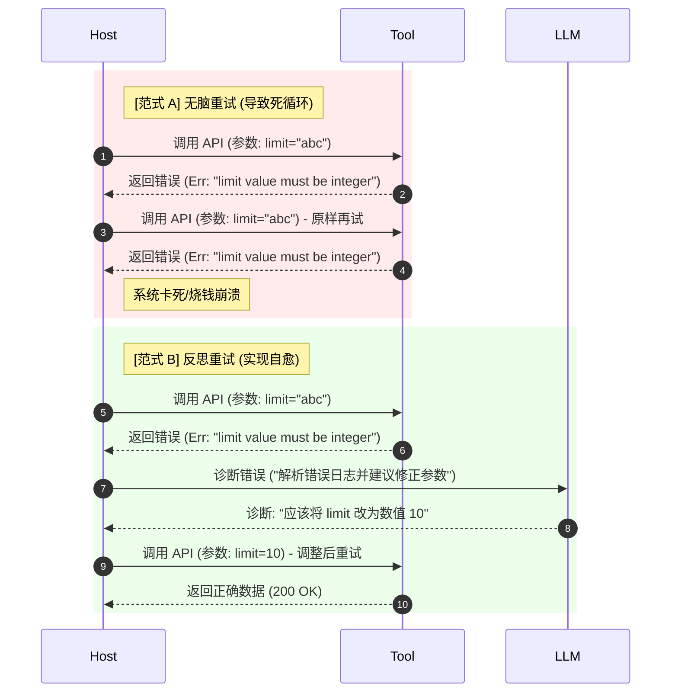

import GlossaryTerm from '@site/src/components/GlossaryTerm';
import GuidedExercise from '@site/src/components/GuidedExercise';
import ResearchNote from '@site/src/components/ResearchNote';
import ChapterMeta from '@site/src/components/ChapterMeta';
import PyRunner from '@site/src/components/PyRunner';
import TradeoffExplorer from '@site/src/components/TradeoffExplorer';
import StepFlow from '@site/src/components/StepFlow';
import QuizCard from '@site/src/components/QuizCard';

# M9L7 · 反思与自我纠错

<ChapterMeta
  time="约 2.5 小时"
  prereqs={[{label: 'M9L3 ReAct', href: './react-pattern'}, {label: 'M9L4 停止条件', href: './stopping-budget'}, {label: 'M5L7 重试退避', href: '../core-components/retry-backoff-timeout'}]}
  outcome="能让 Agent 检查自己的输出/工具结果、发现错误、调整策略重试，并理解反思与“无脑重试”的区别、它的代价和边界。"
  howToUse="先看“一错到底”的 Agent，再理解反思循环，最后做反思纠错 lab。"
/>

:::tip 会反思的 Agent，才能从错误里爬出来，而不是一条道走到黑
[ReAct（M9L3）](./react-pattern) 让 Agent 行动、观察。但如果某步做错了——工具返回了错误、结果不符合预期、答案没解决问题——一个不会反思的 Agent 会**带着错误继续往下走**，或[反复用同样的方式重试同一个失败（M9L4 的循环）](./stopping-budget)。会反思的 Agent 不一样：它**检查自己的结果、发现哪里不对、调整策略再试**。反思（reflection）是 Agent 从“一错到底”变成“能自我纠正”的关键能力。
:::

## 一、不会反思，一错到底

没有反思能力的 Agent，遇到错误时很无力：
- **带错前进**：某步结果其实错了，但 Agent 没察觉，基于错误结果继续，越走越偏。
- **无脑重试**：工具失败了，用**完全一样的参数**再试一遍，当然还是失败（[死循环 M9L4](./stopping-budget)）。
- **不会换策略**：一种方法行不通，不知道换个思路。

人遇到挫折会“停下来想想哪里错了、换个方法”。让 Agent 也具备这种**检查-诊断-调整**的能力，就是反思。它和 [M5L7 重试](../core-components/retry-backoff-timeout) 的区别很关键，这体现了分布式系统中的 **<GlossaryTerm term="Resilience Engineering" definition="韧性工程：系统在面对各种异常、局部故障或非预期冲击时，能够动态响应、吸收错误并优雅恢复到正常工作状态的工程设计思想。">韧性工程 (Resilience Engineering)</GlossaryTerm>** 思想：重试是“原样再来”，反思是“想清楚为什么错、调整后再来”。

## 二、三个核心概念（分层）

### 基础：反思循环

<GlossaryTerm term="Reflection" definition="反思：Agent 检查自己的输出或工具结果，判断是否达成目标/是否有错，若有问题则诊断原因并调整策略，再重试。让 Agent 具备自我纠错能力，而非带错前进或无脑重试。">反思（reflection）</GlossaryTerm> 在行动后加一步“自检”：
1. **行动**：执行一步（[ReAct 的 Action](./react-pattern)）。
2. **检查（reflect）**：这步结果对吗？达成子目标了吗？有没有错误/不符合预期？
3. **若有问题 → 诊断 + 调整**：想清楚为什么错（参数错？方法错？信息不足？），**调整策略**后再试——而不是原样重试。例如，在学术界经典的 <GlossaryTerm term="Reflexion" definition="Reflexion 架构：一种通过建立明确语言反思评判器与短期工作记忆（Scratchpad）来让 Agent 在多次尝试间主动学习并纠正动作的自主强化推理框架。">Reflexion 架构</GlossaryTerm> 中，Agent 就是通过在 Scratchpad 中记录失败自省来修正错误。
4. **若没问题 → 继续**下一步。

关键是第 3 步的“调整”：反思的价值在于**带着对失败原因的理解去改进**，而非机械重复。

### 进阶：反思的不同形式

- **结果校验式反思**：用规则/工具检查结果是否合法（如代码能不能跑、JSON 格式对不对、答案是否 **<GlossaryTerm term="Grounding" definition="事实锚定 (Grounding)：将模型的输出与现实客观数据（如工具的实际反馈、确切的数据源）进行校验与比对，以防止模型脱离实际凭空编造。">事实对齐 (Grounding)</GlossaryTerm>**）——客观、可靠（[呼应 M7L9 校验](../llm-systems/hallucination-guardrails)）。
- **自我批判式反思**：让 LLM 自己评判“我这步做得好吗、有什么问题”（这属于 **<GlossaryTerm term="Self-Refine" definition="自我精炼：大模型自发迭代优化其生成内容的机制，通过‘生成 -> 批判 -> 修正’的内部闭环反复打磨输出直到满足特定标准。">Self-Refine (自我精炼)</GlossaryTerm>** 机制）——更灵活，但模型自评有偏差（可能盲目自信或反复纠结），要[配客观信号（M9L10 评测）](./agent-evaluation)。
- **外部反馈式反思**：把工具的错误、测试的失败、人的反馈作为反思的依据——最可靠（基于真实结果而非模型臆测）。

### 深入（选学）：反思的代价与边界

- **反思要有上限**：反思-重试也是循环，必须配[停止条件（M9L4）](./stopping-budget)——最多反思 N 次还不行就停/转人工，别陷入“反思死循环”（一直觉得不够好、反复改）。
- **反思是额外成本**：每次反思 + 重试都是更多 LLM 调用（[成本/延迟 M7L5](../llm-systems/llm-api-cost-latency)）——权衡“提升正确率”vs“翻倍成本”。简单任务可能不值。
- **客观信号 > 自我评判**：模型自评不可靠（[呼应 M7L9 模型不可信、M7L10 LLM-judge 有偏差](../llm-systems/llm-evaluation)）——尽量用**可验证的客观信号**（工具报错、测试结果、校验失败）触发反思，而非只靠模型“觉得不对”。能跑测试就别只让模型自我感觉。
- **反思 + 记忆**：反思的结论要记进 [scratchpad（M9L6）](./agent-memory)（“试过 X 不行，因为 Y”），避免重复犯同样的错——否则反思了也白反思。
- 这是 [M5 容错思想](../core-components/circuit-breaker) 在 Agent 上的体现：不是“消除错误”（做不到），而是“出错后能恢复”。会自我纠错的 Agent，对单步失败有韧性。

<ResearchNote
  title="反思：让 Agent 带着对失败的理解去改进"
  source="Shinn et al. (2023), Reflexion; Self-Refine; CRITIC (用工具反馈纠错)"
  href="https://arxiv.org/abs/2303.11366"
  insight="Reflexion 等表明，让 Agent 反思失败（用语言总结哪里错了、为什么）再重试，比无脑重试显著提升成功率。反思可基于客观校验、自我批判或外部反馈；其中基于可验证信号（工具报错、测试结果）的反思最可靠，纯模型自评有偏差。反思要配停止上限和成本权衡。"
  application="给 Agent 加反思：行动后检查结果（优先用客观信号：工具报错/测试/校验），有问题则诊断原因、调整策略再试，并把教训记进 scratchpad 避免重犯。反思循环要有最大次数和成本预算。简单任务未必需要。别只靠模型自我感觉，能用客观信号就用。"
/>

### 技术架构图解与生命周期演示 (Deep Dive Diagrams & Lifecycle)

#### 1. 外部客观信号驱动的自纠错系统拓扑 (Objective-Feedback Loop Topology)

```mermaid
graph LR
    classDef brain fill:#e1f5fe,stroke:#0288d1,stroke-width:1.5px;
    classDef check fill:#e8f5e9,stroke:#2e7d32,stroke-width:1px;
    classDef memory fill:#fff9c4,stroke:#fbc02d,stroke-width:1px;

    LLM["LLM 生成器大脑 (Agent Brain)"]:::brain -->|1. 尝试输出 (代码/查询/JSON)| Sandbox["客观沙箱校验器 (Objective Sandbox)<br/>- 编译器 (Compiler)<br/>- 单元测试 (Test Runner)<br/>- 格式校验 (Schema Validator)"]:::check
    Sandbox -->|2. 返回客观反馈 (Compiler Trace / Test Result)| Evaluator["反思判定与诊断器 (Reflector)"]:::check
    Evaluator -->|3. 诊断错误并提炼教训| Scratchpad["结构化草稿纸 (Scratchpad Memory)"]:::memory
    Scratchpad -->|4. 装配纠错 Prompt 提示词| LLM
```

#### 2. Reflexion 范式状态机流转 (Reflexion State Machine Loop)

```mermaid
graph TD
    classDef state fill:#eceff1,stroke:#607d8b,stroke-width:1px;
    classDef decision fill:#fff9c4,stroke:#fbc02d,stroke-width:1px;
    classDef memory fill:#e8f5e9,stroke:#2e7d32,stroke-width:1.5px;

    Start["初始目标 (Goal)"] --> GenAction["生成行动 A[t]"]:::state
    GenAction --> Exec["物理执行并获取观测 O[t]"]:::state
    
    Exec --> CheckGoal{"是否达成最终目标<br/>或通过客观校验?"}:::decision
    
    CheckGoal -->|是 (PASS)| Finish["任务成功，输出结果"]
    CheckGoal -->|否 (FAIL)| CheckRetries{"反思尝试次数<br/>是否达到上限 N?"}:::decision
    
    CheckRetries -->|是| Terminate["触发异常拦截，转入人工/优雅停机"]
    CheckRetries -->|否| SelfReflect["启动自我批判诊断 (Self-Reflection)<br/>提炼语言形式的教训: '因为 X 失败了'"]:::state
    
    SelfReflect --> WriteMemory["回写至 Scratchpad 记忆区<br/>(存储历史失败教训)"]:::memory
    WriteMemory --> PrepareNext["基于新记忆与教训重装配 Context"] --> GenAction
```

#### 3. 无脑重试 vs. 反思调整时序对比 (Blind Retry vs. Reflection-based Correction)



#### 4. 交互演示：反思与自我纠错全生命周期

以下展示了 Agent 在执行“编写 Python 数据抓取脚本并确保通过测试”时反思机制的运转过程：

<StepFlow
  steps={[
    {
      title: '1. 初次尝试生成 (Draft)',
      desc: 'LLM 根据要求首次生成脚本草稿，但代码中存在未导入第三方包（如 requests）的语法隐患。',
      diagram: '目标: 抓取数据 ──> 生成首版代码 ──> 未 import requests ──> 状态: 未验证'
    },
    {
      title: '2. 物理沙箱跑测拦截 (Assertion)',
      desc: 'Orchestrator 将代码写入临时沙箱并执行编译。编译器抛出 Traceback：`NameError: name "requests" is not defined`。',
      diagram: '运行 test.py ──> 抛出 NameError ──> 捕获 Traceback ──> 状态: FAIL'
    },
    {
      title: '3. 根因自省诊断 (Self-Reflection)',
      desc: '系统没有原样重运行，而是将 NameError 堆栈灌入 LLM。模型反思产生诊断词：“我忘记了 `import requests`，下一轮必须加上它”。',
      diagram: '错误堆栈注入 ──> LLM 诊断 ──> 提炼语言教训 ──> 状态: 诊断完毕'
    },
    {
      title: '4. 策略回写与代码修正 (Refinement)',
      desc: '诊断出的教训和错误信息被回写至 Scratchpad 记忆区。大模型根据教训对代码进行二轮精炼（Self-Refine），补齐 import 并重写。',
      diagram: '教训存入 Scratchpad ──> 二轮精炼 ──> 补齐 import requests ──> 状态: 修正完成'
    },
    {
      title: '5. 沙箱复测与成功对齐 (Verification)',
      desc: '修正后的代码再次送入沙箱运行，测试全部 PASS，系统取得 Grounding 客观确认，顺利输出最终可用代码，优雅终结反思。',
      diagram: '二次运行 test.py ──> 编译成功 & 测试 PASS ──> 确认 Grounding ──> 输出完工'
    }
  ]}
/>

## 三、跟我做一遍：反思与调整重试

<PyRunner
  rows={40}
  expect="反思后调整、不无脑重试"
  code={`def run_with_reflection(task, attempt_fn, check_fn, adjust_fn, max_reflections=3):
    strategy = "default"
    history = []
    for i in range(max_reflections + 1):
        result = attempt_fn(task, strategy)         # 用当前策略尝试
        ok, reason = check_fn(result)               # 反思：检查结果(客观信号优先)
        history.append((strategy, result, "OK" if ok else "FAIL:" + reason))
        if ok:
            return result, history
        if i < max_reflections:
            strategy = adjust_fn(strategy, reason)   # 带着失败原因调整(非原样重试)
    return None, history                             # 反思上限内仍失败 -> 停(转人工)

def attempt(task, strategy):
    if task == "解析重量" and strategy == "default":
        return "500"                                 # 缺单位，错的
    return "500g"

def check(result):
    if result and result.endswith("g"):
        return (True, "")
    return (False, "缺少单位")                        # 客观校验发现问题

def adjust(strategy, reason):
    if "单位" in reason:
        return "with_unit"                           # 诊断:缺单位 -> 调整策略
    return strategy

result, history = run_with_reflection("解析重量", attempt, check, adjust)
for s, r, status in history:
    print("策略=%-10s 结果=%-5s %s" % (s, r, status))
print("==> 最终:", result)
print("反思后调整、不无脑重试")`}
/>

第一次用 default 策略解析出 "500"（缺单位），反思（客观校验）发现问题、诊断出"缺单位"、调整到 with_unit 策略再试——这就是带着理解去改进，而非无脑重试。**试试**：让 adjust 不改策略（模拟"反思了但没真调整"），看它一直失败到上限；想想真实系统里"调整策略"由 LLM 根据失败原因生成。

## 四、动手 Lab（必做）

打开 `labs/month09/m9l7_reflection/`：

```bash
python labs/month09/m9l7_reflection/test_reflection.py
```

实现反思循环：尝试→检查→失败则诊断调整→重试，反思有上限，成功返回结果、上限内失败则停。

<GuidedExercise
  title="练习指引：实现反思纠错"
  goal="把“检查-诊断-调整-重试”做成代码——让 Agent 能自我纠错而非一错到底。"
  hints={[
    'check_fn 返回 (ok, reason)，优先用客观校验。',
    '失败时调用 adjust_fn(strategy, reason) 调整策略，再试。',
    '反思有 max_reflections 上限，超了就停（返回 None）。',
    '关键：调整是“带着失败原因改进”，不是原样重试。'
  ]}
  steps={[
    '实现 run_with_reflection(task, attempt_fn, check_fn, adjust_fn, max_reflections)。',
    '循环：尝试 → 检查 → ok 则返回 / 失败则调整再试。',
    '反思上限内仍失败返回 None + history。',
    '写测试：一次成功、反思后调整成功、上限内不成功则停、history 记录策略变化、不无脑重试。'
  ]}
  checks={[
    '你能解释反思和无脑重试的区别。',
    '你的 lab 能检查-诊断-调整-重试、有上限。',
    '你能说出客观信号反思优于模型自评。',
    '你理解反思要配停止上限和成本权衡。'
  ]}
/>

## 架构师深潜（Staff+ 视角）

### 1. 错误恢复策略

<TradeoffExplorer
  title="Agent 遇到失败时的策略"
  dimensions={['成功率提升', '避免死循环', '成本', '可靠性', '实现简单']}
  options={[
    {
      name: '无脑重试(原样)',
      scores: [1, 1, 3, 1, 5],
      note: '用相同方式再试。基本无效，且易死循环（M9L4）。',
      whenToUse: '仅对瞬时故障(网络抖动)——且要配退避。'
    },
    {
      name: '反思 + 调整(自评)',
      scores: [3, 3, 2, 3, 3],
      note: '让模型反思失败、调整再试。能提升，但模型自评有偏差、要配上限。',
      whenToUse: '无客观校验信号、需灵活诊断时。'
    },
    {
      name: '反思 + 客观信号',
      scores: [4, 4, 2, 4, 3],
      note: '用工具报错/测试/校验触发反思和调整。最可靠（基于真实反馈）。',
      whenToUse: '有可验证信号(能跑测试/校验)时——优先。'
    }
  ]}
/>

### 2. 反思让 Agent 从"脆弱"变"有韧性"

一个不会反思的 Agent 是脆弱的：任何一步出错就一错到底或卡死。反思给了 Agent **韧性**——单步失败不致命，能诊断、调整、恢复。这正是 [M5 韧性工程](../core-components/circuit-breaker) 的思想在 Agent 上的延续：[M5 的核心是"组件会失败，但系统要能恢复"](../core-components/replication)，反思的核心是"步骤会出错，但 Agent 要能纠正"。但要注意两个边界：**反思必须有上限**（否则"反思死循环"比"一错到底"更烧钱），且**优先用客观信号触发**（模型自评不可靠，能跑测试/校验就别只靠它"觉得不对"）。架构师设计 Agent 时，要把"出错怎么恢复"和"恢复尝试的上限/成本"一起设计——这是 Agent 可靠性的重要一环。

### 3. 真实案例：会反思的代码 Agent

反思最成功的应用之一是代码类 Agent：它写代码、**跑测试/编译**（客观信号！）、根据报错反思"哪里错了"、修改重试——这个"写-测-改"循环让 Agent 能自主修复 bug，成功率远高于"写一次就交"。关键正是它用了**可验证的客观信号**（测试通过与否、编译报错）而非模型自我感觉来触发反思。这给所有 Agent 的启示：**尽量为 Agent 的任务设计"客观的成功/失败信号"**（测试、校验、工具返回码），让反思基于真实反馈而非臆测——有客观信号的反思可靠得多。反过来，没有客观信号、只能靠模型自评的任务，反思的可靠性就要打折扣，更需要[评测（M9L10）](./agent-evaluation) 和[人在回路（M9L9）](./agent-guardrails) 兜底。

### 4. 架构师深问（给自己 30 分钟）

- 你的 Agent 某步失败时会怎样？带错前进、无脑重试、还是反思调整？有没有死循环风险？
- 你的任务有客观的成功/失败信号吗（测试/校验/返回码）？能不能用它触发反思，而非靠模型自评？
- 你的反思有上限和成本预算吗？会不会陷入"反复改、永远觉得不够好"的反思死循环？

## 知识自测

<QuizCard
  questions={[
    {
      q: '在设计反思型 Agent（Reflective Agent）时，以下哪一种反馈机制具有最高的工程可靠性？',
      options: [
        'A. 模型在单次生成后，由自身的大脑直接进行“自我批判”（如：“我觉得我写得对不对？”）',
        'B. 将生成的代码或工具参数传入外部物理沙箱（如 Compiler、JSON Schema 校验器、Test Runner）获取客观报错堆栈并作为反思输入',
        'C. 忽略所有错误，一直原样重试，直到网络发生拥堵为止',
        'D. 让模型将 Temperature 设为 0 来直接消除编译错误'
      ],
      answer: 1,
      explain: '“自我批判式反思”受限于模型自身的确认偏差（Self-confirmation Bias） and 幻觉，容易盲目自信或卡在死循环中。而“外部客观信号反馈”为 Agent 提供了现实客观真理（Grounding）锚点，能让模型基于确凿的 Traceback 诊断问题，效果最稳定可靠。'
    },
    {
      q: '为什么架构师必须在 Agent 的反思循环中强制设计“最大反思次数（Max Reflections）”与停止上限？',
      options: [
        'A. 因为不设上限会导致大模型的浮点数参数因为反思过多而溢出',
        'B. 为了防止 Agent 陷入“追求完美但毫无意义的反复自我纠错”死循环，从而导致极高的 Token 推理开销和响应延迟',
        'C. 因为大模型每次反思都会导致本地硬盘扇区损坏',
        'D. 设上限是为了防止反思数据泄露给竞争对手'
      ],
      answer: 1,
      explain: '自我纠错是一项高成本的推理动作。如果不设防线，模型在面对一些难解或者无解的问题时可能会反复折腾（如“修改了 A 导致 B 报错，修改 B 导致 A 报错”），陷入代价惨重的“反思死循环”。必须设定 Max Reflections，超时/超次即优雅降级或引入人在回路。'
    },
    {
      q: '在 Reflexion 框架中，被提炼出的“语言形式教训”（如：由于缺少参数 X 导致 API 报错）通常会被保存在哪里？',
      options: [
        'A. 固化在大模型的预训练权重（Weight）中',
        'B. 写入短期工作记忆区（Scratchpad Context），作为下一轮生成时的前置约束上下文',
        'C. 保存在向量数据库的冷备份介质中，本轮不再读取',
        'D. 直接通过物理内存修改 LLM 的显存偏置'
      ],
      answer: 1,
      explain: 'Reflexion 框架通过外置的工作记忆区（Scratchpad）来充当“草稿本”。当某步失败并完成诊断后，教训以自然语言总结的方式记录进 Scratchpad 并拼装进下一轮推理 Prompt 中，从而使 Agent 带着对失败原因的理解进行改进。'
    }
  ]}
/>

## 自检清单

- [ ] 我能解释反思（带理解改进）和无脑重试（原样再来）的区别。
- [ ] 我的 lab 能检查-诊断-调整-重试、有上限。
- [ ] 我理解客观信号反思优于模型自评。
- [ ] 我把反思的上限和成本一起设计（避免反思死循环）。

## 常见误解

- **“工具报错了，只要把重试次数设多一点，Agent 迟早能蒙对”**：原样重试对于瞬时网络抖动有效（需配退避机制），但在业务逻辑或工具参数错误的情况下，无论重试多少次，输出结果都将是恒定不变的错误，甚至会因为触发死循环而被防护网熔断（[M9L4](./stopping-budget)）。必须通过反思进行“带着理解的参数调整”。
- **“既然模型会反思，那只要在 System Prompt 里写上‘做完后自查是否有错’就足够了”**：模型很难发现自己已经存在的盲区——即“不知道自己不知道”。单纯靠大模型闭眼空转来自检，效果十分不稳定。架构师必须尽量为反思构建“客观反馈机制”，将真实的终端报错、断言断路器（Hallucination Guardrails）回灌给大模型。
- **“应该让 Agent 追求极致，反思修改到没有任何小瑕疵为止”**：反思是一项昂贵的交互操作。对于低价值的简单任务，强行引入反思得不偿失；即使在复杂任务中，也可能因为提示词微弱偏差引发模型在微小细节上反复纠缠、无限重构。反思必须伴随严格的“最大反思门槛”与成本熔断限制。

## 延伸阅读

- [Reflexion (Shinn et al., 2023)](https://arxiv.org/abs/2303.11366)
- [下一课：Agentic 检索](./agentic-retrieval)
