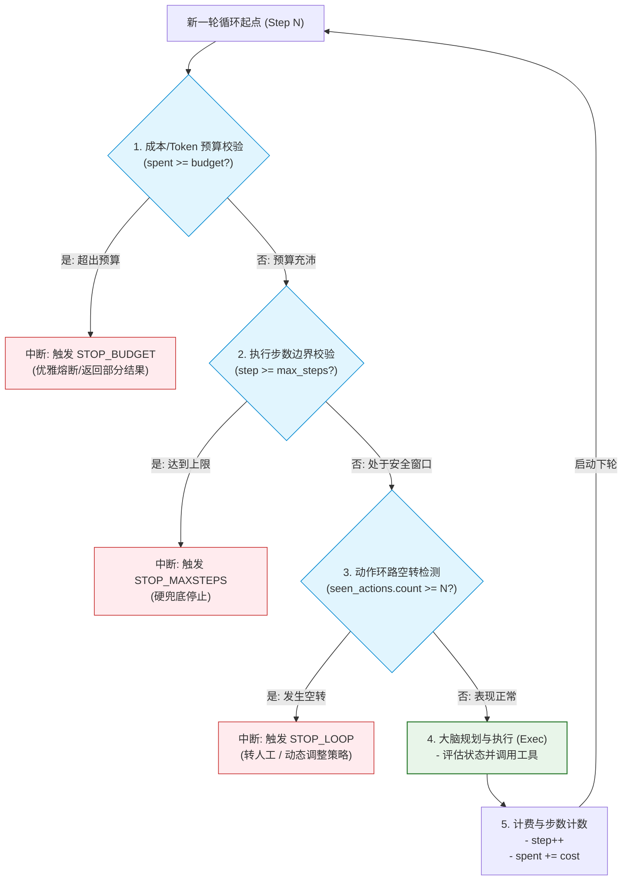
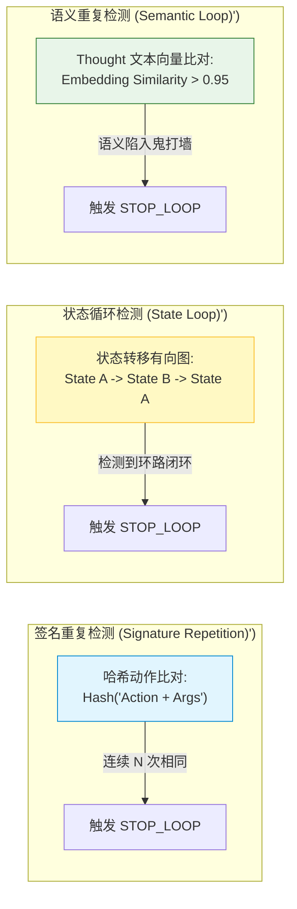
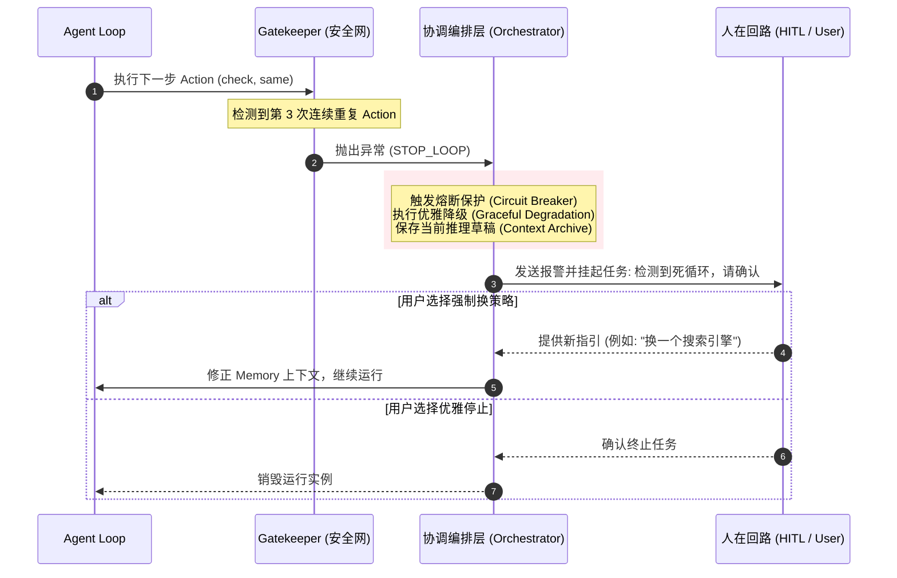

import GlossaryTerm from '@site/src/components/GlossaryTerm';
import GuidedExercise from '@site/src/components/GuidedExercise';
import ResearchNote from '@site/src/components/ResearchNote';
import ChapterMeta from '@site/src/components/ChapterMeta';
import PyRunner from '@site/src/components/PyRunner';
import TradeoffExplorer from '@site/src/components/TradeoffExplorer';
import StepFlow from '@site/src/components/StepFlow';
import QuizCard from '@site/src/components/QuizCard';

# M9L4 · 停止条件与预算控制

<ChapterMeta
  time="约 2 小时"
  prereqs={[{label: 'M9L1 agent loop', href: './agent-loop-basics'}, {label: 'M7L5 成本', href: '../llm-systems/llm-api-cost-latency'}, {label: 'M5L7 重试预算', href: '../core-components/retry-backoff-timeout'}]}
  outcome="能给 Agent 加上必须的停止条件：最大步数、循环检测、成本/工具预算，防止无限循环和烧穿。"
  howToUse="先看“Agent 停不下来”的灾难，再加几种停止条件，最后做循环检测 + 预算 lab。"
/>

:::tip Agent 最贵、最危险的 bug，是“它根本不停”
[agent loop（M9L1）](./agent-loop-basics) 是个循环——而循环最危险的失败模式就是**停不下来**。模型可能永远不说"完成"、反复试同一个失败的动作、在两个状态间来回打转。后果：烧掉大量 token（[每步一次调用 M7L5](../llm-systems/llm-api-cost-latency)）、延迟无限拉长、副作用累积。所以 Agent **必须**有强制停止的安全带：最大步数、循环检测、成本预算。这不是可选项，是底线。
:::

## 一、停不下来的几种死法

Agent 失控的典型表现：
- **永不完成**：模型一直觉得"还差一点"，不输出 finish，循环到天荒地老。
- **反复试同一个失败动作**：某工具一直返回错误，模型一直用同样参数重试（没有[反思 M9L7](./reflection-correction)）。
- **状态来回打转**：在 A→B→A→B 之间循环，毫无进展。
- **预算烧穿**：每步一次 LLM 调用 + 可能的工具花费，多步累积成一笔大账单——一个失控的 Agent 能在几分钟内烧掉惊人的成本。

这些都不能靠"指望模型自己停"——模型不可靠，**必须由外层的工程代码强制兜底**。

## 二、三个核心概念（分层）

### 基础：最大步数（硬上限）

最简单也最必须的安全带：<GlossaryTerm term="Max Steps" definition="最大步数：Agent 循环的硬上限，达到就强制停止（返回当前最好结果或失败），防止无限循环。是 Agent 必备的底线安全带。">最大步数（max steps）</GlossaryTerm>。loop 跑到 N 步还没 finish，就**强制停止**——返回当前最好的结果，或标记"未完成、需人工"。它不解决"为什么没完成"，但保证 Agent 一定会停、成本有上限。这是 [M9L1 lab 里已经有的 max_steps](./agent-loop-basics)——它不是可选的兜底，是底线。

### 进阶：循环检测与预算

光有最大步数不够（可能在上限内一直空转）。还要：
- <GlossaryTerm term="Loop Detection" definition="循环检测：检测 Agent 是否在重复同样的（状态/动作）——比如反复用相同参数调同一工具、或在几个状态间来回。检测到就提前终止或强制换策略，而非等到耗尽最大步数。">循环检测</GlossaryTerm>：检测"重复的状态/动作"——如果模型反复用相同参数调同一工具、或在几个状态间打转，提前终止或强制换策略，别白白耗到最大步数。
- <GlossaryTerm term="Agent Budget" definition="Agent 预算：限制一次 Agent 运行的总成本（token/钱）或总工具调用数，逼近上限就停止或转人工。把不确定的多步循环的成本封顶。">成本/调用预算 (Agent Budget)</GlossaryTerm>：给整次 Agent 运行设 token/花费/工具调用总上限（[呼应 M5L7 重试预算、M7L11 成本上限](../core-components/retry-backoff-timeout)），逼近就停。把"不确定要跑几步"的循环成本封顶。

### 深入（选学）：停止条件的设计与"优雅停止"

- **多种停止条件并用**：max steps（硬兜底）+ 循环检测（防空转）+ 预算（控成本）+ 成功条件（任务完成）+ 失败条件（明确无法完成）——它们是一组安全带，缺一不可。
- **优雅停止而非崩溃**：触发停止时，不是直接报错丢弃，而是返回"当前最好的部分结果 + 为什么停了 + 是否需要人工接手"——[呼应 M7L9 弃答、M5 优雅降级](../llm-systems/hallucination-guardrails)。
- **停止 ≠ 失败**：达到上限可能意味着任务太难、或工具不够、或目标不清——这是有价值的信号，要[记录并评测（M9L10）](./agent-evaluation)，而非简单丢弃。
- **预算分配**：复杂任务可给更多步数/预算，简单任务给少——按任务难度动态设，别一刀切。
- **这是 Agent 版的“熔断”**：遵循 **<GlossaryTerm term="Circuit Breaker" definition="熔断器：分布式系统中的一种防护机制。当依赖的外部接口发生大量延迟或错误时，前置阻断请求直接返回备用响应，避免雪崩效应。">熔断器 (Circuit Breaker)</GlossaryTerm>** 思想。[M5L6 熔断](../core-components/circuit-breaker) 是“依赖持续失败就停止调用”，Agent 停止条件是“循环持续无进展/超预算就停止”——同一种“防止坏情况无限放大”的安全思想。为了实现高弹性，也应该结合 **<GlossaryTerm term="SRE" definition="SRE (站点可靠性工程)：结合软件开发技术与运维最佳实践，构建、测量和运行具备极高弹性与可靠性的系统工程学科。">SRE (站点可靠性工程)</GlossaryTerm>** 的 **<GlossaryTerm term="Graceful Degradation" definition="优雅降级：系统在部分组件故障或资源（步数/预算）耗尽时，主动放弃部分边缘功能，保证核心流程依然能返回可用回复的容错策略。">优雅降级</GlossaryTerm>** 原则，发生熔断时返回部分结果。失控的自主循环，比失控的重试更危险（它还会自主行动），所以兜底更不能省。

<ResearchNote
  title="停止条件：把不确定的自主循环的成本与风险封顶"
  source="Agent 工程实践；Google SRE 过载/熔断思想；M5L7 重试预算 / M7L11 成本上限"
  href="https://www.anthropic.com/research/building-effective-agents"
  insight="Agent 循环的最危险失败是不终止：永不完成、反复重试、状态打转、烧穿预算。必须用外层工程强制兜底——最大步数（硬上限）、循环检测（防空转）、成本/调用预算（控花费）、明确的成功/失败条件。触发时优雅停止并返回部分结果 + 是否需人工，而非崩溃。"
  application="给每个 Agent 配齐停止条件：max steps + 循环检测 + 预算 + 成功/失败判定。按任务难度分配预算。停止时返回最好结果和原因、标记是否需人工。把停止条件当 Agent 版熔断——不可省的安全带，因为失控的自主循环比失控重试更危险。"
/>

### 技术架构图解与生命周期演示 (Deep Dive Diagrams & Lifecycle)

#### 1. 多维防护网：Agent 循环判定流 (Multi-Dimensional Guardrails)



#### 2. 循环空转检测原理对比 (Loop Detection Mechanisms)



#### 3. 异常熔断与人在回路协同 (HITL & Circuit Breaking Integration)



#### 4. 交互演示：停止条件安全防御链

以下展示了安全防御网拦截失控循环与成本超限的五个具体防御步骤：

<StepFlow
  steps={[
    {
      title: '1. 循环起点成本审计',
      desc: '进入新的一步前，前置累加器计算当前已消耗的 token 额度或 API 物理花费。当 spent 逼近 budget 限制时，立刻拉响警报。',
      diagram: '累加器: spent: $9.50 ──> 限制值: $10.00 ──> 额度检测通过'
    },
    {
      title: '2. 循环步数硬门槛校验',
      desc: '比对当前 step 与 max_steps。作为终极底线拦截网，即使模型推理完全跑偏，该门槛也能保证系统有界停机。',
      diagram: '当前步数: 19 ──> 硬上限: 20 ──> 放行'
    },
    {
      title: '3. 环路签名相似度检查',
      desc: '检查最近数次行动序列（Action + Argument）。若模型在工具报错后依然以完全一致的参数反复发出重试（鬼打墙），立即将其熔断。',
      diagram: 'seen_actions: [check(same), check(same), check(same)] ──> 触发 STOP_LOOP'
    },
    {
      title: '4. 动态降级与优雅停机',
      desc: '当拦截发生时，系统不直接抛出 crash 异常，而是整理已经得到的前置 Observation，生成一份“尽力而为”的半成品结果报告。',
      diagram: 'STOP_LOOP 拦截 ──> 提取前 18 步有效成果 ──> 生成半成品报告'
    },
    {
      title: '5. 人在回路状态转交',
      desc: '将半成品报告、拦截原因及当前的上下文上下文快照打包，投递至告警队列或前端页面，挂起线程等待人工介入，实现高可用运维。',
      diagram: '保存快照 ──> 挂起线程 ──> 投递人工审查面板'
    }
  ]}
/>

## 三、跟我做一遍：循环检测 + 预算的 Agent Loop

<PyRunner
  rows={40}
  expect="无限循环被检测并停止"
  code={`def run_agent(policy, tools, max_steps=20, budget=10):
    state = {"observations": [], "spent": 0}
    seen_actions = []                          # 用于循环检测
    for step in range(max_steps):              # 1) 硬上限
        if state["spent"] >= budget:           # 2) 预算
            return ("STOP_BUDGET", step, state)
        d = policy(state)
        if d["action"] == "finish":
            return ("DONE", step, d.get("arg"))
        sig = (d["action"], d["arg"])
        # 3) 循环检测：最近 3 次完全相同的动作 -> 判定空转
        seen_actions.append(sig)
        if seen_actions[-3:].count(sig) == 3 and len(seen_actions) >= 3:
            return ("STOP_LOOP", step, "检测到重复动作，停止")
        result = tools[d["action"]](d["arg"])
        state["spent"] += 1                    # 每次工具调用计入预算
        state["observations"].append((d["action"], result))
    return ("STOP_MAXSTEPS", max_steps, state)  # 达上限

def flaky(x): return "ERROR"                    # 一个总失败的工具
tools = {"check": flaky}

# 一个“没有反思能力”的坏 policy：永远用同样参数重试失败的动作
def bad_policy(state):
    return {"action": "check", "arg": "same"}

kind, step, info = run_agent(bad_policy, tools, max_steps=20, budget=10)
print("停止原因:", kind, "在第", step, "步")     # STOP_LOOP：循环检测提前止损
print("（没有循环检测的话会一直跑到 max_steps 或烧穿预算）")
print("无限循环被检测并停止")`}
/>

一个"不会反思、反复用同样参数重试失败动作"的坏 Agent，被循环检测在第 3 次重复时就止损，而不是白白跑满 20 步或烧穿预算——这就是停止条件的价值。**试试**：去掉循环检测，看它一直跑到预算耗尽（STOP_BUDGET）或最大步数；想想真实系统里检测到循环后，除了停止，还能"强制换策略"或转人工。

## 四、动手 Lab（必做）

打开 `labs/month09/m9l4_stopping/`：

```bash
python labs/month09/m9l4_stopping/test_stopping.py
```

实现带多重停止条件的 agent loop：finish 正常停、max_steps 硬停、预算超限停、重复动作（循环）检测停。

<GuidedExercise
  title="练习指引：实现停止条件"
  goal="把“最大步数 + 循环检测 + 预算”做成代码——Agent 必备的安全带。"
  hints={[
    'finish -> DONE；spent >= budget -> STOP_BUDGET；达 max_steps -> STOP_MAXSTEPS。',
    '循环检测：记录动作签名，连续 N 次相同则 STOP_LOOP。',
    '每次工具调用计入 spent（预算）。',
    '返回 (停止原因, 步数, 信息)，停止要优雅（带原因）。'
  ]}
  steps={[
    '实现 run_agent(policy, tools, max_steps, budget)。',
    '按优先级检查：预算 → finish → 循环检测 → 执行 → 计费。',
    '达 max_steps 返回 STOP_MAXSTEPS。',
    '写测试：正常 finish、max_steps 停、预算停、循环检测停、各返回正确原因。'
  ]}
  checks={[
    '你能列出 Agent 必须的几种停止条件。',
    '你的 lab 能在无限循环时检测并止损。',
    '你能解释为什么不能指望模型自己停。',
    '你理解停止条件是 Agent 版熔断、要优雅停止。'
  ]}
/>

## 架构师深潜（Staff+ 视角）

### 1. 停止条件类型

<TradeoffExplorer
  title="Agent 停止条件"
  dimensions={['防失控', '止损及时', '实现简单', '保留有用结果', '必需程度']}
  options={[
    {
      name: '最大步数',
      scores: [4, 2, 5, 3, 5],
      note: '硬上限、必备。一定会停，但可能浪费很多步才停、不解释原因。',
      whenToUse: '所有 Agent 的底线兜底——不可省。'
    },
    {
      name: '循环检测',
      scores: [5, 5, 3, 3, 4],
      note: '检测重复/空转、及时止损。但要定义“重复”的判据。',
      whenToUse: '配合最大步数，防止白白耗到上限。'
    },
    {
      name: '成本/调用预算',
      scores: [4, 4, 4, 3, 5],
      note: '按 token/钱/工具调用封顶。直接控成本，跨步数维度兜底。',
      whenToUse: '控制 Agent 运行成本——必备护栏。'
    }
  ]}
/>

### 2. "会停"是 Agent 能上生产的前提

一个不能保证停止的 Agent，绝不能上生产——因为它可能在某次运行里无限循环，烧穿成本、卡住资源、累积副作用。所以"停止条件"不是优化项，是**准入门槛**：在让 Agent 自主运行之前，先确保它在任何情况下都一定会停、且成本有上限。这和 [M5 的"先保证不失控再谈优化"](../core-components/circuit-breaker)、[M7L11 成本上限](../llm-systems/llm-caching-resilience) 是同一种工程纪律：**对不确定、自主的系统，先封住最坏情况的边界，再追求好情况的表现。** 架构师评审一个 Agent 设计，第一个问题就该是"它怎么停、最坏花多少"——答不上来的 Agent 不能上线。

### 3. 真实案例：失控 Agent 的天价账单

Agent 时代的一类新事故：一个 Agent 因为某个工具持续失败、或目标设置不当、或陷入逻辑死循环，在无人值守时反复调用 LLM 和工具，几小时内烧掉远超预期的费用——有团队因此收到过惊人的账单。根因都是**缺少停止条件和预算上限**：没有循环检测（一直重试失败动作）、没有成本封顶（一直烧 token）。这正是为什么本课说停止条件是"底线"。修法很简单也很必须：max steps + 循环检测 + 成本预算 + 告警。**Agent 的自主性必须用硬性的成本和步数边界框住**——给它自由，但给自由设上限。

### 4. 架构师深问（给自己 30 分钟）

- 你的 Agent 在最坏情况下一定会停吗？最多跑几步、最多花多少钱？这两个数你能说出来吗？
- 你检测循环/空转吗？模型反复试同一个失败动作时，是会一直试到上限，还是能提前止损/换策略/转人工？
- 触发停止时，你的 Agent 是崩溃丢弃，还是优雅返回"部分结果 + 为什么停 + 是否需人工"？

## 知识自测

<QuizCard
  questions={[
    {
      q: '为什么在生产级 Agent 系统中，“最大步数（max_steps）”被视为兜底的“生命线”安全带？',
      options: [
        'A. 因为设置最大步数可以提升底层大模型的上下文检索准确率',
        'B. 大模型是非确定性系统，在遭遇环境异常时极易发生逻辑陷入，如果没有硬性的步数上限限制，Agent 会发生无法预测的持续循环，导致 Token 账单与系统线程资源被无限燃烧',
        'C. 设置最大步数可以让大模型的思考耗时减半',
        'D. 为了强行阻止大模型调用只读工具，提高写入性能'
      ],
      answer: 1,
      explain: '最大步数是整个 Agent Loop 的硬界限。无论模型多么聪明，都无法保证 100% 不陷入死循环或鬼打墙。从 SRE 和资源安全的角度看，必须给不确定的执行树规定一个强硬的硬物理上限，这是保护系统资源不被耗尽的最有效兜底。'
    },
    {
      q: '循环检测（Loop Detection）与最大步数（Max Steps）在 Agent 防御设计中有什么关系与取舍？',
      options: [
        'A. 循环检测完全可以替代最大步数，不需要设步数上限了',
        'B. 最大步数属于全局粗粒度的硬上限阻断，而循环检测属于更灵敏的空转提前止损机制。二者应当并存，用循环检测在低步数时捕获“鬼打墙”，用最大步数兜底防范其他无法识别的渐进式长死循环',
        'C. 循环检测耗费大量计算资源，在实际生产中通常被舍弃',
        'D. 循环检测主要运行在 Agent 物理工具内部，由外部工具接口自发进行'
      ],
      answer: 1,
      explain: '两者是互补的防御深度。最大步数阻止了最坏的“永不停机”灾难，但可能会白白耗尽全部步数；循环检测则通过动作签名或状态历史识别空转（如连续重复执行），能在第 3-5 步及时熔断，避免无价值的 Token 损耗。'
    },
    {
      q: '触发 Agent 停止条件（如超出预算或发生空转）时，以下哪项设计最符合高弹性架构的“优雅停止（Graceful Degradation）”原则？',
      options: [
        'A. 直接在代码中抛出 RunTimeError，使整个宿主应用程序崩溃退出以引起开发人员注意',
        'B. 静默丢弃所有已有轨迹，直接给用户返回“系统繁忙，请稍后再试”',
        'C. 封存并打包当前已完成 of 中间 Observation，提供“尽力而为（Best-effort）”的半成品答卷，同时记录异常原因快照，挂起任务等待人在回路（HITL）接管或修正',
        'D. 自动清空所有已消耗的 Token 计费历史，重置预算并从第 1 步重新开始循环'
      ],
      answer: 2,
      explain: '高弹性系统（Resilient Systems）要求系统优雅降级。当 Agent 被迫中断时，它之前执行的多步动作可能已经拿到了大部分有价值的信息。将这些信息组装并输出，同时归档快照以便于人工审核或挂起，既保留了执行价值，又实现了人机协同。'
    }
  ]}
/>

## 自检清单

- [ ] 我能列出 Agent 必须的停止条件（max steps/循环检测/预算/成功失败）。
- [ ] 我的 lab 能在无限循环时检测并优雅止损。
- [ ] 我理解不能指望模型自己停、必须工程兜底。
- [ ] 我把停止条件当 Agent 上生产的准入门槛。

## 常见误解

- **“模型有自知之明，会在发现无法完成任务时主动判定 finish”**：这是极其危险的拟人化误区。面对工具的反复报错，模型经常会产生“只要我换个姿势重试就一定能成功”的幻觉，或者单纯因为指令遵循度不够而无法输出 finish，从而陷入无休止的“尝试-失败”死循环。工程硬核拦截是唯一绝对可信的兜底。
- **“我们已经设置了 max_steps=30，所以不需要管成本预算了”**：最大步数只限制了“次数”，但无法控制“厚度”。大模型单次交互的 Token 长度（尤其是包含了超长工具反馈或 RAG 检索结果后）可能会呈现爆炸式增长。一个 30 步的循环可能因为单步 Token 暴涨而烧掉极高费用。因此，必须引入基于 Token 数或 API 物理花费的**双重预算熔断机制**。
- **“触发停止条件就代表任务彻底失败，只能抛异常报错”**：在 SRE 思维中，熔断停止不是崩溃，而是**优雅降级**。Agent 的中间执行轨迹也是极其昂贵的资产。优雅停止应做到“资产保存”（保留部分推理成果并反馈）与“异常隔离”（记录快照，转交给人在回路协同），这也是系统能够弹性运转的精髓。

## 延伸阅读

- [Anthropic: Building effective agents](https://www.anthropic.com/research/building-effective-agents)
- [M5L6 熔断器](../core-components/circuit-breaker)
- [下一课：规划与任务分解](./planning-decomposition)