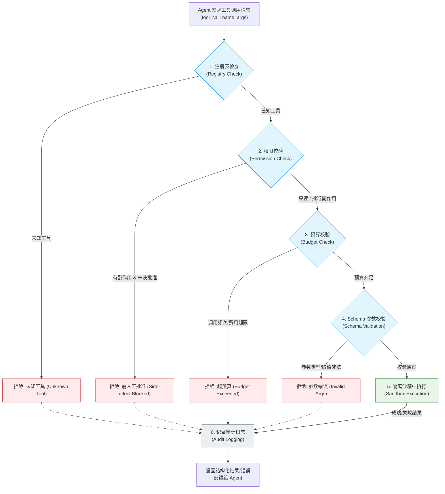
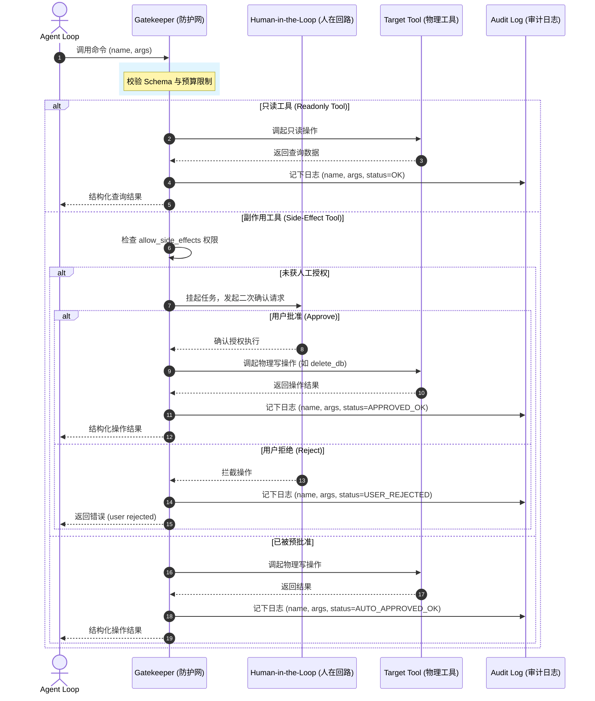
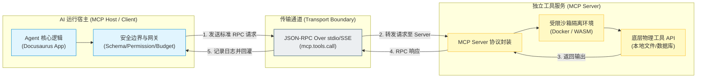

import GlossaryTerm from '@site/src/components/GlossaryTerm';
import GuidedExercise from '@site/src/components/GuidedExercise';
import ResearchNote from '@site/src/components/ResearchNote';
import ChapterMeta from '@site/src/components/ChapterMeta';
import PyRunner from '@site/src/components/PyRunner';
import TradeoffExplorer from '@site/src/components/TradeoffExplorer';
import StepFlow from '@site/src/components/StepFlow';
import QuizCard from '@site/src/components/QuizCard';

# M9L2 · 工具使用与边界

<ChapterMeta
  time="约 2.5 小时"
  prereqs={[{label: 'M9L1 agent loop', href: './agent-loop-basics'}, {label: 'M7L6 工具调用', href: '../llm-systems/structured-output-tools'}, {label: 'L3 输入校验', href: '../foundations/input-validation'}]}
  outcome="能给 Agent 的工具定义完整边界：schema 校验、权限、预算、超时、审计，并理解“工具的边界 = Agent 能闯祸的上限”。"
  howToUse="先看“Agent 自主调危险工具”的风险，再给工具加五道边界，最后做受约束工具注册 lab。"
/>

:::tip Agent 的能力上限和闯祸上限，都由它能调的工具决定
[M7L6](../llm-systems/structured-output-tools) 你学过工具调用：模型决定调什么、你的代码执行。在单次调用里这还可控。但在 [agent loop（M9L1）](./agent-loop-basics) 里，模型**自主地、反复地**决定调工具——如果某个工具能删数据、转账、对外发消息，模型一步走错就是真实事故。所以 Agent 的每个工具都必须有严格边界：**schema、权限、预算、超时、审计**。工具的边界，就是 Agent 能闯多大祸的边界。
:::

## 一、自主调用，把工具风险放大了

单次工具调用（[M7L6](../llm-systems/structured-output-tools)）里，模型调一次工具、你校验执行，风险有限。但在 agent loop 里：
- 模型**自主、多次**调工具，没有人逐次把关。
- 它可能**调错工具、传错参数、反复调**（[循环 M9L4](./stopping-budget)）。
- 如果工具有副作用（写数据库、发邮件、花钱、执行命令），**错一步就不可逆**。
- 它还可能被[恶意输入诱导（prompt injection）](./agent-guardrails) 去调危险工具。

所以给 Agent 的工具，必须比单次调用时更严格地设边界。**工具能做什么，决定了 Agent 最坏能造成什么后果。**

## 二、三个核心概念（分层）

### 基础：工具的五道边界

每个给 Agent 用的工具，都该定义（[扩展 M7L6 的工具描述](../llm-systems/structured-output-tools)）：
- <GlossaryTerm term="Tool Schema" definition="工具 schema：工具的名字、用途、参数类型和约束。既是给模型的说明书（让它知道何时用、怎么传参），也是执行前校验参数的依据。">Schema</GlossaryTerm>：参数结构和约束，执行前[校验（L3）](../foundations/input-validation)。
- <GlossaryTerm term="Tool Permission" definition="工具权限：限定工具能访问的数据/资源范围、是否只读、能否产生副作用。基于最小权限原则——给 Agent 的工具默认只读、范围最小。">权限（permission）</GlossaryTerm>：能访问什么、是否只读、能否有副作用。遵循 **<GlossaryTerm term="Principle of Least Privilege" definition="最小权限原则：安全设计的基本原则，要求系统或用户仅拥有其执行特定任务所必需的、最受限的权限，从而限制错误发生时的爆炸半径。">最小权限原则</GlossaryTerm>**：默认只读、范围最小。
- <GlossaryTerm term="Tool Budget" definition="工具预算：限制某工具的调用次数/花费上限，防止 Agent 在循环里反复调用某工具导致烧钱或副作用累积。">预算（budget）</GlossaryTerm>：最多调几次、最多花多少——防 [agent 循环烧穿（M9L4）](./stopping-budget)。
- **超时（timeout）**：多久必须失败（[M5L7](../core-components/retry-backoff-timeout)），别让一个工具卡死整个 loop。
- <GlossaryTerm term="Audit Log" definition="审计日志：记录每次工具调用的原因、参数、结果、错误和时间。让 Agent 的行为可追溯、可排错、可审计——尤其有副作用的工具必须留痕。">审计日志（audit）</GlossaryTerm>：每次调用记下原因/参数/结果/错误——可追溯、可排错。

### 进阶：只读 vs 副作用工具，分级对待

工具按“能造成多大后果”分级，约束程度不同：
- **只读工具**（查数据、搜索、读文件）：风险低，可较宽松地让 Agent 自主调。
- **有副作用工具**（写数据、发消息、花钱、执行命令）：风险高，要**更严的权限 + 预算 + 审计**，危险的还要 **<GlossaryTerm term="Human-in-the-loop" definition="人在回路：智能系统的一种协作模式，在大模型做出高风险决策或执行有副作用的工具前，必须由人类操作员进行审查、批准或修正。">人在回路 (Human-in-the-Loop / HITL)</GlossaryTerm>** 确认（[M9L9](./agent-guardrails)）。
- **设计原则**：尽量把工具设计成**只读 + 提议**——Agent 只读取信息、生成“建议的操作”，真正执行有副作用的动作交给确定的代码或人确认（[呼应 M6L11 工业 AI 建议 vs 控制](../cloud-enterprise-industrial/industrial-edge-realtime)）。

### 深入（选学）：工具边界的工程要点

- **参数校验是安全第一关**：模型生成的参数是[不可信输入（L3/M7L6）](../foundations/input-validation)——可能类型错、越权、注入。执行前必须按 schema 严格校验，[尤其防注入](./agent-guardrails)（参数拼进 SQL/命令/路径）。
- **工具描述就是 prompt 的一部分**：写清楚名字、用途、何时用、参数含义——模型靠它决策。描述不清，Agent 就会乱调（[呼应 M7L6](../llm-systems/structured-output-tools)）。
- **错误要回传给模型**：工具失败（参数错/超时/无权限）不要崩溃，把错误结构化回传给 Agent，让它[反思调整（M9L7）](./reflection-correction) 或换策略。
- **MCP 等标准化协议**：业界用 **<GlossaryTerm term="Model Context Protocol" definition="模型上下文协议 (MCP)：由 Anthropic 发起的开源标准，旨在统一大模型应用程序 (Host) 与数据源及工具服务 (Server) 之间的双向接口规范。">Model Context Protocol (MCP)</GlossaryTerm>** 等标准化“工具/上下文怎么暴露给模型”，让工具可复用、可治理——但 schema/权限/审计的工程要点不变。
- **沙箱隔离 (Sandboxing)**：对于可能执行动态指令或不安全脚本的工具，必须在隔离的 **<GlossaryTerm term="Sandboxing" definition="沙箱化隔离：将不受信任的代码、工具执行或命令限制在受保护的、与宿主系统安全隔离的虚拟环境（如 Docker 容器、WASM 运行时）中运行。">沙箱隔离 (Sandboxing)</GlossaryTerm>** 环境下运行，以防止大模型被注入恶意的物理操作系统级破坏命令。
- **工具集要精简**：给 Agent 太多工具会让它选困难、易出错；只给完成任务必需的、边界清晰的工具。
- 工具边界本质是 [M5L8 舱壁/M7L9 护栏](../core-components/bulkhead-isolation) 在 Agent 上的体现——**限制单个工具的爆炸半径，就限制了整个 Agent 的爆炸半径**。

<ResearchNote
  title="工具边界：Agent 安全的第一道防线"
  source="ReAct / Toolformer；Anthropic Tool use / MCP；最小权限与审计原则"
  href="https://modelcontextprotocol.io/"
  insight="Agent 自主、反复地调用工具，使工具的副作用风险被放大。每个工具需定义 schema（校验参数）、权限（最小、默认只读）、预算（限次/限额）、超时、审计（留痕）。把工具设计成只读+提议、有副作用的交人确认，能从根上限制 Agent 的爆炸半径。MCP 等协议标准化了工具的暴露方式。"
  application="给 Agent 的每个工具配齐五道边界（schema/权限/预算/超时/审计）；按只读 vs 副作用分级；危险动作走人在回路；严格校验模型生成的参数防注入；错误结构化回传让 Agent 自我纠正；工具集精简。工具边界 = Agent 闯祸上限。"
/>

### 技术架构图解与生命周期演示 (Deep Dive Diagrams & Lifecycle)

#### 1. 工具安全隔离过滤链 (Tool Execution Gatekeeper Chain)



#### 2. 只读 vs. 副作用工具执行流决策 (Readonly vs. Side-Effect Lifecycle)



#### 3. 基于 MCP 协议的 Tool-Host-Server 解耦边界 (MCP Decoupling Boundary)



#### 4. 交互演示：工具调用的生命周期防护链

以下展示了一个包含安全防御的完整工具调用在系统内部流转时的每个具体步骤：

<StepFlow
  steps={[
    {
      title: '1. 工具调用请求解析',
      desc: '当 Agent 循环中的大模型决定执行外部动作时，它输出 tool_call 参数。系统解析出调用的工具名称与实参。',
      diagram: 'LLM 输出 ──> 解析出 {name: "delete_db", args: {table: "users"}}'
    },
    {
      title: '2. 鉴权与副作用拦截',
      desc: '系统匹配已注册工具的 readonly 属性。如果涉及写操作或外部修改且系统未开启 allow_side_effects，直接前置阻断并抛出需人工审批的错误。',
      diagram: '验证是否只读 ──> delete_db (只读=False) ──> allow_side_effects 为 False ──> 拦截并记 BAD_PERMISSION'
    },
    {
      title: '3. 频次与预算计数校验',
      desc: '在调用被真正放行前，计算该工具已执行的累积次数是否超过设定的上限值，防止 Agent 反复调用导致服务器过载或产生天价 Token 账单。',
      diagram: '验证 tool.calls (2) < tool.budget (2) ──> 若超出则拦截并记 BUDGET_EXCEEDED'
    },
    {
      title: '4. 参数 Schema 严格比对',
      desc: '将大模型传来的参数与注册的 Schema 声明做严格的类型比对，防止因大模型产生幻觉格式（如传入整型而非字符串）导致后端接口发生未捕获异常。',
      diagram: '检查参数表 ──> 参数 table 应为 str，模型传了 123 ──> 拦截并记 BAD_ARGS'
    },
    {
      title: '5. 沙箱物理执行与审计日志归档',
      desc: '全部边界通过后，在受限沙箱中启动工具代码。执行完毕后，无论成功或失败，均在全局 Audit Logs 中记下本次调用的最终状态。',
      diagram: '物理执行 ──> 捕获结果 ──> calls++ ──> 审计日志添加 (name, "OK") ──> 结果回灌至 Agent'
    }
  ]}
/>


## 三、跟我做一遍：带边界的工具注册

<PyRunner
  rows={40}
  expect="越权/超预算/参数错都被挡"
  code={`class Tool:
    def __init__(self, name, fn, readonly, schema, budget):
        self.name = name; self.fn = fn; self.readonly = readonly
        self.schema = schema; self.budget = budget; self.calls = 0

class ToolRegistry:
    def __init__(self, allow_side_effects=False):
        self.tools = {}; self.allow_side_effects = allow_side_effects; self.audit = []

    def register(self, tool):
        self.tools[tool.name] = tool

    def call(self, name, args):
        t = self.tools.get(name)
        if t is None:
            return {"error": "unknown tool"}                  # 只允许注册过的
        if not t.readonly and not self.allow_side_effects:    # 权限：副作用工具默认禁止
            self.audit.append((name, "BLOCKED_SIDE_EFFECT"))
            return {"error": "side-effect tool needs approval"}
        if t.calls >= t.budget:                               # 预算：限次
            self.audit.append((name, "BUDGET_EXCEEDED"))
            return {"error": "tool budget exceeded"}
        for k, typ in t.schema.items():                       # schema 校验参数
            if k not in args or not isinstance(args[k], typ):
                self.audit.append((name, "BAD_ARGS"))
                return {"error": "invalid args"}
        t.calls += 1
        result = t.fn(**args)
        self.audit.append((name, "OK"))                       # 审计留痕
        return {"result": result}

reg = ToolRegistry(allow_side_effects=False)
reg.register(Tool("search", lambda q: "结果:" + q, readonly=True, schema={"q": str}, budget=2))
reg.register(Tool("delete_db", lambda table: "DROPPED", readonly=False, schema={"table": str}, budget=1))

print(reg.call("search", {"q": "天气"}))            # OK
print(reg.call("delete_db", {"table": "users"}))    # 被挡：副作用工具需批准
print(reg.call("search", {"q": 123}))               # 被挡：参数类型错
reg.call("search", {"q": "a"})
print(reg.call("search", {"q": "b"}))               # 第 3 次超预算被挡
print("审计:", reg.audit)
print("越权/超预算/参数错都被挡")`}
/>

只读 search 正常用，但有副作用的 delete_db 被默认拦下（需批准）、参数类型错被挡、超过预算被挡，每次调用都留审计——这就是工具的五道边界。**试试**：把 ToolRegistry 设成 `allow_side_effects=True`（模拟人工批准后），看 delete_db 能否执行；想想真实系统里"批准"该是人在回路（M9L9）。

## 四、动手 Lab（必做）

打开 `labs/month09/m9l2_tools/`：

```bash
python labs/month09/m9l2_tools/test_tools.py
```

实现带边界的工具注册：schema 校验、只读/副作用权限、调用预算、审计日志，未知/越权/超预算/参数错都拦下。

<GuidedExercise
  title="练习指引：实现受约束工具注册"
  goal="把“schema + 权限 + 预算 + 审计”做成代码——Agent 安全的第一道防线。"
  hints={[
    'call 顺序：未知工具 → 权限(副作用默认禁) → 预算 → schema 校验 → 执行 + 审计。',
    '权限：readonly=False 的工具，除非 allow_side_effects，否则拦下。',
    '预算：calls 达 budget 就拦。',
    '每条路径都记审计（OK/各种拦截原因）。'
  ]}
  steps={[
    '实现 Tool 和 ToolRegistry。',
    'call：依次检查未知/权限/预算/schema，通过才执行并计数。',
    '所有结果记入审计。',
    '写测试：只读正常、副作用被拦、超预算被拦、参数错被拦、未知工具被拦、审计完整。'
  ]}
  checks={[
    '你能列出 Agent 工具的五道边界。',
    '你的 lab 能拦下越权/超预算/参数错的调用。',
    '你能区分只读和副作用工具的不同对待。',
    '你理解工具边界 = Agent 闯祸上限。'
  ]}
/>

## 架构师深潜（Staff+ 视角）

### 1. 工具风险分级

<TradeoffExplorer
  title="按副作用给工具分级"
  dimensions={['可让 Agent 自主调', '风险', '需审计', '需人确认', '常见例子']}
  options={[
    {
      name: '只读工具',
      scores: [5, 1, 3, 1, 5],
      note: '查数据、搜索、读文件。风险低，可较自由地让 Agent 调。',
      whenToUse: 'Agent 的默认工具类型——优先设计成只读。'
    },
    {
      name: '可逆副作用',
      scores: [3, 3, 5, 2, 3],
      note: '写草稿、建临时记录等可撤销操作。需审计，部分需确认。',
      whenToUse: '能回滚的写操作。'
    },
    {
      name: '不可逆/高危副作用',
      scores: [1, 5, 5, 5, 2],
      note: '删数据、转账、发外部消息、执行命令。必须人确认 + 审计 + 严格权限。',
      whenToUse: '尽量避免让 Agent 直接调；改为提议 + 人执行。'
    }
  ]}
/>

### 2. "把工具设计成只读 + 提议"是 Agent 安全的关键设计

降低 Agent 风险最有效的架构选择，不是"让模型更守规矩"，而是**从工具设计上限制它能造成的后果**：让 Agent 的工具尽量是**只读的（获取信息）+ 生成提议的（产出"建议执行的操作"而非直接执行）**，把真正有副作用的执行交给确定的代码或人确认。这样即使模型决策错了，最坏也只是"读了不该读的（靠权限挡）"或"提了个坏建议（靠人/代码把关）"，而不会直接造成不可逆后果。这和 [M6L11 工业 AI"建议 vs 控制"](../cloud-enterprise-industrial/industrial-edge-realtime)、[M7L9 高风险人在回路](../llm-systems/hallucination-guardrails) 是同一条安全原则：**越接近不可逆/高后果的动作，越要把自主权从模型手里收回来。**

### 3. 真实案例：Agent 工具权限事故

Agent 安全事故的典型模式：给 Agent 开放了一个权限过大的工具（能执行任意 SQL、能调任意 API、能读整个文件系统），然后模型——可能因为决策失误、可能因为被用户的 [prompt injection（M9L9）](./agent-guardrails) 诱导——调用它造成了数据泄露/删除/越权。事后复盘几乎都指向同一处：**工具权限太大、没有最小权限和审计**。修法就是本课：工具最小权限、副作用工具人确认、参数严格校验防注入、全程审计。**Agent 的安全边界，95% 由工具的设计决定**——模型再守规矩，给它一把能删库的钥匙也迟早出事。

### 4. 架构师深问（给自己 30 分钟）

- 列出你 Agent 的所有工具，标出哪些只读、哪些有副作用、哪些不可逆。不可逆的能改成"提议 + 人执行"吗？
- 模型生成的工具参数，你严格校验了吗（类型/范围/权限/注入）？参数会拼进 SQL/命令/路径吗？
- 每次工具调用有审计吗？出了事你能追溯到 Agent 哪一步、用什么参数调了什么？

## 知识自测

<QuizCard
  questions={[
    {
      q: '在设计高风险（如删除数据、发起转账）的 Agent 工具时，架构师首选的安全控制模式是什么？',
      options: [
        'A. 在系统 Prompt 中以大字号醒目标注“绝对不能在未经用户允许的情况下执行该操作”',
        'B. 将工具设计为“只读数据获取 + 提议生成”架构，Agent 仅产出待执行提议，由外围确定的代码或人在回路（HITL）进行物理执行',
        'C. 每次调用时将大模型 Temperature 参数暂时调高以丰富决策方案',
        'D. 允许 Agent 物理执行操作，但限制每分钟最多调 100 次以减小损失'
      ],
      answer: 1,
      explain: '由于大模型具有不可避免的事实性幻觉且容易遭受 Prompt 注入攻击，从根源上保障安全的最有效做法是“限制工具物理执行能力”，即采用“只读获取信息 + 生成提议”的架构，把有副作用的动作执行权保留在传统的确定性安全防护网（人或代码）中。'
    },
    {
      q: '为什么说“模型生成的工具参数必须被视为不可信输入”？以下哪项理由最符合安全设计原则？',
      options: [
        'A. 模型生成的 JSON 字符串经常缺少闭合大括号，导致 Python 的 json.loads() 发生 Crash',
        'B. 模型倾向于生成超长字符串，这容易触发远程物理主机的缓冲区溢出漏洞',
        'C. 大模型生成的参数可能会被恶意的外部网页内容（通过检索等注入）污染，从而产生带有命令注入（如 SQL 注入、路径穿越或 rm -rf）的恶意工具调用参数',
        'D. 只有将参数视为不可信，才能符合 RESTful API 的设计规范'
      ],
      answer: 2,
      explain: '在 Agent 循环中，大模型经常去读取外部网页、邮件或不可信文档。当外部不可信数据被拼入上下文，大模型就可能被间接注入（Indirect Prompt Injection），指示它去执行危险工具（如调用 shell 传入 rm 或者是拼装 SQL 删除数据库）。因此，在执行工具前，必须通过 Schema、白名单、甚至隔离沙箱对参数进行严苛审计校验。'
    },
    {
      q: '关于 Model Context Protocol (MCP)，以下关于其在 Agent 安全治理中扮演的角色的说法，哪一项是正确的？',
      options: [
        'A. MCP 是一种在模型内部对参数矩阵进行硬性权限加密的深度学习算法',
        'B. MCP 将工具（Server）与模型调度器（Host）进行了解耦，但安全鉴权、预算拦截与审计通常必须由 Host 侧强行实现，因为 Server 侧无法自主约束不信任的 Host 调用',
        'C. MCP 协议规定所有工具都必须部署在 Docker 容器内部，从而天然免去了 Host 侧的鉴权流程',
        'D. 只要启用了 MCP 协议，大模型就不再需要声明 Tool Schema 即可自主识别所有 API'
      ],
      answer: 1,
      explain: 'MCP 通过标准 JSON-RPC 使得工具生态标准化，但安全的核心防线（如预算控制、人工审批挂起、敏感权限过滤）仍然是 Host 的责任。Host 是边界的看门人，Server 是工具的提供者。'
    }
  ]}
/>

## 自检清单

- [ ] 我能列出 Agent 工具的五道边界（schema/权限/预算/超时/审计）。
- [ ] 我的 lab 能拦下越权/超预算/参数错的调用并留审计。
- [ ] 我能按只读 vs 副作用给工具分级、分别对待。
- [ ] 我理解"只读+提议"是 Agent 安全的关键设计。

## 常见误解

- **“工具调用 M7L6 学过了，Agent 一样”**：在单次调用中，由于有开发者代码在中间控制，风险相对可控；但在 Agent 循环中，由于模型可以自主、并发地反复调用，任何轻微的偏移或多次重试都会放大风险，因此需要极其严苛的物理边界（安全隔离与预算硬限制）。
- **“靠 prompt 让模型别调危险工具”**：大模型是非确定性的，极其容易遭到 **<GlossaryTerm term="Indirect Prompt Injection" definition="间接提示词注入：一种攻击手段，攻击者通过在 Agent 检索的外部文档、网页或邮件中嵌入恶意指令，诱导大模型在分析这些数据时执行非预期的指令或调用危险工具。">间接提示词注入 (Indirect Prompt Injection)</GlossaryTerm>** 的危害。在工具执行层依靠硬代码权限与人在回路进行拦截，是不可绕过的最后防线，绝不能依赖模型自身的“道德防线”。
- **“给 Agent 越多越强的工具越好”**：工具集越庞大，模型进行规划时的检索和选择难度呈指数级增加，决策准确度会随之下降（被称为“工具选择迷失”）。同时，越强大的工具意味着更高的爆炸半径。架构师应秉持**最小权限原则**，精简工具集，只暴露任务必需的工具。
- **“在 MCP Server 端做好安全校验就足够了”**：MCP Server 是无状态 of 工具暴露层，无法感知具体的 Host 执行上下文（如当前 Agent 调用的全局 Token 预算、累积步数、特定用户身份）。因此，安全拦截、人在回路授权、限额预算等看门人职责，必须且只能发生在 Host（调度端）。

## 延伸阅读

- [Model Context Protocol (MCP)](https://modelcontextprotocol.io/)
- [Anthropic: Tool use](https://docs.anthropic.com/en/docs/build-with-claude/tool-use)
- [下一课：ReAct 推理与行动](./react-pattern)