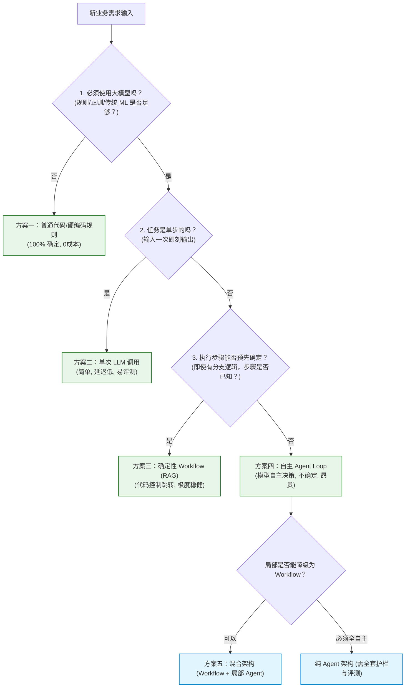
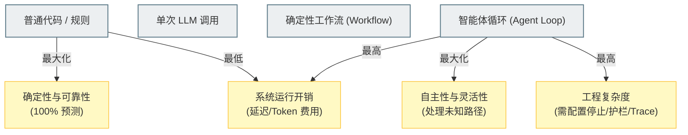

import GlossaryTerm from '@site/src/components/GlossaryTerm';
import GuidedExercise from '@site/src/components/GuidedExercise';
import ResearchNote from '@site/src/components/ResearchNote';
import ChapterMeta from '@site/src/components/ChapterMeta';
import PyRunner from '@site/src/components/PyRunner';
import TradeoffExplorer from '@site/src/components/TradeoffExplorer';
import QuizCard from '@site/src/components/QuizCard';

# M9L11 · 何时不该用 Agent

<ChapterMeta
  time="约 2 小时"
  prereqs={[{label: 'M9L1 Agent vs workflow', href: './agent-loop-basics'}, {label: 'M4L1 YAGNI', href: '../design-patterns-lld/change-driven-design'}, {label: 'M6L9 别过度', href: '../cloud-enterprise-industrial/multi-cloud'}]}
  outcome="能判断一个任务该用 Agent 还是更简单的方案（固定 workflow / 单次调用 / 普通代码），理解 Agent 的成本，并默认选最简单够用的方案。"
  howToUse="先看“为了 Agent 而 Agent”的代价，再学判断标准，最后做 workflow-vs-agent 决策 lab。"
/>

:::tip 学了一个月 Agent，最该带走的一课是：大多数时候，别用 Agent
Agent 是这个月的主角，但一个反直觉的结论是：**绝大多数任务不该用 Agent。** Agent 自主、灵活，但也[不确定、难控、慢、贵、难评测](./agent-evaluation)。如果一个任务的步骤能预先写死，用 [固定 workflow（M9L1）](./agent-loop-basics) 更可靠便宜；能一次调用搞定的，用[单次调用（M7L12）](../llm-systems/capstone-llm-app)；不用 LLM 的，用普通代码。**默认选最简单够用的方案，只在真正需要自主决策时才上 Agent**——这是架构师的判断力，也是本月最重要的一课。
:::

## 一、"为了 Agent 而 Agent"的代价

Agent 很酷，容易让人想"什么都做成 Agent"。但每次把本可以更简单的任务做成 Agent，都要付出代价：
- **不确定**：Agent [非确定、多步](./agent-evaluation)，同样输入可能走不同路径、给不同结果——而很多业务要的是确定、可复现。
- **难控难评测**：[要停止条件、护栏、轨迹评测](./stopping-budget) 一大套，复杂度暴涨。
- **慢、贵**：每步一次 LLM 调用，多步累积（[成本/延迟 M7L5](../llm-systems/llm-api-cost-latency)）——一个固定流程本可以一次调用或纯代码搞定。
- **可靠性低**：自主决策意味着更多出错的地方；固定流程的可靠性高得多。

如果这个任务的步骤其实是**固定的、可预先确定的**，上 Agent 就是用一个不确定、难控、昂贵的方案，去做一个本该确定、简单、便宜的事——典型的过度工程（[YAGNI M4L1、M6L9 别过度](../design-patterns-lld/change-driven-design)）。

## 二、三个核心概念（分层）

### 基础：判断标准——步骤能不能预先确定

核心判断只有一个问题：**这个任务的步骤，能不能在运行前就确定下来？**
- **能确定** → 用 <GlossaryTerm term="Deterministic Workflow" definition="确定性工作流：步骤顺序由代码固化，跳转分支完全由程序分支或规则决定（即便步骤内部调用 LLM）。具备高可预测性、高效率且成本低廉。">确定性工作流 (Deterministic Workflow)</GlossaryTerm>（步骤写死、每步可调 LLM）。确定、可控、可测、便宜。
- **不能确定**（下一步依赖运行时结果、路径因输入而异、无法预先枚举）→ 才用 Agent。
- 例子："把这批文档分类归档"（步骤固定）→ workflow；"调查这个 bug 的根因"（每步查什么取决于上一步发现）→ Agent。

### 进阶：方案谱系，从简到繁

按"够用就好"的顺序考虑（[呼应 M9L1 自主性谱系](./agent-loop-basics)）：
1. **普通代码/规则**：不需要 LLM 的就别用（分类有明确规则就写规则）。
2. **单次 LLM 调用**：一步到位的（[M7L12](../llm-systems/capstone-llm-app)，问答/分类/改写）。
3. **固定 workflow（含 RAG）**：多步但步骤固定（[M8 RAG](../rag/overview) 就是固定 workflow：检索→生成）。
4. **Agent**：步骤需运行时自主决定的。
- **原则**：从 1 往 4 选，**能用前面的就别用后面的**。每往后一步，灵活性增加，但确定性、可靠性、成本都变差。

### 深入（选学）：Agent 真正适合的场景与判断陷阱

- **Agent 真正的甜区**：任务**开放、步骤不可预知、需要根据中间结果动态决策**——如复杂调研、交互式排错、需要灵活组合多种工具的探索性任务。这类任务用固定 workflow 写不出来（你无法预先枚举所有路径），Agent 的自主性才真正创造价值。
- **常见判断陷阱**：(1) **被"酷"诱惑**——Agent 听起来高级就上，忽略了简单方案更可靠，极易引入 <GlossaryTerm term="Over-engineering" definition="过度工程：在系统设计中引入远超实际业务需求所需的复杂度。例如，在步骤完全可以写死的场景下强行使用自主智能体。">过度工程 (Over-engineering)</GlossaryTerm>；(2) **把固定流程硬做成 Agent**——明明步骤固定却让模型每步"自主决定"，徒增不确定和成本；(3) **低估 Agent 的工程负担**——以为搭个 loop 就行，忽略了停止/护栏/评测/可观测一大套。
- **混合架构**：现实中常是 **workflow 为主干 + 局部用 Agent**——把确定的部分写成 workflow，只在真正需要自主决策的某一步用 <GlossaryTerm term="Hybrid Architecture" definition="混合架构：以确定性工作流（Workflow）为主干，仅在其中个别高度不确定、需自主探索的子节点嵌入微型智能体（Agent Loop）的系统设计范式，兼顾了可靠性与灵活性。">混合架构 (Hybrid Architecture)</GlossaryTerm>。而非整个系统都是一个大 Agent。这往往是最务实的架构。
- **这是贯穿全课的判断力**：遵守 <GlossaryTerm term="YAGNI" definition="You Aren't Gonna Need It：极限编程核心原则，意为‘你不会需要它’。告诫架构师不要为尚未发生的复杂性进行过度预设。">YAGNI</GlossaryTerm> 与 <GlossaryTerm term="KISS" definition="Keep It Simple, Stupid：保持简单与愚蠢原则。倡导系统设计应尽可能简单，避免引入无必要的计算开销与不确定性。">KISS</GlossaryTerm> 原则，[M4 别过度设计](../design-patterns-lld/change-driven-design)、[M6L9 别盲目多云](../cloud-enterprise-industrial/multi-cloud)、[M8L10 别上来就 GraphRAG](../rag/advanced-rag)、[M9L8 简单问答别 agentic](./agentic-retrieval)——核心都是**按真实需求选最简单够用的方案，抵制"高级=更好"的诱惑**。Agent 是这个判断的终极考验，因为它最酷、最容易被滥用。

<ResearchNote
  title="先问该不该用 Agent：能写死就别让模型自主"
  source="Anthropic, Building effective agents（“先用最简单方案”）；YAGNI / KISS；workflow vs agent 实践"
  href="https://www.anthropic.com/research/building-effective-agents"
  insight="Agent 自主灵活但不确定、难控、慢、贵、难评测。绝大多数任务步骤可预先确定，用固定 workflow（或单次调用、普通代码）更可靠便宜。只有任务开放、步骤不可预知、需根据中间结果动态决策时，Agent 的自主性才创造价值。现实常是 workflow 主干 + 局部 Agent 的混合，而非全 Agent。"
  application="选方案按从简到繁：普通代码 → 单次调用 → 固定 workflow → Agent，能用前面的就别用后面的。判断标准：步骤能否预先确定（能则 workflow，不能则 Agent）。抵制“为 Agent 而 Agent”，警惕被酷诱惑、把固定流程硬做成 Agent、低估 Agent 工程负担。优先 workflow 主干 + 局部 Agent。"
/>

## 三、架构决策与混合谱系图解 (Deep Dive Diagrams)

本节通过可视化决策树与混合架构模型，理清在实际工程中何时应该抑制智能体的引入，转而使用更简单可靠的方案。

### 1. 选型漏斗：方案决策树 (Decision Funnel)



### 2. 折中谱系：自主性 vs 确定性与系统开销 (Tradeoff Spectrum)



### 3. 落地架构：Workflow 主干 + 局部 Agent 混合控制模型 (Hybrid Control Model)

```mermaid
graph LR
    classDef workflow fill:#e1f5fe,stroke:#0288d1,stroke-width:1px;
    classDef agent fill:#ffcdd2,stroke:#c62828,stroke-width:2px;
    classDef nodeStyle fill:#ffffff,stroke:#333333,stroke-width:1px;

    subgraph MasterWorkflow [主控工作流 (Master Workflow - 代码驱动)]
        NodeA["步骤A: 校验并读取输入"]:::nodeStyle --> NodeB["步骤B: 数据转换与切块"]:::nodeStyle
        NodeB --> NodeC["步骤C: 调用向量检索"]:::nodeStyle
        
        NodeC --> NodeD{"步骤D: 是否存在多跳逻辑冲突？"}:::workflow
        
        NodeD -- "否: 简单事实" --> NodeE["步骤E: 单次 LLM 生成答案"]:::nodeStyle
        NodeD -- "是: 开放排查" --> AgentNode["步骤F: 局部智能体子环 (Agent Loop)"]:::agent
        
        AgentNode --> NodeG["步骤G: 审计日志归档"]:::nodeStyle
        NodeE --> NodeG
    end

    subgraph SubAgentLoop [智能体子系统 (Brain Loop)]
        AgentNode --> Observe["观察状态 (Observe)"]
        Observe --> LLMReason["模型决策 (Decide)"]
        LLMReason --> Action["工具动作 (Act)"]
        Action --> Observe
    end
```

---

## 四、跟我做一遍：workflow vs agent 决策

<PyRunner
  rows={36}
  expect="按任务性质选最简方案"
  code={`def choose_approach(task):
    # task: dict 描述任务性质
    if not task["needs_llm"]:
        return "普通代码/规则"                       # 不需要 LLM
    if task["steps"] == "single":
        return "单次 LLM 调用"                        # 一步到位
    if task["steps_predictable"]:
        return "固定 workflow"                        # 多步但步骤固定(含 RAG)
    return "Agent"                                    # 步骤需运行时自主决定

tasks = [
    {"name": "按规则给订单打标签", "needs_llm": False, "steps": "multi", "steps_predictable": True},
    {"name": "把这段话翻译成英文", "needs_llm": True, "steps": "single", "steps_predictable": True},
    {"name": "知识库问答(检索->生成)", "needs_llm": True, "steps": "multi", "steps_predictable": True},
    {"name": "调查线上故障根因(边查边定)", "needs_llm": True, "steps": "multi", "steps_predictable": False},
]
for t in tasks:
    print("%-26s -> %s" % (t["name"][:26], choose_approach(t)))
print("按任务性质选最简方案")`}
/>

按"要不要 LLM、是单步还是多步、步骤能不能预先确定"逐层判断——只有"步骤需运行时自主决定"的最后一类才用 Agent，前面都用更简单的方案。**试试**：加一个"自动写一篇结构固定的周报"（步骤可固定 → workflow）；再加一个"帮我规划一次开放式的多城市旅行（边查边定）"（→ Agent），体会判断标准。

## 四、动手 Lab（必做）

打开 `labs/month09/m9l11_when_not/`：

```bash
python labs/month09/m9l11_when_not/test_when_not.py
```

实现方案选择决策：按是否需 LLM、单步/多步、步骤是否可预先确定，选 普通代码 / 单次调用 / workflow / Agent。

<GuidedExercise
  title="练习指引：实现 workflow-vs-agent 决策"
  goal="把“按任务性质选最简方案”做成决策逻辑——抵制过度用 Agent 的判断力。"
  hints={[
    'needs_llm 为 False -> 普通代码/规则。',
    'steps=="single" -> 单次 LLM 调用。',
    'steps_predictable=True -> 固定 workflow。',
    '只有步骤不可预先确定才 -> Agent。'
  ]}
  steps={[
    '实现 choose_approach(task)：按 needs_llm/steps/steps_predictable 判断。',
    '覆盖 普通代码/单次/workflow/Agent 四种。',
    '写测试：规则任务->代码、单步->单次、固定多步->workflow、不可预知->Agent。',
    '思考几个你见过的"Agent"是否其实该用 workflow。'
  ]}
  checks={[
    '你能用"步骤能否预先确定"判断要不要 Agent。',
    '你的 lab 默认选最简单够用的方案。',
    '你能说出 Agent 的成本（不确定/难控/慢贵/难评测）。',
    '你理解 workflow 主干 + 局部 Agent 的混合架构。'
  ]}
/>

## 架构师深潜（Staff+ 视角）

### 1. 方案选择

<TradeoffExplorer
  title="任务实现方案（从简到繁）"
  dimensions={['确定/可靠', '成本低', '处理开放任务', '可测试', '实现简单']}
  options={[
    {
      name: '普通代码/单次调用',
      scores: [5, 5, 1, 5, 5],
      note: '规则或一步 LLM。最可靠便宜可测。但只能做确定的简单任务。',
      whenToUse: '不需 LLM 或一步到位的任务——优先。'
    },
    {
      name: '固定 workflow',
      scores: [4, 4, 2, 4, 3],
      note: '多步固定流程(含 RAG)。确定可控，每步可调 LLM。但只能处理可预知流程。',
      whenToUse: '多步但步骤可预先确定——大多数"多步 AI"该是这个。'
    },
    {
      name: 'Agent',
      scores: [2, 1, 5, 2, 1],
      note: '自主决策、处理开放任务。但不确定、贵、难控难评测。',
      whenToUse: '步骤不可预知、需动态决策的开放任务——少数情况。'
    }
  ]}
/>

### 2. "默认最简单方案"是架构师对抗复杂度的核心纪律

这一课把整个课程的一条暗线挑明了：**架构师最重要的能力之一，是抵制不必要的复杂度——按真实需求选最简单够用的方案。** 这条纪律在每个领域都出现过：[别过度设计/抽象（M4）](../design-patterns-lld/change-driven-design)、[别盲目分布式/多云（M5/M6L9）](../cloud-enterprise-industrial/multi-cloud)、[别上来就高级 RAG（M8L10）](../rag/advanced-rag)、现在是别滥用 Agent。Agent 是这条纪律的"终极考场"，因为它最酷、最有诱惑力、最容易被"显得高级"驱动地滥用。真正成熟的架构师面对"做个 AI Agent"的需求，第一反应不是兴奋地搭 loop，而是冷静地问：**这真的需要自主决策吗？能不能用 workflow？能不能一次调用？能不能纯代码？** 越简单的方案越可靠、越便宜、越好维护——能用简单的解决，是水平，不是保守。

### 3. 真实案例：被滥用的 Agent 与回归 workflow

Agent 热潮中一个反复出现的教训：很多团队把本是固定流程的任务做成了 Agent（让模型每步"自主决定"明明已知的步骤），结果系统变得不确定、慢、贵、难调试，线上问题频发。冷静下来后，他们把大部分"Agent"重构回了**固定 workflow + 在确实需要的少数环节用 Agent**——可靠性、成本、可维护性都大幅改善。Anthropic 等的工程指南也明确建议"先用最简单的方案，只在确实需要时才上 Agent，且优先用 workflow 编排"。这印证本课的核心：**Agent 不是 AI 系统的默认形态，而是为少数开放任务保留的高级选项**。判断"该不该用 Agent"，比"怎么做 Agent"更重要——这正是一个 Agent 模块以"何时不该用"作为倒数第二课的用意。

### 4. 架构师深问（给自己 30 分钟）

- 你想做/在做的"Agent"，步骤其实是固定的吗？能不能用 workflow（更可靠便宜）？是不是被"酷"驱动了？
- 你的系统里，哪些部分真的需要自主决策（→Agent）、哪些是固定流程（→workflow）？能不能做成"workflow 主干 + 局部 Agent"？
- 你评估过 Agent 的成本了吗（不确定性、token、延迟、评测/护栏的工程负担）？值得吗？

## 知识自测

<QuizCard
  questions={[
    {
      q: '架构师在为多步多任务系统进行技术选型时，决定采用“确定性工作流 (Workflow)”还是“自主智能体 (Agent)”的首要判断原则是什么？',
      options: [
        'A. 业务的优先级与大模型开发团队的规模大小',
        'B. 执行步骤和跳转分支在运行前能否被确定或枚举（能则坚决选用确定性工作流，只有在路径彻底未知、高度依赖运行时中间状态的开放排查时才用 Agent）',
        'C. 智能体系统是否采用了最前沿的 Multi-Agent 多智能体通信协议',
        'D. 任务执行中需要的外部 API 工具数量是否大于 10 个'
      ],
      answer: 1,
      explain: '依据 YAGNI 和 KISS 原则，确定性工作流由于路径完全在代码控制之中，具有极高的可预测性、易测性与低运行成本。只要步骤能写死，哪怕其中某一步需要调用 LLM，都应该首选工作流，而非将控制权完全移交给自主循环。'
    },
    {
      q: '关于“混合架构 (Hybrid Architecture)”在企业复杂业务中的应用落地，以下哪项描述最准确？',
      options: [
        'A. 混合架构主张通过大模型直接编排全局代码，排除传统开发者的逻辑干预',
        'B. 混合架构主张以确定性工作流（Workflow）作为业务主干，仅在其中个别需要根据中间返回结果进行动态决策和探索的子步骤上，嵌入微型智能体循环（Agent Loop）',
        'C. 混合架构仅指在同一个 Agent 中混合调用闭源和开源大模型进行思考',
        'D. 混合架构指的是完全废除 LLM，用传统数据库存储过程代替工作流'
      ],
      answer: 1,
      explain: '在真实的商业系统里，90% 以上的大流程（如订单处理、合规校验、财务结算）其骨架均应是高可靠、零幻觉的确定性工作流。只有在例如“诊断日志的未知故障”等个别高度灵活的分支，才适合接入局部 Agent 动作。这种组合实现了安全与灵活性的平衡。'
    },
    {
      q: '为什么说“默认选择最简单够用的方案”是架构师对抗 AI 应用开发复杂度的核心纪律？',
      options: [
        'A. 因为使用简单的代码可以有效降低 GPU 的能耗与碳排放',
        'B. 盲目使用 Agent 会带来极高工程负担（必须配置最大步数限制、人在回路审批、物理沙箱隔离、多维轨迹评测等安全防护），并伴随着高昂的 Token 费用和难以复现的幻觉缺陷',
        'C. 大模型对简单的 Prompt 拥有天然的拒答倾向，因此必须用复杂结构强迫其回答',
        'D. 只有使用最复杂的架构，才能保证系统在部署上线时不会发生并发拥堵'
      ],
      answer: 1,
      explain: '自主智能体是 demo 最好看、生产最难做的一类系统。其天然的不确定性、难控制、高延迟和高开销，意味着它是解决未知多步问题的高成本“特种武器”，绝不应作为 AI 系统的默认配置。架构师应当从普通代码、单次调用、固定工作流，逐层向上评估，直到没有证据表明简单方案能行，再诉诸 Agent。'
    }
  ]}
/>

## 自检清单

- [ ] 我能用"步骤能否预先确定"判断该用 Agent 还是 workflow。
- [ ] 我的 lab 默认选最简单够用的方案。
- [ ] 我理解 Agent 的成本（不确定/难控/慢贵/难评测）。
- [ ] 我能设计"workflow 主干 + 局部 Agent"的混合架构。

## 常见误解

- **"AI 系统就该做成 Agent"**：绝大多数任务步骤固定，用 workflow/单次调用更可靠便宜。
- **"Agent 比 workflow 高级所以更好"**：Agent 不确定、难控、贵；高级不等于更适合。
- **"判断怎么做 Agent 最重要"**：先判断"该不该用 Agent"更重要——常常答案是不该。

## 延伸阅读

- [Anthropic: Building effective agents](https://www.anthropic.com/research/building-effective-agents)
- [下一课：Capstone 构建一个可靠 Agent](./capstone-agent)
