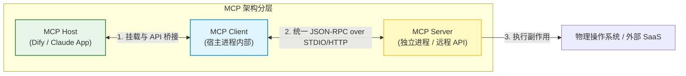
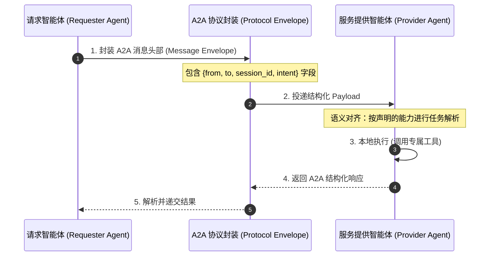

import GlossaryTerm from '@site/src/components/GlossaryTerm';
import GuidedExercise from '@site/src/components/GuidedExercise';
import ResearchNote from '@site/src/components/ResearchNote';
import ChapterMeta from '@site/src/components/ChapterMeta';
import PyRunner from '@site/src/components/PyRunner';
import TradeoffExplorer from '@site/src/components/TradeoffExplorer';
import QuizCard from '@site/src/components/QuizCard';

# M10L9 · Agent 协议（MCP / A2A）

<ChapterMeta
  time="约 2 小时"
  prereqs={[{label: 'M9L2 工具与边界', href: '../agent-architectures/tools-and-boundaries'}, {label: 'M10L7 路由', href: './handoff-routing'}, {label: 'M1L2 模块与契约', href: '../foundations/modules-and-contracts'}]}
  outcome="理解 MCP（Agent↔工具）和 A2A（Agent↔Agent）解决什么问题、协议的价值（互操作）从何而来，并能把它认成接口标准化这个老问题。"
  howToUse="先看“每接一个工具都要重写一遍”，再学 MCP/A2A，最后做协议适配 lab。"
/>

:::tip 多 Agent 还有最后一块拼图：它们怎么连工具、怎么互相对话？
前面讲了角色、编排、通信、路由——但有个底层问题没解决：Agent 接一个工具（数据库、搜索、内部 API）要写一套对接代码，接 100 个工具就 100 套；两个不同团队/厂商做的 Agent 想协作，没有共同语言。**协议（protocol）** 解决的就是这个：[MCP](https://modelcontextprotocol.io) 标准化"Agent↔工具"的连接、A2A 标准化"Agent↔Agent"的对话。它的价值不是让单个 Agent 更聪明，而是**让大家能互操作**——这是个你早就熟悉的老问题：接口标准化。
:::

## 一、每接一个工具/Agent，都要重写一遍对接代码

没有协议时：
- **接工具**：Agent 要用数据库、搜索、Slack、内部 API……每个工具的调用方式、参数格式、认证都不同，要为每个写一套适配代码。换个 Agent 框架，全部重写。
- **接 Agent**：你的 Agent 想调用别的团队/厂商的 Agent，但对方的输入输出格式、能力描述、交互方式都是私有的，对不上。
- **结果**：N 个 Agent × M 个工具 = N×M 套对接，重复劳动、无法复用、生态割裂。

这正是软件史上无数次出现的**接口碎片化**问题——解法也一样：引入一个 <GlossaryTerm term="Tool Schema Protocol" definition="工具模式协议：多智能体中用于统一描述外部工具输入入参、JSON 结构体和出参的序列化标准规范。">工具模式协议 (Tool Schema Protocol)</GlossaryTerm>，大家都遵守，就能即插即用。

## 二、三个核心概念（分层）

### 基础：MCP——标准化 Agent↔工具

<GlossaryTerm term="MCP (Model Context Protocol)" definition="模型上下文协议：一个开放标准，规定 Agent/LLM 如何统一地连接外部工具、数据源和能力（暴露 tools、resources、prompts）。让“接工具”从每个都要定制，变成遵守同一协议即插即用。">MCP（Model Context Protocol）</GlossaryTerm>：一个开放标准，规定 Agent 怎么统一地连接外部工具和数据源。工具方按 MCP 暴露自己的能力（tools/resources/prompts），Agent 方按 MCP 去发现和调用——**对接一次协议，而不是对接每个工具**。这把 [M9L2 给 Agent 配工具](../agent-architectures/tools-and-boundaries) 从"每个工具定制"变成"遵守同一协议即插即用"，和 [M1L2 模块与契约](../foundations/modules-and-contracts)、USB/HTTP 标准是同一思路：**约定一个统一接口，两边解耦**。

### 进阶：A2A——标准化 Agent↔Agent

<GlossaryTerm term="A2A (Agent-to-Agent)" definition="Agent 间协议：标准化“一个 Agent 如何发现、描述能力、并与另一个 Agent 通信协作”的开放规范。让不同团队/厂商做的 Agent 能互相发现能力、安全地交接任务。">A2A（Agent-to-Agent）</GlossaryTerm>：标准化"Agent 之间怎么发现彼此、描述能力、通信协作"。有了它，[M10L7 路由](./handoff-routing) 里"按能力分派"、[M10L2 专精 Agent 协作](./roles-specialization) 就能跨团队/跨厂商进行——一个 Agent 能发现"哪个 Agent 能干这事"、用统一格式把任务交给它。这是 <GlossaryTerm term="Service Discovery" definition="服务发现：在分布式微服务架构中，自动检测和发现网络中服务节点物理地址和能力的机制。">服务发现 (Service Discovery)</GlossaryTerm>（[M5L3](../core-components/service-discovery)）、服务间通信与解耦（[M2](../system-design-bridge/communication-decoupling)）在 Agent 生态的对应物。

### 深入（选学）：协议的价值与边界

- **协议的价值是互操作和生态，不是智能**：MCP/A2A 不会让你的 Agent 更聪明（智能在模型），它们让 Agent **能复用现成的工具/Agent、能和别人协作**——价值在生态层面。实现 <GlossaryTerm term="Interoperability" definition="互操作性：指不同的系统、设备或智能体在统一协议或标准规范下，能够顺畅进行数据交换和协同动作的能力。">互操作性 (Interoperability)</GlossaryTerm> 能极大地拓宽 Agent 的能力边界（[呼应 M9 智能在模型、可靠性/工程在外围](../agent-architectures/agent-loop-basics)）。一个有丰富 MCP 工具生态的 Agent，能做的事远多于孤立的 Agent。
- **别为了用协议而用协议**：如果你只接 2 个内部工具、就一个 Agent，直接写对接代码可能比引入 MCP 更简单（[呼应贯穿全课的克制 M10L1](./why-multi-agent)）。协议的收益随**工具/Agent 数量和复用需求**增长——少量、私有、不复用时，标准协议的开销不一定划算。这和 [M2 通信与解耦的取舍](../system-design-bridge/communication-decoupling) 是同一判断。
- **协议不消除安全边界**：能即插即用地接工具/Agent，更要管[权限和边界（M9L2/M10L2）](../agent-architectures/tools-and-boundaries)——一个 MCP 工具能访问什么、一个外部 Agent 能调用你什么，必须显式授权和限制（[呼应 M10L2 最小权限、M9L9 护栏](./roles-specialization)）。协议让连接变容易，不等于让连接变安全——安全仍是你的工程责任。
- **协议会演进**：MCP/A2A 是较新的、仍在发展的标准。架构师要理解的是**它们解决的问题类别（互操作）和判断（何时值得标准化）**，而非死记当前某版本的字段——问题是永恒的，具体协议会变。

<ResearchNote
  title="MCP / A2A：用标准协议解决 Agent 互操作，本质是接口标准化"
  source="Model Context Protocol (Anthropic, 2024)；Agent 互操作协议；M2L4 API 契约 / M5L3 服务发现"
  href="https://modelcontextprotocol.io"
  insight="Agent 连工具(MCP)、连 Agent(A2A)若无标准则 N×M 套定制对接、生态割裂。开放协议约定统一接口让两边解耦、即插即用、可复用——价值在互操作和生态，不在智能。本质是软件史反复出现的接口标准化问题(USB/HTTP/API 契约)。收益随工具/Agent 数量与复用需求增长，少量私有场景不一定划算。协议不消除安全边界，权限仍需显式管。"
  application="多工具/多 Agent、需复用或跨团队协作时用 MCP/A2A 标准化接口，免去 N×M 定制。少量私有不复用时直接对接更简单(克制)。把它认成 API 契约/服务发现的老问题。无论协议多方便，工具/Agent 的权限边界仍要显式授权限制——连接容易不等于连接安全。"
/>

## 三、智能体标准协议与互操作图解 (Deep Dive Diagrams)

本节展示硬编码胶水连接与标准协议总线的复杂度对比、MCP 的 Host-Client-Server 三层调用架构，以及跨 Agent A2A 消息封包的流转时序。

### 1. 结构全景：硬编码点对点对接 vs. 基于协议的标准化连接

```mermaid
graph TD
    classDef bad fill:#ffebee,stroke:#c62828,stroke-width:1px;
    classDef good fill:#e8f5e9,stroke:#2e7d32,stroke-width:1.5px;
    classDef protocol fill:#e1f5fe,stroke:#0288d1,stroke-width:1.5px;

    subgraph HardcodedMess [混乱: 传统硬编码对接 (复杂度 N x M)]
        AgentA["智能体 A"]:::bad
        AgentB["智能体 B"]:::bad
        
        ToolA["SQLite 数据库"]
        ToolB["Slack 消息推送"]
        
        AgentA -->|胶水代码 1| ToolA
        AgentA -->|胶水代码 2| ToolB
        AgentB -->|胶水代码 3| ToolA
        AgentB -->|胶水代码 4| ToolB
    end

    subgraph StandardizedProtocol [解耦: 基于统一协议 (复杂度 N + M)]
        HostAgent["Host 智能体宿主"]:::good
        
        HostAgent -->|1. 对接标准协议接口| ProtocolBus["标准 MCP 协议总线 (Model Context Protocol)"]:::protocol
        
        ProtocolBus -->|2a. 插头 1| ServerSql["Sqlite MCP Server"]
        ProtocolBus -->|2b. 插头 2| ServerSlack["Slack MCP Server"]
        
        Note over ProtocolBus: 一次对接协议，即插即用，彻底解耦
    end
```

### 2. 控制流程：MCP 协议三层通信模型



### 3. 时序全景：A2A（Agent-to-Agent）通信协议的消息流转时序



---

## 四、跟我做一遍：协议适配（统一接口的价值）

<PyRunner
  rows={40}
  expect="遵守协议即插即用、无需为每个工具定制"
  code={`# 没有协议:每个工具调用方式都不同 -> Agent 要为每个写适配
def call_legacy_db(sql): return "db rows"        # 各异的私有接口
def call_legacy_search(q): return "search hits"  # 参数、返回都不一样

# 有协议(MCP 风格):工具都按统一接口暴露能力
class MCPTool:
    def __init__(self, name, schema, handler):
        self.name = name
        self.schema = schema          # 统一的能力描述
        self.handler = handler
    def invoke(self, args):           # 统一的调用方式
        return self.handler(args)

# 工具方按协议注册(各自包装,但对外统一)
registry = {}
def register(tool): registry[tool.name] = tool

register(MCPTool("db", {"q": "str"}, lambda a: call_legacy_db(a["q"])))
register(MCPTool("search", {"q": "str"}, lambda a: call_legacy_search(a["q"])))

# Agent 方:只需懂"协议",不需懂每个工具 -> 即插即用
def agent_use(tool_name, args):
    tool = registry.get(tool_name)
    if tool is None:
        return "未知工具(协议外)"      # 边界:只能用已注册的
    return tool.invoke(args)

print(agent_use("db", {"q": "SELECT 1"}))
print(agent_use("search", {"q": "RAG"}))
print(agent_use("ssh", {}))           # 未注册 -> 拒绝(权限边界仍在)
# 新增工具只需 register(),Agent 代码不用改 -> 这就是协议的价值
register(MCPTool("calc", {"x": "int"}, lambda a: a["x"] * 2))
print(agent_use("calc", {"x": 21}))
print("遵守协议即插即用、无需为每个工具定制")`}
/>

底层工具接口各不相同，但用统一协议包装后，Agent 只需懂"协议"就能用所有工具，新增工具只要注册一下、Agent 代码不用改——这就是协议带来的解耦和即插即用。注意未注册的工具被拒绝：协议让连接变容易，但权限边界仍在。**试试**：再加一个工具，体会 Agent 代码完全不用动；想想如果没有统一 `invoke`，每加一个工具 Agent 要改多少代码。

## 五、动手 Lab（必做）

打开 `labs/month10/m10l9_protocol/`：

```bash
python labs/month10/m10l9_protocol/test_protocol.py
```

实现一个 MCP 风格的工具注册表：统一接口注册/调用、能力发现、未注册工具拒绝（权限边界），体会"对接协议而非对接每个工具"。

<GuidedExercise
  title="练习指引：实现协议适配层"
  goal="把“统一接口让工具即插即用 + 权限边界”做成代码，体会协议的互操作价值。"
  hints={[
    'Tool: name + schema(能力描述) + handler(实际逻辑)。',
    'Registry: register/invoke/list_capabilities(发现)。',
    'invoke 未注册的 -> 拒绝(权限边界,不是连了就能用)。',
    '新增工具只 register,调用方代码不变 = 解耦。'
  ]}
  steps={[
    '实现 Tool 和 Registry(统一 invoke 接口)。',
    'register 注册、invoke 按名调用、list 暴露能力(发现)。',
    '未注册工具调用返回拒绝(边界)。',
    '写测试:统一接口调用、能力发现、新增不改调用方、未注册被拒。'
  ]}
  checks={[
    '你能解释协议(MCP/A2A)解决什么、价值为什么是互操作而非智能。',
    '你的 lab 能统一接口即插即用并守住权限边界。',
    '你能把它认成接口标准化(API 契约/服务发现)的老问题。',
    '你知道何时该上协议、何时直接对接更克制。'
  ]}
/>

## 架构师深潜（Staff+ 视角）

### 1. 接工具/Agent 的方式

<TradeoffExplorer
  title="Agent 连接工具/其它 Agent 的方式"
  dimensions={['简单(少量时)', '可复用', '互操作/生态', '解耦', '适合规模化']}
  options={[
    {
      name: '逐个定制对接',
      scores: [5, 1, 1, 1, 1],
      note: '为每个工具/Agent 写专门代码。少量时最直接。但 N×M 套、不可复用、换框架全重写。',
      whenToUse: '工具/Agent 极少、私有、不复用。'
    },
    {
      name: 'MCP(Agent↔工具协议)',
      scores: [3, 5, 5, 5, 5],
      note: '工具按统一协议暴露,Agent 对接一次协议。即插即用、可复用、生态丰富。有协议开销。',
      whenToUse: '多工具、需复用现成工具生态。'
    },
    {
      name: 'A2A(Agent↔Agent 协议)',
      scores: [2, 4, 5, 4, 5],
      note: '标准化 Agent 间发现与协作。跨团队/厂商互操作。更复杂、标准仍演进。',
      whenToUse: '跨团队/跨厂商 Agent 协作。'
    }
  ]}
/>

### 2. "这是接口标准化的老问题"——架构师的元能力

MCP/A2A 听起来很新，但只要你问"它解决什么问题"，答案是软件史上出现过无数次的老问题：**接口碎片化 → 用标准协议统一**。USB 统一了外设接口、HTTP 统一了 Web 通信、SQL 统一了数据库查询、[模块与契约（M1L2）](../foundations/modules-and-contracts) 统一了接口、[容器镜像（M6L1）](../cloud-enterprise-industrial/containers) 统一了打包——每一次，价值都来自"约定统一接口让两边解耦、即插即用、形成生态"。MCP/A2A 不过是把这个永恒模式用到了"Agent↔工具""Agent↔Agent"。**认出新技术背后的老问题类别，是架构师最核心的元能力**：它让你不被名词唬住、能用几十年积累的判断（何时值得标准化、标准化的代价、协议演进的治理）直接评估新技术。这一课真正要你记住的不是 MCP 的字段，而是这个迁移能力——具体协议会过时，"用标准协议解决互操作"的判断不会。

### 3. 真实案例：MCP 工具生态如何放大 Agent 的能力

MCP 最有价值的落地，是让一个 Agent **复用整个工具生态**而非孤军奋战：接上 MCP 后，Agent 能即插即用地用上文件系统、数据库、搜索、各种 SaaS、内部系统的现成 MCP server，能力边界一下被大幅拓宽——而这一切不需要为每个工具写定制代码。但架构师要在三件事上保持清醒：(1) **安全**——每个 MCP 工具能访问什么数据/能执行什么操作，必须按[最小权限（M10L2）](./roles-specialization) 显式授权，一个被滥用或被注入的工具就是一个攻击面（[呼应 M9L9 护栏、M9L2 边界](../agent-architectures/agent-guardrails)）；(2) **克制**——不是接的工具越多越好，给 Agent 一堆用不上的工具反而增加混乱和误用（[呼应 M9L2 工具最小集](../agent-architectures/tools-and-boundaries)）；(3) **可观测**——Agent 通过协议调了哪些工具、传了什么、出了什么错，要能追踪（[M10L10](./multi-agent-ops)）。协议放大能力，但放大的能力同样要被工程约束住——这是贯穿全书的主题：**能力来自模型和生态，可靠和安全来自你包裹它的工程**。

### 4. 架构师深问（给自己 30 分钟）

- 你接工具/Agent 是逐个定制（N×M 套）还是走标准协议？你的规模和复用需求值得标准化吗？
- 你能说出 MCP/A2A 解决的"老问题类别"吗？换个新协议出来，你还会被名词唬住吗？
- 通过协议接进来的工具/Agent，权限边界是显式管的吗？协议让连接变容易，你让连接变安全了吗？

## 知识自测

<QuizCard
  questions={[
    {
      q: '在多智能体与工具生态整合中，MCP (Model Context Protocol) 协议的核心解决痛点是什么？',
      options: [
        'A. 提高大语言模型对多语言文本的机器翻译准确度',
        'B. 解决接口碎片化问题——统一了 Agent 与外部工具/数据源的连接标准（暴露 tools/resources/prompts），避免了 N 个 Agent 对接 M 个工具时产生 N×M 的定制适配代码',
        'C. 自动将所有 Python 副作用代码编译为 Rust 二进制文件',
        'D. 取代大模型的 Tokenization 分词阶段'
      ],
      answer: 1,
      explain: '这和软件史上的 USB 统一接口完全同构。MCP 将“各异工具定制接口”提炼成“统一 JSON-RPC 通信标准”，使宿主可以即插即用地调用社区已有的庞大 MCP 工具生态。'
    },
    {
      q: '以下关于 MCP 协议三层架构（Host, Client, Server）的描述，错误的是？',
      options: [
        'A. Host（宿主）通常是 Dify 或 Claude 桌面客户端等智能体应用',
        'B. Client（客户端）内置在 Host 中，负责解析标准 JSON-RPC 并分派工具请求',
        'C. Server（服务端）必须运行在宿主的主进程内，不支持跨机器以网络端口进行连接',
        'D. Server 是独立进程或远程 API，根据 Client 发送的指令在沙箱内执行具体副作用操作'
      ],
      answer: 2,
      explain: 'MCP Server 与 Client 是完全解耦的，它们可以通过标准 I/O（STDIO）或者是基于 HTTP/SSE 的网络端口通信，支持本地和远程部署，实现极佳的弹性隔离。'
    },
    {
      q: '为什么说“协议本身让连接变得容易，但并不消除安全边界”？',
      options: [
        'A. 因为 MCP 协议会自动关闭本地防火墙的端口校验',
        'B. 即使走标准协议接入，工具和外部 Agent 对系统的读写能力仍必须通过代码显式进行“最小特权授权”，否则协议带来的无缝连接会直接演化为黑客提示词注入的物理级级联攻击面',
        'C. 因为协议会强行降低大模型的推理遵循力',
        'D. 协议会让所有数据存储都降级为非结构化 Chat History'
      ],
      answer: 1,
      explain: 'AI 架构师的根本职责是守卫系统边界。MCP 提供了方便的 USB 式连接，但你不能盲信插进来的每个 USB 都没有病毒。针对高危副作用工具，依然要在 Client/Host 侧部署严密的安全护栏与人在回路审查。'
    }
  ]}
/>

## 自检清单

- [ ] 我能解释 MCP（Agent↔工具）、A2A（Agent↔Agent）各解决什么问题。
- [ ] 我理解协议的价值是互操作/生态/解耦，不是让 Agent 更聪明。
- [ ] 我能把它认成接口标准化（API 契约/服务发现/USB/HTTP）这个老问题。
- [ ] 我知道何时该上协议、协议不消除安全边界。

## 常见误解

- **"用了 MCP/A2A，Agent 就更智能了"**：协议解决互操作，不增智能；智能在模型。
- **"协议是 Agent 时代的全新发明"**：它就是接口标准化，USB/HTTP/API 契约同一类问题。
- **"走协议接进来的工具就安全了"**：协议让连接容易，权限边界仍要显式管，否则是攻击面。

## 延伸阅读

- [Model Context Protocol 官方文档](https://modelcontextprotocol.io)
- [M1L2 模块与契约](../foundations/modules-and-contracts) · [M5L3 服务发现](../core-components/service-discovery)
- [下一课：多 Agent 运维](./multi-agent-ops)
