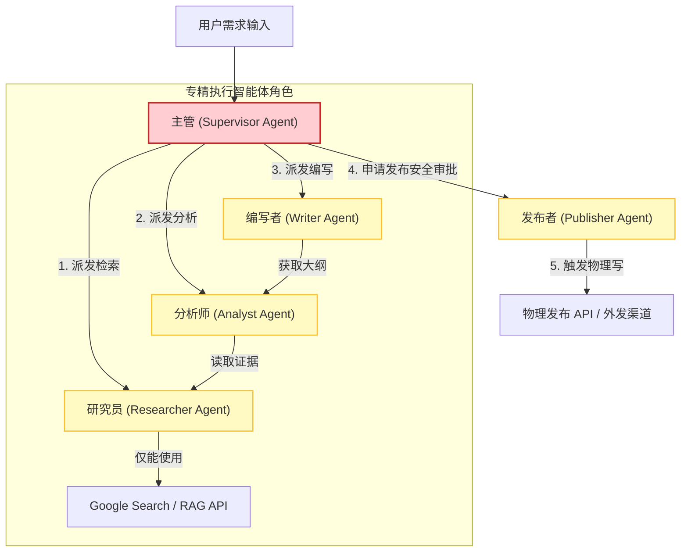
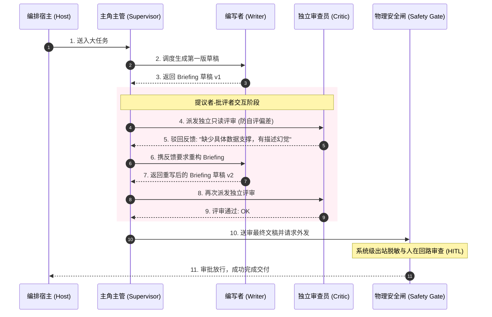
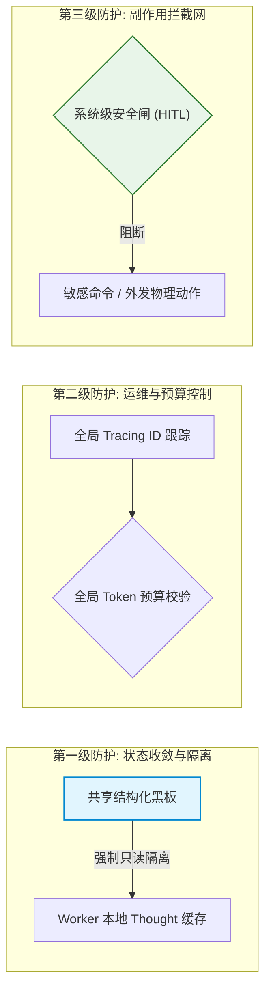

import GlossaryTerm from '@site/src/components/GlossaryTerm';
import GuidedExercise from '@site/src/components/GuidedExercise';
import ResearchNote from '@site/src/components/ResearchNote';
import ChapterMeta from '@site/src/components/ChapterMeta';
import PyRunner from '@site/src/components/PyRunner';
import TradeoffExplorer from '@site/src/components/TradeoffExplorer';
import QuizCard from '@site/src/components/QuizCard';

# M10L12 · 综合实战：搭一个可控的多 Agent 系统

<ChapterMeta
  time="约 4 小时"
  prereqs={[{label: '本月全部课程', href: './overview'}, {label: 'M9L12 Agent 实战', href: '../agent-architectures/capstone-agent'}, {label: 'M10L1 何时用多 Agent', href: './why-multi-agent'}]}
  outcome="把 Month 10 全部能力整合成一个端到端的多 Agent 系统：先判断该不该用、再设计角色与编排、加通信隔离与收敛、配运维与安全，交付一个强大且可控的系统。"
  howToUse="这是本月综合项目。先读需求与验收标准，再按‘决策→设计→可靠→运维安全’四步搭，最后对照清单自检。"
/>

:::tip 把这个月学的一切，收敛成一个能上生产的多 Agent 系统
过去 11 课你学了：[何时该用多 Agent（克制）](./why-multi-agent)、[专精角色](./roles-specialization)、[Supervisor 编排](./supervisor-orchestration)、[通信与隔离](./communication-state)、[顺序/并行](./sequential-parallel)、[辩论评审](./debate-review)、[路由](./handoff-routing)、[冲突共识](./conflict-consensus)、[协议](./agent-protocols)、[运维](./multi-agent-ops)、[评估与安全](./multi-agent-eval-safety)。这一课把它们**全部整合**：搭一个真实的多 Agent 系统，但重点不是"堆功能"，而是证明你能做出在发挥 <GlossaryTerm term="Multi-Agent Orchestration" definition="多智能体编排：多智能体系统中，通过确定性工作流或自主型主管，对各个执行节点的控制流跳转、状态读写和生命周期进行统一调配与限制的工程机制。">多智能体编排 (Multi-Agent Orchestration)</GlossaryTerm> 的强大的同时，采用清晰的 <GlossaryTerm term="Orchestration Topology" definition="编排拓扑：定义了系统中智能体节点间连接和交互的数据与控制通路拓扑结构，如星型拓扑（Supervisor模式）或网状拓扑（Swarm模式）。">编排拓扑 (Orchestration Topology)</GlossaryTerm> 并借助统一的 <GlossaryTerm term="State Convergence" definition="状态收敛：多智能体协作中，将各个节点的冲突观点、异构输出或分散事实逐步汇总并合并为单一确定性结论的演进过程。">状态收敛 (State Convergence)</GlossaryTerm> 和物理 <GlossaryTerm term="Safety Interceptor" definition="安全拦截器：设立在多智能体系统对外出站或关键物理副作用操作前置卡点上的物理过滤网，用于强制拦截脏指令并要求人工审批授权。">安全拦截器 (Safety Interceptor)</GlossaryTerm> 守住其可控底线——这正是区分"炫技 demo"和"生产系统"的分水岭。
:::

## 一、项目需求：一个"研究简报"多 Agent 系统

做一个自动生成研究简报的系统：用户给一个主题，系统产出一份**有事实依据、经过审查、可信**的简报。

**功能需求**：
1. 检索相关资料（researcher）。
2. 分析、提炼要点（analyst）。
3. 撰写简报（writer）。
4. 独立审查简报的事实性与质量（critic）。
5. 不达标就返工，达标才交付。

**这就是一个天然适合多 Agent 的任务**（[对照 M10L1 的判断](./why-multi-agent)）：子任务性质不同（检索/分析/写作/审查各需不同能力）、且由专精的 <GlossaryTerm term="Research Agent" definition="研究智能体：在简报生成或 SRE 运维中，挂载了专有搜索引擎或只读数据库检索工具，负责获取第一手事实证据的专精智能体节点。">研究智能体 (Research Agent)</GlossaryTerm> 牵头进行独立审查能显著提质。但你要先证明它确实值得多 Agent，而不是默认就用。

## 二、四步搭建：决策 → 设计 → 可靠 → 运维安全

### 第一步：决策——真的需要多 Agent 吗？（M10L1）

先做[克制判断](./why-multi-agent)：这个任务用单 Agent（一个 Agent 顺序做完检索→分析→写作→自审）行不行？行就别上多 Agent。本项目选多 Agent 的**唯一硬理由**是：**独立的 critic 审查**比单 Agent 自审更能保证事实性（[M10L6 独立审查不可替代](./debate-review)）——这是多 Agent 给的、单 Agent 给不了的价值。把这个理由写下来，作为架构决策记录。

### 第二步：设计——角色、编排、协作模式

- **专精角色 + 最小权限**（[M10L2](./roles-specialization)）：researcher 只有检索工具、writer 只有生成、critic 只读+评判——各司其职、权限隔离。
- **编排**（[M10L3](./supervisor-orchestration) + [M10L5](./sequential-parallel)）：researcher→analyst→writer 是**顺序**（有依赖）；若要检索多个来源可**并行扇出**再聚合。用一个 Supervisor 协调全流程。
- **辩论评审 + 收敛**（[M10L6](./debate-review) + [M10L8](./conflict-consensus)）：writer 出稿 → critic 独立审 → 不达标带反馈返工，循环到达标或到轮次上限（[停止防空转](../agent-architectures/stopping-budget)）。

### 第三步：可靠——通信隔离与错误防传染

- **结构化通信 + 隔离**（[M10L4](./communication-state)）：Agent 间通过结构化产物传递、每步输出校验 schema/合理性再传下游，critic 未通过的稿子标记为"未审查"、不能当成品交付。
- **错误隔离**（[M10L10](./multi-agent-ops)）：某个 Agent 返回垃圾就中断/降级，不让它污染全链。

### 第四步：运维与安全——追踪、预算、安全闸（M10L10 + M10L11）

- **可观测**：统一 trace 记录每个 Agent 每一步（谁、花多少 token、成败），出问题能归因。
- **成本控制**：全局预算上限（总 token/轮次），超了就交付当前最优并告警——防成本失控。
- **安全**：简报"对外发布"这类操作需 human-in-the-loop；评估含事实性/安全维度；能砍的 Agent 就砍（缩小风险面）。

<ResearchNote
  title="多智能体系统工程挑战与人在回路可控编排"
  source="LangGraph: Multi-Agent Systems in Production (LangChain, 2024)"
  href="https://blog.langchain.dev/langgraph/"
  insight="多智能体架构在生产中面临着状态爆炸和非受控发散的根本痛点。相较于去中心化的 Swarm 点对点 Handoff，基于集中式 Supervisor 的控制结构能够将主航道流程用代码固定，而各子任务交给专精 Agent，从而兼顾了确定性与灵活性。物理副作用工具的执行点必须设置人在回路 (HITL) 的状态阻塞和只读降级防护。"
  application="在设计 Capstone 运维场景与研究简报协作时，利用硬编码状态机固定大流程，通过系统级安全门禁实现物理写操作前的人工卡点，从而最大程度减小爆炸半径。"
/>

## 三、综合实战：研究简报多智能体架构图解 (Deep Dive Diagrams)

本节展示 Capstone 系统控制流角色拓扑全景、带有提议者-批评者和人在回路审批的时序闭环，以及三级防护栏集成架构。

### 1. 结构全景：研究简报多 Agent 系统控制流与专精角色拓扑全景



### 2. 时序全景：多 Agent 排查、互审、合并与安全网时序



### 3. 控制流程：全局控制约束与三级防护栏集成



---

## 四、跟我做一遍：可控多 Agent 系统骨架

<PyRunner
  rows={48}
  expect="研究简报系统:专精+编排+审查收敛+运维安全"
  code={`class Trace:
    def __init__(self, budget): self.steps=[]; self.budget=budget; self.spent=0
    def rec(self, agent, tok, ok): self.spent+=tok; self.steps.append((agent,tok,ok))
    def over(self): return self.spent>self.budget

# 专精 Agent(最小权限,各司其职)
def researcher(topic): return {"ok": True, "facts": ["fact_"+topic]}
def analyst(facts):    return {"ok": True, "points": ["point:"+f for f in facts]}
def writer(points, feedback=None):
    quality = "draft" if feedback is None else "revised"   # 据审查返工
    return {"ok": True, "brief": quality+"|"+";".join(points)}
def critic(brief):     # 独立审查(非自审):revised 才算达标
    ok = "revised" in brief
    return {"ok": ok, "note": "事实充分" if ok else "需补充事实依据"}

DANGEROUS = {"publish"}
def safety_gate(action, human=False):
    return not (action in DANGEROUS and not human)         # 高风险留人在环

def run_briefing(topic, budget=1000, max_rounds=3):
    t = Trace(budget)
    r = researcher(topic); t.rec("researcher", 100, r["ok"])
    a = analyst(r["facts"]); t.rec("analyst", 150, a["ok"])
    feedback, brief = None, None
    for _ in range(max_rounds):                            # 写-审-返工 收敛
        if t.over(): break                                # 全局预算兜底
        w = writer(a["points"], feedback); t.rec("writer", 200, w["ok"])
        c = critic(w["brief"]); t.rec("critic", 120, c["ok"])
        brief = w["brief"]
        if c["ok"]: break                                 # 独立审查达标 -> 收敛
        feedback = c["note"]                               # 带反馈返工
    # 交付前安全闸:发布需人批
    published = safety_gate("publish", human=True)
    return {"brief": brief, "published": published, "cost": t.spent,
            "trace": t.steps}

out = run_briefing("RAG")
for s in out["trace"]: print(s)
print("成品:", out["brief"], "| 已发布:", out["published"], "| 成本:", out["cost"])
print("研究简报系统:专精+编排+审查收敛+运维安全")`}
/>

一个完整而克制的多 Agent 系统：专精角色各司其职、顺序编排、writer-critic 独立审查驱动返工并收敛、全局预算兜底、每步可追踪、发布走安全闸。**注意它把本月每个概念都用上了、但每个都用得有理由**——这就是目标。**试试**：把 critic 改严格（要两轮才达标），看返工循环；把 budget 调到 400，看预算如何提前交付；想想哪个 Agent 能砍（缩小风险面）。

## 五、动手 Lab（必做）

打开 `labs/month10/m10l12_briefing/`：

```bash
python labs/month10/m10l12_briefing/test_briefing.py
```

实现完整的研究简报多 Agent 系统：专精角色 + 顺序编排 + 独立审查返工收敛 + 全局预算 + 追踪 + 安全闸。这是本月的集大成 lab。

<GuidedExercise
  title="练习指引：交付可控的多 Agent 系统"
  goal="把 Month 10 全部能力整合成一个既强大又可控的研究简报系统——证明你能上生产。"
  hints={[
    '专精角色:researcher/analyst/writer/critic,各最小职责。',
    '编排:研究->分析->(写->审->返工循环)->交付。',
    'critic 独立审查,不达标带 feedback 返工,max_rounds 防空转。',
    '运维:trace 每步 + 全局预算;安全:发布走 human-in-the-loop 闸。'
  ]}
  steps={[
    '实现四个专精 Agent + Trace。',
    'run_briefing:顺序编排 + 写-审-返工收敛循环。',
    '加全局预算兜底、每步追踪、发布安全闸。',
    '写测试:达标收敛、返工生效、超预算交付、追踪完整、危险操作受控。'
  ]}
  checks={[
    '我能论证这个任务为什么值得多 Agent(独立审查)。',
    '我的系统专精分工、编排合理、审查收敛、错误隔离。',
    '我的系统可追踪、控预算、危险操作留人在环。',
    '我用上了本月每个概念、且每个都有理由(不堆砌)。'
  ]}
/>

## 架构师深潜（Staff+ 视角）

### 1. 这个系统的"克制"体现在哪

<TradeoffExplorer
  title="研究简报系统的实现取向"
  dimensions={['能力强', '成本可控', '可靠可审查', '可维护', '风险面小']}
  options={[
    {
      name: '过度设计(堆 Agent)',
      scores: [4, 1, 2, 1, 1],
      note: '给每个小步都配 Agent、加一堆审查/辩论层。看着强大。但成本爆炸、难维护、攻击面大。',
      whenToUse: '几乎不。典型的炫技陷阱。'
    },
    {
      name: '克制而完整(本项目)',
      scores: [5, 4, 5, 4, 4],
      note: '只在有理由处用多 Agent(独立审查),其余用最简方案,配齐运维安全。强大且可控。',
      whenToUse: '生产多 Agent 的目标形态。'
    },
    {
      name: '单 Agent(能行就用)',
      scores: [3, 5, 3, 5, 5],
      note: '一个 Agent 顺序做完+自审。最省最简。但自审有确认偏差,事实性保障弱。',
      whenToUse: '对事实性要求不高的简报。'
    }
  ]}
/>

### 2. 这个 capstone 真正在考什么：判断力，不是拼装力

把四个 Agent 串起来跑通，是这个项目最简单的部分——任何人照着教程都能拼出来。这个 capstone 真正考的是**判断力**：你能不能说清"为什么这个任务值得多 Agent"（而不是因为多 Agent 时髦）？你能不能指出"这个系统里哪个 Agent 其实可以砍掉"（克制）？你能不能回答"如果 critic 挂了系统怎么办、如果 writer 被注入了会污染什么、如果成本超预算先保什么"（可靠与安全）？**一个只会拼装的人搭出的多 Agent 系统能演示、不能运营；一个有判断力的架构师搭出的系统，每个 Agent 的存在都有理由、每个失败都有预案、每份成本都花在刀刃上。** 这正是本月、乃至本书反复锤的东西：技术会给你很多"能做"的选项，架构师的价值在于判断"该做哪些、不该做哪些、代价是什么"。多 Agent 是这个判断力的绝佳试金石——因为它最容易被滥用来堆砌，也最考验你的克制。

### 3. 从这个 capstone 通向真实生产

这个 lab 是简化骨架（同步函数、模拟 Agent），但它的**结构**就是生产系统的结构。往真实生产走，你会把每个部分替换/加固：模拟 Agent 换成真实 LLM 调用（[M7 LLM 系统](../llm-systems/llm-api-cost-latency)）、facts 换成真实 [RAG 检索（M8）](../rag/rag-evaluation)、trace 接入真实[可观测平台（M6L7）](../cloud-enterprise-industrial/observability-advanced)、安全闸接入真实审批流、评估接入真实[评估集（M9L10/M11）](../agent-architectures/agent-evaluation)。但**架构骨架不变**：决策是否该用多 Agent → 专精分工 → 编排协作 → 通信隔离 → 收敛机制 → 运维安全。你在这个 capstone 里练的正是这套可迁移的骨架和判断，而非某个具体框架的 API。这也是本书的一贯立场：**框架会换，判断力不会过时。** 下个月（Month 11）你会把这套东西放进完整的生产 AI 平台（评估、可观测、风险治理、成本、合规）里去——多 Agent 只是其中一块，可靠的 AI 系统是无数这样的工程决策叠起来的。

### 4. 架构师深问（给自己 30 分钟）

- 你能对着这个系统，逐个 Agent 说清"它为什么存在、砍了会怎样"吗？
- 每一种失败（某 Agent 挂、被注入、超预算、审查不收敛）你都有预案吗？
- 如果让你把它砍到最简（还能保证事实性），你会砍成什么样？为什么？

## 知识自测

<QuizCard
  questions={[
    {
      q: '在设计本章“研究简报”多 Agent 实战项目时，我们选择使用多 Agent 架构的“唯一硬理由（Hard Rationale）”是什么？',
      options: [
        'A. 仅仅是因为该场景需要同时向 5 个外部搜索引擎发送 API 请求',
        'B. 单 Agent 在扮演“作家”的同时进行自我校对，无法破除确认偏误与自评偏差；只有引入一个“独立的 Critic（评审员）”以第三方只读视角专门挑错，才能保证简报的最终事实性与质量',
        'C. 因为该系统需要使用 MCP 协议来执行删除物理文件的危险命令',
        'D. 因为多 Agent 模式会自动将 Token 的消耗成本减半'
      ],
      answer: 1,
      explain: '“架构师做任何选择必须有硬道理”。多 Agent 带来了协调复杂性和成本。只有当任务天然具有角色边界（Writer 负责生成、Critic 负责挑错）且独立互审是提质的不可替代卡点时，多 Agent 方案才值得它翻倍的成本。'
    },
    {
      q: '在本章 Capstone 系统的四步构建流程中，我们是如何实现防止级联越权和非安全发布事故的？',
      options: [
        'A. 给 Publisher Agent 授予全局 Root 权限，以使其自动规避 API 限流限制',
        'B. 在 Publisher 触发外发操作的前置拦截卡点，强行部署“系统级安全闸（HITL 物理卡点）”，并仅为其绑定专有的最小只写发布工具',
        'C. 允许所有的 Worker Agent 在发现错误时自行回滚物理数据库',
        'D. 不进行任何物理拦截，完全信赖 Critic Agent 给出 100% 正确的评审意见'
      ],
      answer: 1,
      explain: '“安全性不能寄托在模型的自觉上”。将只读的 Researcher/Writer 与具有写副作用的 Publisher 进行工具隔离，并在 Publisher 执行最终外发动作时加挂人在回路（HITL）的硬拦截，是实现系统可控性、限缩爆炸半径的核心卡闸。'
    },
    {
      q: 'Capstone 系统面对 Researcher 动态采集多路外部源可能产生的事实冲突，是如何实现“共识与状态收敛”的？',
      options: [
        'A. 采用简单的多数决投票对文本直接进行拼接，不做任何去重和语义调和',
        'B. 彻底抛弃 Researcher 的证据，完全依赖 Writer 的幻觉生成 Briefing',
        'C. 结构化写入黑板，将异构资料依据 schema 规范分类，并在存在分歧时引入 Supervisor 仲裁（Arbitrator），或在分歧巨大时暴露风险标记直接上报人工（HITL）',
        'D. 将所有交互状态以非结构化 Chat History 历史历史追加，并在瞬间烧尽全局预算'
      ],
      answer: 2,
      explain: '多 Agent 最忌“各说各话、无法收敛”。借助黑板（Blackboard）提供结构化状态总线，将 evidence 与 proposal 进行写入前 schema 强校验，并在分歧出现时由主控 Supervisor 语义调解或升级至人工，是确保最终答案一致性的务实路径。'
    }
  ]}
/>

## 自检清单

- [ ] 我能论证这个任务为什么值得多 Agent（独立审查不可替代），而非跟风。
- [ ] 我的系统整合了本月全部能力：专精、编排、隔离、收敛、运维、安全。
- [ ] 我的系统可控：可追踪、控预算、错误隔离、危险操作留人在环。
- [ ] 我理解 capstone 考的是判断力（该用哪些、砍哪些、代价是什么），不是拼装力。

## 常见误解

- **"capstone 就是把学的功能都用上"**：是用得有理由、且知道哪些该砍——克制比堆砌难。
- **"跑通了就算完成"**：能演示 ≠ 能运营；要有失败预案、成本控制、安全边界。
- **"这个骨架太简单不像生产"**：结构就是生产结构，往上替换加固即可；练的是可迁移的判断。

## 延伸阅读

- [Building Effective Agents (Anthropic)](https://www.anthropic.com/research/building-effective-agents)
- [本月总览](./overview) · [M9L12 单 Agent 实战](../agent-architectures/capstone-agent)
- [下一月：生产 AI 平台与风险治理](../production-ai-platform/overview)