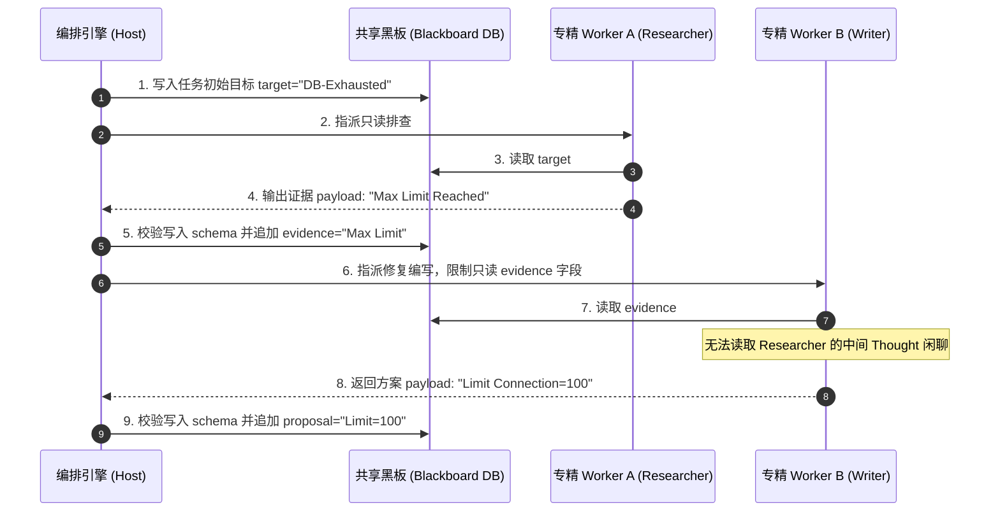

import GlossaryTerm from '@site/src/components/GlossaryTerm';
import GuidedExercise from '@site/src/components/GuidedExercise';
import ResearchNote from '@site/src/components/ResearchNote';
import ChapterMeta from '@site/src/components/ChapterMeta';
import PyRunner from '@site/src/components/PyRunner';
import TradeoffExplorer from '@site/src/components/TradeoffExplorer';
import QuizCard from '@site/src/components/QuizCard';

# M10L4 · 通信与共享状态

<ChapterMeta
  time="约 2.5 小时"
  prereqs={[{label: 'M10L3 Supervisor', href: './supervisor-orchestration'}, {label: 'M2L10 通信解耦', href: '../system-design-bridge/communication-decoupling'}, {label: 'M7L6 结构化输出', href: '../llm-systems/structured-output-tools'}]}
  outcome="能为多 Agent 设计可靠的通信：结构化消息契约、黑板/共享状态、并防止状态污染——而不是把自由文本对话堆成不可靠的共享上下文。"
  howToUse="先看“一堆聊天记录当状态”的污染，再学结构化消息和黑板，最后做黑板共享状态 lab。"
/>

:::tip Agent 之间传的不该是“聊天记录”，而是结构化、可校验的产物
多 Agent 协作的命脉是通信——Agent 怎么把信息传给彼此、共享一个工作区。新手常把它做成“一长串自由文本对话”，结果**污染、丢失、误解**：关键信息淹没在闲聊里、一个 Agent 的错误结论被其它当真、上下文越堆越长越乱。可靠的做法：**Agent 之间传结构化、可校验的产物**（带 schema 的消息和 artifact），共享状态有结构、有写入规则——像系统间用 [API/事件通信（M2L10）](../system-design-bridge/communication-decoupling) 那样严谨，而非随便聊。
:::

## 一、把对话记录当共享状态，会污染

一个常见的失败：让多个 Agent 共享一个不断增长的对话历史，每个 Agent 读全部历史、往里追加自己的输出。问题：
- **污染**：一个 Agent 的错误/幻觉结论进了共享历史，后面的 Agent 当真、层层放大，形成严重的 <GlossaryTerm term="State Pollution" definition="状态污染：在多智能体协同中，由于某个 Agent 产生幻觉或输出错误事实，导致该坏数据进入共享上下文/数据库，污染整个系统的执行状态并被其他 Agent 继承的缺陷。">状态污染 (State Pollution)</GlossaryTerm>（[错误传播](./multi-agent-ops)）。
- **淹没**：关键信息（证据、决定）淹没在大量中间对话里，[迷失在中间（M7L2）](../llm-systems/tokenization-context)。
- **爆炸**：共享上下文越堆越长，[token 成本暴涨（M10L10）](./multi-agent-ops)、还超窗口。
- **误解**：自由文本歧义多，Agent 之间理解不一致。

根因：**把“非结构化的对话”当成“系统的共享状态”**。要可靠协作，通信和状态都要结构化。

## 二、三个核心概念（分层）

### 基础：结构化消息契约

Agent 之间传信息，要用<GlossaryTerm term="Structured Message" definition="结构化消息：Agent 之间传递的、有明确 schema 的消息（如 {from, to, type, payload}），而非自由文本。让通信可解析、可校验、可路由，避免歧义和污染。">结构化消息</GlossaryTerm>（带 [schema，M7L6](../llm-systems/structured-output-tools)）：`{from, to, type, payload}`——谁发的、给谁、什么类型、结构化内容。比如研究员产出 `{type: "evidence", items: [...]}`、审查员产出 `{type: "risks", items: [...]}`。这让通信**可解析、可校验、可路由**——而非自由文本乱传。这和 [M2L10 系统间用明确契约通信](../system-design-bridge/communication-decoupling)、[L2 模块契约](../foundations/modules-and-contracts) 是同一个道理：**清晰的接口契约是可靠协作的基础。**

### 进阶：黑板模式（共享工作区）

<GlossaryTerm term="Blackboard Pattern" definition="黑板模式：多个 Agent 共享一个结构化的工作区（黑板），各自往上写自己的产物（带类型/来源/状态），也从上面读需要的。比共享一长串对话更结构化、可控、可追溯。">黑板模式（blackboard）</GlossaryTerm>：多 Agent 共享一个**结构化的工作区**（黑板）——不是一长串对话，而是有结构的 artifact 集合（`{evidence, proposal, risks, status}`）。每个 Agent 往黑板上**写自己的产物**（带类型、来源、状态）、从黑板**读它需要的**。好处：状态有结构（不淹没）、来源可追溯（知道哪个 Agent 写的）、可校验（写入按 schema）。[Supervisor（M10L3）](./supervisor-orchestration) 常作为黑板的管理者，控制谁能写什么。

### 深入（选学）：防污染与通信设计

- **防状态污染**：共享状态最大的风险是污染。对策：(1) **写入校验**——往黑板写的产物要符合 schema、可校验（[M7L6/M7L9](../llm-systems/structured-output-tools)），不是随便写；(2) **来源标记**——每个产物记下是哪个 Agent 写的、是否被审查过，便于追溯和判断可信度；(3) **对数据做 <GlossaryTerm term="Bulkhead Isolation (Data)" definition="舱壁隔离：在数据或智能体交互中，将未经验证的数据与高可信的最终状态进行物理隔离，以防止单个节点的故障或错误输入发生级联扩散的安全和可靠性设计原则。">数据舱壁隔离 (Bulkhead Isolation)</GlossaryTerm>**，避免错误结论被当真（[呼应 M5L8 隔离爆炸半径](../core-components/bulkhead-isolation)）。
- **谁能读写什么**：和[角色权限（M10L2）](./roles-specialization) 配合——研究员能写 evidence、审查员只读 proposal 写 risks、不能改 proposal。黑板的 <GlossaryTerm term="Access Control List (ACL)" definition="访问控制列表：用于定义和校验各个智能体节点对共享黑板或状态段的读写权限的控制列表，是确保最小特权原则落地的核心工程手段。">读写控制权限 (ACL)</GlossaryTerm> 即角色边界。
- **通信范式**：(1) **经 Supervisor 中转**（[M10L3](./supervisor-orchestration)，最可控）；(2) **黑板共享**（本课，松耦合协作）；(3) **直接消息传递**（点对点，[像 swarm M10L7](./handoff-routing)，灵活但 N×N 混乱）。多数生产系统用前两种。
- **只传必要的，不传全部**：每个 Agent 只需要黑板上和它任务相关的部分，不必读全部（[呼应 M7L8 上下文工程、按需取](../llm-systems/context-memory)）——既省 token，又避免被无关信息干扰。
- 多 Agent 通信本质是 [分布式系统的消息传递（M3L9 队列）](../data-cache-queue/message-queues)：要考虑可靠投递、顺序、幂等、防丢防重——这些分布式通信的老问题，在多 Agent 里同样存在。

<ResearchNote
  title="多 Agent 通信：结构化消息 + 黑板，防污染"
  source="黑板架构（经典 AI）；企业集成/消息契约（M2L10）；多 Agent 工程实践"
  href="https://en.wikipedia.org/wiki/Blackboard_(design_pattern)"
  insight="多 Agent 可靠协作靠结构化通信而非自由文本对话：带 schema 的消息、结构化的黑板共享工作区（产物带类型/来源/状态）。防状态污染靠写入校验、来源标记、隔离不可信产物。读写权限即角色边界。本质是把分布式系统的消息契约/可靠投递/隔离用到 Agent 间通信。"
  application="多 Agent 用结构化消息（{from,to,type,payload}）和黑板（结构化 artifact 集合）通信，别用一长串自由对话。写入校验 + 来源标记 + 隔离不可信产物防污染。读写权限对齐角色。每个 Agent 只取相关部分省 token。把它当分布式消息传递设计（可靠/幂等/防污染）。"
/>

## 三、智能体通信与共享状态图解 (Deep Dive Diagrams)

本节展示对话历史共享导致的严重状态污染与 Context 爆炸、结构化黑板模式的共享工作区架构，以及黑板读写的分离时序。

### 1. 结构全景：共享对话（Chat History）的状态污染与上下文爆炸

```mermaid
graph TD
    classDef bad fill:#ffebee,stroke:#c62828,stroke-width:1.5px;
    classDef step fill:#eceff1,stroke:#607d8b,stroke-width:1px;

    UserTask["外部任务: 校验 DB 并输出修复方法"] --> Step1["Agent A (只读排查)"]
    
    subgraph ChatHistoryMemory ["共享自由文本历史 (Chat History)"]
        Step1 -->|1. 追加中间日志与 Thought| Hist1["对话历史: ['排查中...', 'DB CPU 95%', '疑有死锁(幻觉)...'"]"]:::bad
        Hist1 -->|2. Agent B 基于 A 的幻觉结论写方案| Hist2["对话历史: [追加 'A说是死锁', '生成死锁修复脚本'"]"]:::bad
        Hist2 -->|3. 冗余文本堆叠| Hist3["对话历史: [追加 '脚本生成完毕', '字数超限...', '上下文爆炸'"]"]:::bad
    end

    Hist3 --> FinalAnswer["最终输出 (因 A 幻觉和历史堆叠导致失败)"]:::bad
```

### 2. 控制流程：结构化黑板模式（Blackboard）共享内存架构

```mermaid
graph TD
    classDef blackboard fill:#fff9c4,stroke:#fbc02d,stroke-width:2px;
    classDef agent fill:#e1f5fe,stroke:#0288d1,stroke-width:1.5px;
    classDef check fill:#e8f5e9,stroke:#2e7d32,stroke-width:1px;

    subgraph SharedStorage ["共享存储区"]
        Blackboard["共享结构化黑板 (Structured Blackboard)"]:::blackboard
        Blackboard --- Key1["evidence: 监控证据 (Verified: True/Author: A)"]
        Blackboard --- Key2["proposal: 修复方案 (Verified: False/Author: B)"]
        Blackboard --- Key3["risks: 安全风险 (Verified: True/Author: C)"]
    end

    AgentA["Agent A (Researcher)"]:::agent -->|1. 校验写入 evidence| Blackboard
    AgentB["Agent B (Coder)"]:::agent -->|2. 读 evidence 并写 proposal| Blackboard
    AgentC["Agent C (Reviewer)"]:::agent -->|3. 读 proposal 并写 risks| Blackboard
    
    Note over Blackboard: 每步读写限定字段，Thought 仅在节点内消化<br/>共享黑板只有高纯度的结构化结果，完全杜绝状态污染
```

### 3. 时序全景：黑板模式读写冲突与状态对齐时序



---

## 四、跟我做一遍：结构化黑板

<PyRunner
  rows={40}
  expect="结构化写入、可追溯、防污染"
  code={`class Blackboard:
    def __init__(self):
        self.artifacts = {}     # key -> {value, author, verified}

    def write(self, key, value, author, schema_ok):
        if not schema_ok:
            return "REJECTED: 不符合 schema"             # 写入校验,防污染
        self.artifacts[key] = {"value": value, "author": author, "verified": False}
        return "WRITTEN by " + author

    def verify(self, key, reviewer):
        if key in self.artifacts:
            self.artifacts[key]["verified"] = True        # 审查通过才标记可信
            self.artifacts[key]["reviewed_by"] = reviewer

    def read(self, key, only_verified=False):
        a = self.artifacts.get(key)
        if a is None:
            return None
        if only_verified and not a["verified"]:
            return None                                   # 只读已审查的(隔离不可信)
        return a["value"]

bb = Blackboard()
print(bb.write("evidence", ["资料1", "资料2"], "researcher", schema_ok=True))
print(bb.write("proposal", "方案A", "architect", schema_ok=True))
print(bb.write("evidence", "乱写", "researcher", schema_ok=False))   # 不合 schema -> 拒绝
bb.verify("proposal", "reviewer")                                   # 审查员审查方案
print("方案(任意读):", bb.read("proposal"))
print("方案(只读已审查):", bb.read("proposal", only_verified=True))  # 已审查,可读
print("证据(只读已审查):", bb.read("evidence", only_verified=True))  # 未审查 -> None(隔离)
print("来源:", bb.artifacts["proposal"]["author"], "审查:", bb.artifacts["proposal"].get("reviewed_by"))
print("结构化写入、可追溯、防污染")`}
/>

黑板让每个产物结构化、带来源、可标记是否已审查；不合 schema 的写入被拒、未审查的产物在"只读已审查"时被隔离——协作状态清晰、可追溯、不被污染。**试试**：让一个 Agent 想覆盖别人写的 proposal（加写权限检查，对齐角色）；想想错误的 evidence 如果没有"未审查隔离"，会怎样污染后续决策。

## 五、动手 Lab（必做）

打开 `labs/month10/m10l4_blackboard/`：

```bash
python labs/month10/m10l4_blackboard/test_blackboard.py
```

实现结构化黑板：带 schema 校验的写入、来源标记、审查标记、只读已审查（隔离不可信产物）。

<GuidedExercise
  title="练习指引：实现结构化黑板"
  goal="把“结构化共享状态 + 防污染”做成代码——多 Agent 可靠通信的基础。"
  hints={[
    'artifacts: key -> {value, author, verified}。',
    'write：schema_ok 为 False 则拒绝（防污染）；记 author、verified=False。',
    'verify：标记 verified 和 reviewed_by。',
    'read(only_verified=True)：未审查的返回 None（隔离不可信产物）。'
  ]}
  steps={[
    '实现 Blackboard：write / verify / read。',
    'write 做 schema 校验、记来源。',
    'read 支持 only_verified 隔离未审查产物。',
    '写测试：合规写入、不合规被拒、来源记录、审查后可读、未审查被隔离。'
  ]}
  checks={[
    '你能用结构化消息/黑板而非自由对话做通信。',
    '你的 lab 写入校验、来源可追溯、隔离不可信产物。',
    '你能解释自由对话当共享状态的污染风险。',
    '你能把多 Agent 通信当分布式消息传递来设计。'
  ]}
/>

## 架构师深潜（Staff+ 视角）

### 1. 多 Agent 通信方式

<TradeoffExplorer
  title="多 Agent 通信/共享状态"
  dimensions={['防污染', '可追溯', '松耦合', '通信复杂度低', '可控']}
  options={[
    {
      name: '共享自由对话历史',
      scores: [1, 2, 3, 2, 1],
      note: '所有 Agent 读写一长串对话。简单，但污染、淹没、爆炸、误解。',
      whenToUse: '几乎从不——不可靠。'
    },
    {
      name: '结构化黑板',
      scores: [5, 5, 5, 4, 4],
      note: '结构化 artifact + 来源/校验/隔离。可追溯、防污染、松耦合。',
      whenToUse: '多 Agent 协作的推荐共享状态。'
    },
    {
      name: '经 Supervisor 中转消息',
      scores: [5, 5, 2, 5, 5],
      note: '所有通信经主控。最可控、防 N×N 混乱。但 Supervisor 是中心。',
      whenToUse: 'Supervisor 编排时的默认通信方式。'
    }
  ]}
/>

### 2. 多 Agent 通信就是分布式系统通信，老问题全回来了

一个关键认知：**多 Agent 之间的通信，本质就是分布式系统的进程间通信**——所以你 [Month 2/3/5 学的所有分布式通信问题，在这里全部重现](../system-design-bridge/communication-decoupling)：消息怎么可靠投递（会不会丢）、顺序怎么保证、怎么幂等（重复消息）、共享状态怎么不被污染（[一致性 M3L11](../data-cache-queue/consistency-patterns)）、错误怎么不传播（[隔离 M5L8](../core-components/bulkhead-isolation)）、N×N 通信怎么不爆炸（[用中心化收口 M5L2](../core-components/api-gateway)）。区别只在于"进程"换成了"Agent"、消息内容是 LLM 产出的（更不可靠、要校验）。这意味着架构师设计多 Agent 通信时，不该从零摸索，而该**直接调用分布式系统的成熟智慧**：结构化契约、可靠消息、幂等、隔离、中心化协调。把多 Agent 当一个"成员特别不可靠的分布式系统"来设计，是它可靠的关键。

### 3. 真实案例：上下文污染拖垮多 Agent

多 Agent 协作的一个隐蔽杀手是上下文/状态污染：某个 Agent 产出了一个错误或幻觉的中间结论，进了共享状态，后续所有 Agent 都基于这个错误往下做，整个协作的产出全错——而且因为信息在多个 Agent 间流转，很难追溯到污染源。用结构化黑板 + 来源标记 + 审查隔离能大幅缓解：每个产物知道是谁写的、是否经过审查，未审查的不可信产物被隔离、不直接影响关键决策。这和 [M8L11 知识库防脏数据](../rag/knowledge-base-ops)、[M5L8 隔离爆炸半径](../core-components/bulkhead-isolation)、[L3 不信任输入](../foundations/input-validation) 是同一种"防止坏数据扩散"的工程纪律。多 Agent 因为成员都不可靠（会幻觉），这种纪律比传统分布式系统更重要——**别让一个 Agent 的错误，污染整个协作**。

### 4. 架构师深问（给自己 30 分钟）

- 你的多 Agent 之间传的是结构化产物还是自由对话？关键信息会不会被淹没、被污染？
- 共享状态有来源标记和校验吗？一个 Agent 写错了，后面的怎么不被它带偏（隔离/审查）？
- 你把多 Agent 通信当分布式消息传递设计了吗（可靠投递、幂等、防污染、避免 N×N）？

## 知识自测

<QuizCard
  questions={[
    {
      q: '在多智能体通信中，把“自由文本对话记录（Chat History）”直接作为共享状态，最主要的安全与效能缺陷是什么？',
      options: [
        'A. 大模型无法正常解析 Markdown 格式的对话记录',
        'B. 会导致对话历史被第三方截获，暴露用户 API Key 凭证',
        'C. 容易导致“状态污染 (State Pollution)”——某一步 Agent 的错误幻觉会作为上下文垃圾传导给其他节点，并发生 Context 长度爆炸和“迷失在中间”现象',
        'D. 自由文本通信会自动降低大模型的 Sampling Temperature'
      ],
      answer: 2,
      explain: '自由聊天对人类很自然，但对多智能体系统是灾难性的。由于大模型不具备完美的真伪隔离能力，共享对话很容易将中间推理的胡思乱想（Thought）和未验证的推测作为事实证据灌注给下一个 Agent，导致级联错误。'
    },
    {
      q: '在多智能体共享状态设计中，黑板模式（Blackboard）相比共享对话的最核心优势是什么？',
      options: [
        'A. 它不需要大模型扮演任何角色设定即可实现直接调用',
        'B. 它实现了通信对话与系统共享状态的彻底解耦，每个 Agent 仅被授权读写黑板中与本职工作对齐的结构化字段，避免了冗余 Thought 文本的上下文干扰',
        'C. 它能够成倍提升大模型的 Token 生成速率并缩短单步延迟',
        'D. 黑板模式能够用做物理容器隔离（Sandboxing）的直接替代品'
      ],
      answer: 1,
      explain: '黑板模式好比人类协作中把草稿纸（各自思考）和白板（最终公开结论）分离开。Agent 的 Thought 过程只保存在它自己的 local context 中，只有被验证合规的结构化 Output 才能写入黑板，消除了噪音扩散。'
    },
    {
      q: '在设计黑板写入防护机制以防御状态污染时，哪种工程手段最务实？',
      options: [
        'A. 提高 Agent 调用工具时的显存配置，增加模型并行检索开销',
        'B. 强制进行 schema 写入校验、保留每个 artifact 的来源标记（Author），并将未验证的中间产物与最终一致性结论进行隔离/版本化存放',
        'C. 彻底禁止 Researcher 角色读取任何外部只读数据库',
        'D. 将所有消息都转化为自由文本，由一个全能的 Arbitrator 随时在线审查'
      ],
      answer: 1,
      explain: '这是典型的“把不可靠组件用可靠”的系统设计。大模型输出不可靠，因此写入黑板前必须经过严格的 schema 强校验；同时利用 Author 标记来做追溯，一旦发现错误能够迅速回溯并熔断。'
    }
  ]}
/>

## 自检清单

- [ ] 我能用结构化消息/黑板而非自由对话做多 Agent 通信。
- [ ] 我的 lab 写入校验、来源可追溯、隔离不可信产物。
- [ ] 我能解释共享对话当状态的污染/淹没/爆炸风险。
- [ ] 我能把多 Agent 通信当分布式消息传递（可靠/幂等/防污染）来设计。

## 常见误解

- **"让 Agent 共享对话历史就行"**：会污染、淹没、爆炸；要结构化黑板/消息。
- **"共享状态随便写"**：要写入校验 + 来源标记 + 隔离不可信，防污染。
- **"多 Agent 通信是新问题"**：它就是分布式系统通信，老智慧（契约/可靠/幂等/隔离）全适用。

## 延伸阅读

- [Blackboard Pattern](https://en.wikipedia.org/wiki/Blackboard_(design_pattern))
- [M2L10 通信与解耦](../system-design-bridge/communication-decoupling)
- [下一课：顺序与并行编排](./sequential-parallel)