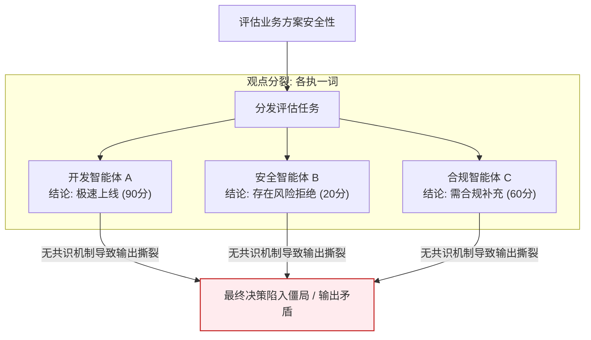
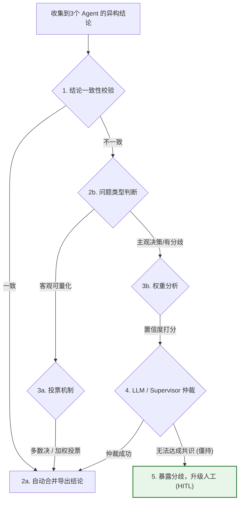
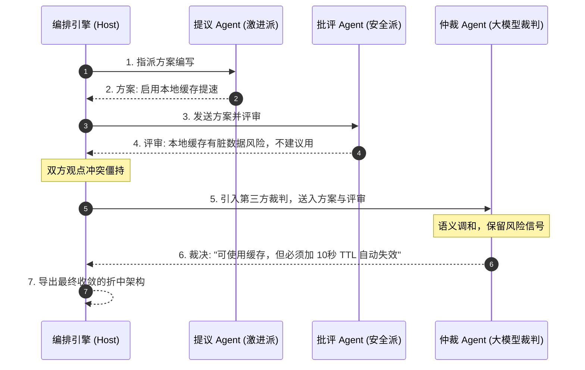

import GlossaryTerm from '@site/src/components/GlossaryTerm';
import GuidedExercise from '@site/src/components/GuidedExercise';
import ResearchNote from '@site/src/components/ResearchNote';
import ChapterMeta from '@site/src/components/ChapterMeta';
import PyRunner from '@site/src/components/PyRunner';
import TradeoffExplorer from '@site/src/components/TradeoffExplorer';
import QuizCard from '@site/src/components/QuizCard';

# M10L8 · 冲突与共识

<ChapterMeta
  time="约 2 小时"
  prereqs={[{label: 'M10L6 辩论评审', href: './debate-review'}, {label: 'M10L3 Supervisor 裁决', href: './supervisor-orchestration'}, {label: 'M5L11 共识算法', href: '../core-components/consensus-coordination'}]}
  outcome="能用投票/加权/仲裁让多个意见不一致的 Agent 收敛到一个结论，理解“多个独立答案投票更可靠”的集成原理，并知道何时该收敛、何时不必。"
  howToUse="先看“几个 Agent 吵起来听谁的”，再学共识机制，最后做投票仲裁 lab。"
/>

:::tip 多个 Agent 给了不一样的答案，到底听谁的？
[辩论（M10L6）](./debate-review) 会出现一个新问题：几个 Agent 各执一词，谁对？或者你故意让多个 Agent **独立**回答同一问题（[集成思想](../rag/hybrid-search)）——它们答案不完全一致，怎么综合出一个结论？多 Agent **必须有一个收敛机制**：投票、加权、仲裁。没有它，多 Agent 就是一团各说各话的乱麻——这是从"多个意见"到"一个结论"的最后一公里。
:::

## 一、几个 Agent 吵起来，听谁的？

只要有多个 Agent 产出，就会有不一致：
- **辩论不收敛**：[M10L6](./debate-review) 里 proposer 和 critic 各执己见，面临 <GlossaryTerm term="Infinite Loop Resolution" definition="死循环冲突解决：在辩论或共识协商中，为防止多个智能体由于观点僵持而陷入永无止境的死循环争吵而引入的强行熔断、打平或超时收敛算法。">死循环冲突解决 (Infinite Loop Resolution)</GlossaryTerm> 问题。
- **集成投票**：你让 3 个 Agent 独立判断"这条评论是不是诈骗"，2 个说是、1 个说否，结论取啥？
- **多专家分歧**：技术 Agent 和成本 Agent 对同一方案给了相反建议，怎么综合？

需要一个**明确的收敛机制**，把多个（可能冲突的）意见变成一个可执行的结论。否则多 Agent 的产出无法落地。

## 二、三个核心概念（分层）

### 基础：投票与多数决

最简单的共识：<GlossaryTerm term="Majority Voting" definition="多数决/投票：多个 Agent 独立给出答案，取得票最多的作为结论。基于集成思想——多个独立判断投票，比单个判断更可靠（独立错误会被多数稀释）。">多数决（majority voting）</GlossaryTerm>。多个 Agent 独立回答，取得票最多的答案。它背后是强大的**集成（ensemble）**原理：**多个独立判断投票，比单个判断更可靠**——只要每个 Agent 的错误是独立的，多数决会稀释掉个别错误（[呼应 M8L5 互补组合、M10L6 多视角](../rag/hybrid-search)；这也是机器学习里 ensemble/bagging 的核心）。关键前提是**独立**——如果几个 Agent 用同一 prompt、同一上下文，它们会犯同样的错，投票就没意义。

### 进阶：加权与仲裁

- <GlossaryTerm term="Weighted Voting" definition="加权投票：不同 Agent 的票权重不同——更可信/更专业/置信度更高的 Agent 票更重。比简单多数决更合理地综合不同质量的意见。">加权投票（weighted voting）</GlossaryTerm>：不是每票等价——更专业、更可信、置信度更高的 Agent 票更重。比如安全问题上安全 Agent 的票权重更高。
- <GlossaryTerm term="Arbitration" definition="仲裁：当 Agent 们无法通过投票收敛（票数僵持、或问题需要判断而非数票）时，由一个权威者（Supervisor/更强的模型/人）做最终裁决。">仲裁（arbitration）</GlossaryTerm>：投票僵持或问题不适合数票时，交给一个权威者裁决——[Supervisor（M10L3）](./supervisor-orchestration)、更强的模型、或人。
- 选哪个看场景：客观、可投票的问题用多数决/加权；需要判断权衡的问题用仲裁。

### 深入（选学）：共识的代价与"要不要收敛"

- **这是分布式共识的老问题**：多个节点对一个值达成一致——这里涉及到 <GlossaryTerm term="Consensus Protocol" definition="共识协议：在分布式系统或智能体群中，用于确保各个异构或分散节点对同一关键数据状态/决策结论达成共识的一套规范和算法规则。">共识协议 (Consensus Protocol)</GlossaryTerm> 的建立（[M5L11 共识](../core-components/consensus-coordination)、[M5L9 quorum](../core-components/replication) 讲的就是这个）。Agent 共识是它的"软"版本（不要求强一致，但同样要一个收敛规则）。又一次，**Agent 的"新问题"其实是分布式系统的老问题**。
- **独立性是投票有效的前提**：集成只在错误独立时有效。如果 Agent 们高度相关（同模型、同 prompt、能看到彼此答案而互相带偏），投票是**虚假的可靠**——3 个一致 the 错误还是错误。要保证独立：不同视角/prompt、独立作答再汇总（[呼应 M10L6 独立审查](./debate-review)）。
- **成本 vs 可靠**：让 N 个 Agent 投票 = N 倍成本（[M10L10](./multi-agent-ops)）。只在**值得**的高价值/容错低任务上用集成投票；低价值任务单 Agent 就够，别为"显得可靠"而 N 倍烧钱（[呼应 M7L9 容错度、M10L1 克制](./why-multi-agent)）。
- **有时不该强行收敛**：如果 Agent 们真的分歧大（说明问题本身有不确定性/争议），**把分歧暴露给人**可能比硬投出一个答案更诚实——"3 个专家 2 个建议 A、1 个强烈反对"这个信息本身有价值，强行收敛成"A"会丢掉重要的风险信号（[呼应 M7L9 不确定就弃答/上报](../llm-systems/hallucination-guardrails)）。**收敛是手段不是目的**。

<ResearchNote
  title="多 Agent 共识：投票/加权/仲裁，本质是集成 + 分布式共识"
  source="Ensemble 方法 / Self-Consistency (Wang et al., 2022)；M6L5 分布式共识；M10L6 辩论"
  href="https://arxiv.org/abs/2203.11171"
  insight="多个独立 Agent 的答案需收敛机制：多数决/加权投票（适合可投票问题）、仲裁（适合需判断的问题）。背后是集成原理——多个独立判断投票比单个更可靠（Self-Consistency 等证明多次独立采样投票显著提升推理准确率）。前提是独立性，否则是虚假可靠。本质同分布式共识。成本 N 倍，只在高价值任务用；真分歧大时暴露给人比硬收敛更诚实。"
  application="多 Agent 产出冲突时用收敛机制：可投票问题用多数决/加权(按可信度/置信度)、需判断用仲裁(Supervisor/人)。保证 Agent 独立(不同视角、独立作答)否则投票无效。高价值任务才上集成(N倍成本)。真分歧大时暴露给人，别强行收敛丢掉风险信号。"
/>

## 三、冲突调解与共识收敛图解 (Deep Dive Diagrams)

本节展示多智能体分歧撕裂现状、集成投票与多级仲裁控制流，以及基于 LLM 裁判的冲突语义收敛时序。

### 1. 结构全景：多 Agent 观点分歧与决策分裂



### 2. 控制流程：多数投票与加权仲裁流程



### 3. 时序全景：大模型裁判（LLM Arbitrator）语义收敛时序



---

## 四、跟我做一遍：投票与仲裁

<PyRunner
  rows={38}
  expect="独立投票更可靠、僵持转仲裁"
  code={`from collections import Counter

def majority_vote(answers):
    # 多数决:取得票最多(集成:独立错误被稀释)
    counts = Counter(answers)
    top, n = counts.most_common(1)[0]
    return top, n, len(answers)

def weighted_vote(votes):
    # 加权:更可信的 Agent 票更重
    tally = {}
    for ans, w in votes:
        tally[ans] = tally.get(ans, 0) + w
    return max(tally, key=tally.get)

def resolve(answers, votes_weighted=None, arbiter=None):
    top, n, total = majority_vote(answers)
    if n > total / 2:                      # 过半 -> 多数决收敛
        return ("majority", top)
    if votes_weighted:                     # 僵持 -> 加权
        return ("weighted", weighted_vote(votes_weighted))
    if arbiter:                            # 仍僵持 -> 仲裁
        return ("arbiter", arbiter(answers))
    return ("no_consensus", answers)       # 真分歧 -> 暴露给人

# 3 个独立 Agent: 2 诈骗 1 正常 -> 多数决稀释掉个别错误
print(resolve(["诈骗", "诈骗", "正常"]))
# 僵持(1:1) -> 加权(安全 Agent 票更重)
print(resolve(["放行", "拦截"],
              votes_weighted=[("放行", 1), ("拦截", 3)]))
# 僵持且无权重 -> 仲裁
print(resolve(["A", "B"], arbiter=lambda xs: "Supervisor 裁决:A"))
print("独立投票更可靠、僵持转仲裁")`}
/>

过半就用多数决收敛（独立错误被稀释），僵持时升级到加权投票（安全 Agent 票更重），再僵持交给仲裁——一条从"多个意见"到"一个结论"的清晰收敛路径。**试试**：把 3 个 Agent 改成都给同一个错误答案（模拟不独立），看多数决怎么"虚假可靠"地输出错误；想想什么时候该返回 `no_consensus` 把分歧暴露给人。

## 五、动手 Lab（必做）

打开 `labs/month10/m10l8_conflict/`：

```bash
python labs/month10/m10l8_conflict/test_conflict.py
```

实现收敛机制：多数决、加权投票、僵持时仲裁、真分歧时暴露给人（no_consensus）。

<GuidedExercise
  title="练习指引：实现冲突收敛"
  goal="把“多个冲突意见 -> 一个结论”做成有层次的收敛机制（投票 -> 加权 -> 仲裁 -> 暴露）。"
  hints={[
    'majority_vote：Counter 取众数，判断是否过半。',
    'weighted_vote：按权重累加，取最高。',
    'resolve：过半->多数决；僵持->加权->仲裁；真分歧->no_consensus。',
    '独立性是前提：不独立的投票是虚假可靠。'
  ]}
  steps={[
    '实现 majority_vote / weighted_vote。',
    '实现 resolve：分层收敛(多数决->加权->仲裁->暴露)。',
    '处理真分歧:返回 no_consensus 暴露给人。',
    '写测试:多数决稀释错误、加权生效、僵持仲裁、真分歧不强行收敛。'
  ]}
  checks={[
    '你能解释集成投票为什么更可靠、独立性为什么是前提。',
    '你的 lab 能分层收敛并在真分歧时暴露给人。',
    '你能把它认成分布式共识这个老问题。',
    '你知道收敛是手段不是目的、何时不该强行收敛。'
  ]}
/>

## 架构师深潜（Staff+ 视角）

### 1. 收敛机制

<TradeoffExplorer
  title="把多个意见收敛成一个结论的方式"
  dimensions={['简单', '综合质量', '适合客观问题', '适合判断问题', '保留风险信号']}
  options={[
    {
      name: '多数决',
      scores: [5, 3, 5, 1, 2],
      note: '取众数。简单、集成稀释错误。但每票等价、需独立性、僵持无解。',
      whenToUse: '客观可投票、Agent 独立的问题。'
    },
    {
      name: '加权投票',
      scores: [3, 4, 4, 3, 2],
      note: '按可信度/置信度加权。更合理综合。但权重怎么定是个难题。',
      whenToUse: 'Agent 质量/专业度不同。'
    },
    {
      name: '仲裁',
      scores: [3, 4, 2, 5, 3],
      note: '权威者裁决。适合需判断的问题、能破僵局。但仲裁者成单点/瓶颈。',
      whenToUse: '需权衡判断、投票僵持。'
    },
    {
      name: '暴露分歧给人',
      scores: [4, 5, 1, 4, 5],
      note: '不强行收敛,把分歧呈现给人。最诚实、保留风险信号。但需人介入。',
      whenToUse: '真分歧大、高风险、不确定性本身重要。'
    }
  ]}
/>

### 2. "独立性"是集成可靠的命门——也是最容易被破坏的

集成投票"多个独立判断比单个可靠"的前提是**独立**，但多 Agent 系统里独立性极易被悄悄破坏：几个 Agent 用了同一个底层模型（同样的训练偏见 → 同样的错）、共享了同一段上下文（同样的误导信息 → 同样被带偏）、或能看到彼此的答案（互相趋同 → 假性一致）。这时"3 个 Agent 都说 A"给你的**信心是虚假的**——它们不是三个独立证据，而是同一个错误被复述了三遍。这和 [M5L9 副本要放不同故障域才有意义](../core-components/replication)、[M5L1 冗余要避免共因失效](../core-components/load-balancing) 是同一个深刻道理：**冗余/集成只在"独立"时才提供可靠性，共因（common cause）会让冗余形同虚设**。所以架构师设计 Agent 集成时，第一个要问的是"这些 Agent 真的独立吗，还是会一起犯同样的错"——独立性是要刻意设计的（不同模型、不同 prompt、隔离上下文、独立作答再汇总），不是默认就有的。

### 3. 真实案例：高风险判断的集成 + 人工兜底

集成投票最有价值的落地，是**高风险、需要可靠性**的判断：内容审核（多个独立 Agent 投票判断是否违规）、欺诈检测、医疗/法律辅助判断。设计要点：(1) **保证独立**——不同模型/prompt、独立作答，否则投票是虚假可靠；(2) **加权而非等权**——置信度高、历史准的 Agent 票更重；(3) 最关键——**真分歧时不强行收敛，而是上报人工**：如果 Agent 们投票分裂（说明这个 case 本身处在模型能力的边界/灰区），把它标记为"需人工复核"远比硬投出一个答案安全。这呼应了贯穿全课的克制：**多 Agent 集成提升的是"有把握时的可靠性"，但它最大的价值之一恰恰是"诚实地识别出自己没把握"**（[M7L9 弃答](../llm-systems/hallucination-guardrails)）——把没把握的 case 交给人，是可靠 AI 系统的标志，不是失败。

### 4. 架构师深问（给自己 30 分钟）

- 你的多 Agent 产出冲突时有明确收敛机制吗，还是各说各话无法落地？
- 你的投票 Agent 真的独立吗？还是同模型/同上下文/互相能看见——那是虚假可靠（共因失效）。
- 真分歧大时你强行收敛成一个答案，还是诚实地暴露给人？哪个对你的风险更负责？

## 知识自测

<QuizCard
  questions={[
    {
      q: '为什么说“独立性 (Independence)”是多智能体投票表决（多数决）有效的前提？',
      options: [
        'A. 没有独立性的 Agent 无法连接至 Docusaurus 静态网站',
        'B. 若 Agent 之间不独立（如同模型、同 prompt、共享同一个 Chat History 导致互相带偏），系统就会发生共因失效，投票实际上只是把同一个错误结论复述了多遍，形成虚假的可靠性',
        'C. 独立性是为了让 Worker 能够自动生成 Markdown 时序图',
        'D. 独立性是为了减少 API 限流发生率'
      ],
      answer: 1,
      explain: '多数决能稀释错误，其前提是“每个节点的错误都是随机且独立的”。如果他们看了彼此的中间答案，或者底层模型完全同质，他们会集体犯同样的错误，冗余性形同虚设。'
    },
    {
      q: '在处理多智能体复杂主观冲突（如开发与安全专家对某个方案意见不一致）时，哪种收敛手段在工程中表现最佳？',
      options: [
        'A. 强行多数投票，谁得票多听谁的',
        'B. 引入大模型裁判 (LLM Arbitrator) 进行语义整合与妥协分析，在无法取得一致性置信度时，主动将分歧作为重要信号暴露给人工 (HITL)',
        'C. 彻底废除安全专家角色，由开发专家决定一切',
        'D. 让它们继续无轮次辩论直到模型超时崩溃'
      ],
      answer: 1,
      explain: '收敛是手段，不是目的。在重大主观冲突中，强行“少数服从多数”会丢掉极有价值的安全风险信号。大模型裁判能进行语义融合（如：可以用缓存，但必须加 TTL）；而面对极大分歧，上报人工才是最诚实的工程决策。'
    },
    {
      q: '如何理解“智能体共识协议与分布式一致性算法 (如 Raft/Paxos) 的同构性”？',
      options: [
        'A. 大模型也需要通过三阶段提交（3PC）来写入物理日志扇区',
        'B. 它们都是在探讨“多不可靠节点如何对一个决策达成全局一致结论”的问题。传统分布式共识属于强一致性；智能体共识属于软一致性，更侧重语义对齐和容错限制',
        'C. 它们完全不相关，智能体不需要考虑任何传统分布式一致性的概念',
        'D. 智能体可以通过 Raft 算法直接提升 Token 解码速度'
      ],
      answer: 1,
      explain: '“AI 架构本质是分布式架构”。在多智能体交互中，如何从各持一词的状态走向最终确定一致的输出，正是分布式系统在不可靠信道上达成一致的老问题。调用传统 Quorum 和共识协议的智慧能有效提升 AI 可控性。'
    }
  ]}
/>

## 自检清单

- [ ] 我能解释集成投票为什么更可靠、独立性为什么是命门（共因失效）。
- [ ] 我的 lab 能分层收敛（多数决/加权/仲裁）并在真分歧时暴露给人。
- [ ] 我能把 Agent 共识认成分布式共识/冗余独立性这个老问题。
- [ ] 我理解收敛是手段不是目的、高价值任务才上 N 倍成本的集成。

## 常见误解

- **"几个 Agent 都说一样，那肯定对"**：若它们不独立（同模型/同上下文），是同一个错复述多遍——虚假可靠。
- **"多 Agent 一定要投出一个答案"**：真分歧大时暴露给人更诚实，强行收敛会丢掉风险信号。
- **"投票是 Agent 的新机制"**：它就是集成 + 分布式共识，老原理直接迁移。

## 延伸阅读

- [Self-Consistency (Wang et al., 2022)](https://arxiv.org/abs/2203.11171)
- [M5L11 分布式共识](../core-components/consensus-coordination) · [M5L9 副本与 quorum](../core-components/replication)
- [本周回顾，下周：协议与运维](./agent-protocols)