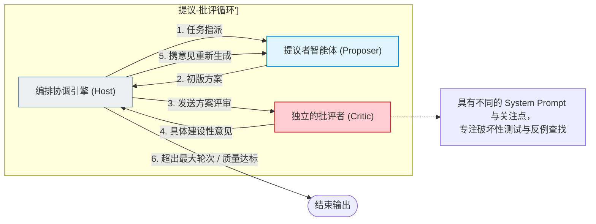
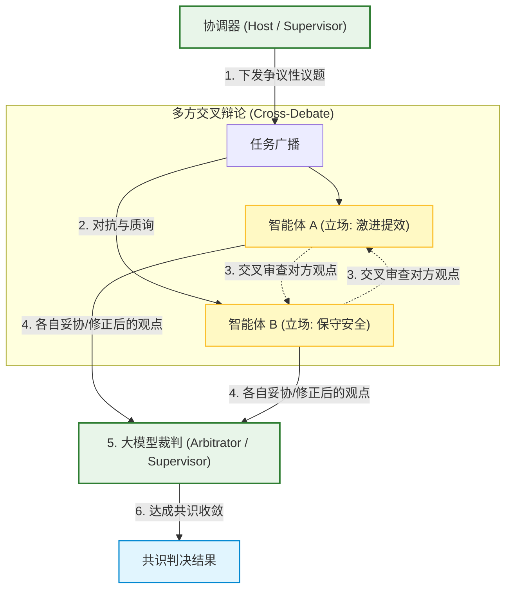
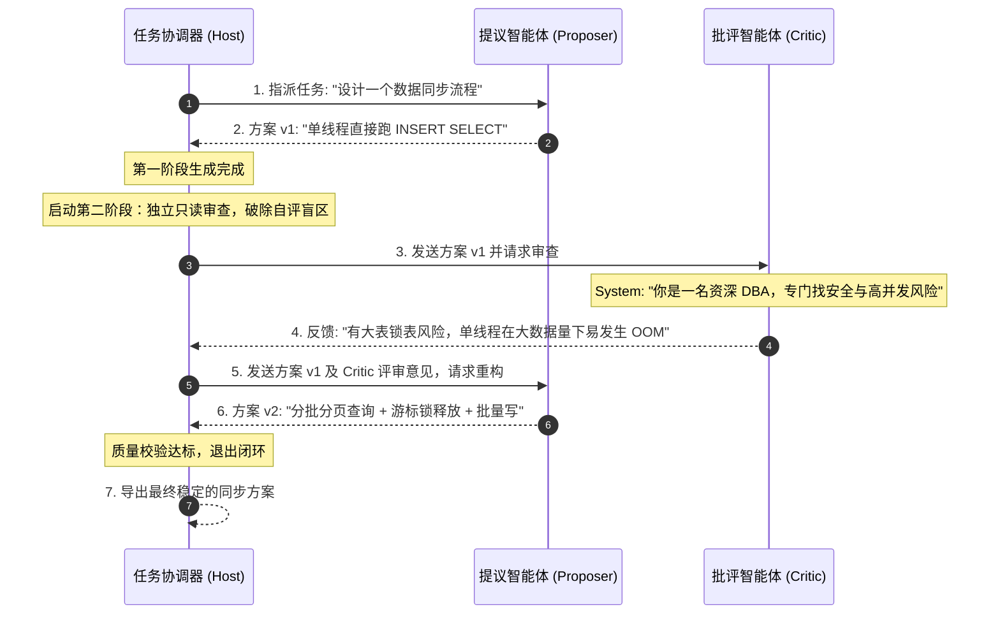

import GlossaryTerm from '@site/src/components/GlossaryTerm';
import GuidedExercise from '@site/src/components/GuidedExercise';
import ResearchNote from '@site/src/components/ResearchNote';
import ChapterMeta from '@site/src/components/ChapterMeta';
import PyRunner from '@site/src/components/PyRunner';
import TradeoffExplorer from '@site/src/components/TradeoffExplorer';
import QuizCard from '@site/src/components/QuizCard';

# M10L6 · 辩论与评审

<ChapterMeta
  time="约 2.5 小时"
  prereqs={[{label: 'M9L7 自我反思', href: '../agent-architectures/reflection-correction'}, {label: 'M10L2 独立审查角色', href: './roles-specialization'}, {label: 'M7L10 LLM-judge', href: '../llm-systems/llm-evaluation'}]}
  outcome="能用提议者-批评者/辩论模式让 Agent 互相审查提升质量，理解独立审查为什么比单 Agent 自评更有效，并控制它的成本和空转。"
  howToUse="先看“单 Agent 自评的盲点”，再学辩论评审模式，最后做提议-批评循环 lab。"
/>

:::tip 多 Agent 最不可替代的价值：一个独立的 Agent 来挑你的毛病
[M9L7](../agent-architectures/reflection-correction) 讲过单 Agent 自我反思，但它有个根本盲点：**自己审自己，有自我确认偏差**——容易觉得自己对、看不到自己的错。多 Agent 提供了单 Agent 给不了的东西：**一个独立的、视角不同的 Agent 来挑毛病。** 提议者出方案、批评者专门找问题、再改进——这种“对抗式”协作能抓出单 Agent 自评抓不出的错误，是多 Agent **最独特、最不可替代的价值**（[呼应 M10L1](./why-multi-agent)）。
:::

## 一、自己审自己，看不到自己的错

[单 Agent 反思（M9L7）](../agent-architectures/reflection-correction) 让 Agent 检查自己的输出，但有局限：
- **自我确认偏差**：模型倾向于认为自己的输出是对的，容易“自我感觉良好”地放过错误。
- **同一视角**：自审用的是和生成时一样的“脑子”和角度——它没想到的盲点，反思时大概率还是想不到。
- **缺乏对抗**：没有“专门来找茬”的压力，反思容易流于表面。

人类写东西也一样——自己校对总不如别人审稿能挑出问题。多 Agent 的辩论/评审，就是给 Agent 引入这个“独立的别人”。

## 二、三个核心概念（分层）

### 基础：提议者-批评者

最基础的审查模式：<GlossaryTerm term="Proposer-Critic" definition="提议者-批评者：一个 Agent（提议者）产出方案/答案，另一个独立的 Agent（批评者）专门找它的问题和反例，提议者据此改进，循环若干轮。用独立视角提升质量。">提议者-批评者（proposer-critic）</GlossaryTerm>。一个 Agent（proposer）出方案，另一个**独立的** Agent（critic）专门找它的问题、漏洞、反例，proposer 据此改进，循环几轮。关键是 critic **独立**于 proposer——不同的 prompt（“你的任务是找出这个方案的所有问题”）、不同的关注点。这是 [M10L2 独立审查角色](./roles-specialization) 的协作形态，比单 Agent 由于 <GlossaryTerm term="Confirmation Bias" definition="确认偏差/确认偏误：智能体在自我审查时，由于倾向于寻找支持自己先前结论的证据，而忽略或掩盖反面例证的认知倾向。">确认偏差 (Confirmation Bias)</GlossaryTerm> 而自评失效（[M9L7](../agent-architectures/reflection-correction)）更能抓错。

### 进阶：辩论与交叉审查

更强的形式：
- <GlossaryTerm term="Multi-Agent Debate" definition="多 Agent 辩论：多个 Agent 对一个问题各自给出答案/立场，互相质询、反驳、修正，通过对抗逼出更可靠的结论。比单个答案更能暴露错误和盲点。">辩论（debate）</GlossaryTerm>：多个 Agent 对同一问题各持立场、互相质询反驳，通过对抗逼出更可靠的结论——适合有争议、需要权衡的问题。
- **<GlossaryTerm term="Cross-Review" definition="交叉审查：多个智能体之间互为评审对象，打破单向反馈链条，通过双向或网状的互相校验发现盲点的审查协作机制。">交叉审查 (Cross-Review)</GlossaryTerm>**：多个 Agent 互相审对方的产出，而非单向。
- 它们都基于同一原理：**多个独立视角的碰撞，比单一视角更能发现错误**（[呼应 M8L5 互补组合 > 单一](../rag/hybrid-search)、集成思想）。也呼应 [M7L10 用更强模型当 judge](../llm-systems/llm-evaluation)——批评者就是一种聚焦的 judge。

### 深入（选学）：辩论评审的代价与控制

- **成本高、可能空转**：辩论/评审 = 多个 Agent 多轮来回 = token 成本翻几倍（[M10L10](./multi-agent-ops)）。而且可能**空转**——批评者反复挑无关紧要的小毛病、或两个 Agent 各执己见永远不收敛。必须配[停止条件（M9L4）](../agent-architectures/stopping-budget)：最多几轮、或质量达标就停。
- **批评者要“会批评”**：critic 的 prompt 很关键——要它**具体、有建设性地**指出问题（“这里有单点风险，因为…”），而非空泛否定或鸡蛋里挑骨头。批评质量决定审查价值。
- **要有裁决/<GlossaryTerm term="State Convergence" definition="状态收敛：在多智能体协作中，将各个节点的冲突观点、异构输出或分散事实逐步汇总并合并为单一确定性结论的演进过程。">收敛机制</GlossaryTerm>**：辩论不能永远进行——需要一个机制收敛到结论：[Supervisor 裁决（M10L3）](./supervisor-orchestration)、[投票（M10L8）](./conflict-consensus)、或达到“批评者无重大异议”就停。
- **何时值得**：辩论评审最适合**高价值、容错低、需要质量把关**的任务（架构方案、代码安全审查、重要决策）——这时多花的成本换来的质量提升值得。对低价值/容错高的任务（[呼应 M7L9 容错度](../llm-systems/hallucination-guardrails)），单 Agent 甚至不审查就够了，别为了“显得严谨”而过度。
- 这是多 Agent **唯一单 Agent 难以替代**的能力（专精分工单 Agent 也能勉强串行模拟，但“真正独立的对抗审查”必须多个 Agent）。所以如果你的任务最需要的是质量把关/找反例，辩论评审可能是用多 Agent 的最佳理由。

<ResearchNote
  title="独立审查/辩论：用对抗逼出更可靠的结论"
  source="Du et al. (2023), Multi-Agent Debate；Constitutional AI / critic 模型；M7L10 LLM-as-judge"
  href="https://arxiv.org/abs/2305.14325"
  insight="单 Agent 自评有自我确认偏差，独立的批评者/辩论能引入不同视角、抓出自评抓不出的错误，提升答案可靠性（研究显示多 Agent 辩论在推理任务上优于单次生成）。代价是成本翻倍、可能空转/不收敛，需停止条件、好的批评 prompt、裁决收敛机制。最适合高价值、需质量把关的任务。"
  application="高价值/容错低的任务用提议者-批评者或辩论：critic 独立于 proposer、具体建设性地找问题、循环改进。配停止上限防空转、裁决机制收敛（Supervisor/投票）。低价值任务别过度审查。这是多 Agent 最不可替代的价值——独立对抗审查。"
/>

## 三、智能体辩论与评审图解 (Deep Dive Diagrams)

本节展示提议者-批评者交互的线性闭环、多视角对抗辩论与第三方仲裁收敛结构，以及分阶段只读审查的动态时序。

### 1. 结构全景：提议者-批评者（Proposer-Critic）闭环控制环



### 2. 编排演进：多视角辩论（Multi-perspective Debate）与收敛架构



### 3. 时序全景：两阶段生成与独立审查时序



---

## 四、跟我做一遍：提议者-批评者循环

<PyRunner
  rows={40}
  expect="独立批评驱动改进、达标收敛"
  code={`def proposer(task, critique=None):             # 提议者:据批评改进
    if critique is None:
        return "方案v1: 单实例部署"               # 初版有问题
    if "单点" in critique:
        return "方案v2: 多实例+负载均衡"
    return "方案v3: 多实例+多可用区"

def critic(proposal):                          # 批评者:独立找问题(非自评!)
    if "单实例" in proposal:
        return {"ok": False, "critique": "有单点风险,挂了就全停"}
    if "多可用区" not in proposal:
        return {"ok": False, "critique": "未跨可用区,扛不住机房故障"}
    return {"ok": True, "critique": "无重大问题"}

def debate(task, max_rounds=4):
    critique = None
    history = []
    for _ in range(max_rounds):
        proposal = proposer(task, critique)
        review = critic(proposal)              # 独立批评
        history.append((proposal, review["critique"]))
        if review["ok"]:                       # 收敛:批评者无重大异议
            return proposal, history
        critique = review["critique"]          # 带着批评改进
    return proposal, history                   # 达上限(防空转)

final, history = debate("设计高可用部署")
for p, c in history:
    print("提议:", p, "| 批评:", c)
print("==> 最终:", final)
print("独立批评驱动改进、达标收敛")`}
/>

提议者出初版（有单点风险），独立的批评者专门挑问题，提议者据此改进，循环到批评者无重大异议才收敛——独立审查抓出了单 Agent 自评容易放过的问题，且有轮次上限防空转。**试试**：把 critic 改成"自评"（proposer 自己审），看它倾向于觉得初版就挺好（自我确认偏差）；想想 max_rounds 防的是什么（永不收敛的空转）。

## 五、动手 Lab（必做）

打开 `labs/month10/m10l6_debate/`：

```bash
python labs/month10/m10l6_debate/test_debate.py
```

实现提议者-批评者循环：独立批评驱动改进、达标即收敛、有轮次上限防空转，并记录辩论历史。

<GuidedExercise
  title="练习指引：实现提议-批评循环"
  goal="把“独立批评 + 据评改进 + 收敛/上限”做成代码——多 Agent 最不可替代的审查价值。"
  hints={[
    'proposer(task, critique)：无批评出初版，有批评据其改进。',
    'critic(proposal)：独立找问题，返回 {ok, critique}。',
    'debate：循环 提议->批评->ok 则停/否则带批评再提议。',
    'max_rounds 防空转(永不收敛)。'
  ]}
  steps={[
    '实现 debate(task, proposer, critic, max_rounds)。',
    '循环：提议 -> 独立批评 -> ok 收敛 / 否则带批评改进。',
    '记录每轮 (提议, 批评)；达上限停止。',
    '写测试：批评驱动改进、达标收敛、上限防空转、历史记录、独立批评抓出问题。'
  ]}
  checks={[
    '你能解释独立审查为什么优于单 Agent 自评。',
    '你的 lab 能提议-批评循环、收敛、防空转。',
    '你能说出辩论评审的成本和空转风险及控制。',
    '你理解这是多 Agent 最不可替代的价值。'
  ]}
/>

## 架构师深潜（Staff+ 视角）

### 1. 审查方式

<TradeoffExplorer
  title="提升质量的审查方式"
  dimensions={['抓错能力', '成本低', '无偏差', '收敛快', '适合高价值任务']}
  options={[
    {
      name: '单 Agent 自评(M9L7)',
      scores: [2, 5, 1, 5, 2],
      note: '自己审自己。便宜、快，但有自我确认偏差、同视角盲点。',
      whenToUse: '低价值任务的轻量改进。'
    },
    {
      name: '提议者-批评者',
      scores: [4, 3, 4, 3, 4],
      note: '独立批评者找问题。抓错强、视角独立。但成本翻倍、要防空转。',
      whenToUse: '需质量把关的任务。'
    },
    {
      name: '多 Agent 辩论',
      scores: [5, 1, 5, 2, 5],
      note: '多方对抗逼出可靠结论。最能抓错。但成本最高、最易空转、需裁决。',
      whenToUse: '高价值、有争议、容错极低的决策。'
    }
  ]}
/>

### 2. "独立对抗审查"是多 Agent 不可替代的核心理由

如果说[专精分工（M10L2）](./roles-specialization)、[编排（M10L3/L5）](./supervisor-orchestration) 单 Agent 串行也能勉强模拟，那"**真正独立的对抗审查**"是多 Agent 唯一难以被单 Agent 替代的能力——因为它的价值恰恰来自"**不是同一个脑子**"。单 Agent 自评再怎么 prompt，本质还是用生成答案的同一个模型实例、同一段上下文来审，逃不开自我确认偏差；而一个独立的批评者 Agent（独立 prompt、专注找茬、不背"我要维护自己答案"的包袱）能提供真正不同的视角。这呼应一个深刻的工程/认知原理：**独立的检查者比自检更可靠**——[代码 review 要别人审、测试要独立于实现、审计要第三方](../design-patterns-lld/code-smells-refactoring)。所以当架构师判断"这任务该不该用多 Agent"时，**"是否需要独立的质量把关/找反例"往往是最有说服力的理由**——这是多 Agent 提供的、其它方案给不了的东西。

### 3. 真实案例：critic Agent 提升关键产出质量

辩论评审最有价值的落地，是给**高风险、容错低**的 AI 产出加一个独立的 critic：代码生成后加一个安全审查 Agent（专找漏洞）、架构方案后加一个风险审查 Agent（专找单点/扩展性问题）、重要决策前加一个唱反调的 Agent（专找反例和盲点）。这些独立 critic 能抓出生成 Agent 自己发现不了的问题，明显提升关键产出的可靠性。但也要克制——给低价值、高容错的产出（如随手生成的草稿）配一堆审查 Agent，是过度工程，徒增成本和延迟。**判断哪些产出值得独立审查、审查到什么程度，是按[容错度（M7L9）](../llm-systems/hallucination-guardrails)做的工程权衡**：越接近钱、安全、不可逆后果的产出，越值得多花成本上独立审查；反之则单 Agent 甚至不审就够。

### 4. 架构师深问（给自己 30 分钟）

- 你的关键 AI 产出（代码/方案/决策）有独立审查吗，还是只靠生成 Agent 自评（有自我确认偏差）？
- 你的 critic 是真正独立的（不同 prompt、专注找茬）吗？它的批评具体有建设性，还是空泛/挑刺？
- 辩论评审有轮次上限和收敛机制吗？会不会空转（反复挑小毛病/各执己见）？哪些产出值得这个成本？

## 知识自测

<QuizCard
  questions={[
    {
      q: '为什么说“提议者-批评者 (Proposer-Critic)”对抗模式能显著提升高风险任务的答案质量？',
      options: [
        'A. 因为该模式强制要求两个 Agent 必须运行在相同的系统上下文深度中',
        'B. 批评者（Critic）拥有独立的 System Prompt 且不背负生成正确方案的初始包袱，能够以完全不同的关注点对方案进行第三方只读破坏性测试，有效规避了“自评偏差”',
        'C. 提议者和批评者使用加权投票算法，可以直接实现分布式事务回滚',
        'D. 因为该模式会自动延长大模型的 Token 生成窗口'
      ],
      answer: 1,
      explain: '单 Agent 自检类似于“作者自校对”，极易由于认知盲区和确认偏误发生遗漏。只有引入视角不同、 prompt 不同的独立审查 Agent，才能在对抗中揪出隐秘的安全与逻辑漏洞。'
    },
    {
      q: '在实施“多智能体辩论（Multi-Agent Debate）”或多轮评审时，最容易发生的工程失控现象（“系统空转”）是什么？该如何避免？',
      options: [
        'A. 痛点是 Worker 会产生网络死锁；避免方法是重启 Redis',
        'B. 痛点是 Agent 之间无边界自由抢占 CPU 资源；避免方法是使用 K8s limit 限制',
        'C. 痛点是批评者反复纠缠于微不足道的小毛病，或两个 Agent 各执己见导致无法达成一致，耗光 Token 预算；避免方法是设置最大轮次硬停止条件、并引入 Supervisor 仲裁收敛',
        'D. 痛点是模型会自动切换为英文输出；避免方法是禁止使用 MCP 协议'
      ],
      answer: 2,
      explain: '大模型之间如果缺乏代码机制进行强制叫停，极其容易在边缘细节上发生无休止的“学术争议”，烧干预算。设置最大轮次上限（如 max_turns=3）或在达标后退出是多 Agent 可控性的基本红线。'
    },
    {
      q: '作为系统架构师，对于“是否应该为所有任务引入独立审查/辩论编排”，最理性的决策依据是？',
      options: [
        'A. 秉持“能用尽用”原则，确保每一篇输出都得到至少 3 个 critic 审查以显得系统足够高级',
        'B. 依据业务的“容错度 (Hallucination tolerance)”进行工程折中权衡。高价值、低容错、有副作用的敏感操作（如代码合并、发布、资金调用）配置独立审查；低价值产物则单 Agent 足矣',
        'C. 仅在模型采样温度 (Temperature) 设置为 0 时才使用独立审查',
        'D. 完全取决于模型参数量的大小'
      ],
      answer: 1,
      explain: '多 Agent 对抗虽然能提升质量，但带来了成倍的延迟和 Token 费用开销。架构师不可盲目堆叠审查节点，而是应当将它作为“用钱买安全”的折中手段，只用于关键的高价值卡点。'
    }
  ]}
/>

## 自检清单

- [ ] 我能解释独立审查为什么优于单 Agent 自评（无自我确认偏差）。
- [ ] 我的 lab 能提议-批评循环、收敛、防空转。
- [ ] 我能控制辩论评审的成本和空转（上限/裁决/好的批评 prompt）。
- [ ] 我理解独立对抗审查是多 Agent 最不可替代的价值。

## 常见误解

- **"让 Agent 自己多检查几遍就行"**：自评有自我确认偏差；独立批评者才真正抓错。
- **"辩论越多轮越好"**：成本翻倍、易空转；要上限和收敛机制。
- **"所有产出都该独立审查"**：按容错度权衡；低价值产出别过度审查。

## 延伸阅读

- [Multi-Agent Debate (Du et al., 2023)](https://arxiv.org/abs/2305.14325)
- [M9L7 反思与自我纠错](../agent-architectures/reflection-correction)
- [下一课：交接与路由](./handoff-routing)