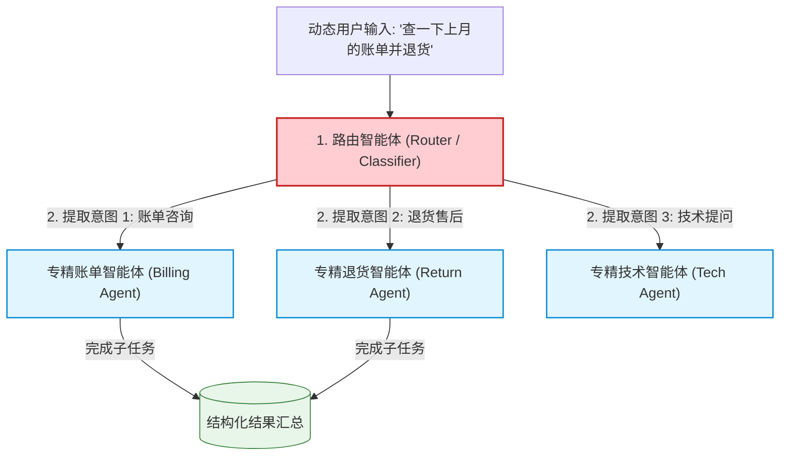
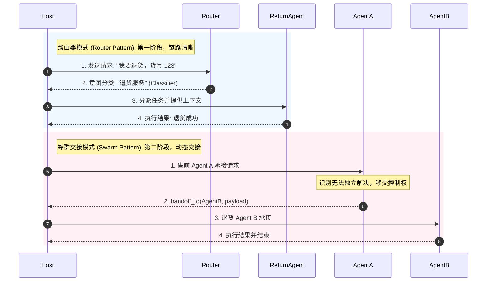

import GlossaryTerm from '@site/src/components/GlossaryTerm';
import GuidedExercise from '@site/src/components/GuidedExercise';
import ResearchNote from '@site/src/components/ResearchNote';
import ChapterMeta from '@site/src/components/ChapterMeta';
import PyRunner from '@site/src/components/PyRunner';
import TradeoffExplorer from '@site/src/components/TradeoffExplorer';
import QuizCard from '@site/src/components/QuizCard';

# M10L7 · 交接与路由

<ChapterMeta
  time="约 2 小时"
  prereqs={[{label: 'M10L3 Supervisor', href: './supervisor-orchestration'}, {label: 'M5L1 负载均衡', href: '../core-components/load-balancing'}, {label: 'M7L5 模型路由', href: '../llm-systems/llm-api-cost-latency'}]}
  outcome="能用路由 Agent 按能力把请求分派给合适的专精 Agent，理解 swarm 式自由交接的灵活与失控，并知道多数场景为什么路由更稳。"
  howToUse="先看“请求来了不知道交给谁”，再学路由和交接，最后做能力路由 lab。"
/>

:::tip 多 Agent 协作还有一个问题：一个请求来了，该交给谁？
[Supervisor（M10L3）](./supervisor-orchestration) 编排固定流程，但有些场景是**动态的**：客服系统来一个问题，是技术问题、账单问题、还是退货问题？该交给哪个专精 Agent？这就是**路由（routing）**——按请求的性质，把它分派给最合适的 Agent。更激进的是 **swarm（蜂群）**：让 Agent 之间**直接交接**（这个我处理不了，转给那个）。路由可控、swarm 灵活但难控——多数情况路由更稳。
:::

## 一、请求来了，该交给哪个专精 Agent？

有了一组专精 Agent，一个动态来的请求该交给谁？
- **客服**：技术问题→技术 Agent、账单→账单 Agent、退货→退货 Agent。
- **任务分派**：代码任务→编码 Agent、调研任务→研究 Agent。
- **难度分流**：简单问题→快而便宜的 Agent、复杂问题→强 Agent（[呼应 M7L5 模型路由](../llm-systems/llm-api-cost-latency)）。

需要一个机制按请求的**性质/所需能力**，把它送到对的 Agent。这就是路由——多 Agent 的"调度交通"。

## 二、三个核心概念（分层）

### 基础：路由 Agent

<GlossaryTerm term="Router Agent" definition="路由 Agent：一个专门判断“这个请求该交给哪个专精 Agent”的 Agent（或分类器）。按请求的性质/所需能力分派，让每个请求被最合适的专精 Agent 处理。是动态分派的可控方式。">路由 Agent（router）</GlossaryTerm>：一个专门负责"判断请求该交给谁"的 Agent（或轻量分类器）。它看请求的性质，按能力把它分派给合适的专精 Agent。这是 [Supervisor 的"分配"职责（M10L3）](./supervisor-orchestration) 的动态版本，也和 [M5L1 负载均衡按规则分流](../core-components/load-balancing)、[M5L3 服务发现](../core-components/service-discovery) 同构——**一个集中的调度点，把请求送到对的处理者**。路由可控、可追踪（知道每个请求去了哪），是动态分派的首选。

### 进阶：能力发现与 swarm 交接

- **能力发现**：路由需要进行 <GlossaryTerm term="Capability Discovery" definition="能力发现：智能体路由系统中，各个执行节点注册或暴露其工具集、支持指令集及意图分类特征，供中心化路由器进行动态能力匹配的机制。">能力发现 (Capability Discovery)</GlossaryTerm> ——每个 Agent 声明自己的能力（capability），路由按"请求需要什么能力"匹配（[呼应 M5L3 服务能力注册、M10L9 协议](./agent-protocols)）。
- <GlossaryTerm term="Swarm / Handoff" definition="蜂群/交接：去中心化的多 Agent 模式——没有中央路由，Agent 之间直接“交接”（这个我处理不了，转给最合适的那个）。灵活、无单点，但难追踪、难控制、易混乱。">swarm（蜂群）/ 交接（handoff）</GlossaryTerm>：去中心化模式——没有中央路由，Agent 之间**直接交接**（"这超出我的能力，转给 X"）。灵活、无单点，但难追踪（请求在 Agent 间流转、不知道在哪）、难控制、易混乱（[呼应 M10L3 去中心化的代价](./supervisor-orchestration)）。

### 深入（选学）：路由 vs swarm 的取舍

- **路由（中心化）更可控，swarm（去中心化）更灵活**：和 [Supervisor vs swarm（M10L3）](./supervisor-orchestration)、[网关 vs mesh（M6L8）](../cloud-enterprise-industrial/service-mesh)、中心化 vs 去中心化是同一个永恒取舍。**多数生产系统用路由（中心化）**——因为可追踪、可控、可加[停止/护栏（M9）](../agent-architectures/stopping-budget)。swarm 只在确实需要去中心化灵活性、且能容忍难控时才用。
- **路由质量决定一切**：路由错了（把技术问题送给账单 Agent），后面再专精也白搭。路由要准——可以用特殊的 <GlossaryTerm term="Intent Classifier" definition="意图分类器：用于检测用户输入的底层意图，通常为小参数量微调分类模型或大模型 prompt，以确定需要路由匹配的智能体节点类别。">意图分类器 (Intent Classifier)</GlossaryTerm>（快、便宜、确定）或 LLM 判断（灵活、能理解复杂请求），按需选（[呼应 M7L5 路由、M8L7 查询理解](../llm-systems/llm-api-cost-latency)）。
- **路由要有兜底**：请求不属于任何已知能力怎么办？必须设计 <GlossaryTerm term="Fallback Mechanism" definition="兜底降级/退避机制：在软件或智能体交互中，当主逻辑、主要路由节点或外部 API 调用失效/匹配不成功时，系统自动跳转执行的安全、静态或人工介入的防御策略。">兜底机制 (Fallback Mechanism)</GlossaryTerm>。要有默认 Agent / 转人工 / 弃答（[呼应 M7L9 弃答](../llm-systems/hallucination-guardrails)）——别让无法路由的请求卡死或乱派。
- **防止交接死循环**：swarm 里 Agent 互相踢皮球（A 转 B、B 转 A）会死循环——必须有[交接次数上限（M9L4 停止）](../agent-architectures/stopping-budget) 和兜底。这是去中心化的典型风险。
- **混合**：常见做法是**路由 + Supervisor**——路由决定初始交给谁，Supervisor 编排后续；或路由分派后 Agent 在受限范围内可交接。纯 swarm（完全自由交接）在生产中少见。

<ResearchNote
  title="路由：按能力分派，中心化可控；swarm 灵活但难控"
  source="多 Agent 路由/交接实践（OpenAI Swarm、handoff 模式）；M5L1 负载均衡 / M5L3 服务发现；M7L5 模型路由"
  href="https://www.anthropic.com/research/building-effective-agents"
  insight="动态请求需路由到合适的专精 Agent。路由 Agent（中心化）按能力分派，可控可追踪，是多数场景首选；swarm（去中心化交接）灵活无单点，但难追踪、难控、易死循环。路由质量决定效果，要准、要兜底、要防交接死循环。本质同负载均衡/服务发现/中心化vs去中心化的永恒取舍。"
  application="动态分派优先用路由 Agent（中心化、可控）：按能力匹配、分类器或 LLM 判断、设默认/兜底、可追踪。swarm 仅在需去中心化灵活时用，配交接上限防死循环。常用路由+Supervisor 混合。把它当负载均衡/服务发现来设计。"
/>

## 三、分派路由与 Swarm 交接图解 (Deep Dive Diagrams)

本节展示集中式路由器的结构分派拓扑、网状去中心化 Swarm 交接中存在的循环风险，以及这两种动态分配机制的时序流程对比。

### 1. 结构全景：集中式路由器模式（Router Pattern）拓扑



### 2. 控制流程：网状点对点交接（Swarm Pattern）拓扑

```mermaid
graph TD
    classDef agent fill:#fff9c4,stroke:#fbc02d,stroke-width:1.5px;
    classDef alert fill:#ffebee,stroke:#c62828,stroke-width:1.5px;

    Start(["接收原始请求"]) --> AgentA["智能体 A (售前咨询)"]:::agent
    
    AgentA -->|1. 转交控制权 (Handoff)| AgentB["智能体 B (账单处理)"]:::agent
    AgentB -->|2. 再次转交 (Handoff)| AgentC["智能体 C (售后服务)"]:::agent
    
    AgentC -.->|3. 踢皮球循环 (死循环风险)| AgentB
    
    Note over AgentB, AgentC: Swarm 模式去中心化，但极易发生循环交接 (踢皮球)<br/>必须用最大 handoff 步数强行熔断限制
```

### 3. 时序全景：路由分派与 Swarm 动态交接时序对比



---

## 四、跟我做一遍：能力路由

<PyRunner
  rows={36}
  expect="按能力路由到对的 Agent"
  code={`# 专精 Agent 声明自己的能力(capability)
AGENTS = {
    "tech":    {"caps": {"技术", "故障", "API"}, "handle": lambda q: "技术解答:" + q},
    "billing": {"caps": {"账单", "付款", "发票"}, "handle": lambda q: "账单处理:" + q},
    "return":  {"caps": {"退货", "退款", "换货"}, "handle": lambda q: "退货处理:" + q},
}

def route(keywords, agents, default="human"):
    # 路由:按请求需要的能力匹配最合适的 Agent
    best, best_score = None, 0
    for name, spec in agents.items():
        score = len(set(keywords) & spec["caps"])
        if score > best_score:
            best, best_score = name, score
    if best is None:
        return (default, None)              # 兜底:无法路由 -> 转人工
    return (best, agents[best]["handle"])

for req in [["账单", "发票"], ["API", "故障"], ["退款"], ["天气", "如何"]]:
    name, handler = route(req, AGENTS)
    if handler:
        print(req, "->", name, "->", handler("请求"))
    else:
        print(req, "-> 无匹配能力, 转人工(兜底)")   # 防乱派
print("按能力路由到对的 Agent")`}
/>

路由按"请求需要什么能力"匹配最合适的 Agent，匹配不到就兜底转人工（而不是乱派）。这是中心化的可控分派——每个请求去了哪都看得见。**试试**：加一个能力重叠的请求（既像技术又像账单），看路由怎么选；想想如果没有兜底，"天气"这种请求会怎样（被乱派给某个 Agent）。

## 五、动手 Lab（必做）

打开 `labs/month10/m10l7_routing/`：

```bash
python labs/month10/m10l7_routing/test_routing.py
```

实现能力路由：按请求所需能力匹配专精 Agent、无匹配时兜底、可追踪路由去向。

<GuidedExercise
  title="练习指引：实现能力路由"
  goal="把“按能力把请求分派给对的专精 Agent + 兜底”做成可控的中心化路由。"
  hints={[
    'Agent 声明 caps(能力集合)。',
    'route：算请求关键词与各 Agent caps 的交集，选最高分。',
    '无匹配 -> 默认兜底(转人工/弃答)，别乱派。',
    '记录每个请求路由到了哪(可追踪)。'
  ]}
  steps={[
    '定义 AGENTS(每个含 caps 和 handle)。',
    '实现 route(keywords, agents, default)：按能力匹配选最优。',
    '无匹配返回兜底；记录路由日志。',
    '写测试：路由准确、兜底生效、可追踪、能力重叠时选最优。'
  ]}
  checks={[
    '你能解释路由(中心化)为什么比 swarm 更可控。',
    '你的 lab 能按能力路由并兜底。',
    '你能说出路由质量为什么决定一切、要怎么防交接死循环。',
    '你知道多数生产系统为什么用路由而非纯 swarm。'
  ]}
/>

## 架构师深潜（Staff+ 视角）

### 1. 动态分派方式

<TradeoffExplorer
  title="把请求分派给专精 Agent 的方式"
  dimensions={['灵活', '可控可追踪', '无单点', '防死循环', '生产常用']}
  options={[
    {
      name: '路由 Agent(中心化)',
      scores: [3, 5, 2, 5, 5],
      note: '中央按能力分派。可控、可追踪、易加护栏。但路由是单点、质量决定一切。',
      whenToUse: '绝大多数动态分派场景。'
    },
    {
      name: 'swarm(去中心化交接)',
      scores: [5, 1, 5, 1, 1],
      note: 'Agent 直接交接。灵活、无单点。但难追踪、易死循环、难控。',
      whenToUse: '确需去中心化灵活、能容忍难控。'
    },
    {
      name: '路由 + Supervisor 混合',
      scores: [4, 4, 2, 4, 4],
      note: '路由定初始、Supervisor 编排后续。兼顾灵活与可控。',
      whenToUse: '复杂动态流程的常见落地。'
    }
  ]}
/>

### 2. 路由 = 多 Agent 的负载均衡/服务发现

路由不是 Agent 时代的新发明——它就是 [M5L1 负载均衡](../core-components/load-balancing)、[M5L3 服务发现](../core-components/service-discovery)、[M6L8 服务网格](../cloud-enterprise-industrial/service-mesh) 在多 Agent 语境下的再现。**一个集中的调度点，按规则/能力把请求送到对的处理者**——这个模式你在分布式系统里见过无数遍。所以设计 Agent 路由时，过去所有关于负载均衡/网关的经验都能直接迁移：路由要不要有[健康探针（M6L3）](../cloud-enterprise-industrial/config-secrets-probes)（Agent 挂了别往那送）？要不要[限流（M5L5）](../core-components/rate-limiting)？路由本身要不要[高可用（M5L1）](../core-components/load-balancing)（它是单点）？**认出"这其实是个老问题"，是架构师最值钱的能力**——别被"Agent"的新名词唬住，本质还是把请求送到对的地方。

### 3. 真实案例：客服系统的路由 + 兜底 + 升级

一个生产级 AI 客服的分派逻辑，几乎都是路由而非 swarm：进来的问题先由路由 Agent（或一个快分类器）判断类别 → 分派给对应专精 Agent（技术/账单/退货）→ 该 Agent 处理；处理不了或用户不满意 → **升级**给更强的 Agent 或转人工（兜底）。关键设计：(1) 路由要准（路由错全盘错），用分类器快筛 + 必要时 LLM 兜底判断；(2) 一定有**转人工兜底**——无法路由、低置信、用户要求人工时，别让 AI 硬扛（[呼应 M7L9 弃答、M9L9 护栏](../llm-systems/hallucination-guardrails)）；(3) 全程**可追踪**——每个请求路由到哪、为什么、结果如何都有日志（[M10L10 可观测](./multi-agent-ops)）。纯 swarm（让客服 Agent 之间自由踢皮球）在这里是灾难——用户会被转来转去、没人能说清请求在哪。

### 4. 架构师深问（给自己 30 分钟）

- 你的动态分派是可控可追踪的路由，还是让 Agent 自由交接的 swarm？你真的需要去中心化吗？
- 你的路由准吗？路由错了后面再专精也白搭——路由质量你怎么保证、怎么监控？
- 无法路由/低置信的请求有兜底（默认 Agent/转人工/弃答）吗？swarm 有交接上限防死循环吗？

## 知识自测

<QuizCard
  questions={[
    {
      q: '多智能体系统在动态处理复杂多变的用户输入时，最常用且最可控的路由机制是什么？',
      options: [
        'A. Swarm 蜂群式交接，完全不需要任何中央协调器',
        'B. 中心化路由 Agent (Router Pattern)——通过意图分类器对请求进行快筛，并按专精 Worker 的能力声明进行精确分派',
        'C. 允许所有 Worker Agent 自由并发读取黑板状态，自行竞价认领任务',
        'D. 不进行任何分配，完全依赖于物理数据库层面的分布式事务锁'
      ],
      answer: 1,
      explain: '这和传统系统工程中的“API 网关分流”高度一致。路由器模式为系统提供了一个单一控制点，非常便于记录跳转追踪、控制 Token 成本和添加统一的防护护栏。'
    },
    {
      q: '在点对点去中心化的 Swarm（蜂群）模式中，最典型的级联失败风险是什么？如何从系统设计层面解决？',
      options: [
        'A. 风险是 GPU 的并发吞吐受限；解决办法是更换更高级的芯片',
        'B. 风险是模型响应超时；解决办法是增大 PyRunner 运行超时阈值',
        'C. 风险是智能体之间互相“踢皮球”，陷入循环重定向（死循环）；解决办法是强制引入“最大交接次数上限 (Handoff Limits)”以及设置升级兜底策略',
        'D. 风险是通信消息变成乱码；解决办法是禁止使用 JSONSchema'
      ],
      answer: 2,
      explain: '去中心化交互中，最怕节点因职责推诿或幻觉决策导致控制流死锁。比如 Agent A 转 B，B 又转 A。必须用程序强行记录 handoff 链深度（如限制最深 5 次跳转），并对低置信度的交互强制阻断升级至转人工网关。'
    },
    {
      q: '如何将传统架构中的“负载均衡 (Load Balancer)”和“服务发现 (Service Discovery)”智慧迁移至智能体路由？',
      options: [
        'A. 路由节点需要持续监视每个 Agent 的 Capability 能力契约；并且可以对高并发的 Agent 部署限流熔断墙，防止特定专精节点因超负荷而发生响应幻觉',
        'B. 彻底用 Swarm 网状交接取代负载均衡机制',
        'C. 将路由逻辑写死在每一个 Worker 的 prompt 设定中',
        'D. 把所有请求的路由状态都存储为非结构化的聊天历史文本'
      ],
      answer: 0,
      explain: '“AI 架构的根基依然是传统系统工程”。大模型时代的路由同样面临流量雪崩、单点故障、健康检查和限流问题。在设计路由智能体时，将其当成微服务 API Gateway 来审视与加固，是其能够稳健上生产的重要支撑。'
    }
  ]}
/>

## 自检清单

- [ ] 我能解释路由（中心化）比 swarm（去中心化）更可控、为什么多数场景用路由。
- [ ] 我的 lab 能按能力路由并兜底、可追踪。
- [ ] 我能把 Agent 路由认成负载均衡/服务发现这个老问题。
- [ ] 我知道路由质量决定一切、swarm 要防交接死循环。

## 常见误解

- **"swarm 更先进，应该用它"**：swarm 灵活但难控、易死循环；多数生产系统用更可控的路由。
- **"路由是 Agent 时代的新东西"**：它就是负载均衡/服务发现的再现，老经验直接迁移。
- **"路由不到就随便给一个"**：必须兜底（转人工/弃答），乱派比不派更糟。

## 延伸阅读

- [Building Effective Agents (Anthropic)](https://www.anthropic.com/research/building-effective-agents)
- [M5L1 负载均衡](../core-components/load-balancing) · [M5L3 服务发现](../core-components/service-discovery)
- [下一课：冲突与共识](./conflict-consensus)
