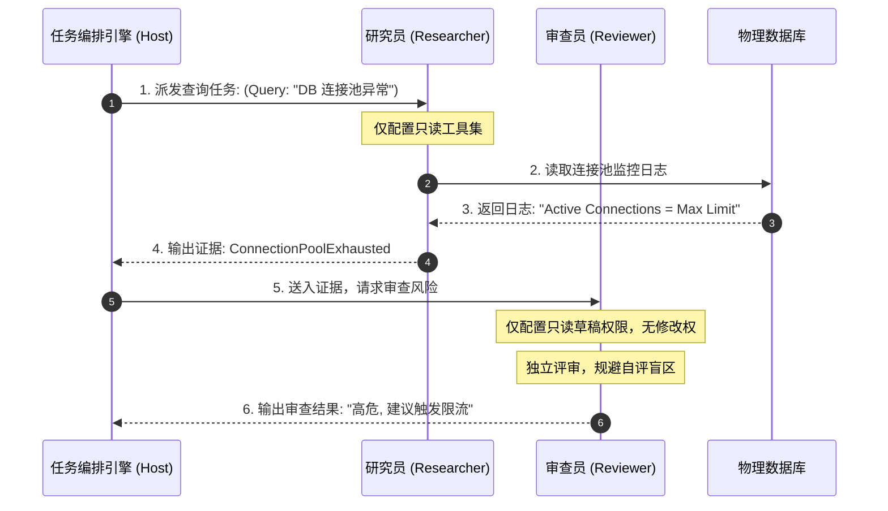

import GlossaryTerm from '@site/src/components/GlossaryTerm';
import GuidedExercise from '@site/src/components/GuidedExercise';
import ResearchNote from '@site/src/components/ResearchNote';
import ChapterMeta from '@site/src/components/ChapterMeta';
import PyRunner from '@site/src/components/PyRunner';
import TradeoffExplorer from '@site/src/components/TradeoffExplorer';
import QuizCard from '@site/src/components/QuizCard';

# M10L2 · 角色与专业分工

<ChapterMeta
  time="约 2.5 小时"
  prereqs={[{label: 'M10L1 何时多 Agent', href: './why-multi-agent'}, {label: 'M9L2 工具边界', href: '../agent-architectures/tools-and-boundaries'}, {label: 'M4L2 SRP', href: '../design-patterns-lld/solid-srp-ocp'}]}
  outcome="能为多 Agent 设计清晰的角色：每个 Agent 单一职责、最小工具和权限、角色不重叠，并理解“专精分工”为什么是多 Agent 价值的来源。"
  howToUse="先看“角色重叠/什么都干”的乱，再学角色设计原则，最后做按角色分离权限 lab。"
/>

:::tip 多 Agent 的价值来自“专精”，而专精来自“清晰的角色和最小的权限”
[M10L1](./why-multi-agent) 说多 Agent 的核心价值是专业化分工。但“分工”不会自动产生价值——如果几个 Agent 角色重叠、都“什么都能干”、工具权限一样，那它们只是几个混乱的全能 Agent，没有专精可言。真正有价值的分工：**每个 Agent 有一个清晰、单一、不重叠的角色，配一套刚好够用的最小工具和权限。** 这是 [M4 单一职责（SRP）](../design-patterns-lld/solid-srp-ocp) 和 [M9L2 最小权限](../agent-architectures/tools-and-boundaries) 在多 Agent 上的应用。
:::

## 一、角色重叠、什么都干 = 没有分工

一个失败的多 Agent 设计：建了“研究 Agent”“分析 Agent”“写作 Agent”，但每个都给了全套工具、都能查能写能改、prompt 也都很泛——结果它们职责重叠、互相抢活、产出不一致，协调起来一团乱。这和“一个全能 Agent”相比没有任何专精优势，反而多了协调成本。问题在于：**角色没有真正分开。** 多 Agent 的第一步，是把角色设计清楚——像设计一个团队的岗位职责。

## 二、三个核心概念（分层）

### 基础：单一职责的角色

每个 Agent 应该有一个<GlossaryTerm term="Agent Role" definition="Agent 角色：一个 Agent 在多 Agent 系统中承担的单一、清晰、不与他人重叠的职责（如研究员、设计者、审查者），配套与该职责匹配的提示、工具和权限。">清晰的角色</GlossaryTerm>——单一职责、边界明确、和其它 Agent 不重叠（[呼应 M4L2 <GlossaryTerm term="Single Responsibility Principle" definition="单一职责原则：SOLID 设计原则的第一条，主张一个类或模块应该有且仅有一个发生变化的原因。">单一职责原则 (SRP)</GlossaryTerm>](../design-patterns-lld/solid-srp-ocp)）。像设计团队岗位：研究员负责查资料、架构师负责出方案、审查员负责找风险——每个角色**做什么、不做什么**都清楚。角色清晰了，每个 Agent 的 prompt 才能聚焦（“你是审查员，只找风险，不改方案”），产出才专精、可预期。

### 进阶：最小工具与权限分离

角色不同，[工具和权限（M9L2）](../agent-architectures/tools-and-boundaries) 也该不同——这是多 Agent **安全和专精的关键**：
- **研究员**：只读检索工具（查资料），无写权限。
- **架构师**：生成方案的工具，无执行权限。
- **审查员**：只读 artifacts，无修改权限（审查员不该改答案，只提风险）。
- **执行者**（如果有）：才有[副作用工具（M9L2 危险工具需审批）](../agent-architectures/tools-and-boundaries)。

按角色做<GlossaryTerm term="Permission Separation" definition="权限分离：给每个 Agent 角色分配刚好完成其职责所需的最小工具和权限，不同角色权限不同。既实现专精，又限制每个 Agent 的爆炸半径（一个角色被攻破/出错，影响有限）。">权限分离</GlossaryTerm>：每个 Agent 实行 <GlossaryTerm term="Principle of Least Privilege" definition="最小特权原则：只授予完成特定工作所必需的最小系统访问和操作权限的安全设计原则。">最小特权原则 (Principle of Least Privilege)</GlossaryTerm>。这既保证专精，又[限制每个 Agent 的爆炸半径（M5L8/M9L9）](../core-components/bulkhead-isolation)——一个角色出错或被攻破，影响被关在它的权限范围内。

### 深入（选学）：角色设计的工程要点

- **角色要“本质不同”**（[呼应 M10L1](./why-multi-agent)）：不同的视角、知识域、工具、或独立判断的需要——而非只是同一工作的分段。判断标准：把这两个角色合并成一个 Agent 会不会更糟？如果合并没坏处，就别拆。
- **审查类角色的独立性是核心价值**：审查员/批评者必须**独立**于被审查者——不同的 prompt、不同的关注点（[M10L6 辩论评审](./debate-review)）。一个 Agent 既当作者又当审查会有[自我确认偏差（M9L7 自评不可靠）](../agent-architectures/reflection-correction)，独立审查才真正抓得出错。
- **结构化的角色契约**：每个角色有明确的输入/输出 [schema（M7L6）](../llm-systems/structured-output-tools)——研究员输出“证据列表”、审查员输出“风险列表（带证据）”。结构化契约让角色间能可靠协作（[M10L4 通信](./communication-state)），而非自由文本乱传。
- **别角色爆炸**：角色不是越多越好——每加一个角色都增加协调成本。只设**真正必要**的角色（[YAGNI](../design-patterns-lld/change-driven-design)）。三五个清晰角色，往往比十几个细碎角色更好协调。
- **角色 ≈ 微服务边界**：给 Agent 分角色，和 [M5/M2 给系统分服务](../core-components/overview)、[M4 给代码分职责](../design-patterns-lld/solid-srp-ocp) 是同一个“高内聚、低耦合、单一职责”的设计智慧——只不过对象从代码/服务变成了 Agent。设计多 Agent 的角色，本质是在做一次组织/职责设计。

<ResearchNote
  title="角色设计：单一职责 + 最小权限 + 独立审查"
  source="AutoGen / CrewAI 角色实践；M4 SRP；M9L2 最小权限；多 Agent 工程"
  href="https://arxiv.org/abs/2308.08155"
  insight="多 Agent 的专精价值来自清晰的角色设计：每个 Agent 单一、不重叠的职责，配最小工具和权限。审查类角色必须独立于被审查者以避免自评偏差。角色用结构化输入输出契约协作。角色要本质不同（合并会更糟才拆），且别角色爆炸。本质是把 SRP/最小权限/微服务边界用到 Agent。"
  application="设计多 Agent 角色：像设计团队岗位——单一职责、明确边界、最小工具权限、按角色分离权限（限制爆炸半径）。审查角色保持独立。角色间用 schema 化契约协作。只设必要角色，别爆炸。判断是否拆：合并成一个 Agent 会更糟吗？"
/>

## 三、角色分工与工具绑定图解 (Deep Dive Diagrams)

本节展示专精 Agent 的权限绑定与物理沙箱隔离拓扑、全能角色重叠引发的数据竞态冲突，以及专精 Agent 与编排引擎的交互时序。

### 1. 结构全景：专精 Agent 权限最小化与边界隔离拓扑

```mermaid
graph TD
    classDef brain fill:#ffcdd2,stroke:#c62828,stroke-width:1.5px;
    classDef tools fill:#e1f5fe,stroke:#0288d1,stroke-width:1.5px;
    classDef resource fill:#e8f5e9,stroke:#2e7d32,stroke-width:1.5px;

    subgraph ResearcherNode ["研究员 Agent (只读视角)"]
        Researcher["1. 调研智能体 (Researcher)"]:::brain
        Researcher -->|仅能调用| SearchAPI["Google 搜索 / 向量库检索"]:::tools
        SearchAPI -->|只读访问| DB["("只读数据库 / 知识库")"]:::resource
    end

    subgraph ArchitectNode ["架构师 Agent (只写方案)"]
        Architect["2. 设计智能体 (Architect)"]:::brain
        Architect -->|仅能调用| DiagramGen["代码/图表生成 API"]:::tools
        DiagramGen -->|生成| Artifacts["内存草稿区 (Artifacts)"]:::resource
    end

    subgraph ReviewerNode ["审查员 Agent (独立只读审计)"]
        Reviewer["3. 审查智能体 (Reviewer)"]:::brain
        Reviewer -->|仅能调用| ReadArtifacts["草稿区读取工具"]:::tools
        ReadArtifacts -->|评估建议| ReviewReport["只读评估报告 (HITL)"]:::resource
    end
```

### 2. 行为冲突：角色边界模糊导致的数据竞态冲突

```mermaid
graph LR
    classDef bad fill:#ffebee,stroke:#c62828,stroke-width:1.5px;
    classDef role fill:#fff9c4,stroke:#fbc02d,stroke-width:1px;

    subgraph ConflictingRoles ["混乱：全能角色重叠"]
        AgentA["全能型智能体 A"]:::bad
        AgentB["全能型智能体 B"]:::bad
        
        AgentA & AgentB -->|同时读写| SharedDB["("同一个数据库挂载卷")"]
        AgentA & AgentB -->|同时占用| TerminalCmd["Shell 终端 / 执行工具"]
        
        AgentA -->|1. 写文件 A| SharedDB
        AgentB -->|2. 改文件 A (覆盖)| SharedDB
        
        Note over AgentA, AgentB: 职责边界模糊造成了竞态条件 (Race Condition)<br/>无法定责，逻辑相互践踏
    end
```

### 3. 时序全景：专精角色任务指派与交互时序



---

## 四、跟我做一遍：按角色分离权限

<PyRunner
  rows={38}
  expect="每个角色只拿最小权限"
  code={`ALL_TOOLS = {"search", "read_doc", "gen_diagram", "read_artifact", "write_file", "run_cmd"}

ROLES = {
    "researcher": {"job": "查资料给证据", "tools": {"search", "read_doc"}},           # 只读
    "architect":  {"job": "出架构方案",   "tools": {"read_artifact", "gen_diagram"}},  # 读+生成,不执行
    "reviewer":   {"job": "找风险给证据", "tools": {"read_artifact"}},                 # 只读 artifacts,不改
}

def make_agent(role):
    allowed = ROLES[role]["tools"]
    def call_tool(tool):
        if tool not in allowed:
            return "DENIED: %s 无权用 %s" % (role, tool)        # 权限分离:越界被拒
        return "OK: %s 用了 %s" % (role, tool)
    return call_tool

researcher = make_agent("researcher")
print(researcher("search"))            # OK：研究员可查
print(researcher("write_file"))        # DENIED：研究员无写权限
reviewer = make_agent("reviewer")
print(reviewer("read_artifact"))       # OK：审查员可读
print(reviewer("gen_diagram"))         # DENIED：审查员不出方案,只审查
print(reviewer("run_cmd"))             # DENIED：危险工具没给任何角色(最小信任)
print("每个角色只拿最小权限")`}
/>

每个角色只能用它职责所需的最小工具——研究员能查不能写、审查员能读不能改、危险工具谁都没有。即使某个 Agent 决策错了或被诱导，它能造成的破坏也被权限框死。**试试**：再加一个 "executor" 角色（有 write_file，但 run_cmd 这种危险工具要[人审批 M9L9](../agent-architectures/agent-guardrails)）；想想审查员如果有了改方案的权限，会破坏什么（独立审查的意义）。

## 五、动手 Lab（必做）

打开 `labs/month10/m10l2_roles/`：

```bash
python labs/month10/m10l2_roles/test_roles.py
```

实现按角色的权限分离：每个角色一套最小工具、越界调用被拒、未授予的危险工具默认无人能用。

<GuidedExercise
  title="练习指引：实现角色权限分离"
  goal="把“每个角色单一职责 + 最小工具权限”做成代码——多 Agent 专精和安全的基础。"
  hints={[
    'ROLES 定义每个角色的允许工具集（最小）。',
    'make_agent(role) 返回一个只能用本角色工具的调用器。',
    '越界工具 -> DENIED；未授予任何角色的工具 -> 谁都不能用。',
    '审查角色不该有修改权限（独立审查）。'
  ]}
  steps={[
    '定义 ROLES（researcher/architect/reviewer 等的最小工具集）。',
    '实现 make_agent(role)：返回受限的 call_tool。',
    '越界调用返回 DENIED。',
    '写测试：角色用本职工具 OK、越界 DENIED、危险工具无人能用、审查员不能改。'
  ]}
  checks={[
    '你能为每个角色设计单一职责和最小权限。',
    '你的 lab 越界调用被拒、爆炸半径受限。',
    '你能解释审查角色为什么要独立、只读。',
    '你理解角色设计是 SRP/最小权限在 Agent 上的应用。'
  ]}
/>

## 架构师深潜（Staff+ 视角）

### 1. 角色设计方式

<TradeoffExplorer
  title="多 Agent 角色设计"
  dimensions={['专精程度', '安全(爆炸半径)', '协调成本', '可维护', '过度拆分风险']}
  options={[
    {
      name: '都是全能 Agent(角色重叠)',
      scores: [1, 1, 3, 1, 5],
      note: '每个都什么都能干、权限一样。无专精、爆炸半径大、产出乱。',
      whenToUse: '几乎从不——这不是真正的多 Agent。'
    },
    {
      name: '清晰角色 + 最小权限(推荐)',
      scores: [5, 5, 3, 4, 3],
      note: '单一职责、按角色分权限、独立审查。专精且安全。',
      whenToUse: '多 Agent 的标准做法。'
    },
    {
      name: '角色拆到极碎',
      scores: [4, 4, 1, 2, 1],
      note: '十几个细碎角色。专精但协调成本暴涨、难维护。',
      whenToUse: '几乎从不——SRP 用力过猛(呼应 M4L2)。'
    }
  ]}
/>

### 2. 设计多 Agent 角色 = 设计一个团队的组织结构

一个深刻的类比：**设计多 Agent 的角色，本质和设计一个人类团队的组织结构是一回事。** 你要定岗位（角色）、定职责（单一、不重叠）、定权限（谁能动什么）、定协作方式（谁向谁汇报、怎么交接）、设审查（独立的质检岗）。好的多 Agent 系统像一个分工清晰的高效团队，坏的像一群职责不清、互相扯皮的乌合之众。这也是为什么前面的工程原则在这里全用得上——[SRP（M4）](../design-patterns-lld/solid-srp-ocp)、[最小权限（M9L2）](../agent-architectures/tools-and-boundaries)、[爆炸半径/隔离（M5L8）](../core-components/bulkhead-isolation)、[Conway 定律（M2L9，组织即架构）](../system-design-bridge/lld-classes) —— 这里的 Conway 定律可以被视为大模型时代协同机制的同构映射，我们可以通过 <GlossaryTerm term="Conway's Law" definition="康威定律：指出系统设计的物理/逻辑架构与其开发组织的沟通结构同构。应用于 AI 架构，多 Agent 的编排结构本质上是人类团队协作关系的工程镜像。">康威定律 (Conway's Law)</GlossaryTerm> 来思考智能体分工——它们本就是"如何组织协作"的智慧，无论协作的是代码模块、微服务、人类团队，还是 Agent。架构师设计多 Agent，是在用工程的方式做组织设计。

### 3. 真实案例：专精角色 vs 全能 Agent 群

对比两种多 Agent 设计：(A) 三个"什么都能干"的 Agent 互相聊天协作，(B) 一个研究员（只读检索）+ 一个写作者（生成）+ 一个独立审查员（只读审查）各司其职。实践中 B 明显更好：产出更专精（每个 prompt 聚焦）、更安全（权限分离限制爆炸半径）、审查更有效（独立视角抓错）、更易调试（角色边界清晰，知道哪个角色出了问题）。A 则常陷入职责重叠、产出不一致、难追责。这印证本课核心：**多 Agent 的价值不在"多"，而在"专精分工 + 清晰边界 + 独立审查"**。把角色设计当成一等工程任务——像设计团队岗位和权限那样认真——是多 Agent 能否创造价值的前提。

### 4. 架构师深问（给自己 30 分钟）

- 你的多 Agent 里每个角色职责清晰、不重叠吗？把某两个角色合并会更糟吗（否则该合并）？
- 每个角色的工具权限是最小的吗？审查角色是独立、只读的吗？危险工具有没有谁默认能用？
- 一个角色的 Agent 出错或被攻破，影响被它的权限框住了吗（爆炸半径）？还是能波及全局？

## 知识自测

<QuizCard
  questions={[
    {
      q: '在构建多 Agent 系统时，下面哪种做法最符合“最小特权原则 (PoLP)”与安全性？',
      options: [
        'A. 为每一个 Worker Agent 绑定包含全局 Shell 命令执行、数据库 Root 读写的全套工具',
        'B. 给担任“研究员”的 Agent 只分配只读检索工具（Google API/Vector DB），且对于担任“审查员”的 Agent 仅分配读取 Artifact 的权限，坚决禁止其修改方案',
        'C. 允许 Worker Agent 在运行期间根据需要，自主向协调器申请临时创建新高权角色',
        'D. 不进行任何工具限制，完全依赖大模型在思考（Thought）中自我宣称不使用敏感工具'
      ],
      answer: 1,
      explain: '安全性必须建立在代码边界（物理拦截）上，不靠模型承诺。将只读的 Researcher 与有写权限的 Writer 强行在工具绑定上进行隔离，能最大程度收窄单个 Agent 节点失控或被劫持时的系统受损范围（爆炸半径）。'
    },
    {
      q: '为什么在设计“审查/评审类”智能体（Reviewer）时，其工具通常只分配只读，绝不分配修改权？',
      options: [
        'A. 因为分配了修改权后，大模型的响应延迟会加倍',
        'B. 因为审查类 Agent 无法在生成修改内容的同时确保 JSONSchema 校验通过',
        'C. 为了维护独立评审的工程价值。若 Reviewer 可以直接修改被审方案，系统就退化为了单点作者，极易陷入自我确认偏差，失去第三方独立抓错的闭环屏障',
        'D. 这是为了减少因为并发数据冲突所导致的 CPU 占用'
      ],
      answer: 2,
      explain: '审查员唯一的职责是“独立纠错与风险评估”。一旦它能亲自修改，它就同时扮演了“作家”与“质检员”的双重角色，这属于 SOLID SRP（单一职责）的严重破产，容易放过隐藏的认知漏洞。'
    },
    {
      q: '以下关于“多智能体角色 specialization (专精)”的收益，描述最合理的是？',
      options: [
        'A. 角色越少，专精程度越强，因此应尽量只保留一个全能 Agent',
        'B. 专精分工让每个 Agent 节点的 Prompt 极度简化与聚焦，并且能大幅减少每个节点挂载的工具数量，从而显著提升该节点在面临特定子问题时的逻辑准确度',
        'C. 专精是为了让多个 Agent 能够在并行的物理 GPU 显卡中完成指令切片',
        'D. 专精可以免除全局 TraceID 分布式调用链路的追踪工作'
      ],
      answer: 1,
      explain: '大模型在面对超长 System Prompt 和过多的 Tools 挂载时，推理时的指令遵循力会以非线性方式下降。通过划定单一职责的角色（如拆分为研究、编写、质检），每个微型大脑只需要聚焦一件事，极大地提高了局部精度。'
    }
  ]}
/>

## 自检清单

- [ ] 我能为每个 Agent 设计单一、不重叠的角色。
- [ ] 我的 lab 按角色分离最小权限、越界被拒。
- [ ] 我理解审查角色要独立、只读，及其价值。
- [ ] 我能把角色设计当成 SRP/最小权限/组织设计来做。

## 常见误解

- **"多建几个 Agent 就是分工"**：角色重叠、权限一样不是分工；要单一职责 + 最小权限。
- **"每个 Agent 都给全套工具方便"**：那会丧失专精、扩大爆炸半径；要权限分离。
- **"审查员顺便把方案改了更省事"**：审查必须独立只读，否则失去独立视角的价值。

## 延伸阅读

- [AutoGen (2023)](https://arxiv.org/abs/2308.08155)
- [M4L2 单一职责原则](../design-patterns-lld/solid-srp-ocp)
- [下一课：Supervisor 编排](./supervisor-orchestration)