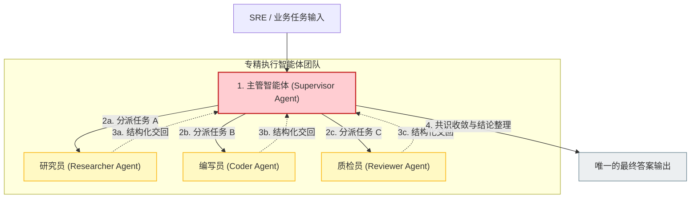
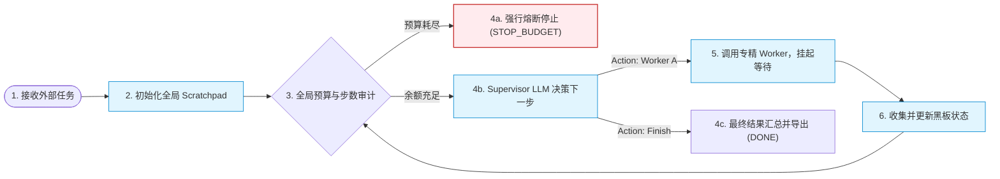
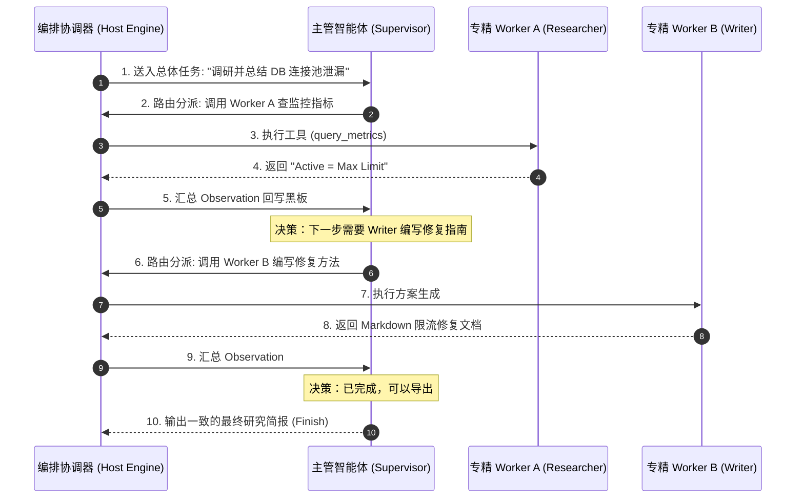

import GlossaryTerm from '@site/src/components/GlossaryTerm';
import GuidedExercise from '@site/src/components/GuidedExercise';
import ResearchNote from '@site/src/components/ResearchNote';
import ChapterMeta from '@site/src/components/ChapterMeta';
import PyRunner from '@site/src/components/PyRunner';
import TradeoffExplorer from '@site/src/components/TradeoffExplorer';
import QuizCard from '@site/src/components/QuizCard';

# M10L3 · Supervisor 编排

<ChapterMeta
  time="约 2.5 小时"
  prereqs={[{label: 'M10L2 角色分工', href: './roles-specialization'}, {label: 'M9L1 agent loop', href: '../agent-architectures/agent-loop-basics'}, {label: 'M5L2 API 网关', href: '../core-components/api-gateway'}]}
  outcome="能用 Supervisor 模式编排多 Agent：主控分配任务给专精 Agent、收集结果、决定下一步和何时结束，并理解它为什么是最可控的协作结构。"
  howToUse="先看“一群 Agent 没人指挥”的乱，再理解 Supervisor 编排，最后做 Supervisor 编排 lab。"
/>

:::tip 有了专精角色，还要有人“指挥”——Supervisor 就是那个总控
[M10L2](./roles-specialization) 你设计好了专精角色（研究员/架构师/审查员）。但谁来指挥它们？谁分配任务、谁收集结果、谁决定下一步、谁拍板结束、谁能停？没有指挥，专精 Agent 就是一盘散沙。**Supervisor（主管）模式**给多 Agent 一个清晰的总控：一个主控 Agent 把任务分派给合适的专精 Agent、收集它们的产出、决定还要做什么、最后汇总出口。这是最常用、最可控的多 Agent 协作结构。
:::

## 一、没人指挥的多 Agent 是一盘散沙

把几个专精 Agent 放在一起，但没有编排，会乱套：
- **没人分配**：谁该先做、谁该做什么，没人决定。
- **没人收集**：各 Agent 的产出散落各处，谁来汇总？
- **没有出口**：谁给最终答案？多个 Agent 各说各话，对外不一致。
- **没人能停**：什么时候算完成？谁来叫停？（[呼应 M9L4 停止条件](../agent-architectures/stopping-budget)）

需要一个“指挥者”来编排整个协作流程。最直接、最可控的方式就是 Supervisor。

## 二、三个核心概念（分层）

### 基础：Supervisor 模式

<GlossaryTerm term="Supervisor Pattern" definition="主管模式：一个主控（supervisor）Agent 负责编排——把任务分配给合适的专精（worker）Agent、收集它们的结果、决定下一步、并作为唯一的最终出口。是最常用、最可控的多 Agent 协作结构。">Supervisor（主管）模式</GlossaryTerm>：一个主控 Agent 负责编排，专精 Agent 是它的“下属”即 <GlossaryTerm term="Worker Agent" definition="执行者/从属智能体：多智能体系统（尤其是主管模式）中专门承担某一项具体子任务的轻量智能体节点，只接受上层 Supervisor 的调配。">Worker Agent</GlossaryTerm>：
1. **分配（delegate）**：Supervisor 看任务，决定派给哪个专精 Agent 做什么（[路由 M10L7](./handoff-routing)）。
2. **收集（collect）**：worker 完成后把结构化结果交回 Supervisor。
3. **决策（decide）**：Supervisor 根据已有结果，决定还要派什么任务、还是可以结束。
4. **出口（finalize）**：Supervisor 是**唯一的最终出口**——汇总各 worker 的产出，给出一致的最终答案。

它本质是把 [单 Agent 的 loop（M9L1）](../agent-architectures/agent-loop-basics) 升级——Supervisor 的“动作”不是调工具，而是“调用某个专精 Agent”。

### 进阶：为什么 Supervisor 最可控

Supervisor 模式之所以是多 Agent 的首选，因为它它集中了控制（[呼应 M5L2 <GlossaryTerm term="API Gateway" definition="API 网关：微服务架构中的单一入口点，用于聚合内部服务接口、实现流量控制、安全审计和协议转换。">API 网关 (API Gateway)</GlossaryTerm> 收口](../core-components/api-gateway)）：
- **单一控制点**：流程由 Supervisor 主导，不是一群 Agent 自由交互——可预测、可追踪。
- **单一出口**：最终答案只由 Supervisor 给，对外一致（不会多个 Agent 各说各话）。
- **集中的停止/预算**：Supervisor 持有[全局停止条件和预算（M9L4/M10L10）](../agent-architectures/stopping-budget)——它决定何时结束，防止协作无限进行。
- **清晰的层级**：worker 不直接互相调用，都通过 Supervisor 协调——降低了 N×N 的混乱通信（[对比 swarm M10L7](./handoff-routing)）。

### 深入（选学）：Supervisor 的取舍与变体

- **Supervisor 可能成瓶颈/单点**（[呼应 M5L2 网关瓶颈](../core-components/api-gateway)）：所有协调都经过它，它的决策质量决定整个系统。如果任务太复杂、Supervisor 的“调度智能”不够，会成为瓶颈。对策：分层 Supervisor（[像组织的多级管理](../system-design-bridge/lld-classes)）、或让部分 worker 在子任务内自治。
- **Supervisor 也是个 Agent，要全套约束**：它有 [agent loop](../agent-architectures/agent-loop-basics) 的所有风险（[会不停、会乱派 M9L4](../agent-architectures/stopping-budget)）——要给它停止条件、预算、轨迹记录、护栏。
- **分配可以是确定的或自主的**：简单场景用**固定流程**（workflow <GlossaryTerm term="Orchestration Topology" definition="编排拓扑：描述多智能体节点间连接和协作流程走向的控制结构。">编排 (Orchestration)</GlossaryTerm>：研究→设计→审查，[呼应 M9L11/M10L1 优先 workflow](./why-multi-agent)）；复杂场景才让 Supervisor **自主决定**派给谁做什么。前者更可控，后者更灵活——按需选。
- **结构化的任务和结果**：Supervisor 派任务、worker 回结果，都要用 <GlossaryTerm term="State Schema" definition="状态约束：描述系统或智能体节点间通信交换的数据契约，使用强 schema（例如 JSONSchema）确保可解析与类型安全。">State Schema</GlossaryTerm>（[M7L6/M10L4](./communication-state)），而非自由文本——保证协作可靠。
- Supervisor 模式对应人类组织里的“项目经理 + 专家团队”——这再次说明设计多 Agent 是在做[组织设计（M10L2/Conway）](./roles-specialization)。理解它，你就掌握了多 Agent 最实用的骨架。

<ResearchNote
  title="Supervisor：集中编排，单一出口，可控可追踪"
  source="多 Agent 编排实践（LangGraph supervisor、AutoGen GroupChat manager 等）；M5L2 网关收口"
  href="https://www.anthropic.com/research/building-effective-agents"
  insight="Supervisor 模式用一个主控 Agent 编排专精 worker：分配-收集-决策-出口。它集中控制、单一出口、集中停止预算、降低 N×N 混乱通信，是最可控的多 Agent 结构。代价是 Supervisor 可能成瓶颈/单点，且它本身是 Agent 需全套约束。分配可固定（workflow）或自主，按复杂度选。"
  application="多 Agent 优先用 Supervisor 编排：主控分配任务给专精 Agent、收集结构化结果、决定下一步、作为唯一出口、持有全局停止预算。简单流程用固定编排（workflow），复杂才让 Supervisor 自主分配。给 Supervisor 配停止/预算/护栏/轨迹。复杂时分层 Supervisor。"
/>

## 三、Supervisor 集中编排图解 (Deep Dive Diagrams)

本节展示集中编排 Supervisor 的星型星状架构、任务路由状态机流程，以及主管智能体调度 Workers 的交互时序。

### 1. 结构全景：Supervisor 集中控制型架构



### 2. 控制流程：Supervisor 任务路由状态机



### 3. 时序全景：Supervisor-Workers 调度与反馈时序



---

## 四、跟我做一遍：Supervisor 编排

<PyRunner
  rows={40}
  expect="主控分配-收集-决策-出口"
  code={`def researcher(task): return "证据:相关资料3条"            # 专精 worker(M10L2 角色)
def architect(task): return "方案:基于证据的架构A"
def reviewer(task): return "风险:方案A有单点"

WORKERS = {"researcher": researcher, "architect": architect, "reviewer": reviewer}

def supervisor(goal, max_rounds=5):
    state = {"goal": goal, "artifacts": {}}        # 收集各 worker 产出
    trace = []
    plan = ["researcher", "architect", "reviewer"]  # Supervisor 的编排(此处固定流程)
    for r in range(min(len(plan), max_rounds)):     # 集中的停止上限
        name = plan[r]                              # 分配:决定派给谁
        result = WORKERS[name](goal)                # 调用专精 Agent
        state["artifacts"][name] = result           # 收集结构化结果
        trace.append(("delegate", name, result))
    final = "最终方案(汇总): " + " | ".join(state["artifacts"].values())  # 唯一出口
    return final, state["artifacts"], trace

final, artifacts, trace = supervisor("设计高可用服务")
for kind, name, res in trace:
    print("  ", kind, name, "->", res)
print("收集到:", list(artifacts.keys()))
print(final)
print("主控分配-收集-决策-出口")`}
/>

Supervisor 依次把任务派给研究员、架构师、审查员，收集各自的结构化产出，最后作为唯一出口汇总——流程集中可控、有停止上限、对外一致。**试试**：把固定 plan 改成"根据审查结果决定要不要再让架构师改一版"（Supervisor 自主决策的雏形）；想想 worker 数量很多时 Supervisor 会不会成瓶颈（分层 Supervisor）。

## 五、动手 Lab（必做）

打开 `labs/month10/m10l3_supervisor/`：

```bash
python labs/month10/m10l3_supervisor/test_supervisor.py
```

实现 Supervisor 编排：按计划分配任务给专精 worker、收集结构化结果、有停止上限、作为唯一出口汇总。

<GuidedExercise
  title="练习指引：实现 Supervisor 编排"
  goal="把“分配-收集-决策-出口”做成代码——多 Agent 最可控的协作骨架。"
  hints={[
    'WORKERS 注册各专精 Agent；supervisor 按 plan 决定调用顺序。',
    '收集每个 worker 的结果到 state["artifacts"]。',
    'max_rounds 是集中的停止上限（防协作无限进行）。',
    'Supervisor 是唯一出口：汇总所有产出给最终答案。'
  ]}
  steps={[
    '实现 supervisor(goal, workers, plan, max_rounds)。',
    '按 plan 依次分配、调用 worker、收集结果、记 trace。',
    '受 max_rounds 限制、最后汇总出口。',
    '写测试：按序调用所有 worker、收集产出、max_rounds 限制、汇总含各产出、唯一出口。'
  ]}
  checks={[
    '你能用 Supervisor 编排专精 Agent。',
    '你的 lab 集中分配-收集-汇总、有停止上限。',
    '你能解释 Supervisor 为什么最可控（单一控制点/出口/停止）。',
    '你能说出它的瓶颈风险和分层 Supervisor 对策。'
  ]}
/>

## 架构师深潜（Staff+ 视角）

### 1. 多 Agent 协作结构

<TradeoffExplorer
  title="多 Agent 协作结构"
  dimensions={['可控/可追踪', '单一一致出口', '灵活性', '通信复杂度低', '无单点瓶颈']}
  options={[
    {
      name: 'Supervisor(主管)',
      scores: [5, 5, 3, 5, 2],
      note: '主控集中编排。最可控、单一出口、通信清晰。但 Supervisor 是瓶颈/单点。',
      whenToUse: '多数多 Agent——首选的可控结构。'
    },
    {
      name: '分层 Supervisor',
      scores: [4, 5, 4, 4, 4],
      note: '多级主管分担编排。缓解单点瓶颈、可扩展。但层级复杂。',
      whenToUse: 'worker 多、任务复杂时。'
    },
    {
      name: '去中心化(swarm/自由交互)',
      scores: [1, 1, 5, 1, 5],
      note: 'Agent 自由交接/互调。最灵活、无单点。但难控难追踪、N×N 通信混乱。',
      whenToUse: '极少数真正需要去中心化时(M10L7)。'
    }
  ]}
/>

### 2. Supervisor = 把"集中编排"的成熟智慧用到 Agent

Supervisor 模式不是 Agent 时代的发明——它就是把贯穿全课的"集中控制点"智慧用到多 Agent：[M5L2 API 网关收口横切](../core-components/api-gateway)、[M5L11 共识选一个 leader](../core-components/consensus-coordination)、[M6L2 K8s control plane 集中调度](../cloud-enterprise-industrial/kubernetes-basics)、人类组织的"项目经理协调专家"——核心都是**用一个集中的协调者，把分散的执行者编排起来，换取可控性和一致性**。它的取舍也一样（集中=可控但有单点瓶颈，去中心化=无瓶颈但难控），对策也类似（分层、子自治）。架构师看到"多个 Agent 怎么协作"，第一反应该是"谁当 Supervisor、怎么编排"——而不是"让它们自由交互"。**先用最可控的集中编排，只在确实需要去中心化灵活性时才放开**——这又是一次"按需选最简够用"的判断。

### 3. 真实案例：Supervisor 是生产多 Agent 的主流选择

实践中，绝大多数能上生产的多 Agent 系统用的是 Supervisor（或其变体分层 Supervisor），而非"一群 Agent 自由聊天"的去中心化结构。原因正是本课讲的：Supervisor 集中控制、单一出口、集中停止预算、通信清晰——这些都是生产系统必需的可控性。去中心化的 swarm（[M10L7](./handoff-routing)）虽然灵活，但难追踪、难停止、成本难控、行为难预测，很难上生产。所以业界的务实路径是：**用 Supervisor（甚至更进一步用确定的 workflow）编排专精 Agent**，把多 Agent 的"自主协作"约束在可控的编排框架内。这再次呼应整个 AI 工程的主线：**自主性带来能力，但可靠性来自约束和集中控制**——多 Agent 也不例外。

### 4. 架构师深问（给自己 30 分钟）

- 你的多 Agent 有明确的 Supervisor（单一控制点和出口）吗？还是一群 Agent 自由交互、各说各话？
- Supervisor 持有全局停止条件和预算吗？整个协作什么时候、由谁叫停？最坏花多少？
- Supervisor 会不会成瓶颈（任务太复杂、worker 太多）？需要分层 Supervisor 或局部 worker 自治吗？

## 知识自测

<QuizCard
  questions={[
    {
      q: '在多 Agent 协作设计中，以下关于 Supervisor (主管) 模式的优势，哪项描述最准确？',
      options: [
        'A. 它让所有的 Worker Agent 能够并行运行，并且完全不需要共享黑板内存',
        'B. 它实现了单一控制点、单一一致出口，并且通过集中管理全局预算和停止条件，极大地提高了多 Agent 系统的可控性与可预测性',
        'C. 它使每一个 Worker Agent 都可以自由跳过权限校验，直接读写物理数据库',
        'D. 它通过在 Worker 之间直接交接控制权，彻底消除了协调器引起的调度延迟'
      ],
      answer: 1,
      explain: '微服务和多 Agent 一样，最怕“群龙无首”导致行为失控。Supervisor 作为统一收口，控制了所有对外产出与内部调度流，能确保系统不陷入死循环，且对外输出的一致性最高。'
    },
    {
      q: '当多 Agent 系统非常庞大、Worker 数量极多且任务过于复杂时，Supervisor 模式面临的最大痛点是什么？如何防范？',
      options: [
        'A. 痛点是 GPU 的显存利用率过低，防范手段是增加并行扇出数',
        'B. 痛点是 Supervisor 节点的 prompt 太短，防范手段是使用 RAG 压缩',
        'C. 痛点是 Supervisor LLM 成为整个系统的调度瓶颈与单点故障；防范手段是采用“分层 Supervisor”进行多级管理，或在子任务中授予 Worker 局部自治权',
        'D. 痛点是 Worker 之间无法直接传输明文 Thought，防范手段是切换为 Swarm 模式'
      ],
      answer: 2,
      explain: '如果所有的微小决策都交由一个 Supervisor 去分配与决策，会使得主控 Agent 的 Context Window 迅速膨胀，且容易因模型注意力焦点模糊做出错误路由。利用组织行为学中的“多级管理”分而治之是解决该瓶颈的成熟实践。'
    },
    {
      q: '在设计 Supervisor 与 Workers 之间的交互接口时，为什么应该优先采用结构化 schema (如 JSONSchema) 交互，而非自由文本对话？',
      options: [
        'A. 因为自由文本无法在 Markdown 预览中正确加粗显示',
        'B. 因为自由文本会导致 Worker 无法被 Python 的 PyRunner 载入运行',
        'C. 结构化契约可以精确约束任务的入参和出参，防止 Worker Agent 的闲聊文本造成 Supervisor 的上下文状态污染与逻辑误判',
        'D. 结构化交互是为了降低大模型的采样温度 (Temperature)'
      ],
      answer: 2,
      explain: '“好契约造就好的协作”。多 Agent 实质上是分布式的 RPC 调用。如果 Worker 随意返回一长段 Thought 混杂 Observation 的文本，主控 LLM 的解析代价会呈指数级上升，且极易诱发逻辑幻觉。'
    }
  ]}
/>

## 自检清单

- [ ] 我能用 Supervisor 编排专精 Agent（分配-收集-决策-出口）。
- [ ] 我的 lab 集中分配收集汇总、有停止上限、单一出口。
- [ ] 我理解 Supervisor 最可控、但有单点瓶颈风险。
- [ ] 我能把它和网关/control plane/组织协调的集中智慧联系起来。

## 常见误解

- **"多 Agent 就是让它们自由聊天"**：那难控难追踪；优先用 Supervisor 集中编排。
- **"Supervisor 只是个转发器"**：它分配、决策、汇总、持有停止预算，是控制核心。
- **"Supervisor 没有风险"**：它是单点瓶颈、本身也是 Agent，要约束、必要时分层。

## 延伸阅读

- [Anthropic: Building effective agents](https://www.anthropic.com/research/building-effective-agents)
- [M5L2 API 网关（集中收口）](../core-components/api-gateway)
- [下一课：通信与共享状态](./communication-state)