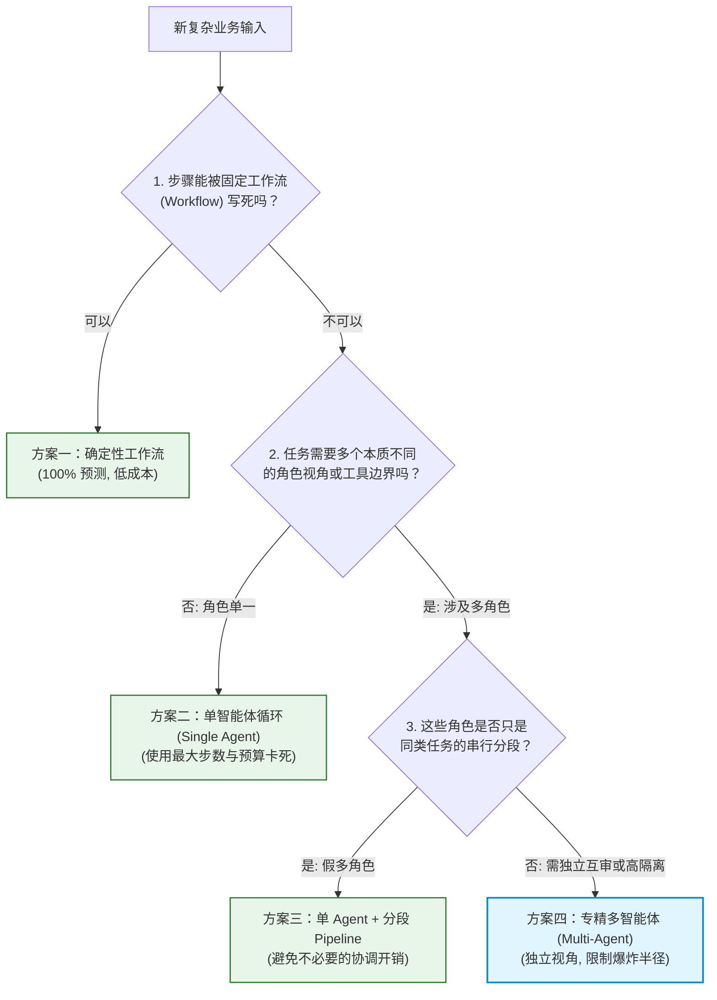
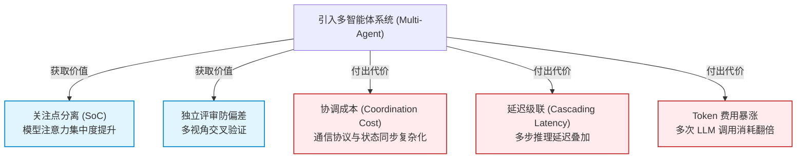

import GlossaryTerm from '@site/src/components/GlossaryTerm';
import GuidedExercise from '@site/src/components/GuidedExercise';
import ResearchNote from '@site/src/components/ResearchNote';
import ChapterMeta from '@site/src/components/ChapterMeta';
import PyRunner from '@site/src/components/PyRunner';
import TradeoffExplorer from '@site/src/components/TradeoffExplorer';
import QuizCard from '@site/src/components/QuizCard';

# M10L1 · 何时用多 Agent

<ChapterMeta
  time="约 2 小时"
  prereqs={[{label: 'M9L11 何时不该用 Agent', href: '../agent-architectures/when-not-agent'}, {label: 'M9L1 单 Agent', href: '../agent-architectures/agent-loop-basics'}, {label: 'M4L1 YAGNI', href: '../design-patterns-lld/change-driven-design'}]}
  outcome="能判断一个任务该用单 Agent、workflow 还是多 Agent，理解多 Agent 的价值（专精分工/互审）和代价（协调/成本/混乱翻倍），并默认选最简方案。"
  howToUse="先看“为多 Agent 而多 Agent”的代价，再学判断标准，最后做单/多 Agent 决策 lab。"
/>

:::tip 这个月也以一个克制的判断开场：大多数时候，别上多 Agent
[M9L11](../agent-architectures/when-not-agent) 教过"能用 workflow 就别用 Agent"。多 Agent 是这个克制原则的**升级版考验**：它更酷、更容易被"显得高级"诱惑地滥用，而代价更大——协调成本、通信混乱、成本爆炸、错误传播全部翻倍。所以多 Agent 的第一课，依然是判断：**这个任务真的需要多个 Agent 协作吗？还是一个 Agent（甚至一个 workflow）就够了？**
:::

## 一、"为多 Agent 而多 Agent"的代价

把本可以单 Agent 或 workflow 解决的任务做成多 Agent，代价很大：
- **协调开销**：要设计谁分配、谁汇总、谁拍板、谁能停——这套编排本身就很复杂（[M10L3](./supervisor-orchestration)）。
- **通信混乱**：Agent 之间传信息、共享状态，容易[污染、丢失、误解（M10L4）](./communication-state)。
- **成本爆炸**：N 个 Agent × 每个多步 × 互相来回 = token 成本可能是单 Agent 的几十倍（[M10L10](./multi-agent-ops)）。
- **错误传播**：一个 Agent 的错误结论可能被其它 Agent 当真、层层放大。
- **更难追踪/评测/停止**：[单 Agent 已经难评测（M9L10）](../agent-architectures/agent-evaluation)，多 Agent 的轨迹是多条交织的，难上加难。

如果任务的角色其实是**单一的、或步骤可由一个 Agent 顺序完成**，上多 Agent 就是用一个极其复杂、昂贵、难控的方案，去做一个本该简单的事——典型的过度工程（[YAGNI](../design-patterns-lld/change-driven-design)）。

## 二、三个核心概念（分层）

### 基础：多 Agent 的价值在哪

<GlossaryTerm term="Multi-Agent System" definition="多智能体系统：由多个有不同角色、工具或目标的 Agent 协作完成任务的系统。优势是专业化和关注点分离，代价是协调成本、通信复杂、成本上升、错误传播。">多 Agent 系统</GlossaryTerm> 真正创造价值的来源有三个：
- **专业化分工**：每个 Agent 专注一个角色（研究/写作/审查/编码），各有[专门的工具和权限（M10L2）](./roles-specialization)——比一个"什么都干"的全能 Agent 更专精、更可控。
- **关注点分离**：把复杂任务按角色拆开（[呼应 M4 SRP](../design-patterns-lld/solid-srp-ocp)），每个角色的 prompt、工具、逻辑更聚焦、更易维护。
- **互相审查**：一个 Agent 提方案、另一个挑毛病（[辩论/评审 M10L6](./debate-review)）——独立的视角能抓出单 Agent 自己发现不了的错误。

### 进阶：判断标准——任务有没有"天然的多角色/边界"

核心判断：**这个任务是否天然包含多个不同的角色、工具边界、知识域，或需要独立审查？**
- **有** → <GlossaryTerm term="Multi-Agent System" definition="多智能体系统：由多个具备专精角色、专属工具并遵循统一协作协议的智能体构成的分布式系统。">多 Agent</GlossaryTerm> 可能值（如"调研 + 设计 + 评审"这种角色明显不同、且需要独立视角审查的任务）。
- **没有**（角色单一、步骤可顺序完成）→ 用[单 Agent（M9）](../agent-architectures/overview) 或 [workflow（M9L11）](../agent-architectures/when-not-agent)。
- **关键陷阱**：很多"多 Agent"其实是把一个 Agent 的不同步骤硬拆成多个 Agent——这不是真正的角色分工，只是徒增<GlossaryTerm term="Coordination Cost" definition="协调成本：多智能体系统为维持同步、编排跳转和传递状态所付出的额外延迟与 Token 开销。">协调成本</GlossaryTerm>。真正的多 Agent，每个角色要**本质不同**（不同视角/不同工具/需要独立判断），否则容易在 <GlossaryTerm term="Shared Context" definition="共享上下文：在多智能体协同中，多个智能体能够共同访问和修改的上下文缓存。如果管理不当，容易造成 Context 状态污染和注意力稀释。">共享上下文 (Shared Context)</GlossaryTerm> 中引入严重噪音。

### 深入（选学）：方案谱系与务实选择

- **谱系（从简到繁）**（[延续 M9L11](../agent-architectures/when-not-agent)）：普通代码 → 单次调用 → workflow → 单 Agent → 多 Agent。**每往后一步，能力增、但复杂度/成本/不确定性也增。能用前面的就别用后面的。**
- **多 Agent 真正的甜区**：任务需要**多个本质不同的专精视角协作 + 互相审查**，且单 Agent 因为"既要又要"而表现不好（一个 Agent 同时当研究员和批评家，容易产生 <GlossaryTerm term="Self-evaluation bias" definition="自评偏差：单智能体由于认知局限，倾向于合理化自身的逻辑错误而无法客观评估自身输出。">自评偏差</GlossaryTerm>）。这时分工 + 独立审查的价值才盖过协调成本。
- **务实架构常是混合**：**workflow 主干编排几个专精 Agent**，它们之间基于标准进行 <GlossaryTerm term="A2A Communication" definition="Agent-to-Agent 通信：智能体之间进行数据交换、状态共享和控制权交接的规范化网络通信过程。">A2A 通信 (Agent-to-Agent)</GlossaryTerm>——而非"一群 Agent 自由聊天"。即用确定的编排控制流程，只在需要专精/审查的环节用 Agent。这往往比"全自主多 Agent"更可靠。
- **"互相审查"是多 Agent 最独特的价值**：单 Agent 的[自我反思（M9L7）](../agent-architectures/reflection-correction) 有自评偏差，而一个**独立的** Agent 来审查，视角真正不同、更能抓错。如果你的任务最需要的是"质量把关/找反例"，多 Agent 的审查模式（[M10L6](./debate-review)）可能是它唯一不可替代的理由。
- **这是贯穿全课克制原则的顶点**：[M4 别过度设计](../design-patterns-lld/change-driven-design) → [M6L9 别盲目多云](../cloud-enterprise-industrial/multi-cloud) → [M8L10 别上来就高级 RAG](../rag/advanced-rag) → [M9L11 别滥用 Agent](../agent-architectures/when-not-agent) → 别滥用多 Agent。多 Agent 最酷、最易被滥用，是这条克制纪律的终极考验。

<ResearchNote
  title="多 Agent：为真正需要协作/审查的任务保留，不是默认"
  source="Anthropic Building effective agents；AutoGen（Wu et al., 2023）；多 Agent 工程实践"
  href="https://www.anthropic.com/research/building-effective-agents"
  insight="多 Agent 的价值在专业化分工、关注点分离、互相审查；代价是协调、通信、成本、错误传播全面上升。只有任务天然有多个本质不同的角色/边界、或需要独立审查时才值得。多数任务用单 Agent 或 workflow 更可靠便宜。务实架构常是 workflow 编排几个专精 Agent，而非一群 Agent 自由聊天。"
  application="决策：能用代码/单次/workflow/单 Agent 的就别上多 Agent。判断标准——任务是否有天然的多角色/多边界/需独立审查。真要用，优先 workflow 主干 + 局部专精 Agent，明确角色边界。多 Agent 最独特的价值是独立审查（抓单 Agent 的自评盲点）。"
/>

## 三、多智能体决策与选型图解 (Deep Dive Diagrams)

本节展示单人多角色与多智能体分工对比、多 Agent 方案选型决策漏斗，以及引入多 Agent 后的额外协调成本开销分析。

### 1. 结构全景：单 Agent 模拟多角色 vs. 多 Agent 专精分工

```mermaid
graph TD
    classDef brain fill:#ffcdd2,stroke:#c62828,stroke-width:2px;
    classDef roles fill:#fff9c4,stroke:#fbc02d,stroke-width:1.5px;
    classDef bad fill:#ffebee,stroke:#c62828,stroke-width:1px;
    classDef good fill:#e8f5e9,stroke:#2e7d32,stroke-width:1.5px;

    subgraph SingleAgentMode [单 Agent 模拟多角色 (过度负荷)]
        AgentA["单能智能体 (All-in-One Agent)"]:::brain
        AgentA --> Role1["角色一: 研究员 (Research)"]:::roles
        AgentA --> Role2["角色二: 批评家 (Critic)"]:::roles
        AgentA --> Role3["角色三: 格式器 (Formatter)"]:::roles
        Note over AgentA: 既写又审，容易发生自我确认偏差 (Blind Spot)<br/>且工具绑定过多，上下文极易污染
    end

    subgraph MultiAgentMode [多 Agent 专精分工 (关注点分离)]
        Orchestrator["编排协调器 (Host / Workflow)"]:::good
        Orchestrator --> AgentResearch["1. 研究员智能体"]:::roles
        Orchestrator --> AgentCritic["2. 评审员智能体"]:::roles
        Orchestrator --> AgentFormat["3. 排版格式智能体"]:::roles
        
        AgentResearch -.->|共享黑板状态| AgentCritic
        AgentCritic -.->|反馈独立挑错| AgentResearch
        Note over AgentCritic: 独立视角，完美破除单 Agent 的自评盲区
    end
```

### 2. 选型漏斗：多 Agent 方案选型决策流



### 3. 折中谱系：协调成本与系统开销的级联折中



---

## 四、跟我做一遍：单/多 Agent 决策

<PyRunner
  rows={36}
  expect="按任务性质选最简方案"
  code={`def choose(task):
    if not task["needs_llm"]:
        return "普通代码/workflow"
    if task["single_role"] and task["steps_predictable"]:
        return "workflow 或 单次调用"               # 单一角色、步骤可定
    if task["single_role"]:
        return "单 Agent"                          # 单一角色但需自主多步
    # 多角色：还要看是否真的本质不同 + 需独立审查
    if task["distinct_roles"] and (task["needs_review"] or task["distinct_tools"]):
        return "多 Agent"                          # 角色本质不同/需独立审查
    return "单 Agent (角色没本质区别,别硬拆)"

tasks = [
    {"name": "翻译一段话", "needs_llm": True, "single_role": True, "steps_predictable": True, "distinct_roles": False, "needs_review": False, "distinct_tools": False},
    {"name": "自主排查故障", "needs_llm": True, "single_role": True, "steps_predictable": False, "distinct_roles": False, "needs_review": False, "distinct_tools": False},
    {"name": "调研+设计+独立评审方案", "needs_llm": True, "single_role": False, "steps_predictable": False, "distinct_roles": True, "needs_review": True, "distinct_tools": True},
    {"name": "把长文分三段分别总结(同一角色)", "needs_llm": True, "single_role": False, "steps_predictable": True, "distinct_roles": False, "needs_review": False, "distinct_tools": False},
]
for t in tasks:
    print("%-26s -> %s" % (t["name"][:26], choose(t)))
print("按任务性质选最简方案")`}
/>

只有"角色本质不同 + 需独立审查/不同工具"的任务（调研+设计+评审）才选多 Agent；单一角色的、或只是把同一角色的工作分段的，都用更简单的方案。**试试**：加一个"代码生成 + 独立的安全审查"任务（角色不同 + 需审查 → 多 Agent）；想想"把长文分段总结"为什么不该硬拆成多 Agent（角色没本质区别）。

## 五、动手 Lab（必做）

打开 `labs/month10/m10l1_choose/`：

```bash
python labs/month10/m10l1_choose/test_choose.py
```

实现单/多 Agent 决策：按是否需 LLM、单/多角色、步骤可定、是否需独立审查/不同工具，选最简够用的方案。

<GuidedExercise
  title="练习指引：实现单/多 Agent 决策"
  goal="把“按任务性质选最简方案”做成决策逻辑——抵制滥用多 Agent 的判断力。"
  hints={[
    '不需 LLM -> 代码/workflow。',
    '单一角色 + 步骤可定 -> workflow/单次；单一角色但需自主 -> 单 Agent。',
    '多角色但角色没本质区别(只是分段) -> 单 Agent，别硬拆。',
    '只有角色本质不同 + 需独立审查/不同工具 -> 多 Agent。'
  ]}
  steps={[
    '实现 choose(task) 按各属性判断。',
    '覆盖 代码/workflow、单 Agent、多 Agent 几类。',
    '正确处理"假多角色"(分段同角色)不选多 Agent。',
    '写测试：翻译->workflow、排查->单Agent、调研+评审->多Agent、分段总结->单Agent。'
  ]}
  checks={[
    '你能判断任务有没有"天然的多角色/需审查"。',
    '你的 lab 默认选最简方案、不滥用多 Agent。',
    '你能说出多 Agent 的价值(专精/审查)和代价(协调/成本/混乱)。',
    '你理解"假多角色"(分段)不该做成多 Agent。'
  ]}
/>

## 架构师深潜（Staff+ 视角）

### 1. 方案谱系（含多 Agent）

<TradeoffExplorer
  title="任务实现方案（从简到繁）"
  dimensions={['处理复杂/多角色', '可控/可靠', '成本低', '可评测', '实现简单']}
  options={[
    {
      name: 'workflow / 单 Agent',
      scores: [3, 4, 4, 4, 4],
      note: '单一角色的任务。可控、便宜、好测。但难处理"需多个独立视角"的任务。',
      whenToUse: '绝大多数任务——优先。'
    },
    {
      name: 'workflow 编排几个专精 Agent',
      scores: [4, 3, 2, 3, 2],
      note: '确定编排 + 局部专精 Agent。兼顾分工和可控。比全自主多 Agent 稳。',
      whenToUse: '需专精分工但要可控时——务实选择。'
    },
    {
      name: '全自主多 Agent',
      scores: [5, 1, 1, 1, 1],
      note: '多 Agent 自由协作。最灵活，能处理开放协作任务。但协调/成本/混乱/评测全爆炸。',
      whenToUse: '极少数真正需要开放式多角色协作时。'
    }
  ]}
/>

### 2. "克制"是 AI 架构师最稀缺、最值钱的能力

走到这里，你应该看清了贯穿整个课程的一条暗线：**架构师最核心的能力之一，是按真实需求选最简单够用的方案，抵制"更高级=更好"的诱惑。** 这条纪律一路升级：[别过度抽象（M4）](../design-patterns-lld/change-driven-design)、[别盲目分布式/多云（M5/M6L9）](../cloud-enterprise-industrial/multi-cloud)、[别上来就高级 RAG（M8L10）](../rag/advanced-rag)、[别滥用 Agent（M9L11）](../agent-architectures/when-not-agent)、现在是别滥用多 Agent。多 Agent 是这条纪律的**顶点考验**——因为它最酷、最有"AI 含量"、最容易让人为了"显得先进"而上。真正成熟的 AI 架构师，面对"做个多 Agent 系统"的需求，第一反应不是兴奋地设计一堆 Agent，而是冷静地问：**这真的需要多个独立角色协作吗？单 Agent 不行吗？workflow 不行吗？** 能用简单方案解决复杂需求，是顶级水平的标志，不是不够"先进"。

### 3. 真实案例：多 Agent 热潮与回归现实

多 Agent 框架曾掀起热潮，很多团队搭了"一群 Agent 互相聊天"的系统，demo 很惊艳。但真上生产，普遍遇到：成本高得离谱（Agent 之间反复来回烧 token）、不可控（一群自主 Agent 的行为难预测）、难调试（错误在多个 Agent 间传播、轨迹交织）、质量不稳定。冷静后，许多团队回归到**确定的 workflow 编排 + 在真正需要的环节用专精 Agent**——保留了分工和审查的价值，去掉了"自由聊天"的混乱。业界共识逐渐清晰：**多 Agent 不是 AI 系统的进化终点，而是特定协作任务的工具**。判断"该不该多 Agent、该用哪种协作模式"，比"会搭多 Agent"重要得多——这正是本月以"何时用"开场、以"评测/克制"收尾的用意。

### 4. 架构师深问（给自己 30 分钟）

- 你想做/见过的"多 Agent"，角色是本质不同（不同视角/工具/需独立判断），还是只是把一个 Agent 的步骤拆开了？
- 单 Agent + workflow 能不能解决你的任务？多 Agent 多出来的价值（专精/独立审查）值它翻倍的成本和复杂度吗？
- 如果真要多 Agent，能不能做成"workflow 主干 + 局部专精 Agent"，而非一群 Agent 自由聊天？

## 知识自测

<QuizCard
  questions={[
    {
      q: '在多智能体系统设计中，“假多角色 (Pseudo-roles)”指的是什么？其主要弊端是什么？',
      options: [
        'A. 指不使用角色 Prompt 设定的 Agent，主要弊端是大模型无法理解自身的任务边界',
        'B. 指把本该由一个 Agent 顺序完成的同质化步骤硬拆为多个 Agent，主要弊端是引入了无意义的跨节点通信协议，徒增了协调成本与 Token 费用',
        'C. 指在同一个系统里混用开源与闭源模型，主要弊端是系统调试不方便',
        'D. 指不提供外部工具绑定的智能体，主要弊端是无法执行任何副作用动作'
      ],
      answer: 1,
      explain: '依据 YAGNI 与奥卡姆剃刀原则，不要为没有本质区别的角色（例如：分段摘要、串行改写）创建独立的 Agent，这只会让系统控制流和状态同步变得极度复杂。单 Agent 加上固定工作流才是其最佳解。'
    },
    {
      q: '为什么多智能体系统中的“独立审查 (Independent Review)”不能被单 Agent 的“自我反思 (Self-reflection)”完全替代？',
      options: [
        'A. 因为单 Agent 无法同时装配两个不同的工具接口',
        'B. 自我反思在大模型多步执行后会被上下文窗口自动截断',
        'C. 模型存在天然的“自评偏差 (Self-evaluation bias)”，倾向于包庇并合理化自己第一步的错误；而独立的审查 Agent 视角不同、上下文干净，更能客观指出逻辑缺陷',
        'D. 独立审查 Agent 使用了更高的 Sampling Temperature，因此生成的答案随机性更强'
      ],
      answer: 2,
      explain: '单智能体自己审自己（Thought -> Action -> Self-Correct）就像程序员自己找自己的 Bug，很容易陷入思维定势。把 Proposer 和 Critic 分离为两个拥有不同 Prompt 和上下文的智能体，是克服大模型确认偏差、抓出隐蔽错误的金科玉律。'
    },
    {
      q: '面对多智能体系统的“协调成本 (Coordination Cost)”，架构师最务实的系统编排建议是什么？',
      options: [
        'A. 允许所有 Agent 之间以自由文本聊天（Chat History）的形式网状自由协作',
        'B. 彻底废除多 Agent 架构，退回纯传统硬编码系统',
        'C. 采用“确定性工作流 (Workflow) 主干编排 + 局部专精 Agent”的混合架构，用程序代码控制 Agent 间的控制流和结构化状态传递，拒绝自由散乱的 A2A 闲聊',
        'D. 将所有 Agent 的 Temperature 都调到最高，以加速网络状态同步'
      ],
      answer: 2,
      explain: '全自主、无中心的 Agent 自由对话虽然 Demo 炫酷，但在生产中是不可控且极昂贵的。最务实的落地方案是主干业务采用硬编码的代码流程，仅在确实需要多视角独立审查、专精工具隔离等特定卡点引入局部 Agent。'
    }
  ]}
/>

## 自检清单

- [ ] 我能判断任务有没有"天然的多角色/需独立审查"。
- [ ] 我的 lab 默认选最简方案、不滥用多 Agent。
- [ ] 我能说出多 Agent 的价值（专精/分离/审查）和代价（协调/成本/混乱/错误传播）。
- [ ] 我理解"克制选最简方案"是 AI 架构师的核心能力。

## 常见误解

- **"多 Agent 比单 Agent 高级所以更好"**：它复杂、贵、难控；多数任务单 Agent/workflow 更合适。
- **"把任务拆给多个 Agent 就是多 Agent"**：角色没本质区别的拆分只是徒增协调成本。
- **"多 Agent 是 AI 的进化方向"**：它是特定协作任务的工具，不是默认形态。

## 延伸阅读

- [Anthropic: Building effective agents](https://www.anthropic.com/research/building-effective-agents)
- [AutoGen (2023)](https://arxiv.org/abs/2308.08155)
- [下一课：角色与专业分工](./roles-specialization)
