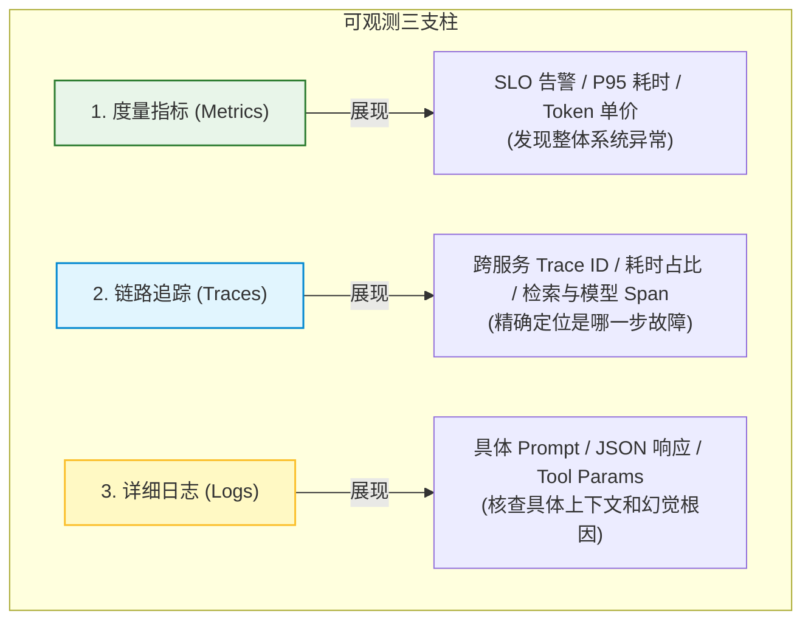
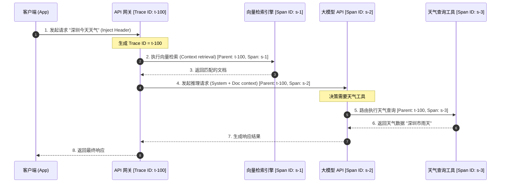
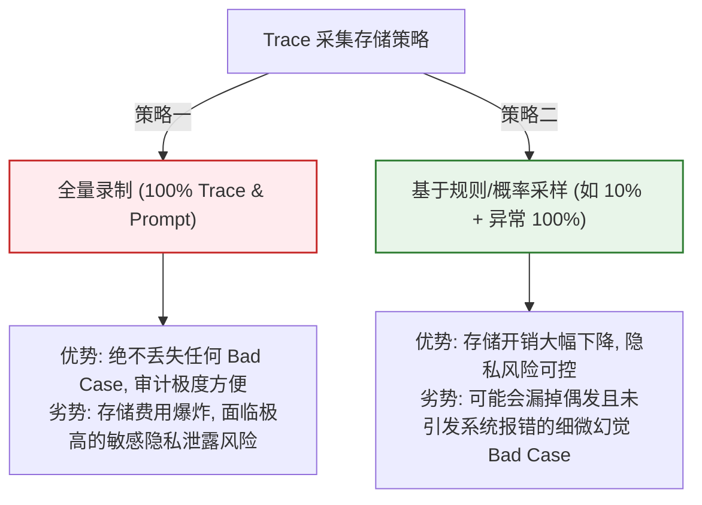

import GlossaryTerm from '@site/src/components/GlossaryTerm';
import GuidedExercise from '@site/src/components/GuidedExercise';
import ResearchNote from '@site/src/components/ResearchNote';
import ChapterMeta from '@site/src/components/ChapterMeta';
import PyRunner from '@site/src/components/PyRunner';
import TradeoffExplorer from '@site/src/components/TradeoffExplorer';
import QuizCard from '@site/src/components/QuizCard';
import StepFlow from '@site/src/components/StepFlow';

# M11L4 · AI 可观测性

<ChapterMeta
  time="约 2 小时"
  prereqs={[{label: 'M6L7 可观测进阶', href: '../cloud-enterprise-industrial/observability-advanced'}, {label: 'M10L10 多 Agent 运维', href: '../multi-agent-protocols/multi-agent-ops'}, {label: 'M1L11 可观测', href: '../foundations/observability'}]}
  outcome="能为 LLM/RAG/Agent 系统做可观测：用 trace 串起一次请求的每一步（检索/调用/工具），采集质量+成本+延迟+token 指标，出问题能定位归因。理解它就是分布式追踪用在 AI 上。"
  howToUse="先看“黑盒出问题不知哪坏的”，再学 AI 可观测三支柱，最后做 LLM trace lab。"
/>

:::tip AI 系统是个黑盒，可观测就是给它装上仪表盘
一次 RAG/Agent 请求内部发生了很多事：检索了哪些文档、拼了什么 prompt、调了几次模型、每次花多少 token、用了哪些工具、每步耗时多少。出了问题——答错了、变慢了、账单飙了——你能不能一眼看出是**哪一步**坏的？没有可观测，AI 就是个黑盒，你只能瞎猜。AI 可观测把每一步的**质量、成本、延迟、token**都记录并串起来。好消息：这就是你在 [M6L7 学过的分布式追踪](../cloud-enterprise-industrial/observability-advanced)，用在 AI 组件上——老办法，新对象。
:::

## 一、黑盒：答错了、变慢了、变贵了，不知道为什么

AI 系统的内部对运维者往往是不透明的：
- **质量问题定位难**：RAG 答错了——是检索没找到对的文档，还是找到了但生成没用好（[呼应 M8L9 先分清检索还是生成失败](../rag/rag-evaluation)）？不追踪就分不清。
- **成本不透明**：这个月 LLM 账单翻倍——是哪个功能、哪种请求、哪一步在烧 token？没有成本可观测就说不清（[承接 M10L10 成本归因](../multi-agent-protocols/multi-agent-ops)）。
- **延迟不透明**：变慢了——是检索慢、模型慢、还是[排队/工具调用](../llm-systems/kv-cache-serving) 慢？没有分步延迟就无从优化。

AI 可观测就是消除这些黑盒——**让一次请求的内部全过程可见、可归因**。

## 二、三个核心概念（分层）

### 基础：LLM 追踪——串起一次请求的每一步

<GlossaryTerm term="LLM Tracing" definition="LLM 追踪：用统一的 trace id 记录并串起一次 AI 请求内部的每一步（检索、prompt 构造、每次模型调用、工具执行），含输入输出、耗时、token、成本，形成可视链路，便于定位是哪一步出了问题。是分布式追踪在 AI 组件上的应用。">LLM 追踪（tracing）</GlossaryTerm>：用一个 trace id 把一次请求内部的每一步——检索、prompt 构造、每次模型调用、工具执行——都记录并串起来，每步含输入输出、耗时、token、成本。出问题时能看到完整链路、定位到具体哪一步。这**就是** [M6L7 分布式追踪（Dapper）](../cloud-enterprise-industrial/observability-advanced)、[M10L10 多 Agent 追踪](../multi-agent-protocols/multi-agent-ops) 用在 AI 请求上——每个检索/调用/工具就是一个 span。**AI 可观测的第一步，就是让黑盒变成可追踪的链路**。

### 进阶：AI 特有的指标维度

传统可观测看 [RED/USE（延迟/错误/流量/资源，M6L7）](../cloud-enterprise-industrial/observability-advanced)，AI 要**额外**加几个维度：
- **token 与成本**：每次调用的 input/output token、单价、累计成本——[成本是 AI 的一等指标（M11L9）](./cost-engineering)。
- **质量指标**：忠实度、相关性、弃答率、[评委打分（在线评估，M11L3）](./online-eval-feedback)——传统系统没有"答得对不对"这一维。
- **AI 特有延迟**：<GlossaryTerm term="TTFT / TPOT" definition="TTFT（Time To First Token，首 token 延迟）和 TPOT（Time Per Output Token，每输出 token 耗时）是 LLM 特有的延迟指标。流式输出下用户体感取决于 TTFT 和生成速度，而非只看总耗时。">TTFT（首 token 延迟）/ TPOT（每 token 耗时）</GlossaryTerm>——[流式输出下用户体感由它们决定（M7L5）](../llm-systems/llm-api-cost-latency)，不能只看总耗时。

### 深入（选学）：把可观测变成能回答问题的系统

- **三支柱在 AI 的对应**：<GlossaryTerm term="Traces / Metrics / Logs" definition="可观测三支柱：Traces（追踪，一次请求的完整调用链）、Metrics（指标，可聚合的时间序列如 P95 延迟/成本/质量分）、Logs（日志，具体事件的详细记录如某次调用的完整 prompt 和输出）。三者互补：指标发现异常、追踪定位到步、日志看清细节。">Traces / Metrics / Logs</GlossaryTerm> 一个不少——Metrics 发现"整体质量降了/成本涨了"、Traces 定位"是哪类请求哪一步"、Logs 看清"那一步具体的 prompt 和输出"。三者配合才能从"发现异常"一路查到"根因"。
- **可观测服务于两件事：调试与评估**。调试是"出问题查根因"，评估是"[持续量化质量（M11L3）](./online-eval-feedback)"——AI 可观测同时喂这两个：trace 里记录的输入输出正是[评估集和 bad case 回流](./evaluation-systems) 的来源。**可观测和评估是一体两面**：没有可观测，在线评估无米下锅。
- **关联 ID 贯穿全链**：一次用户请求可能穿过网关→检索→多次模型调用→工具→其他服务，要用统一 trace id 关联（[M6L7、M10L10 同款要求](../multi-agent-protocols/multi-agent-ops)），否则各段日志对不上、查一个问题要拼图。
- **采样与成本、隐私**：全量记录每个 prompt/输出成本高、且含[用户敏感数据（M11L6/L7）](./platform-guardrails)——要采样、要脱敏、要设保留期，平衡可观测性与成本/合规。
- **平台化**：AI 可观测（统一 trace 格式、成本/质量看板、告警）是 [AI 平台（M11L1）](./why-ai-platform) 的核心共享能力——每个 AI 应用都需要，统一建设才能跨应用看总账、统一告警口径。

<ResearchNote
  title="AI 可观测：分布式追踪 + AI 特有指标（token/成本/质量/TTFT），喂调试与评估"
  source="Dapper (Google)；OpenTelemetry；LLM 可观测实践（LangSmith 等）；M6L7 可观测"
  href="https://research.google/pubs/pub36356/"
  insight="LLM/RAG/Agent 请求内部多步(检索/调用/工具)是黑盒,质量/成本/延迟问题难定位。AI 可观测=分布式追踪(trace id 串每步 span)+AI 特有指标(token/成本、忠实度/弃答等质量、TTFT/TPOT)。三支柱:Metrics 发现异常、Traces 定位到步、Logs 看细节。它同时服务调试(查根因)和评估(量化质量),与在线评估一体两面(trace 输入输出即评估/回流来源)。需统一 trace id 关联、采样脱敏顾成本合规。是 AI 平台核心共享能力。"
  application="给 AI 系统装 trace:每个检索/调用/工具一个 span,记 token/成本/延迟/质量。加 AI 指标维度(成本、质量分、TTFT)。用 Metrics->Traces->Logs 从异常查到根因。trace 数据回流评估集。统一 trace id 贯穿全链,采样脱敏。平台统一 AI 可观测口径与看板。"
/>

## 三、AI 可观测性图解 (Deep Dive Diagrams)

本节展示 AI 可观测三支柱的职责划分、Trace ID 跨服务传递控制流，以及可观测指标采样率与开销的折中选型。

### 1. 结构全景：AI 可观测性三支柱模型 (Metrics -> Traces -> Logs)



### 2. 控制流程：分布式 Trace ID 的级联传播与调用链



### 3. 折中谱系：数据采集与采样率策略折中



### 4. 步骤流演示：根因排查轨迹

<StepFlow
  steps={[
    {
      title: 'Metrics 报警',
      desc: 'SLO 监控检测到 P95 延迟超过 3s 或 Token 成本突增，触发通知。'
    },
    {
      title: 'Traces 下钻',
      desc: '根据时间戳定位到受影响的调用链路，下钻到具体 Trace，发现 `llm_call` span 占比达 90%。'
    },
    {
      title: 'Logs 定位',
      desc: '关联查看该 span 的 input prompt。发现 context 包含了超长重复文档，导致 KV 缓存失效与推理极慢。'
    },
    {
      title: '回流防御',
      desc: '将导致超长的异常文档录入评估集，作为 Gold Set 的边界案例进行回归保护。'
    }
  ]}
/>

---

## 四、跟我做一遍：给一次 RAG 请求装 trace

<PyRunner
  rows={48}
  expect="每步可见:定位慢/贵/错在哪一步"
  code={`import time

class Trace:
    def __init__(self, trace_id):
        self.trace_id = trace_id
        self.spans = []
    def span(self, name, tokens=0, cost=0.0, ms=0, ok=True, note=""):
        self.spans.append({"step": name, "tokens": tokens, "cost": cost,
                           "ms": ms, "ok": ok, "note": note})
    def summary(self):   # Metrics:可聚合
        return {"total_tokens": sum(s["tokens"] for s in self.spans),
                "total_cost": round(sum(s["cost"] for s in self.spans), 4),
                "total_ms": sum(s["ms"] for s in self.spans),
                "steps": len(self.spans)}
    def slowest(self):   # 定位延迟瓶颈
        return max(self.spans, key=lambda s: s["ms"])["step"]

def rag_request(query, tr):
    # 每一步都是一个 span:检索 / 构造 / 模型调用 / 生成
    tr.span("retrieve", tokens=0, cost=0.0, ms=40, note="命中3篇")
    tr.span("build_prompt", tokens=800, cost=0.0, ms=5)
    tr.span("llm_call", tokens=200, cost=0.006, ms=350, note="TTFT=120ms")  # 最慢最贵
    answer = "基于检索的答案"
    tr.span("postprocess", ms=8)
    return answer

tr = Trace("req-001")
ans = rag_request("退货政策", tr)
for s in tr.spans:
    print(f"[{s['step']:<14}] {s['ms']:>4}ms  {s['tokens']:>4}tok  \${s['cost']}  {s['note']}")
print("汇总:", tr.summary())
print("延迟瓶颈在:", tr.slowest())     # -> llm_call,优化就该从这下手
print("每步可见:定位慢/贵/错在哪一步")`}
/>

一次 RAG 请求被拆成检索/构造/模型调用/后处理四个 span，每步的 token、成本、延迟都可见——一眼看出瓶颈在 `llm_call`（最慢最贵），优化就有的放矢。这就是把黑盒变成可归因链路。**试试**：给某个 span 标 `ok=False` 模拟某步失败，想想 Metrics（总量异常）→ Traces（定位到步）→ Logs（看那步细节）的排查路径；想想这些 trace 数据怎么同时喂给[在线评估](./online-eval-feedback)。

## 五、动手 Lab（必做）

打开 `labs/month11/m11l4_observability/`：

```bash
python labs/month11/m11l4_observability/test_observability.py
```

实现 AI 可观测：trace 记录每步的 token/成本/延迟/成败、可聚合指标、定位瓶颈与失败步。

<GuidedExercise
  title="练习指引：给 AI 请求装可观测"
  goal="把一次 AI 请求变成可追踪、可归因的链路——质量/成本/延迟每步可见。"
  hints={[
    'Trace: span(name, tokens, cost, ms, ok) 记录每一步。',
    'summary: 聚合总 token/成本/延迟(Metrics 维度)。',
    'slowest/失败步: 定位瓶颈与故障(Traces 定位)。',
    'AI 特有维度: token、成本、质量、TTFT 都要有。'
  ]}
  steps={[
    '实现 Trace(span 记录 + summary 聚合)。',
    '模拟一次多步请求(检索/调用/工具),每步一个 span。',
    '实现定位:最慢步、失败步、成本占比。',
    '写测试:span 记录完整、聚合正确、能定位瓶颈/失败步。'
  ]}
  checks={[
    '我能解释 AI 可观测就是分布式追踪 + AI 特有指标。',
    '我的 lab 能追踪每步并聚合成本/延迟/质量、定位瓶颈。',
    '我知道三支柱(Metrics/Traces/Logs)怎么配合从异常查到根因。',
    '我理解可观测与在线评估一体两面、是 AI 平台核心能力。'
  ]}
/>

## 架构师深潜（Staff+ 视角）

### 1. AI 可观测的投入水平

<TradeoffExplorer
  title="AI 系统的可观测投入"
  dimensions={['能查根因', '成本/质量可见', '实施成本低', '存储/隐私可控', '规模化']}
  options={[
    {
      name: '只有基础日志',
      scores: [2, 1, 5, 4, 2],
      note: '打点日志、无 trace。便宜。但黑盒、跨步对不上、成本质量看不见。',
      whenToUse: '原型/极简场景。'
    },
    {
      name: '全链 trace + AI 指标',
      scores: [5, 5, 3, 3, 5],
      note: 'trace 串每步 + token/成本/质量/TTFT。能查根因、成本质量透明。要实施投入、注意存储隐私。',
      whenToUse: '生产 AI 系统的标准配置。'
    },
    {
      name: '全量录制所有 prompt',
      scores: [5, 5, 2, 1, 2],
      note: '每次调用完整 prompt/输出都存。调试评估最全。但存储贵、隐私合规风险大。',
      whenToUse: '采样 + 脱敏地做,别全量长存。'
    }
  ]}
/>

### 2. 可观测是"AI 工程"区别于"调 API"的分水岭

会调用一个 LLM API 是入门；能运营一个 AI 系统靠的是可观测。原因很直接：**你无法优化、无法保障、无法追责你看不见的东西**。没有可观测的团队，面对"答错了/变慢了/变贵了"只能靠猜、靠改一版看一版、靠用户投诉——每个问题都是一次盲人摸象。有可观测的团队，任何问题都能顺着 **Metrics（哪个指标异常）→ Traces（哪类请求哪一步）→ Logs（那一步具体发生了什么）** 一路查到根因，用数据而非直觉决策。这套能力不是 AI 独有的——它正是 [M1L11 可观测](../foundations/observability)、[M6L7 分布式追踪](../cloud-enterprise-industrial/observability-advanced)、[M10L10 多 Agent 运维](../multi-agent-protocols/multi-agent-ops) 反复讲的同一件事，只是对象换成了 LLM/RAG/Agent，多了 token/成本/质量几个维度。这再次印证全书主线：**AI 系统的可运营性，绝大部分是传统系统工程能力的迁移**。一个有扎实可观测功底的工程师转做 AI，会比一个只会调 prompt 的人可靠得多——因为他知道生产系统的真正难点从来不在"让它工作一次"，而在"当它出问题时你能多快搞清楚为什么"。这也是为什么本书把可观测在多个月反复锤：它是把玩具变成生产系统的那道分水岭。

### 3. 真实案例：一次成本暴涨的排查

某 AI 产品月度 LLM 账单突然翻了三倍，没有可观测的团队会陷入恐慌性猜测："是不是用户变多了？是不是模型涨价了？"而有 AI 可观测的团队，打开成本看板（Metrics）——发现总请求量没怎么涨，但**单请求平均 token 翻了倍**；下钻到 trace（Traces）——定位到是"文档问答"这类请求的 `build_prompt` 步 token 暴涨；再看具体日志（Logs）——原来上游一次数据变更让某些文档变得超长，[检索](../rag/vector-search) 把整篇塞进了 prompt，[没有做 chunk 截断（M8L4）](../rag/chunking)。根因清晰后修复只用了几行代码：限制注入 context 长度。**从"账单翻三倍"到"定位是超长文档没截断"，有可观测是几分钟，没有是几天甚至永远查不出**。这个案例浓缩了 AI 可观测的价值，也串起了本月的逻辑：可观测（本课）发现并定位问题 → [成本工程（M11L9）](./cost-engineering) 提供预算告警提前预警 → [评估（M11L2）](./evaluation-systems) 把这个 bad case 变成回归用例防复发。三者合起来，才是一个 AI 系统"出了问题能查、查了能防、防了能验"的完整闭环。

### 4. 架构师深问（给自己 30 分钟）

- 你的 AI 系统出问题时，能顺着 Metrics→Traces→Logs 查到是哪一步吗？还是只能瞎猜？
- 你能说清每类请求、每一步花了多少 token/钱/时间吗？成本和质量是可见指标还是月底才知道？
- 你的 trace 数据有回流给评估/回归吗？可观测和评估在你这是一体的还是两张皮？

## 知识自测

<QuizCard
  questions={[
    {
      q: '在 AI 可观测性体系中，首 token 延迟 (TTFT) 与每输出 token 耗时 (TPOT) 分别描述了什么？为什么它们比“单请求总耗时”更能反映流式输出下的用户体验？',
      options: [
        'A. TTFT 指系统执行完整个 Python 逻辑的时间，TPOT 指模型内部的自注意力权重耗时；用户只关注最终回答的完整性',
        'B. TTFT (Time To First Token) 描述模型生成第一个字的时间，TPOT (Time Per Output Token) 描述后续生成速度；在流式输出下，用户只要看到打字机效果开始（TTFT 低）且后续流畅（TPOT 低）即可，无需等待总耗时结束',
        'C. TTFT 指网络排队延迟，TPOT 指向量检索延迟；两者之和等于总耗时',
        'D. 两者仅用于微调模型，与线上运行体验无关'
      ],
      answer: 1,
      explain: '对于支持流式（Streaming）响应的 AI 系统，用户在打字机效果出现时就开始阅读。此时，决定用户体感延迟的核心是 TTFT（让用户感知到服务有响应）和 TPOT（字跳出的平滑度），而非把所有字全部吐完的总时延。因此，传统只监控总时延是不够的，必须将 TTFT 与 TPOT 视作一等监控指标。'
    },
    {
      q: '一个 RAG 问答服务突发质量崩塌，用户反馈回答文不对题。作为系统架构师，你将如何串联可观测三支柱（Metrics, Traces, Logs）定位根因？',
      options: [
        'A. 仅查看日志 (Logs)，搜索所有带有“Error”的行以寻找异常信息',
        'B. 通过度量指标 (Metrics) 发现“用户点踩率”这一代理质量指标异常；通过追踪链路 (Traces) 下钻定位到具体 trace ID 并确认是 `retrieve` span 还是 `llm_call` span 发生报错；最后查阅日志 (Logs) 检查该 span 具体的 Prompt 内容和检索文档，确认是否是检索召回了脏数据',
        'C. 重新跑一遍所有的离线评估集，覆盖之前的模型',
        'D. 提升系统的并发容量以自动重试模型请求'
      ],
      answer: 1,
      explain: '这是标准的可观测排查三部曲：Metrics（发现异常并告警） -> Traces（追踪并下钻定位到出错或变慢的具体 span 组件） -> Logs（读取详细参数和上下文定位根本成因）。三者协同，才能将黑盒系统的调试时间缩短到分钟级。'
    },
    {
      q: '全量录制和持久化 AI 系统的每一个 Prompt 和输出，在工程实践中会带来什么问题？',
      options: [
        'A. 存储开销暴增；极高的敏感隐私数据泄漏风险（可能录入用户输入的密码或 PII）；合规审计阻碍',
        'B. 会导致 LLM 的 Temperature 参数重置为 0，降低回答的创造性',
        'C. 会导致 Docusaurus 前端页面无法正常解析 Mermaid 图表',
        'D. 导致分布式追踪的 trace ID 发生溢出和丢失'
      ],
      answer: 0,
      explain: '全量录制不仅带来庞大的存储账单，更核心的是安全隐患——用户输入中可能包含敏感的身份证号、金融账号（PII 数据）或商业机密。在没有经过平台网关脱敏和合理采样率控制的情况下，长期留存这些数据会面临严重的合规和安全风险。'
    }
  ]}
/>

## 自检清单

- [ ] 我能解释 AI 可观测就是分布式追踪 + AI 特有指标（token/成本/质量/TTFT）。
- [ ] 我的系统能用 trace 串起一次请求的每一步、定位慢/贵/错在哪。
- [ ] 我懂三支柱（Metrics/Traces/Logs）如何配合从异常查到根因。
- [ ] 我把可观测和在线评估当一体两面、当 AI 平台核心共享能力。

## 常见误解

- **"AI 可观测是全新的东西"**：它就是分布式追踪（M1/M6/M10）用在 AI 上，多了 token/成本/质量维度。
- **"记点日志就够了"**：无 trace 就跨步对不上、查不了根因，还看不见成本和质量。
- **"可观测和评估是两回事"**：一体两面——trace 的输入输出正是评估集和 bad case 回流的来源。

## 延伸阅读

- [Dapper: 大规模分布式追踪 (Google)](https://research.google/pubs/pub36356/)
- [M6L7 高级可观测](../cloud-enterprise-industrial/observability-advanced) · [M10L10 多 Agent 运维](../multi-agent-protocols/multi-agent-ops)
- [下一课：威胁建模与 OWASP LLM Top 10](./llm-threat-modeling)
