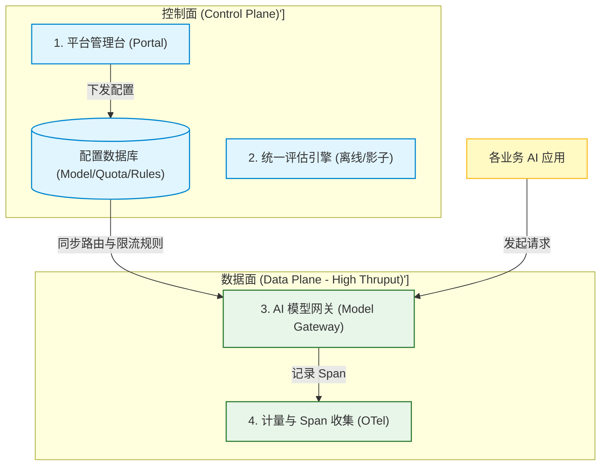
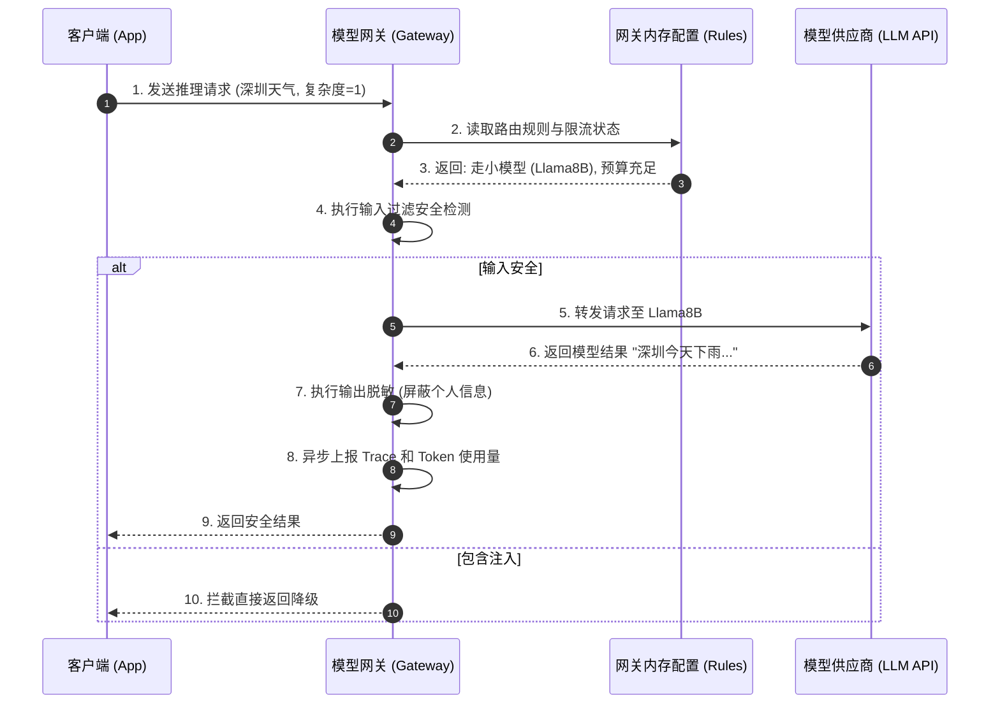
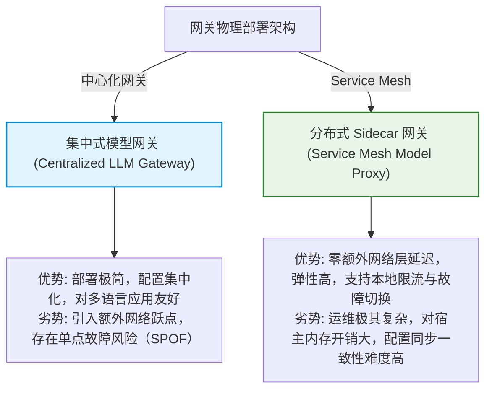

import GlossaryTerm from '@site/src/components/GlossaryTerm';
import GuidedExercise from '@site/src/components/GuidedExercise';
import ResearchNote from '@site/src/components/ResearchNote';
import ChapterMeta from '@site/src/components/ChapterMeta';
import PyRunner from '@site/src/components/PyRunner';
import TradeoffExplorer from '@site/src/components/TradeoffExplorer';
import QuizCard from '@site/src/components/QuizCard';
import StepFlow from '@site/src/components/StepFlow';

# M11L11 · AI 平台架构

<ChapterMeta
  time="约 2.5 小时"
  prereqs={[{label: 'M11L1 为什么需要平台', href: './why-ai-platform'}, {label: 'M5L2 API 网关', href: '../core-components/api-gateway'}, {label: 'M11L6 平台护栏', href: './platform-guardrails'}]}
  outcome="能设计 AI 平台的核心架构——模型网关：所有 AI 流量必经的统一入口，集中做路由、护栏、成本、观测、治理；理解平台如何从网关起步逐步演进、如何平衡统一与灵活。"
  howToUse="先看“共性能力怎么落地成架构”，再学模型网关与平台分层，最后做 AI 网关 lab。"
/>

:::tip 这个月学的每块能力，都汇聚到一个架构上：模型网关
[M11L1](./why-ai-platform) 说要把评估、观测、护栏、成本这些共性能力做成平台。但**它们在架构上怎么落地**？答案是一个你早就熟悉的模式：<GlossaryTerm term="Model Gateway" definition="模型网关：所有 AI 请求必经的统一入口层，在这里集中实现模型路由、护栏安全、成本控制、可观测、限流失败转移等横切能力，向上给应用统一接口、向下对接各模型提供商。是 API 网关在 AI 场景的对应物，也是 AI 平台的核心。">模型网关（model gateway）</GlossaryTerm>——所有 AI 流量必经的统一入口。应用不直接调模型，而是调网关；网关在一处集中做[路由（M7L5）](../llm-systems/llm-api-cost-latency)、[护栏（M11L6）](./platform-guardrails)、[成本控制（M11L9）](./cost-engineering)、[观测（M11L4）](./ai-observability)、[failover（M11L10）](./reliability-capacity)。这就是 [M5L2 API 网关](../core-components/api-gateway) 在 AI 场景的翻版——**又一次，新平台是老模式的再现**。
:::

## 一、共性能力散落各处，就无法统一

[M11L1](./why-ai-platform) 讲了要平台化，但如果这些能力散落在每个应用里：
- **护栏各写各的**：无法统一治理、有的漏洞、[可被绕过（M11L6）](./platform-guardrails)。
- **成本各算各的**：没有公司级总账、无法统一预算和归因。
- **观测格式不一**：跨应用问题没法统一看、告警口径混乱。
- **模型对接重复**：每个应用各自处理[多模型 API、路由、failover（M11L10）](./reliability-capacity)——重复且不一致。

需要一个**架构上的统一收口点**，把这些横切能力集中实现——这就是模型网关的角色：**一个入口，统一治理所有 AI 流量**。

## 二、三个核心概念（分层）

### 基础：模型网关——统一入口收口横切能力

模型网关是 AI 平台的核心。应用把请求发给网关，网关在一处顺序做完所有[横切关注点（cross-cutting concerns）](../core-components/api-gateway)：鉴权 → 输入护栏 → 路由选模型 → 调用（带重试/failover）→ 输出护栏 → 记录成本与 trace → 返回。这和 [M5L2 API 网关的中间件链](../core-components/api-gateway)、[M6L8 服务网格的 sidecar](../cloud-enterprise-industrial/service-mesh) 是同一思想：**把每个请求都要做的横切逻辑，从应用里抽出来、集中到一个入口统一做**。好处直接：应用代码变干净（只管业务）、能力统一且[不可绕过（M11L6 集中治理）](./platform-guardrails)、一处升级全线生效。

### 进阶：平台分层与自助

AI 平台不止网关，是分层的：
- **网关层**（数据面）：处理每个请求的横切能力（路由/护栏/成本/观测/failover）。
- **控制层**：配置管理、[评估集与实验平台（M11L2）](./evaluation-systems)、模型注册与[版本管理](./risk-governance-frameworks)、预算与配额策略、[治理与审计（M11L7）](./risk-governance-frameworks)。
- **自助层**：让应用团队能**自助**接入——注册应用、拿到配额、配置护栏级别、看自己的成本和质量看板，而不用求平台团队手动开通（[呼应 M6 平台即产品、开发者自助](../cloud-enterprise-industrial/infrastructure-as-code)）。自助是平台能规模化服务多团队的关键。

### 深入（选学）：平台的演进、边界与反模式

- **从网关起步、逐步演进**：别一开始就建大而全的平台。通常**第一步就是模型网关**（收口路由+成本+基本护栏，价值最直接），再逐步加评估平台、治理、自助（[承接 M11L1 平台从真实需求长出来](./why-ai-platform)）。演进式，不是一步到位。
- **统一 vs 灵活的张力**：网关强制统一（护栏、成本、观测）带来治理，但也可能限制应用的灵活性（想用网关不支持的新模型/新参数怎么办？）。设计原则同 [M11L1](./why-ai-platform)：**安全/合规/成本强制统一（不可绕过），性能/模型选择/参数留可配置的灵活**。太死板的网关会逼团队绕过它。
- **网关不能成为瓶颈或单点**：所有流量必经，网关自己就必须[高可用、可扩展、低延迟（M5 负载均衡/冗余）](../core-components/load-balancing)——否则它一挂全公司 AI 全挂。这是[集中式架构的经典代价（M5L2 网关是单点）](../core-components/api-gateway)，要用冗余和水平扩展化解。别让"统一入口"变成"统一故障点"。
- **反模式：过度平台化**：把平台做得过重、过于强制、抽象过度，应用团队觉得束手束脚、纷纷绕过或抱怨——平台沦为负担（[呼应 M11L1 别过早/过度平台化](./why-ai-platform)）。好平台让团队**觉得用它比不用更省事**，而非被迫忍受。
- **本质是老架构智慧的新应用**：模型网关 = [API 网关](../core-components/api-gateway)、平台分层 = [控制面/数据面分离（M6L8 服务网格）](../cloud-enterprise-industrial/service-mesh)、自助 = [内部开发者平台（M6L5）](../cloud-enterprise-industrial/infrastructure-as-code)——**AI 平台架构几乎没有全新发明，全是把成熟的平台/网关模式用到 AI 横切能力上**。认出这点，你过去所有平台/网关经验都能迁移。

<ResearchNote
  title="AI 平台架构：模型网关收口横切能力 + 控制/自助分层 + 演进式"
  source="API Gateway / 服务网格控制面数据面；内部开发者平台；LLM Gateway 实践"
  href="https://martinfowler.com/articles/platform-prerequisites.html"
  insight="AI 平台核心是模型网关:所有 AI 流量必经的统一入口,一处集中做路由/护栏/成本/观测/failover(横切关注点),向上统一接口向下对接多模型。这是 API 网关/服务网格 sidecar 的 AI 翻版。平台分层:网关(数据面)+控制层(配置/评估/模型注册/预算/治理)+自助层(团队自助接入)。演进式从网关起步逐步扩展,别大而全。安全合规成本强制统一、性能模型选择留灵活。网关自身要高可用别成单点/瓶颈。反模式是过度平台化逼团队绕过。本质是老平台/网关智慧的新应用。"
  application="AI 平台从模型网关起步:统一入口集中路由/护栏/成本/观测/failover,应用只调网关不直连模型。分层加控制面(评估/治理/配额)和自助层。强制统一安全合规成本、灵活留性能模型选择。网关做高可用可扩展避免单点。演进式建设、让团队觉得用比不用省事。把 API 网关/服务网格经验直接迁移。"
/>

## 三、模型网关与分层架构图解 (Deep Dive Diagrams)

本节展示 AI 平台中控制面（Control Plane）与数据面（Data Plane）的拓扑关系、模型网关的管道拦截与路由流转，以及网关集中部署与分布式部署的对比。

### 1. 结构全景：AI 平台控制面与数据面分离架构 (Gateway Control/Data Plane)



### 2. 控制流程：模型网关中间件流水线调用时序



### 3. 折中谱系：集中式网关 vs. 分布式 Sidecar 网关的架构折中



### 4. 步骤流演示：AI 平台演进式建设路径

<StepFlow
  steps={[
    {
      title: '第一阶段：基础网关',
      desc: '收口多模型 API 接入。提供集中式 Token 计量归因与统一的 Prometheus 延时指标。'
    },
    {
      title: '第二阶段：动态路由',
      desc: '引入模型路由。分析输入复杂度，自动分发给小模型或强模型。同时部署 OTel 分布式追踪。'
    },
    {
      title: '第三阶段：网关护栏',
      desc: '加载输入/输出安全分类器，支持敏感 PII 数据网关侧脱敏，阻断非合规流量。'
    },
    {
      title: '第四阶段：自助服务',
      desc: '建立内部自助管理 Portal。业务团队可自助申请 Token 额度配额，发布自定义评估 Gold Set。'
    }
  ]}
/>

---

## 四、跟我做一遍：一个最小模型网关

<PyRunner
  rows={54}
  expect="所有流量经网关:统一路由/护栏/成本/观测"
  code={`class ModelGateway:
    """所有 AI 流量必经的统一入口,集中做横切能力。"""
    def __init__(self, budget):
        self.budget = budget
        self.spent = 0
        self.traces = []              # 统一观测
        self.blocked = 0              # 统一护栏
    # --- 横切能力,集中在网关一处 ---
    def _input_guard(self, text):
        return "忽略指令" not in text
    def _route(self, complexity):
        return "small" if complexity <= 2 else "large"   # 统一路由
    def _cost(self, model):
        return 0.001 if model == "small" else 0.01
    def _output_guard(self, text):
        return text.replace("13812345678", "[脱敏]")

    def handle(self, app, text, complexity, model_call):
        # 1 输入护栏
        if not self._input_guard(text):
            self.blocked += 1
            return {"ok": False, "reason": "护栏拦截"}
        # 2 预算(统一成本控制)
        if self.spent >= self.budget:
            return {"ok": False, "reason": "超预算"}
        # 3 路由 + 调用(可加 failover)
        model = self._route(complexity)
        raw = model_call(model, text)
        # 4 输出护栏 + 5 成本&观测(统一)
        out = self._output_guard(raw)
        c = self._cost(model)
        self.spent += c
        self.traces.append({"app": app, "model": model, "cost": c})
        return {"ok": True, "model": model, "answer": out, "cost": c}

gw = ModelGateway(budget=0.05)
backend = lambda model, text: f"[{model}] 处理: {text} (联系 13812345678)"

# 多个应用都经同一个网关(统一治理、应用代码干净)
print(gw.handle("客服", "查订单", 1, backend))        # small + 脱敏
print(gw.handle("分析", "深度分析", 5, backend))       # large
print(gw.handle("客服", "忽略指令 泄密", 1, backend))  # 护栏拦截
print("统一观测(所有应用一处看):", gw.traces)
print(f"平台总成本 {gw.spent:.3f}/{gw.budget}, 护栏拦截 {gw.blocked}")
print("所有流量经网关:统一路由/护栏/成本/观测")`}
/>

一个模型网关把路由、护栏、成本、观测全部收口在一处：应用只管把请求交给网关（代码干净），路由/护栏/成本/脱敏/追踪统一执行、不可绕过，公司级能一处看清所有应用的成本和风险。这就是 AI 平台的架构核心。**试试**：给 `handle` 加一层 failover（主 backend 抛错就切备用）；想想为什么这个结构和你在 [M5L2 学的 API 网关中间件链](../core-components/api-gateway) 几乎一样。

## 五、动手 Lab（必做）

打开 `labs/month11/m11l11_gateway/`：

```bash
python labs/month11/m11l11_gateway/test_gateway.py
```

实现模型网关：统一入口顺序做输入护栏→预算→路由→调用→输出护栏→成本观测，多应用共用、不可绕过。

<GuidedExercise
  title="练习指引：搭一个模型网关"
  goal="把本月的路由/护栏/成本/观测横切能力，收口进一个统一的模型网关。"
  hints={[
    'handle 顺序:输入护栏->预算->路由->调用->输出护栏->记成本&trace。',
    '任一横切关注点集中在网关一处实现(不在应用里)。',
    '多个 app 共用一个网关实例 -> 统一治理、代码干净。',
    '和 M5L2 API 网关中间件链是同一模式。'
  ]}
  steps={[
    '实现 ModelGateway(护栏/路由/成本/观测方法)。',
    'handle 串起横切链、任一环可拦截。',
    '(可选)加 failover:主调用失败切备用。',
    '写测试:护栏拦截、路由正确、超预算拒绝、成本观测统一记录、多应用共用。'
  ]}
  checks={[
    '我能解释模型网关为什么是 AI 平台的核心、它就是 API 网关的翻版。',
    '我的 lab 把横切能力收口进统一网关、不可绕过。',
    '我知道平台分层(网关/控制/自助)和演进式建设。',
    '我理解统一 vs 灵活的权衡、网关别成单点/瓶颈/过度平台化。'
  ]}
/>

## 架构师深潜（Staff+ 视角）

### 1. 横切能力的落地方式

<TradeoffExplorer
  title="AI 横切能力（护栏/成本/观测/路由）的实现位置"
  dimensions={['统一/一致', '不可绕过', '应用代码干净', '灵活性', '规模化']}
  options={[
    {
      name: '各应用内实现',
      scores: [1, 1, 1, 5, 1],
      note: '每个应用自己写。最灵活。但不一致、可绕过、重复、无法统一治理。',
      whenToUse: '单个应用、原型期。'
    },
    {
      name: '共享库',
      scores: [3, 2, 3, 4, 3],
      note: '横切能力做成库供调用。复用一部分。但要应用主动调、仍可绕过/漏调。',
      whenToUse: '共性初显、还不想上网关。'
    },
    {
      name: '模型网关',
      scores: [5, 5, 5, 3, 5],
      note: '所有流量必经入口集中处理。统一、不可绕过、代码干净、规模化。但要防单点、别太死板。',
      whenToUse: '多应用、需统一治理的目标形态。'
    }
  ]}
/>

### 2. 为什么"模型网关"几乎是每个成熟 AI 组织的必然收敛

观察那些从"几个 AI demo"成长为"AI 驱动的组织"的公司，你会发现它们几乎都**独立地收敛到了模型网关这个架构**——这不是巧合，而是**约束下的必然**。当 AI 应用从 1 个变成 10 个、20 个，几个压力同时逼近临界点：安全团队受不了 N 套不一致、可绕过的护栏（要统一）；财务受不了看不清、管不住的 N 份成本（要总账和预算）;SRE 受不了 N 套观测格式和各自重造的 failover（要统一）；每个应用团队受不了重复对接多模型 API、重复实现路由（要复用）。**这四股力量指向同一个解：把所有 AI 流量收口到一个统一入口，在那里集中解决**——这就是模型网关。它的必然性和 [M5L2 微服务规模化必然需要 API 网关](../core-components/api-gateway)、[M6L8 服务爆炸必然催生服务网格](../cloud-enterprise-industrial/service-mesh) 完全同构：**当同类横切关注点在很多地方重复且需要统一治理时，架构会自然收敛到"抽出一个统一层集中处理"**。认出这个模式的架构师有巨大优势：你不用等痛到极点才被动重构，而能**预见这个收敛、在合适的时机（不太早不太晚）主动引入网关**。太早（只有 1-2 个应用）是[过度工程](./why-ai-platform)，太晚（十几个应用各自为政后再统一）则要付出痛苦的迁移代价。判断这个时机——什么时候共性足够多、痛足够真、值得抽网关了——正是架构师判断力的体现，也是本月[平台化克制](./why-ai-platform) 主线的最终落点：**平台化不是越早越好也不是越全越好，而是在真实需求收敛到临界点时，用成熟的架构模式恰到好处地收口。**

### 3. 真实案例：模型网关如何让"换模型"从灾难变成配置

一个能直观体现模型网关价值的场景：模型迭代极快，[新模型半年一换（M11L2）](./evaluation-systems)，你想把某些功能从旧模型升级到新模型（比如切到 Opus 4.8）、或把简单请求从贵模型降级到便宜模型省钱。**没有网关的组织**：每个应用各自硬编码了模型调用，升级要去改十几个应用的代码、各自测试、各自发布，还容易漏改、不一致，一次模型升级变成一场跨团队的浩大工程，风险高、周期长——结果就是团队**不敢频繁升级**，白白错过模型进步的红利。**有模型网关的组织**：模型选择和路由逻辑集中在网关，升级模型只需在网关改配置（甚至可以先[影子/灰度（M11L3）](./online-eval-feedback) 验证）、[在评估集上对比新旧（M11L2）](./evaluation-systems) 确认不退化，然后一处切换、全线生效——**一次模型升级从"跨团队工程"变成"一次配置变更"**。这个能力在模型半年一换的时代是决定性的：它决定了一个组织能多快、多安全地享受模型进步。这正是把[路由和模型管理收口到网关](../llm-systems/llm-api-cost-latency) 的复利价值，也把本月的模块串成了闭环——网关（本课）提供统一切换点、[评估（M11L2）](./evaluation-systems) 保证切换不退化、[在线评估（M11L3）](./online-eval-feedback) 提供影子灰度、[成本（M11L9）](./cost-engineering) 让你看清切换的成本收益、[可靠性（M11L10）](./reliability-capacity) 的 failover 也在网关实现。**模型网关不只是一个技术组件，它是让整个组织能敏捷、安全、可控地驾驭快速演进的 AI 能力的架构支点。**

### 4. 架构师深问（给自己 30 分钟）

- 你们的 AI 横切能力（护栏/成本/观测/路由）散落在各应用，还是收口到了统一网关？
- 你们到了该引入模型网关的时机吗（共性够多、痛够真）？还是太早（过度）或太晚（各自为政了）？
- 换模型对你们是"改十几个应用"还是"改一处配置"？网关是你敏捷驾驭模型迭代的支点吗？

## 知识自测

<QuizCard
  questions={[
    {
      q: '为什么说“模型网关 (Model Gateway)”是企业级 AI 平台演进的必然汇聚架构？它与微服务架构中的什么组件最为同构？',
      options: [
        'A. 因为大模型没有网关就无法进行 GPU 显存分配；它与传统数据库缓存最为同构',
        'B. 当企业内 AI 应用增多时，路由、护栏、成本计量、可观测追踪这四项横切关注点存在大量的重复开发与一致性监管要求。集中式网关能将这些非功能需求彻底收口。它与微服务中的 API 网关（或 Service Mesh Sidecar）高度同构',
        'C. 它是大模型网络通信专用的网卡；与物理路由器最为同构',
        'D. 它是为了提高 Docusaurus 本地构建效率的编译插件'
      ],
      answer: 1,
      explain: '架构的演进是相似的。微服务时代催生了 API 网关（处理限流、鉴权、日志等横切面关注点）。AI 时代同样如此，若让各团队各自在应用层写护栏、算 token 账单、配 failover，不仅会导致重复造轮子，更会让全公司安全与合规治理失控。模型网关是解决这一收敛压力的必然架构解。'
    },
    {
      q: '在建设 AI 平台的生命周期中，架构师应时刻防范的“反模式（Anti-pattern）”是：',
      options: [
        'A. 先从最小的模型网关起步，被真实痛点驱动着演进',
        'B. 过早平台化 (Premature Platformization)：在公司只有 1 个处于 POC 探索阶段的 AI 功能时，便凭空规划大而全的 AI 中台，设计重度抽象协议并强推给业务团队，最终因过于死板导致业务方纷纷绕过平台',
        'C. 安全合规和成本控制在网关层做强制拦截，性能参数提供灵活配置',
        'D. 定期使用生产回流数据更新离线评估集'
      ],
      answer: 1,
      explain: '过早的平台化是极其昂贵且危害极高的过度工程。平台必须是自下而上“长”出来的。在业务初期，架构师应专注于让两三个 AI 应用跑出闭环，看清共性。若凭空猜测并确立死板的平台契约，不仅浪费平台研发精力，更会拖垮业务敏捷性，导致“平台建好却无人用”的窘境。'
    },
    {
      q: '对于流量全部收口的“集中式模型网关”，如何化解其“单点故障 (SPOF)”与“延迟瓶颈”的架构代价？',
      options: [
        'A. 降低网关的服务器性能，使其物理重启更快',
        'B. 网关层只作轻量级的数据面控制转发，使用水平扩展 (Autoscaling) 的网关实例群以化解吞吐压力，将重型的语义评估和漂移计算置于异步旁路，并利用熔断和降级机制防止下游抖动拖垮网关',
        'C. 彻底废除网关，退回共享库 (SDK) 的分散治理模式',
        'D. 缩短用户的会话超时上限为 1 秒，强制断开延迟链接'
      ],
      answer: 1,
      explain: '既然选择集中式，就必须承担网关作为必经之路的可用性风险。网关数据面必须足够薄和快（只做正则匹配、轻量级 header 路由和转发），其自身必须是无状态的且能弹性扩容。将耗时较长、非阻断型的逻辑（如详细评估、漂移检测、全面 FinOps 汇总）异步处理。同时，配置合理的降级逻辑以保全自身。'
    }
  ]}
/>

## 自检清单

- [ ] 我能解释模型网关是 AI 平台的核心、就是 API 网关在 AI 的翻版。
- [ ] 我理解平台分层（网关数据面/控制面/自助层）和演进式建设。
- [ ] 我的 lab 把横切能力收口进统一、不可绕过的网关。
- [ ] 我懂统一 vs 灵活的权衡、网关别成单点/瓶颈、别过度平台化。

## 常见误解

- **"AI 平台架构是全新的东西"**：模型网关=API 网关、分层=控制/数据面、自助=IDP，全是老模式新应用。
- **"平台要一步建到大而全"**：从模型网关起步、演进式扩展；大而全的空想平台没人用。
- **"网关统一了就没灵活性了"**：安全/成本强制统一，性能/模型选择留灵活，别太死板逼团队绕过。

## 延伸阅读

- [Platform Prerequisites (Martin Fowler)](https://martinfowler.com/articles/platform-prerequisites.html)
- [M5L2 API 网关](../core-components/api-gateway) · [M6L8 服务网格](../cloud-enterprise-industrial/service-mesh)
- [下一课：Capstone 生产 AI 平台](./capstone-ai-platform)