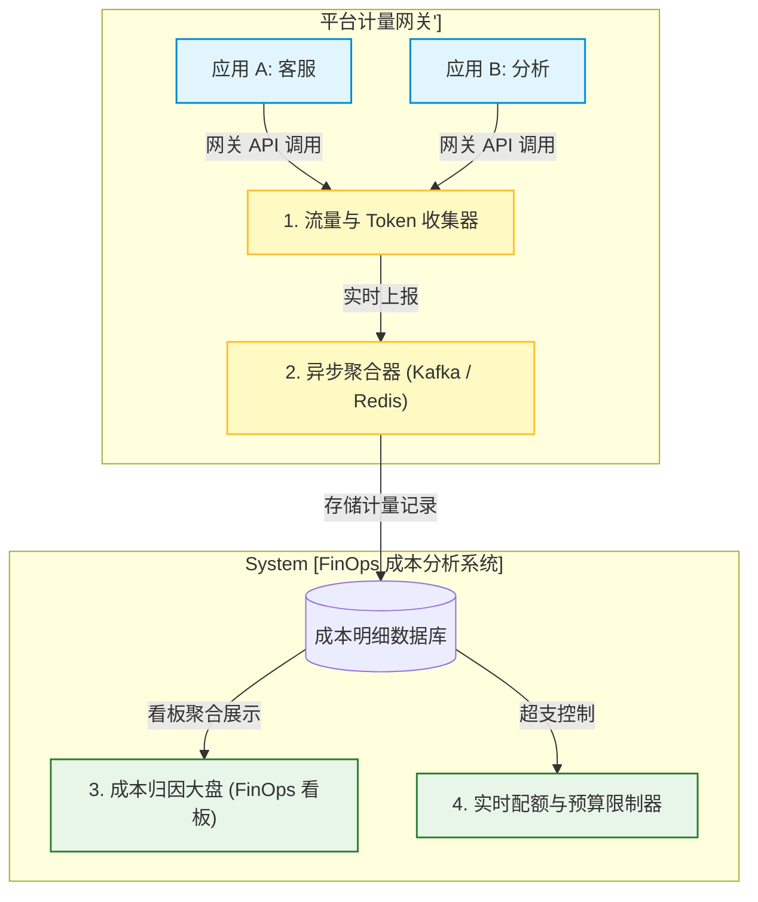
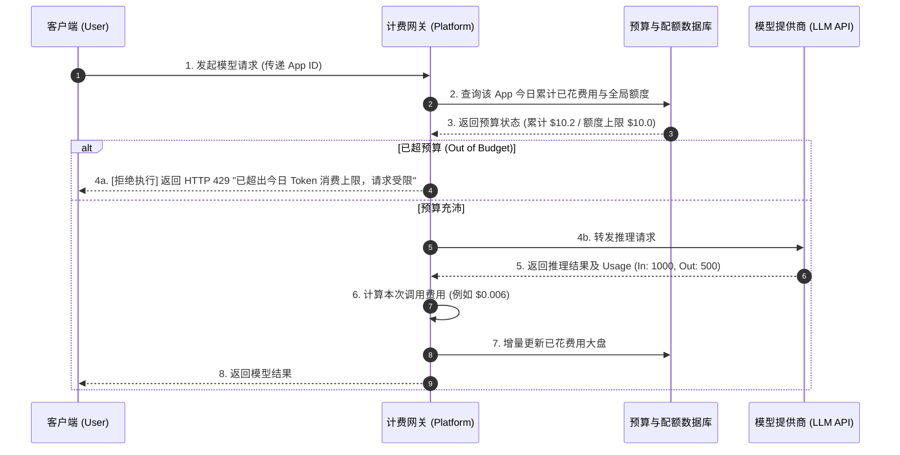
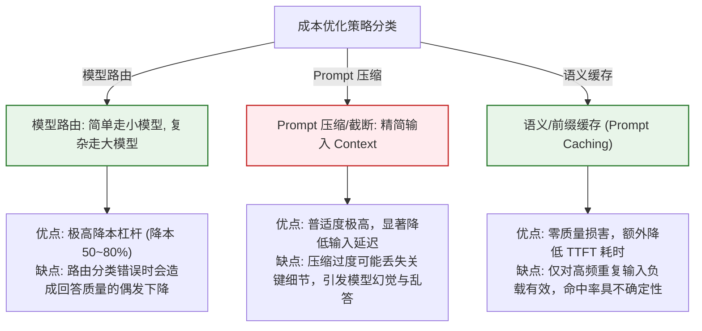

import GlossaryTerm from '@site/src/components/GlossaryTerm';
import GuidedExercise from '@site/src/components/GuidedExercise';
import ResearchNote from '@site/src/components/ResearchNote';
import ChapterMeta from '@site/src/components/ChapterMeta';
import PyRunner from '@site/src/components/PyRunner';
import TradeoffExplorer from '@site/src/components/TradeoffExplorer';
import QuizCard from '@site/src/components/QuizCard';
import StepFlow from '@site/src/components/StepFlow';

# M11L9 · 成本工程

<ChapterMeta
  time="约 2.5 小时"
  prereqs={[{label: 'M7L5 API 成本延迟', href: '../llm-systems/llm-api-cost-latency'}, {label: 'M11L4 AI 可观测', href: './ai-observability'}, {label: 'M5L5 限流', href: '../core-components/rate-limiting'}]}
  outcome="能做 AI 成本工程：理解 token 经济学、用模型路由/缓存/批处理降本、用预算配额防失控、用成本归因看清钱花在哪，让 AI 可负担地规模化。"
  howToUse="先看“为什么 AI 会烧出天价账单”，再学降本与控本手段，最后做成本归因+预算 lab。"
/>

:::tip AI 的成本会咬人——一个不留神就是天价账单
传统软件部署好了，多服务一个用户的边际成本几乎为零。AI 完全不同：**每一次模型调用都直接花钱，token 就是钱**。一个看着不错的 demo，上线后可能因为没做成本控制而烧出吓人的账单——某个功能把整篇文档塞进 [prompt](../rag/chunking)、某个 [Agent 循环](../agent-architectures/stopping-budget) 失控多跑几十轮、某类请求量意外暴涨。成本工程就是把"花多少钱"变成**可预测、可归因、可控制**的工程：理解 token 经济学、用路由/缓存降本、用预算防失控、用归因看清钱花在哪。**在 AI 时代，会控成本和会做功能一样重要。**
:::

## 一、为什么 AI 会烧钱，而且烧得不透明

AI 成本的特殊性让它容易失控：
- **边际成本不为零**：每次调用按 [token 计费](../llm-systems/llm-api-cost-latency)——用得越多花得越多，和传统"部署一次随便用"完全不同。
- **成本随输入膨胀**：prompt 越长（[塞了整篇文档、长历史、多轮对话](../llm-systems/context-memory)）token 越多、越贵——一个没做截断的功能能悄悄让单请求成本翻几倍。
- **Agent/多轮放大**：[Agent 一次任务多轮调用、多 Agent 各跑几轮](../multi-agent-protocols/multi-agent-ops)——成本是单次的几倍到几十倍。
- **不透明**：不做[归因（M11L4）](./ai-observability) 就不知道钱花在哪个功能、哪类请求、哪一步——月底看到天价账单却说不清。

所以成本必须被**主动工程**，不能"先上线再说"——那往往意味着一笔预算外的大账单。

## 二、三个核心概念（分层）

### 基础：token 经济学与成本归因

- <GlossaryTerm term="Token Economics" definition="Token 经济学：LLM 按输入(prompt)和输出 token 数计费，且通常输出比输入贵。成本 ≈ (输入 token×输入单价 + 输出 token×输出单价)×调用次数。理解它才能针对性降本。">token 经济学</GlossaryTerm>：成本 ≈（输入 token × 输入单价 + 输出 token × 输出单价）× 调用次数，且[输出通常比输入贵、强模型比弱模型贵得多（M7L5）](../llm-systems/llm-api-cost-latency)。降本就是降这几个因子：更少 token、更便宜的模型、更少调用。
- <GlossaryTerm term="Cost Attribution" definition="成本归因：把 AI 总成本拆解到维度——按功能、按用户/租户、按请求类型、按处理步骤，看清钱花在哪、谁最贵、是否值得，是优化和计费的前提。">成本归因</GlossaryTerm>：把总成本拆到功能/用户/请求类型/步骤（[承接 M11L4 可观测、M10L10 归因](./ai-observability)）——**看不清就优化不了**。归因常暴露"二八分布"：少数功能/用户吃掉大部分成本，那就是优化重点。

### 进阶：三大降本手段

- **模型路由**：简单请求用[便宜小模型、复杂请求才用强模型（M7L5）](../llm-systems/llm-api-cost-latency)——别用大炮打蚊子。这往往是最大的降本杠杆。
- **缓存**：相同/相似请求[缓存结果（M7L11 语义缓存）](../llm-systems/llm-api-cost-latency)、[相同前缀用 prompt 缓存（M7L7 KV cache）](../llm-systems/kv-cache-serving)——命中就省一次调用。
- **精简 token**：[压缩 prompt、截断历史、只放必要 context（M8L4 分块、M7L8 上下文管理）](../llm-systems/context-memory)——直接减少每次的 token。
- 其它：批处理、限制输出长度、能用[非 AI 方案就别用 AI（贯穿全书的克制）](./why-ai-platform)。

### 深入（选学）：预算控制与成本的架构权衡

- <GlossaryTerm term="Budget & Quota" definition="预算与配额：给系统/功能/用户设置成本上限（每请求、每用户每天、全局每月），接近或超过时限流、降级或告警，防止成本失控和成本型攻击。是成本的安全阀。">预算与配额</GlossaryTerm>：给每请求/每用户/全局设成本上限——超了就[限流/降级/告警（M5L5 限流、M11L8 降级）](../core-components/rate-limiting)。这既防意外失控，也防[成本型攻击（M11L5 模型 DoS：构造超长输入烧你的钱）](./llm-threat-modeling)。**没有预算上限的 AI 系统，等于给了攻击者和 bug 一张空白支票。**
- **成本 vs 质量 vs 延迟的三角**：降本常牺牲质量（用弱模型）或延迟（批处理）——要按场景权衡，别一味最便宜。用[评估集（M11L2）](./evaluation-systems) 量化"降本后质量掉了多少"，做数据驱动的取舍，而非拍脑袋。
- **Goodhart 陷阱**：只盯"降成本"这一个指标，可能把质量做垮（全用最弱模型、疯狂截断 context 导致答非所问）——成本要和质量指标一起看，别让省钱变成砸招牌（[呼应 M11L3 单一指标会被扭曲](./online-eval-feedback)）。
- **AI FinOps**：成本工程正在成为一门专门实践（AI FinOps）——持续监控、归因、优化、预测 AI 成本。它和[可观测（M11L4）](./ai-observability) 一样，是 [AI 平台（M11L1）](./why-ai-platform) 的核心共享能力：平台统一提供成本看板、预算管控、跨应用总账，才能在组织层面管住 AI 开销。
- **别过早优化成本**：验证期（还没确定这功能有没有用）别急着抠成本，先跑通、看价值；[等规模和成本真的成为问题了再优化（YAGNI）](./why-ai-platform)——但要**从一开始就有归因和预算上限**（防失控的底线），这不是过早优化，是安全带。

<ResearchNote
  title="AI 成本工程：token 经济学 + 归因 + 路由/缓存降本 + 预算防失控"
  source="AI FinOps 实践；M7L5 成本延迟 / M7L11 缓存；FinOps Foundation"
  href="https://www.finops.org/"
  insight="AI 边际成本不为零(token 即钱)、随输入膨胀、Agent/多轮放大且不透明,不主动工程就烧天价账单。降本三杠杆:模型路由(简单请求用小模型,最大杠杆)、缓存(语义/前缀命中省调用)、精简 token(压缩截断只放必要)。控本靠成本归因(拆到功能/用户/步骤,看清二八分布)+预算配额(每请求/用户/全局上限,超则限流降级告警,兼防成本型攻击)。成本-质量-延迟是三角权衡,用评估量化,防只盯降本砸质量(Goodhart)。是 AI 平台核心共享能力(FinOps)。"
  application="做成本工程:归因到功能/用户/步骤找二八重点;路由简单请求到小模型、缓存重复、精简 prompt token 降本;给每请求/用户/全局设预算上限防失控和成本攻击。降本用评估量化质量代价、别砸招牌。从第一天就有归因和预算(安全带),但别过早抠成本。平台统一成本看板/预算/总账。"
/>

## 三、Token 经济学与成本管控图解 (Deep Dive Diagrams)

本节展示大模型成本分摊与归因的可观测拓扑、实时 Token 额度校验与拦截执行流，以及成本优化技术与系统质量的折中关系。

### 1. 结构全景：Token 计费计量与归因系统架构



### 2. 控制流程：实时 Token 额度验证与超支限流序列



### 3. 折中谱系：成本优化技术与系统质量折中



### 4. 步骤流演示：FinOps 成本管控管线

<StepFlow
  steps={[
    {
      title: '配额设定',
      desc: '平台管理员在控制台为各 AI 应用（如客服 bot）预置每日消费额度（例如 $20/天）。'
    },
    {
      title: '实时拦截',
      desc: '网关层在接收请求前读取 Redis 消费状态。如额度已扣完，当场快速失败，拦截高额流量。'
    },
    {
      title: '模型路由',
      desc: '如果额度充足，路由器根据任务复杂度分发。简单翻译分配给便宜模型，逻辑推理送往昂贵模型。'
    },
    {
      title: '计量汇总',
      desc: '在收到 LLM 响应后提取输入和输出的 Token 数，折算单价，归因上报至 FinOps 数据大盘。'
    }
  ]}
/>

---

## 四、跟我做一遍：成本归因 + 模型路由 + 预算上限

<PyRunner
  rows={50}
  expect="归因看清、路由降本、预算防失控"
  code={`# token 定价(每千 token 美元,示意):强模型贵、输出比输入贵
PRICING = {
    "small": {"in": 0.0003, "out": 0.0006},
    "large": {"in": 0.003,  "out": 0.006},
}

def cost(model, in_tok, out_tok):
    p = PRICING[model]
    return in_tok/1000*p["in"] + out_tok/1000*p["out"]

# 模型路由:简单请求走小模型(最大降本杠杆)
def route(task_complexity):
    return "small" if task_complexity <= 2 else "large"

class CostControl:
    def __init__(self, budget):
        self.budget = budget          # 全局预算上限
        self.spent = 0
        self.by_feature = {}          # 成本归因
    def charge(self, feature, model, in_tok, out_tok):
        if self.spent >= self.budget:                 # 预算防失控/成本攻击
            return {"ok": False, "reason": "超预算,拒绝(限流)"}
        c = cost(model, in_tok, out_tok)
        self.spent += c
        self.by_feature[feature] = round(self.by_feature.get(feature, 0) + c, 5)
        return {"ok": True, "model": model, "cost": round(c, 5)}

cc = CostControl(budget=0.05)
requests = [("客服", 1), ("客服", 1), ("分析", 4), ("分析", 5), ("客服", 2)]
for feat, complexity in requests:
    model = route(complexity)                          # 路由
    r = cc.charge(feat, model, in_tok=800, out_tok=200)
    print(f"[{feat}] 复杂度{complexity} -> {model} : {r}")
print("成本归因(看清二八):", cc.by_feature)             # 分析类最贵
print(f"已花 {cc.spent:.4f} / 预算 {cc.budget}")
print("归因看清、路由降本、预算防失控")`}
/>

简单请求路由到便宜的小模型、复杂的才用强模型（最大降本杠杆），每笔花费归因到功能（一眼看出"分析"类最烧钱、是优化重点），全局预算上限在超支时拒绝（防失控和成本攻击）。这就是成本从"月底吓一跳"变成可控工程。**试试**：把预算调到 0.02，看预算上限如何提前拦截；把"分析"类也路由到 small，看成本和（想象中的）质量如何变化——体会成本质量的权衡。

## 五、动手 Lab（必做）

打开 `labs/month11/m11l9_cost/`：

```bash
python labs/month11/m11l9_cost/test_cost.py
```

实现成本工程：token 成本计算、模型路由降本、成本归因、全局预算上限防失控。

<GuidedExercise
  title="练习指引：搭成本控制系统"
  goal="把‘归因 + 路由降本 + 预算防失控’做成代码，让 AI 成本可预测可控。"
  hints={[
    'cost(model, in_tok, out_tok)：按 token 单价算(输出更贵)。',
    'route(complexity)：简单->small、复杂->large(最大降本杠杆)。',
    'CostControl：charge 累计 + 按 feature 归因;超预算拒绝。',
    '预算上限既防失控也防成本型攻击。'
  ]}
  steps={[
    '实现 cost 和 route。',
    '实现 CostControl(charge/归因/预算拦截)。',
    '跑一批请求,观察归因分布和预算拦截。',
    '写测试:成本计算正确、简单请求走小模型、归因正确、超预算被拒。'
  ]}
  checks={[
    '我理解 AI 的 token 经济学和成本为什么容易失控。',
    '我的 lab 能路由降本、成本归因、预算防失控。',
    '我知道降本三杠杆(路由/缓存/精简 token)和成本质量权衡。',
    '我会从第一天就设归因和预算上限(安全带),但不过早抠成本。'
  ]}
/>

## 架构师深潜（Staff+ 视角）

### 1. 降本手段

<TradeoffExplorer
  title="AI 降本手段的取舍"
  dimensions={['降本幅度', '不损质量', '实施简单', '覆盖面', '优先级']}
  options={[
    {
      name: '模型路由',
      scores: [5, 3, 3, 4, 5],
      note: '简单请求用小模型。降本杠杆最大。但路由错会损质量,需评估把关。',
      whenToUse: '几乎所有系统的首选降本手段。'
    },
    {
      name: '缓存(语义/前缀)',
      scores: [4, 5, 3, 3, 4],
      note: '重复/相似请求命中即省。几乎不损质量。但只对有重复的负载有效。',
      whenToUse: '有重复查询/共享前缀的场景。'
    },
    {
      name: '精简 token',
      scores: [3, 3, 4, 5, 4],
      note: '压缩/截断 prompt、限输出。普遍适用。但截断过头会丢上下文损质量。',
      whenToUse: '任何 prompt 偏长的系统。'
    },
    {
      name: '预算上限',
      scores: [2, 5, 5, 5, 5],
      note: '不主要为降本,而是防失控/成本攻击的安全带。必备。',
      whenToUse: '所有生产 AI,从第一天就设。'
    }
  ]}
/>

### 2. 成本是 AI 架构的一等约束，不是事后账单

传统软件里，工程师做架构决策时很少把"每次调用的钱"放进考量——因为边际成本近乎零。AI 彻底改变了这一点：**成本成了和延迟、质量并列的一等架构约束**，很多设计决策本质上是成本决策。要不要用 Agent 多轮而非单次调用？是[成本 vs 能力](../multi-agent-protocols/why-multi-agent) 的权衡。要不要把整篇文档塞进 context 还是先[检索再精选](../rag/chunking)？是成本 vs 简单的权衡。用强模型保质量还是小模型省钱？是[成本 vs 质量](../llm-systems/llm-api-cost-latency) 的权衡。一个不把成本纳入架构思考的 AI 工程师，会设计出"技术上很漂亮但贵到没法规模化"的系统——demo 惊艳、一上量就因为成本被砍掉。反过来，优秀的 AI 架构师在每个设计决策上都同时算三笔账：**这样做质量如何、延迟如何、成本如何**，并按业务价值找到平衡点。这也解释了为什么成本要[归因和可观测（M11L4）](./ai-observability)——你没法权衡你看不见的成本。更深一层，成本约束其实**强化了本书反复讲的克制**：正因为每次 AI 调用都花钱，"[能不能不用 Al、能不能用更简单更便宜的方案](./why-ai-platform)"就不只是优雅问题，而是实打实的经济问题。**在 AI 时代，克制既是好品味，也是好生意。**

### 3. 真实案例：一个 Agent 的成本失控与治理

一个真实的成本陷阱：团队上线了一个[研究型 Agent](../multi-agent-protocols/capstone-multi-agent)，能自主检索、调工具、多轮推理——功能很强，demo 惊艳。但上线后账单失控，排查（靠[成本归因，M11L4](./ai-observability)）发现几个叠加问题：(1) Agent [没有严格的轮次上限（M9L4）](../agent-architectures/stopping-budget)，遇到难题会反复循环几十轮，每轮都是一次昂贵的强模型调用；(2) 每轮都把**完整的历史对话**塞进 [context（M7L8）](../llm-systems/context-memory)，token 随轮数线性膨胀，后期单次调用贵得离谱；(3) 所有请求无论难易**都用最强模型**，没有[路由（M7L5）](../llm-systems/llm-api-cost-latency)；(4) 没有[任何预算上限](../core-components/rate-limiting)，失控时没有任何东西踩刹车。治理是一套组合拳：加严格轮次上限和[全局预算（M10L10）](../multi-agent-protocols/multi-agent-ops)、只保留必要的上下文摘要而非全量历史、简单子任务路由到小模型、每用户每日配额——综合下来成本降了一个数量级，质量几乎没受影响。这个案例浓缩了成本工程的全部要点，也串起本月主线：成本失控往往不是单一原因，而是[缺预算（本课）](./cost-engineering) + [缺可观测归因（M11L4）](./ai-observability) + [缺停止条件（M9）](../agent-architectures/stopping-budget) 叠加的结果；反过来，把成本管住也不是靠单一银弹，而是归因看清 + 多杠杆降本 + 预算兜底的**系统工程**。**能不能把一个强大的 AI 功能做到既好用又付得起，是区分"能出 demo"和"能做成生意"的关键。**

### 4. 架构师深问（给自己 30 分钟）

- 你的 AI 成本归因到功能/用户/请求类型了吗？能说出哪个最烧钱、值不值吗？还是月底看总账才知道？
- 你有全局/每用户预算上限吗？如果某个 bug 或攻击让调用量暴涨，有东西踩刹车吗？
- 你在架构决策（用不用 Agent、塞多少 context、用哪个模型）时，把成本和质量、延迟一起算了吗？

## 知识自测

<QuizCard
  questions={[
    {
      q: '为什么在设计大语言模型（LLM）架构时，成本（Cost）必须被视作“一等系统约束”，而不是事后查看的财务账单？',
      options: [
        'A. 因为 LLM 的网络带宽是按字节收费的，容易引发网络延迟堵塞',
        'B. AI 系统具有极高的边际运行成本（Token 即钱），且随着输入 Context 长度线性或二次方膨胀，多轮 Agent 推理更会成倍放大这一开销。不把成本作为一等约束在架构设计期进行模型路由、缓存和限制，上线即可能引发无法承受的经济灾难',
        'C. 成本高低决定了大模型被编译为 Docusaurus 静态网站时的排版速度',
        'D. 每次大模型调用都会自动把信用卡卡号泄露给模型提供商'
      ],
      answer: 1,
      explain: '与传统软件边际服务器成本微乎其微不同，大语言模型的每次调用都需要消耗庞大的算力和资源（Token 计费）。长文本检索（RAG）、长上下文记忆和 Agent 循环均会急剧放大 Token 开销。如果不将其作为一等约束与质量、延迟同步权衡，上线后一旦调用量暴涨，昂贵的账单会直接掐断业务的生命线。'
    },
    {
      q: '在进行 AI 成本优化时，公认的降本杠杆最大、最先考虑的系统设计手段是：',
      options: [
        'A. 模型路由 (Model Routing)：通过判定任务复杂度，将 80% 的简单问答路由给低成本的小模型（如 Llama 8B），仅在需要高复杂逻辑推理时路由给昂贵的强模型',
        'B. 彻底限制用户输入的字数在 10 个字符以内',
        'C. 部署多云架构，在不同云提供商之间高频同步模型权重',
        'D. 将大模型的 Temperature 参数固定调至 0.0'
      ],
      answer: 0,
      explain: '大模型与小模型的单价通常相差 10 至 50 倍。在真实业务中，大部分用户提问（例如“我的包裹到哪了”或“翻译这句话”）都是浅层语义理解，便宜模型即可完美胜任。通过模型路由进行分级治理，在质量无损的情况下，能直接把总体运行开销削减 70% 以上，是降本的核心手段。'
    },
    {
      q: '为了规避意外死循环或遭遇成本注入攻击，AI 平台必须强制部署的“安全带”设计是：',
      options: [
        'A. 完全使用开源模型，拒绝任何计费网关',
        'B. 全局预算上限与用户/功能级配额设置，在达到或超出费用警戒线时直接实施网关层 Fail-Safe 限流拦截',
        'C. 在 Docusaurus 前端加装警告提示框，要求用户自觉节省 Token',
        'D. 禁止任何长文本 RAG 功能，所有 Prompt 固定为 100 字符以下'
      ],
      answer: 1,
      explain: '没有预算上限的系统相当于将钱包彻底敞开。当应用遭遇“提示词注入”被恶意诱导陷入死循环，或者遭遇恶意用户疯狂刷接口（成本型 DDoS），如果没有配额拦截，可能会在几小时内烧光一个团队数月的 LLM 预算。配额拦截和警报是上线生产必须强制配备的底线防护。'
    }
  ]}
/>

## 自检清单

- [ ] 我理解 AI 的 token 经济学和成本为什么容易失控、不透明。
- [ ] 我会用降本三杠杆（模型路由/缓存/精简 token），并用评估量化质量代价。
- [ ] 我的系统有成本归因（看清二八）和预算上限（防失控与成本攻击）。
- [ ] 我把成本当 AI 架构的一等约束，和质量、延迟一起权衡。

## 常见误解

- **"先把功能做出来，成本以后再说"**：AI 成本会咬人，至少要从第一天就有归因和预算上限（安全带）。
- **"降本就是全用最便宜的模型"**：会砸质量（Goodhart）；要按场景路由、用评估量化质量代价。
- **"成本是运维/财务的事"**：成本是 AI 架构的一等约束，很多设计决策本质是成本决策。

## 延伸阅读

- [FinOps Foundation](https://www.finops.org/)
- [M7L5 API 成本与延迟](../llm-systems/llm-api-cost-latency) · [M7L11 缓存与降级](../llm-systems/llm-api-cost-latency)
- [下一课：可靠性与容量](./reliability-capacity)