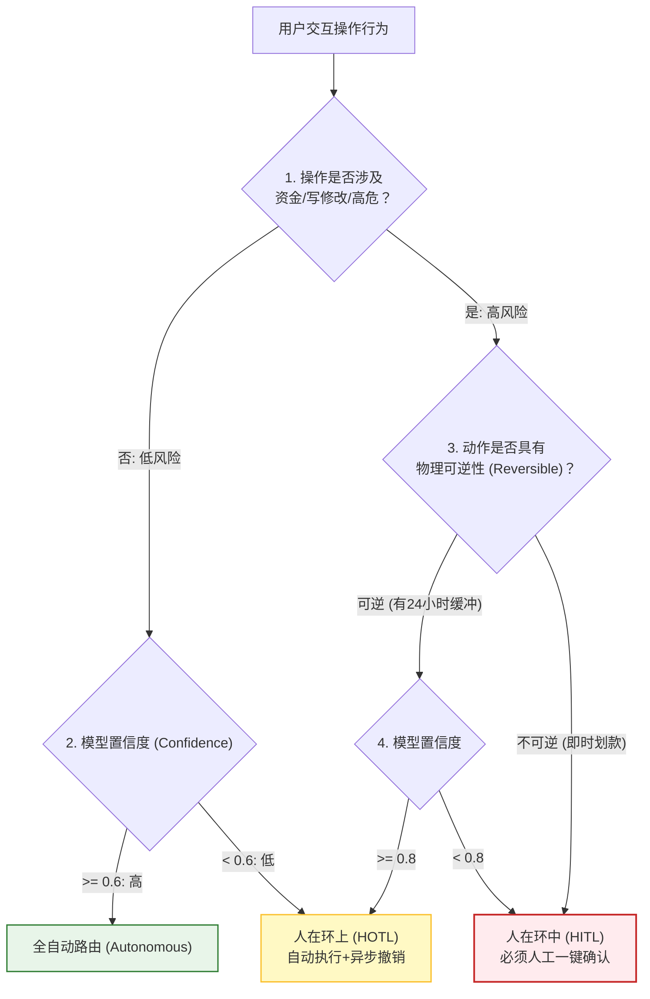
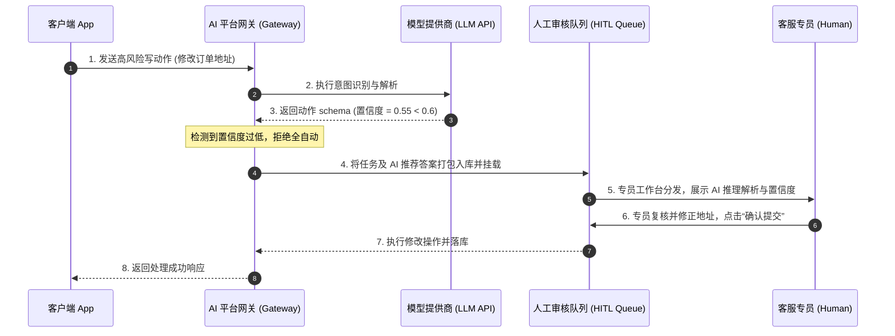
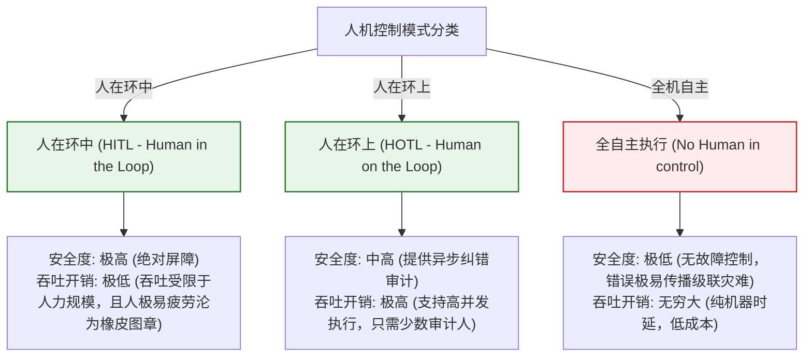

import GlossaryTerm from '@site/src/components/GlossaryTerm';
import GuidedExercise from '@site/src/components/GuidedExercise';
import ResearchNote from '@site/src/components/ResearchNote';
import ChapterMeta from '@site/src/components/ChapterMeta';
import PyRunner from '@site/src/components/PyRunner';
import TradeoffExplorer from '@site/src/components/TradeoffExplorer';
import QuizCard from '@site/src/components/QuizCard';
import StepFlow from '@site/src/components/StepFlow';

# M11L8 · 人类监督与失败处理

<ChapterMeta
  time="约 2 小时"
  prereqs={[{label: 'M11L6 平台护栏', href: './platform-guardrails'}, {label: 'M7L9 弃答', href: '../llm-systems/hallucination-guardrails'}, {label: 'M5L6 熔断降级', href: '../core-components/circuit-breaker'}]}
  outcome="能为 AI 系统设计‘出错/没把握时怎么办’：人类监督（HITL/HOTL）、优雅降级、可逆性、置信度触发升级、事故响应，理解成熟 AI 是管理失败而非假装不失败。"
  howToUse="先看“AI 一定会出错”，再学人类监督与失败处理的手段，最后做置信度升级+降级 lab。"
/>

:::tip 成熟的 AI 系统，不追求永不出错，而是管好“出错时怎么办”
一个铁律：**AI 一定会出错、一定会遇到超出它能力的情况**——模型有幻觉、世界有长尾、攻击者会钻空子。新手追求"让模型永不出错"（做不到）；成熟的架构师承认失败必然，转而设计好**失败与不确定的处理**：没把握时[弃答或升级给人（M7L9）](../llm-systems/hallucination-guardrails)、高风险操作[让人审批（M11L6）](./platform-guardrails)、出问题时能[优雅降级（M5）](../core-components/circuit-breaker) 而非崩溃、错了能回退。**把人放在合适的位置、把失败处理设计好——这是 AI 能被信任地用在重要场景的前提。**
:::

## 一、AI 一定会出错，问题是出错时会怎样

假设 AI 永不出错来设计系统，是最危险的错误。现实是：
- **模型会错**：幻觉、误判、被[注入操纵](./llm-threat-modeling)——概率模型没有 100%。
- **会遇到能力边界**：训练数据没覆盖的长尾问题、模糊的边界情况——模型会"不懂装懂"。
- **问题不在错，而在错了会怎样**：AI 答错一个天气无所谓；AI 自动执行了一笔错误转账、给了错误医疗建议、删了不该删的数据——**后果的严重性和可逆性，决定了你要给它多少自主权、留多少人类监督**。

所以设计 AI 系统，核心问题从"怎么让它不错"变成"**它错了/没把握时，系统怎么安全地兜住**"。

## 二、三个核心概念（分层）

### 基础：人类监督的两种模式

- <GlossaryTerm term="Human-in-the-Loop (HITL)" definition="人在环中：AI 给出结果后、执行前，必须由人审批才能生效。人是决策链上的必经关卡。适合高风险/不可逆操作——宁可慢，不可错。">Human-in-the-Loop（人在环中，HITL）</GlossaryTerm>：AI 的结果**执行前必须人批**——人是必经关卡。适合[高风险/不可逆操作（转账、删除、对外发布、医疗法律建议）](./platform-guardrails)：宁可慢，不可错。
- <GlossaryTerm term="Human-on-the-Loop (HOTL)" definition="人在环上：AI 自动执行，但人在旁监督、可随时介入或叫停，并事后审查。适合中风险、需要效率但不能完全放手的场景。">Human-on-the-Loop（人在环上，HOTL）</GlossaryTerm>：AI 自动执行，人**监督并可随时介入/叫停**、事后审查。适合中风险、要效率但不能完全放手。
- 选哪种看[风险等级（承接 M11L6/L7 分级）](./risk-governance-frameworks)：越高风险、越不可逆，人介入得越深（HITL）；越低风险越可自动（甚至无人）。**自主性与监督是按风险权衡的连续谱**（[呼应 M10L11](../multi-agent-protocols/multi-agent-eval-safety)）。

### 进阶：置信度触发升级与优雅降级

- <GlossaryTerm term="Confidence-based Escalation" definition="基于置信度的升级：AI 对自己的答案/决策评估置信度，低于阈值时不硬答，而是弃答、转人工或走更保守的路径。让系统‘知道自己不知道’，把没把握的交给人。">置信度升级</GlossaryTerm>：AI 评估自己有没有把握，**低置信就不硬答**——弃答、转人工、或走更保守路径（[承接 M7L9 弃答、M10L8 真分歧暴露给人](../llm-systems/hallucination-guardrails)）。让系统"知道自己不知道"，是可靠 AI 的标志。
- <GlossaryTerm term="Graceful Degradation" definition="优雅降级：当 AI 组件失败或不可用时，系统退回到一个较简单但仍可用的状态（如返回缓存/规则结果、转人工、给保守默认），而不是整体崩溃或给出危险输出。">优雅降级</GlossaryTerm>：AI 部分失败时，退回**较简单但可用**的状态（缓存结果、规则兜底、转人工、保守默认），而非崩溃或输出危险结果。这是 [M5 弹性设计（熔断/降级/舱壁）](../core-components/circuit-breaker) 直接搬到 AI——**AI 失败要像任何组件失败一样被优雅处理**。

### 深入（选学）：可逆性、事故响应与"人机分工"

- **可逆性是安全的关键杠杆**：能撤销的操作，AI 自主做错了也能补救（[呼应 M6L4 可回滚发布](../cloud-enterprise-industrial/autoscaling-rollout)）；不可逆的操作（转账、删数据、发邮件）错了就无法挽回。**架构策略：尽量把 AI 的动作设计成可逆的**（软删除、草稿态、需确认才生效），把不可逆的留给人。可逆性往往比"提高模型准确率"更实际地降低风险。
- **事故响应（AI 版）**：AI 出了事故（大面积错答、被攻破、有害输出泛滥）要有预案：能快速**关停或降级**这个 AI（[开关/回滚](../cloud-enterprise-industrial/autoscaling-rollout)）、能[追溯根因（M11L4/L7 审计](./ai-observability)）、能通知和补救受影响用户。别等出事才想怎么办（[呼应 M5/M6 SRE 事故响应](../core-components/circuit-breaker)）。
- **人机分工要设计，不是"AI 全包"或"人全包"**：好的 AI 系统是**人机协作**——AI 做它擅长的（规模、速度、初筛），人做他擅长的（判断、例外、担责、高风险决策）。设计时明确"哪些 AI 全自动、哪些 AI 建议人决定、哪些必须人做"，而非走极端。
- **别让人类监督沦为橡皮图章**：如果人要审批的东西太多、界面太差、信息不足，人会疲劳性地"全部通过"，监督形同虚设。要**只把真正需要人判断的（高风险、低置信）升级给人**，并给人足够的上下文做有效判断（[呼应 M11L3 反馈/M11L4 可观测提供依据](./ai-observability)）。人类监督的质量取决于设计。
- **平台化**：升级路由、人工审批队列、降级开关、事故关停按钮——这些是 [AI 平台（M11L1）](./why-ai-platform) 应提供的共享能力，让每个 AI 应用都能方便地接入"出错兜底"，而非各自重造。

<ResearchNote
  title="人类监督与失败处理：承认 AI 会错，设计好 HITL/降级/可逆/事故响应"
  source="Human-in-the-loop ML；Google/AWS SRE 事故响应；M7L9 弃答 / M5 弹性设计"
  href="https://sre.google/sre-book/managing-incidents/"
  insight="AI 必然出错和遇到能力边界,成熟系统管理失败而非假装不失败。人类监督按风险分:HITL(执行前人批,高风险不可逆)、HOTL(自动+人监督可叫停,中风险)、自动(低风险)。置信度低就升级/弃答让系统知道自己不知道。AI 失败要优雅降级(缓存/规则/转人工/保守默认)而非崩溃,同 M5 弹性。可逆性是关键杠杆——把动作设计成可逆、不可逆留给人,常比提准确率更降险。要有 AI 事故响应(关停/降级/追溯/补救)。人类监督要防橡皮图章,只升级真正需人判断的并给足上下文。"
  application="按风险给 AI 配监督:高风险不可逆用 HITL、中风险 HOTL、低风险自动。低置信触发弃答/升级。AI 组件失败走优雅降级。尽量把动作设计成可逆(软删/草稿/需确认),不可逆留人。备 AI 事故预案(关停开关/回滚/审计/补救)。只把高风险低置信升级给人并给足上下文,防监督沦为橡皮图章。升级/审批/降级/关停做成平台共享能力。"
/>

## 三、人机协作与降级回退图解 (Deep Dive Diagrams)

本节展示人机协同处理管道的决策矩阵、低置信度与系统级故障下的降级与升级时序，以及人机控制模式与系统吞吐的特征对比。

### 1. 结构全景：人机协作 (HITL/HOTL) 决策边界与升级网络



### 2. 控制流程：低置信度升级与异常降级时序



### 3. 折中谱系：人机协作度量谱系



### 4. 步骤流演示：人机审核与降级控制链路

<StepFlow
  steps={[
    {
      title: '低信度捕获',
      desc: '大模型返回 JSON 意图置信度过低，或输出结果包含了弃答退回标识（如 REFUSE）。'
    },
    {
      title: '降级兜底',
      desc: '系统放弃大模型推理动作，转而从本地 Redis 缓存拉取冷备份兜底预案，或静默降级为传统规则脚本。'
    },
    {
      title: '审核挂载',
      desc: '如果是高风险且不可逆动作，自动拦截并挂载到企业人工审核任务池，提供 Trace ID 和上下文可视化看板。'
    },
    {
      title: '人工批阅',
      desc: '专业审计员在工作台完成一击必杀的二次核验或修正。最终审批事件存入系统防篡改审计日志。'
    }
  ]}
/>

---

## 四、跟我做一遍：置信度升级 + 优雅降级 + 可逆性

<PyRunner
  rows={50}
  expect="按风险与置信度决定:自动/人审/降级"
  code={`def decide(action, risk, confidence, reversible, ai_available=True):
    # 1) AI 不可用 -> 优雅降级(转人工/保守默认),不崩溃
    if not ai_available:
        return "降级: AI 不可用 -> 转人工处理"
    # 2) 高风险 或 不可逆 -> HITL(执行前必须人批)
    if risk == "high" or not reversible:
        return "HITL: 高风险/不可逆 -> 需人类审批"
    # 3) 低置信 -> 升级(知道自己不知道)
    if confidence < 0.6:
        return f"升级: 置信度{confidence} 过低 -> 转人工"
    # 4) 中风险 -> HOTL(自动执行,人可事后审查/叫停)
    if risk == "medium":
        return "HOTL: 自动执行 + 人监督可叫停"
    # 5) 低风险高置信可逆 -> 全自动
    return "自动: 低风险高置信可逆 -> 直接执行"

cases = [
    ("查物流",   "low",    0.95, True,  True),
    ("改地址",   "medium", 0.9,  True,  True),
    ("转账1万",  "high",   0.9,  False, True),   # 高风险不可逆 -> 人批
    ("答疑",     "low",    0.4,  True,  True),   # 低置信 -> 升级
    ("任何操作", "low",    0.9,  True,  False),  # AI 挂了 -> 降级
]
for name, risk, conf, rev, avail in cases:
    print(f"[{name:<8}] -> {decide(name, risk, conf, rev, avail)}")
print("按风险与置信度决定:自动/人审/降级")`}
/>

同一个决策函数按"风险等级 + 置信度 + 可逆性 + AI 是否可用"路由：高风险/不可逆走人类审批、低置信升级转人工、AI 挂了优雅降级、只有低风险高置信可逆才全自动。这就是把"出错/没把握时怎么办"设计成系统的一等逻辑。**试试**：把"转账1万"改成可逆的"草稿转账（需二次确认才生效）"，看它是否还需要 HITL——体会可逆性如何改变风险；想想如果所有操作都要人批，人会不会疲劳成橡皮图章。

## 五、动手 Lab（必做）

打开 `labs/month11/m11l8_oversight/`：

```bash
python labs/month11/m11l8_oversight/test_oversight.py
```

实现失败处理决策：按风险/置信度/可逆性/可用性路由到 自动/HOTL/HITL/升级/降级。

<GuidedExercise
  title="练习指引：设计 AI 的失败处理路由"
  goal="把‘出错/没把握/高风险/不可用时怎么办’做成一等决策逻辑——管理失败而非假装不失败。"
  hints={[
    'AI 不可用 -> 优雅降级(转人工/保守默认)。',
    '高风险 或 不可逆 -> HITL(人批)。',
    '低置信 -> 升级(转人工)。',
    '中风险 -> HOTL;低风险高置信可逆 -> 自动。'
  ]}
  steps={[
    '实现 decide(action, risk, confidence, reversible, ai_available)。',
    '按优先级判断:降级 -> HITL -> 升级 -> HOTL -> 自动。',
    '(可选)加事故关停开关:整体降级。',
    '写测试:各分支正确、不可逆必人批、低置信升级、AI 挂了降级、低风险自动。'
  ]}
  checks={[
    '我理解成熟 AI 是管理失败而非追求永不出错。',
    '我的 lab 按风险/置信度/可逆性/可用性正确路由。',
    '我知道 HITL/HOTL/自动怎么按风险选、可逆性为什么关键。',
    '我理解人类监督要防橡皮图章、失败要优雅降级。'
  ]}
/>

## 架构师深潜（Staff+ 视角）

### 1. 人机监督模式

<TradeoffExplorer
  title="AI 系统的人机监督模式"
  dimensions={['安全/可控', '效率/规模', '响应快', '人力成本低', '适合高风险']}
  options={[
    {
      name: '全自动(无监督)',
      scores: [1, 5, 5, 5, 1],
      note: 'AI 直接执行。最高效省人力。但错了/被攻破无兜底,高风险场景灾难。',
      whenToUse: '低风险、可逆、影响小。'
    },
    {
      name: 'HOTL(人在环上)',
      scores: [3, 4, 4, 3, 3],
      note: '自动执行+人监督可叫停。平衡效率与可控。但依赖人及时发现。',
      whenToUse: '中风险、需效率但不能放手。'
    },
    {
      name: 'HITL(人在环中)',
      scores: [5, 2, 2, 1, 5],
      note: '执行前必须人批。最安全。但慢、耗人力、易成橡皮图章。',
      whenToUse: '高风险/不可逆操作,绝不能省。'
    }
  ]}
/>

### 2. "可逆性"是比"准确率"更被低估的安全杠杆

面对"AI 会出错"，大多数团队的第一反应是"提高模型准确率"——但准确率永远到不了 100%，且边际提升越来越贵。一个更聪明、更被低估的杠杆是**改变操作的可逆性**。同样一个"AI 自动处理退款"的功能：如果退款是**不可逆**的（钱直接打出去），你就必须要么把准确率做到极高、要么上 [HITL 人工审批](./platform-guardrails)——都很贵。但如果你把它设计成**可逆**的（AI 发起退款 → 进入"待生效"状态 24 小时 → 期间可自动风控复核或用户/客服撤销 → 才真正打款），那么 AI 偶尔出错的代价就从"损失一笔钱"降到"一次可被拦截的待办"，你就能安全地让 AI 更自主、少很多人工审批。**这是架构层面的降险，比在模型层面死磕准确率高效得多**。这个思路贯穿全书：[M1L6 幂等让重试安全](../foundations/idempotency)、[M6L4 可回滚发布让部署敢快](../cloud-enterprise-industrial/autoscaling-rollout)、[M3 软删除给后悔药](../data-cache-queue/consistency-patterns)——核心都是**通过让操作可撤销，把"错误"从"灾难"降级成"可恢复的小事"**。架构师看到一个 AI 自动化需求时，第一个该问的不是"模型够准吗"，而是"**这个操作能不能设计成可逆的？如果能，我就能给 AI 更多自主权、更少的人工瓶颈**"。把不可逆操作可逆化，是 AI 时代最高杠杆的安全设计之一。

### 3. 真实案例：人类监督如何从"安全阀"退化成"橡皮图章"

一个善意但失败的真实模式：某内容审核系统给所有 AI 判定都加了"人工复核"，本意是安全。但上线后审核员每天要过几千条 AI 判定、每条只有几秒、界面上只显示结论不显示依据——结果审核员为了赶工，**几乎全部一键通过**，人工复核完全流于形式，出了漏审事故追责时才发现"复核过了但等于没看"。这个失败揭示一个深刻道理：**人类监督的价值不在于"流程上有个人"，而在于"人能做出有质量的判断"**——而后者需要精心设计：(1) **只升级真正需要人的**（高风险、低置信、AI 明确不确定的），而不是所有都塞给人，否则人被淹没必然摆烂；(2) **给人足够的上下文**（[为什么 AI 这么判、依据是什么、置信度多少、类似案例怎么处理的](./ai-observability)），让判断有据可依而非盲签；(3) **让人的介入有真实成本效益**——人花的每一次判断都该用在刀刃上。这和 [M11L6 护栏要按风险分级](./platform-guardrails)、[M11L3 反馈要有效](./online-eval-feedback) 是同一个工程智慧：**任何安全机制，如果设计得让执行者无法或不愿认真执行，就等于没有**。架构师设计人类监督时，真正的挑战不是"加个审批环节"（谁都会），而是"设计一个人愿意且能够认真对待的审批环节"——这需要把升级筛选、上下文呈现、人力预算当作一等设计问题，而非事后补一个审批按钮。

### 4. 架构师深问（给自己 30 分钟）

- 你的 AI 系统假设自己不会错吗？出错/没把握/被攻破/挂掉时，分别有兜底吗？
- 你的高风险不可逆操作有 HITL 吗？能不能通过"可逆化"改造，让 AI 更自主又更安全？
- 你的人类监督是有效判断还是橡皮图章？你只把该升级的升级、给了人足够上下文吗？

## 知识自测

<QuizCard
  questions={[
    {
      q: '在 AI 系统设计中，“可逆性 (Reversibility)”被视作比“模型准确率”更高杠杆的系统安全工具，以下哪项最符合可逆性设计？',
      options: [
        'A. 把删除数据的物理操作改为逻辑删除（软删除），或设立 24 小时延迟生效期与一键撤销机制，以容忍 AI 在自动决策时的偶发幻觉错误',
        'B. 将模型推理的 Temperature 参数设为 0，防止模型产生不同回答',
        'C. 强制在数据库层使用单主节点同步，拒绝任何多云备份',
        'D. 每次模型报错时，自动反向调整模型的参数权重以撤销决策'
      ],
      answer: 0,
      explain: '提高准确率存在严重的边际效应递减且成本高昂。架构师应通过系统设计降低“出错的代价”。将高危动作设计为可逆的（如软删除、草稿审核态、退款锁定缓冲期），可容忍大模型的偶尔失手。即使 AI 发生幻觉判定错误，也能够在不破坏真实业务价值的前提下通过确定性的异步操作撤销，从而安全地赋予 AI 更高的自主权。'
    },
    {
      q: '某大型企业为防范 AI 内容审核漏判，要求 100% 的 AI 输出必须经过人工审核员双人复审才能发布。系统上线后不久便发生了大量敏感词漏判漏拦的生产事故。导致这一灾难性退化的根本原因是：',
      options: [
        'A. 没有采用多云部署，导致网络链路延迟过大',
        'B. “橡皮图章（Rubber-stamping）”效应：人工审核池充斥了海量正常且低风险的文案，繁重的冗余审核导致审核员产生严重的感官疲劳，在缺乏 AI 推理依据上下文的情况下沦为盲目一键同意的图章',
        'C. 人工审核员的电脑 CPU 核心数过少，无法解析复杂的多维图表',
        'D. 应该取消全部人工，转为全自主大模型进行 100% 自我反思'
      ],
      answer: 1,
      explain: '人类监督（Human Oversight）的设计重心是“让人的每一次介入都有质量”。将 100% 无风险的低置信或低风险操作全部倒给人工审核员，会瞬间冲垮人力的注意力带宽，使其疲于奔命并产生严重的注意力盲区，退化为无脑点通过的“橡皮图章”。架构师应推行“分级升级”：只有中高风险或模型低置信问题才投送至人，并提供清晰的可解释上下文。'
    },
    {
      q: '在构建 AI 平台的优雅降级 (Fallback) 架构时，面对大语言模型全面不可用（例如 OpenAI 服务突发大面积中断）的极端事故，以下降级方案中最不可接受的是？',
      options: [
        'A. 针对高频的客服会话，直接降级到传统基于 ElasticSearch 倒排检索的常见问题答疑（QA）匹配或本地规则匹配',
        'B. 让网关层拦截所有写动作并直接 Fail-Safe，引导用户进入“传统手工录入工单”通道',
        'C. 直接抛出 HTTP 500 模型未响应，并让客户端发起高频（100ms）自旋重试，直到第三方 API 恢复',
        'D. 路由切流至备用本地部署的开源小模型（如 Llama 8B），降级精度以维持核心业务在线'
      ],
      answer: 2,
      explain: 'AI 系统本质是分布式系统，必须践行 M5 的弹性设计。模型接口超时或挂掉时，高频自旋重试无异于对已瘫痪的第三方执行自残式的 DDoS 攻击，且会让用户体感彻底卡死崩溃。优雅降级应做到 fail-safe 和 fail-fast，通过本地缓存、小模型切流或保守默认规则让系统带伤运行，而非当场瘫痪。'
    }
  ]}
/>

## 自检清单

- [ ] 我理解成熟 AI 系统是管理失败（出错/没把握/挂掉的兜底），而非追求永不出错。
- [ ] 我能按风险/可逆性选人机监督模式（HITL/HOTL/自动）、低置信触发升级。
- [ ] 我会用优雅降级处理 AI 失败、用可逆性把错误降级成可恢复。
- [ ] 我知道人类监督要防橡皮图章：只升级该升级的、给足上下文。

## 常见误解

- **"目标是让 AI 永不出错"**：做不到；成熟做法是管好出错/没把握时怎么安全兜住。
- **"提高准确率是降险的唯一办法"**：把操作设计成可逆，往往是更高杠杆的架构级降险。
- **"加个人工审批就安全了"**：设计不当会沦为橡皮图章；要只升级该升级的并给足上下文。

## 延伸阅读

- [Google SRE: Managing Incidents](https://sre.google/sre-book/managing-incidents/)
- [M7L9 幻觉与弃答](../llm-systems/hallucination-guardrails) · [M5L6 熔断降级](../core-components/circuit-breaker)
- [下一课：成本工程](./cost-engineering)
