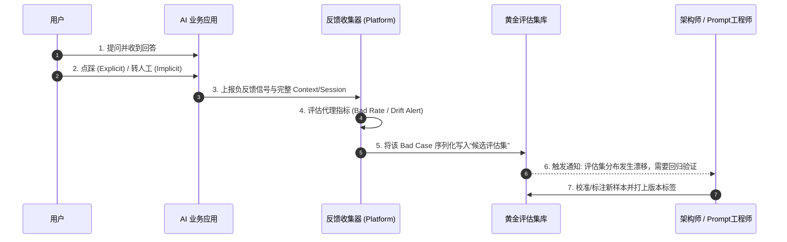
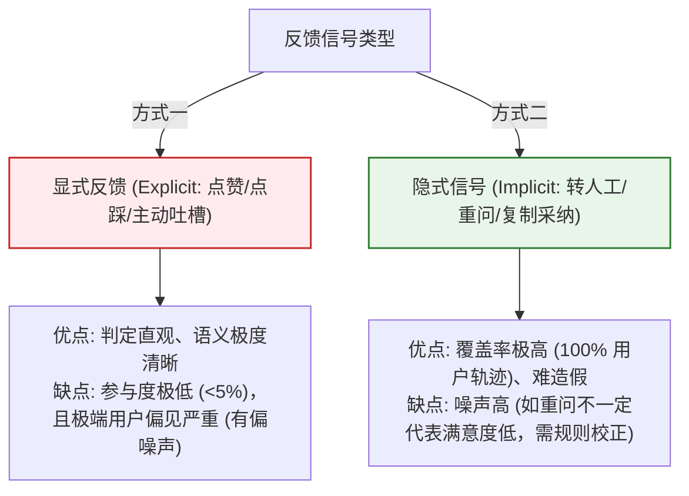

import GlossaryTerm from '@site/src/components/GlossaryTerm';
import GuidedExercise from '@site/src/components/GuidedExercise';
import ResearchNote from '@site/src/components/ResearchNote';
import ChapterMeta from '@site/src/components/ChapterMeta';
import PyRunner from '@site/src/components/PyRunner';
import TradeoffExplorer from '@site/src/components/TradeoffExplorer';
import QuizCard from '@site/src/components/QuizCard';
import StepFlow from '@site/src/components/StepFlow';

# M11L3 · 在线评估与反馈

<ChapterMeta
  time="约 2 小时"
  prereqs={[{label: 'M11L2 评估体系', href: './evaluation-systems'}, {label: 'M6L7 可观测进阶', href: '../cloud-enterprise-industrial/observability-advanced'}, {label: 'M6L4 金丝雀发布', href: '../cloud-enterprise-industrial/autoscaling-rollout'}]}
  outcome="能把评估从‘上线前跑一次’扩展成‘上线后持续闭环’：线上质量监控、用户反馈信号、影子/灰度安全试新、分布漂移检测，并把线上 bad case 回流进评估集。"
  howToUse="先看“离线评估通过了线上还是翻车”，再学在线评估四件事，最后做反馈闭环 lab。"
/>

:::tip 离线评估 100 分，线上还是可能翻车
[离线评估集（M11L2）](./evaluation-systems) 是你上线前的考卷，但它永远只是真实世界的一个**样本**——真实用户会问你没想到的问题、用你没预料的方式、在数据分布悄悄变化之后。所以评估不能"上线前跑一次就完"，必须变成**持续闭环**：线上质量怎么样？用户满不满意？想改进时怎么安全地试？世界变了我知道吗？在线评估把这四件事做起来，让系统上线后仍然可测、可改进、能及时发现变坏。
:::

## 一、离线通过 ≠ 线上没问题

离线评估过了，线上仍可能出问题，因为：
- **覆盖不全**：评估集是你"想得到"的样本；真实用户总会问出评估集里没有的长尾问题。
- **分布会漂移**：用户问法、热点话题、上游数据随时间变化——[今天的评估集测的是昨天的世界](./cost-engineering)。
- **真实反馈只有线上有**：用户点没点赞、有没有重问、有没有转人工——这些"系统到底有没有帮上忙"的信号，离线拿不到。

所以要把评估延伸到线上：**持续监控 + 收集反馈 + 安全试新 + 检测漂移**，并把学到的回流进离线评估集，形成闭环。

## 二、三个核心概念（分层）

### 基础：线上质量监控与用户反馈

- <GlossaryTerm term="Online Evaluation" definition="在线评估：在生产环境持续监控 AI 系统的真实表现——用可自动计算的代理指标（拒答率、弃答率、重问率、转人工率、延迟、成本）和抽样人工/LLM 评审，及时发现质量下降。区别于上线前的离线评估。">在线评估</GlossaryTerm>：在生产持续量化质量。真实答案往往没有即时 gold，所以用**代理指标（proxy metrics）**：弃答/拒答率、用户重问率、转人工率、点踩率、延迟、成本——它们异常波动就是质量信号。再配**抽样评审**（[LLM-judge](../llm-systems/llm-evaluation) 或人工抽查线上样本打分）。
- <GlossaryTerm term="Feedback Signal" definition="反馈信号：从真实用户交互中收集的、关于 AI 输出好坏的信号，分显式（点赞/点踩、纠错、评分）和隐式（重问、放弃、转人工、复制采纳）。是改进系统和扩充评估集的一手数据。">用户反馈信号</GlossaryTerm>：显式（👍/👎、纠错、评分）+ 隐式（重问、放弃、转人工、复制采纳）。这是最宝贵的一手改进数据——**线上 bad case 要自动回流进[评估集（M11L2）](./evaluation-systems)**，防止同类问题复发。

### 进阶：安全地试新——影子与灰度

想改进（新 prompt/新模型/新检索）却怕搞砸线上？用[渐进发布（M6L4）](../cloud-enterprise-industrial/autoscaling-rollout) 的思路：
- <GlossaryTerm term="Shadow Evaluation" definition="影子评估：让新版本（新 prompt/模型）在真实线上流量上并行运行，但结果不返回给用户，只记录下来和线上版本对比。用真实流量安全地验证新版本，零用户风险。">影子评估（shadow）</GlossaryTerm>：新版本跟着真实流量跑、但结果**不给用户**，只记录对比——用真实流量验证、零用户风险。
- <GlossaryTerm term="A/B Testing" definition="A/B 测试：把用户随机分组，一组用旧版本、一组用新版本，用统计对比两组的质量/业务指标，判断新版本是否真的更好。用真实用户行为做有统计意义的决策。">A/B 测试 / 灰度</GlossaryTerm>：真的给一小部分用户新版本，用**真实行为指标**统计对比再决定放量。
- 二者结合离线评估：**离线挡住明显退化 → 影子验真实流量 → 灰度 A/B 看真实效果 → 放量**，一条从安全到自信的发布链。

### 深入（选学）：漂移检测与闭环

- <GlossaryTerm term="Distribution Drift" definition="分布漂移：生产环境的输入分布（用户问法、话题、上游数据）随时间偏离评估集/训练时的分布，导致模型表现悄悄下降。需监控输入特征分布和质量指标的变化来及时发现。">分布漂移（drift）</GlossaryTerm>：真实世界会变——用户问法变了、新话题出现了、上游数据换了。要监控输入分布和质量指标随时间的变化，**漂移触发告警和评估集更新**。不检测漂移，系统会"温水煮青蛙"式悄悄变差（[呼应 M6L7 SLO 告警](../cloud-enterprise-industrial/observability-advanced)）。
- **闭环才是重点**：在线评估的价值不在"发现问题"本身，而在**把线上学到的喂回去**：bad case → 评估集、漂移 → 更新样本和 prompt、反馈 → 改进方向。这个 **监控→发现→回流→改进→再监控** 的闭环，让系统随时间**越用越好**而非越用越旧。
- **反馈有偏，别盲信**：用户反馈是有偏的——爱吐槽的人点踩多、沉默的满意者不发声；显式反馈率低且不均。要结合隐式信号、抽样评审综合判断，别被少数大声的反馈带偏（[呼应 M11L2 评委/样本要校准](./evaluation-systems)）。
- **成本与隐私**：记录线上流量做评估要考虑成本（存储/评审）和[隐私合规（M11L7）](./risk-governance-frameworks)——用户数据用于评估要脱敏、要合规（[PII，M11L6](./platform-guardrails)）。

<ResearchNote
  title="在线评估：持续监控 + 反馈闭环 + 安全试新 + 漂移检测"
  source="ML 生产监控（Google Rules of ML）；A/B 与影子测试实践；M6L4 渐进发布 / M6L7 可观测"
  href="https://developers.google.com/machine-learning/guides/rules-of-ml"
  insight="离线评估集永远是真实世界的样本,覆盖不全且分布会漂移,真实反馈只有线上有。在线评估用代理指标(弃答/重问/转人工/延迟/成本)+抽样评审持续量化质量;显隐式反馈是一手改进数据要回流评估集。安全试新靠影子(零用户风险验真实流量)+A/B灰度(真实行为统计对比)。监控分布漂移防悄悄变差。核心是监控->回流->改进的闭环让系统越用越好。反馈有偏需综合判断,记录线上数据要顾隐私合规。"
  application="上线后建在线评估:代理指标监控+抽样评审;显隐式反馈+线上 bad case 自动回流评估集;改进用影子->灰度A/B安全放量;监控漂移触发告警和评估集更新。把它做成监控-回流-改进闭环。反馈结合隐式信号防偏。线上数据脱敏合规使用。"
/>

## 三、在线监控与反馈回流图解 (Deep Dive Diagrams)

本节展示在线评估持续闭环的数据流向、影子评估与灰度发布的安全检验链路，以及显式与隐式反馈信号的度量特征。

### 1. 结构全景：在线评估与反馈回流闭环系统 (ML Ops Loop)

```mermaid
graph TD
    classDef prod fill:#e1f5fe,stroke:#0288d1,stroke-width:1.5px;
    classDef collector fill:#fff9c4,stroke:#fbc02d,stroke-width:1.5px;
    classDef db fill:#e8f5e9,stroke:#2e7d32,stroke-width:1.5px;

    subgraph ProductionEnv ["生产环境 (运行态)"]
        User["用户交互"] -->|产生会话| App["AI 业务应用"]:::prod
        App -->|记录交互日志| Logger["可观测性 Log / Trace"]:::prod
    end

    subgraph EvaluationPlatform ["平台评估与闭环"]
        Logger -->|提取负信号| Detector["异常与坏例识别 (Drift/Bad Case Detector)"]:::collector
        Detector -->|自动回流| Recycler["坏例清洗与去噪 (Bad Case Recycler)"]:::collector
        
        Recycler -->|生成样本/标注| GoldSet["("黄金评估集 (Gold Set)")"]:::db
    end

    GoldSet -->|反馈拉取| OfflineCI["离线 CI 门禁评估"]
```

### 2. 控制流程：从生产异常发现到评估集演进的时序



### 3. 折中谱系：显式反馈与隐式信号对比



### 4. 步骤流演示：线上 Bad Case 回流与免疫管线

<StepFlow
  steps={[
    {
      title: '信号抓取',
      desc: '用户执行了隐式或显式负反馈操作，平台拦截该 Session 轨迹并与 trace ID 关联。'
    },
    {
      title: '降噪脱敏',
      desc: '过滤无效噪声（如胡乱点踩），并利用 PII 模块对用户输入和模型输出做敏感隐私脱敏处理。'
    },
    {
      title: '准入评估',
      desc: '将 Bad Case 放入影子待评审区，由 LLM 评委判定是否为严重事实错误、幻觉或拒绝服务失败。'
    },
    {
      title: '合并演进',
      desc: '去重后正式合并入离线测试集。下一次 CI 合并时，该坏例即作为必考题防退化。'
    }
  ]}
/>

---

## 四、跟我做一遍：反馈闭环 + 影子对比

<PyRunner
  rows={46}
  expect="线上信号触发评估集回流、影子安全对比"
  code={`# 在线评估:用代理指标监控线上质量(无即时 gold)
class OnlineMonitor:
    def __init__(self):
        self.logs = []
        self.eval_set_additions = []      # 回流:bad case 进评估集
    def record(self, query, answer, feedback):
        # feedback: 'up'满意 / 'down'不满意 / 'reask'重问(隐式负信号)
        self.logs.append({"q": query, "a": answer, "fb": feedback})
        if feedback in ("down", "reask"):        # 负反馈 -> 回流评估集
            self.eval_set_additions.append({"input": query, "note": feedback})
    def proxy_metrics(self):
        n = len(self.logs)
        bad = sum(1 for x in self.logs if x["fb"] in ("down", "reask"))
        return {"total": n, "bad_rate": round(bad / n, 2) if n else 0}

mon = OnlineMonitor()
for q, a, fb in [("退货", "7天无理由", "up"), ("运费", "看重量", "reask"),
                 ("发票", "不清楚", "down"), ("时效", "3天", "up")]:
    mon.record(q, a, fb)
print("代理指标:", mon.proxy_metrics())          # bad_rate 是质量信号
print("回流评估集的 bad case:", mon.eval_set_additions)  # 防复发

# 影子评估:新版本跟真实流量跑,不给用户,只对比
def shadow_compare(traffic, current, candidate):
    diffs = []
    for q in traffic:
        c_out, n_out = current(q), candidate(q)   # 候选结果不返回用户
        if c_out != n_out:
            diffs.append({"q": q, "current": c_out, "candidate": n_out})
    return diffs

cur = lambda q: "标准答案:" + q
cand = lambda q: "新版答案:" + q                  # 待验证的新版本
print("影子差异(需人工/评估集裁定):", shadow_compare(["退货", "运费"], cur, cand))
print("线上信号触发评估集回流、影子安全对比")`}
/>

线上用代理指标（bad_rate）持续量化质量、把负反馈样本自动回流进评估集（防复发）；影子评估让新版本在真实流量上跑但不影响用户，安全地对比差异。这就是评估的持续闭环。**试试**：把 reask 也想象成一种隐式负信号；想想影子对比出的差异，怎么用[评估集或 LLM-judge](./evaluation-systems) 裁定"新版是真的更好还是更差"。

## 五、动手 Lab（必做）

打开 `labs/month11/m11l3_online/`：

```bash
python labs/month11/m11l3_online/test_online.py
```

实现在线评估闭环：代理指标监控、负反馈回流评估集、影子对比新版本。

<GuidedExercise
  title="练习指引：建在线评估闭环"
  goal="把‘线上监控 + 反馈回流 + 影子对比’做成闭环，让系统上线后仍可评、可改进。"
  hints={[
    'OnlineMonitor: record 日志 + proxy_metrics(bad_rate 等代理指标)。',
    '负反馈(down/reask)自动回流进 eval_set_additions(防复发)。',
    'shadow_compare: 候选版本跑真实流量但结果不返回用户,只记差异。',
    '闭环:监控->回流->改进->再监控。'
  ]}
  steps={[
    '实现 OnlineMonitor(record/proxy_metrics/回流)。',
    '实现 shadow_compare(current vs candidate,不影响用户)。',
    '(可选)加漂移检测:输入分布随时间变化告警。',
    '写测试:代理指标正确、负反馈回流、影子只记差异不返回、闭环成立。'
  ]}
  checks={[
    '我能解释离线评估为什么不够、在线评估补什么。',
    '我的 lab 有代理指标 + 反馈回流 + 影子对比。',
    '我知道怎么安全试新(离线->影子->灰度A/B->放量)。',
    '我理解闭环(回流)才是在线评估的重点、反馈有偏要综合判断。'
  ]}
/>

## 架构师深潜（Staff+ 视角）

### 1. 安全试新的手段

<TradeoffExplorer
  title="改进 AI 系统时验证新版本的方式"
  dimensions={['用户零风险', '反映真实效果', '统计可信', '速度快', '成本低']}
  options={[
    {
      name: '仅离线评估',
      scores: [5, 2, 3, 5, 5],
      note: '只在评估集上验。零用户风险、快、便宜。但覆盖不全、不反映真实流量/行为。',
      whenToUse: '第一道关,挡明显退化。'
    },
    {
      name: '影子评估',
      scores: [5, 4, 3, 3, 3],
      note: '真实流量跑、结果不给用户。零风险 + 真实输入。但拿不到用户真实行为反馈。',
      whenToUse: '离线之后、放量之前验真实流量。'
    },
    {
      name: 'A/B 灰度',
      scores: [2, 5, 5, 2, 3],
      note: '小流量真给用户、统计对比。最能反映真实效果、可信。但有用户风险、需足够样本量和时间。',
      whenToUse: '影子通过后,做最终放量决策。'
    }
  ]}
/>

### 2. 评估闭环 = AI 系统的"免疫系统"

把离线评估、在线监控、反馈回流、漂移检测合起来看，它其实是 AI 系统的**免疫系统**：离线评估是"上岗体检"（[M11L2](./evaluation-systems)）、在线监控是"持续体温计"、反馈回流是"记住每次生病并产生抗体"（bad case 进评估集防复发）、漂移检测是"发现环境变了要适应"。一个没有这套闭环的 AI 系统，就像没有免疫系统的生物——上线那天是它质量的巅峰，之后只会随世界变化、随长尾问题积累而**单调退化**，还浑然不觉，直到用户大量流失才发现。而有闭环的系统会**越用越强**：每个 bad case 都变成一次免疫、每次漂移都触发一次适应。这解释了一个反直觉现象：两个上线时质量相同的 AI 产品，半年后可能天差地别——差别不在模型，而在**有没有把评估做成持续闭环**。架构师最该向团队灌输的，不是"上线前评估要做好"，而是"**评估是永不结束的闭环，上线才是评估的开始**"。这也是为什么在线评估、反馈管道、影子/灰度设施，都应该[平台化（M11L1）](./why-ai-platform)——它们是每个 AI 应用的免疫系统底座，值得统一建设。

### 3. 真实案例：反馈信号的陷阱与正确用法

一个常见的翻车：团队上线了 👍/👎 按钮，然后**盲目照着点踩优化**——结果越优化越偏。为什么？因为显式反馈**严重有偏**：绝大多数用户（尤其满意的）根本不点，点的往往是极度不满或有特定诉求的少数；点踩还常常混入"用户自己问得不清楚""用户不喜欢正确但逆耳的答案"等噪声。只看点踩率，你优化的是"让爱吐槽的少数闭嘴"，而非"让多数人得到帮助"。正确用法是**多信号交叉验证**：显式反馈（👍👎）+ 隐式信号（重问率、放弃率、转人工率、复制采纳率——这些覆盖全体用户、更难造假）+ 抽样评审（[LLM-judge 或人工](../llm-systems/llm-evaluation) 抽查线上真实样本，给出无偏的质量基线）。三者拼在一起才是可信的线上质量画像。这背后是一个更普适的度量原则，贯穿 [M6L7 可观测](../cloud-enterprise-industrial/observability-advanced) 和 [M11L2 评估](./evaluation-systems)：**任何单一指标都会被优化扭曲（Goodhart），可靠的判断来自多个互补、难以同时造假的信号的交叉验证**。架构师设计反馈系统时，第一要务不是"加个点赞按钮"，而是设计一组**互补且各有偏差方向**的信号，让它们互相校正。

### 4. 架构师深问（给自己 30 分钟）

- 你的 AI 上线后还在被评估吗？还是上线即"停止体检"、只能靠用户流失才发现变差？
- 你的线上 bad case 会自动回流进评估集吗？系统是越用越强还是越用越旧？
- 你改进时怎么验证？敢直接全量上，还是有影子→灰度的安全链？你信单一反馈指标吗？

## 知识自测

<QuizCard
  questions={[
    {
      q: '为什么说上线后的“用户显式反馈信号（如 👍/👎）”不能盲目作为优化系统质量的唯一指标？',
      options: [
        'A. 因为显式反馈在传输过程中极易发生数据包丢失',
        'B. 因为显式反馈存在严重的“选择偏差（Selection Bias）”和噪声，满意用户往往保持沉默，且点踩行为可能夹杂大量非大模型错误的非技术因素',
        'C. 点赞和点踩属于非法网络资产，容易引发安全审计合规问题',
        'D. 显式反馈的分数无法与 Docusaurus 系统直接兼容'
      ],
      answer: 1,
      explain: '显式反馈的转化率通常低于 5%，且存在显著偏差——极度不满或有特殊吐槽诉求的用户倾向于高频点踩，而大量正常获得帮助的用户则保持沉默。因此，它只能作为信号之一，必须与覆盖全量用户的隐式信号（如转人工率、采纳率、重问率）以及抽样人工/模型评委相结合，才能得出准确的线上质量分布。'
    },
    {
      q: '在 AI 系统发布新版本（新 Prompt/新模型）时，以下哪项安全试新发布路径是架构师所推崇的？',
      options: [
        'A. 离线评估合格 -> 线上灰度 A/B 测试 -> 生产全量发布（省去影子测试以节省开销）',
        'B. 离线评估合格 -> 线上影子测试 (Shadow Evals) 观察真实分布 -> 小流量 A/B 灰度测试 -> 生产全量发布',
        'C. 影子测试合格 -> 离线系统评估 -> 生产全量发布',
        'D. 灰度 A/B 测试合格 -> 离线评估合格 -> 生产全量发布'
      ],
      answer: 1,
      explain: '这是一个从“零风险”到“统计可信”的发布防线：离线评估用来快速阻断已知缺陷；影子测试（Shadow）用真实线上请求输入进行并发测试，但不返回给用户，从而零风险地暴露长尾输入下的稳定性与分布差异；然后通过 A/B 灰度对部分用户返回新结果以获得行为验证；确认整体业务和技术指标无虞后，再做全量切流。'
    },
    {
      q: '关于在线评估中“分布漂移 (Distribution Drift)”的应对策略，以下最务实的是？',
      options: [
        'A. 一旦发现漂移，立刻下线 AI 系统，退回传统数据库查询',
        'B. 保持 Prompt 绝对不变，通过持续漂移测试，让用户去适应模型的行为习惯',
        'C. 监控输入分布与代理质量指标，当检测到漂移特征后，自动拉取新分布下的长尾 Bad Cases 扩充、演进离线评估集并重新调优模型/Prompt',
        'D. 增加模型温度（Temperature）至 1.5 以上，使模型随机应变'
      ],
      answer: 2,
      explain: '真实世界的用户行为是在演进的。分布漂移意味着当初设立的“模拟试卷”（离线评估集）已经跟不上面试要求了。正确做法是监控输入分布和错误率，当检测到漂移后，提取包含新特征的样本作为新的 Gold Set，重新微调/优化 Prompt 以适应漂移后的环境。'
    }
  ]}
/>

## 自检清单

- [ ] 我能解释离线评估为什么不够、在线评估用代理指标+反馈补什么。
- [ ] 我的系统有反馈闭环：线上 bad case 自动回流评估集防复发。
- [ ] 我能安全试新：离线→影子→灰度 A/B→放量。
- [ ] 我懂反馈有偏、要多信号交叉验证（防 Goodhart），并监控漂移。

## 常见误解

- **"离线评估过了就能放心上线"**：离线只是样本，覆盖不全会漂移，必须线上持续评估。
- **"上线就算完成了"**：上线才是评估的开始；没有闭环系统只会单调退化。
- **"照着用户点踩优化就对了"**：显式反馈严重有偏，要和隐式信号+抽样评审交叉验证。

## 延伸阅读

- [Google Rules of ML](https://developers.google.com/machine-learning/guides/rules-of-ml)
- [M6L4 金丝雀/渐进发布](../cloud-enterprise-industrial/autoscaling-rollout) · [M11L2 评估体系](./evaluation-systems)
- [下一课：AI 可观测性](./ai-observability)