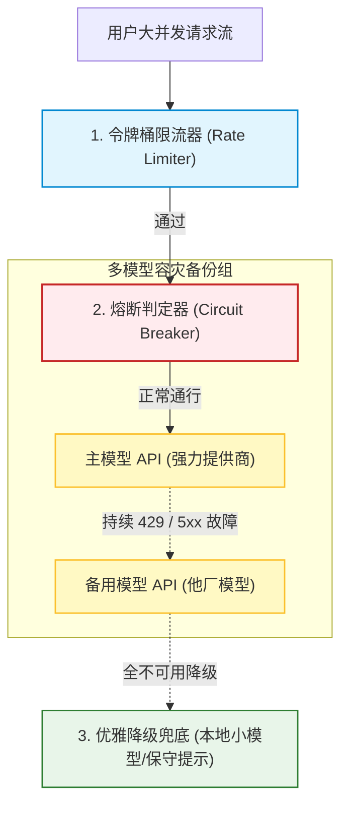
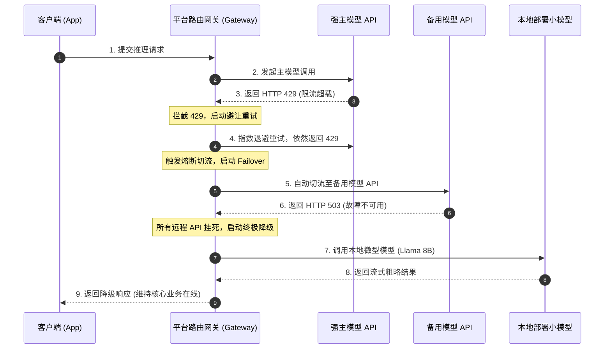
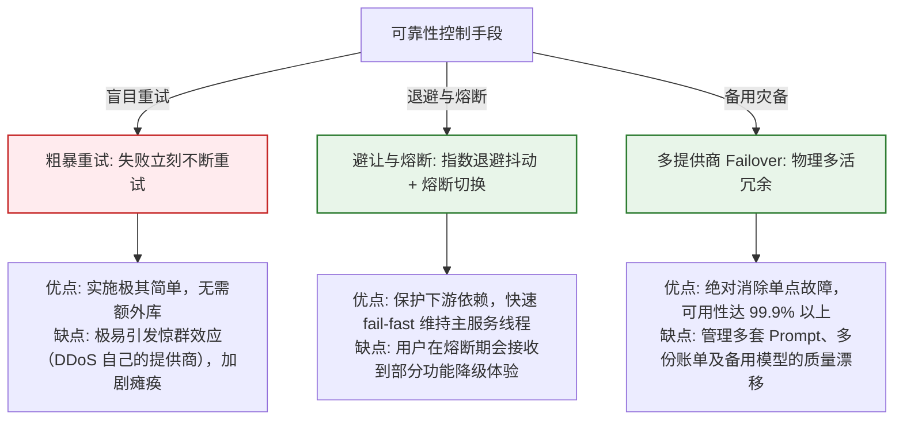

import GlossaryTerm from '@site/src/components/GlossaryTerm';
import GuidedExercise from '@site/src/components/GuidedExercise';
import ResearchNote from '@site/src/components/ResearchNote';
import ChapterMeta from '@site/src/components/ChapterMeta';
import PyRunner from '@site/src/components/PyRunner';
import TradeoffExplorer from '@site/src/components/TradeoffExplorer';
import QuizCard from '@site/src/components/QuizCard';
import SystemSimulator from '@site/src/components/SystemSimulator';

# M11L10 · 可靠性与容量

<ChapterMeta
  time="约 2 小时"
  prereqs={[{label: 'M5L6 熔断', href: '../core-components/circuit-breaker'}, {label: 'M5L7 重试退避', href: '../core-components/retry-backoff-timeout'}, {label: 'M2L4 SLA-SLO', href: '../system-design-bridge/sla-slo-availability'}]}
  outcome="能为 AI 系统做可靠性与容量设计：定义 AI 的 SLO、用限流/重试/熔断/降级抗依赖故障、用多模型冗余 failover、做容量规划，理解 AI 可靠性绝大部分是传统弹性工程的迁移。"
  howToUse="先看“模型 API 也会宕会限流”，再学 AI 的弹性与容量设计，最后做多模型 failover lab。"
/>

:::tip 你的 AI 依赖一个会限流、会宕、会变慢的外部服务
无论你用云端模型 API 还是自托管，它都是一个**会出问题的依赖**：会[限流（rate limit）](../core-components/rate-limiting) 拒绝你的请求、会偶发超时和错误、会在高峰变慢、偶尔整个宕掉。如果你的 AI 系统假设"模型调用永远秒回成功"，它一定会在依赖抖动时崩给用户看。好消息还是那句：**AI 可靠性绝大部分不是新问题**——给不可靠的外部依赖设计[SLO、限流、重试、熔断、降级、冗余（M2/M5）](../core-components/circuit-breaker)，你在前几个月已经全学过。这一课就是把这套弹性工程，套到"模型 API 这个特殊的外部依赖"上。
:::

## 一、模型 API 是你最不可控的依赖

AI 系统的可靠性风险，很大一部分来自模型这个依赖本身：
- **会限流**：模型 API 有 [QPS/token 速率限制](../core-components/rate-limiting)，超了就拒你（429）——高峰期尤其容易撞上。
- **会慢会抖**：[推理延迟本就高且方差大（M7L5/L7）](../llm-systems/llm-api-cost-latency)，高峰更慢，偶发超时。
- **会宕**：单个模型提供商/单个区域会有故障——把命全押在一个上就是[单点故障（M2L11）](../system-design-bridge/reliability-fault-tolerance)。
- **不可控**：云端模型你管不了它的容量和稳定性，只能在**你这一侧**做防护。

所以 AI 系统必须像对待任何[不可靠外部依赖](../core-components/circuit-breaker) 一样，主动设计"依赖出问题时我怎么办"。

## 二、三个核心概念（分层）

### 基础：AI 的 SLO 与弹性四件套

- <GlossaryTerm term="SLO for AI" definition="为 AI 系统定义的服务级目标：不仅有传统的可用性/延迟目标（如 P95 延迟、成功率），还应包含 AI 特有的质量目标（如答案可接受率、弃答率上限）和成本目标。是衡量与保障 AI 服务水平的契约。">AI 的 SLO</GlossaryTerm>：AI 也要有[服务级目标（M2L4）](../system-design-bridge/sla-slo-availability)——除了传统的可用性/延迟/成功率，还要加 AI 特有的**质量目标**（答案可接受率、弃答率上限）和**成本目标**。SLO 是你保障和衡量 AI 服务的契约。
- **弹性四件套（直接复用 M5）**：[限流](../core-components/rate-limiting)（保护自己不被打爆、也匹配上游配额）、[重试+退避+抖动](../core-components/retry-backoff-timeout)（应对偶发失败/429，但要幂等、要有上限防雪崩）、[熔断](../core-components/circuit-breaker)（模型持续失败时快速失败、别把线程全耗在等超时上）、[降级](./human-oversight-fallback)（模型不可用时退到缓存/规则/转人工，[M11L8](./human-oversight-fallback)）。**这套东西你已经会了，只是应用对象变成模型 API。**

### 进阶：多模型冗余与 failover

- <GlossaryTerm term="Multi-Model Failover" definition="多模型冗余与故障转移：为关键 AI 能力配置多个可替代的模型/提供商，当主模型限流、超时或宕机时自动切换到备用模型，避免单一模型成为单点故障。是 AI 的高可用手段。">多模型 failover</GlossaryTerm>：给关键能力配**多个可替代的模型/提供商**，主模型限流/宕机时自动切到备用——这就是[冗余消除单点（M2L11、M5L2）](../system-design-bridge/reliability-fault-tolerance) 用在模型上。备用可以是同厂商其他区域、别的厂商、或更小的本地模型（降级但可用）。
- **代价与权衡**：多模型要处理不同 API、不同能力、不同成本，还要[评估集保证备用模型质量可接受（M11L2）](./evaluation-systems)——冗余提升可用性但增加复杂度，按关键程度决定要不要上。

### 深入（选学）：容量规划与 AI 的特殊性

- <GlossaryTerm term="Capacity Planning (AI)" definition="AI 容量规划：预估 AI 系统的请求量、token 吞吐、并发和峰值，据此规划模型 API 配额、自托管 GPU 资源、缓存与队列，确保高峰不被限流/拖垮，同时不为闲置资源过度付费。">容量规划</GlossaryTerm>：预估请求量、token 吞吐、并发峰值，据此规划[配额、GPU 资源、缓存、队列（M5/M6 容量）](../system-design-bridge/capacity-estimation)。AI 的特殊点：容量单位常是 **token/秒**而非请求/秒（一个长请求 = 很多 token）；[GPU 资源贵且有限（M7L7 推理服务）](../llm-systems/kv-cache-serving)，自托管要平衡利用率和排队延迟。
- **削峰填谷**：非实时的 AI 任务（批量分析、离线生成）可以[排队异步处理（M3 队列）](../data-cache-queue/consistency-patterns)、错峰跑，避开高峰、提高资源利用率、降本——不是所有 AI 请求都要实时。
- **可靠性 vs 成本 vs 延迟**：多冗余更可靠但更贵、更多重试更可靠但更慢——又是那个[三角权衡（M11L9、M2）](./cost-engineering)，按 SLO 和业务重要性定，别盲目堆冗余。
- **别忘了 AI 特有的"软故障"**：传统故障是"挂了/超时"（硬故障），AI 还有"[答得不对但没报错](./evaluation-systems)"（软故障）——可靠性不只是"有没有响应"，还包括"响应质不质量"。所以 AI 可靠性要把[质量监控（M11L3）](./online-eval-feedback) 也算进来，不能只盯可用性。
- **平台化**：限流、重试、熔断、多模型 failover、配额管理——做成 [AI 平台/网关（M11L11）](./ai-platform-architecture) 的统一能力，每个应用就不用各自重造弹性逻辑，还能统一调度配额。

<ResearchNote
  title="AI 可靠性与容量：传统弹性工程 + AI 特有的软故障与 token 容量"
  source="Google SRE (SLO/容量)；M5 弹性模式 / M2 SLA-SLO 容量；AI 推理服务实践"
  href="https://sre.google/sre-book/service-level-objectives/"
  insight="模型 API 是会限流/超时/宕机的不可控外部依赖,AI 可靠性 90% 是传统弹性工程的迁移:定 SLO(加质量/成本目标)、限流+重试退避+熔断+降级四件套、多模型冗余 failover 消除单点。容量规划按 token/秒而非请求/秒、GPU 贵有限要平衡利用率与排队,非实时任务排队削峰。可靠性-成本-延迟三角权衡按 SLO 定。AI 独有软故障(答错但不报错),可靠性要含质量监控不只可用性。这些做成平台/网关统一能力。"
  application="把模型当不可靠外部依赖:设 AI SLO(可用+延迟+质量+成本);加限流/重试退避幂等/熔断/降级;关键能力配多模型 failover(备用要过评估)。容量按 token 吞吐规划、非实时任务异步削峰。可靠性含质量监控(软故障)。弹性/failover/配额做成平台网关统一能力,别每个应用重造。"
/>

## 三、可靠性防护与高可用图解 (Deep Dive Diagrams)

本节展示 AI 系统可靠性防御（熔断、限流、重试）的纵深架构、多模型故障转移（Failover）控制流，以及高可用保障策略的系统折中。

### 1. 结构全景：大模型可靠性弹性防护架构



### 2. 控制流程：多模型冗余级联 Failover 序列



### 3. 折中谱系：可靠性策略与资源开销折中



### 4. 模拟器演练：Token Bucket 限流与限额保护

在遭遇高并发流量或成本攻击时，限流是保护系统底线的重要防御手段。下面展示了平台级令牌桶限流模拟器，可实时观测令牌生成速率与拦截效果。

<SystemSimulator type="token-bucket" />

---

## 三、跟我做一遍：多模型 failover + 熔断降级

<PyRunner
  rows={52}
  expect="主模型故障自动切备用、都不可用则降级"
  code={`import random

class ModelClient:
    def __init__(self, name, fail_rate):
        self.name = name
        self.fail_rate = fail_rate      # 模拟限流/超时/宕机概率
    def call(self, prompt, rng):
        if rng.random() < self.fail_rate:
            raise RuntimeError(self.name + " 失败(限流/超时)")
        return self.name + " 的回答"

def with_retry(client, prompt, rng, max_retry=2):
    for attempt in range(max_retry + 1):
        try:
            return client.call(prompt, rng)
        except RuntimeError:
            if attempt == max_retry:
                raise                    # 重试耗尽 -> 上抛,交给 failover
            # (真实中此处指数退避+抖动, 见 M5L7)

def answer(prompt, models, rng):
    # 多模型 failover:主模型不行就切备用(消除单点)
    for client in models:
        try:
            return {"ok": True, "model": client.name,
                    "answer": with_retry(client, prompt, rng)}
        except RuntimeError:
            continue                     # 这个模型不可用,试下一个
    # 全部不可用 -> 优雅降级(缓存/规则/转人工),不崩溃
    return {"ok": False, "answer": "降级: 所有模型不可用 -> 转人工/返回缓存"}

# 主模型很不稳(0.8 失败)、备用较稳(0.3)、兜底本地(0.1)
primary  = ModelClient("主模型(强)", 0.8)
backup   = ModelClient("备用(他厂)", 0.3)
fallback = ModelClient("本地小模型", 0.1)
models = [primary, backup, fallback]

rng = random.Random(42)
for i in range(5):
    print(f"请求{i}:", answer("问题", models, rng))
print("主模型故障自动切备用、都不可用则降级")`}
/>

主模型不稳定时，请求自动重试、失败就 failover 到备用模型，全部不可用才优雅降级转人工——单个模型的抖动不再直接砸给用户。这就是弹性四件套 + 多模型冗余用在 AI 上。**试试**：把所有模型 fail_rate 调到 0.9，看降级如何兜底；想想为什么 failover 顺序是"强→他厂→本地小模型"（可用性优先于能力，[呼应 M11L8 优雅降级](./human-oversight-fallback)）。

## 五、动手 Lab（必做）

打开 `labs/month11/m11l10_reliability/`：

```bash
python labs/month11/m11l10_reliability/test_reliability.py
```

实现 AI 弹性：重试、多模型 failover、全部失败时降级、简单容量/配额检查。

<GuidedExercise
  title="练习指引：给 AI 加弹性与冗余"
  goal="把‘重试 + 多模型 failover + 降级’做成代码，让单个模型抖动不砸给用户。"
  hints={[
    'with_retry：失败重试到上限,仍失败则上抛。',
    'answer：依次试各模型(failover),全失败则降级。',
    'failover 顺序:可用性优先(强->他厂->本地兜底)。',
    '(可选)配额检查:超 token/请求配额则限流。'
  ]}
  steps={[
    '实现 with_retry(模型调用 + 重试上限)。',
    '实现 answer(多模型 failover + 全失败降级)。',
    '(可选)加容量/配额守卫。',
    '写测试:重试生效、主失败切备用、全失败降级、顺序正确。'
  ]}
  checks={[
    '我能把模型当不可靠外部依赖、用弹性四件套防护。',
    '我的 lab 有重试、多模型 failover、优雅降级。',
    '我知道 AI 的 SLO 要含质量、容量按 token 规划。',
    '我理解 AI 可靠性大部分是传统弹性工程的迁移。'
  ]}
/>

## 架构师深潜（Staff+ 视角）

### 1. AI 高可用手段

<TradeoffExplorer
  title="AI 系统的可靠性手段"
  dimensions={['抗依赖故障', '不增延迟', '实施简单', '成本低', '必要性']}
  options={[
    {
      name: '重试+退避',
      scores: [3, 2, 4, 5, 5],
      note: '应对偶发失败/429。简单便宜。但增延迟、要幂等、要防重试风暴。',
      whenToUse: '所有外部模型调用的基础。'
    },
    {
      name: '熔断+降级',
      scores: [4, 5, 3, 4, 5],
      note: '持续失败快速失败+退到备用方案。防拖垮、保基本可用。',
      whenToUse: '所有生产 AI,防级联失败。'
    },
    {
      name: '多模型 failover',
      scores: [5, 4, 2, 2, 4],
      note: '主宕切备用,消除单点。可用性最高。但要管多 API/多成本/备用质量。',
      whenToUse: '关键 AI 能力、高可用要求。'
    }
  ]}
/>

### 2. AI 可靠性最大的认知升级：从"有没有响应"到"响应对不对"

传统系统可靠性的核心问题是**可用性**——服务在不在、响不响应、多快响应。这些在 AI 里全都适用（[SLO、限流、熔断、冗余](../core-components/circuit-breaker)），但 AI 引入了一个传统系统几乎没有的维度：**软故障**——系统响应了、没报任何错、延迟也正常，但**答案是错的**。一个传统 API 返回了 200 OK 通常就意味着成功；一个 LLM 返回了一段流畅的文字，却可能是幻觉、是被注入操纵的、是答非所问。这意味着 **AI 的可靠性不能只靠传统的可用性监控**——你的 P99 延迟完美、成功率 99.99%，用户却在被喂错误答案，而你的传统监控一片绿。所以 AI 可靠性必须把[质量监控（M11L3 在线评估）](./online-eval-feedback) 和[评估（M11L2）](./evaluation-systems) 纳入"可靠性"的定义：一个 AI 系统"可靠"，不仅是"它在且快"，更是"它在且快且答得对"。这是架构师做 AI 可靠性时最需要的认知升级——**把可靠性从"响应的有无快慢"扩展到"响应的质量"**。它也解释了为什么本月的评估、可观测、可靠性三块是深度交织的：[可观测（M11L4）](./ai-observability) 让你同时看见硬故障和软故障、[评估（M11L2/L3）](./evaluation-systems) 定义"答得对"的标准、可靠性工程（本课）既要保住"响应"也要保住"质量"。一个只会做传统弹性、不懂 AI 软故障的团队，会做出一个"永远在线地给出错误答案"的系统——技术指标全绿，用户信任崩塌。

### 3. 真实案例：模型提供商限流引发的连锁反应，与正确的防护

一个高频真实事故：某产品全押在单一模型提供商上，某天该提供商因为全网流量高峰对所有客户收紧限流，你的请求大面积收到 429。**没有弹性设计的系统**会发生连锁灾难：请求失败 → [简单粗暴地立即重试](../core-components/retry-backoff-timeout) → 重试风暴进一步加剧限流（[惊群/重试放大，M5L7](../core-components/retry-backoff-timeout)）→ 用户线程全卡在等待和重试上 → [级联拖垮整个服务（M5L6）](../core-components/circuit-breaker) → 本来只是"AI 功能降级"变成"整个产品瘫痪"。**有弹性设计的系统**则平稳很多：[指数退避+抖动的重试](../core-components/retry-backoff-timeout) 避免重试风暴、[熔断器](../core-components/circuit-breaker) 在持续 429 时快速失败不再徒劳等待、[failover](../system-design-bridge/reliability-fault-tolerance) 自动切到备用提供商或本地小模型、真不行就[降级转人工/返回缓存（M11L8）](./human-oversight-fallback)——用户可能感到 AI 功能暂时变弱，但核心产品不瘫、体验有底线。事后复盘还会推动架构改进：关键能力不该单点依赖一个提供商、要有多模型冗余、要有明确的降级路径。这个案例几乎是 [M5 弹性模式](../core-components/circuit-breaker) 的教科书重演，只是主角从"某个微服务"换成了"模型 API"——再一次印证本月和全书的主线：**AI 系统的可靠性，绝大部分是把成熟的分布式系统弹性工程，正确地应用到"模型这个特殊而不可控的依赖"上**。谁有扎实的弹性工程功底，谁就能让 AI 系统在依赖抖动时优雅地弯曲而非骤然折断。

### 4. 架构师深问（给自己 30 分钟）

- 你的 AI 系统假设模型调用永远成功吗？限流/超时/宕机时，有重试/熔断/降级兜底吗？
- 你的关键 AI 能力单点依赖一个模型/提供商吗？有多模型 failover 吗，还是它一宕你就全宕？
- 你的可靠性只盯可用性吗？有没有监控"软故障"（在线地答错但不报错）？

## 知识自测

<QuizCard
  questions={[
    {
      q: '在 AI 可靠性工程设计中，以下关于大模型故障重试策略的描述，最符合生产级高可用要求的是？',
      options: [
        'A. 一旦请求超时，立刻高频自旋重试，直到拿到结果为止',
        'B. 采用“指数退避与随机抖动（Exponential Backoff with Jitter）”重试机制，防止大量失败请求在同一精确时间戳对模型提供商发起二次冲击，并设立重试上限',
        'C. 永远禁止重试，任何失败一律直接弹窗报错给终端用户',
        'D. 仅仅在 GPU 降温时才进行重试，因为过热会导致 429 报错'
      ],
      answer: 1,
      explain: '429 报错（Too Many Requests）或 503 报错通常代表模型服务器已超载。如果在相同的时间间隔内发起密集重试（如每隔 100ms 重试一次），会产生重试放大，即惊群效应，导致本已脆弱的服务器彻底宕机。指数退避（逐渐拉长重试间隔）配合随机抖动（打散重试时间戳）能以最大概率让服务器在间歇期处理成功。'
    },
    {
      q: 'AI 可靠性设计中引入了“软故障 (Soft Failure)”概念，作为 AI 平台架构师，以下关于软故障与硬故障的对比陈述中，正确的是：',
      options: [
        'A. 硬故障是返回了 200 OK 但语义错误，软故障是返回了 500 报错',
        'B. 软故障指系统返回了 200 OK 且响应流畅，但模型输出了幻觉、涉黄政等违规内容或被提示词注入劫持；硬故障是指远程服务器断网或超时。软故障无法通过传统的 HTTP 可用性指标发现，必须配合多维评估与护栏监控',
        'C. 软故障仅发生在开源模型中，闭源模型只会发生硬故障',
        'D. 软故障可以通过在 Docusaurus 中增加 Markdown 缓存完全杜绝'
      ],
      answer: 1,
      explain: '硬故障是确定性的，如网络断开、模型超时或返回 5xx 错误；而软故障是 AI 时代的特有灾难：系统状态码全绿，却给用户吐出了严重的幻觉或有害回答。架构师不能仅盯着传统 SLO 指标（如 HTTP 200 率），必须配合在线评估（Online Eval）和输出护栏（Output Guardrails）持续监测生成质量，才算做好了 AI 的可靠性工程。'
    },
    {
      q: '为消除模型提供商的单点故障风险（SPOF），多模型冗余 failover 成了核心手段。在 Failover 顺序的设计上，以下哪项最符合可用性优先原则？',
      options: [
        'A. 顺序随意，随机切换，只要有备用即可',
        'B. 主模型（强力提供商远程 API） -> 备用模型（备选远程 API） -> 本地部署开源小模型（优雅降级兜底）。让可用性底线最终由本地自主可控的节点把守',
        'C. 本地小模型 -> 备选远程 API -> 主强力远程 API，先用便宜小模型，不行再升级',
        'D. 永远不使用本地模型，在两个同地域的主模型实例之间打转'
      ],
      answer: 1,
      explain: '高可用要求“有底线兜底”。远程第三方 API（无论是主还是备）都受制于公网链路与第三方服务商的限流与宕机风险。将本地部署（本地物理集群/专有云）的开源模型作为 failover 链条的终点，能确保即使在全网断网、公网第三方全线崩溃的极端灾难下，系统依然能提供基础的问答降级，从而实现“优雅降级”。'
    }
  ]}
/>

## 自检清单

- [ ] 我能把模型 API 当不可靠外部依赖，用限流/重试/熔断/降级四件套防护。
- [ ] 我给关键 AI 能力设计了多模型 failover 消除单点。
- [ ] 我的 AI SLO 含质量和成本目标，可靠性含软故障（质量）监控。
- [ ] 我理解 AI 可靠性绝大部分是传统弹性工程的迁移、容量按 token 规划。

## 常见误解

- **"模型 API 很稳定，不用做弹性"**：它会限流/超时/宕机，是你最不可控的依赖，必须防护。
- **"返回了响应就算成功"**：AI 有软故障（答错但不报错），可靠性要含质量监控。
- **"AI 可靠性是全新课题"**：90% 是传统弹性工程（M2/M5）迁移到模型这个依赖上。

## 延伸阅读

- [Google SRE: Service Level Objectives](https://sre.google/sre-book/service-level-objectives/)
- [M5L6 熔断](../core-components/circuit-breaker) · [M5L7 重试退避超时](../core-components/retry-backoff-timeout)
- [下一课：AI 平台架构](./ai-platform-architecture)
