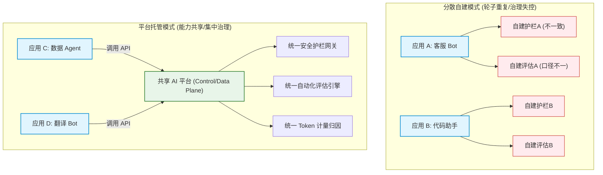
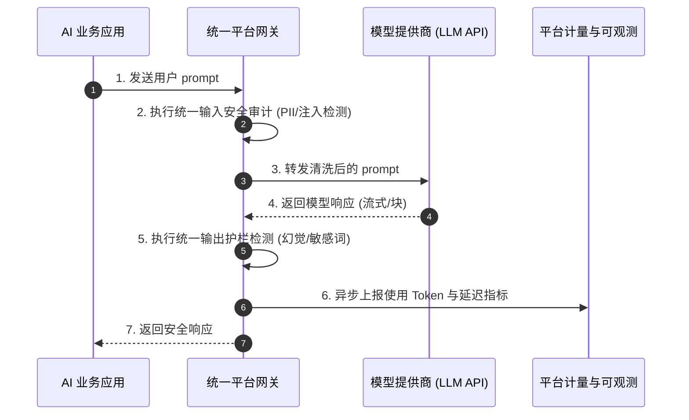
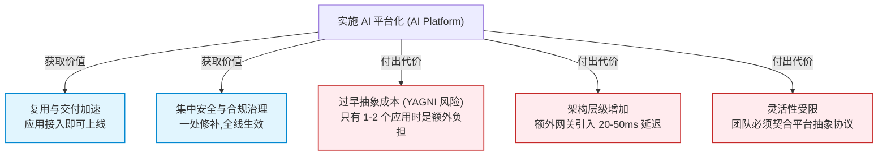

import GlossaryTerm from '@site/src/components/GlossaryTerm';
import GuidedExercise from '@site/src/components/GuidedExercise';
import ResearchNote from '@site/src/components/ResearchNote';
import ChapterMeta from '@site/src/components/ChapterMeta';
import PyRunner from '@site/src/components/PyRunner';
import TradeoffExplorer from '@site/src/components/TradeoffExplorer';
import QuizCard from '@site/src/components/QuizCard';

# M11L1 · 为什么需要 AI 平台

<ChapterMeta
  time="约 2 小时"
  prereqs={[{label: 'M7L12 LLM 应用', href: '../llm-systems/capstone-llm-app'}, {label: 'M6L9 多云抽象', href: '../cloud-enterprise-industrial/multi-cloud'}, {label: 'M2 架构方法论', href: '../system-design-bridge/design-methodology'}]}
  outcome="理解为什么公司到一定规模需要 AI 平台（把评估/观测/护栏/成本等共性能力沉淀成共享服务），以及平台的代价与何时不该过早平台化。"
  howToUse="先看“三个团队各搭一遍”的痛，再学平台化的价值与边界，最后做共享能力抽象 lab。"
/>

:::tip 当你有第二个、第三个 AI 应用时，一个新问题出现了
第一个 AI 应用，你把评估、观测、护栏、成本控制都塞进它自己的代码里——没问题。但当公司里有了第二个、第三个、第十个 AI 应用，每个团队都**重新搭一遍**评估框架、每个都**各自**接观测、每个都**自己**写一套护栏、每个都**分别**管成本——重复劳动、质量参差、治理失控（安全团队没法统一管十套不同的护栏）。**AI 平台**就是把这些共性能力抽出来、做成共享服务，让每个 AI 应用**复用**而非重造。但平台不是免费的——建早了、建过了都是负担。
:::

## 一、三个团队，三套评估、三套护栏、三套成本报表

想象一家公司有三个 AI 团队：客服 bot、代码助手、数据分析 Agent。没有平台时：
- **评估重复**：三个团队各写各的评估集框架、各自定义指标、各搭各的 CI 门禁——轮子造了三遍，还互不一致。
- **观测割裂**：三套不同的追踪/日志，出了跨团队问题没法统一看，成本也各报各的、公司层面看不清总账。
- **护栏不一致**：三套不同的输入输出过滤、PII 处理、内容安全——安全团队要审三套、漏洞各不相同，治理是噩梦。
- **合规无法统一**：审计、模型卡、责任追溯每个团队做法不同，公司层面无法给出一致的合规答复。

这不是"模型不够好"的问题，而是**共性工程能力没有被复用和统一治理**的问题——正是[平台工程（platform engineering）](../cloud-enterprise-industrial/infrastructure-as-code) 要解决的。

## 二、三个核心概念（分层）

### 基础：AI 平台是什么

<GlossaryTerm term="AI Platform" definition="AI 平台：把多个 AI 应用共需的能力（评估、可观测、护栏安全、成本控制、模型网关等）抽取为共享的服务/基础设施，让各团队复用而非各自重造，并支持统一治理。类似内部开发者平台，但聚焦 AI 特有的共性能力。">AI 平台</GlossaryTerm>：把多个 AI 应用**共同需要**的能力——评估、可观测、护栏安全、成本控制、[模型网关（M11L11）](./ai-platform-architecture)——抽出来做成共享服务，各团队**复用**而非各自重造。它是[内部开发者平台（IDP）](../cloud-enterprise-industrial/infrastructure-as-code) 在 AI 语境下的对应物：**把重复的、需要统一治理的底座沉淀下来，让应用团队专注业务**。本月后面 11 课讲的每一块（评估/观测/护栏/成本），既是单个应用要做的事，也是平台要提供的共享能力。

### 进阶：平台的两个核心价值——复用与治理

- **复用（效率）**：共性能力做一遍、大家用——新 AI 应用不用从零搭评估/观测/护栏，接入平台即可，上线快得多（[呼应 M6 平台化让交付快](../cloud-enterprise-industrial/cicd-pipelines)）。
- <GlossaryTerm term="Centralized Governance" definition="集中治理：通过统一的平台把安全、合规、成本、质量的策略集中实施和监控，而不是依赖每个团队各自遵守。让组织能一致地管控风险、审计和优化。">集中治理</GlossaryTerm>（安全/合规/成本）：这是 AI 平台**比普通平台更关键**的价值——AI 有独特的安全合规风险（[注入、泄露、越权、幻觉](./llm-threat-modeling)），必须**统一管控**：一处更新护栏全线生效、公司级看清所有 AI 的成本和风险、审计有统一口径。分散治理在 AI 时代几乎必然失控。

### 深入（选学）：平台的代价与"何时不该平台化"

- **平台不是免费的**：建平台要投入、要维护、会引入抽象层（多一层就多一份复杂度和限制）。用平台的团队要迁就平台的约定，牺牲一部分灵活性。**平台的收益只有在"有足够多应用复用"时才盖过它的成本**。
- **别过早平台化（关键克制）**：只有一两个 AI 应用时，抽平台是[过度工程（YAGNI，M4L1）](../design-patterns-lld/change-driven-design)——你还不知道共性长什么样，抽出来的往往是错的抽象。**正确顺序：先让两三个应用各自跑起来，看清真正的共性，再把重复的部分沉淀成平台。** 这和 [M2 别一上来就微服务、M10L1 别默认多 Agent](../multi-agent-protocols/why-multi-agent) 是同一个克制——**先解决问题，共性浮现了再抽象**。
- **平台演进而非一步到位**：好平台是从真实应用里"长"出来的，不是设计师凭空设计的。通常从最痛的一块开始（往往是[评估](./evaluation-systems) 或 [成本/网关](./cost-engineering)），逐步扩展（[呼应 M11L11 平台演进](./ai-platform-architecture)）。
- **平台 vs 团队自主的张力**：太强的平台约束会拖慢创新、逼团队"绕过平台"；太弱又治理不住。架构师要平衡——通常做法是**核心安全/合规强制（不可绕过），性能/灵活性可选**（[呼应 M6L9 抽象要恰当](../cloud-enterprise-industrial/multi-cloud)）。

<ResearchNote
  title="平台工程：复用共性 + 集中治理，但要避免过早/过度抽象"
  source="Platform Engineering / Internal Developer Platform；Team Topologies (Skelton & Pais)；ThoughtWorks 平台即产品"
  href="https://martinfowler.com/articles/platform-prerequisites.html"
  insight="多个应用共需的能力沉淀为平台可复用+统一治理，AI 场景里治理(安全/合规/成本/风险)尤其关键。但平台有成本(投入/维护/抽象约束),收益只在足够多应用复用时才盖过成本。过早平台化=错误抽象(还没看清共性)。正确是先让若干应用跑起来、共性浮现再抽象,平台从真实需求演进而非凭空设计。核心安全合规强制、其余可选,平衡治理与团队自主。"
  application="有多个 AI 应用且共性明确时才建平台,从最痛的共性(评估/成本/网关)起步、逐步演进。只有 1-2 个应用先别抽平台(YAGNI)。平台把安全合规护栏做成强制统一(AI 风险不能分散治理)、性能灵活做成可选。把平台当产品来运营。"
/>

## 三、AI 平台化架构与折中图解 (Deep Dive Diagrams)

本节展示多应用自建共性能力的重复与冲突、AI 平台集中治理与复用的参考拓扑，以及平台化演进中的组织与技术折中。

### 1. 结构全景：多应用分散自建 vs. AI 平台统一托管



### 2. 控制流程：基于共享平台能力的请求生命周期



### 3. 折中谱系：过早平台化与分散治理的级联折中



---

## 四、跟我做一遍：从重复到共享能力

<PyRunner
  rows={42}
  expect="共享平台能力被多个应用复用、统一治理"
  code={`# 没有平台:每个应用各自实现评估/护栏/成本(重复且不一致)
# 有平台:抽成共享能力,各应用复用 + 统一治理

class AIPlatform:
    """共享的 AI 平台能力(简化):评估、护栏、成本,统一提供与治理。"""
    def __init__(self):
        self.total_cost = 0                 # 集中治理:公司级成本总账
        self.blocked = 0                    # 集中治理:统一护栏拦截计数

    def guardrail(self, text):              # 统一护栏(一处更新全线生效)
        banned = {"密码", "转账"}
        hit = any(b in text for b in banned)
        if hit: self.blocked += 1
        return not hit

    def track_cost(self, app, tokens):      # 统一成本归因
        self.total_cost += tokens
        return {"app": app, "tokens": tokens}

    def evaluate(self, output, gold):       # 统一评估口径
        return output == gold

# 三个应用复用同一平台(而非各搭一套)
platform = AIPlatform()

def run_app(name, user_input, output, gold):
    if not platform.guardrail(user_input):        # 复用护栏
        return name + ": 被平台护栏拦截"
    platform.track_cost(name, len(output))        # 复用成本追踪
    ok = platform.evaluate(output, gold)          # 复用评估
    return name + ": " + ("通过" if ok else "未达标")

print(run_app("客服bot", "查订单", "已发货", "已发货"))
print(run_app("代码助手", "写函数", "def f(): ...", "def f(): ..."))
print(run_app("分析Agent", "帮我转账", "x", "x"))   # 命中统一护栏
# 公司级视角:一处看清所有应用的成本与风险
print("平台总成本:", platform.total_cost, "| 护栏拦截:", platform.blocked)
print("共享平台能力被多个应用复用、统一治理")`}
/>

三个应用复用同一套护栏、成本追踪、评估口径——不必各造一遍，且公司层面能统一看到总成本和风险（集中治理）。一处更新护栏，三个应用同时生效。**试试**：想象没有平台时要改护栏得改三处、还可能漏改一处；再想如果只有一个应用，这层 `AIPlatform` 抽象是不是反而多余（过早平台化）。

## 五、动手 Lab（必做）

打开 `labs/month11/m11l1_platform/`：

```bash
python labs/month11/m11l1_platform/test_platform.py
```

实现一个最小 AI 平台：共享护栏/成本/评估能力，被多个应用复用，并支持集中治理（统一更新护栏、公司级成本总账）。

<GuidedExercise
  title="练习指引：抽出共享平台能力"
  goal="把多个应用重复的护栏/成本/评估抽成共享平台，体会复用 + 集中治理，也理解何时不该抽。"
  hints={[
    'AIPlatform: guardrail/track_cost/evaluate 共享方法 + 治理状态(总成本/拦截数)。',
    '多个 app 调同一 platform 实例(复用),而非各自实现。',
    '集中治理:一处改护栏全线生效、公司级看总账。',
    '克制:只有一个 app 时不需要这层抽象(YAGNI)。'
  ]}
  steps={[
    '实现 AIPlatform(护栏/成本/评估 + 治理计数)。',
    '写 run_app 复用平台能力跑多个应用。',
    '演示统一护栏更新一处、全线生效。',
    '写测试:复用生效、护栏统一拦截、成本汇总、评估口径一致。'
  ]}
  checks={[
    '我能解释 AI 平台的两个核心价值(复用 + 集中治理)。',
    '我的 lab 让多个应用复用共享能力并统一治理。',
    '我知道为什么 AI 的治理尤其需要集中(安全合规风险)。',
    '我理解何时不该平台化(过早=错误抽象，YAGNI)。'
  ]}
/>

## 架构师深潜（Staff+ 视角）

### 1. 共性能力：各自造 vs 平台化

<TradeoffExplorer
  title="AI 共性能力（评估/观测/护栏/成本）的组织方式"
  dimensions={['起步快', '复用/效率', '统一治理', '团队灵活', '规模化']}
  options={[
    {
      name: '各应用自建',
      scores: [5, 1, 1, 5, 1],
      note: '每个应用自己搭。起步最快、最灵活。但重复造轮子、质量参差、无法统一治理。',
      whenToUse: '只有 1-2 个 AI 应用、共性未明。'
    },
    {
      name: 'AI 平台(共享)',
      scores: [2, 5, 5, 3, 5],
      note: '共性沉淀为共享服务。复用高、治理强、规模化好。但要建设投入、有抽象约束。',
      whenToUse: '多个 AI 应用、共性明确、需统一治理。'
    },
    {
      name: '轻量共享库',
      scores: [4, 4, 3, 4, 3],
      note: '把共性做成库而非平台服务。折中:复用一部分、约束轻。治理弱于平台。',
      whenToUse: '共性初显、还不确定要不要重平台。'
    }
  ]}
/>

### 2. 为什么 AI 平台的"治理"权重远高于普通平台

普通内部开发者平台的主卖点是**效率复用**——治理是附带好处。但 AI 平台反过来：**治理往往是第一驱动力**。原因是 AI 系统的风险是**新型的、分散时几乎不可控的**：一个团队的[提示注入漏洞](./llm-threat-modeling)、一次[PII 泄露](./platform-guardrails)、一个失控的[自主 Agent](../multi-agent-protocols/multi-agent-eval-safety)、一笔[失控的 token 账单](./cost-engineering)——任何一个都可能是公司级事故。如果每个团队各管各的护栏和合规，安全团队根本无法给出"我们所有 AI 都符合 X 标准"的答复，监管来了也交不了账。所以成熟组织的 AI 平台，**把安全、合规、成本这些"错一次就很贵"的能力做成强制统一的底座**：所有 AI 流量过统一的[护栏和网关](./ai-platform-architecture)、所有成本进统一的[归因和预算](./cost-engineering)、所有系统遵守统一的[风险治理框架](./risk-governance-frameworks)。这不是官僚，是**在 AI 风险面前，一致性本身就是安全性**——你没法保护你看不见、管不着的东西。架构师推动 AI 平台时，"统一治理不可绕过的风险"往往比"省了多少重复代码"更有说服力。

### 3. 真实案例：AI 平台如何从一个应用"长"出来

没有哪个好的 AI 平台是一开始就设计出来的——它们都是从真实痛点里逐步长出来的。典型路径：公司先有一个 AI 应用（比如客服 bot），团队在它里面搭了评估、护栏、成本追踪；第二个应用（代码助手）来了，团队发现"评估框架能直接搬"，于是把它抽成共享库；第三个应用来了，安全团队受不了"三套不同的护栏要审三遍"，于是推动把护栏和[模型网关](./ai-platform-architecture) 做成所有 AI 流量必经的统一服务；成本失控了，财务要一本总账，于是[成本归因和预算](./cost-engineering) 也上收到平台。**每一步都是被真实的痛驱动的，不是凭空规划的**——这正是 [M4 YAGNI](../design-patterns-lld/change-driven-design)、[M11L1 别过早平台化] 的活生生体现。反面教训同样常见：有的团队 AI 还没几个应用，就雄心勃勃先建一个"大而全的 AI 中台"，结果抽象全是猜的、没人爱用、团队纷纷绕过它自己搞，平台成了摆设和负担。**教训：平台要跟着真实需求演进，先让应用跑起来、共性浮现了再沉淀——过早的平台是最贵的过度工程之一。**

### 4. 架构师深问（给自己 30 分钟）

- 你们有几个 AI 应用？它们真的有足够多、足够稳定的共性值得抽平台了吗，还是你在过早平台化？
- 如果要抽，从哪块最痛的共性起步（评估？成本？护栏网关？）？哪些必须强制统一（安全合规）、哪些可选？
- 你的 AI 治理是分散在各团队（安全团队看不全）还是集中可控？监管问"你们所有 AI 都合规吗"你答得上来吗？

## 知识自测

<QuizCard
  questions={[
    {
      q: 'AI 平台的“集中治理”价值在安全/合规层面尤为突出，以下关于“分散治理”与“集中治理”的对比中，最准确的陈述是？',
      options: [
        'A. 分散治理只在开发期有优势，但集中治理能彻底消除任何形式的内容幻觉',
        'B. 分散治理会导致安全和合规策略在各个应用中不一致，面临审计合规风险；集中治理可实现一处修补、全线生效，但可能带来额外的请求延迟和架构复杂度',
        'C. 集中治理要求所有模型均部署在本地，而分散治理支持云端混合部署',
        'D. 集中治理能降低 90% 以上的 API 调用开销，因为可以进行本地缓存'
      ],
      answer: 1,
      explain: '集中治理通过统一入口管控输入输出护栏与计量，能确保组织的安全与成本底线。然而，额外增加的路由网关网元必然会引入微小的延迟开销（一般在20~50ms之间），同时也要求各应用接入时遵循平台契约，降低了部分极速创新的灵活性。'
    },
    {
      q: '在评估构建 AI 平台时，以下哪种情况属于典型的“过早平台化 (Premature Platformization)”？',
      options: [
        'A. 公司在只有 1 个处于 POC 探索阶段的 AI 应用时，就启动了全面的 AI 中台研发，并强行抽取未定型的评估与安全模型',
        'B. 在有 5 个应用且均遭遇大额账单时，平台团队决定搭建统一的 Token 账单大盘',
        'C. 在多个团队重复实现各自的 PII 脱敏算法后，平台将其抽取为共享库',
        'D. 在安全团队审计指出多套客服机器人内容过滤标准冲突时，上线了统一网关护栏'
      ],
      answer: 0,
      explain: '依据 YAGNI（You Aren\'t Gonna Need It）原则，平台化应是自下而上“长”出来的。在业务初期和共性未知时强行抽取未定型的能力，不仅无法给业务提效，反而会用错误且繁冗的抽象绑架业务，增加极高的废弃成本。'
    },
    {
      q: '对于平台的安全/合规这类“错一次就很贵”的模块，架构师通常倾向于将其设计为：',
      options: [
        'A. 核心安全合规强制统一，性能与灵活性部分则提供可选配置或共享库接入',
        'B. 全量强制执行，拒绝任何形式的业务自定义参数配置',
        'C. 完全由应用端自行决定是否采用，平台仅提供文档参考',
        'D. 仅在开发环境中强制，在生产环境中为了高吞吐全部旁路绕过'
      ],
      answer: 0,
      explain: 'AI 系统的风险（如提示注入、数据泄露）具有严重的连锁效应，安全合规策略必须强制统一执行以规避一票否决式的合规灾难。而对于具体的业务性能、定制开发等，平台应提供可选套件，以防止平台成为业务演进的瓶颈。'
    }
  ]}
/>

## 自检清单

- [ ] 我能解释 AI 平台的两大价值：复用（效率）+ 集中治理（安全/合规/成本）。
- [ ] 我理解为什么 AI 平台的治理权重远高于普通平台（新型风险、分散不可控）。
- [ ] 我的 lab 能把共性能力抽成共享平台、被多应用复用并统一治理。
- [ ] 我知道何时不该平台化（YAGNI/过早=错误抽象），平台要从真实需求演进。

## 常见误解

- **"有 AI 就该先建个 AI 中台"**：只有 1-2 个应用、共性未明时建平台是过早抽象，最贵的过度工程之一。
- **"平台主要是为了省重复代码"**：AI 平台里，统一治理（安全/合规/成本）往往比复用更关键。
- **"平台设计得越全越好"**：好平台从真实痛点逐步长出，大而全的空想中台通常没人用。

## 延伸阅读

- [Platform Engineering 前提条件 (Martin Fowler)](https://martinfowler.com/articles/platform-prerequisites.html)
- [M6L5 基础设施即代码](../cloud-enterprise-industrial/infrastructure-as-code) · [M4L1 变化驱动设计/YAGNI](../design-patterns-lld/change-driven-design)
- [下一课：评估体系](./evaluation-systems)