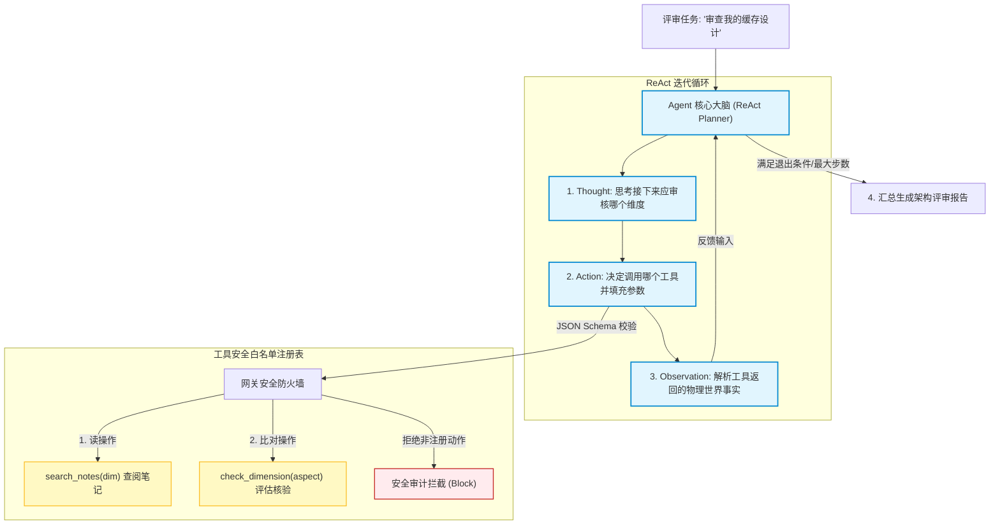
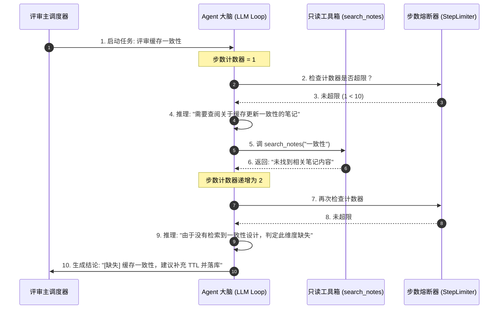
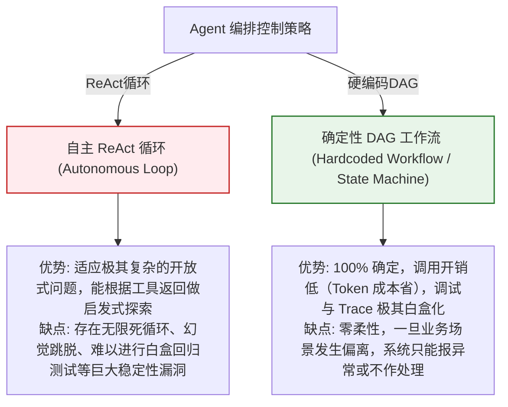

import GlossaryTerm from '@site/src/components/GlossaryTerm';
import GuidedExercise from '@site/src/components/GuidedExercise';
import ResearchNote from '@site/src/components/ResearchNote';
import ChapterMeta from '@site/src/components/ChapterMeta';
import PyRunner from '@site/src/components/PyRunner';
import TradeoffExplorer from '@site/src/components/TradeoffExplorer';
import QuizCard from '@site/src/components/QuizCard';
import StepFlow from '@site/src/components/StepFlow';

# M12L6 · Agent 与评审工具

<ChapterMeta
  time="约 3 小时"
  prereqs={[{label: 'M12L5 RAG 问答', href: './rag-qa-build'}, {label: 'M9L1 agent loop', href: '../agent-architectures/agent-loop-basics'}, {label: 'M9L4 停止预算', href: '../agent-architectures/stopping-budget'}]}
  outcome="能实现第二个核心用例：一个轻量 Agent，给定主题自主决定查什么、审什么，生成架构评审清单；且有工具边界、停止条件——该用 Agent 且克制地用。"
  howToUse="先看‘为什么这里值得用 Agent’，再落地有边界的 agent loop，最后建评审 Agent lab。"
/>

:::tip 第二个核心用例：让 Agent 帮你做架构评审
[RAG 问答（M12L5）](./rag-qa-build) 是"我问它答"。第二个用例更主动：给一个主题（比如"评审我的缓存设计"），让助手**自主地**去查相关笔记、逐项检查（有没有考虑缓存穿透？失效策略？一致性？），生成一份评审清单。这里[值得用 Agent（M9）](../agent-architectures/overview)——因为要根据主题**动态决定**查什么、审哪些点，不是固定流程。但正如 [M12L2 架构决策](./architecture-decisions) 定的：用 Agent，但要**克制**——[加严格的工具边界和停止条件（M9L2/L4）](../agent-architectures/stopping-budget)，别让它失控或过度。
:::

## 一、为什么这个用例值得用 Agent（而 RAG 问答不用）

对比两个用例，你能体会[何时该用 Agent（M9L11）](../agent-architectures/when-not-agent)：
- **RAG 问答**：流程固定（检索→答），[一步到位，不需要 Agent](../agent-architectures/when-not-agent)——用 Agent 是杀鸡用牛刀。
- **架构评审**：要根据主题**动态**决定——查哪些笔记？检查哪些维度？可能要多轮（先查设计、再逐项审、再汇总）。这种[需要自主决策、多步、动态的任务，才是 Agent 的用武之地（M9L1）](../agent-architectures/agent-loop-basics)。

**这个对比本身就是你架构判断力的展示**：同一个系统里，该用 workflow 的用 workflow、该用 Agent 的才用 Agent——[不是所有东西都套 Agent（M9L11）](../agent-architectures/when-not-agent)。

## 二、落地要点（分层）

### 基础：有工具的 agent loop

- <GlossaryTerm term="Agent Loop" definition="Agent 循环：observe（看当前状态/结果）→ decide（决定下一步做什么、调哪个工具）→ act（执行）的反复循环，直到任务完成或触发停止条件。是 Agent 自主完成多步任务的核心机制。">agent loop（M9L1）</GlossaryTerm>：observe → decide → act 循环——Agent 看当前进展、决定下一步（查笔记？审某维度？汇总？）、执行，直到评审完成。
- **工具**：给 Agent 定义好的工具——如 `search_notes(topic)`（复用[知识地基 M12L3](./knowledge-base-build)）、`check_dimension(aspect)`（检查某个架构维度）。[工具是 Agent 与世界交互的手（M9L2）](../agent-architectures/tools-and-boundaries)。

### 进阶：工具边界与停止条件

- <GlossaryTerm term="Tool Boundary" definition="工具边界：Agent 只能调用被显式授予的、白名单内的工具，每个工具有明确的输入 schema 和权限范围。防止 Agent 做越权或危险操作，是 Agent 安全的基础。">工具边界（M9L2）</GlossaryTerm>：Agent 只能调白名单内的工具——本项目的 Agent 只有"查笔记""检查维度"这类**只读、安全**的工具，[没有删除/写入等危险能力（最小权限）](../agent-architectures/tools-and-boundaries)。
- <GlossaryTerm term="Stopping Condition" definition="停止条件：限制 Agent 循环的机制——最大步数/轮次、预算上限、或任务完成判定。防止 Agent 无限循环、空转或烧爆成本，是 Agent 可控的关键。">停止条件（M9L4）</GlossaryTerm>：**必须有**——最大步数上限（防[无限循环/空转](../agent-architectures/stopping-budget)）、检查完所有维度就停。没有停止条件的 Agent 是定时炸弹。

### 深入（选学）：克制地用 Agent

- **轻量优先**：这个评审 Agent 不需要复杂的[规划、反思、多 Agent（M9/M10）](../agent-architectures/planning-decomposition)——一个"按维度清单逐项查审"的[轻量 Agent 就够](../agent-architectures/when-not-agent)。**能简单就别复杂**，是[贯穿 M9/M10 的克制](../multi-agent-protocols/why-multi-agent)。
- **每步可观测**：Agent 每一步（查了什么、审了什么、决定下一步做什么）都要[留 trace（M12L8）](./eval-observability-build)——这是[Agent 可调试、可展示的前提（M9L10）](../agent-architectures/agent-evaluation)，也是你展示时的亮点（让评审看到 Agent 的思考轨迹）。
- **评审结果也要 grounding**：Agent 生成的评审意见也应[基于检索到的实际笔记内容（M12L5 grounding）](./rag-qa-build)，而非空谈——"你的缓存设计没提到穿透防护"这个结论应该来自"检索发现笔记里确实没有相关内容"。
- **别让 Agent 越界**：评审 Agent 只产出**建议清单**，不自动改你的笔记、不执行任何有副作用的操作——[高自主 + 只读边界，是安全的组合（M9L9、M11L8）](../agent-architectures/agent-guardrails)。

<ResearchNote
  title="评审 Agent：有工具的 agent loop + 严格边界 + 停止条件，该用且克制"
  source="M9 Agent 全模块；M9L1 loop / M9L2 工具边界 / M9L4 停止 / M9L11 何时用"
  href="https://www.anthropic.com/research/building-effective-agents"
  insight="架构评审需按主题动态决定查什么审什么、多步,值得用Agent(区别于固定流程的RAG问答用workflow即可)。落地:agent loop(observe-decide-act)+定义好的只读工具(查笔记/检查维度,最小权限白名单)+必须的停止条件(最大步数防空转)。克制用轻量Agent即可、不上复杂规划反思多Agent。每步留trace(可调试可展示)。评审结论也要grounding(基于真实检索的笔记)。Agent只产建议不自动改笔记不做副作用操作(高自主+只读边界)。"
  application="评审Agent:agent loop按维度逐项查审、工具限只读白名单、设最大步数停止条件、留每步trace。克制用轻量Agent别过度。评审意见基于真实检索grounding。只产清单不做有副作用操作。用‘RAG问答用workflow、评审用Agent’展示该用才用的判断。"
/>

## 三、Agent 决策与 ReAct 循环图解 (Deep Dive Diagrams)

本节展示架构评审 Agent 的 ReAct (推理-行动-观察) 闭环、工具白名单边界管控时序，以及自主智能体与硬编码状态机的架构权衡。

### 1. 结构全景：架构评审 Agent (Architecture Review Agent) 逻辑拓扑



### 2. 控制流程：Agent 交互 ReAct 时序与限制退出序列



### 3. 折中谱系：自主 ReAct 智能体 vs. 确定性 DAG 状态机管线



### 4. 步骤流演示：ReAct 循环单轮推演时序

<StepFlow
  steps={[
    {
      title: 'Thought 思考分析',
      desc: '结合用户任务与已经执行过的历史动作，分析目前还缺少哪部分架构支撑，决定下一个攻关目标。'
    },
    {
      title: 'Action 工具生成',
      desc: '生成符合 JSON Schema 的工具请求（如指定调 search_notes 并传参 "缓存穿透" ），准备派发。'
    },
    {
      title: 'Observation 事实收集',
      desc: '在沙箱中执行该白名单工具，捕获标准输出或返回记录，将其作为新的一条 Observation 存入上下文。'
    },
    {
      title: 'Loop/Stop 判断',
      desc: '递增当前循环步数计数器。若达成所有审计维度或步数耗尽，立刻中断并生成 Markdown 评审大盘。'
    }
  ]}
/>

---

## 三、跟我做一遍：有边界的评审 Agent

<PyRunner
  rows={54}
  expect="Agent 按维度查审、有边界与停止、每步可追踪"
  code={`# 只读工具(白名单;最小权限——无删除/写入等危险能力)
NOTES = {"缓存穿透": "查不存在的键打到DB,可用布隆过滤器",
         "缓存失效": "TTL + 主动失效"}
def search_notes(topic):
    return NOTES.get(topic, "")                 # 只读

REVIEW_DIMENSIONS = ["缓存穿透", "缓存失效", "缓存一致性", "热点key"]

def review_agent(subject, dimensions, max_steps=10):
    trace, checklist = [], []
    for i, dim in enumerate(dimensions):        # 逐维度审(轻量 Agent)
        if i >= max_steps:                       # 停止条件:防空转/失控
            trace.append("STOP: 达步数上限")
            break
        found = search_notes(dim)                # act: 调只读工具
        trace.append(f"step{i}: 查'{dim}' -> {'命中' if found else '缺失'}")
        # grounding:结论基于真实检索
        if found:
            checklist.append(f"[OK] {dim}: 已覆盖({found[:12]}...)")
        else:
            checklist.append(f"[缺] {dim}: 笔记未提及,建议补充")
    return {"subject": subject, "checklist": checklist, "trace": trace}

result = review_agent("缓存设计评审", REVIEW_DIMENSIONS)
print("== 评审清单 ==")
for item in result["checklist"]:
    print(" ", item)
print("== Agent 轨迹(可展示/可调试) ==")
for t in result["trace"]:
    print(" ", t)
print("Agent 按维度查审、有边界与停止、每步可追踪")`}
/>

一个轻量评审 Agent：逐个架构维度调**只读工具**查笔记、基于真实检索给出"已覆盖/建议补充"的评审（grounding）、有**步数上限**防失控、每步**留 trace** 可展示可调试。它高自主（自己决定审哪些维度、给什么建议）但边界严格（只读、有上限、不改笔记）。**试试**：把 max_steps 设成 2，看停止条件如何截断；想想为什么这里用 Agent 合理、而[RAG 问答用 workflow 就够](./rag-qa-build)。

## 五、动手 Lab（必做）

打开 `labs/month12/m12l6_agent/`：

```bash
python labs/month12/m12l6_agent/test_agent.py
```

实现评审 Agent：逐维度调只读工具、grounding 评审、停止条件、每步 trace。

<GuidedExercise
  title="练习指引：实现有边界的评审 Agent"
  goal="做出第二个核心用例——一个该用 Agent、且克制地用（只读边界+停止条件）的评审助手。"
  hints={[
    '工具只读(search_notes),白名单,无危险能力。',
    'agent loop 逐维度查审;结论 grounding(基于真实检索)。',
    '停止条件:max_steps 防空转/失控(必须有)。',
    '每步留 trace(可展示可调试)。'
  ]}
  steps={[
    '定义只读工具和评审维度。',
    '实现 review_agent(逐维度 loop + grounding 评审)。',
    '加停止条件和 trace。',
    '写测试:逐维度审、缺失项能识别、停止条件生效、trace 完整。'
  ]}
  checks={[
    '我的评审 Agent 高自主但只读边界严格。',
    '我的 Agent 有停止条件、每步 trace。',
    '我的评审结论 grounding(基于真实笔记)。',
    '我能说清为什么这用 Agent、RAG 问答用 workflow(该用才用)。'
  ]}
/>

## 架构师深潜（Staff+ 视角）

### 1. 评审能力的实现方式

<TradeoffExplorer
  title="架构评审功能的实现方式"
  dimensions={['动态适应主题', '可控/可预测', '安全(边界)', '简单', '推荐度']}
  options={[
    {
      name: '固定 workflow',
      scores: [2, 5, 5, 5, 3],
      note: '写死一套检查步骤。可控、简单、安全。但不能按主题动态调整、僵硬。',
      whenToUse: '维度固定、不需动态的评审。'
    },
    {
      name: '轻量 Agent(推荐)',
      scores: [4, 4, 4, 3, 5],
      note: '自主按主题决定查审+只读边界+停止条件。动态又可控。',
      whenToUse: '需按主题动态、但要克制的评审。'
    },
    {
      name: '重型自主 Agent',
      scores: [5, 1, 2, 1, 1],
      note: '复杂规划+反思+多工具+高自主。最灵活。但难控、贵、易过度、这场景不需要。',
      whenToUse: '几乎不;此项目的过度工程。'
    }
  ]}
/>

### 2. 同一系统里 workflow 和 Agent 并存，是判断力最好的证明

你的毕业项目里有一个精彩的对照：[RAG 问答用固定 workflow](./rag-qa-build)、架构评审用轻量 Agent。这个对照不是随意的，而是[对"何时该用 Agent"这个判断（M9L11）](../agent-architectures/when-not-agent) 的直接应用——RAG 问答流程固定、一步到位，套 Agent 纯属浪费；架构评审需要按主题动态决策、多步进行，才值得 Agent 的灵活性和成本。**能在同一个系统里，对不同用例做出不同的、有理由的技术选择，正是资深架构师区别于"手里有锤子看什么都像钉子"的初学者的地方**。初学者学了 Agent 就想把什么都做成 Agent（因为它"高级""时髦"），结果简单任务被过度复杂化、成本和不确定性徒增；而你能理直气壮地说"我这里刻意**没**用 Agent，因为一个固定流程更可控更便宜"，这份克制和分辨力，比你会用多少种技术更能证明你的水平。这也是整个 AI 阶段（[M7-M11](../llm-systems/overview)）反复训练的核心判断——[RAG vs 长上下文、Agent vs workflow、单 Agent vs 多 Agent、要不要平台化](../multi-agent-protocols/why-multi-agent)——每一个都是"根据这个具体场景的约束，选最合适（往往是最简单够用）的方案"。你的毕业项目把这些判断浓缩进一个真实系统，让它们不再是抽象原则，而是你亲手做出的、能讲清理由的架构决策。**当评审问"你为什么这里用 Agent 那里不用"，你流畅有据的回答，就是你从学习者毕业成架构师的证明。**

### 3. 架构师深问（给自己 30 分钟）

- 你的评审 Agent 有严格的工具边界（只读、白名单）和停止条件吗？还是可能失控？
- 你能清楚说出"为什么评审用 Agent、RAG 问答用 workflow"吗？这是判断力还是随手选的？
- 你的 Agent 每步有 trace 吗？（展示时能不能让评审看到它的思考轨迹？）

## 知识自测

<QuizCard
  questions={[
    {
      q: '在 AI 架构设计中，“该用 Agent 的地方用 Agent，该用 Workflow 的地方用 Workflow”代表了架构师的克制品味。以下关于这两者选型的描述，正确的是：',
      options: [
        'A. RAG 问答包含检索和生成两个步骤，必须使用多 Agent 协同来控制状态转移',
        'B. RAG 问答因为其步骤固定（检索->填充 Prompt->生成），采用确定性的 Workflow（工作流）更加便宜、可控且延迟低；而架构评审需要根据给定的主题动态选择需要调取的工具与检查步骤，更适合使用 Agent 编排',
        'C. Workflow 是落后的单体软件模式，AI 时代的系统必须 100% 由 Agent 驱动',
        'D. 应该用 Agent 去调用另一个 Agent，再调用 Workflow，层级越深系统越高可用'
      ],
      answer: 1,
      explain: '区分“自主性需求”。大部分问答和翻译任务是完全确定和线性的，如果强行套用 Agent 反复进行 Thought-Action 循环，不仅平白无故烧掉几倍的 Token 成本，还会引入失控和不稳定的幻觉行为。架构师应秉持“能用 Workflow 解决的决不用 Agent”原则。'
    },
    {
      q: '在部署一个具备自主规划工具调用能力的 Agent 时，为什么必须强加“停止条件与步数预算（Stopping Budget）”？',
      options: [
        'A. 为了保护大语言模型的神经网络权重不被过度读取',
        'B. Agent 在面对超出其能力的输入、或者工具接口抛错时，极易陷入 ReAct 循环的“死循环”或逻辑死锁。如果不设步数/费用硬上限，Agent 会反复自旋调用 API，瞬间烧干数千美元的预算并打瘫业务数据库',
        'C. 停止条件是 Docusaurus 所必需的静态编译语法限制',
        'D. 为了强迫 Agent 每一秒都自动在 Git 上提交一次 commit'
      ],
      answer: 1,
      explain: '没有限额的循环在软件工程中是绝对禁止的。Agent 由于具备自主决定下一步动作的特权，一旦其逻辑推理在某个死角走入死胡同（如模型幻觉），它会以为继续调用工具能够解决，从而陷入高频自旋。步数熔断器是上线 Agent 必须安装的物理保险丝。'
    },
    {
      q: '以下哪项属于对 Agent 进行“工具边界（Tool Boundary）”管控的正确安全实践？',
      options: [
        'A. 直接将本地服务器的 Root 权限环境变量透传给大模型',
        'B. 遵循最小特权原则，仅向 Agent 授予只读（Read-only）的白名单工具（如查询笔记），并由网关层强制拦截任何写、删或执行 shell 命令的非法 JSON 意图',
        'C. 不对工具参数做任何 Schema 校验，允许大模型随意传参以提高“自主创新度”',
        'D. 强行删除所有的 Python 只读函数，全部改为直接运行危险命令'
      ],
      answer: 1,
      explain: 'Agent 安全的第一原则是隔离。任何由模型输出生成的参数都有可能在模型被注入（Jailbreak）时变成注入载荷。工具暴露必须实行强白名单控制与网关侧校验，只提供最小限度的只读权限，绝不允许直接把包含执行性质的系统级操作暴露给 Agent。'
    }
  ]}
/>

## 自检清单

- [ ] 我的评审 Agent 用 agent loop 按主题动态查审，是该用 Agent 的场景。
- [ ] 我的 Agent 工具只读、有白名单边界、有停止条件（克制可控）。
- [ ] 我的评审结论 grounding、每步有 trace 可展示。
- [ ] 我能讲清同系统里"何处用 Agent、何处用 workflow"的判断理由。

## 常见误解

- **"功能高级就该用 Agent"**：该用 workflow 的用 workflow；同系统里区分使用才显判断力。
- **"Agent 就是让模型自由发挥"**：必须有工具边界（只读白名单）和停止条件，否则失控。
- **"评审意见让 Agent 随便说"**：结论要 grounding，基于真实检索的笔记内容。

## 延伸阅读

- [M9L1 agent loop](../agent-architectures/agent-loop-basics) · [M9L2 工具边界](../agent-architectures/tools-and-boundaries) · [M9L11 何时不用 Agent](../agent-architectures/when-not-agent)
- [下一阶段：可靠性与护栏](./reliability-guardrails-build)
