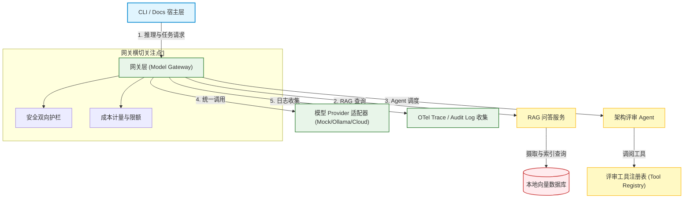
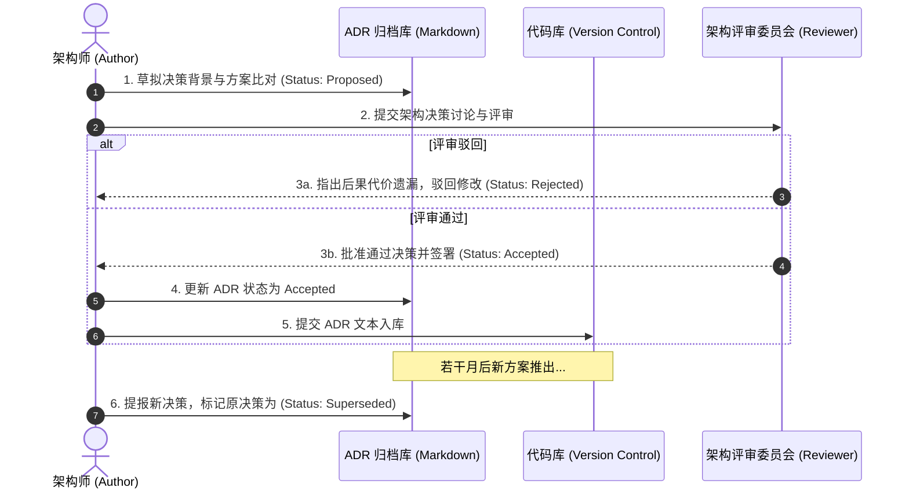
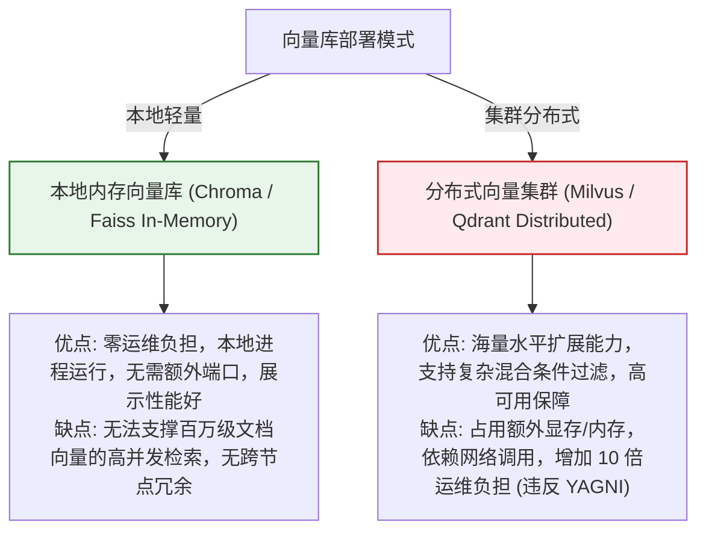

import GlossaryTerm from '@site/src/components/GlossaryTerm';
import GuidedExercise from '@site/src/components/GuidedExercise';
import ResearchNote from '@site/src/components/ResearchNote';
import ChapterMeta from '@site/src/components/ChapterMeta';
import PyRunner from '@site/src/components/PyRunner';
import TradeoffExplorer from '@site/src/components/TradeoffExplorer';
import QuizCard from '@site/src/components/QuizCard';
import StepFlow from '@site/src/components/StepFlow';

# M12L2 · 架构设计与决策记录

<ChapterMeta
  time="约 2.5 小时"
  prereqs={[{label: 'M12L1 立项', href: './capstone-kickoff'}, {label: 'M2L5 HLD', href: '../system-design-bridge/hld-diagramming'}, {label: 'M1L16 ADR', href: '../foundations/month1-capstone'}]}
  outcome="能把立项转成架构：画组件图与数据流，做出并记录三个关键决策（本地vs云、RAG vs长上下文、Agent vs workflow），用 ADR 让每个决策可追溯、可评审。"
  howToUse="先看‘架构不是画框图，是做决策’，再学三个关键决策与 ADR，最后产出你的架构文档。"
/>

:::tip 架构的本质不是画框图，是做出并记录关键决策
有了[立项（M12L1）](./capstone-kickoff)，该设计架构了。但架构最有价值的部分不是那张漂亮的组件图，而是**你在关键岔路口做了什么选择、为什么**——本地还是云？RAG 还是把笔记全塞进长上下文？Agent 还是固定 workflow？这些[trade-off（贯穿全书）](../system-design-bridge/hld-diagramming) 才是架构师价值的体现。而把它们写成 <GlossaryTerm term="ADR (Architecture Decision Record)" definition="架构决策记录：一份简短文档，记录一个重要架构决策的背景、所考虑的选项、最终选择及理由和后果。让决策可追溯、可评审，未来的人（包括你自己）能看懂‘当时为什么这么选’。">ADR（架构决策记录）</GlossaryTerm>，让这些决策**可追溯、可评审**——这是资深工程师和"画了个图就开干"的人的分水岭。
:::

## 一、组件图谁都会画，难的是选型背后的理由

把[立项的三个用例](./capstone-kickoff) 映射成组件，得到一张图（[HLD，M2L5](../system-design-bridge/hld-diagramming)）：CLI → 网关 → RAG 服务 / Agent 编排 → 向量库 / 工具 / 模型 provider → trace。这一步不难。真正难、真正体现能力的是**每个选型背后的决策**：
- 为什么模型层要做成**可替换的 provider**，而不是直接调某个 API？
- 为什么用 **RAG** 而不是把所有笔记塞进[长上下文](../rag/why-rag)？
- 为什么评审清单用 **Agent** 而不是[固定 workflow](../agent-architectures/when-not-agent)？

这些问题的答案，就是你的架构。评审你的人不会问"图画得好不好看"，会问"你为什么这么选、代价是什么"。

## 二、三个关键决策（毕业项目的核心 trade-off）

### 决策一：本地优先 vs 云端

- **本地优先**（推荐）：本地向量库 + 可选本地小模型，无 key 也能跑。优点：[可运行、可演示、隐私、零成本（M12L1 需求）](./capstone-kickoff)；缺点：本地模型能力弱。
- **云端**：接强模型 API。优点：能力强；缺点：要 key、有成本、别人不一定能跑。
- **决策**：本地优先 + 云端可选（[provider 可切换，M12L4](./model-provider-layer)）——兼顾可演示和能力。这是[立项约束驱动的核心架构选择](./capstone-kickoff)。

### 决策二：RAG vs 长上下文

- **RAG**（推荐）：检索相关笔记片段再回答。优点：[能引用证据、可扩展到大量笔记、成本可控（M8L1）](../rag/why-rag)；缺点：要建检索管道。
- **长上下文**：把所有笔记塞进 prompt。优点：简单；缺点：[笔记多了塞不下、贵、易 lost-in-the-middle（M8L1）](../rag/why-rag)。
- **决策**：RAG——因为核心用例要**带引用**，且笔记会增长。这正是 [M8 讲的 RAG 适用判断](../rag/why-rag)。

### 决策三：Agent vs Workflow

- **Workflow**：固定步骤（如"检索→套模板生成清单"）。优点：[可预测、便宜、可靠（M9L11）](../agent-architectures/when-not-agent)。
- **Agent**：自主决定调哪些工具、几步。优点：灵活；缺点：[贵、难控、可能过度（M9L11）](../agent-architectures/when-not-agent)。
- **决策**：评审清单生成用**轻量 Agent**（要根据主题动态决定查什么、审什么），但[加严格边界和停止条件（M9）](../agent-architectures/stopping-budget)——体现"[该用 Agent 才用、且克制地用](../agent-architectures/when-not-agent)"的判断。

### 深入（选学）：ADR 与架构的可评审性

- <GlossaryTerm term="ADR Format" definition="ADR 的典型结构：Context(背景/问题)、Options(考虑过的选项)、Decision(选了什么)、Consequences(后果/代价)。简短(一页)、聚焦一个决策、记录‘为什么’而非只记‘是什么’。">ADR 结构</GlossaryTerm>：每个关键决策写一份短 ADR——背景、选项、决定、后果。重点是记录**为什么选、放弃了什么、代价是什么**，而非只写"我们用了 X"。
- **ADR 是给未来的信**：三个月后的你、或评审你的人，看代码只能看到"是什么"，看 ADR 才知道"为什么"——避免[未来有人不懂就推翻好决策、或重蹈被否决过的坏选项（M1L16 ADR）](../foundations/month1-capstone)。
- **架构要匹配需求，不是越复杂越牛**：你的三个决策全都指向**"聚焦而完整、克制而可演示"**——本地优先(可跑)、RAG(可引用)、轻量 Agent(该用才用)。一个能讲清"我为什么没上多 Agent、没上分布式向量库"的架构，比堆砌技术的更成熟（[呼应全书克制主线](../design-patterns-lld/change-driven-design)）。
- **数据流和信任边界**：画组件图时顺便标出[数据流和信任边界（M11L5）](../production-ai-platform/llm-threat-modeling)——用户输入、检索内容、模型输出在哪跨边界，为后面[护栏（M12L7）](./reliability-guardrails-build) 打基础。

<ResearchNote
  title="架构=组件图+关键决策的 ADR；毕业项目的三大 trade-off"
  source="M2L5 HLD / M1L16 ADR；Nygard ADR；本地vs云 / RAG vs长上下文 / Agent vs workflow"
  href="https://adr.github.io/"
  insight="架构价值不在框图而在关键决策及理由。毕业项目三大 trade-off:本地优先vs云(选本地优先+云可选,兼顾可演示与能力)、RAG vs长上下文(选RAG,要引用且笔记增长)、Agent vs workflow(评审清单用轻量Agent但加严格边界,该用才用且克制)。每个决策写 ADR(背景/选项/决定/后果),记录为什么和代价而非只记是什么。ADR 是给未来的信,让决策可追溯可评审。架构要匹配需求、克制,标出数据流与信任边界为护栏打底。"
  application="毕业项目设计:立项映射成组件图+数据流,对三大 trade-off 各做决策并写一页 ADR(背景/选项/决定/后果)。选择要呼应立项约束(本地优先、要引用、该用Agent才用)。标信任边界。用能否讲清‘为什么没上更复杂方案’检验架构成熟度。ADR 让你的架构经得起评审追问。"
/>

## 三、架构设计与决策图解 (Deep Dive Diagrams)

本节展示毕业设计核心组件关系、ADR (架构决策记录) 生命周期流程，以及本系统关键选型的取舍关系。

### 1. 结构全景：Architecture Assistant 系统组件全景图



### 2. 控制流程：ADR 决策提报与生命周期流转



### 3. 折中谱系：本地轻量向量检索 vs. 分布式向量数据库集群



### 4. 步骤流演示：ADR 结构化提报标准管线

<StepFlow
  steps={[
    {
      title: 'Context 背景界定',
      desc: '阐述系统当前面对的业务约束或技术瓶颈（如“毕业设计需在离线且无 API Key 的评审下依然能完美展示”）。'
    },
    {
      title: 'Options 方案分析',
      desc: '罗列出多种备选解决方案（如“纯 Ollama”或“Mock + 可替换插件适配器”），客观给出优缺点。'
    },
    {
      title: 'Decision 最终拍板',
      desc: '做出克制、明确的决策，给出强有力的选择依据，并标记该决策在系统中的作用范围。'
    },
    {
      title: 'Consequences 后果承担',
      desc: '清楚记录接受该决策所需承担的劣势或技术债（例如“选用 Mock 路径将导致问答真实质量下降”），并提供应对建议。'
    }
  ]}
/>

---

## 三、跟我做一遍：把决策写成可评审的 ADR

<PyRunner
  rows={46}
  expect="三个关键决策都有理由和代价"
  code={`# 把架构决策结构化成 ADR(不只是‘用了什么’,而是‘为什么/代价’)
def adr(title, context, options, decision, why, consequences):
    return {"title": title, "context": context, "options": options,
            "decision": decision, "why": why, "consequences": consequences}

adrs = [
    adr("ADR-1 本地优先 vs 云端",
        "毕业项目要可演示、任何人能跑",
        ["纯本地", "纯云端", "本地优先+云可选"],
        "本地优先 + 云可选(provider 可切换)",
        "无 key 可跑保证可演示;需要能力时切云",
        "本地模型能力弱,要做 mock/local 降级路径"),
    adr("ADR-2 RAG vs 长上下文",
        "要从笔记回答且带引用,笔记会增长",
        ["全塞长上下文", "RAG 检索"],
        "RAG",
        "核心用例要引用证据;笔记多了长上下文塞不下且贵",
        "要建检索管道(分块/embedding/向量库)"),
    adr("ADR-3 Agent vs Workflow(评审清单)",
        "生成架构评审清单需按主题动态决定查什么",
        ["固定 workflow", "轻量 Agent"],
        "轻量 Agent + 严格边界/停止条件",
        "需动态性;但加边界防过度和失控",
        "比 workflow 贵/难控,需 trace 和停止上限"),
]

def review_adr(a):   # 评审:好 ADR 必须有理由和后果(代价)
    return bool(a["why"]) and bool(a["consequences"]) and len(a["options"]) >= 2

for a in adrs:
    ok = review_adr(a)
    print(f"[{'OK' if ok else '缺失'}] {a['title']}")
    print(f"     决定: {a['decision']}")
    print(f"     理由: {a['why']}")
    print(f"     代价: {a['consequences']}")
print("三个关键决策都有理由和代价")`}
/>

三个关键决策各写成一份 ADR：不只记"用了 RAG"，而是记清**考虑过哪些选项、为什么选它、代价是什么**——还能自检（没有理由或没有代价的 ADR 不合格）。这就是让架构经得起评审的方式。**试试**：给你的项目加第四个 ADR（比如向量库选型：内存 vs 持久化）；想想哪个决策如果反过来选，项目会变成什么样。

## 五、动手 Lab（必做）

打开 `labs/month12/m12l2_adr/`：

```bash
python labs/month12/m12l2_adr/test_adr.py
```

实现 ADR 校验器：检查每个决策是否有选项、理由、后果——并为你的项目写三个关键 ADR + 一张组件图（文字/Mermaid 均可）。

<GuidedExercise
  title="练习指引：设计架构并记录决策"
  goal="把立项转成组件图 + 数据流 + 三个关键 ADR，让你的架构可评审、经得起追问。"
  hints={[
    '组件图:CLI->网关->RAG/Agent->向量库/工具/provider->trace。',
    '三大决策:本地vs云、RAG vs长上下文、Agent vs workflow。',
    'ADR 必含:选项(>=2)、决定、为什么、代价。',
    '决策要呼应立项约束(本地优先/要引用/克制用 Agent)。'
  ]}
  steps={[
    '画组件图 + 标数据流和信任边界。',
    '为三大 trade-off 各写一份 ADR。',
    '实现 review_adr 校验 ADR 是否合格。',
    '写测试:ADR 有选项/理由/后果、决策呼应需求。'
  ]}
  checks={[
    '我的架构图清晰、组件职责明确、标了数据流。',
    '我的三个关键决策都有 ADR(选项/理由/代价)。',
    '我的决策呼应立项约束、体现克制。',
    '我能面对‘为什么这么选、为什么不上更复杂方案’的追问。'
  ]}
/>

## 架构师深潜（Staff+ 视角）

### 1. 记录决策的方式

<TradeoffExplorer
  title="架构决策的记录方式"
  dimensions={['可追溯为什么', '轻量', '可评审', '防重蹈覆辙', '推荐度']}
  options={[
    {
      name: '只有代码',
      scores: [1, 5, 1, 1, 1],
      note: '决策全在代码里。最省事。但只看得到‘是什么’、看不到‘为什么’,后人易推翻好决策。',
      whenToUse: '琐碎决策。'
    },
    {
      name: 'ADR(推荐)',
      scores: [5, 4, 5, 5, 5],
      note: '每个关键决策一页 ADR。可追溯、可评审、防重蹈覆辙。轻量。',
      whenToUse: '所有重要架构决策。'
    },
    {
      name: '大而全设计文档',
      scores: [4, 1, 3, 3, 2],
      note: '一份几十页大文档。全但重。易过时没人维护、决策淹没在细节里。',
      whenToUse: '需要时,但决策仍宜拆成 ADR。'
    }
  ]}
/>

### 2. "能讲清为什么不做"比"做了什么"更能证明架构能力

毕业项目评审（和真实的架构评审）最锋利的问题,往往不是"你做了什么",而是"**你为什么没做 X**"——为什么不上多 Agent？为什么不用分布式向量库？为什么不接最强的云模型？一个只会"做加法"的人会被这些问题问倒,因为他其实没在决策,只是在堆砌他会的东西。而一个真正的架构师,对每一个"没做的选择"都有清晰的理由:"我没上多 Agent,因为这个项目的评审清单生成用单个轻量 Agent 已经够了,多 Agent 只会增加成本和复杂度而不增加价值([M10L1](../multi-agent-protocols/why-multi-agent))";"我用了内存向量库而非分布式的,因为立项是单用户本地优先,几千条笔记根本用不上分布式,那是[过度工程(YAGNI)](../design-patterns-lld/change-driven-design)"。这就是为什么 ADR 里的**"考虑过的选项"和"后果/代价"两栏最有含金量**——它们证明你**看见了岔路、权衡了、并有意识地选择了**,而不是懵懵懂懂走到这一步。这一点是整个课程判断力主线的收束:从 [M2 容量估算](../system-design-bridge/capacity-estimation) 到 [M7-M11 每一次"该不该用"](../agent-architectures/when-not-agent),训练的都是同一种能力——**在多个可行方案中,基于约束和代价做出并讲清选择**。你的毕业项目架构,就是这种能力的集中展演。评审者通过你的 ADR,看的不是你的技术栈,而是你的判断力。

### 3. 架构师深问（给自己 30 分钟）

- 你的三个关键决策，每个都能说清"选项、为什么选、放弃了什么、代价"吗？
- 面对"你为什么不上 X（更复杂的方案）"，你有理直气壮的答案，还是会被问倒？
- 你的架构匹配立项约束吗？还是不自觉地堆了用不上的复杂度？

## 知识自测

<QuizCard
  questions={[
    {
      q: '在进行 AI 系统设计时，“组件框图谁都会画，难的是选型背后的决策及代价”。以下哪项最符合一个架构师编写 ADR (架构决策记录) 时的核心要求？',
      options: [
        'A. 详细记录系统采用技术的所有开源证书与代码行数',
        'B. 不仅要写出“我们选了什么方案”，更要重点阐述“为什么这样选”、“放弃了什么备选方案”以及“我们需要为此承担怎样的架构后果和代价（Consequences）”',
        'C. 将每次大模型生成的 Prompt 全文原封不动抄进 ADR 文档中',
        'D. 保证 ADR 越长越好，最好包含全部数据库表的字段设计'
      ],
      answer: 1,
      explain: '架构的本质是在约束下做出取舍。如果一份决策记录只写了“决定使用 RAG”，却没有解释为什么不直接使用“长上下文模型”或“精调模型”，以及选用 RAG 带来的维护检索管道的开销，那么该记录就无法作为未来的追溯依据，未来的人就容易推翻现有决策。'
    },
    {
      q: '在毕业项目的系统架构中，为什么推荐将“本地优先 (Local-first) + 云端可选”作为最基础的架构设计，而不是全盘接入云端 API？',
      options: [
        'A. 因为云端 API 已经停止服务，无法支持 React 项目编译',
        'B. 它兼顾了“可演示性”与“系统能力天花板”。通过抽象模型 Provider，无 API Key 时能自动回退到 Mock 路由；而当填入云端 Key 时又可以无缝切为最强模型。这一设计用最简单的模式消除了外部公网单点故障的致命影响',
        'C. 纯云端 API 调用没有任何成本，本地运行只为了炫技',
        'D. 本地优先可以强制绕过 Docusaurus 的 broken links 检测'
      ],
      answer: 1,
      explain: '高可用和解耦是系统设计的基本原则。若系统完全强依赖外部云 API，当在断网或无 Key 环境下演示时，整个系统将直接陷入瘫痪。采用“本地优先 + 云端可选”，能实现本地带伤优雅运行，这也体现了 Month 4 的接口防腐（DIP）和 Month 11 的降级设计。'
    },
    {
      q: '面对“你为什么没在你的架构中采用多智能体 (Multi-Agent) 协同模式”这一锋利的架构追问，以下哪项是架构师最克制、最能体现专业素质的回答？',
      options: [
        'A. “因为我还没学会如何使用多智能体”',
        'B. “因为多智能体框架的编译报错太多，React 18 不兼容”',
        'C. “基于 YAGNI 和架构克制原则。经过对立项用例的估算，本项目核心用例——评审清单的生成逻辑只需要单个智能体调度即可完全覆盖，引入多智能体不仅无法带来实质价值提升，反而会增加 5 倍的调试难度与 Token 经济开销”',
        'D. “多智能体是落后的技术，我们只应该使用单次 RAG 调用”'
      ],
      answer: 2,
      explain: '真正的架构师拒绝“为了用技术而用技术”的盲目堆砌。任何架构的复杂化都应该由具体的业务价值驱动。在评审中，清晰陈述“不做什么”的边界与成本考量，远比虚胖的过度工程更能体现你的判断力与全局控制能力。'
    }
  ]}
/>

## 自检清单

- [ ] 我有清晰的组件图，标了数据流和信任边界。
- [ ] 我的三个关键决策（本地vs云/RAG vs长上下文/Agent vs workflow）都有 ADR。
- [ ] 我的 ADR 记录了选项、理由、代价，而非只记"用了什么"。
- [ ] 我能面对"为什么没上更复杂方案"的追问，并讲清克制的理由。

## 常见误解

- **"架构就是把组件图画漂亮"**：图谁都会画；架构价值在关键决策及其理由（ADR）。
- **"ADR 是文档负担"**：它是给未来的信，防止好决策被推翻、坏选项被重试，一页足矣。
- **"技术用得越多越显水平"**：能讲清"为什么不做"、匹配需求的克制架构，才真正显水平。

## 延伸阅读

- [ADR 组织与模板](https://adr.github.io/) · [M2L5 HLD 绘图](../system-design-bridge/hld-diagramming)
- [M9L11 何时不该用 Agent](../agent-architectures/when-not-agent) · [M8L1 为什么 RAG](../rag/why-rag)
- [下一阶段：知识地基（摄取与检索）](./knowledge-base-build)