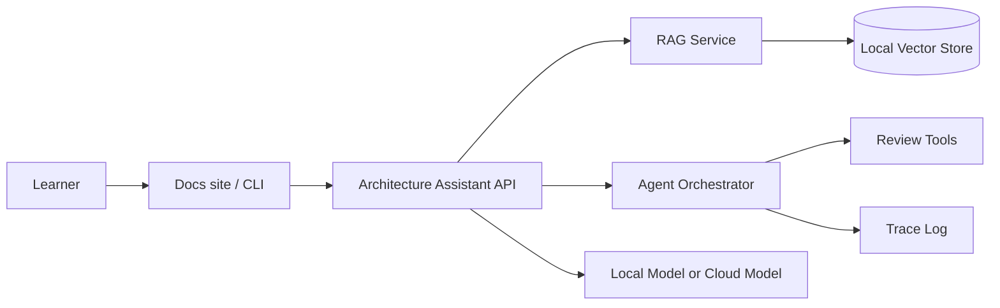

# Month 12 - Capstone Brief

最终项目不是一个玩具聊天机器人，而是一个能展示架构能力的 AI Architect Portfolio System。它必须包含清晰的系统图、可运行实验、评测、风险说明和可替换的模型接口。

## 项目目标

设计并实现一个本地优先、可选云端的架构学习助手：

- 能索引你的系统设计与 AI 架构笔记。
- 能通过 RAG 回答问题并引用证据。
- 能调用工具生成架构评审清单。
- 能记录 Agent 的每一步事件。
- 能在无 API key 时使用 mock/local 路径运行。

## 目标架构

## 必需交付物

- `architecture.md`：目标、范围、组件图、数据流。
- `tradeoffs.md`：本地 vs 云端、RAG vs long context、Agent vs workflow。
- `runbook.md`：如何运行、测试、观测和排障。
- `evals.md`：至少 10 个问答样例和预期证据。
- `labs/`：可运行代码和 smoke tests。

## 验收标准

| 维度 | 标准 |
|---|---|
| 可运行 | 无 API key 时可运行 mock/local 路径 |
| 可解释 | 每个关键组件都有职责说明 |
| 可评测 | 至少覆盖检索质量和答案忠实度 |
| 可替换 | 模型 provider 可替换 |
| 可观测 | Agent/tool 调用有 trace |

## 最终展示顺序

1. 3 分钟讲业务目标。
2. 5 分钟画架构图和数据流。
3. 5 分钟演示 RAG 问答。
4. 5 分钟展示 Agent trace 和 guardrails。
5. 5 分钟讲 trade-off。
6. 5 分钟回答评审问题。
