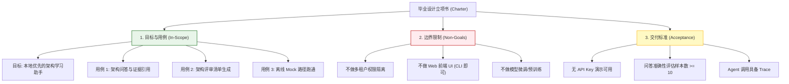
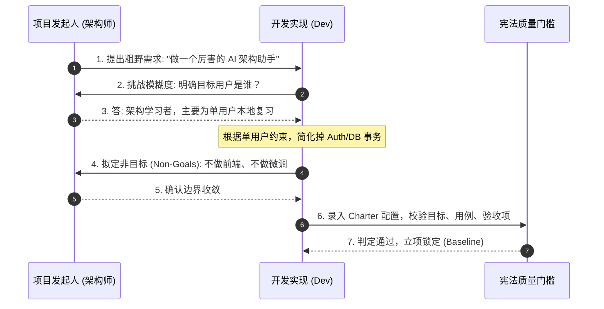
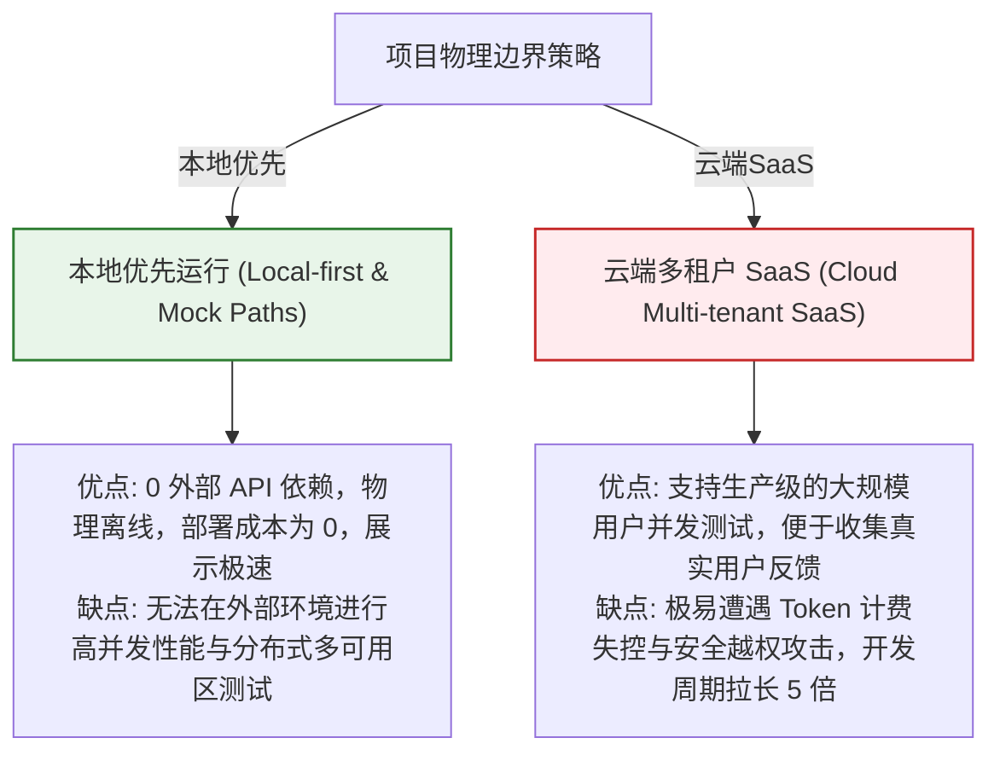

import GlossaryTerm from '@site/src/components/GlossaryTerm';
import GuidedExercise from '@site/src/components/GuidedExercise';
import ResearchNote from '@site/src/components/ResearchNote';
import ChapterMeta from '@site/src/components/ChapterMeta';
import PyRunner from '@site/src/components/PyRunner';
import TradeoffExplorer from '@site/src/components/TradeoffExplorer';
import QuizCard from '@site/src/components/QuizCard';
import StepFlow from '@site/src/components/StepFlow';

# M12L1 · 立项：需求与范围

<ChapterMeta
  time="约 2 小时"
  prereqs={[{label: 'Capstone 总览', href: './overview'}, {label: 'M2L2 需求', href: '../system-design-bridge/requirements'}, {label: 'M2L1 设计方法论', href: '../system-design-bridge/design-methodology'}]}
  outcome="能像架构师一样给毕业项目立项：写清目标/用户/范围/非目标/验收标准，把‘做个 AI 助手’变成有边界、可验收的工程项目。"
  howToUse="先看‘为什么先别写代码’，再用需求方法论定义项目，最后产出你自己的立项文档。"
/>

:::tip 毕业项目第一步：先别写代码
拿到"做一个架构学习助手"，新手立刻开 IDE 写 RAG。但架构师的第一步是**想清楚要解决什么问题、给谁用、边界在哪、什么算成功**——这正是 [M2 需求方法论](../system-design-bridge/requirements) 教的。这一步花的时间，会在后面省下十倍：没有清晰的范围，你会做出一个又大又杂、什么都沾一点又都不完整的东西。**好的立项让你知道该做什么、更重要的是——不该做什么。**
:::

## 一、"做个 AI 助手"不是需求，是幻觉

"做一个架构学习助手"听起来清楚，其实什么都没定义：
- **给谁用？** 自己复习？还是给别人用？——决定了要不要多用户、要不要权限。
- **解决什么痛点？** "笔记太多找不到" vs "想要有人考我"——决定了核心功能。
- **范围到哪？** 只回答问题？还是也要生成评审清单、也要多轮对话、也要 Web UI？——不定边界就会无限膨胀。
- **什么算成功？** 没有验收标准，你永远不知道"做完了没"。

所以第一步是把模糊愿景，用[需求方法论（M2L2）](../system-design-bridge/requirements) 收敛成**有边界、可验收**的项目定义。

## 二、立项四件事（分层）

### 基础：目标、用户、核心用例

- **目标（一句话）**：这个系统为谁解决什么问题。示例："帮我（学习者）快速从自己的架构笔记里找到有依据的答案，并能被它考核薄弱点。"
- **用户与场景**：主要用户是你自己（单用户、本地优先）——这直接[简化了很多设计（无需多租户/复杂权限）](../system-design-bridge/requirements)。
- **核心用例（3 个就够）**：① 问一个架构问题，得到有引用的答案；② 让它基于某主题生成一份架构评审清单；③ 无 API key 时也能用本地/mock 路径跑通。

### 进阶：范围、非目标与验收

- <GlossaryTerm term="Scope & Non-Goals" definition="范围与非目标：明确项目‘做什么’和‘刻意不做什么’。非目标和目标一样重要——它防止范围蔓延，让有限的精力集中在核心价值上。">范围与非目标</GlossaryTerm>：明确写下**不做什么**和做什么一样重要——非目标示例："不做多用户/权限、不做 Web UI（CLI 即可）、不做训练/微调、不做实时协作。" 这些[非目标](../system-design-bridge/requirements) 把你从无底洞里拉出来。
- <GlossaryTerm term="Acceptance Criteria" definition="验收标准：可判定的、明确的‘完成’定义。让‘做完了’从主观感觉变成客观可检验，是项目有边界的标志。">验收标准</GlossaryTerm>：可判定的"完成"定义（对照 [Capstone Brief](./capstone-brief) 验收表）——如"无 key 能跑通 3 个核心用例、RAG 答案带引用、Agent 调用有 trace、有 10 条评估样例"。

### 深入（选学）：立项体现的架构判断

- **约束驱动简化**："单用户、本地优先"这个定位，是整个项目最重要的架构决策之一——它[让你避开一大堆分布式/多租户复杂度（M2 克制、YAGNI）](../design-patterns-lld/change-driven-design)，把精力集中在 RAG/Agent/生产工程的核心展示上。**好的范围定义本身就是好架构。**
- **可运行优先于完美**："无 API key 可跑 mock 路径"是刻意的需求——它保证项目**任何人随时能跑起来**（可演示、可评审），这比"接了最强模型但别人跑不起来"重要得多（[呼应 M11 可运营 > 炫技](../production-ai-platform/capstone-ai-platform)）。
- **对齐验收与展示**：立项时就想好[最终怎么展示（M12L12）](./showcase-and-path)——验收标准应该正好是你展示时要证明的东西。以终为始。
- **别过度设计立项**：立项文档要精悍（一页足矣），不是越长越好——它是[决策工具不是仪式（M2）](../system-design-bridge/design-methodology)。花两小时想清楚，而非两天写华丽文档。

<ResearchNote
  title="立项：用需求方法论把模糊愿景收敛成有边界、可验收的项目"
  source="M2L2 需求 / M2L1 方法论；敏捷用户故事与验收标准；Brooks《人月神话》需求最难"
  href="https://en.wikipedia.org/wiki/Software_requirements_specification"
  insight="‘做个 AI 助手’不是需求。立项要定义目标(一句话为谁解决什么)、用户场景、3 个核心用例、范围与非目标(不做什么和做什么同等重要)、可判定的验收标准。约束(单用户本地优先)驱动简化是最重要的架构决策之一,避开分布式/多租户复杂度集中展示核心。可运行(mock 路径)优先于接最强模型。立项对齐最终展示、以终为始。文档精悍是决策工具非仪式。"
  application="毕业项目先立项后写码:一句话目标 + 主用户场景 + 3 核心用例 + 明确非目标 + 可验收标准(对齐 Capstone Brief 和最终展示)。用‘单用户本地优先’约束简化范围。把‘无 key 可跑 mock’作为一等需求保证可演示。立项一页足矣、两小时想清楚胜过两天写文档。"
/>

## 三、毕业设计立项图解 (Deep Dive Diagrams)

本节展示毕业设计立项阶段的核心图解：需求分层结构模型、范围界定工作流，以及本地优先与云端多租户架构在开发成本与维护代价上的对比。

### 1. 结构全景：毕业项目 Charter 需求要素分层拓扑



### 2. 控制流程：立项需求澄清与收敛工作时序



### 3. 折中谱系：本地优先 vs. 云端 SaaS 架构折中



### 4. 步骤流演示：需求收敛与范围剪裁生命周期

<StepFlow
  steps={[
    {
      title: '痛点抽取',
      desc: '从宏大愿景中精准抽离用户的真实核心痛点（例如“海量笔记检索难”和“缺乏自测”）。'
    },
    {
      title: '约束置入',
      desc: '声明核心边界约束（例如“本地优先”和“CLI 界面”），用以强制抹去 80% 的辅助架构杂质。'
    },
    {
      title: '非目标裁剪',
      desc: '严厉拉出“不做什么”的非目标红线，冻结范围，防止在开发中途发生需求潜行膨胀。'
    },
    {
      title: '验收公式化',
      desc: '将“做完”具象化为可量化的测试指标（例如“离线脚本通过”及“拥有 10 条对比数据”）。'
    }
  ]}
/>

---

## 三、跟我做一遍：把愿景变成可检验的立项

<PyRunner
  rows={44}
  expect="立项完整、范围收敛、可验收"
  code={`# 用结构化的方式表达立项(它就是你项目的‘契约’)
charter = {
    "goal": "帮学习者从自己的架构笔记中获得有引用的答案,并能被考核薄弱点",
    "users": ["我自己(单用户,本地优先)"],
    "core_use_cases": [
        "问架构问题 -> 有引用的答案",
        "给定主题 -> 生成架构评审清单",
        "无 API key -> mock/local 路径跑通",
    ],
    "non_goals": ["多用户/权限", "Web UI(CLI 即可)", "训练/微调", "实时协作"],
    "acceptance": [
        "无 key 能跑通 3 个核心用例",
        "RAG 答案带引用、证据不足能弃答",
        "Agent 调用有 trace",
        "有 >=10 条评估样例",
        "模型 provider 可替换",
    ],
}

def validate_charter(c):
    problems = []
    if len(c["goal"].split()) < 3:
        problems.append("目标太空泛")
    if not (2 <= len(c["core_use_cases"]) <= 4):
        problems.append("核心用例应聚焦在 2-4 个")
    if not c["non_goals"]:
        problems.append("缺非目标(范围会膨胀)")     # 非目标和目标同等重要
    if not c["acceptance"]:
        problems.append("缺验收标准(不知道何时算完成)")
    return problems or ["立项完整、范围收敛、可验收"]

for line in validate_charter(charter):
    print("-", line)
print("非目标数:", len(charter["non_goals"]), "| 验收项:", len(charter["acceptance"]))
print("立项完整、范围收敛、可验收")`}
/>

立项被结构化成一份"契约"：目标、用户、核心用例、**非目标**、验收标准，还能自检是否收敛（没有非目标就报警——因为范围一定会膨胀）。这就是把"做个 AI 助手"变成有边界的工程项目。**试试**：给你自己的版本加/减一个核心用例，感受范围的膨胀与收缩；想想如果去掉"单用户本地优先"这个约束，项目会复杂多少倍。

## 五、动手 Lab（必做）

打开 `labs/month12/m12l1_charter/`：

```bash
python labs/month12/m12l1_charter/test_charter.py
```

实现立项校验器：检查你的项目立项是否目标清晰、用例聚焦、有非目标、可验收——并写出**你自己的**立项。

<GuidedExercise
  title="练习指引：给你的毕业项目立项"
  goal="用需求方法论产出一份精悍、有边界、可验收的立项文档（你后面所有阶段的北极星）。"
  hints={[
    '目标一句话:为谁解决什么。',
    '核心用例聚焦 2-4 个,别贪多。',
    '非目标必写(明确不做什么)——防范围膨胀。',
    '验收标准可判定,对齐 Capstone Brief 和最终展示。'
  ]}
  steps={[
    '写你的 charter(goal/users/core_use_cases/non_goals/acceptance)。',
    '实现 validate_charter 校验它是否收敛。',
    '用‘单用户本地优先’约束简化范围。',
    '写测试:目标够具体、用例聚焦、有非目标、有可验收标准。'
  ]}
  checks={[
    '我的立项目标清晰、用例聚焦、有明确非目标。',
    '我的验收标准可判定、对齐最终展示。',
    '我理解约束(单用户本地优先)如何简化架构。',
    '我把‘无 key 可跑’当一等需求(保证可演示)。'
  ]}
/>

## 架构师深潜（Staff+ 视角）

### 1. 范围策略

<TradeoffExplorer
  title="毕业项目的范围策略"
  dimensions={['展示深度', '可完成', '可演示', '可评审', '不过度']}
  options={[
    {
      name: '大而全(什么都做)',
      scores: [2, 1, 2, 2, 1],
      note: '多用户+Web UI+多 Agent+微调… 看着雄心勃勃。但做不完、每块都半成品、无法展示。',
      whenToUse: '几乎不;毕业项目的头号陷阱。'
    },
    {
      name: '聚焦而完整(推荐)',
      scores: [5, 5, 5, 5, 5],
      note: '单用户本地优先,把 RAG+Agent+生产工程做扎实完整。可完成、可演示、每块经得起追问。',
      whenToUse: '毕业项目的目标形态。'
    },
    {
      name: '过度简化(玩具)',
      scores: [1, 5, 3, 2, 4],
      note: '就一个裸 LLM 调用。快。但展示不出架构能力,配不上毕业。',
      whenToUse: '仅热身,不是毕业作品。'
    }
  ]}
/>

### 2. 立项能力，是资深和初级架构师最大的分水岭之一

初级工程师拿到任务就想"怎么实现"；资深架构师先问"这到底要解决什么、边界在哪、什么算成功、什么刻意不做"。这个差别在毕业项目上会被放大成成败：**没有立项就动手的项目，几乎必然走向"范围失控 → 什么都做一半 → 做不完 → 展示时东拼西凑"**——这是学生项目最常见的死法。而先立项的项目，因为边界清晰，能把有限精力压在核心价值上、做深做透、经得起追问。这里最反直觉、也最考验判断力的，是**写好"非目标"**——初学者觉得"我要做的越多越牛"，资深者知道"我刻意不做什么，才显出我懂取舍"。一个能清楚说出"我这个项目故意不做多用户、不做 Web UI、不做微调，因为它们不服务于我要展示的核心架构能力"的人，比一个"我全都想做"的人成熟得多。这呼应了贯穿全书的[克制主线（M2/M4 YAGNI、M9/M10/M11 别过度）](../design-patterns-lld/change-driven-design)：**架构师的价值不在于能做多少，而在于判断该做什么、不该做什么。毕业项目的立项，就是这份判断力的第一次完整亮相。**

### 3. 架构师深问（给自己 30 分钟）

- 你的项目目标能用一句话说清"为谁解决什么"吗？还是模糊的"做个 AI 助手"？
- 你写非目标了吗？你能理直气壮地说出"我刻意不做 X，因为……"吗？
- 你的验收标准可判定吗？它和你最终要展示的东西对齐吗（以终为始）？

## 知识自测

<QuizCard
  questions={[
    {
      q: '在毕业设计立项阶段，为什么架构师必须花时间写清“非目标 (Non-Goals)”？它能带来什么具体的架构收益？',
      options: [
        'A. 它是为了在遇到困难时，能有借口向用户推卸责任',
        'B. 非目标能明确界定系统不做什么，帮助开发人员冻结项目范围，防止需求无止境蠕变（Scope Creep）。明确“不做多租户、不做 Web UI”可以让工程师在有限时间内将精力聚焦在 RAG 与 Agent 的核心工程设计上，是架构判断力的直接体现',
        'C. 写非目标可以显著提高模型的回答准确度',
        'D. 非目标规定了代码中不能声明的变量名称'
      ],
      answer: 1,
      explain: '在大型系统和毕业项目设计中，最常见的失败模式不是做不出来，而是因为范围无限制扩散导致半途而废。非目标和目标一样重要，甚至在立项期更加重要，它起到了过滤杂质、聚焦核心业务逻辑的安全锁作用，用明确的边界实现架构的克制。'
    },
    {
      q: '毕业项目的立项中规定了“即使在无 API Key 的情况下，也必须能使用 Mock / 本地 Mock 路径跑通核心用例”。这一设计的核心架构意图是：',
      options: [
        'A. 节约电费与购买大模型 API Key 的费用',
        'B. 确保系统具备极佳的可演示性与零侵入测试性。依赖外部 API Key 的系统在评审展示或断网环境下常因不可控因素崩溃；将离线 Mock 路径作为一等公民设计，证明了架构师具备“设计模式中的依赖倒置（DIP）”思想，系统天然具备可替换性',
        'C. 绕过大模型的服务质量条款，实现破解版运行',
        'D. 让系统在没有内存的情况下依然能通过 PyRunner 完美编译'
      ],
      answer: 1,
      explain: '一个可靠的架构在面对不稳定依赖（如云端 LLM）时，应具备隔离和可替代性。将离线 Mock 路径提到一等需求的高度，不仅大幅提升了演示和部署时的成功率，也强迫开发者在底层数据流设计上实现接口与实现的解耦（如 Month 4 DIP 模式）。'
    },
    {
      q: '在制定毕业项目 Charter 时，以下哪项最不符合一个成熟架构师的非目标界定？',
      options: [
        'A. 本项目不提供基于 Web 的可视化前端 UI，仅保留 CLI 交互界面',
        'B. 本项目不对大模型进行针对特定领域的二次微调或继续预训练',
        'C. 本项目只使用 CPU 运行，暂不适配多卡 GPU 混合计算',
        'D. 本项目绝对不写任何单元测试与离线评测集，以求开发速度达到极限'
      ],
      answer: 3,
      explain: '非目标的目的是为了砍掉非核心辅助逻辑以聚焦高质量的核心实现（如评估、可观测和可靠性）。单元测试与离线评测集（Evaluation）是保障系统上线质量与验证架构正确性的底线，属于绝对不能省略的核心工程防护。砍掉测试不仅不是架构的克制，反而是一种低级的妥协。'
    }
  ]}
/>

## 自检清单

- [ ] 我的立项有一句话目标、聚焦的核心用例、明确的非目标、可验收标准。
- [ ] 我用"单用户本地优先"约束简化了范围。
- [ ] 我把"无 key 可跑 mock"当一等需求（保证可演示可评审）。
- [ ] 我理解立项（尤其非目标）是架构判断力的体现，不是走过场。

## 常见误解

- **"立项是走形式，赶紧写代码才实在"**：没立项的项目最常范围失控、做一半、展示时东拼西凑。
- **"功能做得越多越能体现能力"**：写好非目标、做深核心，比什么都沾一点更显成熟。
- **"验收标准以后再说"**：验收要在立项时定、对齐最终展示，否则不知道何时算完成。

## 延伸阅读

- [M2L2 需求](../system-design-bridge/requirements) · [M2L1 设计方法论](../system-design-bridge/design-methodology)
- [Capstone Brief 项目说明书](./capstone-brief)
- [下一阶段：架构设计与决策记录](./architecture-decisions)
