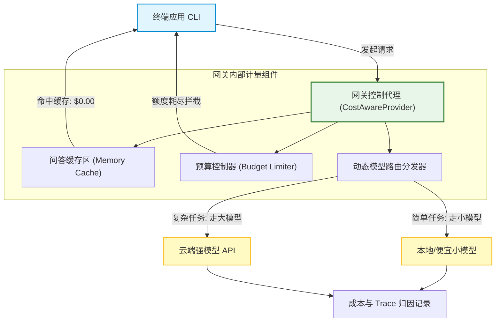
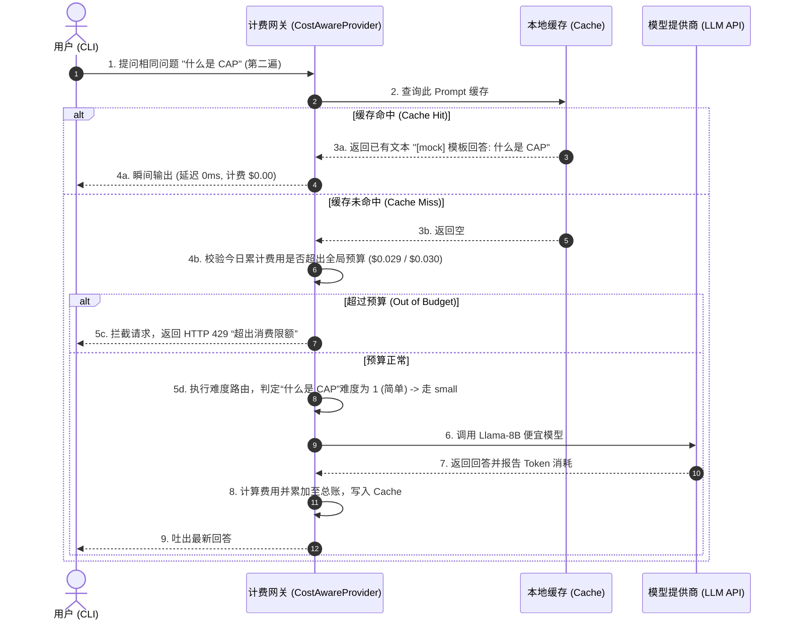
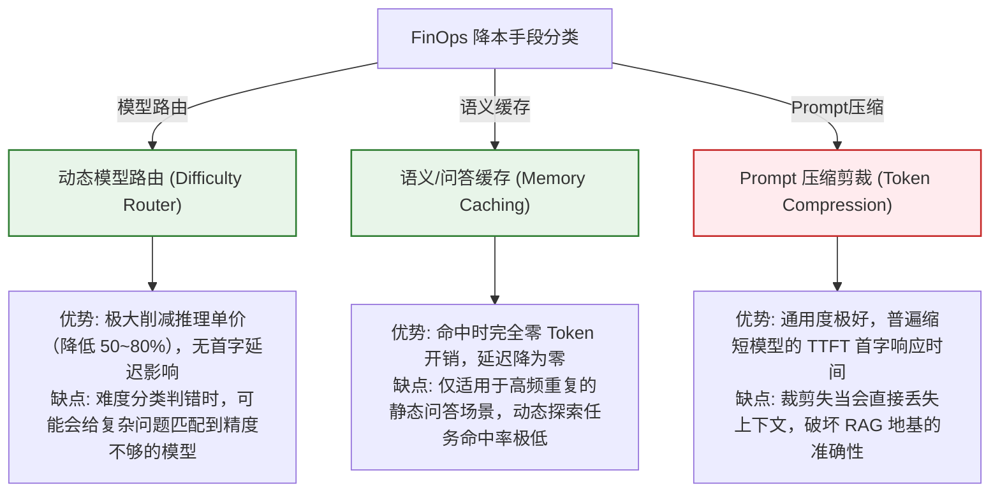

import GlossaryTerm from '@site/src/components/GlossaryTerm';
import GuidedExercise from '@site/src/components/GuidedExercise';
import ResearchNote from '@site/src/components/ResearchNote';
import ChapterMeta from '@site/src/components/ChapterMeta';
import PyRunner from '@site/src/components/PyRunner';
import TradeoffExplorer from '@site/src/components/TradeoffExplorer';
import QuizCard from '@site/src/components/QuizCard';
import StepFlow from '@site/src/components/StepFlow';

# M12L9 · 成本与性能

<ChapterMeta
  time="约 2 小时"
  prereqs={[{label: 'M12L4 模型层', href: './model-provider-layer'}, {label: 'M11L9 成本工程', href: '../production-ai-platform/cost-engineering'}, {label: 'M7L11 缓存', href: '../llm-systems/llm-api-cost-latency'}]}
  outcome="能给助手做成本与性能工程：按难度路由模型、缓存重复问答、设预算上限、优化延迟，并把这些挂到 provider 层，让助手付得起、够快。"
  howToUse="先看‘能用不等于付得起’，再把成本控制和缓存挂到 provider 层，最后建成本性能 lab。"
/>

:::tip 能用，还得付得起、跑得快
助手[功能全了、可靠了、可度量了（M12L5-L8）](./eval-observability-build)——但如果每次问答都调最强的云模型、相同问题重复烧钱、复杂请求慢得让人等不及，它就"能用但用不起、不好用"。这一课把 [M11 成本工程](../production-ai-platform/cost-engineering) 落到项目：简单问题走[便宜模型、重复问答缓存、设预算上限防失控、优化延迟](../production-ai-platform/cost-engineering)。而且——又是那个复利——这些都挂在你的 [provider 层（M12L4）](./model-provider-layer)，一处生效。**在 AI 时代，"付得起"和"跑得快"和"能用"一样，是系统能不能真正落地的硬约束。**
:::

## 一、"能用但用不起"是真实的失败

一个功能完备的助手，可能因为成本和性能上不了台面：
- **每次都用最强模型**：简单的"什么是 CAP"也调最贵的云模型——[大炮打蚊子（M7L5）](../llm-systems/llm-api-cost-latency)。
- **重复问答不缓存**：同一个问题问十遍，[烧十遍钱（M7L11 缓存）](../llm-systems/llm-api-cost-latency)。
- **成本无上限**：某个 [Agent 循环失控或被恶意刷，账单爆炸（M11L9）](../production-ai-platform/cost-engineering)。
- **延迟难忍**：复杂请求慢，用户等不及。

这些[M11 都讲过](../production-ai-platform/cost-engineering)，这一课是把它们落到你的助手上，让它**又好用又划算**。

## 二、落地要点（分层）

### 基础：模型路由 + 缓存

- **[模型路由（M7L5/M11L9）](../production-ai-platform/cost-engineering)**：按问题难度选模型——简单事实问答用[小/本地模型，复杂推理才用强模型](../llm-systems/llm-api-cost-latency)。挂在 [provider 层](./model-provider-layer) 里，是最大的降本杠杆。
- **[缓存（M7L11）](../llm-systems/llm-api-cost-latency)**：相同（或相似）问答缓存结果——命中就[省一次调用、还更快](../llm-systems/llm-api-cost-latency)。对"重复问同样的架构概念"这种场景很有效。

### 进阶：预算上限 + 成本归因

- **[预算上限（M11L9）](../production-ai-platform/cost-engineering)**：给会话/每日设 token 上限，超了就[限流/降级（防失控和恶意刷）](../production-ai-platform/cost-engineering)——[没有上限等于给 bug 和攻击一张空白支票](../production-ai-platform/cost-engineering)。
- **[成本归因（M11L4/L9）](./eval-observability-build)**：[trace 里记每次调用的成本](./eval-observability-build)，能看清 RAG 问答 vs 评审 Agent 谁更烧钱——[优化才有的放矢](../production-ai-platform/cost-engineering)。

### 深入（选学）：性能与克制

- **延迟优化**：[缓存降延迟、路由到快模型、并行检索、流式输出（M7L5/L7）](../llm-systems/llm-api-cost-latency)——但毕业项目别过度优化，先测出瓶颈（[用 trace，M12L8](./eval-observability-build)）再优化，[别过早优化](./capstone-kickoff)。
- **成本-质量-延迟三角**：[降本可能损质量（用弱模型）、缓存可能返回过时结果——按场景权衡（M11L9）](../production-ai-platform/cost-engineering)。用[评估集（M12L8）](./eval-observability-build) 验证"路由到小模型后质量掉了多少"，数据驱动地选。
- **按项目风险克制**：[单用户本地助手（M12L1）](./capstone-kickoff)，成本压力小——路由、缓存、预算上限做个基础版即可展示思路，不需要生产级的精细 [FinOps](../production-ai-platform/cost-engineering)。**在文档里说明"这里简化了、真实规模要做什么"，就是好的架构表达。**
- **又是 provider 层的复利**：路由、缓存、成本记账、预算——[全挂在 provider 层（你的迷你网关），一处实现处处生效（M11L11）](../production-ai-platform/ai-platform-architecture)。到这里你的 provider 层已经集齐了[护栏、弹性、评估、成本——一个功能完整的迷你模型网关](./reliability-guardrails-build)。

<ResearchNote
  title="项目成本与性能：路由+缓存+预算挂 provider 层，按风险克制"
  source="M11L9 成本工程 / M7L5 路由 / M7L11 缓存 / M11L11 网关"
  href="https://www.finops.org/"
  insight="功能全但用不起/太慢也是失败:每次用最强模型、重复不缓存、成本无上限、延迟难忍。落地:模型路由(简单问题走小/本地模型,最大降本杠杆)、缓存(重复问答命中省调用还更快)、预算上限(会话/每日token上限,超则限流降级防失控和恶意刷)、成本归因(trace记每次成本看谁烧钱)。延迟优化先测瓶颈再做别过早。成本-质量-延迟三角用评估验证权衡。全挂provider层一处生效(迷你网关集齐护栏/弹性/评估/成本)。单用户项目按风险克制做基础版、文档说明简化了什么。"
  application="给助手加成本性能:provider层按难度路由模型、缓存重复问答、设会话/每日预算上限、trace记成本归因。降本用评估验证质量代价。延迟先测瓶颈再优化。按项目风险克制、文档说明真实规模要补什么。所有横切能力集中在provider层这个迷你网关。"
/>

## 三、成本性能与优化图解 (Deep Dive Diagrams)

本节展示成本控制与性能优化的核心图解：网关层成本归因与缓存控制拓扑、带有预算判定的大模型路由时序，以及三大降本手段在质量、延迟和覆盖度上的系统对比。

### 1. 结构全景：带有缓存与路由的 ModelProvider 数据大盘



### 2. 控制流程：缓存命中与动态路由拦截时序



### 3. 折中谱系：模型动态路由 vs. Prompt 压缩 vs. 前缀缓存



### 4. 步骤流演示：FinOps 成本管控四步法

<StepFlow
  steps={[
    {
      title: '难度分析分诊',
      desc: '读取用户输入文本特征或进行预分类。对于浅显的问题，自动分配低成本的模型标签。'
    },
    {
      title: '高频缓存拦截',
      desc: '扫描内存哈希表。如包含历史相同提问，立即短路返回，达到 0 成本、毫秒级吐出响应。'
    },
    {
      title: '配额限流防御',
      desc: '在调用前确认已花 Token 折算总额。若逼近全局配置阈值，网关当场拦截以防止账单失控。'
    },
    {
      title: '账单细粒度归因',
      desc: '收到 LLM 响应后解析 usage Token，按 RAG 问答和 Agent 评审任务类型，更新可观测追踪数据库。'
    }
  ]}
/>

---

## 三、跟我做一遍：路由 + 缓存 + 预算（挂在 provider 层）

<PyRunner
  rows={50}
  expect="路由降本、缓存命中省钱、预算防失控"
  code={`class CostAwareProvider:
    """provider 层集齐:路由 + 缓存 + 预算(你的迷你网关又长一块)。"""
    def __init__(self, budget):
        self.budget = budget
        self.spent = 0
        self.cache = {}
        self.by_kind = {}                       # 成本归因

    def _route(self, difficulty):               # 简单->小模型(最大降本杠杆)
        return ("small", 0.001) if difficulty <= 2 else ("large", 0.01)

    def answer(self, question, difficulty, kind):
        if question in self.cache:              # 缓存命中:省钱又快
            return {"model": "cache", "cost": 0.0, "text": self.cache[question]}
        if self.spent >= self.budget:           # 预算上限:防失控/恶意刷
            return {"model": None, "cost": 0.0, "text": "超预算,请稍后(限流)"}
        model, cost = self._route(difficulty)
        self.spent += cost
        self.by_kind[kind] = round(self.by_kind.get(kind, 0) + cost, 4)
        text = f"[{model}] 回答:{question[:10]}"
        self.cache[question] = text
        return {"model": model, "cost": cost, "text": text}

p = CostAwareProvider(budget=0.03)
reqs = [("什么是CAP", 1, "qa"), ("什么是CAP", 1, "qa"),      # 第二次命中缓存
        ("设计高可用架构", 5, "review"),                      # 复杂->large
        ("什么是缓存", 1, "qa"), ("深度对比一致性模型", 5, "review")]
for q, d, k in reqs:
    r = p.answer(q, d, k)
    print(f"[{k}] {q[:12]:<14} -> {r['model']}  cost={r['cost']}")
print("成本归因(谁烧钱):", p.by_kind, "| 已花:", round(p.spent, 4))
print("路由降本、缓存命中省钱、预算防失控")`}
/>

`CostAwareProvider` 又给你的迷你网关加了一块：简单问题路由到小模型（降本）、重复问答命中缓存（省钱又快）、成本归因到 qa/review（看谁烧钱）、预算上限防失控。加上前面的护栏和弹性，你的 provider 层已是一个功能完整的迷你模型网关。**试试**：把 budget 调到 0.005，看预算上限如何提前限流；观察第二次问"什么是CAP"如何命中缓存（cost=0）——体会缓存和路由这两个降本杠杆。

## 五、动手 Lab（必做）

打开 `labs/month12/m12l9_cost/`：

```bash
python labs/month12/m12l9_cost/test_cost.py
```

实现 CostAwareProvider：按难度路由、缓存、预算上限、成本归因。

<GuidedExercise
  title="练习指引：给助手加成本与性能"
  goal="把路由/缓存/预算/归因挂到 provider 层，让助手付得起、够快。"
  hints={[
    '_route:难度<=2 走 small(便宜),否则 large。',
    'cache 命中直接返回(cost=0,省钱又快)。',
    'spent>=budget -> 限流(防失控/恶意刷)。',
    'by_kind 归因成本(看 qa vs review 谁烧钱)。'
  ]}
  steps={[
    '实现 CostAwareProvider(_route/缓存/预算/归因)。',
    'answer:先查缓存->查预算->路由->记账缓存。',
    '跑一批请求观察路由/缓存/预算/归因。',
    '写测试:简单走 small、缓存命中省钱、超预算限流、成本归因正确。'
  ]}
  checks={[
    '我的助手按难度路由模型、缓存重复问答。',
    '我有预算上限防失控、成本归因看清谁烧钱。',
    '我把这些挂在 provider 层、一处生效。',
    '我按项目风险克制、文档说明简化了什么。'
  ]}
/>

## 架构师深潜（Staff+ 视角）

### 1. 降本杠杆

<TradeoffExplorer
  title="助手的降本手段"
  dimensions={['降本幅度', '不损质量', '实现简单', '也降延迟', '优先级']}
  options={[
    {
      name: '模型路由',
      scores: [5, 3, 3, 4, 5],
      note: '简单问题走小模型。最大降本杠杆、也快。但路由错损质量,需评估把关。',
      whenToUse: '首选降本手段。'
    },
    {
      name: '缓存',
      scores: [4, 5, 4, 5, 4],
      note: '重复问答命中即省、还快。几乎不损质量。但只对有重复的负载有效、注意时效。',
      whenToUse: '有重复问答(架构概念常被反复问)。'
    },
    {
      name: '预算上限',
      scores: [2, 5, 5, 1, 5],
      note: '不主要降本,而是防失控/恶意刷的安全带。必备。',
      whenToUse: '所有项目,从一开始就设。'
    }
  ]}
/>

### 2. 成本意识，是"玩具作者"和"系统架构师"的又一道分水岭

做毕业项目时，成本很容易被忽视——因为你自己测试时调用量小、花不了几个钱。但一个有架构素养的人，会在设计时就带着成本意识，哪怕当前花销微不足道。为什么？因为**成本意识不是关于当前这几分钱，而是关于你有没有"规模化思维"**：你能不能想到"如果这个助手有一千个用户、每人每天问一百个问题，我的设计还付得起吗"？一个"每次都调最强模型、从不缓存、没有预算上限"的设计，在你自己测试时毫无问题，一旦规模化就是灾难——而这恰恰是评审会追问的（"如果这个上线给全公司用，成本会怎样？"）。能在毕业项目里就展示出[路由、缓存、预算、归因的成本工程（M11L9）](../production-ai-platform/cost-engineering)，证明你不只是让它"在我的机器上能跑"，而是[带着"它要能规模化、可负担地运营"的架构视角在设计（M12L1 立项就想着可运营）](./capstone-kickoff)。这也是整个课程一以贯之的：从 [M2 容量估算](../system-design-bridge/capacity-estimation) 教你算"这个系统要扛多少"，到 [M11 成本工程](../production-ai-platform/cost-engineering) 教你算"这个 AI 要花多少"——**架构师的一个核心特质，就是永远在算账：性能账、可靠性账、成本账。** 你的毕业项目把成本账也算清楚了，它就从一个"能演示的 demo"，向"一个考虑了真实运营约束的系统"又靠近了一大步。

### 3. 架构师深问（给自己 30 分钟）

- 你的助手每个请求都用最强模型吗？简单问题能不能路由到便宜的？
- 你有预算上限吗？如果被 bug 或恶意刷爆调用量，有东西踩刹车吗？
- 如果这个助手规模化到一千用户，你的设计还付得起吗？你算过这笔账吗？

## 知识自测

<QuizCard
  questions={[
    {
      q: '在 AI 系统的 FinOps (财务运营/成本工程) 实践中，“模型路由 (Model Routing)”为什么被视作最强降本杠杆？',
      options: [
        'A. 因为路由模型可以完全消灭大语言模型的网络延迟',
        'B. 大模型与小模型的单价相差通常在 10 到 50 倍以上。在实际业务负载中，往往有 80% 的请求属于不需要复杂推理的简单常识问答或单意图控制。将这部分请求路由给低成本小模型，只让 20% 的高维逻辑推理请求走强模型，可以瞬间拉低 70% 的综合开销',
        'C. 路由模型能自动降低大模型的 Temperature 从而杜绝幻觉',
        'D. 路由功能可以使得 React 18 项目编译为 Docusaurus 时不产生 broken links'
      ],
      answer: 1,
      explain: '这就是“模型分级治理”。架构师应根据任务复杂度分发计算，大炮打蚊子不仅极度昂贵，而且浪费宝贵的 GPU 显存吞吐。通过模型路由进行分诊，是用最低成本达成相同质量水平的最佳工程策略。'
    },
    {
      q: '在部署本地优先的毕业助手时，以下哪项最符合“预算上限 (Budget Cap)”的设计意图与安全价值？',
      options: [
        'A. 它是为了将本地 Ollama 的线程数限制在单核以内以节约电费',
        'B. 预算上限是防范“代码死循环bug”和“成本攻击（如恶意的 Prompt 注入 DoS）”的终极安全带。一旦检测到已花费用超出配置额度，网关直接短路拒绝推理，防止系统在无人值守时烧爆高额云端账单',
        'C. 它是 Docusaurus 静态网站部署所强制要求的编译配置',
        'D. 预算上限旨在让 Agent 在步数耗尽时能够自动删除本地向量库索引'
      ],
      answer: 1,
      explain: 'AI 时代的系统必须假设代码存在不可控因素。特别是具备 ReAct 循环的 Agent，如果代码写出 Bug 陷入死循环，或者遭遇恶意用户构造长 Prompt 进行 DoS 成本攻击，没有预算拦截相当于开了一张空白支票。'
    },
    {
      q: '为了达成“降本而不折损系统答题质量”的目标，架构师应如何科学使用成本-质量-延迟的三角权衡？',
      options: [
        'A. 全凭直觉直接使用最便宜的 Mock 路径',
        'B. 利用回归评估集（Gold Set）量化不同模型路由与缓存策略在质量上的倒退分数，在测试集通过（无退化）的前提下，逐步压缩 Token 和下切模型，做到数据驱动的性价比优化',
        'C. 强制把所有的 Prompt 截断至 10 个字符以内以极大缩短延迟',
        'D. 关掉所有可观测 Span 记录，以追求最极端的网关转发时延'
      ],
      answer: 1,
      explain: '没有量化就没有优化。盲目追求低成本必然砸坏质量招牌。架构师应该利用 Month 11 讲的回归门禁（Evaluation），把降本作为实验变更。如果把 50% 流量切给小模型后评估集准确率未掉，则证明改动可行，这就是三角取舍的科学决策方法。'
    }
  ]}
/>

## 自检清单

- [ ] 我的助手按难度路由模型、缓存重复问答（降本又提速）。
- [ ] 我有预算上限防失控、成本归因看清谁烧钱。
- [ ] 我把成本/性能能力挂在 provider 层，一处生效。
- [ ] 我有规模化的成本意识，文档说明了简化和真实规模要补的。

## 常见误解

- **"测试时没花几个钱，成本不用管"**：成本意识是规模化思维；规模化后无路由/缓存/上限就是灾难。
- **"降本就用最便宜的模型"**：会损质量；按难度路由，并用评估验证质量代价。
- **"预算上限可有可无"**：它是防失控和恶意刷的安全带，从第一天就该设。

## 延伸阅读

- [M11L9 成本工程](../production-ai-platform/cost-engineering) · [M7L5 成本延迟](../llm-systems/llm-api-cost-latency) · [M7L11 缓存](../llm-systems/llm-api-cost-latency)
- [下一阶段：治理与风险说明](./governance-risk-doc)