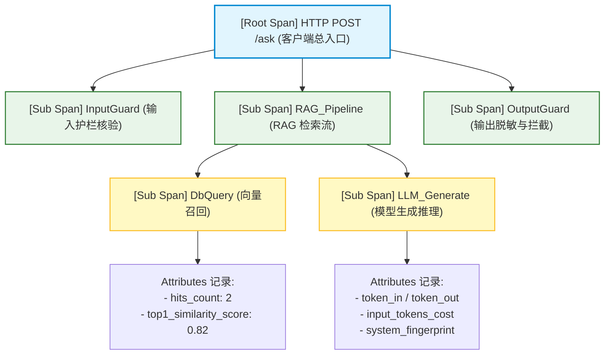
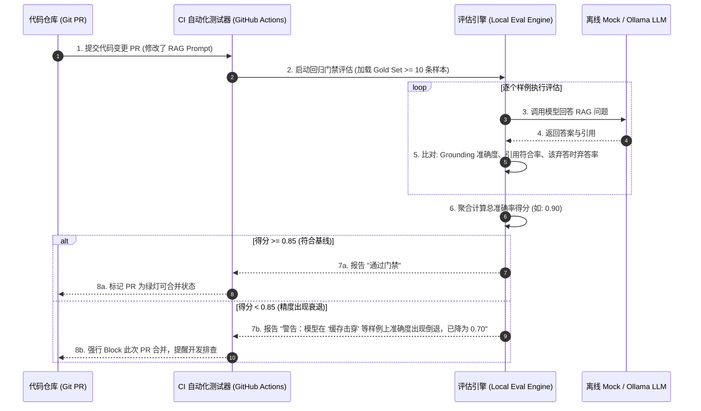
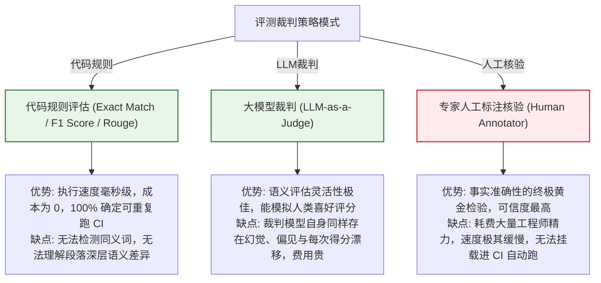

import GlossaryTerm from '@site/src/components/GlossaryTerm';
import GuidedExercise from '@site/src/components/GuidedExercise';
import ResearchNote from '@site/src/components/ResearchNote';
import ChapterMeta from '@site/src/components/ChapterMeta';
import PyRunner from '@site/src/components/PyRunner';
import TradeoffExplorer from '@site/src/components/TradeoffExplorer';
import QuizCard from '@site/src/components/QuizCard';
import StepFlow from '@site/src/components/StepFlow';

# M12L8 · 评估与可观测

<ChapterMeta
  time="约 2.5 小时"
  prereqs={[{label: 'M12L5 RAG 问答', href: './rag-qa-build'}, {label: 'M11L2 评估体系', href: '../production-ai-platform/evaluation-systems'}, {label: 'M11L4 AI 可观测', href: '../production-ai-platform/ai-observability'}]}
  outcome="能给助手装上可观测（每请求 trace：检索/生成/成本）和评估（评估集量化质量、改动不退化），让它从‘感觉能用’变成‘可度量、可调试、可回归’。"
  howToUse="先看‘凭感觉不行’，再落地 trace 和评估集，最后建评估+观测 lab。"
/>

:::tip 助手好不好、出问题在哪，不能靠感觉
助手能答、能评审、能兜底了——但它**答得到底好不好？出问题时是检索还是生成的锅？改了 prompt 会不会悄悄变差？** 这些不能靠感觉。要给它装两样东西：[可观测（M11L4）](../production-ai-platform/ai-observability)——每个请求都能追踪（检索到什么、生成了什么、花了多少）；[评估（M11L2）](../production-ai-platform/evaluation-systems)——一套评估集量化"答得对不对"、改动前后跑回归。这两样让你的助手从"感觉能用"升级成"**可度量、可调试、可回归**"——[也是你毕业验收的硬指标（M12L1）](./capstone-kickoff)。
:::

## 一、"感觉能用"不是工程

没有评估和可观测，你的助手处于"[玄学](../rag/rag-evaluation)"状态：
- **好不好说不清**：答得对不对全凭主观感觉，没有数字。
- **出错不知道哪坏的**：RAG 答错了——是[检索没找到对的，还是找到了生成没用好（M8L9）](../rag/rag-evaluation)？不追踪分不清。
- **改动不敢动**：改了 prompt/换了模型，不知道有没有让某些问题[变差（回归，M11L2）](../production-ai-platform/evaluation-systems)——只能祈祷。

装上评估和可观测，这三件事都变成可度量的工程——这[正是 M11 讲的，现在落到你的项目](../production-ai-platform/evaluation-systems)。

## 二、落地要点（分层）

### 基础：请求级 trace

<GlossaryTerm term="Request Trace" definition="请求级追踪：记录一次助手请求内部每一步——检索到哪些片段、拼了什么 prompt、模型返回什么、花了多少 token/时间——串成可视链路，便于定位问题出在哪一步。">请求 trace（M11L4）</GlossaryTerm>：给每个问答/评审请求记一条 trace——检索到哪些片段（及分数）、生成了什么、[花了多少（M12L9 成本）](./cost-performance-build)、耗时。挂在 [provider 层/一个 tracing 包装（M12L4/L7）](./model-provider-layer) 里统一记。**有了 trace，"答错了"能一眼看出是检索没召回、还是生成没用好。**

### 进阶：评估集与回归

- <GlossaryTerm term="Eval Set" definition="评估集：一批代表性的问答样例（问题 + 参考答案/预期证据），用来量化助手的质量（答案是否正确、是否引用了对的证据、该弃答时是否弃答）。是‘答得好不好’从主观变客观的基础。">评估集（M11L2）</GlossaryTerm>：[立项要求的 ≥10 条问答样例（M12L1）](./capstone-kickoff)——每条含问题 + 预期答案/证据。评估就是让助手答这套题，量化：答对没、引对证据没、[该弃答时弃答没（M12L5）](./rag-qa-build)。
- **回归门禁**：改 prompt/换模型前后都跑评估，[分数掉了就发现（M11L2 回归门禁）](../production-ai-platform/evaluation-systems)——让你**敢改**。这是[评估作为复利资产的价值（M11L2）](../production-ai-platform/evaluation-systems)。

### 深入（选学）：分维度评估与检索/生成分诊

- **分维度**：评估不只看"答案对不对"，还要分[检索质量（召回对的片段没）和生成质量（基于片段答对没）——M8L9](../rag/rag-evaluation)。分开评才知道该优化哪侧——这是[RAG 调优的第一分诊，也是你 trace 的用武之地](./rag-qa-build)。
- **弃答也要评**：评估集要含"[笔记里没有的问题](./rag-qa-build)"——检验助手[该弃答时弃答（不乱编）](../llm-systems/hallucination-guardrails)。这是可信度的关键维度，别只测能答的。
- **mock 下评估要稳定**：用 [mock provider（M12L4）](./model-provider-layer) 时评估结果要确定（mock 输出确定）——保证[评估可重复、CI 可跑（M12L1 无 key 可测）](./capstone-kickoff)。真实评估换真 provider。
- **可观测 + 评估是一体**：[trace 记录的输入输出，正是评估集和 bad case 回流的来源（M11L4）](../production-ai-platform/ai-observability)——展示时你可以指着一条 trace 说"这个 bad case 我加进了评估集防复发"，体现[评估闭环（M11L3）](../production-ai-platform/online-eval-feedback)。
- **别过度**：毕业项目的评估集[10-20 条覆盖核心场景 + 弃答 + 一两个对抗即可](./capstone-kickoff)，不需要生产级的几百条——[匹配项目规模（克制）](../production-ai-platform/evaluation-systems)。

<ResearchNote
  title="项目评估与可观测：请求 trace + 评估集回归，可度量可调试可回归"
  source="M11L2 评估 / M11L4 可观测 / M8L9 RAG 评测；HELM"
  href="https://arxiv.org/abs/2211.09110"
  insight="没评估和可观测助手处于玄学态:好不好凭感觉、出错不知哪坏、改动不敢动。装请求trace(检索片段/生成/成本/耗时,挂provider层)让答错能分检索vs生成失败。装评估集(>=10条问答含预期证据)量化答对/引对/该弃答弃答没,改动前后跑回归门禁让你敢改。分维度评检索vs生成、评估集含弃答和对抗样本。mock下评估稳定可CI。trace输入输出是评估集和bad case回流来源(评估可观测一体、闭环)。毕业项目评估集10-20条覆盖核心+弃答即可别过度。"
  application="给助手加请求trace(检索/生成/成本挂provider层)、建>=10条评估集(含预期证据、弃答样例、对抗)、改动跑回归门禁。分维度评检索vs生成失败。mock保证评估可重复CI可跑。trace的bad case回流评估集防复发(闭环)。评估集匹配项目规模别过度。展示时用trace和评估数字证明可度量可回归。"
/>

## 三、评估与可观测图解 (Deep Dive Diagrams)

本节展示评估与可观测模块的核心拓扑图解：Trace Span 链路结构设计、CI 持续回归测试门禁的逻辑执行，以及三类经典评估范式的取舍对比。

### 1. 结构全景：OTel Distributed Tracing 语义跨度拓扑 (RAG & Agent Spans)



### 2. 控制流程：CI 自动化回归评估门禁执行序列



### 3. 折中谱系：规则评估 vs. 大模型裁判 (LLM-as-a-Judge) vs. 人工评估



### 4. 步骤流演示：异常请求 Trace 根因排查步骤

<StepFlow
  steps={[
    {
      title: '错误信号捕获',
      desc: '在线监控拦截到客户端抛出“无内容可达”错误或低分评定。提取当前 Trace ID 以追踪链路。'
    },
    {
      title: '检索状态切片',
      desc: '展开 Trace 中的 `RAG_Pipeline` 跨度，检查 `DbQuery` 属性中返回的向量 Top-1 得分是否低于阈值。'
    },
    {
      title: '生成输入审查',
      desc: '如果检索分值正常，进入 `LLM_Generate` 跨度，检查注入的 Prompt 中 Context 片段元数据是否已被切断。'
    },
    {
      title: '模型幻觉标记',
      desc: '比对 `LLM_Generate` 的 Raw Output。如确认是模型忽略了 Context 强行瞎编，标记为生成幻觉，并回流至 Gold Set。'
    }
  ]}
/>

---

## 三、跟我做一遍：请求 trace + 评估集回归

<PyRunner
  rows={56}
  expect="每请求可追踪、评估量化、回归门禁挡退化"
  code={`# 1) 请求级 trace(挂在 provider 层;答错能分检索vs生成失败)
def answer_with_trace(question, retrieve_fn, generate_fn):
    hits = retrieve_fn(question)
    trace = {"q": question, "retrieved": [h["id"] for h in hits],
             "retrieval_ok": len(hits) > 0}
    if not hits:
        trace["stage_failed"] = "retrieval"      # 检索失败
        return {"answer": "弃答:无证据", "cites": [], "trace": trace}
    ans = generate_fn(question, hits)
    trace["generated"] = ans
    return {"answer": ans, "cites": [h["id"] for h in hits], "trace": trace}

# 2) 评估集(含正常 + 弃答样例)
EVAL_SET = [
    {"q": "缓存穿透", "expect_cite": "cache", "should_abstain": False},
    {"q": "布隆过滤器", "expect_cite": "cache", "should_abstain": False},
    {"q": "量子纠缠",   "expect_cite": None,   "should_abstain": True},   # 该弃答
]

def run_eval(system):
    correct = 0
    for case in EVAL_SET:
        r = system(case["q"])
        abstained = "弃答" in r["answer"]
        if case["should_abstain"]:
            correct += 1 if abstained else 0            # 该弃答且弃答了
        else:
            correct += 1 if (not abstained and case["expect_cite"] in
                             (r["cites"][0] if r["cites"] else "")) else 0
    return correct / len(EVAL_SET)

DB = {"缓存穿透": [{"id": "cache#0"}], "布隆过滤器": [{"id": "cache#1"}]}
good = lambda q: answer_with_trace(q, lambda x: DB.get(x, []),
                                   lambda x, h: "基于资料的答案")
score = run_eval(good)
print(f"评估得分: {score:.2f}")
# 回归门禁:低于基线就挡住(让你敢改)
BASELINE = 1.0
print("回归门禁:", "PASS" if score >= BASELINE else f"BLOCKED(<{BASELINE})")
print("一条 trace 示例:", good("缓存穿透")["trace"])
print("每请求可追踪、评估量化、回归门禁挡退化")`}
/>

助手装上了两样东西：每个请求的 trace（检索到什么、哪一步失败、生成了什么——答错能分检索 vs 生成失败）、一套含弃答样例的评估集 + 回归门禁（量化质量、改动前后对比防退化）。这就是从"感觉能用"到"可度量可回归"。**试试**：把 good 改成"量子纠缠也硬答"，看评估分下降（弃答维度失分）；想想 trace 里的 `stage_failed` 怎么帮你决定优化检索还是生成。

## 五、动手 Lab（必做）

打开 `labs/month12/m12l8_eval/`：

```bash
python labs/month12/m12l8_eval/test_eval.py
```

实现评估与可观测：请求 trace（能分检索/生成失败）、评估集（含弃答）、回归门禁。

<GuidedExercise
  title="练习指引：给助手装仪表盘和考卷"
  goal="把 trace 和评估集接进助手，让它可度量、可调试、可回归。"
  hints={[
    'trace 记检索到什么、哪步失败(retrieval/generation)、生成什么。',
    '评估集含正常 + 弃答样例(测该弃答时弃答没)。',
    'run_eval 分维度量化;回归门禁对比基线。',
    'mock 下评估要确定可重复。'
  ]}
  steps={[
    '实现 answer_with_trace(记 trace + 分阶段失败)。',
    '建 >=3 条评估集(含弃答样例)。',
    '实现 run_eval 和回归门禁。',
    '写测试:trace 记录完整、检索/生成失败可分、弃答被评估、门禁挡退化。'
  ]}
  checks={[
    '我的每个请求有 trace,答错能分检索 vs 生成失败。',
    '我有评估集(含弃答样例)量化质量。',
    '我有回归门禁,改动前后能发现退化。',
    '我理解评估和可观测一体、trace 的 bad case 可回流评估集。'
  ]}
/>

## 架构师深潜（Staff+ 视角）

### 1. 质量保障投入

<TradeoffExplorer
  title="毕业项目的质量保障投入"
  dimensions={['可度量', '可调试', '可回归', '实施成本低', '推荐度']}
  options={[
    {
      name: '全靠人工感觉',
      scores: [1, 1, 1, 5, 1],
      note: '手动试几个问题看感觉。零成本。但说不清好坏、查不了根因、改动不敢动。',
      whenToUse: '最初探索;不可作为交付。'
    },
    {
      name: 'trace + 评估集(推荐)',
      scores: [5, 5, 5, 3, 5],
      note: '每请求 trace + 评估集回归。可度量、可调试、敢改。毕业项目该有的水平。',
      whenToUse: '毕业项目交付标准。'
    },
    {
      name: '生产级全套',
      scores: [5, 5, 5, 1, 3],
      note: '在线评估+漂移+大评估集+看板。最全。但对单用户毕业项目过重。',
      whenToUse: '真实生产;毕业项目按需简化。'
    }
  ]}
/>

### 2. 评估集是你毕业项目里"最像资深工程师"的部分

如果要在你的毕业项目里挑一个东西，最能让评审看出你"不只是会调 API，而是懂工程"的，那就是评估集。原因很简单：**绝大多数人做 AI 项目止步于"我试了几个问题，看起来能用"，而建评估集意味着你把"好不好"变成了可度量、可回归的工程**——这正是[强 AI 团队和弱团队的分水岭（M11L2）](../production-ai-platform/evaluation-systems)。当你在展示时能说"我有一套 15 条的评估集，覆盖正常问答、弃答、和对抗注入；我每次改 prompt 都跑回归，这是改动前后的分数对比"，评审立刻知道你**理解 AI 工程的本质不是让它工作一次，而是让它可持续地、可验证地工作**。更妙的是，评估集让你的其他所有工作都"可证明"：你说 RAG 会弃答？评估集里有弃答样例证明它真的弃答了。你说改动不会退化？回归门禁的数字为证。你说能分检索还是生成失败？trace 摆在那里。**评估和可观测是把你其他所有努力"变得可信、可展示"的元能力**——没有它们，你说的一切都是"我觉得"；有了它们，你说的一切都是"数据显示"。这也是为什么这一课虽然不新增什么炫酷功能，却可能是整个毕业项目**含金量最高**的一课：它体现的不是你会什么技术，而是你有没有[工程师的严谨——用度量代替感觉、用回归代替祈祷（M1 测试、M11 评估一脉相承）](../foundations/testing-and-tdd)。带着评估集去展示，你展示的不是一个 demo，而是一个**有质量保障的工程作品**。

### 3. 架构师深问（给自己 30 分钟）

- 你的助手答错时，能靠 trace 分清是检索还是生成的锅吗？还是只能猜？
- 你有评估集吗？它含弃答/对抗样例吗？你改 prompt 时跑回归吗，还是靠祈祷？
- 展示时，你能用数字和 trace 证明"它答得好、改动不退化、该弃答会弃答"吗？

## 知识自测

<QuizCard
  questions={[
    {
      q: 'AI 系统的研发中，关于“凭感觉进行调试与调优”所面临的核心困境，以下描述正确的是：',
      options: [
        'A. 凭感觉可以省去在 Docusaurus 静态网站中跑 Docusaurus build 的时间',
        'B. 大模型具备高度的不确定性。修改了一个 Prompt 往往会在解决某个问题的同时，引发其他 3 个本来正常问题的准确度大倒退。没有回归评估集（Gold Set）与链路追踪，开发团队无异于“摸黑走路”，无法以数据驱动优化',
        'C. 感觉能用就可以直接上线，所有的评估和门禁都应该是在线灰度切流后才进行的',
        'D. 代码编写正确即意味着系统在面对任何外部 Prompt 输入时均不会出现故障'
      ],
      answer: 1,
      explain: '这就是“气球效应（Balloon Effect）”。在复杂的 LLM 应用或 RAG 场景中，调整 Prompt 的边际影响很难靠肉眼试问两三个问题来判定。必须有一套固定的回归测试集（Regression Set）并在 CI 中自动执行，才能在每一次提交代码时自信地证明没有退化。'
    },
    {
      q: '在构建大模型系统的可观测性（Observability）时，相较于传统的服务器 CPU/内存监控，AI 系统的 Trace（链路追踪）需要特别抓取哪些维度的黄金指标（Metrics）？',
      options: [
        'A. 网卡物理驱动的版本号与机架号',
        'B. 检索召回的 Top-K 片段（及 Cosine 得分）、拼装后的 Raw Prompt、LLM 返回的 Raw Text，以及各阶段消耗的输入/输出 Token 数与折算成本',
        'C. CLI 命令行的窗口宽度与背景颜色参数',
        'D. 代码提交到 Git 仓库所消耗的时间'
      ],
      answer: 1,
      explain: 'AI 可观测的命脉在于“还原现场”。当回答发生幻觉或违规泄密时，只有完整记录下那次请求到底喂给了模型什么（Context 详情）、模型吐了什么、甚至检索阶段的相似度打分，才能精准分诊出到底是“检索没找到”还是“生成瞎写”，这是进行排障的底线要求。'
    },
    {
      q: '回归评估集（Gold Set）中，为什么必须刻意设计“知识库里根本不存在相关资料的问题”（例如在架构笔记库里提问量子计算原理）？',
      options: [
        'A. 用以验证系统的 CPU 主频在处理长单词时是否会发生过载',
        'B. 用以客观量化和拦截系统应该“诚实弃答（Abstention）”的样本表现，防止大模型在缺乏证据时依旧强行产生幻觉编造假答案',
        'C. 为了测试 Docusaurus 会话超时机制的 Fail-Safe 上限',
        'D. 这样能自动降低 Ollama 本地运行时的内存吞吐压力'
      ],
      answer: 1,
      explain: '一个可靠的 RAG 系统最核心的硬指标之一是“知道自己不知道”。如果在评估集中只有正常能回答的问题，我们便无法量化系统对于幻觉注入的“拒绝率”。通过刻意加入无法检索的对抗问答，可验证系统在该弃答时是否真正做到了 Fail-Safe，这也是 Month 11 的核心标准。'
    }
  ]}
/>

## 自检清单

- [ ] 我的每个请求有 trace，答错能分检索 vs 生成失败。
- [ ] 我有 ≥10 条评估集，含弃答和对抗样例。
- [ ] 我有回归门禁，改动前后能发现退化。
- [ ] 我理解评估集是把其他工作"变得可证明"的元能力。

## 常见误解

- **"试几个问题看着能用就行"**：那是感觉不是工程；要评估集量化、回归防退化。
- **"评估就看答案对不对"**：要分维度（检索/生成）、含弃答样例，才能分诊和保可信。
- **"评估集是可有可无的额外工作"**：它是让你其他所有工作可证明、可回归的元能力，含金量最高。

## 延伸阅读

- [M11L2 评估体系](../production-ai-platform/evaluation-systems) · [M11L4 AI 可观测](../production-ai-platform/ai-observability) · [M8L9 RAG 评测](../rag/rag-evaluation)
- [下一阶段：成本与性能](./cost-performance-build)
