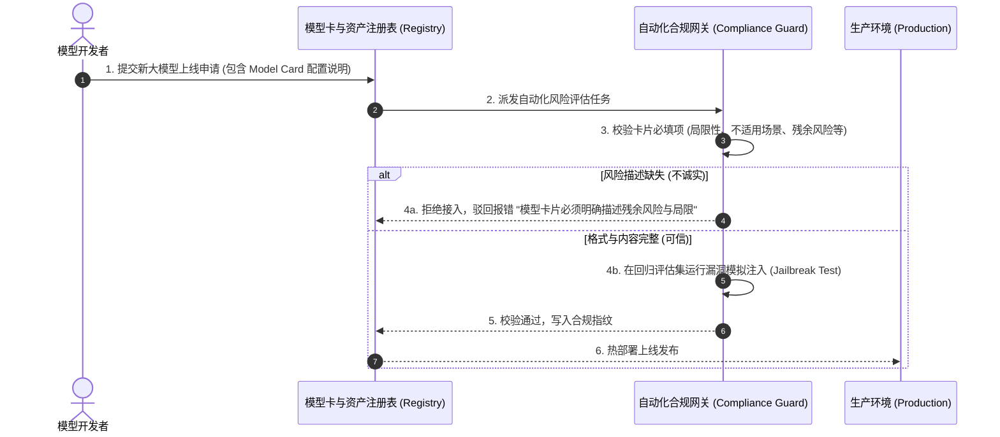
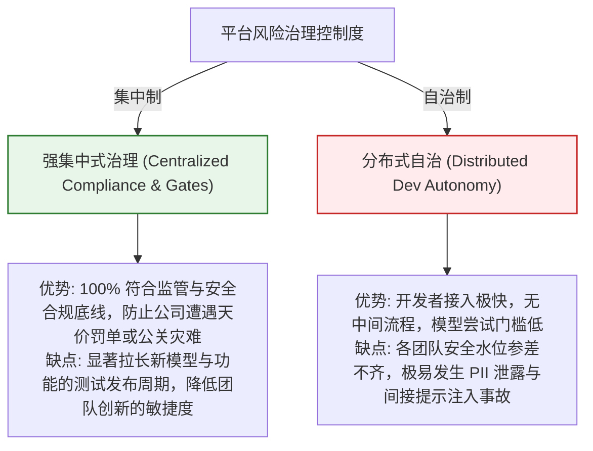

import GlossaryTerm from '@site/src/components/GlossaryTerm';
import GuidedExercise from '@site/src/components/GuidedExercise';
import ResearchNote from '@site/src/components/ResearchNote';
import ChapterMeta from '@site/src/components/ChapterMeta';
import PyRunner from '@site/src/components/PyRunner';
import TradeoffExplorer from '@site/src/components/TradeoffExplorer';
import QuizCard from '@site/src/components/QuizCard';
import StepFlow from '@site/src/components/StepFlow';

# M12L10 · 治理与风险说明

<ChapterMeta
  time="约 2 小时"
  prereqs={[{label: 'M12L7 护栏', href: './reliability-guardrails-build'}, {label: 'M11L5 威胁建模', href: '../production-ai-platform/llm-threat-modeling'}, {label: 'M11L7 风险治理', href: '../production-ai-platform/risk-governance-frameworks'}]}
  outcome="能给助手产出一份诚实的治理与风险文档：模型卡（用途/局限/不适用）、威胁建模摘要、简化项说明——体现负责任的架构判断。"
  howToUse="先看‘诚实的局限说明比华丽的功能更显专业’，再落地风险文档，最后建风险清单 lab。"
/>

:::tip 最专业的一份文档，是诚实地说清"它不该用在哪"
到这里助手很能打了。但一个真正专业的交付，还差一份**诚实的风险说明**——它有什么局限（可能检索不全、可能被间接注入、mock 下答案是模板）？什么场景**不该**用它（别拿它做医疗/法律/重要决策）？做了哪些[威胁建模（M11L5）](../production-ai-platform/llm-threat-modeling)？为了聚焦刻意简化了什么（没做 PII 合规、没做人工审批）？这份文档不会让你的项目显得"弱"，恰恰相反——**能清醒地说清自己系统的边界和风险，是负责任的架构师区别于只会炫功能的人的标志（[M11L7 治理](../production-ai-platform/risk-governance-frameworks)）。**
:::

## 一、只讲功能不讲风险，是不专业的

一个只展示"我能做什么"、绝口不提局限和风险的交付，在有经验的评审眼里是**减分**的：
- **没有系统是完美的**：你的助手一定有局限（[检索可能漏、可能被注入、mock 有假答案](./reliability-guardrails-build)）——不说，要么是没意识到（危险），要么是回避（不诚实）。
- **不说不该用在哪，就会被用错**：[如果不明确"别拿它做重要决策"，用户可能过度信任（M11L7 模型卡）](../production-ai-platform/risk-governance-frameworks)。
- **不说简化了什么，评审会以为你不懂**：主动说"我为了聚焦简化了 PII 合规，真实生产要补 X"，[反而证明你懂全貌、是有意识的取舍（M12L1 非目标）](./capstone-kickoff)。

所以专业的交付必含一份[风险与治理说明（M11L7）](../production-ai-platform/risk-governance-frameworks)——诚实、清醒、负责任。

## 二、风险文档三件套（分层）

### 基础：模型卡（用途、局限、不适用）

<GlossaryTerm term="Model Card" definition="模型卡：记录一个 AI 系统关键信息的文档——用途、能力、已知局限与风险、适用与不适用场景。让使用者清楚‘它能做什么、不能做什么、不该用在哪’。">模型卡（M11L7）</GlossaryTerm>：一页说清你的助手——**用途**（从我的架构笔记答问题、生成评审清单）、**能力边界**（只懂我笔记里有的、答案质量取决于笔记质量）、**已知局限**（可能检索不全、mock 下是模板答案、可能被间接注入）、**不适用场景**（不该用于[医疗/法律/重要决策、不该盲信（M11L7）](../production-ai-platform/risk-governance-frameworks)）。

### 进阶：威胁建模摘要

把 [M11L5 的威胁建模](../production-ai-platform/llm-threat-modeling) 落到你的项目：列出主要威胁（用户注入、[笔记里的间接注入](../production-ai-platform/llm-threat-modeling)、敏感信息泄露）、对应的[防护（M12L7 护栏）](./reliability-guardrails-build)、以及**残余风险**（哪些没完全防住、为什么可接受）。诚实标注"这个威胁我用 X 缓解了但没根治"。

### 深入（选学）：简化说明与责任边界

- **明确简化了什么**：毕业项目为聚焦[刻意简化的（M12L1 非目标）](./capstone-kickoff)——没做多用户权限、没做 [PII 合规脱敏的完整版](./reliability-guardrails-build)、没做[人工审批（M11L8）](../production-ai-platform/human-oversight-fallback)——都要写清"简化了 X，真实生产需要补 Y"。**这不是认怂，是[展示你懂完整图景、做了有意识的范围取舍（M12L2 ADR）](./architecture-decisions)。**
- **责任边界**：说清[这个助手是辅助工具、最终判断在人（M11L8 人类监督）](../production-ai-platform/human-oversight-fallback)——它给的评审清单是建议不是定论、它的答案要用户自己核实（这也是[为什么要引用，M12L5](./rag-qa-build)）。
- **按项目风险裁剪治理**：[单用户本地助手（M12L1）](./capstone-kickoff) 不需要生产级的[审计合规（M11L7）](../production-ai-platform/risk-governance-frameworks)——治理文档要[匹配项目实际风险（M11L7 按风险分级）](../production-ai-platform/risk-governance-frameworks)，一页诚实的说明胜过十页形式化的合规套话。
- **风险文档也是判断力的展示**：能写出"这个威胁我评估过、影响可控所以接受"而非"我全防住了"（不可能），[体现的是成熟的风险判断（M11L5 按影响排序）](../production-ai-platform/llm-threat-modeling)——[真实世界没有零风险，只有被认识和管理的风险](../production-ai-platform/risk-governance-frameworks)。

<ResearchNote
  title="项目治理与风险说明：模型卡+威胁摘要+简化说明，诚实即专业"
  source="M11L5 威胁建模 / M11L7 风险治理 / M11L8 人类监督；Model Cards"
  href="https://arxiv.org/abs/1810.03993"
  insight="专业交付必含诚实风险说明,只讲功能不讲局限是减分。三件套:模型卡(用途/能力边界/已知局限/不适用场景如别做医疗法律重要决策)、威胁建模摘要(主要威胁+对应防护+诚实标注残余风险)、简化说明(刻意简化了什么、真实生产要补什么)。责任边界:助手是辅助、最终判断在人、答案要核实(故要引用)。按项目风险裁剪治理,单用户本地不需生产级合规,一页诚实胜十页套话。能说‘这威胁评估过影响可控故接受’而非‘全防住了’体现成熟风险判断——没有零风险只有被管理的风险。"
  application="给助手写风险文档:模型卡(用途/局限/不适用)、威胁摘要(威胁->防护->残余风险)、简化说明(简化了什么真实要补什么)、责任边界(辅助工具需人核实)。按项目风险裁剪、一页诚实即可。主动说清局限和简化=展示懂全貌的有意识取舍,是负责任架构师的标志。"
/>

## 三、安全威胁与风险治理图解 (Deep Dive Diagrams)

本节展示毕业设计治理与合规的核心图解：系统安全攻击面（OWASP Top 10）拓扑、模型注册与发布的安全准入审查时序，以及治理强度与业务创新敏捷的取舍对比。

### 1. 结构全景：Architecture Assistant 安全攻击面与防御边界拓扑

```mermaid
graph TD
    classDef input fill:#ffebee,stroke:#c62828,stroke-width:1.5px;
    classDef boundary fill:#e1f5fe,stroke:#0288d1,stroke-width:2px;
    classDef mitigation fill:#e8f5e9,stroke:#2e7d32,stroke-width:1.5px;

    UserPrompt["用户 Prompt 越狱输入"]:::input -->|边界A: 外部直接输入| Gateway["模型网关拦截面"]:::boundary
    Note over Gateway: 防御: 输入正则表达式校验 & 长度限制

    Gateway --> RAGPipeline["RAG 检索合成器"]:::boundary
    LocalDoc["本地笔记库 (可能遭窜改)"]:::input -->|边界B: 间接提示词注入| RAGPipeline
    Note over RAGPipeline: 防御: Markdown 隔离标签 + System Prompt 约束

    RAGPipeline --> LLMAPI["大模型提供商 API"]:::boundary
    LLMAPI -->|边界C: 幻觉与泄露输出| OutGuard["输出护栏过滤面"]:::boundary
    Note over OutGuard: 防御: PII 数据脱敏 & 敏感词屏蔽

    OutGuard --> FinalUser["终端展示"]
```

### 2. 控制流程：合规准入检测与发布审核序列



### 3. 折中谱系：强制集中度治理 vs. 分散式开发者自治



### 4. 步骤流演示：威胁建模与风险分析生命周期

<StepFlow
  steps={[
    {
      title: '识别资产边界',
      desc: '定义系统数据面、控制面的必经链路，标识出哪些地方接受了不受信的外部输入（如笔记和用户问题）。'
    },
    {
      title: '威胁矩阵分析',
      desc: '对应 OWASP LLM 漏洞列表，逐项排查“输入越狱”、“敏感词提取”、“越权操作”在系统中的攻击可能性。'
    },
    {
      title: '缓解机制设计',
      desc: '在网关 Provider 层设计对应的正则检测、PII 屏蔽、只读白名单工具以及指数退避降级兜底。'
    },
    {
      title: '残余风险评定',
      desc: '诚实记录在现有防御下依旧无法 100% 根除的潜在危险，为用户提供模型卡警示，声明人身责任。'
    }
  ]}
/>

---

## 三、跟我做一遍：结构化的风险说明

<PyRunner
  rows={52}
  expect="模型卡+威胁+简化说明,诚实完整"
  code={`# 把治理/风险说明结构化(它是你交付的一等文档)
risk_doc = {
    "model_card": {
        "purpose": "从我的架构笔记回答问题、生成评审清单",
        "capabilities": "只懂笔记里有的内容;答案质量取决于笔记质量",
        "limitations": ["可能检索不全", "mock 下是模板答案", "可能被间接注入"],
        "not_for": ["医疗/法律/财务决策", "作为唯一权威、盲信不核实"],
    },
    "threats": [
        {"threat": "用户提示注入", "mitigation": "输入护栏检测", "residual": "变体可能绕过,影响限于本会话"},
        {"threat": "笔记间接注入", "mitigation": "检索内容标注为资料、和指令隔离", "residual": "未根治,来源要可信"},
        {"threat": "敏感信息泄露", "mitigation": "输出脱敏+防泄露系统提示", "residual": "低,本地单用户"},
    ],
    "simplifications": [
        "未做多用户权限(非目标:单用户)",
        "未做完整 PII 合规(真实生产需补脱敏与审计)",
        "未做人工审批(评审 Agent 只读、无危险操作,故可省)",
    ],
    "responsibility": "辅助工具,评审是建议非定论,答案需用户据引用自行核实",
}

def audit_risk_doc(d):
    problems = []
    if not d["model_card"]["not_for"]:
        problems.append("缺‘不适用场景’(会被用错)")
    if not d["model_card"]["limitations"]:
        problems.append("缺已知局限(没有系统是完美的)")
    if any("residual" not in t for t in d["threats"]):
        problems.append("威胁缺残余风险(要诚实标注没根治的)")
    if not d["simplifications"]:
        problems.append("缺简化说明(要说明有意识的取舍)")
    return problems or ["风险文档诚实完整"]

for line in audit_risk_doc(risk_doc):
    print("-", line)
print("模型卡+威胁+简化说明,诚实完整")`}
/>

一份结构化的风险文档：模型卡（用途/局限/**不适用场景**）、威胁摘要（威胁→防护→**诚实标注残余风险**）、简化说明（**刻意简化了什么、真实生产要补什么**）、责任边界（辅助工具、需人核实）——还能自检是否诚实完整（缺"不适用""残余风险""简化说明"就报警）。**试试**：给你的项目加一条真实的局限；想想为什么"标注残余风险"比声称"全防住了"更专业（后者不可信）。

## 五、动手 Lab（必做）

打开 `labs/month12/m12l10_risk/`：

```bash
python labs/month12/m12l10_risk/test_risk.py
```

实现风险文档校验器：检查模型卡有不适用场景/局限、威胁有残余风险、有简化说明——并为你的项目写一份诚实的风险文档。

<GuidedExercise
  title="练习指引：写一份诚实的风险文档"
  goal="为你的助手产出模型卡 + 威胁摘要 + 简化说明，体现负责任的风险判断。"
  hints={[
    '模型卡必含 not_for(不适用场景)和 limitations(局限)。',
    '每个威胁写 mitigation 和 residual(残余风险,诚实标注没根治的)。',
    'simplifications 说明刻意简化了什么、真实生产要补什么。',
    '责任边界:辅助工具、需人核实。'
  ]}
  steps={[
    '写 risk_doc(model_card/threats/simplifications/responsibility)。',
    '实现 audit_risk_doc 校验诚实完整。',
    '确保标注了残余风险和简化(不声称完美)。',
    '写测试:缺不适用/局限/残余风险/简化说明都能被查出。'
  ]}
  checks={[
    '我的模型卡说清了用途、局限、不适用场景。',
    '我的威胁摘要诚实标注了残余风险(没声称全防住)。',
    '我说明了刻意简化了什么、真实生产要补什么。',
    '我理解诚实说清边界和风险,是负责任架构师的标志。'
  ]}
/>

## 架构师深潜（Staff+ 视角）

### 1. 风险表达方式

<TradeoffExplorer
  title="项目的风险表达方式"
  dimensions={['诚实/可信', '显专业', '帮用户正确使用', '简洁', '推荐度']}
  options={[
    {
      name: '只讲功能不提风险',
      scores: [1, 1, 1, 5, 1],
      note: '光展示能做什么。看着强。但不诚实、会被用错、有经验的评审减分。',
      whenToUse: '不推荐。'
    },
    {
      name: '诚实的风险文档(推荐)',
      scores: [5, 5, 5, 4, 5],
      note: '模型卡+威胁+残余风险+简化说明。诚实、专业、帮用户正确用。一页即可。',
      whenToUse: '任何专业交付。'
    },
    {
      name: '形式化合规套话',
      scores: [2, 2, 2, 1, 2],
      note: '十页免责声明式套话。看着‘正规’。但空洞、没针对性、没人看。',
      whenToUse: '别为形式而形式;要针对项目实际风险。'
    }
  ]}
/>

### 2. 承认局限的能力，是技术成熟度的最高体现之一

有一个反直觉但深刻的规律：**越是初级的工程师，越倾向于宣称自己的系统"没问题、都搞定了"；越是资深的架构师，越能清晰、坦然地列出自己系统的局限和风险。** 原因是，认识到一个系统所有可能出问题的地方，恰恰需要对这个系统**最深刻的理解**——你得真正懂 RAG 才知道它会检索不全、真正懂[提示注入（M11L5）](../production-ai-platform/llm-threat-modeling) 才知道间接注入没法根治、真正懂[评估（M11L2）](../production-ai-platform/evaluation-systems) 才知道你的评估集覆盖不了所有情况。所以一份诚实、具体、切中要害的风险文档，反而是**能力的证明而非示弱**：它告诉评审"我不仅让它工作，我还清楚地知道它在什么边界会不工作、为什么、以及我如何管理这些风险"。这正是[贯穿 AI 阶段的核心态度（M7L9 承认会幻觉、M8L8 会弃答、M11 全套治理）](../llm-systems/hallucination-guardrails)：**成熟的工程不是假装没有风险，而是认识、量化、管理风险。** 在你的毕业展示里，当你主动说"这里有一个我没有完全解决的间接注入风险，我用了内容隔离缓解，残余风险是需要保证笔记来源可信"，你展现的不是一个有漏洞的项目，而是一个**懂得敬畏复杂性、诚实面对不确定性的架构师头脑**——而这，比任何华丽的功能演示都更能赢得资深评审的尊重。**因为他们知道，真正危险的不是有局限的系统，而是不知道自己有局限的工程师。**

### 3. 架构师深问（给自己 30 分钟）

- 你能清楚列出你助手的 5 个局限和 3 个不适用场景吗？还是觉得"它挺好的没什么问题"？
- 你的威胁有诚实标注残余风险（没根治的），还是声称"全防住了"？
- 你刻意简化的东西（PII 合规、多用户、人审）都说明了吗？这体现你懂全貌还是回避？

## 知识自测

<QuizCard
  questions={[
    {
      q: '为什么模型卡片（Model Card）必须强制包含“不适用场景（Not Applicable）”与“已知局限（Limitations）”？',
      options: [
        'A. 为了在 Docusaurus 构建出错时能够自动找到替代的 MDX 页面',
        'B. 确保用户或开发人员在使用 AI 模型时不会产生过度信任（Over-reliance）。明确说明系统在面对医疗、法律等专业决策时的局限，能够划清责任边界，引导用户自行核实证据，是负责任架构的关键',
        'C. 模型卡片能直接改变云端 API 提供商的推理定价',
        'D. 不包含这些选项会导致 Python 编译时抛出 broken links 错误'
      ],
      answer: 1,
      explain: 'AI 系统的核心硬约束是“敬畏局限性”。大模型具备概率黑盒特征，无法承诺 100% 准确。诚实公开其在何种特定深度场景下（如断网、未覆盖的笔记库）会失效，有利于保护使用者不做出超出系统承载极限的高危操作。'
    },
    {
      q: '在进行 LLM 应用威胁建模时，关于“残余风险 (Residual Risk)”的正确理解是：',
      options: [
        'A. 残余风险是指在配置完同步和异步所有安全组件后，依然无法完全消灭的潜在漏洞。架构师应当客观描述这些漏洞并判定其在单用户本地场景下是否可控，而不是宣称“100% 零风险”',
        'B. 残余风险是指大模型在推理后残留在本地内存中的向量碎屑，必须每天手动格式化硬盘以清理',
        'C. 它是指在 Git 上由于 commit 失败而遗留下来的垃圾代码分支',
        'D. 只要 Prompt 写的长，系统的残余风险就会自动清零'
      ],
      answer: 0,
      explain: '在真实世界中根本不存在绝对的安全防御。即使在网关层部署了最先进的正则分类器，黑客依然可以通过不断变换字词拼写、多语种混淆等“提示注入变体”绕过防线。架构师的目标是“了解并管理风险”，承认并记录残余风险，是技术成熟度的证明。'
    },
    {
      q: '对于一个本地运行的毕业项目助理，主动撰写并公开“简化说明”的核心作用是：',
      options: [
        'A. 告诉评审人员该项目功能缺失，需要给予更低的评分',
        'B. 表明开发人员没有在 Git 上正确拉取 master 依赖',
        'C. 证明架构师具备全局视角的系统思维。表明为了聚焦于核心的 RAG 与 Agent 架构逻辑，而主动、有意识地将多租户鉴权、完整的 PII 级数据合规等组件进行了裁剪，展现了克制的设计品味',
        'D. 这样可以使 PyRunner 完全离线运行而无需本地 Python 环境'
      ],
      answer: 2,
      explain: '这就是“刻意简化”。架构的艺术不在于堆积所有功能，而在于根据项目约束进行精准的裁剪。主动阐明“为什么简化了 PII 和人工审批”，能向架构评审人清晰传递出“我知道完整版怎么做，但我选择了最聚焦的核心路线”，这是非常加分的专业沟通技巧。'
    }
  ]}
/>

## 自检清单

- [ ] 我的模型卡说清了用途、能力边界、已知局限、不适用场景。
- [ ] 我的威胁摘要列了威胁→防护→残余风险，诚实标注没根治的。
- [ ] 我说明了刻意简化了什么、真实生产要补什么。
- [ ] 我理解诚实承认局限是技术成熟度的体现，不是示弱。

## 常见误解

- **"讲风险和局限会让项目显得弱"**：恰恰相反，清醒说清边界是负责任架构师的标志，赢得尊重。
- **"威胁要都声称防住了"**：不可能根治一切；诚实标注残余风险才可信、才专业。
- **"简化了就别提"**：主动说明简化和真实生产要补什么，证明你懂全貌、是有意识的取舍。

## 延伸阅读

- [M11L5 威胁建模](../production-ai-platform/llm-threat-modeling) · [M11L7 风险治理](../production-ai-platform/risk-governance-frameworks) · [M11L8 人类监督](../production-ai-platform/human-oversight-fallback)
- [下一阶段：集成与端到端](./integration-e2e)
