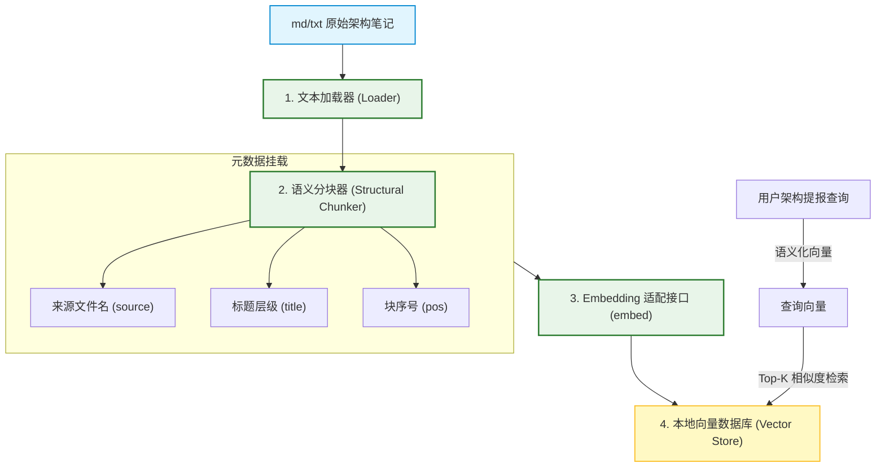
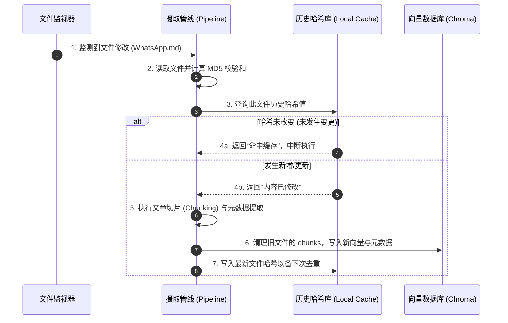
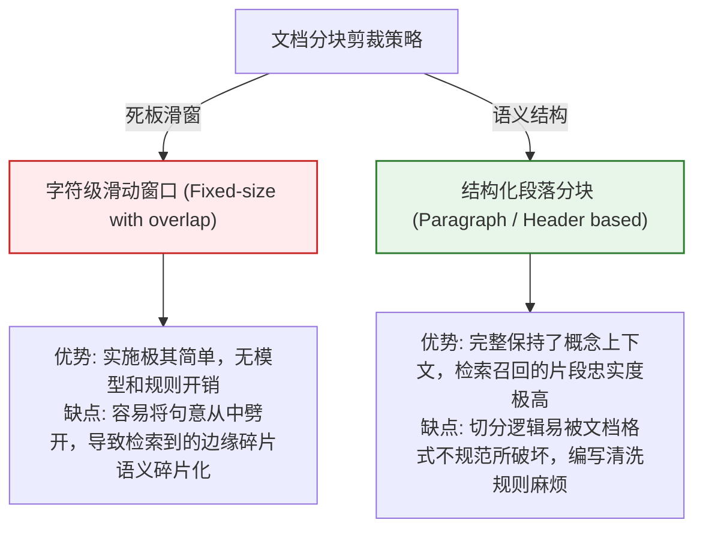

import GlossaryTerm from '@site/src/components/GlossaryTerm';
import GuidedExercise from '@site/src/components/GuidedExercise';
import ResearchNote from '@site/src/components/ResearchNote';
import ChapterMeta from '@site/src/components/ChapterMeta';
import PyRunner from '@site/src/components/PyRunner';
import TradeoffExplorer from '@site/src/components/TradeoffExplorer';
import QuizCard from '@site/src/components/QuizCard';
import StepFlow from '@site/src/components/StepFlow';

# M12L3 · 知识地基：摄取与检索

<ChapterMeta
  time="约 3 小时"
  prereqs={[{label: 'M12L2 架构决策', href: './architecture-decisions'}, {label: 'M8L4 分块', href: '../rag/chunking'}, {label: 'M8L3 向量检索', href: '../rag/vector-search'}]}
  outcome="能动手建 RAG 地基：把笔记摄取、分块、embedding、存进（本地）向量库，并按查询检索出相关片段——助手的记忆底座。"
  howToUse="先看‘助手的记忆从哪来’，再落地摄取→分块→embedding→检索管道，最后建你的知识地基 lab。"
/>

:::tip 从这一课起，开始真正动手建系统
[立项](./capstone-kickoff) 和[架构决策](./architecture-decisions) 定好了，现在建第一块真东西：**知识地基**。助手要能回答你笔记里的问题，前提是它得先"记住"你的笔记——把笔记[摄取、分块、embedding、存进向量库（M8）](../rag/overview)，才能在提问时检索出相关片段喂给模型。这是[你在 M8 学的 RAG 检索侧的落地实践](../rag/overview)，也是整个助手的记忆底座——**地基不牢，后面 RAG 答得再花哨也是空中楼阁（检索不到对的，生成也救不回来）**。
:::

## 一、助手的"记忆"怎么建

助手不是靠模型"背下"你的笔记（模型没见过你的私有笔记），而是靠一条**摄取管道**把笔记变成可检索的记忆：
1. **摄取（ingest）**：读入你的笔记文件（md/txt）。
2. **[分块（chunk，M8L4）](../rag/chunking)**：切成大小合适、有重叠的片段——太大噪声多、太小丢上下文。
3. **[embedding（M8L2）](../rag/embeddings)**：每块转成向量，让"语义相似"可计算。
4. **存入[向量库（M8L3）](../rag/vector-search)**：本地优先（内存/轻量库即可，[呼应架构决策](./architecture-decisions)）。
5. **检索**：提问时把问题也 embedding，找最相似的几块。

这条管道你在 [M8 全学过](../rag/overview)，这一课是把它**在你自己的笔记上真正跑通**。

## 二、落地要点（分层）

### 基础：摄取 + 分块 + 检索最小管道

先跑通最小闭环：读文件 → 分块 → embedding → 存 → 按查询检索 top-k。**先能端到端跑通，再优化质量**（[呼应 M12L1 可运行优先](./capstone-kickoff)）。这一步就能验证"检索能不能找回相关片段"——RAG 的一切建立在此。

### 进阶：分块策略与元数据

- **[分块策略（M8L4）](../rag/chunking)**：按段落/标题切、保持语义完整、适度重叠防切断。你的笔记有结构（标题层级），[按结构分块比死板定长更好](../rag/chunking)。
- **元数据**：每块记来源文件、标题、位置——检索时能[返回引用（M12L5 答案要引用）](./rag-qa-build)、也能[按元数据过滤（M8L10）](../rag/advanced-rag)。**没有元数据就没法引用，而引用是你的核心用例。**

### 深入（选学）：本地地基的工程考量

- **embedding 的本地/mock 取舍**：真 embedding 要模型（本地或云）；为了[无 key 可跑（M12L1）](./capstone-kickoff)，可以用一个**确定性的 mock embedding**（如基于词哈希的简单向量）保证管道能跑通、可测试——真实用时换成真 embedding（[provider 可替换，M12L4](./model-provider-layer)）。这正是"[可运行优先、接口可替换](./model-provider-layer)"的体现。
- **增量与新鲜度（[M8L11](../rag/knowledge-base-ops)）**：笔记会更新——地基要支持[增量摄取（只重建变化的）、去重](../rag/knowledge-base-ops)，而非每次全量重建。毕业项目可以先做全量、但要在文档里说明这是简化、真实要增量。
- **检索质量是 RAG 的命门**：[检索不到对的，生成再强也白搭（M8L9 先分清检索还是生成失败）](../rag/rag-evaluation)——所以这块地基的质量直接决定助手上限。留一个[检索评估的钩子（M12L8）](./eval-observability-build)，之后能量化召回。
- **别过度工程地基**：几千条笔记用不上[分布式向量库/复杂 ANN（M8L3）](../rag/vector-search)——内存里线性扫描或简单索引就够（[呼应架构决策的克制](./architecture-decisions)）。地基匹配规模即可。

<ResearchNote
  title="RAG 地基落地：摄取→分块→embedding→向量库→检索，本地优先可 mock"
  source="M8 RAG 全模块；M8L4 分块 / M8L11 知识库工程"
  href="https://arxiv.org/abs/2005.11401"
  insight="助手记忆靠摄取管道:读文件→按结构分块(适度重叠)→embedding→存本地向量库→按查询检索top-k。先端到端跑通再优化质量。每块带元数据(来源/标题/位置)才能返回引用(核心用例)。为无key可跑用确定性 mock embedding、真用时换真的(provider可替换)。笔记会更新需增量摄取去重。检索质量是RAG命门直接决定上限,留检索评估钩子。几千条笔记别上分布式向量库(过度工程),内存线扫即可。"
  application="建知识地基:摄取→按结构分块带重叠→embedding(可mock)→本地向量库→top-k检索。每块存元数据供引用和过滤。先跑通再调质量。规模小用内存检索别过度。真实要增量摄取,毕业项目可先全量但文档说明。留检索评估钩子量化召回。"
/>

## 三、摄取与向量检索图解 (Deep Dive Diagrams)

本节展示 RAG 地基的核心图解：知识摄取与清洗加工链路、文档切片与编码持久化时序，以及不同文档分块策略在语义保持度与检索冗余度上的权衡。

### 1. 结构全景：知识库 ingestion 管道与检索分级拓扑



### 2. 控制流程：增量摄取与索引数据流转时序



### 3. 折中谱系：滑动窗口切片 vs. 语义树状切片



### 4. 步骤流演示：端到端本地向量检索流程

<StepFlow
  steps={[
    {
      title: '文本载入',
      desc: '读取本地目录下的 md/txt 架构文章，剔除冗余空格与无意义符号。'
    },
    {
      title: '边界切片',
      desc: '按两个换行符作为段落边界，把长文章切分成 300~500 字符大小的语义块，且带有 10% 的上下文重叠。'
    },
    {
      title: '向量表征',
      desc: '调起本地 embedding 模型（或 Mock 哈希）将文本映射为多维浮点数稠密向量。'
    },
    {
      title: '拓扑存储',
      desc: '将向量与包含文件名和位置的元数据绑定，入库到本地 SQLite/内存数据库。'
    }
  ]}
/>

---

## 三、跟我做一遍：最小知识地基

<PyRunner
  rows={50}
  expect="摄取分块检索跑通、返回带引用的片段"
  code={`import re, math

# 1) 确定性 mock embedding(无需模型,保证无 key 可跑;真用时换真 embedding)
def embed(text):
    vec = [0.0] * 64
    # ASCII 单词整体、CJK 按单字成 token(让子串查询也能匹配)
    for w in re.findall(r"[a-zA-Z0-9]+|[一-鿿]", text.lower()):
        vec[hash(w) % 64] += 1.0
    n = math.sqrt(sum(x*x for x in vec)) or 1.0
    return [x/n for x in vec]

def cosine(a, b):
    return sum(x*y for x, y in zip(a, b))

# 2) 分块:按段落切 + 记元数据(来源/标题,供引用)
def chunk(doc_name, text):
    chunks = []
    for i, para in enumerate(p.strip() for p in text.split("\\n\\n") if p.strip()):
        chunks.append({"source": doc_name, "pos": i, "text": para,
                       "vec": embed(para)})
    return chunks

# 3) 向量库(本地,内存;几千条足够,别过度工程)
class VectorStore:
    def __init__(self): self.items = []
    def add(self, chunks): self.items.extend(chunks)
    def search(self, query, k=2):
        q = embed(query)
        ranked = sorted(self.items, key=lambda c: cosine(q, c["vec"]), reverse=True)
        return ranked[:k]

# 摄取两篇笔记
notes = {
    "cap.md": "CAP 定理说分区时只能二选一保 C 或 A。\\n\\n最终一致性是 AP 系统的常见选择。",
    "cache.md": "缓存穿透指查不存在的键频繁打到数据库。\\n\\n布隆过滤器可挡住不存在的键。",
}
store = VectorStore()
for name, text in notes.items():
    store.add(chunk(name, text))

# 检索:带引用返回
for hit in store.search("分区时一致性和可用性怎么选", k=2):
    print(f"[{hit['source']}#{hit['pos']}] {hit['text']}")
print("摄取分块检索跑通、返回带引用的片段")`}
/>

一条最小但完整的 RAG 地基：mock embedding（保证无 key 可跑）、按段落分块并记来源/位置元数据、本地内存向量库、按查询检索并**带引用返回**。这就是助手记忆的底座。**试试**：加一篇你自己的笔记，问一个跨笔记的问题看检索效果；把 embed 换成"真 embedding 接口"的想象——体会 [provider 可替换（M12L4）](./model-provider-layer) 为什么重要。

## 五、动手 Lab（必做）

打开 `labs/month12/m12l3_kb/`：

```bash
python labs/month12/m12l3_kb/test_kb.py
```

实现知识地基：摄取、分块（带元数据）、mock embedding、向量库检索，返回带引用的片段。

<GuidedExercise
  title="练习指引：建助手的记忆底座"
  goal="把摄取→分块→embedding→向量库→检索跑通，返回带引用的相关片段。"
  hints={[
    'embed 用确定性 mock(词哈希),保证无 key 可跑、可测。',
    'chunk 记 source/pos 元数据(引用要用)。',
    'VectorStore 内存即可(规模小别过度)。',
    'search 返回 top-k 带引用。'
  ]}
  steps={[
    '实现 embed(mock) 和 cosine。',
    '实现 chunk(带元数据) 和 VectorStore(add/search)。',
    '摄取几篇笔记、按查询检索。',
    '写测试:检索能找回相关片段、结果带引用、元数据完整。'
  ]}
  checks={[
    '我的地基能摄取→分块→embedding→检索端到端跑通。',
    '我的片段带元数据、检索结果可引用。',
    '我用 mock embedding 保证了无 key 可跑可测。',
    '我理解检索质量是 RAG 命门、地基匹配规模不过度。'
  ]}
/>

## 架构师深潜（Staff+ 视角）

### 1. 地基的工程取舍

<TradeoffExplorer
  title="毕业项目知识地基的实现取舍"
  dimensions={['可运行/可测', '检索质量', '简单', '可演示', '匹配规模']}
  options={[
    {
      name: 'mock embedding + 内存库(推荐起步)',
      scores: [5, 3, 5, 5, 5],
      note: '确定性 mock + 内存检索。无 key 可跑、可测、简单。质量一般但足够跑通和演示。',
      whenToUse: '毕业项目起步、保证可运行。'
    },
    {
      name: '真 embedding + 内存库',
      scores: [3, 5, 4, 4, 5],
      note: '真 embedding + 内存检索。质量高。但要模型(key或本地)。规模小内存足够。',
      whenToUse: '接了 provider 后提升质量。'
    },
    {
      name: '真 embedding + 分布式向量库',
      scores: [2, 5, 1, 3, 1],
      note: '生产级。质量高、可扩展。但对单用户几千笔记是过度工程。',
      whenToUse: '真实大规模,毕业项目不需要。'
    }
  ]}
/>

### 2. "先跑通再优化"与"可替换接口"是这块地基教你的两个工程习惯

这块地基虽小，却示范了两个贯穿工程生涯的好习惯。其一，**先端到端跑通，再局部优化**：新手容易一上来就纠结"用哪个最好的 embedding 模型、哪个向量库",结果卡在选型上迟迟跑不通。正确做法是先用[最简的 mock 把整条管道跑通](./capstone-kickoff)（摄取→检索能出结果），拿到一个能跑、能测、能演示的骨架，**再**回头针对性优化质量——因为只有跑通了，你才知道瓶颈到底在分块、embedding 还是别处（[呼应 M8L9 先定位再优化、M11 可观测](../rag/rag-evaluation)）。其二，**把易变的部分藏在接口后面**：embedding 用 mock 还是真模型、向量库用内存还是持久化，这些都会变——所以从一开始就把它们做成[可替换的接口（M12L4 provider 层）](./model-provider-layer)，[依赖抽象而非具体（M4 DIP）](../design-patterns-lld/change-driven-design)。这样"无 key 用 mock、有 key 用真的"只是换个实现,上层代码一行不改。这两个习惯——**先跑通、藏易变**——不是 AI 特有的，它们是[从 M1 就在讲的软件工程基本功](../foundations/overview)，在你的毕业项目里再次证明它们的价值：正是它们让你的项目"任何人随时能跑起来"，而这恰恰是[毕业项目可演示、可评审的前提（M12L1）](./capstone-kickoff)。

### 3. 架构师深问（给自己 30 分钟）

- 你的地基能在无 key 时跑通吗？embedding/向量库是藏在可替换接口后面的吗？
- 你的片段带足够元数据支持引用吗（引用是你的核心用例）？
- 你的检索质量怎么样、怎么量化？（留了评估钩子吗，还是全凭感觉？）

## 知识自测

<QuizCard
  questions={[
    {
      q: '在构建 RAG 系统时，“分块（Chunking）”策略直接决定了检索结果的质量。以下关于分块大小（Chunk Size）与重叠度（Overlap）的描述，错误的是：',
      options: [
        'A. Chunk Size 过大容易混入过多不相干的噪音信息，且消耗更多大模型的 Context 长度',
        'B. Chunk Size 过小容易丢失关键的逻辑上下文，导致大模型无法推演出完整的正确答案',
        'C. 重叠度（Overlap）的目的是为了在分割边界处保留上下文联系，防止概念在分界点被拦腰截断',
        'D. 应该永远把一整篇几万字的笔记作为一个 Chunk，这样能最大限度节约向量库的索引空间'
      ],
      answer: 3,
      explain: '大模型在处理过长上下文时不仅计费昂贵，而且存在 lost-in-the-middle 现象。整篇文章作为单一 Chunk 会导致检索结果泛化，引入海量无关词语。架构师应当利用分块策略，将知识裁剪为适中的、高内聚的语义分块。'
    },
    {
      q: '为什么要在存储知识分块时，强制将其元数据（Metadata，如来源文件、标题层级）与向量一同写入数据库？',
      options: [
        'A. 为了在前端渲染时，能够清晰地展示每一句回答的“证据来源引用（Citations）”，以及支持后续的多维度条件过滤',
        'B. 因为没有元数据的向量无法在内存中进行 cosine 相似度计算',
        'C. 元数据可以自动将本地向量库的离线速度提升 100 倍',
        'D. 元数据是为了将 Python 代码编译进 Docusaurus 的打包产物中'
      ],
      answer: 0,
      explain: '元数据是 RAG 系统支持“事实可溯源”的根本保证。毕业助手的一项核心指标就是“能够引用证据”，元数据保存了块在原始文件中的来源与段落坐标，大模型便能在生成答案时明确指出是在哪篇文档的哪一部分，从而消除幻觉。'
    },
    {
      q: '在进行本地离线测试时，如何设计 Embedding 的 Mock 路径以达成宪法规定的“无 Key 可跑”要求？',
      options: [
        'A. 直接将所有文本的向量全部返回为由 0 组成的空数组',
        'B. 设计一个确定性、基于文本特征（如特定词频哈希）计算的 Mock 向量表征函数。虽不如神经网络模型精确，但能稳定映射语义，无需调用任何云端 API 即可验证检索流程闭环',
        'C. 必须在系统检测到无 Key 时强制弹窗终止所有 Python 进程',
        'D. 每次都随机生成 64 维的随机数作为向量存入'
      ],
      answer: 1,
      explain: 'Mock 的核心意图是保证系统流程链路的完整性。基于文本词频或特定哈希的 Mock 向量算法在处理完全相同的输入时能够返回完全相同的稠密向量，从而保持向量 cosine 相似度匹配的基本规律。这使得在离线、无 Key 时系统依然能够执行“检索相似段落”并取得大致符合逻辑的样例，确保系统 100% 可演示。'
    }
  ]}
/>

## 自检清单

- [ ] 我的地基能摄取→分块→embedding→检索端到端跑通，且无 key 可跑。
- [ ] 我的片段带元数据、检索结果可引用。
- [ ] 我把 embedding/向量库做成了可替换接口（先跑通、藏易变）。
- [ ] 我的地基匹配规模、不过度工程，并留了检索评估钩子。

## 常见误解

- **"先挑最好的 embedding 和向量库再动手"**：先用 mock 跑通端到端，再针对性优化质量。
- **"片段存文本就行"**：没有元数据就没法引用，而引用是核心用例，必须记来源。
- **"几千条笔记也要上分布式向量库"**：内存检索足够，分布式是过度工程。

## 延伸阅读

- [M8L4 分块](../rag/chunking) · [M8L3 向量检索](../rag/vector-search) · [M8L11 知识库工程](../rag/knowledge-base-ops)
- [下一阶段：可替换模型层](./model-provider-layer)