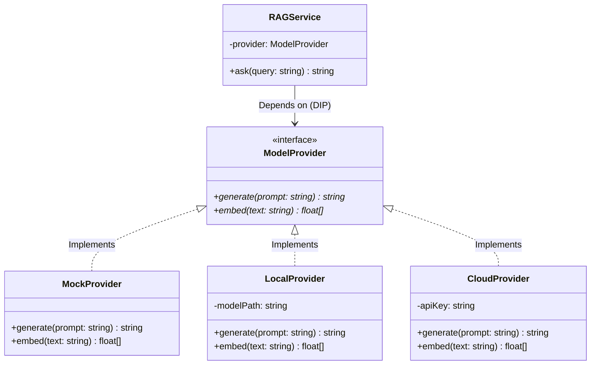
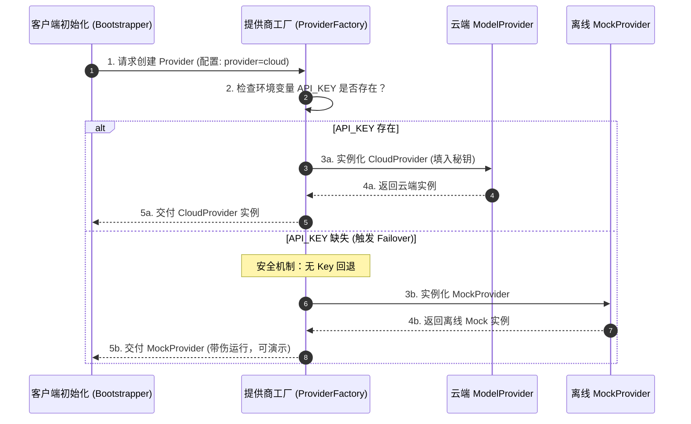
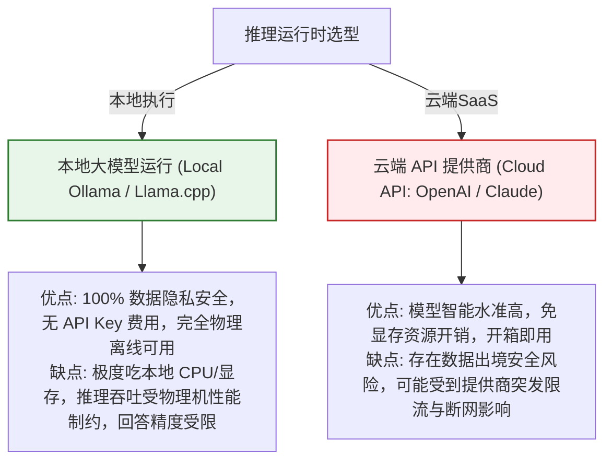

import GlossaryTerm from '@site/src/components/GlossaryTerm';
import GuidedExercise from '@site/src/components/GuidedExercise';
import ResearchNote from '@site/src/components/ResearchNote';
import ChapterMeta from '@site/src/components/ChapterMeta';
import PyRunner from '@site/src/components/PyRunner';
import TradeoffExplorer from '@site/src/components/TradeoffExplorer';
import QuizCard from '@site/src/components/QuizCard';
import StepFlow from '@site/src/components/StepFlow';

# M12L4 · 可替换模型层

<ChapterMeta
  time="约 2.5 小时"
  prereqs={[{label: 'M12L3 知识地基', href: './knowledge-base-build'}, {label: 'M4L3 依赖倒置', href: '../design-patterns-lld/solid-lsp-isp-dip'}, {label: 'M11L11 模型网关', href: '../production-ai-platform/ai-platform-architecture'}]}
  outcome="能设计一个可替换的模型 provider 层：统一接口下 mock/本地/云可切换，上层不改；这是助手能‘无 key 可跑’又‘可升级到强模型’的关键，也是 M11 网关的雏形。"
  howToUse="先看‘为什么不直接调 API’，再落地 provider 抽象，最后建可切换模型层 lab。"
/>

:::tip 别把某个模型 API 焊死在代码里
你的助手要[无 key 时能跑（mock）、要能切云端强模型、可能还想试本地小模型省钱](./capstone-kickoff)——如果你把 `openai.chat(...)` 直接写在 RAG 和 Agent 代码里，这三件事每一件都要改一大片。正确做法：把模型调用藏在一个**统一的 provider 接口**后面——上层只依赖"给 prompt 拿回答"这个抽象，具体用 mock/本地/云由配置决定、可随时切换。这就是 [M4 依赖倒置（DIP）](../design-patterns-lld/solid-lsp-isp-dip) + [M11 模型网关](../production-ai-platform/ai-platform-architecture) 在你项目里的落地——**它让"无 key 可跑"和"可升级强模型"同时成立。**
:::

## 一、直接调 API 的代价

假设你在 RAG 和 Agent 里到处直接写 `cloud_model.generate(prompt)`：
- **无 key 跑不了**：别人（和 CI）没有你的 key，整个项目跑不起来——[违反核心需求（M12L1）](./capstone-kickoff)。
- **换模型要改一片**：想从云换本地、或[升级到新模型（M11L2）](../production-ai-platform/evaluation-systems)，得改所有调用处。
- **没法统一加护栏/成本/trace**：调用散落各处，[护栏和观测（M12L7/L8）](./reliability-guardrails-build) 无处安放。
- **测试困难**：单元测试不该真调模型（慢、贵、不确定）——[需要能注入 mock](../foundations/testing-and-tdd)。

一个可替换的 provider 层，一次性解决这四个问题。

## 二、落地要点（分层）

### 基础：统一 provider 接口

定义一个最小接口——`generate(prompt) -> text`（和 embedding 的 `embed(text) -> vec`）。所有 provider（Mock/Local/Cloud）都实现它。上层（RAG、Agent）只依赖接口、不知道背后是谁。这就是 <GlossaryTerm term="Dependency Inversion (DIP)" definition="依赖倒置原则：高层模块不依赖低层具体实现，而是双方都依赖抽象（接口）。让具体实现（mock/本地/云模型）可替换而上层不变。">依赖倒置（M4L3）</GlossaryTerm>——上层依赖抽象，具体实现可插拔。

### 进阶：按配置选 provider + mock 的价值

- **工厂/配置选择**：根据配置（有没有 key、想用哪个）[创建对应 provider（M4L6 工厂）](../design-patterns-lld/factory-pattern)——无 key 自动回落到 mock/本地。
- <GlossaryTerm term="Mock Provider" definition="Mock provider：模型接口的一个确定性假实现，返回可预测的固定/规则化输出，用于无 key 运行、单元测试和演示。让系统在没有真实模型时也能端到端跑通和被测试。">mock provider</GlossaryTerm> 不是"凑合"，而是[一等公民](./capstone-kickoff)：它让项目**无 key 可跑、CI 可测、演示不依赖网络**——[可运行性是毕业项目的硬需求](./capstone-kickoff)。mock 返回确定性输出（如"基于检索片段的模板回答"），保证测试可重复。

### 深入（选学）：provider 层是你项目里的"模型网关"雏形

- **横切能力的挂载点**：一旦所有模型调用都过 provider 层，它就是天然的地方来加[重试/降级（M12L7）](./reliability-guardrails-build)、[成本记账/路由（M12L9）](./cost-performance-build)、[trace（M12L8）](./eval-observability-build)、[护栏（M12L7）](./reliability-guardrails-build)——这正是 [M11 模型网关](../production-ai-platform/ai-platform-architecture) 的思想在单体项目里的缩影。**你的 provider 层会逐步长成一个迷你网关**，本月后面几课都会往它上面挂能力。
- **可替换 = 可升级 = 不被锁定**：模型半年一换（[M11L2](../production-ai-platform/evaluation-systems)），provider 层让你换模型只改配置、[在评估集上对比新旧](../production-ai-platform/evaluation-systems) 后切换——这既是[避免供应商锁定（M6L9 多云抽象）](../cloud-enterprise-industrial/multi-cloud) 的思想，也让你的项目能跟上模型进步。
- **接口要小而稳**：provider 接口应该[小而稳定（M1L2 窄接口）](../foundations/modules-and-contracts)——`generate`/`embed` 足矣，别把某个厂商特有的参数漏进接口，否则换厂商就破。这是[接口设计的基本功](../foundations/modules-and-contracts) 在 AI 层的应用。
- **别过度抽象**：provider 层要够用就好——支持你实际会用的 mock/本地/云三种即可，别为"未来可能支持 20 家厂商"设计一堆用不上的抽象（[YAGNI](../design-patterns-lld/change-driven-design)）。

<ResearchNote
  title="可替换模型层：DIP + 工厂 + mock，是项目里的模型网关雏形"
  source="M4L3 DIP / M4L6 工厂 / M1L2 窄接口；M11L11 模型网关；M6L9 多云抽象避免锁定"
  href="https://martinfowler.com/articles/dipInTheWild.html"
  insight="直接调某模型API导致无key跑不了、换模型改一片、护栏成本trace无处挂、难测。可替换provider层解决:定义小而稳的统一接口(generate/embed),mock/本地/云都实现,上层只依赖抽象(DIP),按配置工厂选择、无key回落mock。mock是一等公民保证可运行可测可演示。provider层是横切能力(重试/降级/路由/成本/trace/护栏)的天然挂载点,是M11模型网关在单体项目的雏形。可替换=可升级不被锁定。接口别漏厂商特有参数、别过度抽象。"
  application="毕业项目建provider层:小接口generate/embed,Mock/Local/Cloud三实现,工厂按配置(有无key)选、无key回落mock。上层RAG/Agent只依赖接口。后续把重试/降级/路由/成本/trace/护栏挂在这层(迷你网关)。换模型只改配置+评估对比。接口小而稳不漏厂商细节,支持实际会用的即可别过度抽象。"
/>

## 三、可替换模型层图解 (Deep Dive Diagrams)

本节展示统一抽象模型层（DIP）的面向对象多态设计、工厂方法运行时的多态路由时序，以及本地执行与云端 API 交互的系统取舍。

### 1. 结构全景：ModelProvider 依赖倒置多态架构



### 2. 控制流程：运行时依赖注入与 API Key 回退序列



### 3. 折中谱系：本地部署模型 vs. 商业云端 API



### 4. 步骤流演示：模型工厂实例化分流步骤

<StepFlow
  steps={[
    {
      title: '配置读取',
      desc: '系统在引导阶段优先拉取 `.env` 配置文件中的 `PROVIDER_TYPE` 和 `LLM_API_KEY` 变量。'
    },
    {
      title: '依赖扫描',
      desc: '工厂校验当前的公网可达性与系统端口（如 Ollama 的 11434 服务端状态），以判定是否支持本地小模型。'
    },
    {
      title: '分支实例化',
      desc: '进入模式分流：首选实例化 CloudProvider；若校验失败则平滑降级，建立 MockProvider。'
    },
    {
      title: 'DIP 注入',
      desc: '将实例化出的 Provider 以接口形式注入业务主逻辑（RAG/Agent），屏蔽具体的子类属性。'
    }
  ]}
/>

---

## 三、跟我做一遍：可切换的 provider 层

<PyRunner
  rows={48}
  expect="mock/云可切换、上层不变、无 key 回落 mock"
  code={`# 统一接口:上层只依赖它(DIP),不知道背后是谁
class ModelProvider:
    def generate(self, prompt): raise NotImplementedError

class MockProvider(ModelProvider):        # 一等公民:无 key 可跑/可测/可演示
    def generate(self, prompt):
        return "[mock] 模板回答: " + prompt[:16]

class LocalProvider(ModelProvider):       # 本地小模型(省钱/隐私)
    def generate(self, prompt):
        return "[local] 简答: " + prompt[:16]

class CloudProvider(ModelProvider):       # 云端强模型(需 key)
    def __init__(self, key): self.key = key
    def generate(self, prompt):
        return "[cloud/opus-4.8] 详答: " + prompt[:16]

def make_provider(config):                # 工厂:无 key 自动回落 mock
    if config.get("provider") == "cloud" and config.get("api_key"):
        return CloudProvider(config["api_key"])
    if config.get("provider") == "local":
        return LocalProvider()
    return MockProvider()

def answer(provider, question, context):  # 上层只依赖接口,换 provider 不用改
    return provider.generate(f"问:{question} 资料:{context}")

for cfg in [{}, {"provider": "local"},
            {"provider": "cloud", "api_key": "sk-x"},
            {"provider": "cloud"}]:        # 想用云但没 key -> 回落 mock
    p = make_provider(cfg)
    print(cfg, "->", answer(p, "什么是CAP", "CAP定理..."))
print("mock/云可切换、上层不变、无 key 回落 mock")`}
/>

一个统一接口下三种 provider 可切换：`answer` 这个上层函数完全不知道背后是 mock/本地/云，换 provider 一行不改；无 key 想用云时自动回落 mock（保证可运行）。这就是[无 key 可跑 + 可升级强模型](./capstone-kickoff) 同时成立的关键。**试试**：把 `answer` 想成你的 RAG 或 Agent——它依赖接口而非具体模型，所以能被 mock 注入测试；想想把"重试/成本记账"加在哪最合适（provider 层，即你的迷你网关）。

## 五、动手 Lab（必做）

打开 `labs/month12/m12l4_provider/`：

```bash
python labs/month12/m12l4_provider/test_provider.py
```

实现可替换模型层：统一接口 + Mock/Local/Cloud 三 provider + 工厂按配置选择（无 key 回落 mock）。

<GuidedExercise
  title="练习指引：建可替换模型层"
  goal="把模型调用藏在统一接口后，让 mock/本地/云可切换、上层不改、无 key 可跑。"
  hints={[
    '统一接口 generate(prompt)（DIP）。',
    'Mock/Local/Cloud 三实现;Mock 是一等公民(确定性、可测)。',
    'make_provider 按配置选,无 key/无匹配 -> 回落 Mock。',
    '上层只依赖接口,provider 换了不用改。'
  ]}
  steps={[
    '定义 ModelProvider 接口 + 三个实现。',
    '实现 make_provider 工厂(无 key 回落 mock)。',
    '写一个只依赖接口的上层函数验证可替换。',
    '写测试:三 provider 都能用、无 key 回落 mock、上层不感知具体实现。'
  ]}
  checks={[
    '我的模型层统一接口、mock/本地/云可切换、上层不改。',
    '我的 mock 是一等公民,保证无 key 可跑可测。',
    '我理解 provider 层是横切能力的挂载点(迷你网关)。',
    '我的接口小而稳、不漏厂商细节、不过度抽象。'
  ]}
/>

## 架构师深潜（Staff+ 视角）

### 1. 模型接入方式

<TradeoffExplorer
  title="毕业项目的模型接入方式"
  dimensions={['无 key 可跑', '可换模型', '可挂横切能力', '可测', '推荐度']}
  options={[
    {
      name: '直接调 API',
      scores: [1, 1, 1, 1, 1],
      note: '到处直接调某模型。最直接。但无 key 跑不了、换模型改一片、护栏/成本无处挂、难测。',
      whenToUse: '一次性脚本;毕业项目别这么做。'
    },
    {
      name: 'provider 层(推荐)',
      scores: [5, 5, 5, 5, 5],
      note: '统一接口 + mock/本地/云可切换 + 工厂。无 key 可跑、可换、横切能力有处挂、可测。',
      whenToUse: '毕业项目及任何多模型场景。'
    },
    {
      name: '重量级抽象框架',
      scores: [5, 5, 4, 4, 2],
      note: '引入大框架统一所有模型。功能全。但对单项目过重、学习成本高、YAGNI。',
      whenToUse: '大型多团队,毕业项目不需要。'
    }
  ]}
/>

### 2. 这一层是全书"藏易变、依赖抽象"思想的最后一次集中体现

可替换模型层看似只是个小技巧，却是[整个课程一条隐线的收束](../design-patterns-lld/change-driven-design)：**识别系统里最易变的部分，把它藏在稳定的接口后面，让变化不扩散**。模型正是 AI 系统里**最易变的东西**——半年换一代、云和本地各有取舍、有 key 没 key 行为不同、[价格能力天天变（M11L9）](../production-ai-platform/cost-engineering)。一个把某个具体模型焊死在代码各处的系统，会在每次这种变化时被撕扯得遍体鳞伤；而一个把模型藏在 provider 接口后的系统，任凭模型天翻地覆，上层的 RAG、Agent、业务逻辑岿然不动。这正是 [M4L1 封装变化](../design-patterns-lld/change-driven-design)、[M4L3 依赖倒置](../design-patterns-lld/solid-lsp-isp-dip)、[M1L2 窄接口](../foundations/modules-and-contracts)、[M6L9 多云抽象](../cloud-enterprise-industrial/multi-cloud) 反复讲的同一条原理，在 AI 时代最重要的应用点上再现。而它还有一层 AI 特有的深意：正因为模型层被隔离好了，你后续要往上加的[护栏、成本、路由、trace、评估（M12 后续几课）](./reliability-guardrails-build) 才有一个统一的挂载点——**provider 层会自然演化成你项目的[模型网关（M11L11）](../production-ai-platform/ai-platform-architecture)**。所以这一层不只是"方便换模型",它是你整个助手的**控制平面的地基**。能一眼看出"模型是这个系统里最该被隔离的易变点"、并为它设计好抽象，是这个课程想让你内化的架构直觉的一次漂亮兑现。

### 3. 架构师深问（给自己 30 分钟）

- 你的模型调用藏在统一接口后了吗？换模型/无 key，上层要改多少代码？
- 你的 mock 是一等公民（保证可跑可测）还是事后补丁？CI 能无 key 跑通吗？
- 你打算把护栏/成本/trace 加在哪？provider 层准备好当这个挂载点了吗？

## 知识自测

<QuizCard
  questions={[
    {
      q: '在软件架构中，依赖倒置原则 (Dependency Inversion Principle, DIP) 核心解决的是什么耦合问题？在大模型接入设计中应如何落地？',
      options: [
        'A. 它解决了代码行数过多导致的编译缓慢；应通过把所有 Python 代码写在一个大函数里落地',
        'B. 它实现了高层逻辑与低层具体实现的解耦。在模型层落地时，应设计一个统一的模型调用基类（如 ModelProvider 接口），让 RAG 和 Agent 只依赖基类的抽象方法（如 generate），而把 Mock/Local/OpenAI 作为具体的底层子类实现进行可拔插切换',
        'C. 它实现了数据库表与向量索引的自动物理绑定',
        'D. 它通过在 prompt 里声明 API 秘钥来防止信息泄露'
      ],
      answer: 1,
      explain: '依赖抽象（基类/接口）而非依赖具体实现（特定云 API），是面向对象设计（SOLID）的核心基本功。大语言模型的 API 接口变化极其剧烈。将调用进行 DIP 抽象，能在模型层形成防腐垫（Corruption Guard），确保上层复杂的 Agent 与 RAG 主逻辑不被任何特定的云供应商捆绑锁定。'
    },
    {
      q: '以下关于 Mock Provider 在毕业系统中的设计价值的评估，哪项最为全面、符合架构师视角？',
      options: [
        'A. Mock Provider 只是在没有买到 API Key 时用来应付编译的临时漏洞，系统上线后应该将其物理删除',
        'B. Mock Provider 是一等公民（First-class Citizen）。它不仅能提供低成本、高效率的本地离线自动化单元测试与 CI 门禁，也是保证系统在评审、离线和断网等演示极端环境里能平稳“带伤运行”的终极兜底策略',
        'C. Mock Provider 可以自动升级本地 Llama 8B 模型的参数精度',
        'D. Mock Provider 仅在 PyRunner 里可用，无法用于命令行 CLI 演示'
      ],
      answer: 1,
      explain: '一个高弹性的分布式系统不能假设外部依赖永远 100% 稳定在线。Mock 实现不只是“临时拼凑”，它是系统测试性与防御性设计的重要基石。通过 Mock，研发团队能在 0 成本、100% 可重复的前提下运行集成测试，也保证了现场展示的绝对安全。'
    },
    {
      q: '当模型 Provider 层被抽离为独立的适配层后，以下关于它对系统未来演进影响的表述，正确的是：',
      options: [
        'A. 它使得后续添加输入/输出护栏、成本计量、Trace 追踪等 Month 11 横切面组件时，有了一个天然且集中的统一挂载点（类似于迷你网关），省去了在每个业务功能里重复编写拦截代码的开销',
        'B. 它会极大地降低系统的运行并发吞吐，必须尽早将其还原为直连具体 API 模式',
        'C. 它会强制要求本地必须部署多张 GPU 显卡，导致开发成本暴增',
        'D. 它会导致 Docusaurus build 时发生 broken links 的静态链接编译错误'
      ],
      answer: 0,
      explain: '集中式代理是架构收敛的经典选择。有了统一的模型适配层，我们便有了“迷你模型网关”的数据面转发控制点，所有出入模型的流量都会通过 generate，这为后续的护栏拦截、Trace ID 注入和限额计量提供了最洁净的埋点区，呼应了 Month 11 网关的核心理念。'
    }
  ]}
/>

## 自检清单

- [ ] 我的模型层是统一接口，mock/本地/云可切换、上层不改。
- [ ] 我的 mock 是一等公民，保证无 key 可跑、CI 可测。
- [ ] 我理解 provider 层是横切能力（护栏/成本/trace）的挂载点，是模型网关雏形。
- [ ] 我的接口小而稳、不漏厂商细节、不过度抽象。

## 常见误解

- **"直接调 API 最简单省事"**：无 key 跑不了、换模型改一片、护栏成本无处挂、难测——四重代价。
- **"mock 是凑合用的"**：mock 是一等公民，保证项目可运行、可测、可演示，是硬需求。
- **"provider 层就是方便换模型"**：它更是横切能力的挂载点，会长成你项目的模型网关。

## 延伸阅读

- [M4L3 依赖倒置](../design-patterns-lld/solid-lsp-isp-dip) · [M4L6 工厂](../design-patterns-lld/factory-pattern) · [M11L11 模型网关](../production-ai-platform/ai-platform-architecture)
- [下一阶段：RAG 问答与引用](./rag-qa-build)
