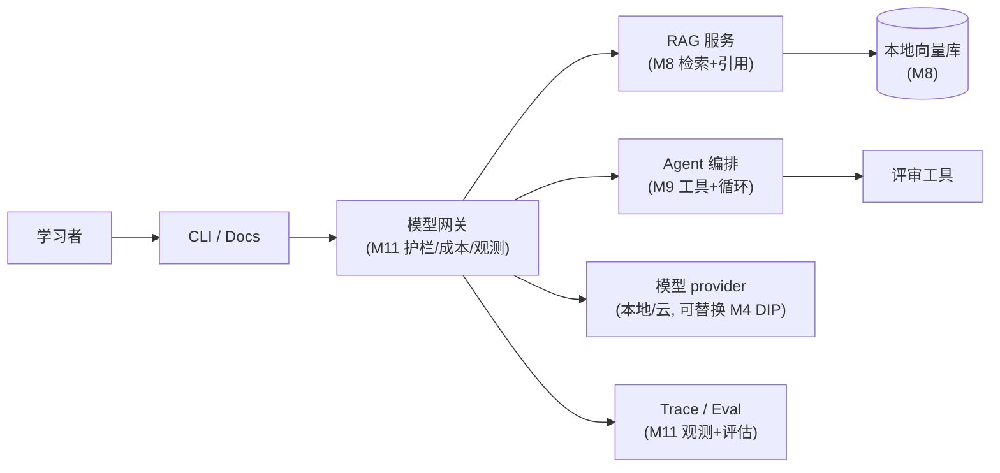

import ChapterMeta from '@site/src/components/ChapterMeta';

# Month 12 · 综合毕业项目（Capstone）

<ChapterMeta
  time="约 40 小时（12 阶段）"
  prereqs={[{label: 'Month 1-11 全部', href: '../start/roadmap'}, {label: 'M8 RAG', href: '../rag/overview'}, {label: 'M11 生产平台', href: '../production-ai-platform/overview'}]}
  outcome="独立设计并交付一个整合全课程能力的真实系统：需求→架构→RAG→Agent→上生产治理，并能像架构师一样讲清每个决策的权衡。这是你的毕业作品与作品集核心。"
  howToUse="这不是新知识模块，而是一次指导式实战。按 12 个阶段逐步建成‘架构学习助手’，每阶段产出真实代码/文档，最后完成端到端演示。"
/>

:::tip 毕业设计：不是再学新东西，而是把学过的一切，做成一个真东西
前 11 个月你学了从[程序构件](../foundations/overview) 到[分布式系统](../core-components/overview) 到 [LLM/RAG/Agent/多 Agent](../llm-systems/overview) 到[生产平台治理](../production-ai-platform/overview) 的完整能力。这个月不教新概念——它让你**独立地把这一切整合成一个真实、可运行、能上生产、能拿出去展示的系统**。这才是真正的考验：不是"我学过这些概念"，而是"我能用它们做出一个经得起架构评审的系统，并讲清每一个决策为什么这么做"。**这个 capstone 就是你从"学过 AI 架构"到"是一名 AI Architect"的毕业证明。**
:::

## 要做的东西：架构学习助手（Architecture Assistant）

你将设计并实现一个**本地优先、云端可选**的架构学习助手——它能索引你自己的系统设计/AI 架构笔记，用 RAG 回答问题并引用证据，用 Agent 生成架构评审清单，全程可观测、有护栏、可替换模型、能在无 API key 时用 mock 路径跑通。

这个项目不是玩具聊天机器人，而是一个**能展示完整架构能力**的系统——它刻意贯穿了整个课程：

> 完整项目说明书见 [Capstone Brief](./capstone-brief)；贯穿全程的作品集版本路线见 [作品集项目](../projects/portfolio-system)。

## 12 个阶段（3 Week）：从需求到上生产

### Week 1 · 需求、架构与地基
- **M12L1 立项：需求与范围**（capstone-kickoff）——用 [M2 方法论](../system-design-bridge/design-methodology) 定义目标、范围、验收、非目标。
- **M12L2 架构设计与决策记录**（architecture-decisions）——HLD/LLD、组件图、关键 trade-off 与 ADR。
- **M12L3 知识地基：摄取与检索**（knowledge-base-build）——笔记摄取、[分块、embedding、向量库（M8）](../rag/overview)。
- **M12L4 可替换模型层**（model-provider-layer）——[provider 抽象（M4 DIP）](../design-patterns-lld/change-driven-design)、mock/local 路径、[网关雏形（M11）](../production-ai-platform/ai-platform-architecture)。

### Week 2 · 核心能力：RAG 与 Agent
- **M12L5 RAG 问答与引用**（rag-qa-build）——[检索+grounding+引用+弃答（M8）](../rag/rag-generation)。
- **M12L6 Agent 与评审工具**（agent-tools-build）——[agent loop+工具+边界（M9）](../agent-architectures/overview) 生成架构评审清单。
- **M12L7 可靠性与护栏**（reliability-guardrails-build）——[重试/降级（M5）+ 护栏/HITL（M11）](../production-ai-platform/platform-guardrails)。
- **M12L8 评估与可观测**（eval-observability-build）——[评估集 + trace + 成本（M11）](../production-ai-platform/evaluation-systems)。

### Week 3 · 上生产与交付
- **M12L9 成本与性能**（cost-performance-build）——[路由/缓存/预算（M11L9）](../production-ai-platform/cost-engineering)、延迟优化。
- **M12L10 治理与风险说明**（governance-risk-doc）——[模型卡、威胁建模、风险文档（M11L5/L7）](../production-ai-platform/risk-governance-frameworks)。
- **M12L11 集成与端到端**（integration-e2e）——把所有组件串成端到端可跑系统 + smoke test。
- **M12L12 展示与架构师之路**（showcase-and-path）——如何展示与评审问答，以及毕业之后的成长路线。

## 交付物（毕业作品）

对照 [Capstone Brief](./capstone-brief) 的清单，你最终交付：
- 可运行系统（无 API key 时可跑 mock/local 路径）+ `labs/` smoke tests。
- `architecture.md`（组件图/数据流）、`tradeoffs.md`（本地vs云、RAG vs长上下文、Agent vs workflow）、`runbook.md`（运行/测试/排障）、`evals.md`（≥10 问答样例+预期证据）、`risk.md`（威胁建模+模型卡）。
- 一次完整的架构评审展示（业务目标→架构→RAG 演示→Agent trace→trade-off→答辩）。

## 验收标准

| 维度 | 标准 | 对应 |
|---|---|---|
| 可运行 | 无 API key 时可跑 mock/local | M4 DIP / M11 网关 |
| 可解释 | 每个组件有职责、每个决策有理由 | M2 / ADR |
| 可评测 | 覆盖检索质量与答案忠实度 | M8 / M11 评估 |
| 可替换 | 模型 provider 可切换 | M4 / M11 |
| 可观测 | Agent/tool 调用有 trace | M11 可观测 |
| 安全可治理 | 有护栏、风险说明、模型卡 | M11 安全治理 |
| 克制 | 每个能力按需配、不过度工程 | 全书主线 |

> 走完这 12 个阶段，你会有一个能拿出去、经得起架构师追问的作品——以及最重要的：**把整套课程的判断力，在一个真实项目上跑通一遍的经验。这就是毕业。**
