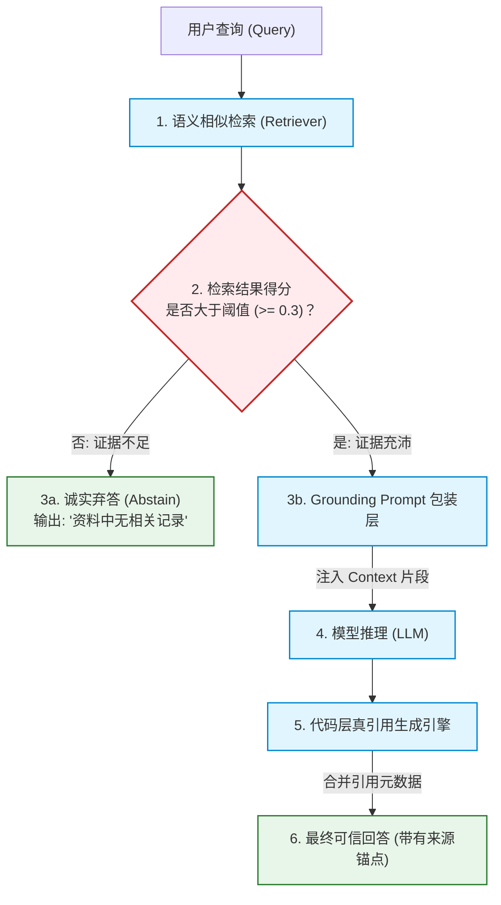
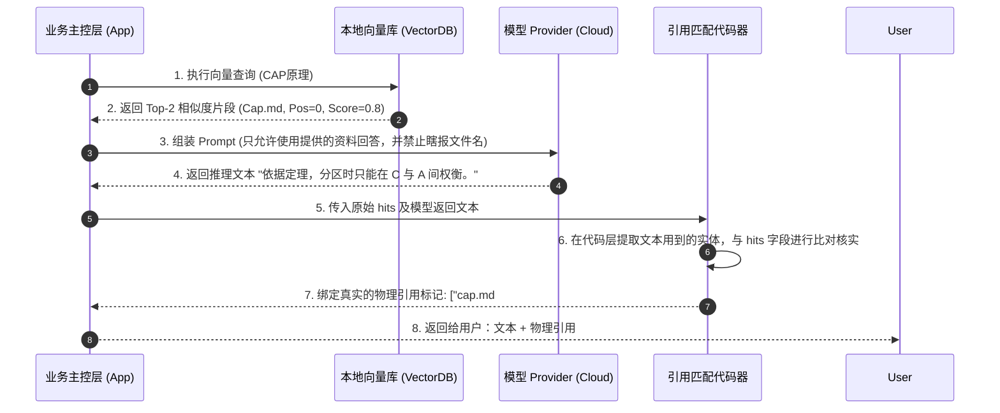
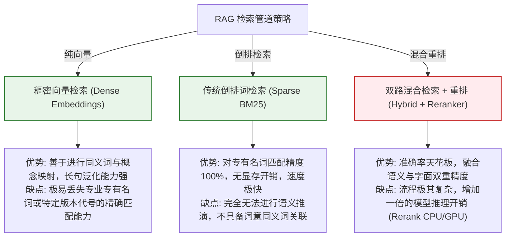

import GlossaryTerm from '@site/src/components/GlossaryTerm';
import GuidedExercise from '@site/src/components/GuidedExercise';
import ResearchNote from '@site/src/components/ResearchNote';
import ChapterMeta from '@site/src/components/ChapterMeta';
import PyRunner from '@site/src/components/PyRunner';
import TradeoffExplorer from '@site/src/components/TradeoffExplorer';
import QuizCard from '@site/src/components/QuizCard';
import StepFlow from '@site/src/components/StepFlow';

# M12L5 · RAG 问答与引用

<ChapterMeta
  time="约 3 小时"
  prereqs={[{label: 'M12L3 知识地基', href: './knowledge-base-build'}, {label: 'M12L4 模型层', href: './model-provider-layer'}, {label: 'M8L8 RAG 生成', href: '../rag/rag-generation'}]}
  outcome="能把检索地基接上生成，实现第一个核心用例：根据检索片段回答、附引用、证据不足时弃答——一个可信、不乱编的 RAG 问答。"
  howToUse="先看‘检索到了不等于答得对’，再落地带引用与弃答的生成，最后建 RAG 问答 lab。"
/>

:::tip 有了记忆，还要学会“基于记忆诚实地回答”
[知识地基（M12L3）](./knowledge-base-build) 能检索出相关片段，[模型层（M12L4）](./model-provider-layer) 能生成——把它们接起来就是 RAG 问答。但这里有个关键：**光把检索片段丢给模型让它答，还不够可信**。一个好的 RAG 问答要做到三件事——答案[基于检索证据（grounding）而非模型瞎编、附上引用让人能核实、证据不足时诚实弃答（M8L8）](../rag/rag-generation)。这是助手的**第一个核心用例**，也是"可信"二字的落地：**宁可说"我不确定"，也不编一个看着像真的假答案。**
:::

## 一、检索到了 ≠ 答得对

把检索片段直接拼进 prompt 让模型回答，有几个坑：
- **模型可能不用证据瞎编**：明明检索到了对的片段，模型却[凭训练记忆答（甚至幻觉，M7L9）](../llm-systems/hallucination-guardrails)——[grounding 没做好](../rag/rag-generation)。
- **没有引用无法核实**：用户不知道答案从哪来、可不可信——而[引用是你立项的核心用例](./capstone-kickoff)。
- **检索为空还硬答**：没检索到相关片段时，模型基于空证据编造——[最该弃答的情况（M8L8）](../rag/rag-generation)。

所以 RAG 问答的生成侧要专门设计：**强制基于证据、带引用、可弃答**——这正是 [M8L8 讲的](../rag/rag-generation)。

## 二、落地要点（分层）

### 基础：grounding + 引用

- <GlossaryTerm term="Grounding" definition="接地/基于证据：要求模型的回答严格基于提供的检索片段，而非模型的内部记忆或想象。通过 prompt 约束（‘只根据以下资料回答’）和输出校验实现，是 RAG 可信的核心。">grounding（基于证据）</GlossaryTerm>：prompt 明确约束"**只根据以下资料回答，资料没有就说不知道**"，把检索片段清晰放进 context（[M8L8](../rag/rag-generation)）。
- **引用**：让答案能追溯到[片段的来源元数据（M12L3 存的 source/pos）](./knowledge-base-build)——最简单是回答后附"依据：[来源#位置]"。**引用是可信的凭证，也是你的核心用例。**

### 进阶：弃答与证据充分性

- <GlossaryTerm term="Abstention" definition="弃答：当检索不到相关证据、或证据不足以支撑一个可靠回答时，系统诚实地回答‘我不知道/资料中没有’，而不是强行编造。是可信 RAG 的关键，宁可不答也不乱答。">弃答（abstention）</GlossaryTerm>：检索为空、或相似度太低（证据不足）时，**不硬答，而是诚实说"资料里没有"**（[M8L8、M7L9 弃答](../rag/rag-generation)）。这是可信度的分水岭——[能弃答的系统才敢被信任](../llm-systems/hallucination-guardrails)。
- **证据充分性判断**：用检索的[相似度分数/命中数](./knowledge-base-build) 做个阈值——太低就弃答。简单但有效。

### 深入（选学）：RAG 问答的工程细节

- **检索失败 vs 生成失败要能分开**：答错时要能判断是[检索没找到对的（地基问题）还是找到了但生成没用好（生成问题）——M8L9](../rag/rag-evaluation)。这决定你该去优化检索还是生成，是 RAG 调优的第一分诊。[留 trace（M12L8）](./eval-observability-build) 记录检索到了什么、生成了什么，才诊断得了。
- **注入风险**：检索到的片段是[外部内容，可能藏恶意指令（间接注入，M11L5）](../production-ai-platform/llm-threat-modeling)——生成时要把检索内容当"数据"而非"指令"，[下一课的护栏](./reliability-guardrails-build) 会处理。这里先意识到这个信任边界。
- **引用要真、别编**：模型有时会编造看似合理的引用——引用应由**你的代码基于真实检索结果生成**（你知道用了哪些片段），而非让模型自己"报"引用（它可能瞎报）。这是[代码侧兜底 > 信任模型自觉（M7L6/M9L2）](../agent-architectures/tools-and-boundaries) 的又一体现。
- **mock 下也要能演示**：用 [mock provider（M12L4）](./model-provider-layer) 时，让 mock 返回"基于给定片段的模板回答"，保证[无 key 也能演示带引用的问答（M12L1）](./capstone-kickoff)。

<ResearchNote
  title="RAG 问答：grounding + 真引用 + 弃答，宁可不答不乱答"
  source="M8L8 RAG 生成 / M8L9 RAG 评测 / M7L9 弃答；Lewis RAG"
  href="https://arxiv.org/abs/2005.11401"
  insight="检索到不等于答对。可信 RAG 问答要:grounding(prompt约束只据资料答、资料没有就说不知道)、引用(答案追溯到片段来源元数据、由代码基于真实检索生成而非让模型自报)、弃答(检索空或相似度太低就诚实说没有,不硬编)。答错要能分检索失败vs生成失败(M8L9)决定优化哪侧,需trace。检索内容是外部不可信数据有间接注入风险(信任边界)。mock下也要能演示带引用问答。"
  application="RAG问答:prompt强制grounding、检索片段当数据放context、答案附由代码生成的真引用(source/pos)、证据不足(空/低相似度)弃答。留trace记录检索到什么生成什么以分诊检索vs生成失败。检索内容当不可信为护栏铺垫。mock provider返回基于片段的模板答保证无key可演示。"
/>

## 三、RAG 问答与证据引用图解 (Deep Dive Diagrams)

本节展示 RAG 生成侧核心控制图解：基于证据（Grounding）的主动校验过滤、代码防幻觉自动挂载真实引用时序，以及混合检索策略在质量与复杂度上的权衡。

### 1. 结构全景：带 Grounding 与 Citation 的 RAG 生成架构



### 2. 控制流程：代码生成引用与事实比对序列



### 3. 折中谱系：向量检索 vs. 倒排文本匹配 vs. 重排混合检索



### 4. 步骤流演示：RAG 可信问答防御管线

<StepFlow
  steps={[
    {
      title: '检索分值校验',
      desc: '对比检索出的 Top-K 文档与查询的相似度得分。如均低于阈值，直接判定“知识库未覆盖此问题”。'
    },
    {
      title: '诚实防御弃答',
      desc: '系统阻断大模型推理，不予发包。直接在客户端层秒级吐出“我不知道”或引导进入搜索。'
    },
    {
      title: '强约束注入',
      desc: '在 System Prompt 中置入无情面具（如“如果给出的 Context 与问题无关，直接弃答，不允许说出其他背景”）。'
    },
    {
      title: '外挂引用绑定',
      desc: '解析大模型返回结果，利用正则表达式与数据库主键在内存比对，重新粘连上真实物理来源链接。'
    }
  ]}
/>

---

## 三、跟我做一遍：带引用与弃答的 RAG 问答

<PyRunner
  rows={52}
  expect="基于证据答+引用;无证据则弃答"
  code={`# 复用 M12L3 的检索(此处用简化的相似度打分模拟)
DOCS = [
    {"source": "cap.md", "pos": 0, "text": "CAP 定理:分区时只能在一致性和可用性间二选一", "score": 0.0},
    {"source": "cache.md", "pos": 1, "text": "布隆过滤器可挡住查询不存在的键", "score": 0.0},
]

def retrieve(query, docs, k=2):
    # 简化:按关键词重叠打分(真实用向量相似度)
    for d in docs:
        d["score"] = sum(1 for ch in set(query) if ch in d["text"]) / (len(set(query)) or 1)
    return sorted(docs, key=lambda d: d["score"], reverse=True)[:k]

def rag_answer(query, docs, provider, min_score=0.3):
    hits = retrieve(query, docs)
    # 弃答:证据不足(最高分太低)就诚实说不知道,不硬编
    if not hits or hits[0]["score"] < min_score:
        return {"answer": "资料中没有相关内容,我无法回答(弃答)", "citations": []}
    # grounding:只据检索片段回答
    context = "\\n".join(h["text"] for h in hits)
    ans = provider(f"只根据以下资料回答'{query}':\\n{context}")
    # 引用由代码基于真实检索生成(不让模型自报,防编造)
    cites = [f"{h['source']}#{h['pos']}" for h in hits if h["score"] >= min_score]
    return {"answer": ans, "citations": cites}

mock = lambda prompt: "[基于资料] " + prompt.split(":")[0][-12:]   # mock provider

r1 = rag_answer("分区时一致性怎么选", DOCS, mock)
print("答:", r1["answer"], "| 引用:", r1["citations"])
r2 = rag_answer("量子计算原理是什么", DOCS, mock)      # 无相关证据
print("答:", r2["answer"], "| 引用:", r2["citations"])   # -> 弃答
print("基于证据答+引用;无证据则弃答")`}
/>

RAG 问答做齐三件事：检索到足够证据时基于证据回答并附**由代码生成的真引用**、证据不足（问量子计算但笔记里没有）时**诚实弃答**而非瞎编。这就是"可信"的落地。**试试**：把 min_score 调低看弃答变松（可能开始乱答）；想想为什么引用要由代码生成而非让 mock/模型自己报（防编造）。

## 五、动手 Lab（必做）

打开 `labs/month12/m12l5_ragqa/`：

```bash
python labs/month12/m12l5_ragqa/test_ragqa.py
```

实现 RAG 问答：grounding 生成、代码生成的真引用、证据不足弃答。

<GuidedExercise
  title="练习指引：实现可信的 RAG 问答"
  goal="把检索接上生成，做出 grounding + 真引用 + 弃答的第一个核心用例。"
  hints={[
    'retrieve 打分取 top-k(复用 M12L3 或简化相似度)。',
    '弃答:无命中或最高分 < 阈值 -> 诚实说没有。',
    'grounding:prompt 约束只据检索片段答。',
    '引用由代码基于真实命中生成(source#pos),别让模型自报。'
  ]}
  steps={[
    '实现 rag_answer(检索->判证据->grounding生成->生成引用)。',
    '证据不足时弃答、citations 为空。',
    '引用来自真实命中的元数据。',
    '写测试:有证据带引用作答、无证据弃答、引用真实、阈值控制弃答。'
  ]}
  checks={[
    '我的 RAG 问答基于证据(grounding)、不瞎编。',
    '我的答案带由代码生成的真引用、可核实。',
    '我的系统证据不足会诚实弃答。',
    '我理解要能分检索失败vs生成失败、检索内容是信任边界。'
  ]}
/>

## 架构师深潜（Staff+ 视角）

### 1. RAG 生成侧的可信度取舍

<TradeoffExplorer
  title="RAG 问答生成侧的设计"
  dimensions={['可信/不瞎编', '可核实', '覆盖率', '实现简单', '推荐度']}
  options={[
    {
      name: '裸拼接直接答',
      scores: [1, 1, 5, 5, 1],
      note: '检索片段一拼就让模型答。简单、什么都答。但会瞎编、无引用、无弃答——不可信。',
      whenToUse: '玩具,不可上可信场景。'
    },
    {
      name: 'grounding+引用+弃答(推荐)',
      scores: [5, 5, 3, 3, 5],
      note: '强制据证据、带真引用、证据不足弃答。可信、可核实。覆盖率降一点(会弃答)。',
      whenToUse: '任何要可信的 RAG 问答。'
    },
    {
      name: '过度保守(动辄弃答)',
      scores: [5, 5, 1, 3, 2],
      note: '阈值太高,稍不确定就弃答。绝不瞎编。但太多该答的也不答,没用。',
      whenToUse: '极高风险场景;一般别调这么死。'
    }
  ]}
/>

### 2. "宁可弃答不乱答"是可信 AI 最重要、最反直觉的品质

新手做 RAG 问答，本能是追求"什么都能答、答得流畅"——弃答感觉像"失败"。但[可信 AI 恰恰相反：知道自己不知道、并诚实说出来，是最难也最有价值的能力](../llm-systems/hallucination-guardrails)。想想你更愿意信任哪个助手：一个什么都答得头头是道、但偶尔一本正经地胡说八道、你永远不知道哪句能信的；还是一个大部分时候给出带引用的可靠答案、遇到不知道的老实说"资料里没有"的？显然是后者——**因为可信的前提是可预测，而一个会乱编的系统是不可预测的，一次被发现的胡说就会摧毁用户对它所有答案的信任**。这就是为什么弃答、引用、grounding 这三件事是 RAG 问答的灵魂，而不是可有可无的装饰：它们共同把系统从"一个能说会道但不可信的话痨"变成"一个有一说一、有据可查的可靠助手"。这个品质会成为你毕业项目展示时的一大亮点——当评审故意问一个你笔记里没有的问题，你的助手诚实弃答而非胡编，恰恰证明了它的可信。这也呼应贯穿 AI 阶段的主线（[M7L9 幻觉防护、M8L8 弃答、M11 治理](../llm-systems/hallucination-guardrails)）：**AI 的价值不只在于它能回答什么，更在于它在不该答时能不能管住嘴——后者才是工程和判断力，也是区分玩具与可信系统的关键。**

### 3. 架构师深问（给自己 30 分钟）

- 你的 RAG 答案真的基于检索证据吗，还是模型可能在用训练记忆瞎编？怎么验证？
- 你的引用是代码基于真实命中生成的，还是让模型自己报（可能编造）？
- 问一个笔记里没有的问题，你的助手会诚实弃答，还是硬编一个像真的假答案？

## 知识自测

<QuizCard
  questions={[
    {
      q: '在设计生产级 RAG 问答系统时，为什么说“宁可说我不知道（弃答），也绝不盲目瞎编回答”是可信 AI 的核心品质？',
      options: [
        'A. 因为弃答能够显著减少云端 API 交互的耗电量',
        'B. 在严苛的企业和工程决策语境中，错误的幻觉回答（即看似正确但事实完全错误的答案）会直接误导工程师或用户做出高危决策，产生灾难性事故。诚实弃答能够保障系统的信任底线，为人工介入提供清晰边界',
        'C. 频繁弃答可以在 Docusaurus 静态网站中多显示几行自检 checklist',
        'D. 模型弃答后会自动将宿主主机的磁盘进行格式化以防范勒索病毒'
      ],
      answer: 1,
      explain: 'AI 上生产最致命的问题是“幻觉”。在医疗、金融、软件架构等专业领域，一个被伪造出来的假证据比直接提示“未检索到相关内容”的破坏力高几个数量级。可信 RAG 必须通过分值阈值、Prompt 约束等手段做好弃答防御。'
    },
    {
      q: '如何防范大语言模型在生成引用来源时，“顺从地”伪造不存在的文档文件名或章节坐标？',
      options: [
        'A. 每次回答完后，强制要求模型做 10 次反思重写',
        'B. 将引用生成的工作权收回到代码层（Code-level Control）。即由系统代码解析向量库返回的真实元数据（Metadata），并在合并回答时由代码绑定物理来源，而不是由大模型在文本里随意书写引用标记',
        'C. 彻底关闭模型的 Temperature 直至 0，使其无法输出任何数字',
        'D. 使用 BM25 检索强行覆盖大模型的一切意图'
      ],
      answer: 1,
      explain: '大模型基于概率预测下一个 token，在遇到不确定的数字或文件名时极易为了迎合 Prompt 要求而进行符合格式的胡编。架构师应该秉持“代码侧兜底”的原则，由具备强一致性的逻辑代码控制引用元数据的粘连，这才是高弹性的护栏手段。'
    },
    {
      q: '大模型返回错误的 RAG 回答时，架构师面临的“第一分诊 (First Triage)”问题是：',
      options: [
        'A. 大模型到底是编译为 React 18 还是 React 19',
        'B. 到底是因为检索没找到对的片段（检索失败，属地基问题），还是找到了对的片段但模型没有根据片段生成正确回答（生成失败，属模型与 Prompt 问题）',
        'C. 宿主主机本地的 python 版本是 3.9 还是 3.10',
        'D. 应该升级到分布式 Qdrant 集群还是 Faiss 检索'
      ],
      answer: 1,
      explain: '定位问题是解决问题的前提。如果不建立 Trace（跨检索与生成的链路追踪），当用户反馈回答不准时，开发团队将陷入盲目调整 Prompt 的深渊。只有分清“检索错”还是“生成错”，才能对应去优化分块大小/Embedding 或者调整约束 Prompt，实现数据驱动的迭代。'
    }
  ]}
/>

## 自检清单

- [ ] 我的 RAG 问答做到了 grounding（只据检索证据答）。
- [ ] 我的答案带由代码生成的真引用，用户可核实。
- [ ] 我的系统证据不足时会诚实弃答，而非瞎编。
- [ ] 我理解"宁可弃答不乱答"是可信 AI 的核心品质。

## 常见误解

- **"检索到片段丢给模型答就是 RAG 了"**：不 grounding 会瞎编、无引用不可核实、不弃答会乱答——不可信。
- **"弃答是系统能力不足的表现"**：恰恰相反，知道不知道并诚实说出，是可信 AI 最有价值的能力。
- **"让模型自己给引用就行"**：模型会编造引用；引用应由代码基于真实检索结果生成。

## 延伸阅读

- [M8L8 RAG 生成](../rag/rag-generation) · [M8L9 RAG 评测](../rag/rag-evaluation) · [M7L9 幻觉与弃答](../llm-systems/hallucination-guardrails)
- [下一阶段：Agent 与评审工具](./agent-tools-build)
