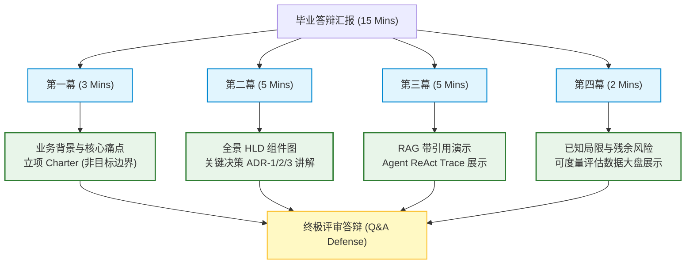
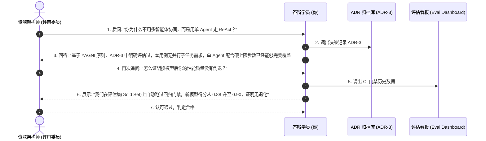
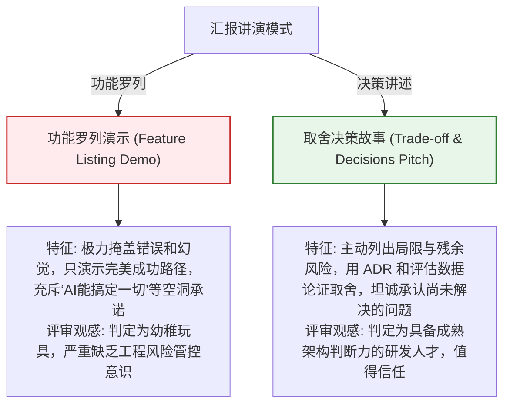

import GlossaryTerm from '@site/src/components/GlossaryTerm';
import GuidedExercise from '@site/src/components/GuidedExercise';
import ResearchNote from '@site/src/components/ResearchNote';
import ChapterMeta from '@site/src/components/ChapterMeta';
import PyRunner from '@site/src/components/PyRunner';
import TradeoffExplorer from '@site/src/components/TradeoffExplorer';
import QuizCard from '@site/src/components/QuizCard';
import StepFlow from '@site/src/components/StepFlow';

# M12L12 · 展示与架构师之路

<ChapterMeta
  time="约 2 小时"
  prereqs={[{label: '整个 Capstone', href: './overview'}, {label: 'Capstone Brief', href: './capstone-brief'}, {label: '课程路线图', href: '../start/roadmap'}]}
  outcome="能像架构师一样展示你的毕业作品、从容应对评审追问（尤其‘为什么这么选/为什么不做’），并为毕业之后的持续成长规划路线。"
  howToUse="先看‘展示的是判断力不是功能’，再学展示结构与答辩，最后完成你的展示准备与成长规划。"
/>

:::tip 最后一步：把你的作品，讲成一个架构故事
你做完了整个系统——[立项、架构、RAG、Agent、护栏、评估、成本、治理、集成](./integration-e2e)。最后一步是**展示**。但注意：一场好的架构展示，展示的**不是"我做了多少功能"，而是"我做了哪些决策、为什么、代价是什么"**——是你的[判断力（贯穿全书）](./architecture-decisions)。评审最看重的、也最会追问的，恰恰是那些"你为什么这么选、为什么不做别的"。学会把作品讲成一个有取舍、有理由的架构故事，从容应对追问——这是毕业的最后一关，也是你作为 AI Architect 要一直用下去的能力。
:::

## 一、展示功能 vs 展示判断力

初学者的展示："看，它能问答、能评审、能……"（罗列功能）。架构师的展示："这个系统要解决 X，我在 A/B/C 三个关键点做了这些**取舍**，原因是……，代价是……，如果重来我会……"。差别在于：
- **评审见过无数 demo**：能跑的 demo 不稀奇，[能讲清决策和取舍的人才稀缺](./architecture-decisions)。
- **追问都在"为什么"**：为什么用 RAG 不用长上下文？为什么这里用 Agent？为什么不上多 Agent？为什么本地优先？——[这些你在 ADR 里都想过了（M12L2）](./architecture-decisions)。
- **诚实加分**：主动讲[局限和风险（M12L10）](./governance-risk-doc)、简化了什么、[残余风险](../production-ai-platform/llm-threat-modeling)——比假装完美可信得多。

**你的整个 capstone 就是为了让你有东西可讲、且讲得有据。**

## 二、展示与答辩（分层）

### 基础：展示结构（对照 Capstone Brief）

按 [Capstone Brief 的展示顺序](./capstone-brief)：① 3 分钟讲**业务目标**（为谁解决什么，[M12L1](./capstone-kickoff)）→ ② 5 分钟画**架构与数据流**（[M12L2](./architecture-decisions)）→ ③ 5 分钟演示 **RAG 问答**（带引用、弃答，[M12L5](./rag-qa-build)）→ ④ 5 分钟展示 **Agent trace 和护栏**（[M12L6/L7](./agent-tools-build)）→ ⑤ 5 分钟讲 **trade-off**（三个关键决策，[M12L2](./architecture-decisions)）→ ⑥ 5 分钟**答辩**。**以终为始：你[立项时（M12L1）](./capstone-kickoff) 定的验收标准，正是这里要证明的。**

### 进阶：从容应对评审追问

- **"为什么这么选"**：用 [ADR（M12L2）](./architecture-decisions) 回答——选项、理由、代价，你都想过。
- **"为什么不做 X"**：用[非目标和克制（M12L1）](./capstone-kickoff) 回答——"刻意不做，因为……不服务核心价值"。
- **"它有什么问题"**：用[风险文档（M12L10）](./governance-risk-doc) 坦诚回答——局限、残余风险、简化项。
- **"怎么证明它好"**：用[评估集和 trace（M12L8）](./eval-observability-build) 回答——数字说话，不靠"我觉得"。
- **被问倒了怎么办**：诚实说"这个我没考虑到，我的初步想法是……"——[架构师不是全知，而是能清晰思考和坦诚（M11L8 承认局限）](./governance-risk-doc)。

### 深入（选学）：毕业之后的架构师之路

- **你已经具备的**：从[程序构件、分布式系统](../foundations/overview) 到 [LLM/RAG/Agent/多 Agent](../llm-systems/overview) 到[生产平台治理](../production-ai-platform/overview) 的完整栈，和贯穿始终的**判断力**——[何时用什么、代价是什么、如何克制](./architecture-decisions)。这是 AI Architect 的核心。
- **持续成长的方向**：① **深度**——挑一两个方向（如[检索质量、Agent 可靠性、成本优化](../rag/overview)）做深做专；② **广度与真实规模**——把毕业项目的[简化项（M12L10）](./governance-risk-doc) 逐个做成真实生产级（多用户、真评估、真部署）；③ **跟上前沿**——[模型和技术半年一变（M11L2）](../production-ai-platform/evaluation-systems)，但[你学的判断框架不会过时（M11L11）](../production-ai-platform/ai-platform-architecture)——用它去评估任何新技术。
- **最重要的心态**：技术会不断更新，[但"识别问题本质、在约束下做取舍、保持克制"这套判断力是永恒的](./architecture-decisions)。你这一年真正习得的不是某个框架，而是**像架构师一样思考**——这才是能带你走很远的东西。
- **回馈**：教是最好的学——把你学的讲给别人、参与开源、写下你的架构决策。你没法把它讲清楚，就说明你还没真懂。

<ResearchNote
  title="架构展示与成长：讲判断力而非功能，判断框架比技术更持久"
  source="整个课程；架构评审实践；Feynman 学习法；持续学习"
  href="https://en.wikipedia.org/wiki/Software_architecture"
  insight="好的架构展示讲决策和取舍(判断力)而非罗列功能。结构:业务目标->架构数据流->RAG演示->Agent trace护栏->trade-off->答辩,以终为始对齐立项验收。答辩用ADR答‘为什么选’、用非目标答‘为什么不做’、用风险文档答‘有什么问题’、用评估和trace答‘怎么证明好’;被问倒就诚实说初步想法。毕业已具备全栈+判断力。持续成长:选方向做深、把简化项做真、跟前沿但判断框架不过时。核心心态:技术会变、像架构师思考(识别本质、约束下取舍、克制)是永恒的。教是最好的学。"
  application="展示讲取舍和理由不罗列功能、诚实讲局限。用ADR/非目标/风险文档/评估从容答辩、被问倒诚实以对。毕业后:挑方向做深、把简化项做真生产级、用判断框架评估新技术。守住‘识别本质+约束下取舍+克制’的永恒判断力。把学的讲出来回馈。"
/>

## 三、展示陈述与答辩防御图解 (Deep Dive Diagrams)

本节展示毕业作品最终展示与评审答辩的核心图解：架构汇报（Pitch）要素分层拓扑、应对专家评审深度质询的反馈序列，以及功能炫技与决策权衡展示的对比。

### 1. 结构全景：15 分钟架构 Pitch 设计与模块划分



### 2. 控制流程：答辩追问与防御响应序列



### 3. 折中谱系：功能罗列型 Demo 演示 vs. 决策决策型 HLD 陈述



### 4. 步骤流演示：答辩答题防卫路线

<StepFlow
  steps={[
    {
      title: '痛点溯源',
      desc: '在陈述决策前，优先将焦点锁定回立项 Charter 阶段制定的单用户本地优先等底层物理约束。'
    },
    {
      title: '调阅决策记录',
      desc: '被问及组件选型时，有理有据地亮出 ADR-1/2/3 中记录的放弃选项与需要付出的后果代价。'
    },
    {
      title: '展示度量数据',
      desc: '不要说“我觉得挺准的”，直接亮出 Trace ID 展现排障轨迹，并呈现 10 条评估集黄金对比得分。'
    },
    {
      title: '诚实面对盲区',
      desc: '若遇到未考虑到的高维分布式架构漏洞，切勿不懂装懂，应坦言目前在局限文档里的定位，并给出设计设想。'
    }
  ]}
/>

---

## 三、跟我做一遍：把作品浓缩成一页"架构陈述"

<PyRunner
  rows={46}
  expect="能用一页讲清作品的判断力"
  code={`# 好的展示能浓缩成结构化的"架构故事"(判断力,非功能罗列)
pitch = {
    "problem": "从我的架构笔记获得有引用的答案,并被考核薄弱点",
    "key_decisions": [
        {"choice": "本地优先+可换云", "why": "无key可跑可演示", "cost": "本地模型弱"},
        {"choice": "RAG而非长上下文", "why": "要引用、笔记会增长", "cost": "要建检索管道"},
        {"choice": "评审用Agent、问答用workflow", "why": "该用才用", "cost": "Agent需边界"},
    ],
    "deliberately_not": ["多用户", "Web UI", "微调", "多Agent"],   # 克制
    "how_i_prove_it": ["评估集+回归门禁", "端到端trace", "带引用/会弃答"],
    "known_limits": ["检索可能不全", "间接注入未根治(缓解)", "mock下是模板答案"],
}

def review_pitch(p):
    # 好陈述:有取舍理由和代价、有克制、能证明、诚实
    return {
        "决策有理由和代价": all("why" in d and "cost" in d for d in p["key_decisions"]),
        "有明确的不做(克制)": len(p["deliberately_not"]) > 0,
        "能拿证据证明": len(p["how_i_prove_it"]) > 0,
        "诚实讲局限": len(p["known_limits"]) > 0,
    }

for k, v in review_pitch(pitch).items():
    print(f"[{'OK' if v else '缺'}] {k}")
print("一句话问题:", pitch["problem"])
print("三个关键取舍:", [d["choice"] for d in pitch["key_decisions"]])
print("刻意不做:", pitch["deliberately_not"])
print("能用一页讲清作品的判断力")`}
/>

一页"架构陈述"浓缩了展示的精华：一句话问题、三个关键取舍（**有理由、有代价**）、刻意不做什么（**克制**）、怎么证明它好（**证据**）、已知局限（**诚实**）——这五样齐了，你的展示讲的就是判断力而非功能罗列。**试试**：为你自己的项目填一份 pitch；对着 `review_pitch` 的四项自检，看你能不能理直气壮地过每一关。

## 五、动手 Lab（必做）+ 毕业总结

打开 `labs/month12/m12l12_pitch/`：

```bash
python labs/month12/m12l12_pitch/test_pitch.py
```

实现 pitch 校验器并写出**你自己的**一页架构陈述——这是你展示的骨架。

<GuidedExercise
  title="练习指引：准备你的毕业展示"
  goal="把你的作品浓缩成一页有判断力的架构陈述，并准备好应对追问。"
  hints={[
    '一句话问题 + 三个关键取舍(每个含 why 和 cost)。',
    '列出刻意不做的(克制)、怎么证明好的(证据)、已知局限(诚实)。',
    '对每个决策,预想评审会怎么追问、你怎么用 ADR 答。',
    '准备一个"被问倒"的诚实回应模板。'
  ]}
  steps={[
    '填写你的 pitch(problem/key_decisions/deliberately_not/how_i_prove_it/known_limits)。',
    '实现 review_pitch 自检(有理由代价、有克制、能证明、诚实)。',
    '按 Capstone Brief 顺序过一遍展示。',
    '写测试:pitch 四项自检齐全。'
  ]}
  checks={[
    '我能用一页讲清作品的判断力(不只罗列功能)。',
    '我能从容答"为什么这么选/为什么不做/有什么问题/怎么证明好"。',
    '我诚实准备了局限和被问倒的回应。',
    '我为毕业之后的成长规划了方向。'
  ]}
/>

## 架构师深潜（Staff+ 视角）

### 1. 展示取向

<TradeoffExplorer
  title="毕业作品的展示取向"
  dimensions={['显判断力', '经得起追问', '诚实可信', '让人记住', '推荐度']}
  options={[
    {
      name: '功能罗列式',
      scores: [1, 1, 2, 2, 1],
      note: '一个个演示能做什么。看着热闹。但没深度、一追问‘为什么’就露怯、评审见太多了。',
      whenToUse: '不推荐。'
    },
    {
      name: '决策叙事式(推荐)',
      scores: [5, 5, 5, 5, 5],
      note: '讲问题->关键取舍(理由+代价)->如何证明->局限。显判断力、经得起追问、可信、难忘。',
      whenToUse: '任何架构展示。'
    },
    {
      name: '技术炫技式',
      scores: [2, 2, 1, 3, 2],
      note: '堆最新技术名词。看着‘先进’。但常是过度工程、答不出为什么、不诚实。',
      whenToUse: '别;克制才显水平。'
    }
  ]}
/>

### 2. 毕业寄语：你真正带走的，是一套不会过时的思考方式

走到这里，你已经从"想学 AI 架构"走到了"能独立设计并交付一个负责任的 AI 系统"。但请记住这一年最珍贵的收获**不是**你会用 RAG、会写 Agent、会搭平台——这些具体技术会更新，今天的最佳实践三年后可能过时。你真正带走的，是一套**贯穿始终、不会过时的思考方式**：遇到任何系统问题，先[识别它的本质（这其实是个什么老问题？M5/M6/M10 反复показ的"新技术多是老问题"）](../production-ai-platform/ai-platform-architecture)；面对任何技术选择，先问[约束和代价（M2 容量、M7-M11 每一次"该不该用"）](./architecture-decisions)；面对任何"更强更炫"的诱惑，先想[克制（YAGNI、能简单就别复杂、能不用 AI 就别用——从 M4 到 M12 一以贯之）](../design-patterns-lld/change-driven-design)；交付任何系统，都带着[可靠、安全、可负担、可治理、可运营的完整视角（M11）](../production-ai-platform/overview)。这套思考方式，就是"架构师"和"会写代码的人"的根本区别——**前者的价值不在于掌握多少技术，而在于能在纷繁的选项和约束中，做出并讲清最合适的判断。** 技术的浪潮会一波波来去，模型会一代代更迭，但只要你守住这套判断力，你就能在任何新浪潮里站稳、看清、做对。**这，就是"从零到 AI Architect"这趟旅程，想真正交到你手上的东西。**

### 3. 架构师深问（给自己，也给未来的每一个项目）

- 面对一个新技术/新需求，你能先问"它的本质是什么老问题、约束是什么、代价是什么"吗？
- 你能对自己的每个技术决策，讲清"为什么选它、放弃了什么、代价是什么"吗？
- 你能在"更强更炫"和"够用就好"之间，一次次选择克制吗？——这是架构师最难也最珍贵的品质。

## 知识自测

<QuizCard
  questions={[
    {
      q: '在向资深架构评审委员会展示你的毕业作品时，以下哪种汇报重点最能体现你作为“AI 架构师”的素质，而不是初级开发人员？',
      options: [
        'A. 花 90% 的时间逐个按钮演示 CLI 命令行的炫酷高亮效果',
        'B. 主动以“以终为始、取舍决策”的架构故事为主线。重点阐明系统面对的物理约束、在三大关键岔路口（本地优先/RAG/轻量 Agent）做出的决策、放弃了哪些复杂的方案（如多智能体）、承担了哪些代价值，并坦诚亮出已知局限和残余风险',
        'C. 宣称你的系统 100% 零风险、零幻觉，永远不会在任何极端测试下出错',
        'D. 仅仅列出模型的所有神经网络参数名称'
      ],
      answer: 1,
      explain: '能跑的 Demo 随处可见，懂取舍的人才最为稀缺。罗列功能只属于程序员视角；而主动披露系统的折中设计（Trade-offs）和边界局限，证明你对于系统具备深刻的认识与掌控感，这是获得资深评审认可的唯一方式。'
    },
    {
      q: '当被评审老师质问“你为什么不用分布式向量数据库（如 Qdrant 集群），而是用本地内存扫描？”时，以下哪种回答是正确的防御响应？',
      options: [
        'A. “因为分布式数据库的价格太贵，我个人的信用卡额度不够”',
        'B. “基于立项 Charter 中单用户、本地优先的物理约束，以及 YAGNI（克制）原则。估算本助手处理的架构笔记只有数千条，内存线性扫描的检索延迟在 10ms 以内，完全能满足性能要求，选用分布式集群属于引入无价值的过度工程”',
        'C. “我会在今晚连夜改写代码，强行加入分布式向量库”',
        'D. “分布式向量库经常会导致 React 项目编译失败”'
      ],
      answer: 1,
      explain: '这体现了架构的“克制”。好的设计是匹配具体业务规模的设计，拒绝脱离实际场景的“技术堆砌”。拿出估算数据和立项约束回击不合理的复杂化建议，是架构师最核心的防卫武器。'
    },
    {
      q: '走完 AI Architect 课程的全部 Month，你获得的最核心、能够应对未来模型与技术半年一变（不被技术更新抛弃）的能力是：',
      options: [
        'A. 牢记当时最好的某一个第三方模型 API 的调用参数格式',
        'B. 掌握了“识别问题本质、在约束下做决策取舍、保持架构克制”这套系统判断力，以及用网关隔离变化、用评估度量不确定性等工程基本功。技术栈会变，但思考框架永恒',
        'C. 知道了如何在 Windows Powershell 下强制禁止所有报错提示',
        'D. 掌握了将 PyRunner 作为唯一生产运行环境的特殊技术'
      ],
      answer: 1,
      explain: '具体的框架和模型名称是极易折旧的技能。本课程的核心主线从来不是教某一个流行 API 的具体用法，而是通过从 Month 1 编程基石到 Month 11 生产 AI 平台的完整演练，帮你锤炼出“像架构师一样思考”的判断力。'
    }
  ]}
/>

## 自检清单

- [ ] 我能把作品讲成一个有取舍、有理由的架构故事（判断力而非功能罗列）。
- [ ] 我能从容应对"为什么这么选/为什么不做/有什么问题/怎么证明好"的追问。
- [ ] 我诚实准备了局限和"被问倒"的回应。
- [ ] 我为毕业之后的成长规划了方向，并理解判断力比具体技术更持久。

## 常见误解

- **"展示就是把功能都演一遍"**：评审见惯了 demo；讲清决策、取舍、理由才稀缺、才显水平。
- **"被问倒很丢人"**：架构师不是全知；诚实说"没考虑到，初步想法是……"比硬撑可信。
- **"学完这门课就到头了"**：这是起点——技术会更新，但你习得的判断力会带你走很远。

## 延伸阅读

- [Capstone Brief](./capstone-brief) · [课程路线图](../start/roadmap) · [作品集项目](../projects/portfolio-system)
- [回到 Month 1：一切的起点](../foundations/overview) —— 用你现在的眼光，重看当初的第一课
- **恭喜你走完从零到 AI Architect。这不是结束，是你作为架构师的开始。**
