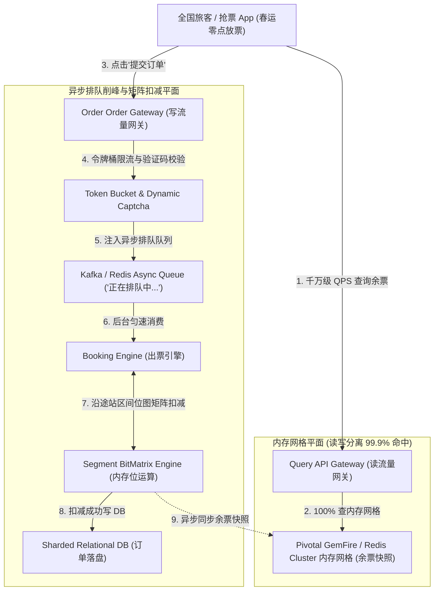
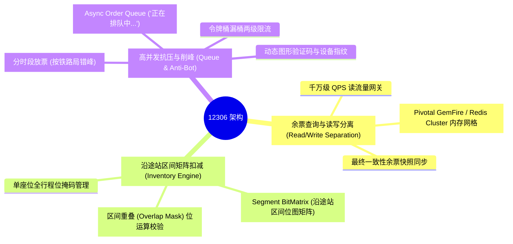
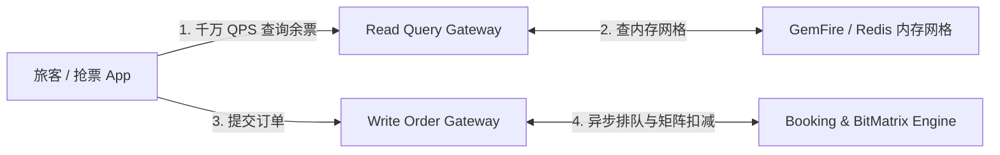
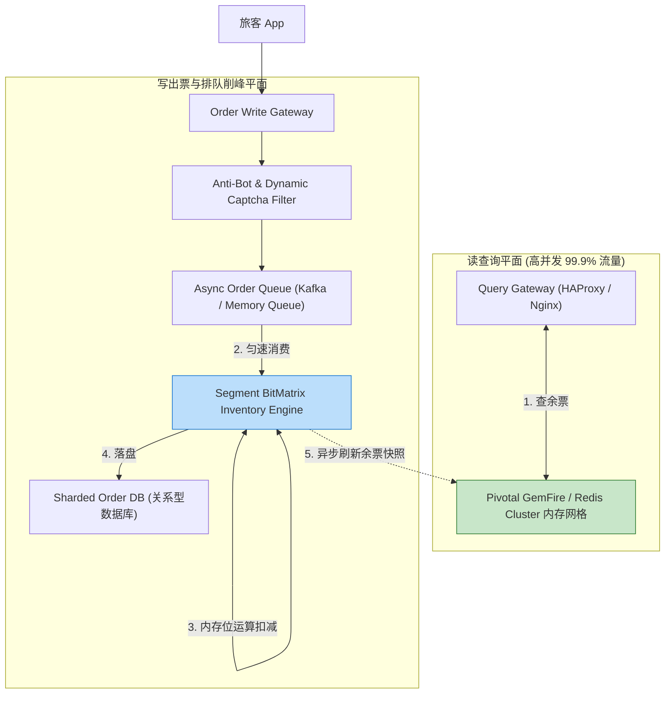
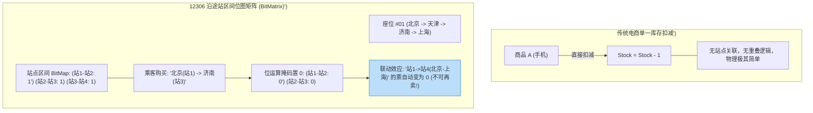
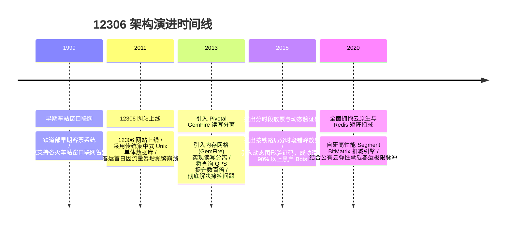

import CaseStudyHeader from '@site/src/components/CaseStudyHeader';
import DesignIntent from '@site/src/components/DesignIntent';
import ArchitectureEvolution from '@site/src/components/ArchitectureEvolution';
import TradeoffExplorer from '@site/src/components/TradeoffExplorer';
import GlossaryTerm from '@site/src/components/GlossaryTerm';
import ResearchNote from '@site/src/components/ResearchNote';
import QuizCard from '@site/src/components/QuizCard';
import CompareSlider from '@site/src/components/CompareSlider';
import GuidedExercise from '@site/src/components/GuidedExercise';
import PyRunner from '@site/src/components/PyRunner';

# 12306：春运秒杀余票矩阵扣减与排队削峰架构

<CaseStudyHeader
  oneLiner="12306 针对春运抢票零点数千万 QPS 的暴风式查询与极高复杂度区间票额扣减，打破了传统电商‘单商品单一数量扣减’的限制，推出了‘余票查询与出票异步解耦架构’，结合基于内存网格的区间乘法位图矩阵（BitMatrix）与多级排队削峰，实现了全球最高难度秒杀系统的稳健运行。"
  stats={[
    {label: '查询吞吐量', value: '千万级 QPS 读写分离 (读写比 > 1000:1)'},
    {label: '票额计算模型', value: '沿途站 Segmented BitMatrix 区间交叉扣减'},
    {label: '内存缓存底座', value: 'Pivotal GemFire / Redis Cluster 内存网格'},
    {label: '削峰机制', value: '分时段错峰放票 + 异步队列排队 (Async Order Queue)'},
    {label: '黄牛防刷', value: '动态图形验证码 + 零信任风控识别'}
  ]}
/>

:::info 对应课程概念
本案例横跨 [Month 2 读写分离与高吞吐缓存架构](../foundations/programming-systems-primer)、[Month 5 复杂区间交叉（Interval Overlap）位图算法](../cloud-enterprise-industrial/capstone-cloud-native)、[Month 8 极限高并发异步队列排队与抗压降级](../cloud-enterprise-industrial/capstone-cloud-native)。它是系统架构师研究如何应对全球最复杂秒杀业务模型（站点区间重叠依赖）的终极硬核标杆。
:::

## 1. 设计初衷：如何在千万 QPS 下解决沿途站点区间交叉扣减与并发暴风？

普通电商秒杀（如抢手机）的库存逻辑非常简单：商品 A 数量 100 个，卖出 1 个存量自减 1。

然而，12306 的铁路客票秒杀属于**全球物理复杂度最高**的交易模型：
1. **“沿途站点区间交叉（Segment Overlap）”的联动扣减爆炸**：一趟从北京到上海的 G1 次列车，中途停靠天津、济南、南京等 10 个车站。区间组合多达 $10 \times 9 / 2 = 45$ 种。如果一张“北京 -> 济南”的票卖出，不仅“北京 -> 济南”没有票，而且包含该重叠区间的“北京 -> 南京”、“北京 -> 上海”等所有长途票在物理上也同步减少！
2. **“读多写少”的千万级 QPS 疯狂刷新（读写比 > 1000:1）**：春运零点放票瞬间，数以亿计的中国乘客和抢票软件在 1 秒内不断点击“查询余票”。读 QPS 高达数千万，而写下单 QPS 为数十万。若查询请求直接打入关系型数据库，数据库 0.1 秒内必死。
3. **“黄牛抢票软件 (Bots)”的刷流量风暴**：刷票软件通过多线程以 100ms 一次的高频轮询 API，瞬间将服务器网卡与 CPU 算力占满，导致真实用户无法加载页面。

12306 的核心设计用意在于：**基于内存网格的 <GlossaryTerm term="余票查询与出票读写分离" definition="余票查询与出票读写分离：12306 的核心架构原则。将占比 99.9% 的‘查询余票’请求彻底与‘下订单出票’写事务解耦。查询请求 100% 命中内存网格 (Redis / GemFire Cache)，不触碰关系型数据库；出票写请求进入异步排队队列，实现了高吞吐解耦。">余票查询与出票读写分离</GlossaryTerm>、<GlossaryTerm term="沿途站区间乘法位图矩阵 (BitMatrix)" definition="沿途站区间乘法位图矩阵 (BitMatrix)：12306 解决沿途站交叉扣减的数学模型。将车次的所有区间抽象为 BitMap 矩阵。售出某段乘车区间 (如 A->B) 时，通过位运算 (Bitwise AND/OR) 瞬间将所有覆盖 A->B 的重叠区间的可用标记清零，在内存中毫秒级完成联动扣减。">沿途站区间乘法位图矩阵 (BitMatrix)</GlossaryTerm> 与异步排队削峰**。
- **余票查询与出票物理解耦**：查询请求由高性能内存网格（Pivotal GemFire / Redis 集群）直接响应，内存中缓存车次与区间余票数量，做到 100% 读写分离。
- **区间位图矩阵（Segment BitMatrix）**：将一列车的所有座位与沿途区间建立位图索引。购买 `Station_1 -> Station_3` 时，直接通过 Bitwise 掩码检查 `01` 标志位，成功后一次位运算更新所有覆盖重叠区间的座位可用性，避免了传统的数据库全表扫描与逐行排他锁。
- **多级排队削峰（Async Queueing）与分时段放票**：将原本集中的全国放票时间打散（如北京局 10:00，上海局 11:00 分时段放票）；在提交订单时，系统并不立即写数据库，而是将请求推入内存排队队列（如“前面还有 500 人在排队”），由后台出票 Engine 匀速落盘。



<DesignIntent
  problem="如何构建一个能支撑千万 QPS 暴风查询、毫秒级完成复杂沿途站点区间交叉（Segment Overlap）联动扣减且具备排队削峰能力的春运抢票系统？"
  users="中国数亿春运返乡旅客、12306 官方架构团队与高并发内存网格专家。"
  devices="12306 移动端 App、Web 浏览器以及部署在铁道部数据中心的集群服务器。"
  goals={[
    '读写分离 0 压垮 DB：查询余票 100% 命中内存网格，读写比 1000:1，保护主库不崩塌。',
    '区间位图矩阵毫秒扣减：利用 BitMatrix 位运算解决沿途站区间重叠扣减问题，零数据库锁争用。',
    '异步排队削峰保护：通过订单异步排队队列平滑写入，保障后台 DB 在数十万笔秒杀下匀速处理。',
    '分时段放票平抑峰值：将全国放票流量按车站时间打散，削平整体物理峰值。'
  ]}
  constraints={[
    '余票查询的“弱一致性”与“最终一致性”妥协：高并发下内存网格缓存的余票可能存在几秒钟延时（如显示有票但点击下单提示已售罄），必须在前端清晰提示“余票更新可能存在延迟，以最终排队出票为准”。',
    '黄牛抢票软件对 API 接口的高频轰炸：必须在网关层结合动态图形验证码与设备指纹，清洗 90% 以上的机器自动刷票流量。'
  ]}
  firstStep="剖析 12306 读写分离架构与分时段放票；分析沿途站区间 BitMatrix 交叉扣减算法；用 Python 编写一个包含区间位图矩阵扣减、读写分离与异步排队削峰的仿真器。"
/>

## 2. 系统功能全景



---

## 3. 最新架构总览

12306 系统的读写分离、内存网格与区间位图扣减拓扑结构如下：

### 3a. System Context (系统上下文)



### 3b. Container Diagram (容器架构)



---

## 4. 核心机制拆解

### 4a. 传统电商单一库存 vs 12306 沿途站区间位图矩阵 (BitMatrix) 扣减对比

传统电商商品库存独立；而 12306 一趟列车的沿途站区间存在极度复杂的物理重叠逻辑，需要采用 BitMatrix 进行联动位运算：



### 4b. “正在排队中…”异步削峰原理

在抢票瞬间：
1. **秒级响应给用户**：点击“提交订单”后，系统并不同步等待数据库写完，而是将订单写入内存队列，并立即返回 JSON：`{"status": "QUEUING", "queue_position": 142}`，前端展示“正在排队中…”。
2. **后台匀速消费**：后台出票 Worker 以数据库支持的最大吞吐（如每秒 5,000 单）匀速从队列拉取订单并执行 BitMatrix 扣减和写 DB，彻底将峰值流量平滑化。

---

## 5. 关键数据结构与算法：沿途站区间 BitMatrix 扣减算法

以下是 12306 用于求解一趟列车某个座位在沿途 N 个站点间是否可用，并进行原子位运算扣减的核心逻辑：

```cpp
#include <iostream>
#include <vector>
#include <string>

// 假设一趟列车有 5 个车站: 站 0, 站 1, 站 2, 站 3, 站 4
// 共有 4 个相连的物理区间: 0->1, 1->2, 2->3, 3->4
// 使用一个 8 位的二进制数字 (uint8_t) 表示该座位的区间可用状态。
// 1 表示该区间有票，0 表示已被占用。
// 初始完全空闲状态: 0b00001111 (前 4 位可用)

class TrainSeatBitMatrix {
private:
    std::string seat_number;
    uint8_t availability_mask; // 位图状态

public:
    TrainSeatBitMatrix(std::string seat_num) : seat_number(seat_num), availability_mask(0b00001111) {}

    // 根据起始站与终点站索引生成所需物理区间的位掩码 (Bitmask)
    uint8_t GenerateSegmentMask(int start_station_idx, int end_station_idx) {
        uint8_t mask = 0;
        for (int i = start_station_idx; i < end_station_idx; ++i) {
            mask |= (1 << i);
        }
        return mask;
    }

    // 检查并原子扣减票额
    bool TryBookSegment(int start_station_idx, int end_station_idx) {
        uint8_t req_mask = GenerateSegmentMask(start_station_idx, end_station_idx);
        
        // 位运算验证: (availability_mask & req_mask) 必须完全等于 req_mask，说明所需区间全都有票！
        if ((availability_mask & req_mask) == req_mask) {
            // 位运算清除相应位置 (将对应区间置为 0)
            availability_mask &= ~req_mask;
            std::cout << "[BitMatrix Deduct Success] 座位 " << seat_number 
                      << " 区间 [" << start_station_idx << "->" << end_station_idx 
                      << "] 扣减成功！剩余位图: 0b" << std::bitset<8>(availability_mask) << "\n";
            return true;
        } else {
            std::cout << "[BitMatrix Deduct Failed] 座位 " << seat_number 
                      << " 区间 [" << start_station_idx << "->" << end_station_idx 
                      << "] 存在重叠冲突，无票！\n";
            return false;
        }
    }
};
```

---

## 6. 架构演进史



---

## 7. 架构对比

### 传统集中式数据库同步扣减 vs 12306 读写分离 + BitMatrix 异步削峰

<CompareSlider
  before={
    <div style={{ padding: '20px', background: '#ffebee', border: '1px solid #c62828', borderRadius: '8px', height: '100%', color: '#333' }}>
      <strong>传统集中式同步扣减</strong>
      <p style={{ marginTop: '10px', fontSize: '0.9rem' }}>
        千万级查询打入 DB 瞬间崩塌；对每一行做数据库行锁扣减，沿途站区间死锁严重，春运零点全盘瘫痪。
      </p>
    </div>
  }
  after={
    <div style={{ padding: '20px', background: '#e8f5e9', border: '1px solid #2e7d32', borderRadius: '8px', height: '100%', color: '#333' }}>
      <strong>读写分离 + BitMatrix 异步削峰</strong>
      <p style={{ marginTop: '10px', fontSize: '0.9rem' }}>
        查余票 100% 命中内存网格；BitMatrix 位运算完成区间联动扣减；异步队列排队平滑落盘。
      </p>
    </div>
  }
  labels={['传统集中式同步扣减', '12306 读写分离 + 削峰']}
/>

---

## 8. 核心决策的取舍

在设计极限高并发秒杀与复杂库存系统时，架构师对读写模式（强一致同步 vs 读写分离最终一致）与扣减算法（数据库行锁 vs 内存 BitMatrix 位运算）面临选型权衡：

<TradeoffExplorer
  title="12306 核心春运抗压策略取舍"
  dimensions={['春运抢票千万级 QPS 读写分离吞吐', '沿途站区间重叠扣减性能', '余票查询绝对 100% 实时一致性', '秒杀脉冲下数据库与服务器稳健性', '黄牛防刷与自动化风控能力']}
  options={[
    {
      name: '读写分离 + BitMatrix 位运算 + 异步排队削峰策略',
      scores: [5, 5, 2, 5, 5],
      note: '余票查询 100% 命中内存网格，保护 DB 绝对不崩；BitMatrix 位运算极速扣减。缺点是高并发下余票查询存在几秒弱一致性延迟。',
      whenToUse: '拥有千万级 QPS 读流量、复杂区间交叉重叠库存且面向春运级秒杀的超大型系统。'
    },
    {
      name: '集中式数据库同步查询 + 数据库 SQL 行锁扣减策略',
      scores: [1, 1, 5, 1, 1],
      note: '数据绝对实时强一致；缺点是千万级 QPS 在 0.1 秒内彻底挤爆数据库，高并发下沿途站锁争用导致全网瘫痪。',
      whenToUse: '每天只有几十个人买票的城市长途客运小网站。'
    }
  ]}
/>

---

## 9. 实践指引：手写区间位图矩阵 (BitMatrix) 扣减、读写分离与异步排队削峰仿真

理解 12306 核心架构的最佳路径是模拟从内存网格读取余票快照，使用二进制位运算完成沿途站区间的联动扣减，以及将订单推入异步队列实现“正在排队中…”的全过程。在下方练习中，通过 Python 实现简单的 12306 仿真器。

<GuidedExercise
  title="练习指引：手写区间 BitMatrix 扣减、读写分离与异步排队削峰仿真"
  goal="构建包含 `MemoryGridCache`、`BitMatrixEngine` 和 `AsyncOrderQueue` 的仿真系统。1. `query_tickets(train_id)`：从 `MemoryGridCache` 读取余票快照。2. `submit_order(user_id, segment)`：推入 `AsyncOrderQueue` 返回 `[Queuing Position: 1]`。3. `BitMatrixEngine` 消费队列，执行位运算 `availability & req_mask == req_mask` 扣减 `Station_0 -> Station_2`，扣减成功后自动同步更新内存快照。"
  hints={[
    '位运算掩码：`mask = (1 << end) - (1 << start)`。',
    '扣减操作：`availability &= ~mask`。'
  ]}
  steps={[
    '定义 `BitMatrixEngine` 初始化座位 8 位二进制 `0b00001111`。',
    '定义 `MemoryGridCache` 维护余票缓存。',
    '模拟 2 位旅客同时购买 `0->2` (北京-济南) 和 `1->3` (天津-南京)。',
    '观察控制台输出，验证第一位成功，第二位因为区间重叠被位运算准确拒绝。'
  ]}
  checks={[
    '余票查询 100% 从内存网格快照中极速读取。',
    'BitMatrix 成功执行位掩码计算，第二位购买重叠区间的旅客被准确提示无票，验证区间交叉扣减机制。'
  ]}
/>

#### 交互式 Python 运行实验
在下方控制台中调试 12306 区间位图矩阵扣减与异步排队削峰仿真代码，观察高并发秒杀：

<PyRunner
  expect="沿途站区间位图矩阵扣减与排队削峰验证成功"
  rows={25}
  code={`import queue
import time

class BitMatrixEngine:
    def __init__(self, seat_name: str):
        self.seat_name = seat_name
        # 4 个物理区间 (站0->1, 1->2, 2->3, 3->4), 初始二进制 0b1111 (15) 全部可用
        self.availability_mask = 0b1111

    def try_book_segment(self, start_idx: int, end_idx: int) -> bool:
        # 构造请求掩码
        req_mask = 0
        for i in range(start_idx, end_idx):
            req_mask |= (1 << i)
            
        print("🔍 [BitMatrix Checking] 尝试锁定座位 %s 区间 [%d->%d] (请求掩码: bin(%s))..." % 
              (self.seat_name, start_idx, end_idx, bin(req_mask)))
        
        # 位运算验证: 必须全部为 1
        if (self.availability_mask & req_mask) == req_mask:
            self.availability_mask &= ~req_mask # 位运算清零 (扣减)
            print("   ✅ [BitMatrix Deduct Success] 扣减成功！座位 %s 剩余可用位图: bin(%s)" % 
                  (self.seat_name, bin(self.availability_mask)))
            return True
        else:
            print("   ❌ [BitMatrix Conflict] 扣减失败！区间 [%d->%d] 存在重叠占用冲突！" % (start_idx, end_idx))
            return False

class AsyncOrderQueue:
    def __init__(self):
        self.order_queue = queue.Queue()

    def push_order(self, user: str, start_idx: int, end_idx: int):
        self.order_queue.put({"user": user, "start": start_idx, "end": end_idx})
        pos = self.order_queue.qsize()
        print("📩 [Order Queuing] 旅客 '%s' 提交订单成功 -> 注入异步削峰队列 (当前排队位置: #%d)" % (user, pos))

    def process_all(self, engine: BitMatrixEngine):
        print("\\n⚙️ [Async Worker] 启动后台出票 Engine 匀速消费队列...")
        while not self.order_queue.empty():
            order = self.order_queue.get()
            print("\\n▶️ 处理旅客 '%s' 的订单 (区间 %d->%d)..." % (order['user'], order['start'], order['end']))
            success = engine.try_book_segment(order['start'], order['end'])
            if success:
                print("   ✨ 旅客 '%s' 成功拿到火车票！落盘数据库。" % order['user'])
            else:
                print("   💔 抱歉，旅客 '%s' 选购的区间已无票。" % order['user'])

# 运行仿真
seat_01 = BitMatrixEngine(seat_name="01车-05A")
order_queue = AsyncOrderQueue()

print("--- 12306 春运零点放票 (旅客提交订单) ---")
# 旅客 A 购买: 站 0 -> 站 2 (北京 -> 济南)
order_queue.push_order("Passenger_A", start_idx=0, end_idx=2)

# 旅客 B 购买重叠区间: 站 1 -> 站 3 (天津 -> 南京)
order_queue.push_order("Passenger_B", start_idx=1, end_idx=3)

# 旅客 C 购买非重叠区间: 站 2 -> 站 4 (济南 -> 上海)
order_queue.push_order("Passenger_C", start_idx=2, end_idx=4)

# 启动后台出票引擎
order_queue.process_all(seat_01)

print("\\n[Result] 沿途站区间位图矩阵扣减与排队削峰验证成功")
`}
/>

---

## 10. 知识自测

完成自测以检验你对 12306 春运秒杀余票矩阵扣减、读写分离及异步排队削峰机制的掌握程度：

<QuizCard
  questions={[
    {
      q: '12306 为什么要将“余票查询”与“下订单出票”在物理架构上彻底实施“读写分离”？',
      options: [
        'A. 因为铁道部的数据库限制每天最多只能写入 100 条数据',
        'B. 保护数据库绝对不崩塌。春运零点查询 QPS 高达数千万（读写比 > 1000:1），通过将占比 99.9% 的查询请求 100% 由内存网格（Pivotal GemFire / Redis）响应，切断了对后端主库的物理冲刷',
        'C. 强制要求所有旅客在买票前先去线下的火车站窗口盖章',
        'D. 主要是为了给系统节省显示电费'
      ],
      answer: 1,
      explain: '读写分离是 12306 抗住千万 QPS 的基石。通过将 99.9% 的只读查询交由内存网格处理，保护了后端主数据库只处理真实的写订单，避免了全局瘫痪。'
    },
    {
      q: '在处理一趟列车沿途多个车站（如北京-天津-济南-南京-上海）的票额扣减时，12306 引入“沿途站区间位图矩阵 (BitMatrix)”解决了什么核心难题？',
      options: [
        'A. 解决了火车在运行途中突然掉头的物理问题',
        'B. 解决了沿途站点区间重叠（Segment Overlap）的复杂联动扣减问题。通过位图（BitMap）表示座位区间可用性，一次位运算即可完成重叠区间的核验与清零，完全消除了数据库锁争用',
        'C. 自动给车票打折 50%',
        'D. 强制将所有火车的运行速度提升到光速'
      ],
      answer: 1,
      explain: 'BitMatrix 位图矩阵是 12306 独创的数学模型。将车站区间抽象为二进制位图，通过位掩码进行交叉重叠校验与瞬间扣减，极大地提升了复杂的库存计算性能。'
    },
    {
      q: '在春运抢票零点瞬间，12306 客户端弹出的“正在排队中…”界面在系统后端起到了什么关键作用？',
      options: [
        'A. 在后台偷偷下载大型游戏',
        'B. 实施异步排队削峰。系统接收订单后瞬间将其推入内存队列并给用户返回排队状态，由后台出票 Worker 匀速拉取订单落盘数据库，彻底消除了秒杀脉冲对 DB 的冲刷',
        'C. 强制要求用户在界面上观看 10 分钟广告',
        'D. 自动将用户的支付宝余额全部转走'
      ],
      answer: 1,
      explain: '“正在排队中…”是经典的异步削峰。通过内存队列将瞬时数十万 TPS 的下单脉冲平滑化，让后台出票引擎以数据库支持的极限吞吐匀速落盘。'
    }
  ]}
/>

## 来源

:::caution 关于来源与置信度
12306 未公开完整架构文档。本案例中的"沿途站区间位图矩阵（Segment BitMatrix）"是**基于公开信息的教学重构**，用于讲清区间重叠扣减这一核心难题，**并非官方确认的实现细节**。读写分离 + 内存网格、分时段放票、异步排队削峰等则有公开报道佐证。下列为可延伸查证的公开资料方向（按名称检索）：
:::

- [Apache Geode（Pivotal/VMware GemFire 的开源核心，内存数据网格 IMDG）](https://geode.apache.org/) —— 12306 余票查询读写分离所用内存网格技术的一手来源。
- [VMware GemFire 官方文档](https://docs.vmware.com/en/VMware-GemFire/index.html) —— 商用 IMDG 的架构与一致性模型。
- 中国铁道科学研究院及公开技术报道 —— 12306 分时段放票、排队削峰与验证码风控的演进（按名称检索）。
- 高并发秒杀库存扣减的通用模式（读写分离、异步下单、防超卖）—— 见业界公开的秒杀系统设计资料。