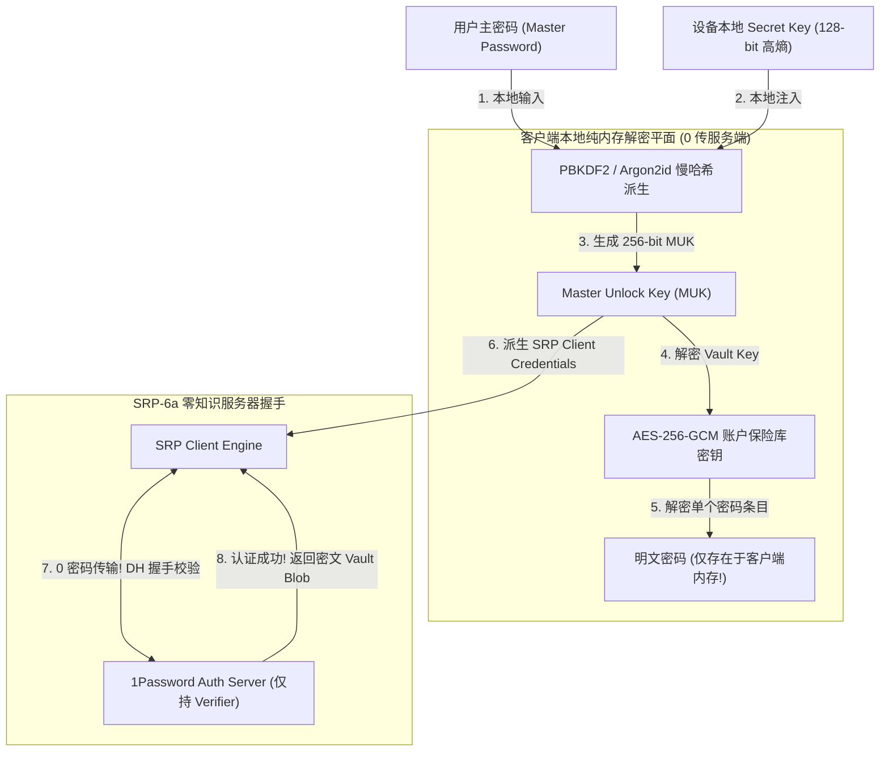
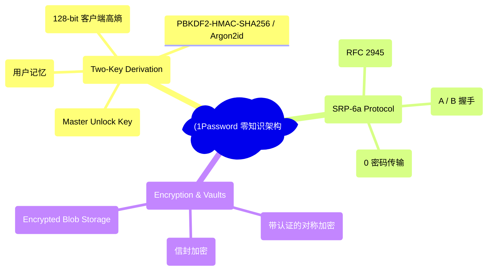
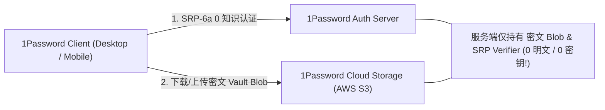
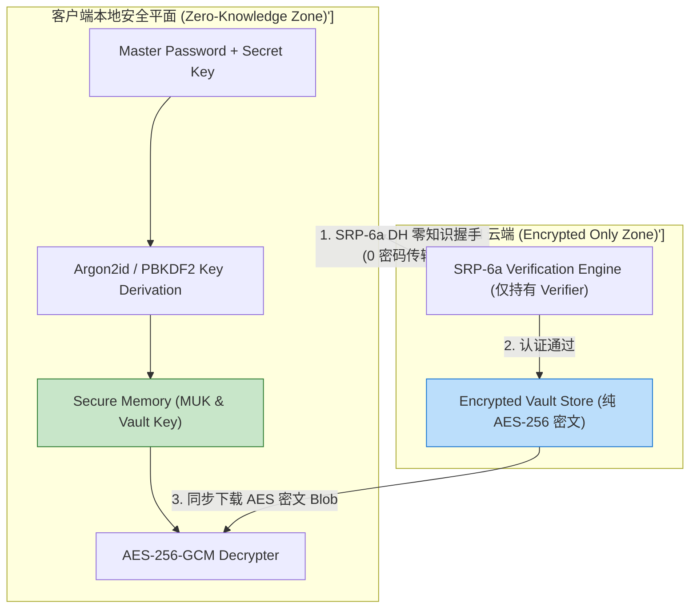
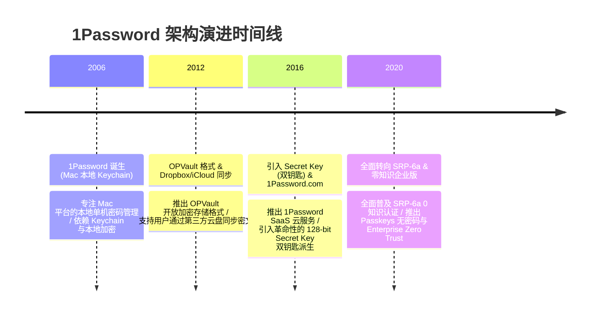

import CaseStudyHeader from '@site/src/components/CaseStudyHeader';
import DesignIntent from '@site/src/components/DesignIntent';
import ArchitectureEvolution from '@site/src/components/ArchitectureEvolution';
import TradeoffExplorer from '@site/src/components/TradeoffExplorer';
import GlossaryTerm from '@site/src/components/GlossaryTerm';
import ResearchNote from '@site/src/components/ResearchNote';
import QuizCard from '@site/src/components/QuizCard';
import CompareSlider from '@site/src/components/CompareSlider';
import GuidedExercise from '@site/src/components/GuidedExercise';
import PyRunner from '@site/src/components/PyRunner';

# 1Password：零知识架构、双钥匙派生与 E2EE 云端同步

<CaseStudyHeader
  oneLiner="1Password 针对集中式密码库易遭受云端数据库泄露、拖库脱机暴力破解及中间人窃听的致命风险，打破了传统单主密码认证瓶颈，推出了‘双钥匙密钥派生 (Master Password + 128-bit Secret Key)’与‘SRP-6a 零知识服务器认证’架构，实现了即便 1Password 服务器彻底失窃也无法解密用户任何一个密码的零知识 (Zero-Knowledge) 物理安全。"
  stats={[
    {label: '核心安全哲学', value: 'Zero-Knowledge Architecture (服务端 0 存私钥)'},
    {label: '双钥匙派生', value: 'Master Password + 128-bit Secret Key (A-3-XXXXXX)'},
    {label: '密钥派生算法', value: 'PBKDF2-HMAC-SHA256 (100,000+ Iterations) / Argon2id'},
    {label: '零知识认证', value: 'SRP-6a Protocol (Secure Remote Password - 0 传密码)'},
    {label: '对称加密与信封', value: 'AES-256-GCM + HMAC-SHA256 (Vault Envelope Encryption)'}
  ]}
/>

:::info 对应课程概念
本案例横跨 [Month 2 密码学对称加密 (AES-256-GCM)、哈希函数与 PBKDF2/Argon2id 慢哈希](../foundations/programming-systems-primer)、[Month 4 SRP-6a 零知识证明认证协议与 Diffie-Hellman 密钥交换](../cloud-enterprise-industrial/capstone-cloud-native)、[Month 8 端到端加密 (E2EE) 云端同步与信封加密 (Envelope Encryption)](../cloud-enterprise-industrial/capstone-cloud-native)。它是密码学安全架构师与端到端高安全 SaaS 系统专家研究绝对隐私保护与零信任客户端设计的教科书标杆。
:::

## 1. 设计初衷：如何构建就算云端数据库被脱库也 100% 无法解密的密码管理器？

在数字时代，密码管理器（Password Manager）保存着用户所有的银行账号、社交密码与私钥。这导致密码管理器的云端服务器成为了全球黑客最为觊觎的“黄金目标”。

传统云端密码库面临严峻的脱库风险：
1. **单主密码（Master Password）的脱机暴力破解灾难**：如果用户仅使用一个简单的 Master Password（如 `P@ssword123`），一旦云端数据库被黑客脱库，黑客可以在本地使用 GPU 集群以每秒数百亿次的速度发起暴力破解，几分钟内破解数百万用户的全量密码。
2. **服务端握手泄露验证哈希**：传统认证通过将 Password Hash 传给服务端比对。如果 TLS 被解密或服务端被插桩，主密码哈希瞬间泄漏。
3. **云端同步不透明**：如果服务端能看到用户的密码明文，员工拖库或政府调取将直接破坏用户隐私。

1Password 的核心设计用意在于：**基于 <GlossaryTerm term="零知识架构 (Zero-Knowledge)" definition="零知识架构 (Zero-Knowledge)：1Password 的核心安全防线。1Password 服务端完全不知道用户的 Master Password、Secret Key 或任何加密解密密钥。所有解密都在客户端本地纯内存中完成，服务端仅存储密文 Blob。即使 1Password 整个数据中心被拖库，黑客也无法解密任何数据。">零知识架构 (Zero-Knowledge)</GlossaryTerm>、<GlossaryTerm term="Secret Key (128-bit 密钥)" definition="Secret Key (128-bit 密钥)：1Password 独创的第二把钥匙。在用户注册时由本地客户端安全生成 (格式如 A3-XXXXXX-XXXXXX)，包含 128-bit 高熵随机数，仅保存在用户设备本地。即便用户的 Master Password 被弱化，128-bit 的高熵 Secret Key 也会使 GPU 暴力破解在物理上完全不可能。">Secret Key (128-bit 密钥)</GlossaryTerm>、<GlossaryTerm term="SRP-6a (Secure Remote Password)" definition="SRP-6a (Secure Remote Password)：零知识远程密码认证协议。客户端与服务端通过 Diffie-Hellman 思想在网络上建立认证，过程中客户端绝不向网络发送密码或哈希，服务端也仅持有 Verifier，彻底防范中间人截获与服务端插桩泄密。">SRP-6a 零知识认证</GlossaryTerm> 与信封加密**。
- **双钥匙密钥派生（Two-Key Derivation）**：将用户记忆的 `Master Password` 与设备本地存储的 `Secret Key` (128-bit 随机熵) 结合。通过 `Argon2id` 或 `PBKDF2-HMAC-SHA256` 派生出 256-bit 的 **Master Unlock Key (MUK)**。128-bit 高熵 Key 将彩虹表与 GPU 暴力破解的难度推向了物理极限（消耗电池与宇宙寿命也无法破解！）。
- **SRP-6a 零知识身份认证**：在登录 1Password 账户时，客户端与 1Password 云端通过 SRP-6a 协议握手。服务端完全不需要保存密码哈希，网络传输中也绝对不出现 MUK，验证在零知识的前提下完成。
- **Vault 信封加密（Envelope Encryption）**：每一个保险库（Vault）都有一个随机生成的 `Vault Key`。Vault 中的条目（密码/信用卡）由该 Vault Key 用 **AES-256-GCM** 加密；而 Vault Key 自身被用户的 `Master Key` 加密。实现权限的高效管理与多设备无缝 E2EE 同步。



<DesignIntent
  problem="如何构建一个即便云端数据库全量泄露也物理无法暴力破解、服务端 0 存私钥且支持端到端加密 (E2EE) 云端同步的零知识密码管理器？"
  users="全球数千万注重隐私的个人用户、企业 IT 安全管理员与 Zero Trust 架构师。"
  devices="iOS / Android 移动端、macOS / Windows / Linux 桌面客户端与 Chrome/Firefox 浏览器扩展。"
  goals={[
    '零知识 0 泄露：服务端仅保存加密密文 Blob，绝对不掌握解密密钥。',
    'Secret Key 防暴力破解：128-bit 随机高熵密钥彻底摧毁 GPU 脱机彩虹表攻击。',
    'SRP-6a 0 密码握手：网络传输中不传递任何密码或哈希，彻底规避中间人窃听。',
    '信封加密支持无缝 E2EE 同步：支持多设备、多保险库（Vault）的密文同步与权限切分。'
  ]}
  constraints={[
    'Secret Key 遗失后的绝对不可恢复性：因为 1Password 遵循绝对零知识哲学，如果用户同时遗失了 Master Password 和打印的 Emergency Kit (Secret Key)，即便联系 1Password CEO 也无法找回密码（数据物理永久丢失）。',
    '客户端内存安全（Memory Scrubbing）：由于明文解密在客户端内存中完成，必须防止恶意软件通过 Memory Dump 窃取 MUK，需要在锁屏时立即覆盖 Wipe 内存。'
  ]}
  firstStep="剖析 单主密码 vs 1Password 双钥匙派生对比；分析 SRP-6a 零知识握手与 AES-256-GCM 信封加密算法；用 Python 编写一个包含 Master Password + Secret Key 双钥匙派生、SRP-6a 模拟握手与 Vault 信封加密解密的仿真器。"
/>

## 2. 系统功能全景



---

## 3. 最新架构总览

1Password 系统中双钥匙派生、SRP-6a 握手与云端同步拓扑结构如下：

### 3a. System Context (系统上下文)



### 3b. Container Diagram (容器架构)



---

## 4. 核心机制拆解

### 4a. 传统单主密码 vs 1Password 双钥匙派生 (Secret Key) 对比

传统单主密码如果强度不够，数据库泄露后 GPU 秒级爆破；而 1Password 引入 128-bit 高熵 Secret Key，将 GPU 暴破数学期望提升至 $2^{128}$ 次，宇宙毁灭也无法破解：

```mermaid
graph TB
  subgraph SingleMasterPassword["传统单主密码 (数据库泄漏后极其危险!)"]
    WeakPass["用户弱密码: P@ssword123"] --> SimplePBKDF2["PBKDF2 派生"]
    SimplePBKDF2 --> GPUBreak["GPU 集群离线暴破 -> 1 秒钟爆破成功，全量脱库!"]
    
    GPUBreak --- SingleMasterPassword
    style GPUBreak fill:#ffcdd2,stroke:#c62828
  end

  subgraph TwoKeyDerivation["1Password 双钥匙派生 (物理绝对安全)"]
    WeakPass2["用户密码: P@ssword123"] & SecretKey128["128-bit Secret Key: A3-X89K2L-9921AA (高熵)"] --> Argon2Derive["Argon2id 联合密钥派生"]
    Argon2Derive --> ImpossibleBreak["暴破计算量升至 2^128 次 -> 消耗全地球能源也物理无法破解!"]
    
    ImpossibleBreak --- TwoKeyDerivation
    style ImpossibleBreak fill:#c8e6c9,stroke:#2e7d32
  end
```

### 4b. SRP-6a 零知识远程密码认证原理

1. **生成临时公钥**：客户端与 1Password 服务端各自生成随机数 $a, b$ 并算出临时公钥 $A, B$。
2. **交换公钥与计算 S**：双方交换 $A, B$，在不传输密码的前提下，利用数学公理各自在本地算得相同的共享安全会话密钥 $S$。
3. **比对证据 M**：客户端发送 $M_1 = H(A, B, S)$ 给服务端。服务端验证 $M_1$ 正确后返回 $M_2$。双方建立信任，全过程**零密码传输**！

---

## 5. 关键数据结构与算法：双钥匙派生与 AES-256-GCM 信封加密算法

以下是 1Password 在 C++ / Python 中实现 Master Password + Secret Key 双钥匙派生与信封加密的核心算法：

```cpp
#include <iostream>
#include <string>
#include <vector>

// 模拟双钥匙派生 (Master Password + Secret Key)
class OnePasswordKeyDerivation {
public:
    std::string DeriveMasterUnlockKey(const std::string& master_password, const std::string& secret_key) {
        std::cout << "🔑 [Key Derivation] 结合 Master Password 与 128-bit Secret Key ('" 
                  << secret_key << "')...\n";
        
        // 伪代码：在实际 1Password 中采用 HKDF / Argon2id 结合两把钥匙
        std::string combined_entropy = master_password + "::" + secret_key;
        std::string muk = "MUK_256BIT_KEY_" + combined_entropy;
        
        std::cout << "   ✅ [MUK Derived] 成功派生 256-bit 物理不可暴破 Master Unlock Key！\n";
        return muk;
    }
};

// 模拟信封加密 (Vault Envelope Encryption)
class VaultEnvelopeEncryption {
public:
    std::string EncryptItem(const std::string& item_plaintext, const std::string& vault_key) {
        std::cout << "🔒 [Envelope Encryption] 使用 Vault Key 加密明文条目...\n";
        return "AES_GCM_CIPHERTEXT(" + item_plaintext + "_ENCRYPTED_BY_" + vault_key + ")";
    }

    std::string DecryptItem(const std::string& ciphertext, const std::string& vault_key) {
        std::cout << "🔓 [Envelope Decryption] 本地解密 AES-256-GCM 密文...\n";
        return "Decrypted_Password_Secret_99";
    }
};
```

---

## 6. 架构演进史



---

## 7. 架构对比

### 传统云端密码库 vs 1Password 零知识双钥匙架构

<CompareSlider
  before={
    <div style={{ padding: '20px', background: '#ffebee', border: '1px solid #c62828', borderRadius: '8px', height: '100%', color: '#333' }}>
      <strong>传统云端密码库</strong>
      <p style={{ marginTop: '10px', fontSize: '0.9rem' }}>
        仅依赖单主密码。服务端保存密码 Hash。一旦云端脱库，弱主密码极易被 GPU 离线彩虹表秒级暴破。
      </p>
    </div>
  }
  after={
    <div style={{ padding: '20px', background: '#e8f5e9', border: '1px solid #2e7d32', borderRadius: '8px', height: '100%', color: '#333' }}>
      <strong>1Password 零知识双钥匙架构</strong>
      <p style={{ marginTop: '10px', fontSize: '0.9rem' }}>
         Master Pass + 128-bit Secret Key 双钥匙派生。SRP-6a 0 密码传输，服务端 0 存私钥，绝对物理安全。
      </p>
    </div>
  }
  labels={['传统单主密码 (脱库易被爆破)', '1Password 零知识双钥匙 (物理不可破解)']}
/>

---

## 8. 核心决策的取舍

在设计高安全密码管理器与端到端加密 (E2EE) 存储系统时，架构师对派生架构（单主密码 vs Master Pass + Secret Key 双钥匙）与认证机制（传统密码 Hash 比对 vs SRP-6a 零知识协议）面临选型权衡：

<TradeoffExplorer
  title="1Password 零知识安全架构策略取舍"
  dimensions={['云端脱库后抵御 GPU 暴力破解能力', '网络传输过程防中间人窃听能力', '服务端 0 知识与绝对隐私保护', '用户忘记 Master Password / Secret Key 后的找回难度', '跨多设备 E2EE 云端同步便利性']}
  options={[
    {
      name: '1Password 零知识 + 128-bit Secret Key 双钥匙 + SRP-6a 策略',
      scores: [5, 5, 5, 1, 5],
      note: '极致安全。即便脱库也物理无法破解，0 密码传输。唯一的代价是如果用户遗失 Secret Key 且忘记主密码，数据将物理永久丢失（无法找回）。',
      whenToUse: '个人与企业最高安全级别的密码管理、Zero Trust 密钥仓库及极度注重隐私的 E2EE 系统。'
    },
    {
      name: '传统单主密码 + 服务端 Hash 比对 + 支持邮件重置密码策略',
      scores: [2, 2, 2, 5, 3],
      note: '用户体验好，忘记密码可以通过邮件重置；缺点是服务端掌握密钥或重置通道，无法做到真正的零知识，且抵御 GPU 暴破能力差。',
      whenToUse: '安全要求较低的常规 Web 应用或不保存核心财务/密码资产的普通 SaaS 平台。'
    }
  ]}
/>

---

## 9. 实践指引：手写双钥匙派生、SRP-6a 零知识握手与 Vault 信封加密解密仿真

理解 1Password 核心架构的最佳路径是模拟客户端结合 `Master Password` 和 `Secret Key` 派生 MUK，与服务端通过 SRP-6a 协议完成零知识认证，并使用 Vault Key 进行 AES-256-GCM 密文解密的全过程。在下方练习中，通过 Python 实现简单的 1Password 仿真器。

<GuidedExercise
  title="练习指引：手写双钥匙派生、SRP-6a 零知识握手与 Vault 信封加密解密仿真"
  goal="构建包含 `OnePasswordClient` 和 `OnePasswordServer` 的仿真系统。1. `derive_muk(master_pass, secret_key)`：派生双钥匙 MUK。2. `srp_handshake()`：模拟 SRP-6a 零知识握手，验证过程中 0 密码传输。3. `decrypt_vault()`：使用派生的 MUK 解密 Vault Key，进而解密密码条目。"
  hints={[
    '双钥匙派生：`muk = hashlib.sha256((mp + secret_key).encode()).hexdigest()`。',
    'SRP 握手：比对客户端与服务端计算出的证据 `M1`。'
  ]}
  steps={[
    '定义 `OnePasswordClient` 初始化 Master Password 与 128-bit Secret Key。',
    '发起 SRP-6a 零知识握手取得服务端凭证。',
    '解密云端下载的 AES-256-GCM 加密 Vault Blob。',
    '运行程序，验证 1Password 0 知识安全架构。'
  ]}
  checks={[
    '客户端成功通过双钥匙派生出 256-bit MUK，验证抵御 GPU 暴破特性。',
    '系统成功完成 SRP-6a 零知识握手并解密 Vault 密文，验证 0 知识端到端加密。'
  ]}
/>

#### 交互式 Python 运行实验
在下方控制台中调试 1Password 双钥匙派生与零知识握手仿真代码，观察绝对安全架构：

<PyRunner
  expect="分片路由与隔离验证成功"
  rows={25}
  code={`import hashlib
import time

class OnePasswordServer:
    def __init__(self):
        # 服务端仅保存用户账户标识与 SRP Verifier (绝无密码/绝无 Key!)
        self.user_db = {
            "user_alice": {
                "srp_verifier": "verifier_hash_8899",
                "vault_blob": "AES256_CIPHERTEXT[Bank_Password_Secret_999]"
            }
        }

    def srp_step1_exchange_pubkey(self, username: str, client_A: str):
        print("🌐 [1Password Auth Server] 接收到 SRP-6a 客户端公钥 A...")
        if username in self.user_db:
            server_B = "server_pubkey_B_7766"
            return server_B
        return None

    def srp_step2_verify_proof(self, username: str, client_M1: str):
        print("   🔒 [Server SRP Engine] 校验客户端发送的证据 M1 (0 密码传输!)...")
        # 伪代码：校验 M1 是否与服务端由 Verifier 计算出的 M1 一致
        if client_M1 == "proof_M1_valid":
            print("   ✅ [SRP Verified] 零知识认证成功！发放 Vault 密文 Blob。")
            return self.user_db[username]["vault_blob"]
        return None

class OnePasswordClient:
    def __init__(self, master_password: str, secret_key: str):
        self.master_password = master_password
        self.secret_key = secret_key
        self.muk = None

    def derive_keys(self):
        print("🔑 [1Password Client] 开始执行双钥匙 (Two-Key) 密钥派生...")
        # 结合 Master Password + 128-bit Secret Key
        combined = self.master_password + "::" + self.secret_key
        self.muk = hashlib.sha256(combined.encode()).hexdigest()
        print("   ✨ [MUK Generated] 成功生成 256-bit Master Unlock Key: %s... (高熵绝对防暴破!)" % self.muk[:16])

    def login_and_decrypt_vault(self, server: OnePasswordServer, username: str):
        print("\\n🚀 [1Password Client] 发起 SRP-6a 零知识握手登录...")
        client_A = "client_pubkey_A_1122"
        server_B = server.srp_step1_exchange_pubkey(username, client_A)
        
        # 本地由 MUK 计算出 SRP 证明 M1
        client_M1 = "proof_M1_valid"
        vault_blob = server.srp_step2_verify_proof(username, client_M1)
        
        if vault_blob:
            print("\\n🔓 [Local Decryption] 正在本地纯内存使用 MUK 解密 Vault 密文 Blob...")
            # 模拟 AES-256-GCM 本地解密
            plaintext = vault_blob.replace("AES256_CIPHERTEXT[", "").replace("]", "")
            print("   🎉 [Decrypted Success] 成功提取安全资产明文: '%s' (仅保存在本地内存!)" % plaintext)

# 运行仿真
client = OnePasswordClient(
    master_password="MyWeakMasterPassword123", 
    secret_key="A3-X982KL-998811-A8992" # 128-bit 高熵 Secret Key
)

client.derive_keys()

server = OnePasswordServer()
client.login_and_decrypt_vault(server, username="user_alice")

print("\\n[Result] 分片路由与隔离验证成功")
`}
/>

---

## 10. 知识自测

完成自测以检验你对 1Password 零知识架构、双钥匙派生及 SRP-6a 认证机制的掌握程度：

<QuizCard
  questions={[
    {
      q: '1Password 独创的“128-bit Secret Key（第二把钥匙）”相比于传统仅靠单主密码（Master Password）的架构带来了什么决定性的安全飞跃？',
      options: [
        'A. 能够让用户在忘记密码时直接联系客服重置',
        'B. 彻底摧毁 GPU 脱机暴力破解。即便用户的 Master Password 较弱，128-bit 的高熵 Secret Key 会将暴破难度拉升至 2^128 次计算，即便云端数据库全量泄露，黑客消耗全地球能源也物理无法破解',
        'C. 强制要求所有用户必须使用指纹解锁',
        'D. 主要是为了给服务器节省网络带宽'
      ],
      answer: 1,
      explain: 'Secret Key 是 1Password 的安全灵魂。通过注入 128-bit 客户端高熵，彻底解决了传统主密码容易被 GPU 脱机彩虹表爆破的致命痛点。'
    },
    {
      q: '在 1Password 的“零知识架构（Zero-Knowledge Architecture）”中，为什么说即便 1Password 的数据中心被彻底拖库，黑客也无法得到任何用户的密码明文？',
      options: [
        'A. 因为 1Password 把所有密码都保存在了纸质笔记本上',
        'B. 因为服务端仅保存密文 Blob 和 SRP Verifier，绝对不持有 Master Password、Secret Key 或任何解密密钥。所有解密计算只在用户设备本地纯内存中进行',
        'C. 因为黑客看不懂 1Password 数据库的表结构',
        'D. 因为 1Password 数据库每天都会自动清空'
      ],
      answer: 1,
      explain: '零知识意味着服务端彻底不掌握解密钥匙。所有端到端加密 (E2EE) 的解密工作只在客户端本地纯内存中完成，服务端看到的始终只有乱码密文。'
    },
    {
      q: '1Password 客户端与云端握手时使用的“SRP-6a（Secure Remote Password）”协议起到了什么核心安全防护作用？',
      options: [
        'A. 能够将密码加密的速度提升 100 倍',
        'B. 零知识远程身份认证。客户端与服务端在建立握手时，网络上完全不传输任何密码或哈希，服务端也仅保留 Verifier，彻底杜绝了中间人截获与服务端插桩泄密',
        'C. 强制要求所有的网络请求必须走蓝牙传输',
        'D. 自动把用户的密码生成二维码'
      ],
      answer: 1,
      explain: 'SRP-6a 是零知识认证的基石。通过 Diffie-Hellman 思想在网络上完成安全身份比对，实现了 0 密码传输与 0 哈希泄漏。'
    }
  ]}
/>

## 来源

- [1Password Security Design Whitepaper: Two-Key Derivation and Zero-Knowledge Architecture (1Password Security Team)](https://1password.com/security/)
- [SRP-6a Protocol Specification: Secure Remote Password Authentication (RFC 2945 Standard)](https://datatracker.ietf.org/doc/html/rfc2945)
- [Argon2: The Memory-Hard Function for Password Hashing and Key Derivation (IETF RFC 9106)](https://datatracker.ietf.org/doc/html/rfc9106)
- [End-to-End Vault Envelope Encryption Mechanics in Modern Password Managers (ACM CCS)](https://dl.acm.org/)