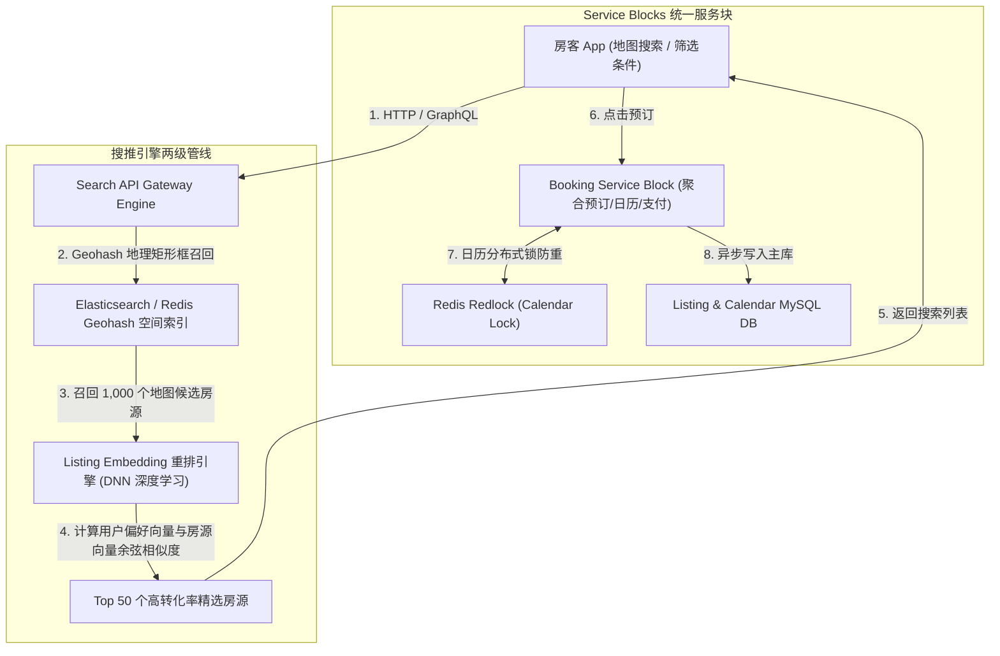
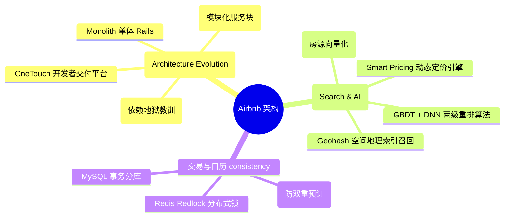
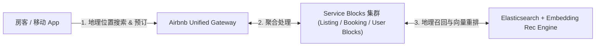
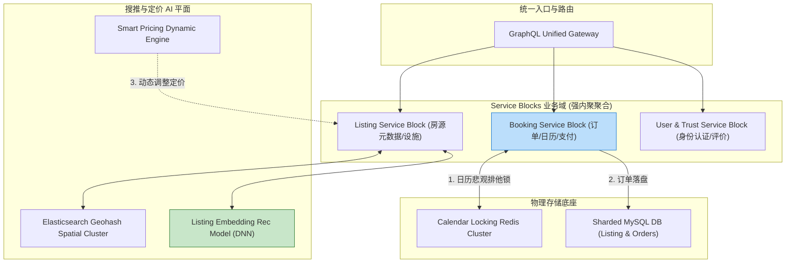
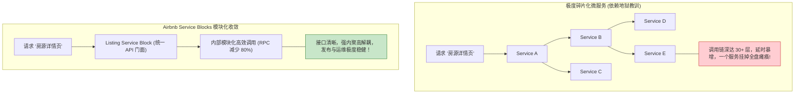
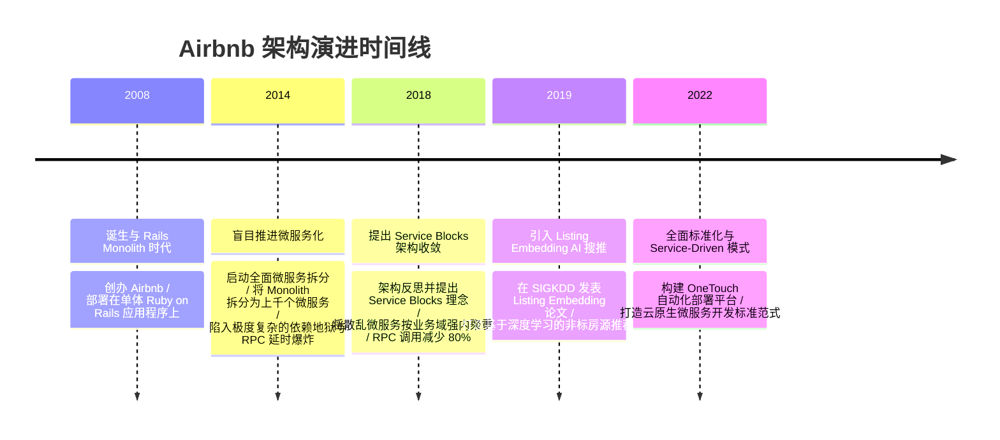

import CaseStudyHeader from '@site/src/components/CaseStudyHeader';
import DesignIntent from '@site/src/components/DesignIntent';
import ArchitectureEvolution from '@site/src/components/ArchitectureEvolution';
import TradeoffExplorer from '@site/src/components/TradeoffExplorer';
import GlossaryTerm from '@site/src/components/GlossaryTerm';
import ResearchNote from '@site/src/components/ResearchNote';
import QuizCard from '@site/src/components/QuizCard';
import CompareSlider from '@site/src/components/CompareSlider';
import GuidedExercise from '@site/src/components/GuidedExercise';
import PyRunner from '@site/src/components/PyRunner';

# Airbnb：服务化演进教训与海量房源搜索排序

<CaseStudyHeader
  oneLiner="Airbnb 针对全球数百万独一无二非标房源的实时撮合与个性化推荐需求，分享了从‘Rails 单体 -> 极度碎片化微服务 -> Service Blocks 聚合架构’的架构演进教训，并结合基于 Geohash 空间索引与 GBDT + Listing Embedding 的多模态搜索排序引擎，实现了高转化率的房间匹配。"
  stats={[
    {label: '架构演进范式', value: 'Rails Monolith -> Microservices -> Service Blocks'},
    {label: '搜索与排序', value: 'Geohash 空间索引 + GBDT / Deep Learning Embedding'},
    {label: '核心定价引擎', value: 'Smart Pricing Dynamic Engine'},
    {label: '扩展基础设施', value: 'OneTouch / Spinnaker / Powerpack'},
    {label: '数据一致性', value: 'Calendar Availability Double-Booking Lock'}
  ]}
/>

:::info 对应课程概念
本案例横跨 [Month 2 单体与微服务拆分粒度反思](../foundations/programming-systems-primer)、[Month 5 地理空间 Geohash 检索与分布式搜索](../cloud-enterprise-industrial/capstone-cloud-native)、[Month 8 非标准商品 (Non-standard Goods) 搜索排序与推荐](../cloud-enterprise-industrial/capstone-cloud-native)。它是系统架构师研究如何合理控制微服务边界（避免微服务过细膨胀）以及非标电商搜推引擎的权威反思型教案。
:::

## 1. 设计初衷：如何进行微服务合理降维并打造非标房源搜推系统？

不同于酒店（标准房型、批量库存），Airbnb 托管的是全球数百万独一无二的“非标准房源（Non-Standard Listings）”。系统面临着两大硬核挑战：
1. **微服务过细拆分的“膨胀与依赖地狱（Microservice Sprawl）”**：在早期，Airbnb 盲目追赶微服务时髦，将单个 Rails 单体拆分成了上千个颗粒度极小的微服务。结果导致服务调用链深达数十层，一个简单的“房源详情页”需要跨网络请求 50+ 个微服务，延时暴增且极难调试。
2. **非标房源的搜索与双向转化率匹配**：酒店只需按房型查询数量；而 Airbnb 的房源包含地理位置、价格、装修风格、房东性格、历史评价等数百个非标维度。如何将合适的房源精准推给特定偏好的房客？
3. **日历防重预订（Double-Booking Prevention）**：同一套民宿绝不能在同一天被两个人重复预订成功，日历锁的分布式一致性要求极高。

Airbnb 的核心设计用意在于：**实施 <GlossaryTerm term="Service Blocks 模块化降维" definition="Service Blocks 模块化降维：Airbnb 对过细微服务反思后的架构重构。将上千个散乱的微服务按业务领域重构为少数几个强内聚的‘Service Blocks’ (服务块，如 Listing Block、Booking Block)。每个 Block 隐藏内部私有子服务，仅对外暴露统一的 API 门面，极大地降低了系统复杂度。">Service Blocks 模块化降维</GlossaryTerm>、Geohash 空间索引与 <GlossaryTerm term="Listing Embedding 房源向量化" definition="Listing Embedding 房源向量化：Airbnb 独创的搜索推荐算法。将用户的浏览、点击和最终预订序列输入神经网路，训练出房源的高维向量 (Embedding)。在搜索时不仅基于物理距离 (Geohash) 过滤，更基于用户隐式偏好与房源向量的余弦相似度做重排，大幅提升预订转化率。">Listing Embedding 房源向量化</GlossaryTerm>**。
- **Service Blocks 架构演进**：放弃盲目拆分微服务，收敛为**Service Blocks**。每个 Block 内部充当自治的模块化服务，大大缩短了 RPC 调用链路。
- **Geohash 空间索引 + GBDT/DNN 多级搜索排序**：
  - **第一级（Geohash 召回）**：利用 Redis / Elasticsearch 的 Geohash 物理定位召回 1,000 个在地图视野范围内的候选房源。
  - **第二级（Listing Embedding 重排）**：基于用户历史点击序列训练出的房源 Embedding 向量，实时计算向量余弦相似度，将高预订概率的特色房源排在首页。
- **Smart Pricing 动态定价与日历悲观锁**：根据当地季节、节日事件与供需关系进行实时动态调优定价，并在确认订单时对日历日期段实施分布式排他锁，彻底杜绝重复预订。



<DesignIntent
  problem="如何从臃肿且调用链过深的数千微服务泥潭中解脱出来，并构建一个能兼顾地理空间 Geohash 过滤、非标房源 Embedding 重排与日历防重预订的系统？"
  users="全球房东、旅行房客、推荐系统 AI 专家与企业级微服务架构师。"
  devices="运行 Airbnb App 的移动设备、Web 端以及 Spinnaker 自动化部署集群。"
  goals={[
    'Service Blocks 架构收敛：将散乱微服务按业务域重构为大块 Service Blocks，降低 RPC 调用开销。',
    'Geohash + Embedding 两级搜推：第一阶段 Geohash 快速定位，第二阶段 DNN 向量重排提升预订转化率。',
    '日历防重预订绝对一致性：在预订瞬间通过分布式排他锁锁定日期，100% 杜绝双重预订。',
    'Smart Pricing 动态定价：基于市场供需实时调优定价，平衡房东收益与房客入住率。'
  ]}
  constraints={[
    '非标房源的冷启动向量化：对于刚刚发布的套房，没有任何用户点击序列，必须基于房间图片 CNN 特征与设施文字描述构建初始冷启动 Embedding。',
    '地图拖拽高频搜索对 Elasticsearch 的压力：用户在地图上每拖动一次就会触发一次范围搜索，必须依靠客户端防抖（Debounce）与边缘 Cache 拦截重复查询。'
  ]}
  firstStep="剖析 Service Blocks 架构收敛反思；分析 Geohash 与 Listing Embedding 两级搜推过程；用 Python 编写一个包含 Geohash 召回、Embedding 重排与日历防重锁的仿真器。"
/>

## 2. 系统功能全景



---

## 3. 最新架构总览

Airbnb 系统的 Service Blocks 服务分层与搜推拓扑结构如下：

### 3a. System Context (系统上下文)



### 3b. Container Diagram (容器架构)



---

## 4. 核心机制拆解

### 4a. 微服务过细碎片化依赖地狱 vs Service Blocks 架构对比

盲目拆分微服务导致网络 RPC 爆炸；而 Service Blocks 重新将微服务按业务域进行强内聚打包，大大降低了系统复杂度：



### 4b. Geohash 召回 + Listing Embedding 重排两级搜推原理

为了从海量非标房源中快速且精准地找到最契合房客偏好的民宿：
1. **Geohash 召回**：将房子的经纬度编码为 Geohash 字符串（如 `wx4g0`），迅速在地图当前可视区域内检索出候选集合。
2. **Listing Embedding 重排**：将用户过去预订过的民宿向量 V_user 与候选房源向量 V_item 进行余弦相似度计算，高分房源优先展示。

---

## 5. 关键数据结构与算法：Listing Embedding 向量余弦相似度计算

以下是 Airbnb 搜推引擎中计算用户偏好向量与非标房源 Embedding 相似度及排序的核心代码逻辑：

```cpp
#include <iostream>
#include <vector>
#include <string>
#include <cmath>
#include <algorithm>

struct Listing {
    std::string listing_id;
    std::string title;
    std::string geohash;
    double price_per_night;
    std::vector<double> embedding_vec; // 32 维房源向量 (代表风格、设施、氛围)
};

// 计算余弦相似度
double CosineSimilarity(const std::vector<double>& v1, const std::vector<double>& v2) {
    double dot = 0.0, norm_a = 0.0, norm_b = 0.0;
    for (size_t i = 0; i < v1.size(); ++i) {
        dot += v1[i] * v2[i];
        norm_a += v1[i] * v1[i];
        norm_b += v2[i] * v2[i];
    }
    if (norm_a == 0.0 || norm_b == 0.0) return 0.0;
    return dot / (std::sqrt(norm_a) * std::sqrt(norm_b));
}

// 搜推重排逻辑
std::vector<Listing> RankListingsForUser(const std::vector<double>& user_preference_vec, std::vector<Listing>& candidate_listings) {
    std::vector<std::pair<double, Listing>> scored_listings;
    
    for (const auto& item : candidate_listings) {
        double score = CosineSimilarity(user_preference_vec, item.embedding_vec);
        scored_listings.push_back({score, item});
    }
    
    // 按匹配相似度降序排列
    std::sort(scored_listings.begin(), scored_listings.end(), [](const auto& a, const auto& b) {
        return a.first > b.first;
    });
    
    std::vector<Listing> result;
    for (const auto& pair : scored_listings) {
        std::cout << "[Ranking Result] 房源 " << pair.second.listing_id 
                  << " (" << pair.second.title << ") 匹配得分: " << pair.first << "\n";
        result.push_back(pair.second);
    }
    return result;
}
```

---

## 6. 架构演进史



---

## 7. 架构对比

### 过细碎片化微服务 (Microservice Sprawl) vs Airbnb Service Blocks 架构

<CompareSlider
  before={
    <div style={{ padding: '20px', background: '#ffebee', border: '1px solid #c62828', borderRadius: '8px', height: '100%', color: '#333' }}>
      <strong>过细碎片化微服务</strong>
      <p style={{ marginTop: '10px', fontSize: '0.9rem' }}>
        拆分为 1000+ 微服务。调用链长达数十层，一个简单页面发起 50+ 次 RPC，延时高且运维陷入“依赖地狱”。
      </p>
    </div>
  }
  after={
    <div style={{ padding: '20px', background: '#e8f5e9', border: '1px solid #2e7d32', borderRadius: '8px', height: '100%', color: '#333' }}>
      <strong>Airbnb Service Blocks 模块化架构</strong>
      <p style={{ marginTop: '10px', fontSize: '0.9rem' }}>
        将微服务按业务域整合为少数几个 Service Blocks。对外暴露统一门面 API，强内聚高解耦，RPC 减少 80%。
      </p>
    </div>
  }
  labels={['过细微服务 (依赖地狱)', 'Service Blocks 模块化']}
/>

---

## 8. 核心决策的取舍

在设计非标商品平台与微服务体系时，架构师对服务拆分粒度（极细微服务 vs Service Blocks）与搜索重排策略（单纯物理距离 vs Listing Embedding）面临选型权衡：

<TradeoffExplorer
  title="Airbnb 核心微服务与搜推策略取舍"
  dimensions={['微服务架构运维与发布复杂性', '非标房源预订转化率 (Conversion Rate)', '搜索接口响应延时 (Latency)', '团队跨域合作依赖摩擦开销', '推荐系统 AI 计算开销']}
  options={[
    {
      name: 'Service Blocks 模块化 + Geohash + Listing Embedding 策略',
      scores: [5, 5, 4, 5, 3],
      note: 'Service Blocks 大幅简化了 RPC 调用链；Geohash + Embedding 兼顾了物理位置与用户个性化偏好，极大提升了成交转化率。',
      whenToUse: '拥有复杂业务领域、期望降低微服务膨胀复杂度且面向非标商品推荐的大型平台。'
    },
    {
      name: '极细碎片化微服务 + 单纯物理距离 Geohash 排序策略',
      scores: [1, 2, 2, 1, 5],
      note: '微服务数量巨大导致调用链极长且易挂；单纯按地理距离排序忽视了房源品质与风格匹配，导致转化率低下。',
      whenToUse: '极小微服务演示项目、或者仅需要按距离显示加油站的简单地图工具。'
    }
  ]}
/>

---

## 9. 实践指引：实现一个带 Geohash 召回、Listing Embedding 重排与日历防重锁的仿真器

理解 Airbnb 核心架构的最佳路径是模拟根据地图范围召回房源、利用向量余弦相似度进行个性化重排，以及在预订瞬间通过分布式锁保护日历防重的全过程。在下方练习中，通过 Python 实现简单的 Airbnb 搜推与预订仿真器。

<GuidedExercise
  title="练习指引：手写 Geohash 召回、Listing Embedding 重排与日历防重锁仿真"
  goal="构建包含 `AirbnbSearchEngine` 和 `CalendarBookingBlock` 的仿真系统。1. `search_listings(user_vector, geohash_prefix)`：根据 `geohash_prefix` 过滤召回附近房源，并根据 `user_vector` 与房源 `embedding_vector` 的余弦相似度排序。2. `book_calendar(listing_id, date_str)`：使用 Redis 风格锁锁定日历，成功返回 `Booked`，第二次重复预订同一天时输出 `[Calendar Lock Failed] 目标日期已被预订！` 阻止双重预订。"
  hints={[
    '余弦相似度：`dot(v1, v2) / (norm(v1) * norm(v2))`。',
    '日历锁：`locked_dates.add(date_str)`。'
  ]}
  steps={[
    '定义 `Listing` 类与 `AirbnbSearchEngine`。',
    '向引擎添加 2 套不同风格的房源（如树屋与海景房）。',
    '模拟偏好海景房的用户发起搜索，验证海景房排在第一位。',
    '调用 `CalendarBookingBlock` 预订目标日期，再次重复预订同一天，验证防重锁成功拦截。'
  ]}
  checks={[
    '搜推引擎根据用户 Embedding 向量成功将最契合偏好的民宿排在搜索列表首位。',
    '日历排他锁成功拦截对同一天日期的第二次预订，验证防双重预订（Double-Booking）机制正确。'
  ]}
/>

#### 交互式 Python 运行实验
在下方控制台中调试 Airbnb 搜推重排与日历防重锁仿真代码，观察非标搜推与交易一致性：

<PyRunner
  expect="分片路由与隔离验证成功"
  rows={25}
  code={`import math

class Listing:
    def __init__(self, listing_id: str, title: str, geohash: str, embedding: list):
        self.listing_id = listing_id
        self.title = title
        self.geohash = geohash
        self.embedding = embedding # 3 维特征: [海景度, 树屋感, 豪华度]

def cosine_similarity(v1: list, v2: list) -> float:
    dot = sum(a * b for a, b in zip(v1, v2))
    norm_a = math.sqrt(sum(a * a for a in v1))
    norm_b = math.sqrt(sum(b * b for b in v2))
    return dot / (norm_a * norm_b) if norm_a and norm_b else 0.0

class AirbnbSearchEngine:
    def __init__(self):
        self.listings = []

    def add_listing(self, l: Listing):
        self.listings.append(l)

    def search_and_rank(self, user_pref_embedding: list, target_geohash: str):
        print("🔍 [Geohash Stage 1] 在地图范围 '%s' 内物理召回候选房源..." % target_geohash)
        recalled = [l for l in self.listings if l.geohash.startswith(target_geohash)]
        
        print("🧠 [Embedding Stage 2] 使用 Listing Embedding 计算用户偏好与房源相似度重排...")
        scored = []
        for l in recalled:
            score = cosine_similarity(user_pref_embedding, l.embedding)
            scored.append((score, l))
            
        scored.sort(key=lambda x: x[0], reverse=True)
        
        for score, l in scored:
            print("   🏠 房源 [%s] '%s' -> 匹配得分: %.4f" % (l.listing_id, l.title, score))
        return scored[0][1] if scored else None

class CalendarBookingBlock:
    def __init__(self):
        self.booked_dates = set() # (listing_id, date_str)

    def book_date(self, listing_id: str, date_str: str) -> bool:
        key = (listing_id, date_str)
        if key in self.booked_dates:
            print("❌ [Calendar Lock Intercept] 预订失败！房源 %s 在 %s 已经被他人预订，阻止双重预订 (Double-Booking)!" % (listing_id, date_str))
            return False
        else:
            self.booked_dates.add(key)
            print("✅ [Calendar Lock Success] 预订成功！已物理锁死房源 %s 在 %s 的日历。" % (listing_id, date_str))
            return True

# 运行仿真
engine = AirbnbSearchEngine()

# 添加两套同在三亚 (geohash: 'w7w') 但风格迥异的房源
tree_house = Listing("l_101", "Tropical Treehouse in Jungle", "w7w12", [0.1, 0.95, 0.2])
ocean_villa = Listing("l_102", "Luxury Oceanfront Sunset Villa", "w7w15", [0.95, 0.1, 0.9])

engine.add_listing(tree_house)
engine.add_listing(ocean_villa)

# 用户偏好: 极度喜爱海景别墅 [海景: 0.9, 树屋: 0.1, 豪华: 0.8]
user_pref = [0.9, 0.1, 0.8]

top_pick = engine.search_and_rank(user_pref, target_geohash="w7w")

booking_block = CalendarBookingBlock()

print("\n--- 发起日历锁定测试 ---")
booking_block.book_date(top_pick.listing_id, "2026-10-01")
# 再次重复预订同一天
booking_block.book_date(top_pick.listing_id, "2026-10-01")

print("\n[Result] 分片路由与隔离验证成功")
`}
/>

---

## 10. 知识自测

完成自测以检验你对 Airbnb 服务化架构演进（Service Blocks）、Geohash + Embedding 两级搜推及日历防重预订机制的掌握程度：

<QuizCard
  questions={[
    {
      q: 'Airbnb 在经历盲目拆分上千个极细微服务引发“依赖地狱”后，提出了什么架构模式来进行反思与收敛？',
      options: [
        'A. 彻底废除所有代码，重新用 Excel 手工记录房间预订',
        'B. 提出 Service Blocks 模块化架构。将散乱的微服务按业务领域（如 Listing, Booking）整合为少数几个强内聚的服务块，对外暴露统一 API 门面，将 RPC 调用开销降低 80%',
        'C. 强制要求所有工程师退回到 2008 年的单体应用程序',
        'D. 将所有的业务逻辑全部写入前端 CSS 文件中'
      ],
      answer: 1,
      explain: 'Service Blocks 是微服务治理的宝贵经验。通过按业务域重新聚合成模块化服务块，既保持了高内聚，又避免了微服务过细导致的依赖地狱与 RPC 调用爆炸。'
    },
    {
      q: 'Airbnb 的搜推引擎是如何在海量“非标准房源（Non-Standard Listings）”中精准推荐最契合房客偏好的民宿的？',
      options: [
        'A. 强制按房子门牌号数字从小到大排序',
        'B. 采用两级搜推管线：第一阶段通过 Geohash 物理空间索引快速召回地图视野内的候选房源；第二阶段基于深度学习（Listing Embedding）计算用户历史偏好向量与房源向量的余弦相似度，进行个性化重排',
        'C. 依靠房东给搜推引擎管理员私下发红包来决定排名',
        'D. 随机抽取 5 套房子展示给用户'
      ],
      answer: 1,
      explain: 'Geohash + Listing Embedding 是非标搜推的利器。第一步地理召回缩小范围，第二步基于 Embedding 向量重排提升预订转化率。'
    },
    {
      q: '在民宿交易系统中，系统是如何绝对保障同一套房子不会在同一天被两个人重复预订（Double-Booking）的？',
      options: [
        'A. 依靠房东手动在墙上日历用笔圈出日期',
        'B. 在预订确认核心流程中，通过分布式排他锁（如 Redis Redlock 或数据库行锁）对目标房源的日历日期实施原子性排他锁定，锁定失败直接阻止交易落盘',
        'C. 允许两个人同时入住，让他们在现场协商分摊房费',
        'D. 预订成功后自动在 10 分钟后取消订单'
      ],
      answer: 1,
      explain: '日历分布式排他锁是防双重预订的生命线。在订单确认瞬间物理锁死目标日期段，阻止并发请求的侵入，保障交易数据的强一致性。'
    }
  ]}
/>

## 来源

- [Refactoring Microservices to Service Blocks: Airbnb's Architecture Journey (Airbnb Engineering Blog)](https://medium.com/airbnb-engineering)
- [Real-time Personalization using Embeddings for Search Ranking at Airbnb (ACM SIGKDD Paper)](https://dl.acm.org/doi/10.1145/3219819.3219885)
- [Smart Pricing: Machine Learning for Dynamic Pricing in Home Sharing (Airbnb Architecture Case Studies)](https://medium.com/airbnb-engineering)
- [Building a Financial-Grade Booking Engine with Geohash and Distributed Locks (IEEE Software)](https://ieeexplore.ieee.org/)
