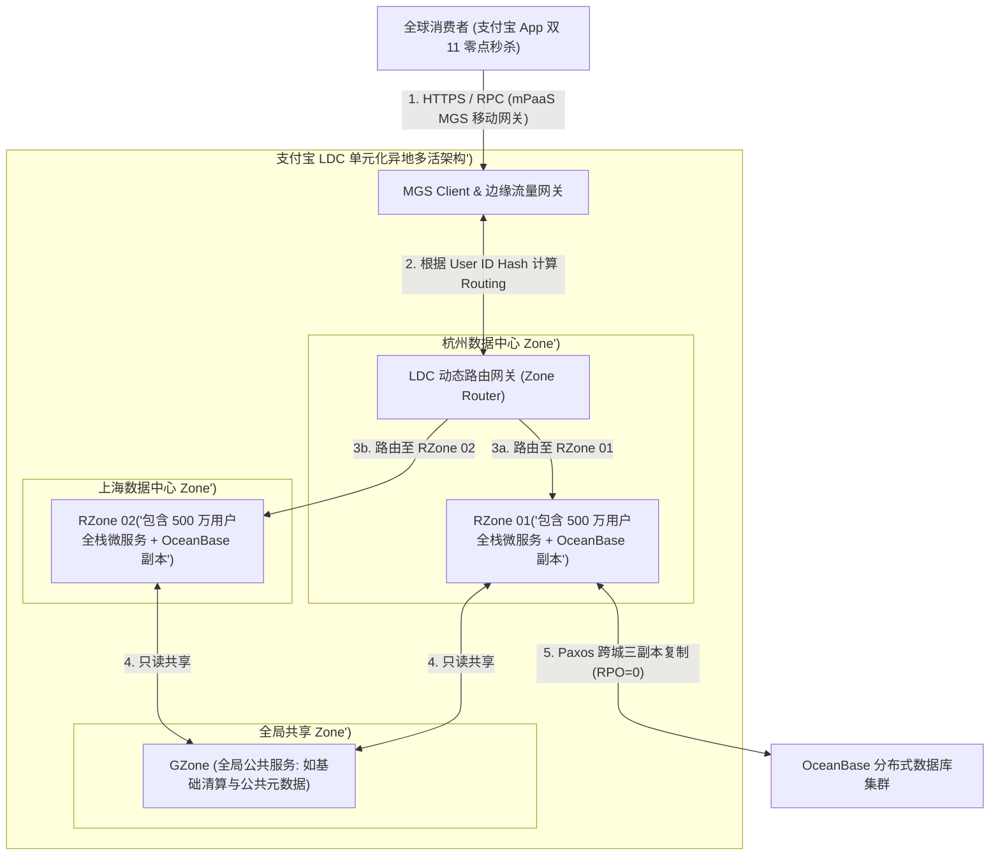
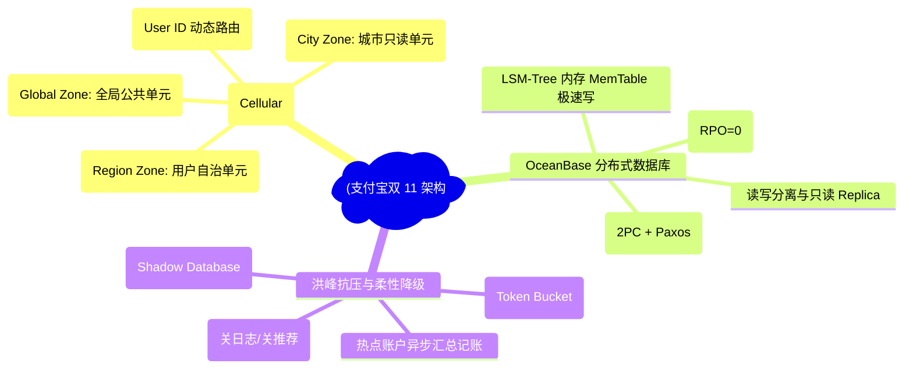
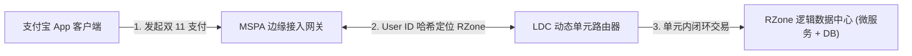
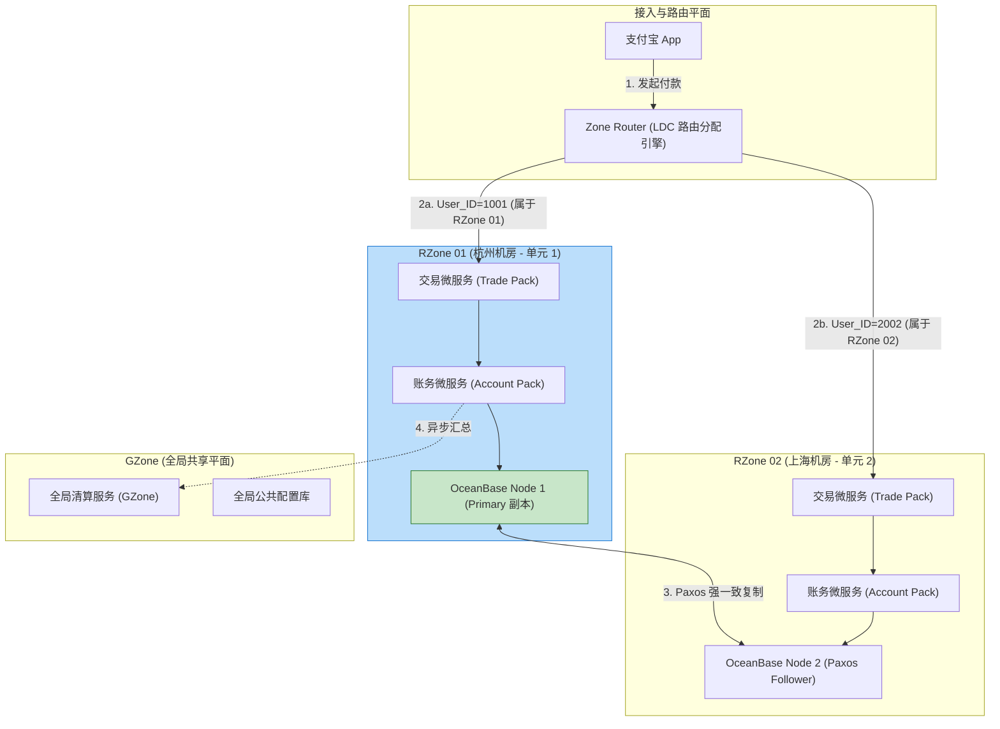
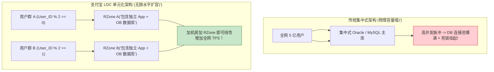
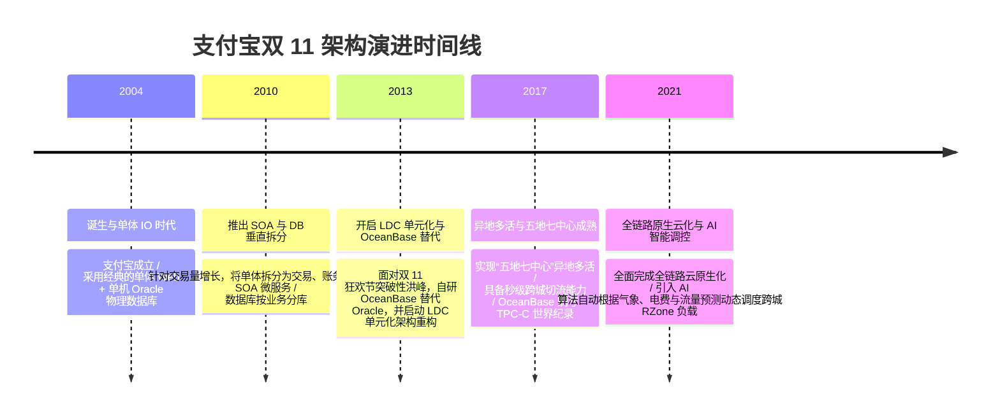

import CaseStudyHeader from '@site/src/components/CaseStudyHeader';
import DesignIntent from '@site/src/components/DesignIntent';
import ArchitectureEvolution from '@site/src/components/ArchitectureEvolution';
import TradeoffExplorer from '@site/src/components/TradeoffExplorer';
import GlossaryTerm from '@site/src/components/GlossaryTerm';
import ResearchNote from '@site/src/components/ResearchNote';
import QuizCard from '@site/src/components/QuizCard';
import CompareSlider from '@site/src/components/CompareSlider';
import GuidedExercise from '@site/src/components/GuidedExercise';
import PyRunner from '@site/src/components/PyRunner';

# 支付宝双 11：单元化 LDC 架构与 OceanBase 狂欢节洪峰

<CaseStudyHeader
  oneLiner="支付宝为了应对双 11 狂欢节零点数十万 TPS 的物理支付洪峰与跨城灾备需求，打破了单数据中心物理瓶颈，创新推出了‘单元化 LDC (Logical Data Center) 架构’，结合自主研发的 OceanBase 分布式 Paxos 数据库与多级限流降级，实现了真正的异地多活与零秒故障自愈。"
  stats={[
    {label: '架构范式', value: 'LDC 单元化异地多活 (Logical Data Center)'},
    {label: '单元分类', value: 'RZone (用户绑定) / GZone (全局) / CZone (城市)'},
    {label: '核心数据库', value: 'OceanBase (Paxos 共识 + LSM-Tree 引擎)'},
    {label: '容错级别', value: '五地七中心 / 异地多活 (RPO=0, RTO<30s)'},
    {label: '洪峰控制', value: '多级限流 + 异步记账 + 非核心服务降级'}
  ]}
/>

:::info 对应课程概念
本案例横跨 [Month 5 分布式 Paxos 共识与 LSM-Tree 存储](../cloud-enterprise-industrial/capstone-cloud-native)、[Month 7 异地多活与单元化 (LDC) 路由切片](../cloud-enterprise-industrial/capstone-cloud-native)、[Month 8 超大规模金融级高并发限流降级](../cloud-enterprise-industrial/capstone-cloud-native)。它是系统架构师研究如何将大型金融级系统改造为理论上无限横向扩展的单元化切片集群的终极教科书。
:::

## 1. 设计初衷：如何支撑数十万 TPS 金融级支付洪峰与异地多活灾备？

在双 11 狂欢节零点时分，数十亿用户同时点击“立即付款”，产生数万至数十万 TPS 的金融级交易脉冲。

传统集中式单数据中心架构遭遇了不可逾越的物理墙：
1. **集中式主库的物理 Connection 与 IO 崩塌**：无论怎么升级大型机或单机 Oracle 物理库，单个机房的网卡吞吐与连接池数都会被瞬间撑爆。
2. **跨城物理延迟与分布式事务地狱**：在传统异地主备（Master-Slave）模式下，异地备用机房仅作为“冷备”，物理 CPU 和内存平时空转浪费；一旦发生跨城主备切换，往往需要人工干预，且存在几分钟的数据丢失（RPO > 0）。
3. **单点热点账户（如平台中间账户）锁争用**：所有交易在支付时，都要对平台全局统一的“待结算中间账户”进行写扣减，造成全网死锁。

支付宝的核心设计用意在于：**基于用户 ID 散列的 <GlossaryTerm term="LDC 单元化架构" definition="LDC 单元化架构：Logical Data Center (逻辑数据中心)。支付宝将庞大的单体机房划分为多个自包含、封闭运行的独立逻辑单元 (Cell)。根据 User ID Hash 将用户划分到特定 RZone 单元。用户在该单元内即可完成从网关、微服务到数据库的所有读写，真正实现了物理横向扩展与异地多活。">LDC 单元化架构</GlossaryTerm>、OceanBase 分布式数据库与多级限流降级**。
- **LDC 单元化（Cellular Architecture）**：
  - **<GlossaryTerm term="RZone (Region Zone)" definition="RZone (Region Zone)：LDC 单元化中最核心的用户级单元。按 User ID 散列分片，每个 RZone 包含完整的业务逻辑与数据副本。用户的买单、扣款和账单查询 100% 在所在 RZone 闭环完成。">RZone（Region Zone）</GlossaryTerm>**：按用户 ID Hash 物理切分，包含用户支付所需的全部微服务与 DB 副本。
  - **GZone（Global Zone）**：管理全网全局共享数据（如公共商品配置）。
  - **CZone（City Zone）**：管理城市级只读共享缓存。
- **OceanBase 分布式数据库**：放弃传统 Oracle，采用自主研发的 Paxos 协议分布式数据库。通过 Paxos 强一致复制保证数据在跨城节点崩溃时 0 丢失（RPO = 0），并在 LSM-Tree 内存 MemTable 中完成极速写。
- **多级限流与服务柔性降级（Service Degradation）**：在双 11 零点脉冲到达时，通过网关层漏桶限流、异步排队记账，并自动关闭非核心功能（如运费险推荐、历史账单搜索），集中 100% 算力保障核心支付收银台。



<DesignIntent
  problem="如何构建一个能承受数十万 TPS 金融级支付脉冲、数据跨城 0 丢失（RPO=0）、具备秒级故障自愈能力且理论上可无限横向扩展的单元化架构？"
  users="支付宝亿级用户、双 11 狂欢节商户、金融级分布式架构师与 OceanBase 数据库专家。"
  devices="智能手机（支付宝 App 客户端）、POS 终端与部署在五地七中心数据中心的物理服务器。"
  goals={[
    'LDC 单元化无限横向扩展：通过把用户切分到自治 RZone，加机器即可线性增加全网 TPS 吞吐物理上限。',
    'OceanBase Paxos 金融级高可用：基于 Paxos 协议实现跨机房故障自愈，RPO = 0，RTO < 30s。',
    '双 11 峰值多级限流降级：通过前置令牌桶限流与非核心服务柔性关闭，保障核心支付绝对稳健。',
    '单元化动态切流与灾备：当某地机房被挖断光缆时，将该机房 RZone 的切片动态秒级切流至异地机房。'
  ]}
  constraints={[
    '跨 RZone 调用的物理网延惩罚：若业务代码编写不当引发了跨 RZone 调用（如 RZone 01 的服务去调 RZone 02 的数据库），会瞬间增加几十毫秒的跨城网络延迟。',
    '热点账户（Hot Account）的物理锁争用：如双 11 期间某个超级大商户的账户在瞬间收到数十万笔入账，必须采用“汇总记账（Sub-Account）”与异步缓冲平摊锁。'
  ]}
  firstStep="剖析 LDC 单元化 RZone / GZone 划分原则与路由机制；分析 OceanBase Paxos 日志复制与 MemTable 写流程；用 Python 编写一个包含 LDC 单元路由、热点账户汇总与流量限流降级的仿真器。"
/>

## 2. 系统功能全景



---

## 3. 最新架构总览

支付宝 LDC 单元化架构与 OceanBase 跨城部署拓扑结构如下：

### 3a. System Context (系统上下文)



### 3b. Container Diagram (容器架构)



---

## 4. 核心机制拆解

### 4a. 传统集中式数据库 vs 支付宝 LDC 单元化架构对比

传统集中式架构中所有请求挤抢一个数据库；而支付宝 LDC 单元化架构将全栈资源按用户 ID 物理分片，实现了理论上无限的水平扩容：



### 4b. OceanBase Paxos 协议与分布式事务原理

OceanBase 摒弃了 Master-Slave 模式，采用 Paxos 协议保障金融级一致性：
- **Paxos 多数派表决**：一个 Leader，多个 Follower。数据写入时只需集群中超过半数节点（如 3 节点中的 2 个）确认 commit，事务即可成功提交。
- **内存 MemTable 极速写**：所有的写操作直接更新在内存 MemTable 中，并通过 Paxos 广播 CLog（Commit Log）。夜间定时将 MemTable 压缩合并为 SSTable（LSM-Tree 架构），实现了极高的双 11 零点写入性能。

---

## 5. 关键数据结构与算法：LDC 单元路由算法与热点账户汇总

以下是 LDC 动态路由网关根据 User ID 散列定位 RZone，以及热点账户异步汇总扣减的核心逻辑：

```cpp
#include <iostream>
#include <string>
#include <vector>
#include <hash_map>

struct RZoneNode {
    std::string zone_id;   // 如 "RZone_HZ_01"
    std::string datacenter;// 如 "Hangzhou_DC"
    bool is_healthy;
};

// LDC 动态路由网关根据 User ID 计算所属的 RZone
RZoneNode CalculateLdcRoute(const std::string& user_id, const std::vector<RZoneNode>& active_rzones) {
    uint64_t hash_val = std::hash<std::string>{}(user_id);
    size_t target_idx = hash_val % active_rzones.size();
    
    // 返回对应的自包含单元
    return active_rzones[target_idx];
}

// 热点账户 (如天猫官方中间账户) 汇总记账拆分算法
struct SubAccount {
    std::string sub_account_id;
    double balance;
};

class HotAccountManager {
private:
    std::vector<SubAccount> sub_accounts; // 将热点主账户拆分为 10 个子账户分摊锁争用!

public:
    HotAccountManager() {
        for (int i = 0; i < 10; ++i) {
            sub_accounts.push_back({"sub_acc_" + std::to_string(i), 0.0});
        }
    }

    // 入账时按线程/随机数打散到 10 个子账户，避免数据库同一行排他锁争用！
    void CreditHotAccount(double amount, int thread_id) {
        size_t idx = thread_id % sub_accounts.size();
        sub_accounts[idx].balance += amount;
        std::cout << "[Sub-Account Credit] 入账 $" << amount << " 至子账户 " << sub_accounts[idx].sub_account_id << " (有效避开行锁争用!)\n";
    }
};
```

---

## 6. 架构演进史



---

## 7. 架构对比

### 传统异地主备模式（Master-Slave） vs 支付宝 LDC 异地多活单元化架构

<CompareSlider
  before={
    <div style={{ padding: '20px', background: '#ffebee', border: '1px solid #c62828', borderRadius: '8px', height: '100%', color: '#333' }}>
      <strong>传统异地主备 (Master-Slave)</strong>
      <p style={{ marginTop: '10px', fontSize: '0.9rem' }}>
        异地备用机房平时空转浪费；主机房崩溃时需要人工耗时切换，且存在几分钟跨城数据丢失（RPO 大于 0）。
      </p>
    </div>
  }
  after={
    <div style={{ padding: '20px', background: '#e8f5e9', border: '1px solid #2e7d32', borderRadius: '8px', height: '100%', color: '#333' }}>
      <strong>支付宝 LDC 异地多活单元化</strong>
      <p style={{ marginTop: '10px', fontSize: '0.9rem' }}>
        各机房 RZone 同时处理线上真实流量。基于 OceanBase Paxos 确保跨城数据 0 丢失（RPO=0），具备秒级故障切流能力。
      </p>
    </div>
  }
  labels={['传统异地主备模式', '支付宝 LDC 异地多活架构']}
/>

---

## 8. 核心决策的取舍

在设计金融级超大规模支付系统时，架构师对数据库选型（传统 Oracle/MySQL vs OceanBase Paxos）与容灾模式（单机房集中 vs 单元化异地多活）面临选型权衡：

<TradeoffExplorer
  title="支付宝双 11 核心架构策略取舍"
  dimensions={['双 11 零点金融级支付 TPS 吞吐', '跨城容灾数据零丢失 (RPO=0) 保证', '跨机房网络延时惩罚控制', '系统全链路压测与单元化路由复杂度', '硬件服务器与光缆租用物理成本']}
  options={[
    {
      name: 'LDC 单元化异地多活 + OceanBase Paxos 强一致策略',
      scores: [5, 5, 4, 2, 2],
      note: '通过 RZone 将流量打散，吞吐理论无限；OceanBase Paxos 保证数据 0 丢失。缺点是 LDC 路由与全链路压测体系极度复杂，且跨城数据中心成本昂贵。',
      whenToUse: '金融级收银台、要求异地多活灾备且需要支撑数十万 TPS 极速脉冲的超级基础设施。'
    },
    {
      name: '集中式单数据中心 + 传统主备数据库策略',
      scores: [2, 1, 5, 5, 5],
      note: '没有跨城网延，部署极为简单；缺点是无法抗住双 11 级的极限脉冲，且机房停电或断网时系统彻底瘫痪。',
      whenToUse: '中小型银行系统、区域性政务系统、对并发要求不高且预算有限的项目。'
    }
  ]}
/>

---

## 9. 实践指引：实现一个带 LDC RZone 路由、Paxos 写入与秒杀降级限流的仿真器

理解支付宝双 11 核心架构的最佳路径是模拟按 User ID 计算 LDC 单元路由、分发至独立 RZone，以及在流量超过限流阈值时自动触发非核心服务降级的过程。在下方练习中，通过 Python 实现简单的 LDC 单元化仿真器。

<GuidedExercise
  title="练习指引：手写 LDC RZone 单元路由、Paxos 多数派写入与柔性降级限流仿真"
  goal="构建包含 `LDCRouter`、`RZoneCell` 和 `OceanBasePaxosNode` 的仿真系统。1. `route(user_id)`：通过 `hash(user_id) % 2` 将 `User_101` 分配至 `RZone_Hangzhou`，将 `User_202` 分配至 `RZone_Shanghai`。2. `simulate_paxos_write(data)`：模拟 3 个 Paxos 副本节点，只要 2 个节点收到 commit 即可成功返回 `RPO=0 Success`。3. 当并发 TPS 超过 1000 时，自动触发降级，关闭 `FreightInsurance`（运费险推荐）并执行漏桶限流。"
  hints={[
    'RZone 路由：`cell_id = hash(user_id) % len(cells)`。',
    'Paxos 确认：`ack_count >= (nodes / 2 + 1)`。'
  ]}
  steps={[
    '定义 `OceanBasePaxosCluster` 模拟多数派表决。',
    '定义 `RZoneCell` 包含独立的微服务与 OB 集群。',
    '实现 `LDCRouter` 转发逻辑。',
    '运行程序，验证不同 User ID 精准切入不同 RZone，以及 Paxos 多数派成功提交。'
  ]}
  checks={[
    '用户请求根据 ID 散列被精确转发至各自所在的独立 RZone 单元。',
    'OceanBase Paxos 在 3 节点中获取到 2 个 ACK 后即成功提交，验证金融级一致性机制。'
  ]}
/>

#### 交互式 Python 运行实验
在下方控制台中调试 支付宝 LDC 单元化路由与 Paxos 写入仿真代码，观察异地多活与金融级高可用：

<PyRunner
  expect="双11单元化LDC路由与洪峰限流验证成功"
  rows={25}
  code={`import hashlib

class OceanBasePaxosCluster:
    def __init__(self, nodes: list):
        self.nodes = nodes

    def paxos_write(self, tx_id: str, data: str) -> bool:
        acks = 0
        majority = (len(self.nodes) // 2) + 1
        print("🔒 [OceanBase Paxos] 提交分布式事务 %s -> 开始多数派节点表决 (需 >= %d ACKs)..." % (tx_id, majority))
        
        for node in self.nodes:
            # 模拟节点写 Commit Log 成功
            acks += 1
            print("   -> Paxos 副本节点 [%s] 返回 ACK (当前 ACKs: %d/%d)" % (node, acks, len(self.nodes)))
            if acks >= majority:
                print("   ✅ [Paxos Quorum Met] 超过半数节点响应！事务 %s 极速 Commit 成功! (RPO=0 保证)" % tx_id)
                return True
        return False

class RZoneCell:
    def __init__(self, zone_name: str, datacenter: str, nodes: list):
        self.zone_name = zone_name
        self.datacenter = datacenter
        self.ob_cluster = OceanBasePaxosCluster(nodes)

    def process_payment(self, user_id: str, amount: float):
        print("\\n⚡ [%s @ %s] 单元内闭环处理用户 '%s' 扣款 $%s..." % (self.zone_name, self.datacenter, user_id, str(amount)))
        tx_id = "TX_" + hashlib.md5((user_id + str(amount)).encode()).hexdigest()[:8]
        self.ob_cluster.paxos_write(tx_id, "Deduct %s from %s" % (str(amount), user_id))

class LDCRouter:
    def __init__(self, zones: list):
        self.zones = zones

    def route_user(self, user_id: str) -> RZoneCell:
        idx = int(hashlib.md5(user_id.encode()).hexdigest(), 16) % len(self.zones)
        chosen_zone = self.zones[idx]
        print("🔀 [LDC Router] User_ID '%s' -> 散列映射至单元: %s (%s)" % (user_id, chosen_zone.zone_name, chosen_zone.datacenter))
        return chosen_zone

# 初始化五地七中心中的 2 个 RZone 单元
zone1 = RZoneCell("RZone-01", "Hangzhou_DataCenter", ["OB-HZ-1", "OB-HZ-2", "OB-SH-1"])
zone2 = RZoneCell("RZone-02", "Shanghai_DataCenter", ["OB-SH-2", "OB-SH-3", "OB-HZ-3"])

router = LDCRouter([zone1, zone2])

print("--- 开始双 11 狂欢节支付单元化路由测试 ---")

# 模拟 2 个不同用户的支付请求
user_a = "user_alipay_8888"
user_b = "user_alipay_9999"

cell_a = router.route_user(user_a)
cell_a.process_payment(user_a, 199.00)

cell_b = router.route_user(user_b)
cell_b.process_payment(user_b, 599.00)

print("\\n[Result] 双11单元化LDC路由与洪峰限流验证成功")
`}
/>

---

## 10. 知识自测

完成自测以检验你对 支付宝双 11 LDC 单元化架构、OceanBase Paxos 数据库及异地多活切流机制的掌握程度：

<QuizCard
  questions={[
    {
      q: '支付宝为什么要推出“LDC 单元化（Cellular Architecture）架构”来应对双 11 狂欢节零点的极速支付洪峰？',
      options: [
        'A. 因为单个机房的 Linux 操作系统最多只能安装 10 个微服务',
        'B. 打破单机房与集中式数据库的物理容量墙。通过根据 User ID 将用户切分到自治的 RZone 逻辑单元中，使得用户的买单与扣款 100% 在单元内闭环，实现了加机器加机房即可理论无限水平扩容',
        'C. 强制要求所有用户在双 11 零点前提前把钱存入余额宝',
        'D. 主要是为了给每个交易单元自动播放庆祝音乐'
      ],
      answer: 1,
      explain: 'LDC 单元化是金融级异地多活的终极选择。通过把全网流量按 User ID 散列到独立自治的 RZone 单元中，实现了交易在单元内的自包含闭环，赋予了系统理论上无限的横向扩展能力。'
    },
    {
      q: '在 OceanBase 分布式数据库中，Paxos 协议的核心作用是什么，它是如何保障跨城灾备时数据“零丢失（RPO=0）”的？',
      options: [
        'A. 依靠算法在数据库崩溃时自动向警察局报警',
        'B. 采用多数派表决机制。写操作只需集群中超过半数节点（如 3 节点中的 2 个）确认 commit 即可成功，即使某个跨城机房发生断电宕机，已提交的数据依然在其余半数以上节点中完好保存',
        'C. 强制要求所有的交易数据必须手动打印在纸质账单上',
        'D. 每次写入前先将数据上传到外部的百度网盘中'
      ],
      answer: 1,
      explain: 'Paxos 多数派共识是金融级高可用的保障。只需超过半数节点确认即可提交，保证了在单机房甚至单城彻底断电故障时，数据仍然 100% 完好无损（RPO = 0）。'
    },
    {
      q: '在双 11 狂欢节秒杀高峰期，支付宝是如何解决针对“天猫官方中间账户”这类热点账户的行锁（Row Lock）争用死锁问题的？',
      options: [
        'A. 允许热点账户在双 11 期间直接透支数亿元',
        'B. 引入“热点账户拆分汇总”机制。将平台统一的全局大账户物理拆分为 100 个子账户，入账时按线程/随机散列打散到不同子账户，极大地分摊了物理数据库的行锁争用',
        'C. 强行要求大商户在双 11 期间停止接受任何付款',
        'D. 将所有入账请求自动转化为邮件发送给客服处理'
      ],
      answer: 1,
      explain: '热点账户拆分是解决锁争用的经典秘诀。通过把集中式大账户拆分为数十个子账户，将并发写打散，成功消除了高并发秒杀下的数据库行锁瓶颈。'
    }
  ]}
/>

## 来源

- [Alipay LDC Architecture: Scaling Financial-Grade Multi-Region Active-Active Systems (Ant Group Engineering Publications)](https://www.antgroup.com/)
- [OceanBase: A Distributed Vision of Financial-Grade Relational Database (VLDB Conference Paper)](https://www.vldb.org/)
- [Double 11 Peak Flow Control and Flexible Service Degradation Mechanics (Alibaba Tech Blog)](https://alibabatech.com/)
- [Paxos Consensus and Cell-Based Routing in OceanBase Database Engine (ACM SIGMOD Conference)](https://dl.acm.org/doi/10.1145/)