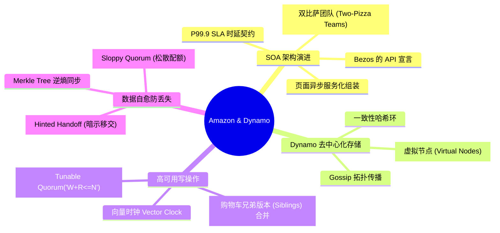
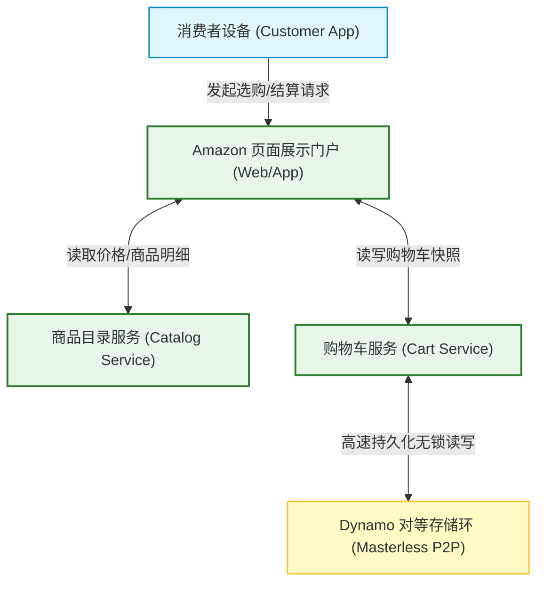
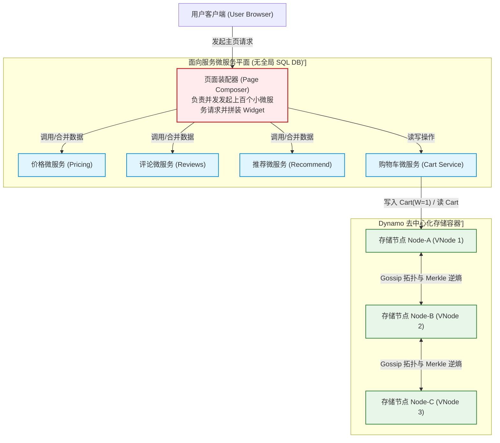
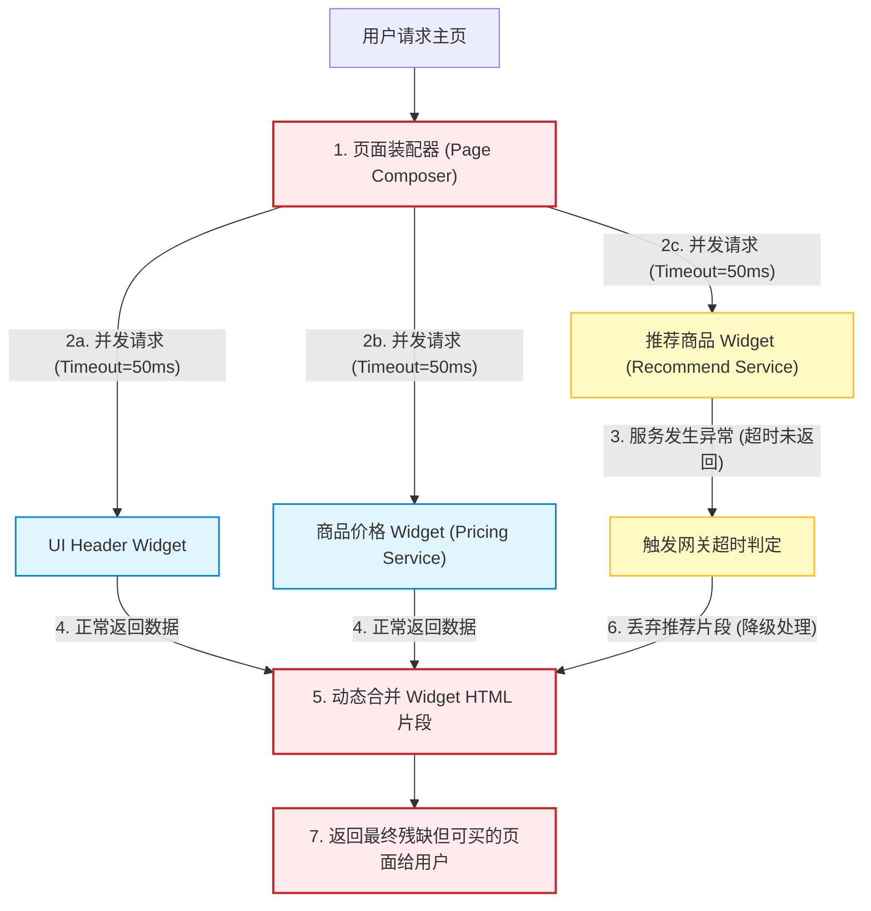
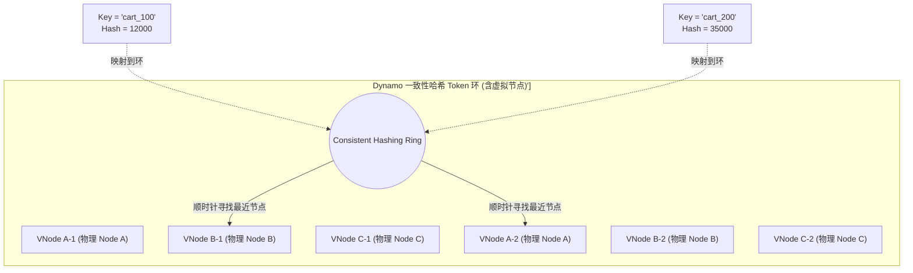
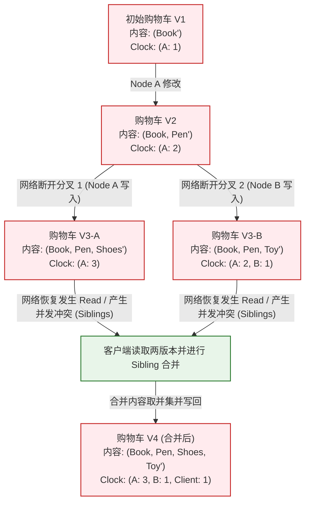
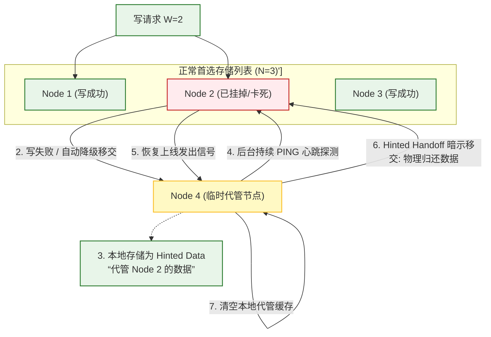
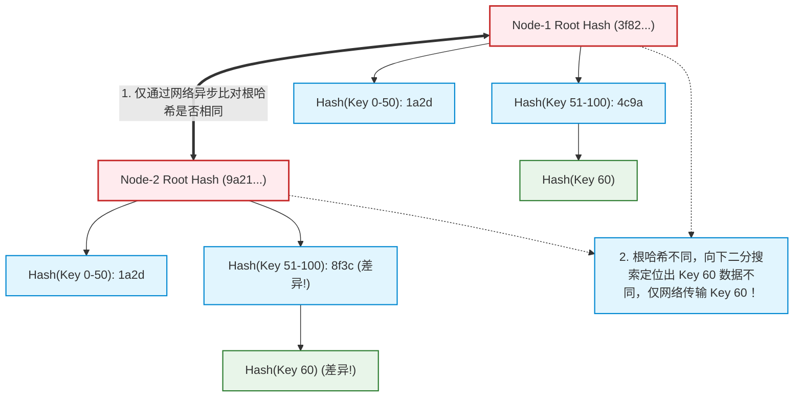

import CaseStudyHeader from '@site/src/components/CaseStudyHeader';
import DesignIntent from '@site/src/components/DesignIntent';
import EvolutionTimeline from '@site/src/components/EvolutionTimeline';
import CompareSlider from '@site/src/components/CompareSlider';
import TradeoffExplorer from '@site/src/components/TradeoffExplorer';
import GlossaryTerm from '@site/src/components/GlossaryTerm';
import ResearchNote from '@site/src/components/ResearchNote';
import GuidedExercise from '@site/src/components/GuidedExercise';
import QuizCard from '@site/src/components/QuizCard';
import MindMap from '@site/src/components/MindMap';
import PyRunner from '@site/src/components/PyRunner';

# Amazon：高弹性电商 SOA 平台、Dynamo 去中心化存储与高可用购物车架构

<CaseStudyHeader
  oneLiner="Amazon 是全球最大电子商务体系与现代分布式存储的奠基者。它率先打破单体巨型关系数据库边界，推行彻底的“双比萨团队（Two-Pizza Teams）”与面向服务架构（SOA），并发表了深刻改写 NoSQL 历史的 Dynamo 数据库论文。通过在去中心化哈希环上精细调和 W+R<=N 的松散一致性，依托向量时钟（Vector Clock）处理购物车多版本并发合并，Dynamo 实现了『永远可写』的极致高可用购物体验。"
  stats={[
    {label: '定位与类别', value: '全球级电子商务 SOA 平台与去中心化 Key-Value 存储'},
    {label: '接口架构', value: '面向服务架构 (SOA - Service Oriented Architecture)'},
    {label: '一致性模型', value: '最终一致性 (AP 模型) + 可调 Quorum (W+R<=N)'},
    {label: '冲突解决算法', value: '向量时钟 (Vector Clock) 因果版本追踪'},
    {label: '数据同步与逆熵', value: 'Merkle Tree (默克尔树) 增量 Gossip 同步'},
    {label: '服务指标契约', value: 'P99.9 延迟分位数 SLA (服务等级协议) 契约'}
  ]}
/>

:::info 对应课程概念
本案例融合了以下课程核心概念：
*   **服务分层与 API 契约（Month 1 系统边界）**：Bezos 的 API 宣言如何促成“无状态服务组装页面”与“双比萨团队”组织变革。
*   **一致性哈希与负载均衡（Month 5 负载均衡）**：Dynamo 哈希环与虚拟节点（Virtual Nodes）如何在大规模分片下规避热点倾斜。
*   **最终一致性与向量时钟（Month 5 数据复制）**：在无中心 Master 架构下，如何使用向量时钟进行并发分支溯源与客户端冲突合并。
*   **分位数 SLA 与尾延迟（Month 1 性能时延）**：为什么对于电商核心链路，必须将 P99.9 分位数延迟作为核心性能基准。
:::

---

## 1. 设计初衷：任何情况下，购物车必须“永远可写”

在 2001 年以前，Amazon.com 运行在单体 C++ 应用程序（名为 Obidos）和单一后端巨型 Oracle 关系型数据库上：
1.  **单体 Oracle 的物理天花板**：
    *   随着感恩节等促销季流量暴涨，Oracle 数据库的连接数和锁争用达到物理极限。
    *   页面渲染时需要执行大量的 SQL Joins（如关联用户、推荐、库存、价格、评价），任何一个底层小模块卡顿都会拖垮整个主页加载。
    *   为此，CEO 杰夫·贝佐斯（Jeff Bezos）于 2001 年颁布了著名的 **“API 宣言”（API Mandate）**：所有团队必须且只能通过网络服务接口（Services）暴露数据与功能，严禁任何直接的数据表跨库读取，彻底拉开了 <GlossaryTerm term="面向服务架构" definition="面向服务架构（SOA - Service Oriented Architecture）是一种分布式系统设计范式。它要求将大型单体系统拆分为多个拥有独立数据库、仅通过标准接口（如 HTTP/REST API）进行通信的独立服务，每个服务由独立的小团队维护。">面向服务架构（SOA）</GlossaryTerm> 的序幕。
2.  **购物车不可写等于“把钱往门外推”**：
    *   在传统的 CP 系统（强一致性关系型数据库）中，如果网络发生分区脑裂，或者多副本间同步发生阻塞，为了保证数据绝对一致，系统必须拒绝用户的写入请求。
    *   但对于 Amazon 而言，拒绝用户把商品“放入购物车”的写请求，无异于直接丢弃订单和金钱。
    *   架构团队提出了极致的高可用哲学：**写入必须永远成功，购物车必须随时可写**。哪怕因为断网导致数据冲突，产生多个版本的购物车副本（“兄弟版本 / Siblings”），也必须先存下来。等网络恢复后，交由客户端在读取时通过业务逻辑自动合并（例如将两个购物车里的商品取并集），这催生了 Dynamo 的诞生。
3.  **用可调配的 Quorum 机制换取极致可用性**：
    *   为了打破传统强同步的时延限制，Dynamo 允许用户自由调节配置参数：副本总数 N、写成功阈值 W、读成功阈值 R。
    *   如果将写阈值设为 W=1，意味着只要有一个节点写入成功，就会立即给用户返回成功，获得了无阻碍的瞬间写体验，将数据冲突的分支推迟到读阶段处理。

<DesignIntent
  problem="如何在拥有数万台物理节点、随时面临硬件损耗与网络分区的公有云环境下，构建一套支持百万并发写入、购物车“绝对不能写失败”、且单次页面渲染调用链达上百服务的去中心化分布式系统。"
  users="全球数以亿计的在线电商消费者，以及构建海量高弹高可用、低尾延迟订单结算底座的分布式存储系统专家。"
  devices="通过各类桌面/移动终端通过 HTTPS 协议请求接入，流式分发至全球 Amazon EC2 集群及 Dynamo 分片存储环上。"
  goals={[
    '100% 写入高可用：购物车等写操作必须在 O(1) 物理耗时内瞬间成功，决不允许因为网络分区、副本未同步而向用户返回写入失败',
    '微服务无状态组装：页面由 150 多个独立的无状态微服务通过异步网关进行并行调用拼装，任何单一非核心微服务挂掉，页面依然能残缺渲染出来',
    '尾时延（Tail Latency）严格控制：将 P99.9 延迟分位数作为核心服务等级契约（SLA），消除由于垃圾回收或偶发 I/O 抖动导致的长尾延迟',
    '去中心化主从平权：Dynamo 采用 Masterless 对等环形拓扑，无单点选主逻辑，消除 Master 宕机时的写卡顿真空期'
  ]}
  constraints={[
    '客户端冲突合并（Conflict Resolution）的复杂性：由于写操作强行成功（W=1），读数据时经常会拿到多个并存冲突版本（Siblings），客户端必须配备复杂的因果时钟逻辑去执行业务层合并',
    '可变的一致性弱化：最终一致性模型下，用户可能会遭遇刚刚加入购物车的商品在刷新页面后瞬间短暂“消失”的“读写不一致”延迟，需要客户端在表现层进行代偿优化',
    '存储容量限制：由于 Dynamo 是为超高性能购物车/用户 Session 设计的 Key-Value 引擎，不支持复杂的 SQL 关联查询和多表事务'
  ]}
  firstStep="制定团队 API 边界规范与 SLA 契约；建立基于虚拟节点的一致性哈希 Token 环；编写向量时钟并发版本分析器；实现 Hinted Handoff 数据临时移交协议；编写 Gossip 数据逆熵 Merkle 树。"
/>

---

## 2. 知识全景脑图

### 2a. 全景架构思维导图

### 2b. 交互脑图导航

<MindMap
  root={{
    label: 'Amazon & Dynamo 架构',
    children: [
      {
        label: '微服务与组织 (SOA)',
        children: [
          { label: 'Bezos API 宣言边界' },
          { label: '无状态服务页面装配' },
          { label: 'P99.9 尾时延 SLA' }
        ]
      },
      {
        label: '对等分布式环 (Dynamo Ring)',
        children: [
          { label: '虚拟节点哈希路由' },
          { label: 'Gossip 去中心化拓扑' },
          { label: 'Merkle Tree 增量校验' }
        ]
      },
      {
        label: '冲突与高可用 (Resilience)',
        children: [
          { label: 'W+R<=N 最终一致' },
          { label: '向量时钟并发追溯' },
          { label: 'Sloppy Quorum 暗示移交' }
        ]
      }
    ]
  }}
/>

---

## 3. 系统架构总览 (C4 Model)

### 3a. System Context (系统上下文图)

### 3b. Container Diagram (容器结构图)

---

## 4. 核心机制拆解

### 4a. 页面组件异步装配与 SOA 架构演进

杰夫·贝佐斯的“API 宣言”逼迫整个 Amazon 实现了彻底的面向服务架构（SOA）：
1.  **Shared-Nothing 数据库隔离**：每个微服务拥有自己独立的数据库，其他服务想要访问此数据，**必须通过该服务的 API 访问，严禁任何形式的 SQL 跨库直连**。这让每个微服务都可以独立选用最适合的数据库（如 Dynamo、MySQL 或者是 S3）。
2.  **页面并行异步装配（Page Compositing）**：
    *   用户访问 Amazon.com 时，前端的“页面装配器（Page Composer）”会发起并行异步调用链路，向后端的 150 多个微服务（价格、库存、图片、送货方案、相似推荐）发送请求。
    *   每个服务在极短超时阈值内返回一个 HTML 片段（Widget）。如果“推荐微服务”由于超时未返回，网关会直接忽略该片段，网页依然可以渲染出主播放区和价格购买键，只是缺少了“您可能喜欢的商品”这一栏，实现**服务的优雅降级（Graceful Degradation）**。

---

### 4b. 一致性哈希环 (Consistent Hashing) 与虚拟节点设计

为了让数据均匀地分布在数万台存储服务器上且避免在节点扩容/宕机时引起海量数据大范围搬迁，Dynamo 采用了经典的 <GlossaryTerm term="一致性哈希" definition="一致性哈希是一种特殊的哈希算法。它将哈希值空间组织为一个虚拟的圆环（Token Ring），所有数据的主键和物理节点均哈希后映射到环上，数据沿顺时针方向寻找最近的物理节点进行存储，这极大地降低了节点变更时的数据搬迁开销。">一致性哈希（Consistent Hashing）</GlossaryTerm>：
1.  **哈希圆环拓扑**：哈希空间（例如 0 到 2^32-1）首尾相接构成一个圆环。每个 Key 的 SHA-1 值映射到环上的某个位置，并沿着环**顺时针**方向寻找碰到的第一个物理节点作为其归属节点。
2.  **虚拟节点（Virtual Nodes）消除热点**：
    *   如果只将物理机直接映射到环上，由于哈希分布的物理随机性，极易发生部分节点间弧度过大承载海量数据、而另一部分节点几乎空载的“负载倾斜”问题。
    *   Dynamo 引入了 **Virtual Nodes (VNodes)**：一台性能强劲的服务器在环上可以分身成成百上千个“虚拟节点”（例如物理节点 A 在环上拥有 A-1, A-2... A-100 个虚拟位置）。
    *   这使得每个物理节点在环上的分布极度均匀。当物理节点 A 宕机时，它负责的 100 个虚拟节点的数据会被均匀地顺时针分摊给环上的所有其他物理机，避免了单一邻居节点被数据流瞬间冲垮（雪崩效应）。

---

### 4c. 向量时钟 (Vector Clocks) 与购物车冲突合并

因为 Dynamo 在写入时追求极致可用（W=1），在遭遇跨机房网络断网时，同一份购物车会被分发写入到两个无法通信的副本节点中。
当断网自愈后，如何得知这两个版本的先后顺序？这依赖于 <GlossaryTerm term="向量时钟" definition="向量时钟（Vector Clock）是一种用于建立分布式系统中事件因果关系（Causal Order）的模型。它是一个由 [节点ID, 计数器] 组成的向量，通过对比两个时钟里各个节点的计数器大小，可以精准判断两个版本是属于前后因果演进关系，还是并发冲突关系。">向量时钟 (Vector Clock)</GlossaryTerm>：
1.  **时钟生成**：
    *   Dynamo 在每个数据对象上绑定一个向量时钟：`VC = [ (Node1, Counter1), (Node2, Counter2)... ]`。
    *   当 Node1 修改了购物车，它会把自己的 Counter1 自增 1。
2.  **版本追溯与分支冲突（Siblings）**：
    *   如果版本 X 的向量时钟中所有节点的 Counter 均大于或等于版本 Y 的对应 Counter，说明 X 是在 Y 的基础上修改来的（因果演进），可以直接覆盖 Y。
    *   如果版本 X 和版本 Y 的 Counter 互有大小（例如 `X=[(A,1),(B,1)]` 且 `Y=[(A,2)]`），说明这两个修改是**并发发生、互不知情的冲突分支（Siblings）**。
3.  **客户端合并**：
    *   当用户下次发起 `get` 请求时，Dynamo 发现有冲突，会将 $X$ 和 $Y$ 两个购物车的版本**同时返回给客户端**。
    *   客户端的微服务（购物车服务）读取这两个版本，执行业务合并逻辑：对比两个购物车，将两者中的商品做并集（“宁可多寄一件商品，绝不漏掉用户的订单”），随后向存储环发送写合并后的新版本 Z，向量时钟更新为 `[A:2, B:1, Client:1]`，冲突消除。

---

### 4d. 松散 Quorum (Sloppy Quorum) 与暗示移交 (Hinted Handoff)

为了在大面积宕机时保证写不中断，Dynamo 放弃了严格的静态 Quorum 限制，独创了 **Sloppy Quorum（松散配额）** 与 **Hinted Handoff（暗示移交）**：
1.  **松散配额**：
    *   正常情况下，Key 的 N 个副本应存放在环上顺时针最近的 N 个物理节点（即 Preference List，首选列表，比如 Node-1, 2, 3）。
    *   如果遇到断网，Node-1 挂了，Dynamo 并不会拒绝写入。它会继续顺时针往下寻找健康的临时节点（例如 Node-4），并将写请求写入 Node-4。
2.  **暗示移交 (Hinted Handoff)**：
    *   Node-4 接收到这个数据包后，会将其标记为“暗示数据（Hinted Data）”，并把元数据信息写在特别的信头：“这是属于 Node-1 的数据，我只是替它代管”。
    *   Node-4 后台的心跳 Gossip 进程会不断探测 Node-1。一旦发现 Node-1 重新恢复上线，Node-4 会**主动将托管的数据全部物理归还传输给 Node-1**，并删除本地临时备份。这保证了在单点抖动和短时断电下，数据副本数量和写成功率的高稳定。

---

## 5. 关键数据结构与算法

### 5a. 向量时钟的因果历史追溯与并发冲突判断

向量时钟在数学上可以通过分量对比进行因果顺序判断：
*   **因果支配（Causal Dominance）**：
    给定两个向量时钟 `V1` 和 `V2`：
    *   `V1 >= V2` 只有当对所有节点 `k`，`V1[k] >= V2[k]` 都成立，且至少有一个节点满足 `V1[k] > V2[k]`。
    *   如果 `V1 >= V2`，说明 `V1` 继承并覆盖了 `V2`，无冲突。
    *   如果存在节点 `i, j` 使得 `V1[i] > V2[i]` 且 `V1[j] < V2[j]`，则说明 `V1` 和 `V2` 并发冲突，两个版本成为 **Siblings**，需要应用层介入合并。

---

### 5b. 默克尔树 (Merkle Tree) 在去中心化逆熵 (Anti-Entropy) 中的对比算法

当系统空闲或者没有写操作时，各对等节点需要在后台比对数据副本是否一致（这被称为**逆熵 / Anti-Entropy**）。为了避免在网络中传输整表几十 GB 的真实数据来进行逐行比对，Dynamo 使用了 **Merkle Tree（默克尔树）**：
*   **按 Key Range 建树**：每个节点将自己负责的虚拟节点数据范围内的 Keys 组织成一棵 Merkle Tree。叶子节点是 Key-Value 的哈希值，父节点是子节点哈希的联手拼接哈希。
*   **对等网络树比对**：
    *   节点之间只需异步发送对方这棵树的根哈希（Root Hash）。
    *   如果根哈希一致，说明数据 100% 同步，比对在一瞬间结束。
    *   如果根哈希不一致，双方沿着树枝向下递归比对子节点的哈希值，快速定位出那几个发生差异的 Key，仅通过网络拉取这几个 Key 的最新数据即可完成数据同步，将网络开销从 `O(N_database_size)` 坍缩到了 `O(log N)`。

---

### 5c. 99.9% 延迟分位数 SLA 契约与容量限额控制

在大型电商架构中，平滑的延迟控制是用户体验的核心。Amazon 提出了严格的延迟 SLA 契约：
*   **舍弃平均时延 (Average Latency)**：如果一个接口的平均时延是 50ms，但 P99.9（第 99.9 百分位数）延迟达 5 秒，意味着每 1000 个用户中就有 1 个面临极其难受的卡顿。而对于每秒处理几百万请求的 Amazon 而言，这就是每秒数千人卡死。
*   **P99.9 契约**：微服务提供方在设计接口时，必须承诺即使遇到网络重试、垃圾回收、底层存储切换，其 P99.9 时延也必须在承诺值（如 200ms）之内。为了达成此契约，Dynamo 甚至允许放弃重度消耗资源的整理压缩操作，牺牲长期的存储去重效率，来换取极致的平滑读写延迟。

---

## 6. 架构演进史

Amazon 与 Dynamo 在分布式理论史上的变迁，催生了 NoSQL 黄金时代的爆发：

<EvolutionTimeline
  events={[
    {
      year: '2001',
      title: 'Obidos 单体崩溃与贝佐斯 API 宣言',
      why: '单体 C++ 程序 Obidos 和单体 Oracle 强一致数据库无法支撑高速暴涨的电商流量，数据库死锁与连接数耗尽频发。',
      change: '推出著名的“API 宣言”，强力实施 SOA 组织架构变革，确立微服务 Shared-Nothing 数据库边界。'
    },
    {
      year: '2007',
      title: 'Dynamo 论文发表与 NoSQL 狂潮',
      why: '为了解决购物车“绝对不能写失败”的高可用诉求，需要一款完全去中心化、最终一致、永远可写的 Key-Value 存储底座。',
      change: 'DeCandia 等人发表 Dynamo 经典论文；推出集成了一致性哈希、向量时钟、Sloppy Quorum 和 Merkle 逆熵的 Masterless 架构，直接引爆了 Cassandra、Riak 等开源 NoSQL 的模仿浪潮。'
    },
    {
      year: '2012',
      title: '托管服务 DynamoDB 云原生转型',
      why: '原生的 2007 经典 Dynamo 在实际落地中，为了高可用把并发冲突解决（Vector Clocks / Sibling 合并）抛给业务层，这使得应用层开发极度繁琐，且本地物理机维护去中心化集群开销庞大。',
      change: '将原生的去中心化 AP 思想与固态硬盘（SSD）、强一致 Paxos 复制（CP 定理）进行融合，在 AWS 推出完全托管的 DynamoDB 服务，默认在存储层解决冲突，解放了应用开发者。'
    },
    {
      year: '2020 至今',
      title: 'Serverless 事件驱动结算生态',
      why: '大规模促贩下，固定的微服务虚拟机集群在空闲时会产生巨大的算力空转浪费，且结算需要更敏捷的响应。',
      change: '核心结算面逐步迁移至事件驱动的云原生无服务器（Serverless / Lambda）与大容量 DynamoDB 全球多写表，实现自动冷缩容。'
    }
  ]}
/>

---

## 7. 架构对比：早期单体关系 Oracle 架构 vs. SOA 与去中心化 Dynamo 存储

<CompareSlider
  before={
    

      <strong>Obidos &amp; Oracle 单体单表架构</strong>
      
全量业务共用同一台大型 Oracle 数据库进行关系存储。页面拼装需要通过 SQL 执行大范围关联查询。一旦网络分区或数据库发生故障，整个网站由于无法写入数据直接陷入系统宕机瘫痪，伸缩上限受 CPU 单核性能和物理内存锁严重卡阻。

    

  }
  after={
    

      <strong>微服务 SOA &amp; Dynamo 对等存储</strong>
      
服务完全解耦独立，通信仅走标准网络 API。购物车存储托付给对等哈希环上的 Masterless Dynamo 节点。依靠可调的 Quorum（W=1）与向量时钟，在任何跨机房网络断电下仍可顺利写盘，冲突推迟到读时在客户端逻辑合并，达成极致高可靠。

    

  }
  labels={['早期单体数据库', 'SOA 与 Dynamo']}
/>

---

## 8. 设计模式与课程映射

本案例在实际全球级大并发电商协作与去中心化存储底座中，深度应用了以下课程章节中的核心设计模式与技术：

1.  **P99.9 SLA 时延分位数考核**（参见 [性能与延迟](../01-foundations/performance-and-latency.mdx) 章节）：
    *   Amazon 对 P99.9 延迟分位数做硬性 SLA 考核。这是 Month 1 强调的“消减尾延迟（Tail Latency）”和避免队列排队瓶颈的顶级工业实践，远比看平均数有价值得多。
2.  **最终一致性与向量时钟模式**（参见 [数据复制与一致性](../05-core-components/replication.mdx) 章节）：
    *   Dynamo 的向量时钟，是分布式数据复制章节中“逻辑时钟（Lamport Clock）”的工程学具现。它解决了无中心全局时钟下，并发写入先后秩序的因果确定性判断。
3.  **Merkle Tree Gossip 增量同步模式**（参见 [去中心化协调](../05-core-components/consensus-coordination.mdx) 章节）：
    *   利用 Merkle Tree 计算物理数据片段的哈希指纹，在 gossip 逆熵比对中递归查差异，与 Month 5 区块链网络或 Git 的目录树校验思想互通，以 O(log N) 代价解决大数据差分同步。
4.  **无状态微服务页面合并组件**（参见 [设计模式与 LLD](../04-design-patterns-lld/overview.mdx) 章节）：
    *   页面装配器（Page Composer）并行查询上百服务，采用类似“组合模式（Composite Pattern）”和“中介者模式（Mediator Pattern）”，解耦了局部微服务超时故障对全局渲染的影响。

---

## 9. 权衡：去中心化 AP 键值库底座中的架构折中

Dynamo 在可用性、并发开发成本以及强一致性要求之间做出了以下权衡：

<TradeoffExplorer
  title="Dynamo 去中心化 AP 存储架构权衡"
  dimensions={['购物车写入百分百高可用', '应用程序层并发开发心智', '数据库行级强一致事务', '节点漂移数据同步开销', '集群无单点 Master 容灾率']}
  options={[
    {
      name: '去中心化 AP 哈希环 + 向量时钟冲突解决 (经典 Dynamo)',
      scores: [5, 1, 1, 4, 5],
      note: '通过将写入可用性顶到最高（W=1）并采取 Masterless 拓扑，系统具备极致的抗断网、抗故障写可用性。但代价是应用层开发极其繁琐，开发人员不得不手动处理 Vector Clocks 和 Sibling 购物车合并逻辑，且无法支持 ACID 多行事务。',
      whenToUse: '购物车、用户在线会话（Session）等对“写可用性”有极端要求、允许最终一致性、且写多读少的键值存储场景。'
    },
    {
      name: 'Paxos 强一致复制集群 + 托管 SSD 存储 (现代化 DynamoDB / Spanner)',
      scores: [3, 5, 5, 2, 4],
      note: '通过将冲突合并在数据库内部（借助 Paxos/Raft 以及全局物理锁/时钟）统一解决，向应用开发者提供极度友好的强一致 CP 定理接口（没有 Sibling 并发冲突，即写即读）。代价是当网络彻底分叉时，少数派分区写操作直接失败。',
      whenToUse: '支付订单、账户余额扣减、配置变更等对“一致性与数据绝对正确”有强性红线要求、不能容忍脏读的金融级电商业务。'
    },
    {
      name: '传统集中式主从复制 RDBMS (如早期 Oracle 单机架构)',
      scores: [1, 5, 5, 1, 1],
      note: '数据集中在一个超级节点，提供最完善的 SQL 关联和 ACID 事务，开发心智极度简单。但系统抗单点灾难率极低，网络分区即陷入读写双双锁死瘫痪，扩展极其依赖昂贵硬件的纵向升级。',
      whenToUse: '开发团队极小、数据表关系异常盘根错节、业务流量尚处于单机性能承载范围之内的初期系统。'
    }
  ]}
/>

---

## 10. 如果是你来设计：向量时钟并发冲突与合并仿真器

### 场景设想
在 Dynamo 的去中心化购物车底层：
*   当两个客户端并发修改同一个购物车 `cart_123` 且节点间暂时无法通信时：
    *   Node-A 收到修改，给它打上向量时钟 `{"A": 1}`。
    *   Node-B 同时收到另一份修改，打上向量时钟 `{"B": 1}`。
*   当系统读取该 Key 时：
    *   由于 `{"A": 1}` 和 `{"B": 1}` 互不支配，存在**并发冲突（Siblings）**。
    *   数据库不应该物理抛弃任何一个，而是将两个冲突的内容全部返回给购物车微服务。
    *   购物车微服务提取两份数据，做业务层合并（将商品求并集），重置并提交合并后的新向量时钟 `{"A": 1, "B": 1, "Client": 1}`，完成冲突合并与数据自愈。

请你用 Python 实现这套经典的向量时钟因果分析与购物车并发合并状态机算法。

<GuidedExercise
  title="基于 Python 的 Dynamo 向量时钟与购物车合并仿真"
  goal="实现包含 Vector Clock 大小判定（因果支配还是并发冲突）、Siblings 兄弟版本收集、以及客户端购物车去重合并的分布式冲突解决控制台。"
  steps={[
    '步骤 1: 设计 VectorClock 类。内部用字典记录 `{"node_id": counter}`。',
    '步骤 2: 实现 `compare(vc1, vc2)`。如果每一个 key 上的 counter 均大于等于另一方且至少一个大，判定为支配继承；如果存在交叉大小，判定为并发冲突（CONCURRENT）。',
    '步骤 3: 设计 DynamoNode 模拟器。包含 `local_storage`（存储值和对应时钟）。',
    '步骤 4: 模拟分叉写入。客户端向 Node-A 发送写购物车请求（加入 “book”），Node-A 递增其 clock；同时另一个客户端向 Node-B 发送请求（加入 “shoes”），Node-B 递增其 clock。',
    '步骤 5: 实现客户端 `read_and_resolve()` 逻辑。读取 A 和 B 上的版本，如果 compare 结果是并发冲突，将购物车列表求并集并合并时钟，发送合并写请求。',
    '步骤 6: 检查输出。观察在合并前是否检测出了冲突并发，以及合并后的购物车是否包含了 “book” 和 “shoes” 且时钟完成覆盖。'
  ]}
  checks={[
    '确认在 Node-A 和 Node-B 收到并发写请求后，对比两个向量时钟返回 `CONCURRENT_CONFLICT` 状态',
    '验证客户端合并程序正确将两个购物车的商品做了并集，没有发生丢件',
    '确认当控制台打印出“✅ 向量时钟与购物车 Sibling 合并验证通过！”时，模拟器工作正常'
  ]}
/>

#### 交互式 Python 运行实验
在下方控制台中直接运行或修改已准备好的向量时钟与冲突合并仿真代码：

<PyRunner
  expect="向量时钟与购物车 Sibling 合并验证通过"
  rows={25}
  code={`class VectorClock:
    def __init__(self, clock_dict=None):
        # 存储格式: {node_id: counter}
        self.clock = dict(clock_dict) if clock_dict else {}

    def increment(self, node_id):
        self.clock[node_id] = self.clock.get(node_id, 0) + 1

    def clone(self):
        return VectorClock(self.clock)

    def merge(self, other_vc):
        # 合并两个向量时钟，取相同 key 下 counter 的最大值
        new_clock = {}
        all_keys = set(self.clock.keys()).union(set(other_vc.clock.keys()))
        for k in all_keys:
            new_clock[k] = max(self.clock.get(k, 0), other_vc.clock.get(k, 0))
        return VectorClock(new_clock)

    @staticmethod
    def compare(vc1, vc2):
        # 向量时钟对比算法：
        # 返回 "VC1_DOMINATES", "VC2_DOMINATES", "EQUAL" 或 "CONCURRENT_CONFLICT"
        v1 = vc1.clock
        v2 = vc2.clock
        
        all_keys = set(v1.keys()).union(set(v2.keys()))
        
        v1_has_greater = False
        v2_has_greater = False
        
        for k in all_keys:
            c1 = v1.get(k, 0)
            c2 = v2.get(k, 0)
            if c1 > c2:
                v1_has_greater = True
            elif c1 < c2:
                v2_has_greater = True
                
        if v1_has_greater and v2_has_greater:
            return "CONCURRENT_CONFLICT"  # 并发冲突关系 (Siblings)
        elif v1_has_greater:
            return "VC1_DOMINATES"         # VC1 是新版，支配覆盖 VC2
        elif v2_has_greater:
            return "VC2_DOMINATES"         # VC2 是新版，支配覆盖 VC1
        else:
            return "EQUAL"

    def __repr__(self):
        return str(dict(sorted(self.clock.items())))

class DynamoNodeMock:
    def __init__(self, node_id):
        self.node_id = node_id
        self.storage = {}  # 模拟物理 KV 存储

    def put(self, key, value, vc):
        # 保存值和对应时钟
        self.storage[key] = (value, vc.clone())

# 测试开始
node_A = DynamoNodeMock("Node-A")
node_B = DynamoNodeMock("Node-B")

print("--- 步骤 1: 初始状态，用户在主副本 A 上加入 Book ---")
clock_init = VectorClock()
clock_init.increment("Node-A")
# 购物车包含 Book
cart_v1 = ["Book"]
node_A.put("cart_123", cart_v1, clock_init)
print(f"Node-A 存储: {cart_v1}, 时钟: {clock_init}")

print("\\n--- 步骤 2: 模拟网络分区，Node-A 与 Node-B 无法通信，并发写发生 ---")
# 客户端 1 在 Node-A 写入 (在 V1 基础上加入 Pen)
clock_A = clock_init.clone()
clock_A.increment("Node-A")
cart_v2_A = ["Book", "Pen"]
node_A.put("cart_123", cart_v2_A, clock_A)
print(f"Node-A 接收并发写 v2-A: {cart_v2_A}, 时钟: {clock_A}")

# 客户端 2 在 Node-B 写入 (在 V1 基础上加入 Shoes)
# 注意：Node-B 此时未收到 Node-A 的 clock_A 增量，它以初始 clock_init 为基准进行自增
clock_B = clock_init.clone()
clock_B.increment("Node-B")
cart_v2_B = ["Book", "Shoes"]
node_B.put("cart_123", cart_v2_B, clock_B)
print(f"Node-B 接收并发写 v2-B: {cart_v2_B}, 时钟: {clock_B}")

print("\\n--- 步骤 3: 网络自愈，客户端读取两个节点数据并分析冲突 ---")
val_A, vc_A = node_A.storage["cart_123"]
val_B, vc_B = node_B.storage["cart_123"]

comparison = VectorClock.compare(vc_A, vc_B)
print(f"比对 Node-A 时钟 {vc_A} 与 Node-B 时钟 {vc_B} -> 结果: {comparison}")

if comparison == "CONCURRENT_CONFLICT":
    print("   [!] 警报: 检测到并发冲突！启动购物车 Sibling 合并逻辑...")
    # 购物车合并逻辑：求并集
    merged_cart = list(set(val_A).union(set(val_B)))
    
    # 向量时钟合并逻辑：合并时钟并加入客户端自增
    merged_vc = vc_A.merge(vc_B)
    merged_vc.increment("Client")
    
    print(f"   [Resolve] 合并后的购物车内容: {merged_cart}")
    print(f"   [Resolve] 合并后的时钟: {merged_vc}")
    
    # 将合并后的一致性版本写回所有节点
    node_A.put("cart_123", merged_cart, merged_vc)
    node_B.put("cart_123", merged_cart, merged_vc)

# 最终验证
final_val, final_vc = node_A.storage["cart_123"]
if (set(final_val) == {"Book", "Pen", "Shoes"} and 
    final_vc.clock.get("Node-A") == 2 and 
    final_vc.clock.get("Node-B") == 1 and 
    final_vc.clock.get("Client") == 1):
    print("\\n[✅ 验证成功]: 向量时钟与购物车 Sibling 合并验证通过！")
else:
    print("\\n[❌ 验证失败]")
`}
/>

---

## 11. 常见误解

### 误解 1：现在的 AWS DynamoDB 就是 2007 年亚马逊发表的那篇经典 Dynamo 数据库
*   **澄清**：这是完全混淆的两代系统。
    1.  2007 年的 **Dynamo** 是一个**去中心化、Masterless、最终一致性（AP）**的 Key-Value 本地磁盘存储环。它把“写冲突（Siblings）”抛给业务应用层开发人员去合并，虽然写可用性极高，但应用开发十分痛苦，因此现在 Amazon 内部已逐步弃用原版 Dynamo。
    2.  2012 年发布的 **DynamoDB** 是一个**完全托管、强一致 Paxos 复制（CP 定理）、基于 SSD 驱动**的云数据库服务。它由底层系统自动锁表解决冲突，不再需要业务层处理向量时钟，并且支持二级索引和 ACID 事务，两者在架构设计和一致性哲学上截然相反。

### 误解 2：经典 Dynamo 采用最终一致性，在断网时会让用户购物车里的商品发生丢失
*   **澄清**：恰恰相反。
    1.  最终一致性并不会把数据弄丢，它只是数据**推迟了同步**。
    2.  经典的 Dynamo 的高可用购物车哲学是：“宁可多寄一件商品，绝不漏掉一个订单”。
    3.  即使发生分区脑裂，Node-A 写入了 “Book”，Node-B 写入了 “Shoes”。当网络恢复后，读取这俩冲突版本时，购物车微服务会调用并集（Union）算法进行合并，合并结果是 `[Book, Shoes]`，用户顶多发现购物车里多了件衣服，但绝对没有漏掉商品，数据非常安全。

### 误解 3：只要我们配置 `W + R > N`，那么在任何网络断开分区情况下，就一定能获得强一致性的“读写实时一致”
*   **澄清**：这在理论上是错的。
    1.  `W + R > N` 只能在“**无网络分区（No Partitions）**”且没有节点脱线的情况下，通过鸽巢原理保证读版本和写版本至少有重叠节点，从而读到最新值。
    2.  但在网络发生**脑裂分区**时，少数派分区（例如只有 1 个节点）根本无法凑够 `W` 个写成功（若 `W=2, N=3`）。此时为了可用性，Dynamo 会开启 **Sloppy Quorum（松散配额）**，转而在临时节点上成功写入。这就破坏了 `W + R > N` 的基础重叠，导致在这个期间读取数据依然会拿到旧数据或发生冲突。
    3.  因此，在网络故障期间，Sloppy Quorum 使得强一致协议退化为弱一致最终一致，这也是 AP 系统的必然物理规律。

---

## 12. 知识自测

<QuizCard
  questions={[
    {
      q: '在经典的 2007 年 Dynamo 对等数据库设计中，当发生网络分区且多节点并发写入导致一个 Key 产生两个相互冲突的版本（Siblings）时，数据库是如何处理这个冲突的？',
      options: [
        'A. 强行抛出 WriteConflictException 并回滚当前事务，直到网络自愈',
        'B. 数据库会物理保留这两个相互冲突的版本及其对应的向量时钟，并在下次用户读取（get）该 Key 时，将这两个冲突版本同时返回给客户端微服务，交由应用层逻辑合并',
        'C. 数据库依靠中央 ZooKeeper 节点的 TrueTime 进行物理覆写',
        'D. 直接根据时间戳，强制把写时间较早的那个版本物理抹除，只留最新版'
      ],
      answer: 1,
      explain: '这是 Dynamo 的高可用妥协。写入时坚决不报错以保可用性。冲突被完整记录（Siblings），推迟到读操作时丢给客户端购物车微服务去处理合并，体现了“写优先”的 AP 哲学。'
    },
    {
      q: '关于 Dynamo 中的“松散 Quorum”（Sloppy Quorum）与“暗示移交”（Hinted Handoff）协同工作的物理表现，以下哪一项描述是正确的？',
      options: [
        'A. 当首选列表中的节点 Node-A 挂掉时，写请求会写入临时健康节点 Node-X，Node-X 标记此数据并替 Node-A 代管；一旦 Node-A 恢复上线，Node-X 会将代管数据物理传送还给 Node-A 并清空本地缓存',
        'B. 它规定了如果读写不一致，系统会自动锁定 10 分钟以进行强行数据格式化',
        'C. 它会在宿主机中自动启动 MicroVM 隔离所有的 Cgroups 控制器',
        'D. 客户端会自动降级为 SVN 的集中式差分写入模式'
      ],
      answer: 0,
      explain: '这保证了数据不丢失与抗单点宕机。Node-X 属于临时托管，Sloppy Quorum 允许它参与写成功计数（保持写可用）；Hinted Handoff 保证了数据在首选节点 Node-A 上线后能自动归位，保障了数据最终一致性。'
    },
    {
      q: '在亚马逊的微服务体系中，微服务团队考核与设计接口性能时，为什么强推“P99.9 延迟分位数 SLA”而不是“平均延迟（Average Latency）”？',
      options: [
        'A. 因为平均延迟很难用 Java 或者是 C++ 进行数学相加计算',
        'B. 因为对于百万请求/秒的高并发系统，平均数掩盖了长尾延迟的巨大抖动。P99.9 代表每 1000 次请求里最慢的那 1 次，而在一次页面渲染中需要并行调用上百个服务，任何一个服务出现 P99.9 卡顿都会导致整页加载缓慢，因此必须卡死尾延迟',
        'C. 为了防止 Docker 容器内发生写时复制（COW）导致的宿主机死机',
        'D. P99.9 SLA 强制要求所有的购物车都必须支持 exactly-once 事务'
      ],
      answer: 1,
      explain: '这是尾时延（Tail Latency）管理的精髓。在一个由 150 个微服务并行组装的页面中，如果不压制每个服务的 P99.9 时延，根据概率原理，用户打开主页时几乎 100% 会撞上某一个服务的长尾卡顿，导致平均时延指标毫无意义。'
    }
  ]}
/>

---

<ResearchNote
  title="购物车宁可冲突也不宕机:Dynamo 的可用性优先"
  source="Dynamo 论文(SOSP 2007)"
  href="https://www.allthingsdistributed.com/files/amazon-dynamo-sosp2007.pdf"
  insight="Dynamo 为「永远可加购」牺牲强一致——写永不拒绝,分区冲突留到读时用向量时钟检测,购物车合并取并集(宁可复活已删商品也不丢加购);Bezos API mandate 则强制一切团队只经服务接口通信,逼出了 SOA。"
  application="架构启示:高可用系统要按业务容忍度选一致性——购物车「多一件」可接受、「加不进」不可接受,于是选 AP + 应用层合并;组织上用 API 强制解耦比架构图更能造出微服务。"
/>

## 来源清单

*   [DeCandia, G., et al. (2007), Dynamo: Amazon's Highly Available Key-Value Store (SOSP 2007)](https://www.allthingsdistributed.com/files/amazon-dynamo-sosp2007.pdf)
*   [Bezos, J. (2002), The Bezos API Mandate (Amazon Internal Memo / Transcripts)](https://api-evangelist.com/2012/01/12/the-bezos-api-mandate/)
*   [Vogels, W. (2008), Eventually Consistent - Revisited (ACM Queue / Dynamo consistency design analysis)](https://queue.acm.org/detail.cfm?id=1466448)
*   [AWS Architecture Blog: From Obidos to microservices - Amazon's SOA migration history](https://aws.amazon.com/blogs/architecture/)