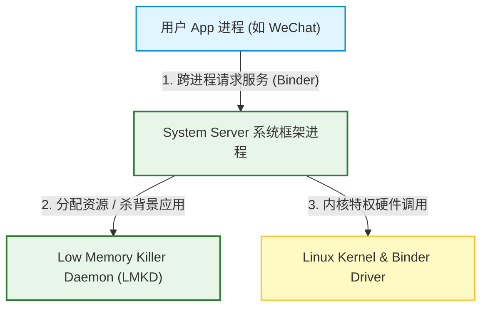
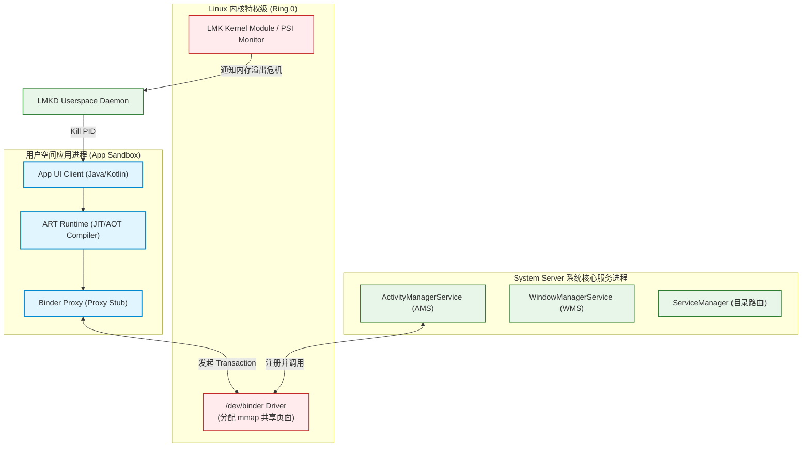
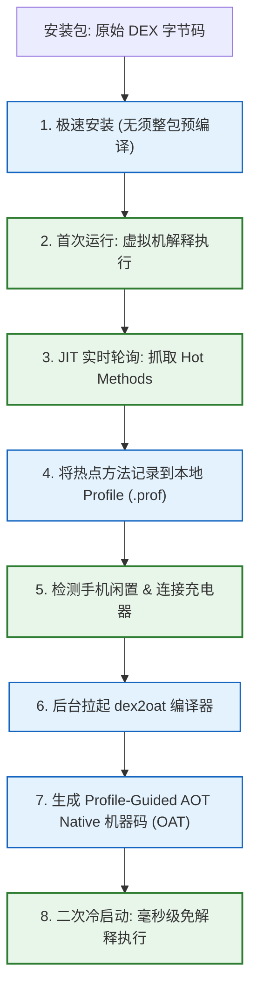
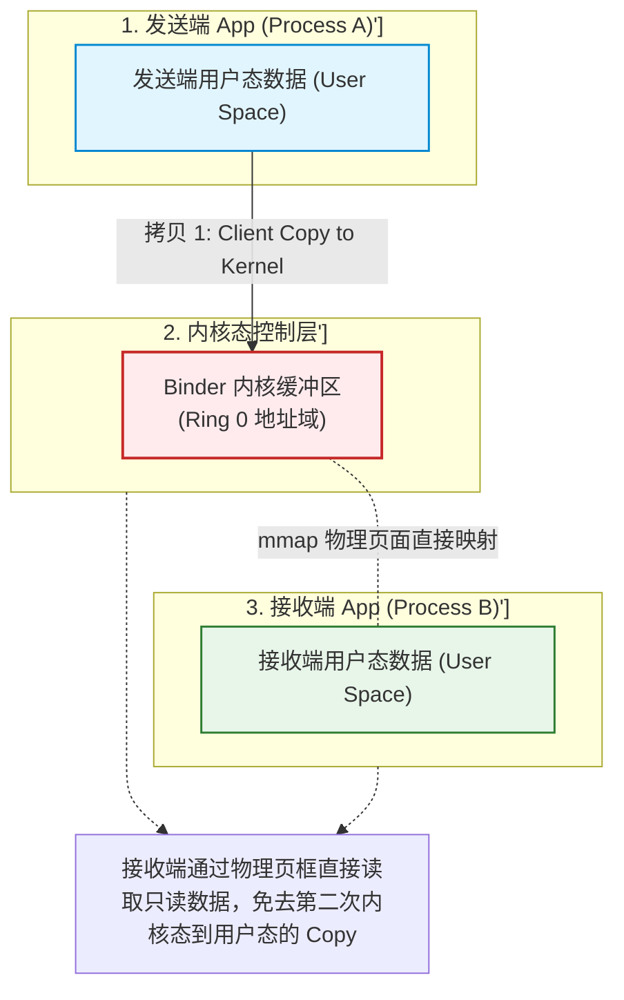
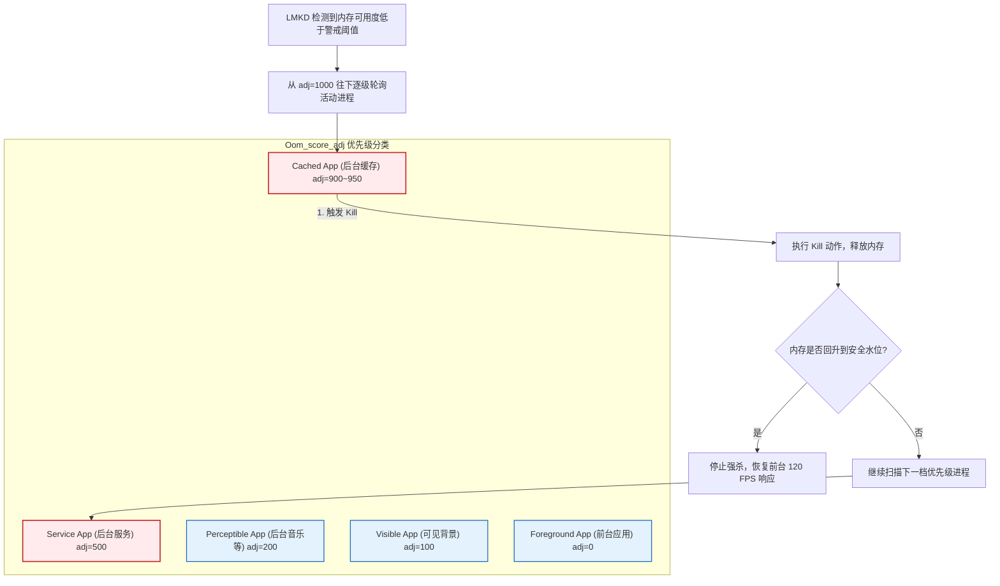

import CaseStudyHeader from '@site/src/components/CaseStudyHeader';
import DesignIntent from '@site/src/components/DesignIntent';
import EvolutionTimeline from '@site/src/components/EvolutionTimeline';
import CompareSlider from '@site/src/components/CompareSlider';
import TradeoffExplorer from '@site/src/components/TradeoffExplorer';
import GlossaryTerm from '@site/src/components/GlossaryTerm';
import ResearchNote from '@site/src/components/ResearchNote';
import GuidedExercise from '@site/src/components/GuidedExercise';
import QuizCard from '@site/src/components/QuizCard';
import MindMap from '@site/src/components/MindMap';

# Android 操作系统：Android Runtime (ART) 虚拟机、Binder 单拷贝 IPC 与 LMKD 内存回收机制

<CaseStudyHeader
  oneLiner="Android 作为全球用户基数最大的移动操作系统，其核心架构是针对移动端硬件资源（低内存、有限电量、异构处理器）进行极致优化的结晶。它以 C++ 挂载的 Binder 驱动实现仅需『一次拷贝』的进程间通信（IPC），借助『JIT 运行分析 + 空闲 AOT 编译』的 ART 混合模式平衡了安装速度与运行效率，并利用 LMKD 守护进程基于 oom_score_adj 动态杀进程以保障前台丝滑的体验。"
  stats={[
    {label: '虚拟机核心', value: 'ART (Android Runtime)'},
    {label: '编译模式', value: 'JIT + Profile-Guided AOT'},
    {label: 'IPC 机制', value: 'Binder 驱动 (mmap 单拷贝)'},
    {label: '内存回收', value: 'LMKD (Low Memory Killer Daemon)'},
    {label: '进程孵化器', value: 'Zygote (COW 共享内存页)'},
    {label: '沙箱模型', value: 'Multi-user UID App Isolation'}
  ]}
/>

:::info 对应课程概念
本案例融合了以下课程核心概念：
*   **进程隔离与高效通信（Month 11 架构安全）**：多沙箱隔离下，如何通过零拷贝/单拷贝（Binder mmap）技术实现安全且超低延迟的数据传输。
*   **内存管理与资源垃圾回收（Month 8/12）**：低内存（Out Of Memory）场景下的多级进程状态转换与资源强行回收（LMKD 优先级）。
*   **编译型与解释型混用优化（Month 4 性能调优）**：如何采用 JIT + AOT 混编模式动态降低系统冷启动延迟与磁盘空间开销。
:::

---

## 1. 设计初衷：受限硬件与极致体验的博弈

移动端操作系统（如 Android）与服务器操作系统（如 Linux）在核心目标上面临完全不同的硬约束：
1.  **极度有限且敏感的 RAM 内存**：服务器可以拥有数百 GB 内存，而早期移动端仅有 512MB 到 2GB 内存。为了保证前台应用绝对不卡顿，系统必须拥有一套快速、分级的进程淘汰机制，在内存吃紧时，在微秒级时间内杀死优先级低的进程。
2.  **电池与能效比（Battery Life）**：每一次 CPU 的高负荷运转都在损耗电池。如果应用每次启动都重新动态解释执行所有 Java 字节码，会消耗大量电能。若将应用全量编译成机器码，又会面临应用安装时间极长（几十分钟）以及极度浪费有限闪存的问题。
3.  **频繁跨进程调用（System API Heavy）**：Android 的应用架构是高度面向组件与微服务化的。一个简单的“点击拍照”操作，至少涉及 `App 进程` -> `ActivityManagerService (系统进程)` -> `CameraService (相机进程)` -> `MediaServer (多媒体进程)` 的多次跨进程数据传递。传统的 Linux IPC（如 Socket、管道）需要经历“两次内存拷贝”（用户态 A -> 内核态 -> 用户态 B），开销难以承受。

为此，Android 从最底层重构了虚拟化、进程通信与内存策略。

<DesignIntent
  problem="如何在低 RAM 空间、有限电池续航的移动终端上，支撑大量的跨进程系统级组件交互，并保障用户当前正在使用的应用获得绝对优先的系统算力与内存分配。"
  users="全球超过 30 亿智能手机、平板电脑、穿戴设备和智能车载终端的用户。"
  devices="运行在高度定制的 Linux 内核上，运行在 ARMv8/v9 或 x86 物理 SoC 上的移动平台。"
  goals={[
    'Binder IPC 单拷贝：跨进程调用只进行一次物理内存拷贝，事务延迟降至亚毫秒级',
    'ART 混合编译效率：实现热点方法 native 执行，既保留 AOT 的极快运行速度，又杜绝长安装延迟与存储臃肿',
    '前台丝滑不卡顿：LMKD 守护进程在内存低于阈值时，自动根据 oom_score_adj 优先级杀背景应用，保护前台 120 FPS 渲染',
    '应用快速孵化：通过 Zygote 预加载虚拟机和核心 Class 类，利用写时复制 (COW) 机制，在数毫秒内孵化出新 App 进程'
  ]}
  constraints={[
    '硬件物理限制：必须在低端机型（如 2GB/3G RAM）上稳健运行，不能因内存不足引起整机死机',
    '内存单点拷贝限制：Binder 调用单次传输默认有 1MB 左右的严格上限，不支持传输极大的超高清图片或视频数据',
    '多进程竞争：高频背景任务（Push Service、下载）不能拖累前台的 UI 渲染主线程'
  ]}
  firstStep="开发 Binder Linux 内核驱动（提供 mmap 接口）；构建 Zygote 预加载虚拟机映像；编写 Android 运行时的 dex2oat 混编管线；编写用户态 LMKD 基于内存压力级别的轮询回收守护机制。"
/>

---

## 2. 知识全景脑图

<MindMap
  root={{
    label: 'Android 系统架构',
    children: [
      {
        label: '虚拟机运行 (ART VM)',
        children: [
          { label: 'Register-based DEX 字节码' },
          { label: 'dex2oat 机器码编译' },
          { label: 'JIT 运行时分析 (hot code)' },
          { label: '空闲 AOT Profile 编译' }
        ]
      },
      {
        label: '跨进程通信 (Binder IPC)',
        children: [
          { label: 'Binder 驱动 (/dev/binder)' },
          { label: 'mmap 映射 (Client-Server 内存交织)' },
          { label: 'AIDL 协议与代理 Stub' },
          { label: 'ServiceManager 路由目录' }
        ]
      },
      {
        label: '资源控制 (LMKD)',
        children: [
          { label: 'oom_score_adj 动态算分' },
          { label: '前台 / 可见 / 缓存多级状态' },
          { label: 'PSI (Pressure Stall Information)' },
          { label: '用户态 LMKD 回收守护' }
        ]
      },
      {
        label: '进程创建 (Process Fork)',
        children: [
          { label: 'Zygote 预载入模板' },
          { label: 'Copy-On-Write 写时复制' },
          { label: 'SystemServer 系统骨架' }
        ]
      }
    ]
  }}
/>

---

## 3. 系统架构总览 (C4 Model)

以下是 Android 应用、系统框架与特权驱动的三平面协同 C4 Context 与 Container 拓扑。

### 3a. System Context (系统上下文图)



### 3b. Container Diagram (容器结构图)



---

## 4. 核心机制拆解

### 4a. Android Runtime (ART) 混合编译生命周期

Android 的编译运行管线极其精致，旨在解决“安装速度”与“运行性能”的尖锐对立：
1.  **DEX 格式优化**：不同于 Standard Java 栈式字节码，Android 使用基于寄存器（Register-based）的 DEX 字节码，指令条数更少，高度适配移动端 CPU 的物理架构。
2.  **首装期 (Installation)**：App 安装时保留为原始 DEX 包，安装在数秒内极速完成，不消耗过多存储。
3.  **首次运行期 (First Runs)**：ART 解释执行 DEX 字节码。同时，内置的 JIT 编译器在后台轮询监控，分析发现经常被执行的“热点方法（Hot Methods）”，将它们在内存中动态编译成 Native 机器码，提高二次执行效率。并且把这些热点方法的元信息记录在本地的 `.prof`（Profile 文件）中。
4.  **闲置充电期 (Background Compilation)**：当手机检测到正在“空闲（Screen Off）且连接电源充电”时，一个系统级守护进程（JobScheduler）会自动拉起编译工具 `dex2oat`。`dex2oat` 读取之前的 `.prof` 配置文件，仅仅将应用中这 10%-20% 被高频执行的方法“预编译”为本地机器码（OAT 格式）。这兼顾了极致启动性能和最省的存储容量。



---

### 4b. Binder IPC 单拷贝通信机理

跨进程调用是 Android Framework 的支柱。Binder 没有采用普通的 Linux Sockets IPC（需要两次数据拷贝），而是依靠 `mmap` 达到了单拷贝（Single Copy）的能效极限：
1.  **内核缓冲区映射 (Memory Map)**：当进程启动时，通过打开 `/dev/binder` 驱动，并调用 `mmap` 申请一块物理空间（通常限制为 1MB 以下）。Binder 驱动会将这块内存同时映射到：
    *   内核空间（Kernel Address Space）。
    *   接收端进程的用户空间（Receiver Process User Space - 读写保护为只读）。
2.  **一次写入即投递**：当发送端（Client）发起事务（Transaction）时，通过 `ioctl` 将数据放入 Binder 驱动。驱动的物理内存页在内核态收到数据，因为内核态页面与接收端（Server）用户态映射了相同的物理页框，Server 进程的内存空间立刻就能够看到该数据，无须内核再从“内核空间”拷贝到“Server 用户空间”。
3.  **零中间拷贝损耗**：完成了 `Client用户空间 -> 物理映射页框` 的唯一一次数据拷贝，这使高频跨进程服务调用拥有极高的效率。



---

### 4c. LMKD 优先级内存淘汰机制

Android 没有采用纯虚拟内存换出（Swap）机制，因为高频擦写闪存会缩短手机寿命。Android 采用强力终结非必要进程的内存管理策略：
1.  **进程状态与 ADJ (oom_score_adj)**：系统根据应用的可见性给它赋予一个动态的 `-1000` 到 `1000` 之间的分数值：
    *   **Foreground App（前台应用）**：当前在屏幕展示并获得焦点的应用。`oom_score_adj = 0`，属于绝对不能杀的进程。
    *   **Visible App（可见应用）**：前台应用弹出的对话框背后透出来的半隐藏应用。`oom_score_adj = 100`。
    *   **Perceptible App（感知应用）**：比如后台正在播放音乐的音乐软件。`oom_score_adj = 200`。
    *   **Cached App（缓存后台）**：用户回到桌面、已挂起的后台应用。`oom_score_adj = 900+`。最容易被干掉。
2.  **PSI 压力监测与 LMKD 杀进程**：
    *   LMKD（用户态 Low Memory Killer 守护进程）通过读取 Linux 的 PSI（Pressure Stall Information）文件或轮询内存可用水平。
    *   当内存空闲量低于第一档水位线时，LMKD 按优先级顺序，由高到低（从 `1000` 逐级往下）寻找 Cached 进程。
    *   执行 `kill(pid, SIGKILL)` 强力收回其内存，直到可用内存水位重回安全线以上。



<ResearchNote
  title="Android Runtime 虚拟机设计与 Binder 单拷贝实现"
  source="Google AOSP Technical Documents (2014-2023), Android Runtime (ART) & Binder IPC driver"
  href="https://source.android.com/docs/core/runtime"
  insight="Android 官方技术文档详细解释了 ART 替代 Dalvik 的演进历程，以及 Binder 单拷贝的性能论证。Binder IPC 利用 mmap 建立了内核空间和接收端用户空间的共享内存关联。使得大对象只在 ioctl 提交时发生一次数据拷贝。这从理论上回答了“在进程沙箱严格隔离的前提下，如何在微秒级内频繁进行 IPC 交换”的移动端底层核心诉求。"
  application="架构启示：在移动端或边缘计算设备中，**单拷贝/零拷贝（Zero-Copy）**是决定系统极限吞吐的关键。如果将这一思路运用到 Month 12 大规模微服务网关设计中，使用 Netty 或 eBPF 绕过多次用户态-内核态拷贝，能极大降低服务间调用的 CPU 消耗与尾部延迟。"
/>

---

## 5. 关键数据结构与算法

### 5a. Binder 事务协议项定义

Binder IPC 通信的核心是数据打包。以下是 Binder 驱动内核头文件中最基础的 IPC 事务数据结构 `binder_transaction_data`。
它定义了一次 IPC 传输的承载参数、发送方身份以及指向内存拷贝区段的物理地址指针：

```c
struct binder_transaction_data {
    union {
        __u32 handle;               /* 目标 Binder 实体的引用句柄 */
        binder_uintptr_t ptr;       /* 目标 Binder 实体在内核的内存地址 */
    } target;
    binder_uintptr_t cookie;        /* 附加标记 (通常指向 Stub 对象的本地引用) */
    __u32 code;                     /* 远程调用的方法 Code (对应 AIDL 的 method ID) */
    
    __u32 flags;                    /* 事务标志 (如 TF_ONE_WAY 代表异步单向，不阻塞等待返回) */
    __s32 sender_pid;               /* 发送端进程的 PID (安全检验用) */
    __s32 sender_euid;              /* 发送端进程的 UID (安全校验用，保证沙箱不能跨权调用) */
    
    binder_size_t data_size;        /* 携带的数据包长度 */
    binder_size_t offsets_size;     /* 数据中携带的 Binder 对象偏移量数组的长度 */
    
    union {
        struct {
            binder_uintptr_t buffer; /* 指向已经 mmap 映射完毕的物理数据缓冲区的起始地址 */
            binder_uintptr_t offsets;/* 指向 Binder 句柄数组的偏移量指针 */
        } ptr;
        __u8 buf[8];
    } data;
};
```

---

### 5b. LMKD 内存压强判定机制

LMKD 目前依赖 Linux Kernel 提供的 **PSI（Pressure Stall Information，压力失速信息）** 机制判定系统压强。
系统读取 `/proc/pressure/memory` 文件：

`some avg10=20.00, avg60=10.00, avg300=5.00, total=124000`

*   `some` 代表因内存不足导致至少有一个线程处于阻塞（Stall）状态的 CPU 时间百分比。
*   当 `avg10`（过去 10 秒的失速均值）大于设定阀值时，LMKD 将判定系统处于内存高压状态，随即执行 `oom_score_adj` 的扫描和强杀任务。

---

## 6. 架构演进史

Android 的运行时和资源调度经历过数次关键性的重构：

<EvolutionTimeline
  events={[
    {
      year: '2008',
      title: 'Dalvik 虚拟机与 O(1) 解释器时代 (Android 1.0)',
      why: '早期的 CPU 大多是单核且运行频率极低（<1GHz），闪存容量非常昂贵（通常只有 128MB 到 512MB）。必须采用极其节省存储的虚拟机模式。',
      change: '推出基于寄存器（Register-based）的 Dalvik 虚拟机；采用纯解释执行机制，应用冷启动快但运行效率低。'
    },
    {
      year: '2014',
      title: 'ART 诞生与纯 Ahead-of-Time (AOT) 时代 (Android 5.0)',
      why: '手机硬件性能大幅跃升，但 Dalvik 的解释执行和高频垃圾回收经常导致前台丢帧，用户感觉卡顿。急需将代码预编译为 Native。',
      change: '引入 ART (Android Runtime) 替代 Dalvik；在应用安装时通过 dex2oat 耗时十几分钟全量将字节码转换为本地机器码。虽运行飞快，但导致安装极慢、极其耗费闪存空间。'
    },
    {
      year: '2016',
      title: 'ART JIT/AOT 混合编译架构 (Android 7.0+)',
      why: '纯 AOT 导致大应用安装时间难以接受、系统更新重启后升级时间过长，且绝大多数应用 80% 的代码块用户根本不会点击运行。',
      change: '首创基于 JIT 实时编译热点代码，并在手机空闲且充电时拉起后台 Job 进行 Profile-Guided 局部 AOT 预编译，彻底平衡了运行性能与安装效率。'
    },
    {
      year: '2018+',
      title: 'LMKD 用户态守护演进 (Android 9.0+)',
      why: '传统的 Linux 内核 OOM 机制不理解 Android 的应用进程优先级，经常误杀前台正在输入的重要进程，需要有更精细的用户态策略控制。',
      change: '正式引入用户态 LMKD，依赖 PSI 内存压强，全面接管进程强杀流程，根据 oom_score_adj 实现了精细的分级强制回收。'
    }
  ]}
/>

---

## 7. 架构对比：Binder 单拷贝机制 vs. 标准 Linux IPC 机制 (Sockets / Pipes)

<CompareSlider
  before={
    <div style={{ padding: '20px', background: '#ffebee', border: '1px solid #c62828', borderRadius: '8px', height: '100%', color: '#333' }}>
      <strong>标准 Linux IPC 机制 (Sockets / Pipes)</strong>
      <p style={{ marginTop: '10px', fontSize: '0.9rem' }}>数据在进程间传递需要经历两次拷贝：Client 用户空间到内核缓冲区（Copy 1），内核缓冲区到Server 用户空间（Copy 2）。高频调用下 CPU 上下文拷贝负载严重，事务延迟偏高。</p>
    </div>
  }
  after={
    <div style={{ padding: '20px', background: '#e8f5e9', border: '1px solid #2e7d32', borderRadius: '8px', height: '100%', color: '#333' }}>
      <strong>Binder 单拷贝机制 (Android Target)</strong>
      <p style={{ marginTop: '10px', fontSize: '0.9rem' }}>利用 mmap，将内核的物理缓存区直接映射到接收端（Server）的用户空间。数据只需从发送端（Client）用户空间拷贝到内核映射区（Copy 1），Server 便可直接读取，减少了 50% 的拷贝开销，完美适配移动端的亚毫秒高频跨进程调用。</p>
    </div>
  }
  labels={['标准 Linux IPC (两次拷贝)', 'Binder IPC (单拷贝/mmap)']}
/>

---

## 8. 权衡：移动操作系统设计的关键权衡

Android 在资源受限的架构约束下，进行过多项关键性的折中：

<TradeoffExplorer
  title="Android 性能、容量与电池能效权衡"
  dimensions={['应用冷启动速度', '磁盘闪存容量节省', '安装阶段耗时', '跨进程安全校验保障', '前台 UI 渲染流畅度 (120 FPS)']}
  options={[
    {
      name: 'JIT + Profile-Guided AOT 混合编译',
      scores: [4, 5, 5, 4, 4],
      note: '安装时零消耗，运行时依靠 JIT 收集 Profile，空闲充电时再对热点方法进行 AOT 固化。实现了最省的闪存空间占用与最快的应用安装速度。缺点是如果应用在首次启动（未被 Profile-Guided AOT 覆盖）时，可能会由于 JIT 消耗 CPU 产生轻微发热和偶发帧抖动。',
      whenToUse: '设备存储空间紧张、用户对应用安装等待容忍度极低的消费级移动系统。'
    },
    {
      name: '安装全量 Ahead-of-Time (AOT) 预编译',
      scores: [5, 2, 1, 4, 5],
      note: '在安装时对所有 Dex 文件进行 100% 机器码编译。二次启动毫无延迟，运行效率极高。代价是大型游戏安装时间可能长达几十分钟，且生成的机器码体积是原始包的数倍，极度耗费手机闪存。',
      whenToUse: '闪存资源宽裕、不需要频繁动态更新升级的特定封闭工业终端。'
    },
    {
      name: '使用 Linux 传统共享内存 (Shared Memory) IPC',
      scores: [5, 4, 4, 1, 4],
      note: '直接建立两个进程的物理页面共享，实现真正的“零拷贝（Zero-Copy）”传输，性能达到最高。但缺点是毫无跨进程权限校验，任何一端越界写入都会导致对端崩溃或泄露敏感数据，完全无法满足现代移动操作系统的应用沙箱安全边界要求。',
      whenToUse: '信任度极高、由同一厂商开发的紧耦合硬件驱动之间的高速数据流传输。'
    }
  ]}
/>

---

## 9. 如果是你来设计：Binder 单拷贝数据分配模拟器

### 场景设想
在 Android 系统的跨进程调用中，我们正在设计一个基于 `mmap` 的 Binder 驱动事务分配器：
*   接收端（Server）的物理缓存区通过 `mmap` 被映射在内核空间 `0xFA000000` 到 `0xFA100000` 之间（总大小 1MB）。
*   当 Client 发起调用时，向驱动传递一个 `struct binder_transaction_data`。
*   驱动在内核映射区中动态分配一块大小为 `data_size` 的物理块，然后执行 `copy_from_user` 将 Client 的用户态数据物理拷贝到此内核块。
*   由于接收端（Server）用户态已经通过 `mmap` 共享了同一物理页，可以直接利用偏移量直接获取数据。

请你用 Python 编写一段核心代码，模拟这个 Binder 数据单拷贝物理内存分配与传输安全检查的流转。

<GuidedExercise
  title="基于 Python 的 Binder 单拷贝分配与安全检查模拟"
  goal="编写代码实现 Binder 缓冲区内存分配、单次拷贝动作、以及防止超过 1MB 事务大小限制与溢出越界的检验。"
  steps={[
    '步骤 1: 设计 BinderDriver 类。模拟内核接收端的物理缓冲区大小（如 1024 KB，即 1MB）。用一个字典或者数组记录已分配内存块。',
    '步骤 2: 编写 `allocate_buffer(data_size)` 核心方法。如果申请的 `data_size` 大于 1MB 的单次限制，或者当前缓冲区空闲空间不足，则拒绝分配并抛出 “TransactionTooLargeException”。',
    '步骤 3: 编写 `send_transaction(sender_pid, sender_uid, data_content)` 方法。模拟物理拷贝：统计 `len(data_content)`，申请内核映射内存，如果成功，则执行模拟的 `copy_from_user` (直接写入映射字典)，返回分配的内核物理地址偏移量。',
    '步骤 4: 模拟接收端读取。接收端根据物理地址偏移，直接免去第二次 copy 动作读取数据。最终验证在多次 Transaction 下，内存分配和越权校验（UID 验证）是否均能有效执行。'
  ]}
  checks={[
    '确认单次发送大于 1MB 的超大负载时，系统会抛出 TransactionTooLarge 异常',
    '验证发送端发送数据后，接收端根据内存地址偏移能直接读取数据，且只发生了一次数据内容打包拷贝',
    '验证多并发请求下已分配内存能正确收回并释放，避免内核内存泄露'
  ]}
/>

---

## 10. 知识自测

<QuizCard
  questions={[
    {
      q: 'Android Runtime (ART) 在 7.0 版本以后引入的“JIT + Profile-Guided AOT 混合编译”架构，其核心工作原理是：',
      options: [
        'A. 在安装时对所有 Dex 文件进行 100% 机器码预编译，以彻底消灭 JIT 损耗',
        'B. 安装阶段不对应用进行全量预编译以加快安装速度；在首次运行中利用 JIT 收集热点代码 Profile；当设备检测到空闲且处于充电状态时，系统后台调用 dex2oat 根据 Profile 将这部分热点方法编译成 Native 机器码',
        'C. 强制要求所有 App 必须编译为 2D 仿射变换矩阵以绕过系统的 CPU 调度',
        'D. 利用 Microkernel 隔离技术在 Ring 3 沙箱中解释执行 Java 指令'
      ],
      answer: 1,
      explain: '这是一种极具工程智慧的混合设计。它通过 JIT 收集应用中被真实执行的“那部分关键热点代码”（Profile），避开了全量 AOT 的空间和安装时延浪费，在空闲充电时再对这些热点做预编译，从而把启动性能和空间能耗做到了帕累托最优。'
    },
    {
      q: '为什么说 Binder 进程间通信 (IPC) 能够做到“单拷贝 (Single-Copy)”，其底层硬件/系统调用依据是什么？',
      options: [
        'A. 依靠网卡硬件中断把 Sockets 数据直接写进 CPU 寄存器',
        'B. 因为 Binder 使用了 Linux 传统的无锁管道 Pipe 回调机制',
        'C. 利用 mmap 虚拟内存映射技术，将内核缓冲区物理页面同时映射到内核空间和接收端进程的用户空间。Client 发送数据只需从自己的用户态拷贝到该映射的物理页一次，Server 即可直接读取，免去第二次内核拷贝到用户态的消耗',
        'D. 强制限制每个 App 的进程堆内存空间必须小于 2GB'
      ],
      answer: 2,
      explain: '传统的 IPC（如 Socket）是双拷贝模型。Binder 利用 mmap 建立了内核空间和 Server 用户空间的共享映射关联。因此数据只需从 Client 态 Copy 进内核区，Server 进程的虚拟空间就物理可见了。'
    },
    {
      q: '在 LMKD 用户态内存回收机制中，当可用 RAM 极度吃紧时，系统是根据什么指标来决定优先杀死哪一个进程的？',
      options: [
        'A. 根据应用文件的安装大小，文件越大的越优先杀死',
        'B. 根据 oom_score_adj 优先级分数值。分值越高的进程（如处于 Cached 缓存后台的应用，adj 接近 900+）越优先被杀；而前台处于活动焦点的应用（adj=0）受保护绝对不会被杀，保障了系统整体交互体验',
        'C. 优先杀死正在播放音乐的 Perceptible 进程以节省电量',
        'D. 随机挑选一个 Zygote 孵化模板直接终结'
      ],
      answer: 1,
      explain: 'Android 动态管理 oom_score_adj。前台 UI 窗口、正在运行的服务具有低 ADJ，而挂载到后台的缓存应用（Cached）拥有最高 ADJ（如 900）。LMKD 总是从 ADJ 最高（最无害）的后台缓存进程开始清理，以回收 RAM。'
    }
  ]}
/>

---

## 来源清单

*   [Android Open Source Project (AOSP), Android Runtime (ART) architecture](https://source.android.com/docs/core/runtime)
*   [Android Open Source Project (AOSP), Low Memory Killer Daemon (LMKD)](https://source.android.com/docs/core/perf/lmkd)
*   [Binder Driver Kernel documentation: binder.h](https://git.kernel.org/pub/scm/linux/kernel/git/torvalds/linux.git/tree/drivers/android/binder.c)
*   [Google I/O (2016), Hybrid compiler in Android Nougat](https://developer.android.com/about/versions/nougat/android-7.0#jit_aot)
*   [Dianne Hackborn (Google), Android Binder IPC internals presentation](https://www.netmeister.org/blog/binder.html)