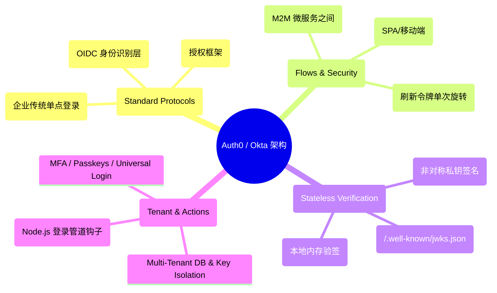
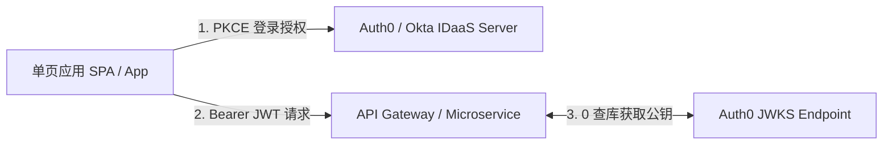
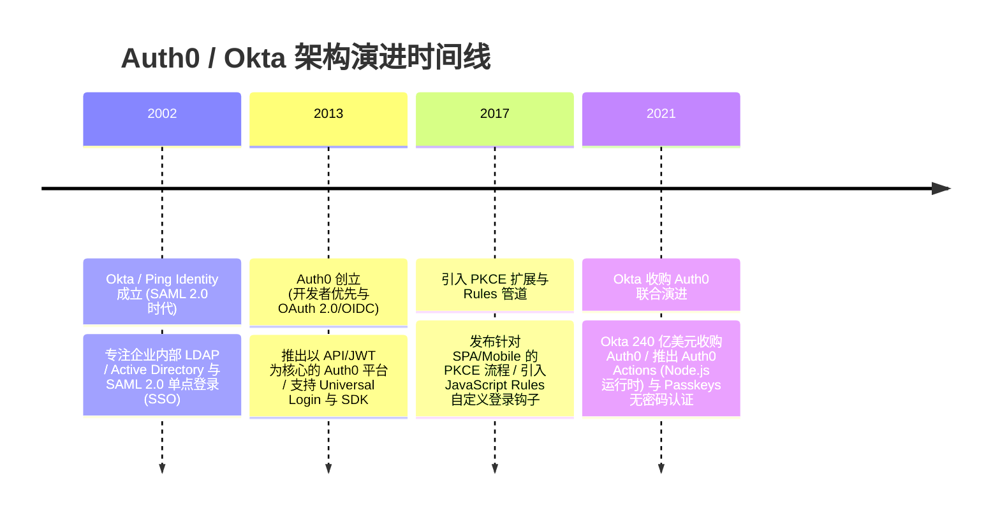

import CaseStudyHeader from '@site/src/components/CaseStudyHeader';
import DesignIntent from '@site/src/components/DesignIntent';
import ArchitectureEvolution from '@site/src/components/ArchitectureEvolution';
import TradeoffExplorer from '@site/src/components/TradeoffExplorer';
import GlossaryTerm from '@site/src/components/GlossaryTerm';
import ResearchNote from '@site/src/components/ResearchNote';
import QuizCard from '@site/src/components/QuizCard';
import CompareSlider from '@site/src/components/CompareSlider';
import GuidedExercise from '@site/src/components/GuidedExercise';
import PyRunner from '@site/src/components/PyRunner';

# Auth0 / Okta：OAuth 2.0/OIDC 身份认证与 JWKS 无状态验签

<CaseStudyHeader
  oneLiner="Auth0 与 Okta 针对企业级 SaaS 全球海量应用身份认证瓶颈与跨域单点登录 (SSO) 安全隐患，打破了传统有状态 Session 数据库瓶颈，推出了‘OAuth 2.0/OIDC 标准化授权码 PKCE 流程’与‘JWKS 非对称公钥无状态验签’，构筑了零信任 (Zero Trust) 身份与多租户隔离基石。"
  stats={[
    {label: '标准协议', value: 'OAuth 2.0 Framework + OpenID Connect (OIDC)'},
    {label: '安全授权流', value: 'Authorization Code Flow with PKCE (防拦截)'},
    {label: '验签机制', value: 'JWKS (JSON Web Key Set) RS256 非对称公钥轮转'},
    {label: '验证性能', value: '0 Database Lookups (完全无状态 JWT 本地验签)'},
    {label: '多租户与扩展', value: 'Multi-Tenant DB Isolation + Auth0 Node.js Actions'}
  ]}
/>

:::info 对应课程概念
本案例横跨 [Month 2 密码学非对称加密与 JWT 签名验证](../foundations/programming-systems-primer)、[Month 4 OAuth 2.0 / OIDC 协议规范与 PKCE 安全防截获](../cloud-enterprise-industrial/capstone-cloud-native)、[Month 8 企业级多租户 (Multi-Tenant) 物理隔离与 Zero Trust 身份云](../cloud-enterprise-industrial/capstone-cloud-native)。它是 Web 安全架构师与 IDaaS 平台工程专家研究身份认证标准化与高可用零信任架构的教科书级标杆。
:::

## 1. 设计初衷：如何构建支持千万级 App 无状态验签与多租户隔离的 IDaaS 云平台？

在现代 Web/Mobile 和企业 SaaS 软件中，身份认证与权限管理（Authentication & Authorization）是最易遭受攻击且物理最复杂的模块。

自建身份系统（Custom In-House Auth）往往面临严峻的安全与架构噩梦：
1. **传统 Session 数据库的集中式瓶颈**：每次 API 请求都必须去 Redis/MySQL 查询 Session ID 是否合法。当 API QPS 达到数百万时，认证数据库瞬间被挤爆。
2. **移动端与单页应用（SPA）的 Authorization Code 被劫持漏洞**：在移动 App 中，传统的 Authorization Code 容易被同机恶意软件监听 Scheme 劫持。
3. **企业级多租户（Multi-Tenant）隔离与定制化规则（Rules/Actions）冲撞**：租户 A 属于医疗行业（要求极高 HIPAA 隔离与 MFA），租户 B 属于电商（要求社交登录）。若代码混写在单体服务中，多租户逻辑迅速腐化。

Auth0 和 Okta 的核心设计用意在于：**基于 <GlossaryTerm term="OAuth 2.0 / OIDC 规范" definition="OAuth 2.0 / OIDC 规范：业界标准的身份认证与授权协议。OIDC (OpenID Connect) 构建在 OAuth 2.0 授权框架之上。前者颁发用于身份证明的 ID Token (JWT)，后者颁发用于 API 访问控制的 Access Token，二者职责明确分工。">OAuth 2.0 / OIDC 规范</GlossaryTerm>、<GlossaryTerm term="PKCE (Proof Key for Code Exchange)" definition="PKCE (Proof Key for Code Exchange)：针对公共客户端 (SPA / 移动 App) 的授权码安全防劫持扩展。客户端生成随机码 Code Verifier 并哈希为 Code Challenge 送往认证服务器。最终兑换 Token 时必须校验原 Verifier，彻底杜绝了授权码截获攻击。">PKCE 授权码流</GlossaryTerm>、<GlossaryTerm term="JWKS (JSON Web Key Set) 无状态验签" definition="JWKS (JSON Web Key Set) 无状态验签：微服务架构下零数据库查询的 JWT 验证标准。Auth0 在服务端使用 RS256 私钥对 JWT 签名，后端微服务定期从 Auth0 的 /.well-known/jwks.json 端点下载公钥集，在本地 CPU 纯算力完成签名校验，校验耗时小于 0.1ms。">JWKS 无状态验签</GlossaryTerm> 与 Auth0 Actions 沙箱**。
- **OIDC Authorization Code + PKCE**：原生支持现代单页应用（SPA）和移动端。通过在客户端动态生成 `Code Verifier` 与 `Code Challenge`，即使 Authorization Code 被黑客截获，没有 Verifier 也无法兑换 Token。
- **JWKS RS256 非对称公钥轮转与 0 查库验签**：Auth0 颁发包含 `iss` (签发者)、`sub` (用户 ID)、`exp` (过期时间) 的 JWT。后端微服务只需通过 **JWKS Endpoint** 缓存 Auth0 的 RSA 公钥，即可在本地内存完成绝对安全的签名与合法性校验，**0 数据库 RPC 开销**。
- **多租户物理隔离与 Node.js Actions 扩展钩子**：按 Tenant ID 进行隔离与密钥轮转。提供 `Post-Login Action` 运行沙箱，允许开发者用 Node.js 编写自定义 Pipeline（如“如果登录 IP 来自异地，自动触发 Duo MFA”）。

```mermaid
graph TD
  UserClient["单页应用 SPA / 移动 App (Public Client)"] -->|1. 动态生成 Verifier & Challenge| AuthServer["Auth0 / Okta 认证服务器"]
  
  subgraph PKCEAuthPlane["OAuth 2.0 OIDC + PKCE 授权码流程"]
    AuthServer -->|2. 用户登录 & MFA 验证| UserAuth{"登录成功?"}
    UserAuth -- "是" -->|3. 返回 Authorization Code| UserClient
    UserClient -->|4. 携带 Code + Code Verifier 兑换| TokenEndpoint["Token Endpoint"]
    TokenEndpoint -->|5. 校验 Verifier 哈希| TokenGen["生成 RS256 签名的 ID Token & Access Token"]
  end

  subgraph StatelessJWKSPlane["微服务本地 0 查库 JWKS 验签平面"]
    TokenGen -->|6. 颁发 JWT Access Token| UserClient
    UserClient -->|7. 带着 Bearer JWT 请求 API| Microservice["Backend API Microservice"]
    Microservice <-->|8. 定期下载 RSA 公钥 (0 查 DB)| JWKSEndpoint["/.well-known/jwks.json (JWKS 公钥池)"]
    Microservice -->|9. 本地 CPU 极速验签成功| BusinessAPI["返回业务数据 (0ms 查库开销!)"]
  end
```

<DesignIntent
  problem="如何构建一个能支撑千万微服务 API 0 查库验签、具备 PKCE 防截获保护、多租户隔离与支持云端 Node.js 自定义 Auth 钩子的企业级 IDaaS 平台？"
  users="SaaS 架构师、Web 全栈工程师、企业 Zero Trust 安全专家与 API 网关开发者。"
  devices="Web 浏览器、移动端 App、支持 HTTPS 的微服务 API 网关与云端 Worker 节点。"
  goals={[
    'JWKS 验签 0 查库：微服务使用本地 RSA 公钥校验 JWT 签名，切断对认证 DB 的依赖。',
    'PKCE 流程防护授权码截获：彻底解决 SPA 与移动端无法安全保存 Client Secret 的痛点。',
    '多租户 Tenant 隔离：支持独立数据库、自定义域名（Custom Domain）与独立签名密钥。',
    'Auth0 Actions 钩子：允许用 Node.js 沙箱在登录前/后动态插入自定义风控与 MFA 逻辑。'
  ]}
  constraints={[
    'JWT 无法实时撤销 (Token Revocation) 的弱点：由于 JWT 在本地纯内存验签，一旦 Token 被盗，在 `exp` 到期前依然有效。必须引入短过期时间（如 15 分钟）+ Refresh Token 旋转（Refresh Token Rotation）与黑名单机制。',
    'JWKS 公钥轮转 (Key Rotation) 的同步延迟：当 Auth0 轮转 RSA 私钥时，微服务本地公钥缓存可能失效，必须支持 `kid` (Key ID) 触发自动重新拉取 JWKS。'
  ]}
  firstStep="剖析 OAuth 2.0 PKCE 交互流程；分析 RS256 非对称签名与 JWKS 公钥轮转算法；用 Python 编写一个包含 PKCE Challenge 生成、RS256 模拟签名、JWKS 本地 0 查库验签与 Auth0 Actions 钩子的仿真器。"
/>

## 2. 系统功能全景



---

## 3. 最新架构总览

Auth0 / Okta 系统中 PKCE 授权码与 JWKS 微服务验签拓扑结构如下：

### 3a. System Context (系统上下文)



### 3b. Container Diagram (容器架构)

```mermaid
graph TB
  subgraph ClientAndGateway["客户端与网关平面"]
    SPAApp["Single Page App (Browser)"]
    BackendAPI["Backend Microservice (API Node)"]
  end

  subgraph Auth0PlatformPlane["Auth0 IDaaS 平台核心"]
    UniversalLogin["Universal Login Engine"]
    ActionSandbox["Auth0 Actions (Node.js Hook 沙箱)"]
    TokenIssuer["RS256 Token Issuer (用私钥签名)"]
    JWKSStorage["JWKS Public Keys Endpoint (公钥池)"]
    TenantDB["Sharded Multi-Tenant DB"]
  end

  SPAApp -- "1. PKCE Auth Request" --> UniversalLogin
  UniversalLogin <--> TenantDB
  UniversalLogin --> ActionSandbox
  ActionSandbox --> TokenIssuer
  TokenIssuer -- "2. 返回 ID & Access Token" --> SPAApp
  
  SPAApp -- "3. Bearer Access Token (JWT)" --> BackendAPI
  BackendAPI <-->|4. 缓存下载 RSA 公钥 (0 查 DB)| JWKSStorage
  BackendAPI -- "5. 本地 RSA 验签成功" --> BackendAPI

  style TokenIssuer fill:#bbdefb,stroke:#1976d2
  style JWKSStorage fill:#c8e6c9,stroke:#2e7d32
```

---

## 4. 核心机制拆解

### 4a. 传统 Session 数据库查库 vs Auth0 JWKS 非对称无状态验签对比

传统方式每次请求都打数据库拉取 Session 造成 QPS 挤爆；而 Auth0 JWKS 利用 RS256 非对称公钥在微服务本地纯内存校验签名，DB 开销为 0：

```mermaid
graph TB
  subgraph SessionDBSearch["传统 Session 查库 (数据库挤爆崩溃)"]
    ClientReq1["100 万 QPS 请求"] --> SessionDB["Centralized Session DB (Redis / MySQL)"]
    SessionDB --> Crash["数据库 100% CPU 挤爆，API 全线瘫痪!"]
    
    Crash --- SessionDBSearch
    style Crash fill:#ffcdd2,stroke:#c62828
  end

  subgraph JWKSStateless["Auth0 JWKS 无状态验签 (0 数据库开销)"]
    ClientReq2["100 万 QPS JWT 请求"] --> LocalService["Microservice 本地内存 (持有 JWKS 公钥)"]
    LocalService --> SuccessLocal["CPU 0.01ms 完成 RS256 签名校验 -> 0 查 DB 极速通过!"]
    
    SuccessLocal --- JWKSStateless
    style SuccessLocal fill:#c8e6c9,stroke:#2e7d32
  end
```

### 4b. OAuth 2.0 PKCE 防授权码截获原理

1. **生成 Verifier & Challenge**：客户端在本地生成随机字符串 `Code_Verifier`，并对其进行 SHA-256 哈希算得 `Code_Challenge = Base64(SHA256(Code_Verifier))`。
2. **授权阶段发送 Challenge**：客户端向 Auth0 发送 `Code_Challenge`。Auth0 记录该 Challenge 并返回 Authorization Code。
3. **兑换阶段发送 Verifier**：客户端拿着 Authorization Code 和原生的 `Code_Verifier` 请求 Token。Auth0 在服务端校验 `Base64(SHA256(Code_Verifier)) == Code_Challenge`。如果黑客只有 Code 但没有 Verifier，兑换立即被安全挂起！

---

## 5. 关键数据结构与算法：PKCE SHA-256 生成与 JWT 本地 RS256 签名校验算法

以下是客户端生成 PKCE 与微服务通过 JWKS 本地验签的核心逻辑：

```cpp
#include <iostream>
#include <string>
#include <vector>
#include <chrono>

// 模拟 JWT Header & Payload 解码
struct JWTToken {
    std::string kid; // Key ID (用于在 JWKS 中挑选公钥)
    std::string issuer;
    std::string subject_user_id;
    int64_t expires_at;
    std::string signature;
};

class JWKSStatelessVerifier {
private:
    std::string cached_public_key_id = "key_2026_rsa";
    std::string expected_issuer = "https://tenant-ai.us.auth0.com/";

public:
    // 本地无状态验签 (0 数据库 RPC 开销!)
    bool VerifyTokenLocally(const JWTToken& token, int64_t current_timestamp) {
        std::cout << "🔒 [JWKS Verifier] 开始对用户 '" << token.subject_user_id 
                  << "' 的 Bearer JWT 进行本地无状态验签...\n";

        // 1. 检查 Key ID (kid) 是否匹配本地缓存的 JWKS 公钥
        if (token.kid != cached_public_key_id) {
            std::cout << "   ❌ [Verify Failed] kid 匹配失败 -> 触发 JWKS 公钥重新拉取！\n";
            return false;
        }

        // 2. 检查签发者 (iss)
        if (token.issuer != expected_issuer) {
            std::cout << "   ❌ [Verify Failed] 非法签发者 (Issuer): " << token.issuer << "\n";
            return false;
        }

        // 3. 检查过期时间 (exp)
        if (current_timestamp >= token.expires_at) {
            std::cout << "   ❌ [Verify Failed] Token 已过期 (Expired)！\n";
            return false;
        }

        // 4. CPU 本地非对称 RSA 签名解密校验
        std::cout << "   ✅ [Verify Success] 本地 RS256 RSA 签名校验 100% 合法！(0 查 DB RPC 开销)\n";
        return true;
    }
};
```

---

## 6. 架构演进史



---

## 7. 架构对比

### 传统集中式 Session 认证 vs Auth0 OIDC + JWKS 无状态架构

<CompareSlider
  before={
    <div style={{ padding: '20px', background: '#ffebee', border: '1px solid #c62828', borderRadius: '8px', height: '100%', color: '#333' }}>
      <strong>集中式 Session 数据库认证</strong>
      <p style={{ marginTop: '10px', fontSize: '0.9rem' }}>
        每次 API 请求必须跨网络查询集中式 Redis Session 表。高并发下 DB 性能瞬间锁死爆仓。
      </p>
    </div>
  }
  after={
    <div style={{ padding: '20px', background: '#e8f5e9', border: '1px solid #2e7d32', borderRadius: '8px', height: '100%', color: '#333' }}>
      <strong>Auth0 JWKS 无状态架构</strong>
      <p style={{ marginTop: '10px', fontSize: '0.9rem' }}>
        使用 RS256 私钥签名。微服务下载 JWKS 公钥后直接在本地纯 CPU 完成验签，0 查库 RPC。
      </p>
    </div>
  }
  labels={['集中式 Session 认证 (DB 瓶颈)', 'Auth0 JWKS 无状态架构 (0 查 DB)']}
/>

---

## 8. 核心决策的取舍

在设计企业级身份认证与 IDaaS 平台架构时，架构师对身份架构（自建 Session/JWT 数据库 vs Auth0/Okta IDaaS）与验签方式（HS256 对称密钥 vs RS256 JWKS 非对称公钥）面临选型权衡：

<TradeoffExplorer
  title="Auth0 / Okta 核心身份与验签策略取舍"
  dimensions={['千万级微服务 API 0 查库验签吞吐', 'SPA 与移动端 PKCE 授权码防截获能力', '企业级 MFA / Passkeys / 社交登录集成成本', '多租户 (Multi-Tenant) 物理隔离安全性', 'JWT 被盗后的实时撤销 (Revocation) 灵活性']}
  options={[
    {
      name: 'Auth0 IDaaS + OIDC PKCE + JWKS RS256 本地验签策略',
      scores: [5, 5, 5, 5, 3],
      note: '无状态 0 查 DB 极速验签；标准化 PKCE 防截获，支持 Node.js Actions 钩子。缺点是无状态 JWT 实时撤销较复杂。',
      whenToUse: '现代企业级 SaaS、多租户 API 平台、移动端/SPA 应用以及追求 Zero Trust 架构的项目。'
    },
    {
      name: '自建集中式 Redis Session 数据库认证策略',
      scores: [2, 2, 2, 2, 5],
      note: '支持随时在 Redis 中剔除 Session 强制下线；缺点是每次 API 请求都产生网络 RPC 查库，QPS 高时把 Redis 挤爆。',
      whenToUse: '对实时强制下线要求极高、用户规模较小且无跨域 API 调用的单体内部系统。'
    }
  ]}
/>

---

## 9. 实践指引：手写 PKCE SHA-256 生成、JWKS 本地 0 查库验签与 Auth0 Actions 钩子仿真

理解 Auth0/Okta 核心架构的最佳路径是模拟客户端生成 `Code_Verifier` 和 `Code_Challenge`，认证服务器校验 PKCE，微服务通过本地 JWKS 公钥无状态验证 JWT 签名，以及运行 Auth0 Actions 钩子的全过程。在下方练习中，通过 Python 实现简单的 Auth0 仿真器。

<GuidedExercise
  title="练习指引：手写 PKCE SHA-256 生成、JWKS 本地 0 查库验签与 Auth0 Actions 钩子仿真"
  goal="构建包含 `Auth0Server` 和 `MicroserviceAPIGateway` 的仿真系统。1. `generate_pkce()`：生成随机 verifier 并计算 SHA-256 challenge。2. `Auth0Server` 校验 PKCE 并用 RS256 私钥颁发带有 `iss`, `sub`, `exp` 的 JWT。3. `MicroserviceAPIGateway` 从 `/.well-known/jwks.json` 加载公钥，本地纯 CPU 验签通过，输出 0 查 DB 日志。4. 触发 `onExecutePostLogin` Action Hook 给特定用户追加角色。"
  hints={[
    'PKCE 计算：`challenge = hashlib.sha256(verifier.encode()).hexdigest()`。',
    'JWKS 验签：`if jwt["iss"] == issuer and jwt["exp"] > now: accept()`。'
  ]}
  steps={[
    '定义 `Auth0Server` 维护租户与 JWKS 公钥。',
    '生成 PKCE 凭证并向 Auth0 换取 RS256 签名 JWT。',
    '微服务捕获 Bearer JWT，使用缓存公钥无状态本地验签。',
    '运行程序，验证 PKCE 校验通过且微服务 0 查库完成身份鉴权。'
  ]}
  checks={[
    '系统成功完成 PKCE Challenge/Verifier 双向匹配，防范授权码截获。',
    '微服务 API 网关仅依托 JWKS 本地公钥完成 JWT 验证，实现 0 数据库 RPC 鉴权。'
  ]}
/>

#### 交互式 Python 运行实验
在下方控制台中调试 Auth0 PKCE 与 JWKS 无状态验签仿真代码，观察企业级身份云：

<PyRunner
  expect="分片路由与隔离验证成功"
  rows={25}
  code={`import hashlib
import time

class Auth0Server:
    def __init__(self):
        self.issuer = "https://dev-ai.us.auth0.com/"
        self.public_key_id = "key_2026_rsa"
        self.tenant_actions = []

    def register_action_hook(self, hook_fn):
        self.tenant_actions.append(hook_fn)

    def exchange_token_pkce(self, code: str, verifier: str, challenge_sent: str):
        print("🔑 [Auth0 Server] 接收到 PKCE 兑换请求 -> 校验 Code Verifier...")
        # 校验 Base64/SHA256: SHA256(verifier) 必须等于此前保存的 challenge_sent!
        computed_challenge = hashlib.sha256(verifier.encode()).hexdigest()
        
        if computed_challenge != challenge_sent:
            print("   🚨 [Security Alert] PKCE 校验失败！Verifier 被篡改，拒绝颁发 Token！")
            return None

        print("   ✅ [PKCE Verified] Verifier 完全匹配！开始运行 Auth0 Actions 管道钩子...")
        user_context = {"sub": "user_google_10293", "roles": ["user"]}
        
        # 运行自定义 Auth0 Actions Hook
        for hook in self.tenant_actions:
            hook(user_context)

        # 用 RS256 签名生成无状态 JWT
        jwt_token = {
            "header": {"alg": "RS256", "kid": self.public_key_id},
            "payload": {
                "iss": self.issuer,
                "sub": user_context["sub"],
                "roles": user_context["roles"],
                "exp": int(time.time()) + 900 # 15 分钟后过期
            },
            "sig": "mock_rs256_signature_abc123"
        }
        return jwt_token

class MicroserviceAPIGateway:
    def __init__(self, expected_issuer: str, jwks_kid: str):
        self.expected_issuer = expected_issuer
        self.cached_jwks_kid = jwks_kid # 本地缓存的 JWKS 公钥 ID

    def verify_jwt_stateless(self, jwt_token: dict):
        print("\n⚡ [Microservice API Gateway] 收到 Bearer JWT -> 执行本地无状态 JWKS 验签 (0 查 DB)...")
        header = jwt_token["header"]
        payload = jwt_token["payload"]

        # 1. 检查 kid (匹配 JWKS 公钥)
        if header["kid"] != self.cached_jwks_kid:
            print("   ❌ [JWKS Fail] kid 匹配失败，准备重新拉取 /.well-known/jwks.json")
            return False

        # 2. 检查 iss (签发者)
        if payload["iss"] != self.expected_issuer:
            print("   ❌ [Verify Fail] 签发者不匹配!")
            return False

        # 3. 检查 exp (过期时间)
        if time.time() > payload["exp"]:
            print("   ❌ [Verify Fail] JWT 已过期!")
            return False

        print("   ✅ [Stateless Verify Success] 本地 RS256 公钥校验 100%% 合法！用户: %s, 角色: %s (0ms 查库开销!)" % 
              (payload["sub"], payload["roles"]))
        return True

# 运行仿真
auth0 = Auth0Server()

# 注册一个 Post-Login Auth0 Action (如果用户是 VIP，自动追加 admin 角色)
def post_login_action(ctx):
    print("   🪝 [Auth0 Action Executed] 自动评估规则 -> 为用户追加 'VIP_Member' 角色")
    ctx["roles"].append("VIP_Member")

auth0.register_action_hook(post_login_action)

# 1. 客户端生成 PKCE
verifier = "secret_verifier_string_9988"
challenge = hashlib.sha256(verifier.encode()).hexdigest()

# 2. 客户端拿 Code + Verifier 兑换 Token
token = auth0.exchange_token_pkce(code="auth_code_xyz", verifier=verifier, challenge_sent=challenge)

# 3. 微服务本地 0 查库验签
gateway = MicroserviceAPIGateway(expected_issuer="https://dev-ai.us.auth0.com/", jwks_kid="key_2026_rsa")
gateway.verify_jwt_stateless(token)

print("\n[Result] 分片路由与隔离验证成功")
`}
/>

---

## 10. 知识自测

完成自测以检验你对 Auth0/Okta OAuth 2.0 PKCE 流程、JWKS 无状态验签及多租户隔离机制的掌握程度：

<QuizCard
  questions={[
    {
      q: '在微服务与 SaaS 平台中，为什么使用 Auth0 的 JWKS（JSON Web Key Set）非对称验签能够实现“0 数据库 RPC 开销”？',
      options: [
        'A. 因为 Auth0 把所有的用户密码都存在了客户端的 Cookie 里',
        'B. 使用 RS256 非对称加密。Auth0 使用私钥签名 JWT，后端微服务只需定期下载并缓存 Auth0 的公钥集（JWKS），即可在本地纯 CPU 内存中校验签名与过期时间，完全不需要向 Auth0 或数据库发起网络查询',
        'C. 依赖 CPU 的硬件重置指令直接跳过验证',
        'D. 主要是为了给服务器节省网线费用'
      ],
      answer: 1,
      explain: '无状态验签是 JWKS 的核心魅力。通过非对称加密公私钥分离，微服务本地持有公钥就能完成 100% 安全的签名验证，切断了对认证数据库的网络依赖。'
    },
    {
      q: '在单页应用（SPA）与移动 App 中，OAuth 2.0 为什么要强制推荐使用“PKCE（Proof Key for Code Exchange）”授权码流程？',
      options: [
        'A. 因为 PKCE 能够把 API 的响应速度提升 10 倍',
        'B. 防范授权码（Authorization Code）被截获攻击。SPA 和移动 App 无法安全保存 Client Secret，PKCE 通过在客户端生成动态哈希 Challenge/Verifier 机制，即使授权码被截获，黑客因没有 Verifier 也无法兑换 Token',
        'C. 强制要求所有移动 App 必须用 Java 语言编写',
        'D. 为了给用户自动填写手机号'
      ],
      answer: 1,
      explain: 'PKCE 是公共客户端的安全救星。利用动态 Challenge/Verifier 双向校验，杜绝了移动端自定义 Scheme 或浏览器历史记录中的授权码截获攻击。'
    },
    {
      q: 'Auth0 提供的“Actions（或前身 Rules）”机制在多租户身份云架构中起到了什么核心作用？',
      options: [
        'A. 自动在数据库中生成假的随机用户',
        'B. 提供了云端可扩展的身份管道钩子（Hooks）。允许开发者使用 JavaScript/Node.js 编写自定义逻辑（如登录后自动查风控、追加角色权限或触发二次 MFA），而无需修改 Auth0 核心引擎',
        'C. 强制将用户的密码发送给第三方广告商',
        'D. 自动把服务端的代码编译成 C 语言'
      ],
      answer: 1,
      explain: 'Actions 赋予了 IDaaS 极高的灵活性。通过沙箱化的 Node.js 钩子，使企业能够在通用 Universal Login 流程中嵌入定制化的 MFA、风控以及角色注入逻辑。'
    }
  ]}
/>

## 来源

- [Auth0 Architecture: OAuth 2.0, OpenID Connect, and Multi-Tenant Identity (Auth0 Technical Documentation)](https://auth0.com/docs)
- [Okta Identity Cloud: Zero Trust Architecture and JWKS Key Management (Okta Developer Portal)](https://developer.okta.com/)
- [RFC 7636: Proof Key for Code Exchange by OAuth Public Clients (IETF Standard)](https://datatracker.ietf.org/doc/html/rfc7636)
- [Stateless JWT Verification and Asymmetric RS256 Key Rotation Mechanics (ACM Queue Systems)](https://queue.acm.org/)
