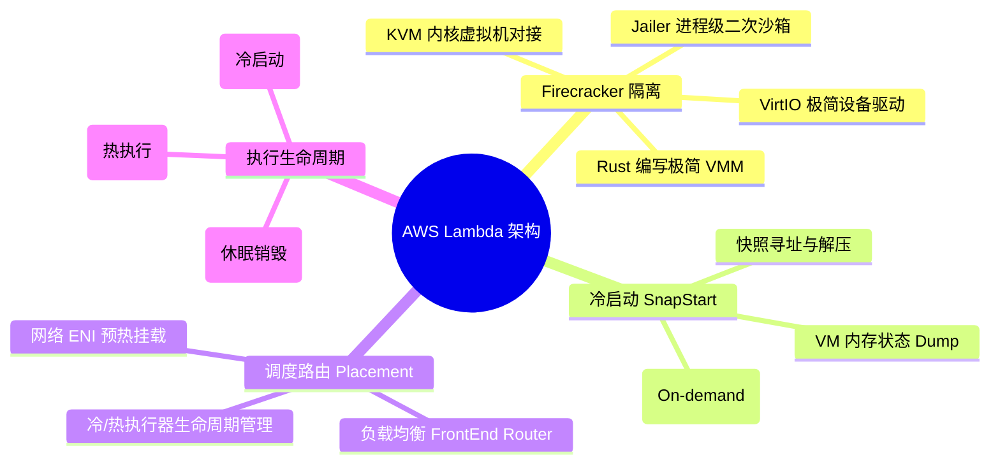
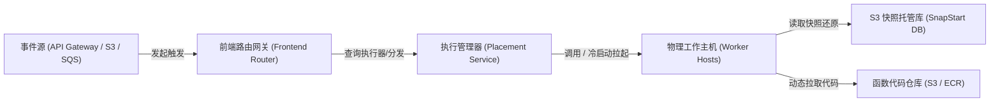
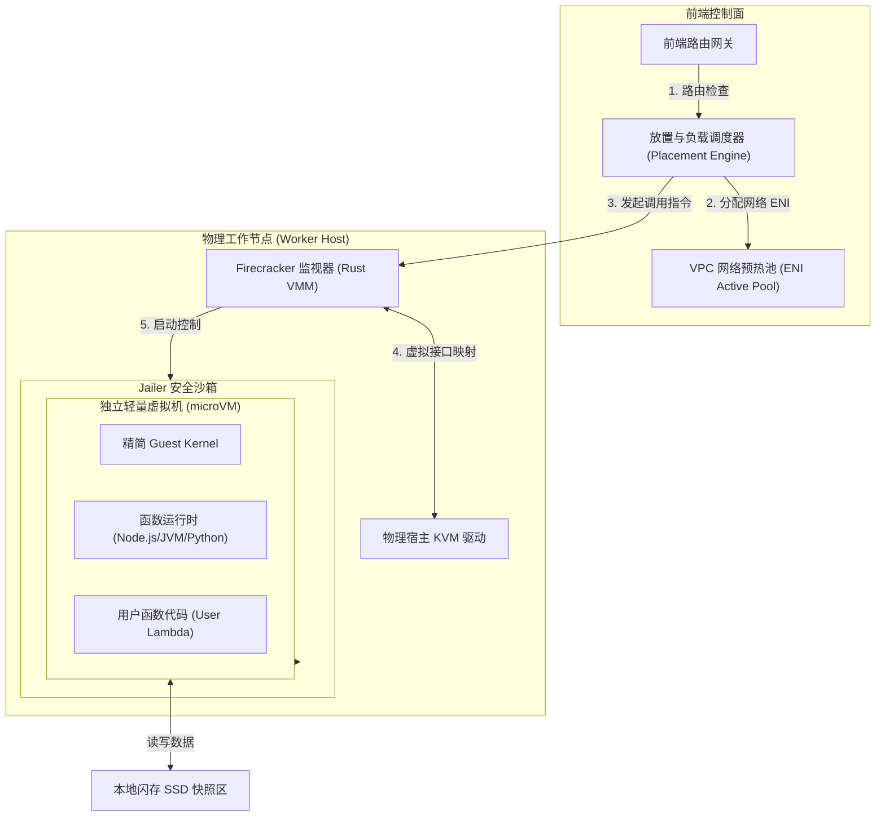
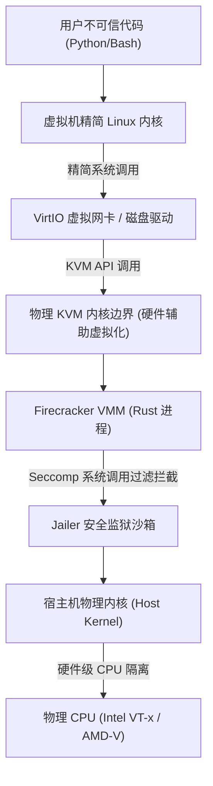
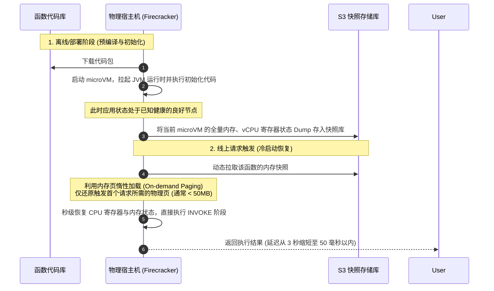
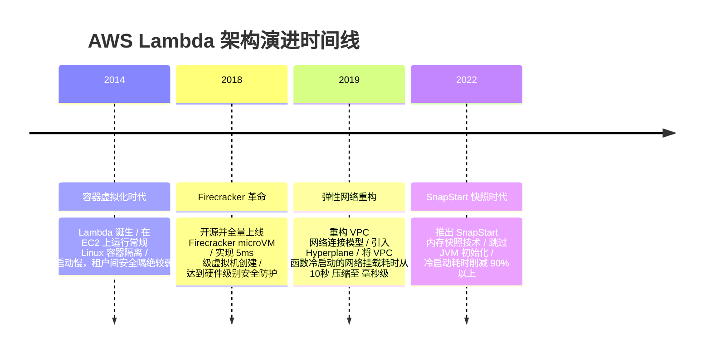

import CaseStudyHeader from '@site/src/components/CaseStudyHeader';
import DesignIntent from '@site/src/components/DesignIntent';
import ArchitectureEvolution from '@site/src/components/ArchitectureEvolution';
import TradeoffExplorer from '@site/src/components/TradeoffExplorer';
import GlossaryTerm from '@site/src/components/GlossaryTerm';
import ResearchNote from '@site/src/components/ResearchNote';
import QuizCard from '@site/src/components/QuizCard';
import CompareSlider from '@site/src/components/CompareSlider';
import GuidedExercise from '@site/src/components/GuidedExercise';

# AWS Lambda：基于 Firecracker 的 Serverless 架构与冷启动优化

<CaseStudyHeader
  oneLiner="AWS Lambda 摒弃了传统的常驻服务器虚拟机模式，通过在 Linux KVM 上运行极轻量级 Rust 虚拟机（Firecracker microVM）实现强物理隔离，并依托 SnapStart 内存镜像快照，将 Serverless 冷启动耗时从秒级压缩至数十毫秒。"
  stats={[
    {label: '发布时间', value: '2014 年'},
    {label: '虚拟化底座', value: 'Firecracker microVM (Rust / KVM)'},
    {label: '冷启动耗时', value: '< 100ms (基于 SnapStart 还原)'},
    {label: '计费精度', value: '1 毫秒级粒度 (微秒级底层采集)'},
    {label: '虚拟机启动延迟', value: '< 5ms (单机密度高达数千虚拟机)'}
  ]}
/>

:::info 对应课程概念
本案例横跨 [Month 11 生产级 AI 平台与数据治理](../foundations/programming-systems-primer)、[Month 5 核心组件设计](../core-components/api-gateway)、[Month 4 系统失败与排队](../foundations/error-handling)。它完美阐释了如何利用硬件辅助虚拟化（KVM）在网络和多租户边界构建极端稳固的安全边界，以及如何通过状态快照优化高尾延迟。
:::

## 1. 设计初衷：从“为常驻算力付费”到“为执行毫秒付费”

在云原生早期，开发者需要购买 EC2 虚拟机或配置容器集群，并为“空闲时间”支付昂贵的租金。如果流量突增，系统需要几十秒甚至数分钟来初始化新的虚拟机实例。

AWS Lambda 的设计初衷是**让计算彻底变成事件驱动（Event-Driven）的 Serverless 服务**。用户只需提交一段代码（函数），系统在请求进来时瞬间拉起容器运行，执行完立刻销毁，用户只为“函数实际运行的毫秒数”买单。为此，架构师必须开发出一种能在毫秒级启动、单机可高密度运行数万个、且安全防穿透级别达到传统硬件虚拟机的全新隔离底座。

<DesignIntent
  problem="在极高并发、多租户（Multi-Tenant）共享物理机的环境下，实现毫秒级的函数拉起与安全的硬件级隔离，提供完全『缩容至零（Scale to Zero）』的事件驱动算力。"
  users="全球开发者、企业架构师，希望免去服务器运维工作（NoOps），构建高弹性、随付随用的微服务与数据处理管道。"
  devices="运行于公有云物理服务器集群（基于定制 Bare Metal 主机），面向高并发的 HTTP 请求、队列消息、定时事件触发。"
  goals={[
    '极致强物理隔离：不同租户的代码绝不能在操作系统级共享内核，必须防止任何容器穿透（Container Escape）攻击。',
    '微秒级虚拟化启动：抛弃传统 QEMU 复杂的设备模拟，编写极简的虚拟化监视器，使虚拟机创建耗时低于 5ms。',
    '瞬间消除冷启动：引入内存快照还原技术，跳过 JVM 或运行时框架漫长的加载、JIT 编译和初始化过程。',
    '百毫秒级网络挂载：在容器启动的瞬间完成 VPC 网络接口（ENI）的热插拔，消除长达数秒的网络路由建立开销。'
  ]}
  constraints={[
    '内核共享的安全风险：传统的 Linux Namespaces/Cgroups（Docker）安全边界偏软，恶意代码可能通过系统调用（syscall）直接穿透到物理机宿主内核。',
    '传统 VM 的沉重开销：每个虚拟机如果占用几百 MB 内存，且启动需要十几秒，将完全无法满足高密度的并发按需调用。',
    '网络尾延迟高：首次冷启动时建立私有网络 ENI 连接会导致请求积压，引发系统排队过载。'
  ]}
  firstStep="基于 Rust 语言重新实现一个极简的 VMM（虚拟机监视器），抛弃不必要的硬件设备模拟，仅保留网卡和磁盘块设备，诞生 Firecracker；构建前端 Load Balancer 队列与云端 SnapStart 镜像库。"
/>

## 2. 系统功能全景

以下是 AWS Lambda 的底层虚拟化隔离与冷启动优化的功能全景图：

---

## 3. 架构总览

AWS Lambda 的核心运行时包含前端路由层、执行管理器与运行着 Firecracker 独立虚拟机的物理宿主机平面：

### 3a. 系统上下文图 (System Context)

### 3b. 容器架构图 (Container)

---

## 4. 核心机制拆解

### 4a. Firecracker 极轻量级虚拟化隔离

传统多租户共享宿主机通常面临两难取舍：
- Docker 容器：快、省资源，但共享 OS 内核，一旦有内核漏洞（如 Dirty COW），租户间能互相穿透入侵。
- 传统虚拟机（QEMU/KVM）：绝对安全（硬件隔离，独立内核），但太重（启动几秒，单机最多跑几十个）。

AWS 团队开发的 <GlossaryTerm term="Firecracker" definition="AWS 开源的、专为无服务器 Serverless 设计的轻量级虚拟机监视器（VMM）。它用 Rust 语言编写，运行在 Linux KVM 之上，舍弃了传统虚拟机中繁重的旧硬件设备模拟，仅保留极简的 VirtIO 网络与磁盘驱动，使得虚拟机能在 5 毫秒内创建并启动。">Firecracker</GlossaryTerm> 打破了这一僵局。它是一个用 Rust 编写的极简 VMM。它不模拟复杂的 PCI 总线、IDE 控制器或音视频卡，只模拟基本的时钟、网卡（VirtIO-Net）和块设备（VirtIO-Block）。

配合 `Jailer` 二次沙箱限制（限制 chroot、cgroups、seccomp 系统调用过滤），每个 Firecracker 虚拟机仅消耗大约 5MB 的额外内存，单台 Bare Metal 主机可以高密度并发运行上万个微虚拟机（microVM）。

### 4b. SnapStart 内存与 CPU 状态恢复 (冷启动加速)

在 Serverless 应用中，**冷启动（Cold Start）**是系统设计的最大痛点（由于代码下载、虚拟机初始化、JVM 启动和类加载，首期请求经常延迟达数秒）。

AWS Lambda 引入了 **SnapStart 状态还原技术**。其核心原理是把冷启动过程进行“离线预热”，并在内存中保存状态快照：

### 4c. VPC 弹性网络接口（ENI）预热池

在 Lambda 早期，若要让函数安全访问用户的私有云 VPC 资源，Lambda 必须在启动微虚拟机时，在宿主机上动态创建并关联一个 **ENI（弹性网络接口）**，这会带来严重的冷启动瓶颈（网络路由表建立需要 2 至 10 秒）。

为了优化该尾延迟，Lambda 重构了网络模型：
- **网络接口池化（Warm ENI Pool）**：网关在物理工作机启动之初就预先创建好大量的 ENI 接口，使之处于 Warm（激活）状态。
- **虚拟通道共享（VPC Hyperplane）**：引入网络中介层 Hyperplane。当微虚拟机启动时，它不再物理去连接新 ENI，而是将流量通过宿主机上已有的、共享的虚拟通道路由到 Hyperplane，实现毫秒级网络就绪。

---

## 5. 架构演进史

AWS Lambda 从一个简单的容器虚拟化，演进到今天高强度的微虚拟机物理化底座：

---

## 6. 架构对比

### 经典 Docker 操作系统级隔离 vs Firecracker 硬件辅助虚拟化隔离

<CompareSlider
  before={
    

      <strong>传统 Docker 共享内核隔离</strong>
      

        容器间通过 Namespace 隔离视图，通过 Cgroups 限制资源，但它们物理上直接共享宿主机操作系统的内核。一旦有恶意租户写出利用内核漏洞（如Dirty COW）的代码，能轻易刺穿隔离边界，读取物理机上相邻容器的敏感数据。
      

    

  }
  after={
    

      <strong>Firecracker 硬件辅助虚拟化隔离</strong>
      

        每个函数运行在独立的轻量级虚拟机内，拥有完全独立的操作系统 Guest 内核。利用 CPU 硬件指令集（VT-x）构建绝对安全的物理防线，即使某虚拟机内的 Guest 内核被彻底攻破，也无法触及外部宿主物理机。
      

    

  }
  labels={['Docker 共享内核', 'Firecracker 硬件隔离']}
/>

---

## 7. 核心决策的取舍

无服务器 Serverless 执行器的安全级别、启动开销与运行开销永远存在取舍：

<TradeoffExplorer
  title="Serverless 隔离技术栈取舍"
  dimensions={['绝对物理安全 (防穿透)', '冷启动首字时间', '单机虚拟机密度与内存开销', '语言与系统调用完备度', '网络与I/O吞吐性能']}
  options={[
    {
      name: 'Firecracker microVM (Lambda 的实际选择)',
      scores: [5, 4, 3, 5, 4],
      note: '具备 KVM 级物理硬件防线，支持运行任意 Linux 编译代码和系统调用。但每个实例需要消耗独立的内核内存开销（约 5MB）。',
      whenToUse: '高安全性、多租户多语言、需要强力防止代码恶意穿透的公有云 Serverless 产品。'
    },
    {
      name: 'WebAssembly (WASM) Isolate 隔离 (Cloudflare Workers 选择)',
      scores: [4, 5, 5, 1, 5],
      note: '冷启动时间可压缩至微秒级（0ms），单机可跑数十万个隔离区，极其节省资源。但只支持 WASM 兼容语言，无法执行系统命令、不支持常规 Linux 二进制文件。',
      whenToUse: '边缘计算（Edge Computing）、超高频、轻量级前端或纯计算逻辑处理。'
    },
    {
      name: '传统 EC2 全量虚拟机隔离',
      scores: [5, 1, 1, 5, 5],
      note: '安全与隔离度完美。但启动需要十几秒到数分钟，内存起步几百 MB，完全无法做到 Scale to Zero（缩容至零）与秒级付费。',
      whenToUse: '传统重度单体系统、持久性常驻 API 服务、无需按需自动伸缩的大型计算节点。'
    }
  ]}
/>

---

## 8. 实践指引：用 Python 编写一个微型的函数执行超时与内存监控器

在 Serverless 架构设计中，网关必须具备在函数执行超时、内存超限时强制熔断并释放微虚拟机的能力。

在 `labs/month11/serverless_runner/` 目录下（或在下方练习中），实现一个可以安全限制函数资源与执行时间的监视器。

<GuidedExercise
  title="练习指引：写一个 Serverless 函数执行沙箱监控器"
  goal="用 Python 编写一个包装类，它能接受一段不可信函数并执行，当函数运行超过指定时间（例如 50ms）或物理内存占用超过限制时，自动终止函数执行并抛出超时/内存溢出异常。"
  hints={[
    '你可以利用 Python 的 `resource` 模块限制子进程或当前线程的最大内存使用量 (RLIMIT_AS)。',
    '可以使用信号机制 `signal.alarm` 来限制执行的墙上时间 (Wall Time)。',
    '注意处理线程安全的互斥锁，确保在发生超时异常后，能将已开辟的资源安全回笼。'
  ]}
  steps={[
    '创建 `ServerlessSandbox` 监控类。',
    '实现 `run_function(func, timeout_seconds, memory_limit_mb)` 方法。',
    '使用 `signal` 模块注册超时回调。在回调中，抛出自定义的 `LambdaTimeoutException`。',
    '使用 `resource.setrlimit` 设定子进程的最大虚拟内存。',
    '编写单元测试，模拟一个死循环函数和内存无限分配函数，验证监控器是否能在 50ms 内精准强杀该函数，并不影响主线程的持续工作。'
  ]}
  checks={[
    '面对 `while True:` 恶意死循环，监控器能够在指定时间内成功强杀并收回控制权。',
    '若函数分配了超大数组，监控器能触发内存熔断并安全返回错误码。'
  ]}
/>

---

## 9. 知识自测

完成自测以检验你对轻量虚拟机隔离、内存快照 SnapStart 还原与无服务器编排的掌握度：

<QuizCard
  questions={[
    {
      q: '在 Serverless 架构下，Google 开源的 gVisor 沙箱隔离与 AWS 的 Firecracker microVM 隔离在最底层的实现逻辑上有什么本质区别？',
      options: [
        'A. gVisor 是在用户态用 Go 语言重写了一套 Linux 内核，通过拦截容器内进程的所有系统调用来提供防护，进程物理上依旧共享宿主机 CPU 时间片；而 Firecracker 是在 Linux KVM 上运行真正的硬件级微虚拟机，拥有完全独立的精简操作系统 Guest 内核，安全防线更靠后',
        'B. gVisor 必须依靠物理硬件电路板进行加锁；而 Firecracker 可以完全脱离物理硬件运行',
        'C. gVisor 只能支持 Python 语言，而 Firecracker 只能支持 Rust 语言',
        'D. 两者在底层完全相同，只是由不同公司起的名字'
      ],
      answer: 0,
      explain: 'gVisor（Month 9 已探讨）采用的是“系统调用重构法”（进程级沙箱）。它不用物理虚拟化，而是在用户空间跑一个拦截进程（Sentry）过滤 syscall，虽然轻量，但由于重构的 Linux 内核不够完备，会导致某些系统调用报错。Firecracker 则是真正的“轻量虚拟机”（VMM），它通过 Linux KVM 直接向硬件申请 CPU VMX 状态，让每个租户在独立的 Guest Kernel 下运行，安全性上达到了硬件辅助虚拟化的天花板。'
    },
    {
      q: 'AWS Lambda 引入的 SnapStart 内存快照恢复技术是如何将 Java 等重型运行时的冷启动延迟从数秒消减到数十毫秒的？',
      options: [
        'A. 依靠大幅提高服务器的 CPU 物理主频来强行加速',
        'B. 它在应用部署阶段离线运行虚拟机，拉起 JVM 并完成类加载与预热，然后把虚拟机此时此刻的内存页和 CPU 寄存器快照 Dump 保存。线上发生冷启动时，直接拉取快照，并通过惰性加载（On-demand Paging）仅还原启动所需的物理内存页，跳过了漫长的 JVM 启动和初始化阶段',
        'C. 强制要求开发者不能使用任何 Spring 或 Hibernate 等繁重的 Java 框架',
        'D. 将 Java 代码自动翻译成纯 C 语言后，再放入微虚拟机中运行'
      ],
      answer: 1,
      explain: '冷启动的延迟主要消耗在 INIT 阶段（加载类、初始化静态变量、JIT 编译）。SnapStart 技术在函数部署时，就已经将这些机械性的初始化动作做完，并将完整的微虚拟机“冻结”（Dump State）。在线触发冷启动时，只需将“冻结”的内存镜像还原即可。配合 Linux Kernel 的 On-demand Paging，虚拟机可以在极少物理页加载的情况下就提前恢复 vCPU 运行，实现毫秒级快速应用就绪。'
    },
    {
      q: '在设计微服务网关或 Serverless 平台时，为什么需要实现“缩容至零（Scale to Zero）”的能力？在架构上这会带来什么好处？',
      options: [
        'A. 为了让函数运行时完全不消耗宿主服务器的任何网卡带宽',
        'B. 为了绝对地节省成本与资源：在无请求进来时，物理工作机上不保留任何常驻的虚拟机进程或容器实例，彻底释放内存和计算资源；这能让云厂商和企业按实际流量付费，且单机能支持极高的闲散函数托管密度',
        'C. 为了防止黑客在没有任何请求时，利用网络扫描侵入服务器',
        'D. 强制让开发者的本地开发电脑在没有流量时自动关机以节约电力'
      ],
      answer: 1,
      explain: '“缩容至零”是 Serverless 的精髓。在海量微服务应用中，有大量服务可能一天只有几次调用。如果让这些服务的容器或虚拟机一直常驻内存（即使无流量），会造成物理显存和内存的巨大浪费。Scale to Zero 释放了空闲算力，使得物理主机能够超配（Overcommit）成千上万个函数。唯一的挑战是，在下一次请求进来时，必须能秒级完成冷启动。'
    }
  ]}
/>

## 来源

- [Firecracker: Lightweight Virtualization for Serverless Workloads (Alexandru Agache et al., NSDI '20)](https://www.usenix.org/conference/nsdi20/presentation/agache)
- [AWS Blog: Starting up Serverless Functions in Milliseconds with AWS Lambda SnapStart](https://aws.amazon.com/blogs/aws/aws-lambda-snapstart-quick-start/)
- [VPC hyperplane network model scaling guide for AWS Lambda](https://aws.amazon.com/blogs/compute/announcing-improved-vpc-networking-for-aws-lambda-functions/)
- [gVisor Application Kernel vs. Firecracker Virtualization: A Security and Performance Study](https://gvisor.dev/docs/architecture_guide/)
