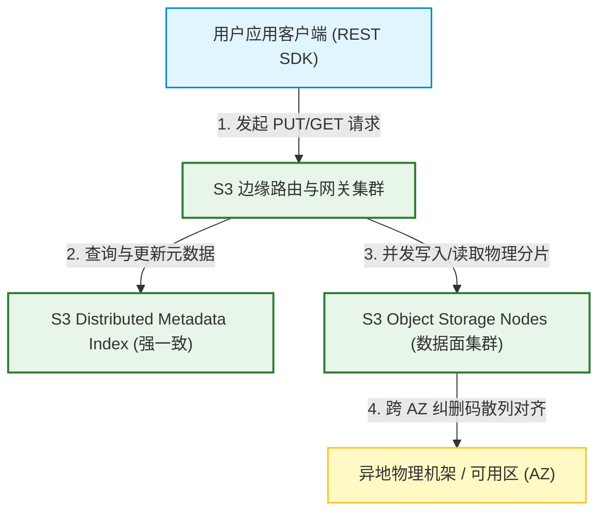
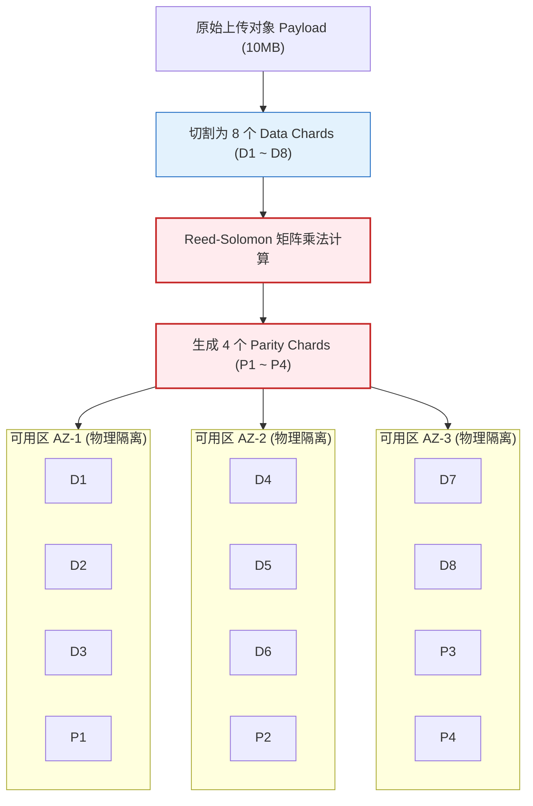
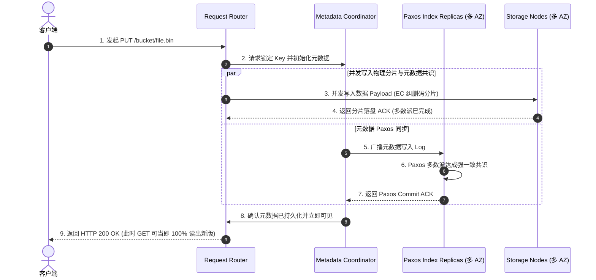
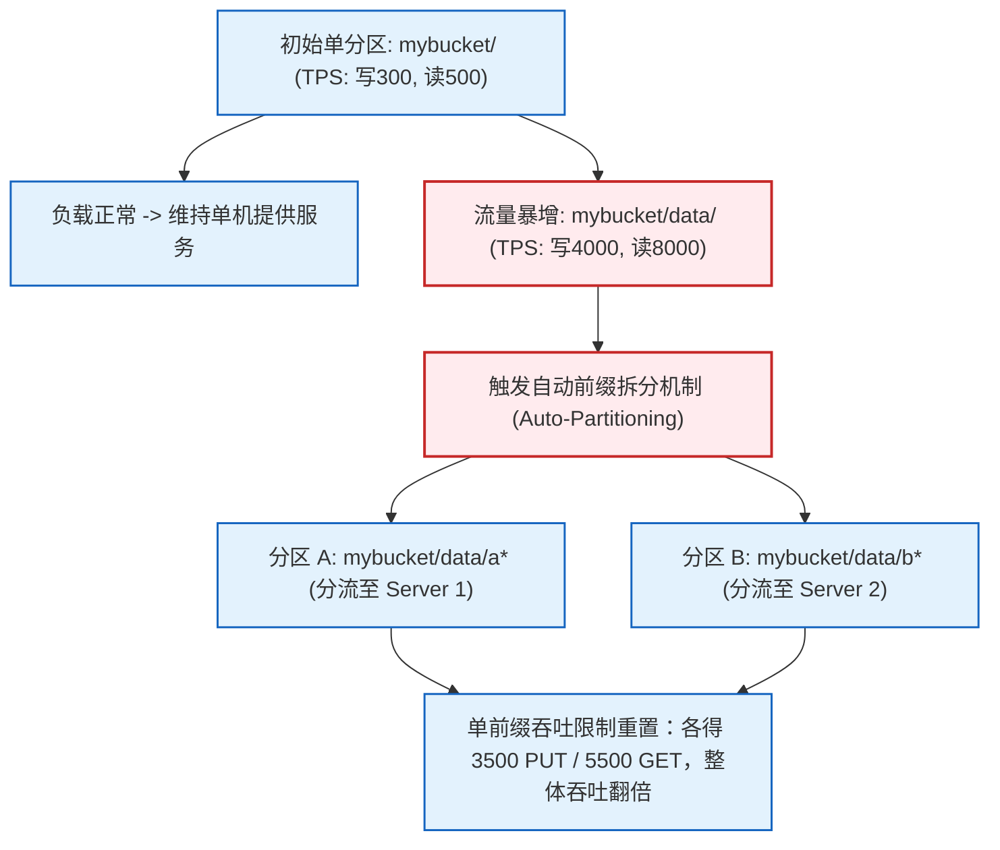

import CaseStudyHeader from '@site/src/components/CaseStudyHeader';
import DesignIntent from '@site/src/components/DesignIntent';
import EvolutionTimeline from '@site/src/components/EvolutionTimeline';
import CompareSlider from '@site/src/components/CompareSlider';
import TradeoffExplorer from '@site/src/components/TradeoffExplorer';
import GlossaryTerm from '@site/src/components/GlossaryTerm';
import ResearchNote from '@site/src/components/ResearchNote';
import GuidedExercise from '@site/src/components/GuidedExercise';
import QuizCard from '@site/src/components/QuizCard';
import MindMap from '@site/src/components/MindMap';

# AWS S3：11个9超高持久性云存储、纠删码数据分片与强一致性元数据改造架构

<CaseStudyHeader
  oneLiner="Amazon S3 作为全球云对象存储的事实标准，其架构设计是海量分布式系统高可靠与低成本运行的缩影。它通过『元数据与物理载荷完全分离』的双平面设计，引入跨 3 个可用区（AZ）物理分发的『纠删码（Erasure Coding）』技术，在仅需极低冗余度的前提下实现了 11 个 9（99.999999999%）的极致数据持久性；并于 2020 年完成了强一致性（Strong Consistency）元数据引擎改造，在不损耗性能的前提下消除了分布式读写滞后的复杂性。"
  stats={[
    {label: '数据持久性', value: '11 个 9 (99.999999999%)'},
    {label: '一致性模型', value: '强一致性 (Strong Read-After-Write)'},
    {label: '分片存储技术', value: '纠删码 (Erasure Coding)'},
    {label: '冗余备份', value: '跨 3 个可用区 (AZ) 物理对齐'},
    {label: '单前缀吞吐', value: '5500 GET / 3500 PUT 每秒'},
    {label: '存储容量', value: '数十亿对象 / 艾字节级 (Exabytes)'}
  ]}
/>

:::info 对应课程概念
本案例融合了以下课程核心概念：
*   **一致性共识协议（Month 5 强一致）**：如何利用分布式强一致复制算法，实现高并发元数据读写一致，解决最终一致性下的读取滞后。
*   **存储引擎数据编码与容错（Month 11 架构容错）**：Reed-Solomon 纠删码（EC）在多 AZ 的分布与数据降级重建算法。
*   **高性能数据路由与分区（Month 5/12）**：超大规模集群下，前缀哈希树的自动分裂（Auto-Partitioning）和热点均摊。
:::

---

## 1. 设计初衷：无限扩展与不可靠硬件的宿命

作为一个无限扩展的云存储系统，Amazon S3 在设计之初，就立足于一个核心分布式命题：**硬件是不可靠的**。在数十万台机器的物理尺度下，硬盘损坏、机架断电、可用区（AZ）光纤中断每天都在频繁发生。
1.  **“11个9”持久性的成本难关**：
    *   要达成 99.999999999% 的数据持久性（Durability），如果使用简单的**三副本复制（3-Way Replication）**，意味着每存 1TB 真实数据需要购买 3TB 的物理硬盘，对于艾字节（EB）级的云存储来说，硬盘采购、电力、散热成本是不可承受的。
    *   必须开发跨多 AZ 的**纠删码（Erasure Coding）**技术，将数据切割成 $N$ 个数据块和 $M$ 个校验块，在只耗费很低额外空间（如 1.5 倍冗余）的前提下，实现比三副本高数个数量级的容错容灾能力。
2.  **最终一致性的历史包袱与强一致痛点**：
    *   早期 S3 的元数据系统为了实现极致的扩展性，采用了基于 Dynamo 架构的最终一致性模型。这导致客户端在 `PUT` 一个新对象后，紧接着进行 `GET` 可能会返回 `404 Not Found`；或者删除一个对象后，`LIST` 依然能看到该文件。这为大数据分析（如 Spark, Hive 频繁读写临时文件）引入了巨大的客户端对账复杂性。
    *   S3 必须重构其元数据索引层，引入低时延的强一致协调引擎，达成瞬时读写可见。
3.  **动态热点流量与分区瓶颈**：
    *   用户可能在几秒钟内，针对同一个 Bucket 内的某个特定前缀（如 `bucket/images/pic_`）发起数十万次并发读写。如果将所有元数据存在同一个物理分区，机器会被瞬间打爆。系统必须在无感知的情况下，对 Key 前缀进行自适应物理分裂。

<DesignIntent
  problem="如何在横跨多物理区域、由上百万块廉价硬盘组成的异构集群中，提供具备 11 个 9 持久性、完全强一致性读写、且能应对海量高并发前缀热点请求的云对象存储架构。"
  users="全球上百万运行在 AWS 上的互联网企业、金融、数据湖、以及政府机构备份系统。"
  devices="通过标准 HTTP / REST API 进行调用。后台为遍布全球 AZ 节点的超大规模分布式对象存储节点集群。"
  goals={[
    '极致持久性（11个9）：设计多 AZ 分布式纠删码管线，使得即使同时发生整个可用区（AZ）停电与数个物理机架损毁，数据仍能被完整找回',
    '强读写一致性：彻底淘汰最终一致性，让 PUT / DELETE 操作在 ACK 返回的一瞬间，全球多 AZ 节点强读一致',
    '超低 I/O 延迟：元数据查询与数据分片读取在毫秒级内完成',
    '无感弹性自动分裂：当单个 Key 前缀的 TPS 超过 3500 次写入或 5500 次读取时，后台自动将其划分为独立物理片'
  ]}
  constraints={[
    '元数据爆炸：百亿级对象的文件元信息极其庞大，读写索引必须全内存或极致固态缓存化，不能阻塞读写路径',
    '网络传输限制：EC 分片的跨 AZ 传输不能增加明显的网络往返时延，必须利用内部骨干万兆网络高速对齐',
    '大文件多部分上传（Multipart）：针对超大文件（如 5TB 视频），必须支持分段并发上传、校验与合并'
  ]}
  firstStep="将数据流切分为控制面（Metadata Engine）与数据面（Key-Value Storage Payload）；编写 Reed-Solomon $N+M$ 纠删码矩阵拆分算法；使用 Paxos 复制索引实现强一致元数据落盘；在路由层部署自适应 Key 树分裂机制。"
/>

---

## 2. 知识全景脑图

<MindMap
  root={{
    label: 'AWS S3 系统架构',
    children: [
      {
        label: '双平面分离 (Separation)',
        children: [
          { label: '控制面 (Metadata Service)' },
          { label: '数据面 (Key-Value Storage Payload)' },
          { label: 'REST API 统一网关' }
        ]
      },
      {
        label: '纠删码容错 (Erasure Coding)',
        children: [
          { label: 'Reed-Solomon N+M 分片' },
          { label: '跨 AZ 物理机架散列分布' },
          { label: '数据降级与丢失重建' }
        ]
      },
      {
        label: '强一致改造 (Consistency)',
        children: [
          { label: 'Paxos/Raft 共识日志强同步' },
          { label: '排队写入与读写屏障' },
          { label: '消灭最终一致性读滞后' }
        ]
      },
      {
        label: '弹性伸缩 (Auto-Partitioning)',
        children: [
          { label: '前缀哈希分裂规则' },
          { label: '负载均衡与热点切片' },
          { label: '吞吐自动弹性限制' }
        ]
      }
    ]
  }}
/>

---

## 3. 系统架构总览 (C4 Model)

以下是 AWS S3 对象存储的双平面（控制面与数据面）分布式 C4 Context 与 Container 拓扑。

### 3a. System Context (系统上下文图)



### 3b. Container Diagram (容器结构图)

```mermaid
graph TB
    classDef client fill:#e1f5fe,stroke:#0288d1,stroke-width:2px;
    classDef control fill:#e8f5e9,stroke:#2e7d32,stroke-width:1.5px;
    classDef payload fill:#ffebee,stroke:#c62828,stroke-width:1.5px;

    UserConn["REST API HTTPS Request"] <--> FrontEnd["Request Router Gateway"]:::control

    subgraph ControlPlane ["S3 强一致控制平面"]
        FrontEnd <-->|1. 查询/锁定元数据| MetadataCoordinator["Metadata Coordinator Node"]:::control
        MetadataCoordinator <-->|2. Paxos 达成一致共识| ConsistentIndexDB["("Distributed Metadata Index DB<br/>(强一致索引数据库)")"]:::control
    end

    subgraph DataPlane ["S3 高可用物理数据面"]
        FrontEnd -->|3. 数据块切割与 EC 计算| EcEngine["Erasure Coding Processor"]:::payload
        
        EcEngine -->|4. 分发 Shard 1| StorageNode1["Storage Node (AZ-1)"]:::payload
        EcEngine -->|4. 分发 Shard 2| StorageNode2["Storage Node (AZ-2)"]:::payload
        EcEngine -->|4. 分发 Shard N+M| StorageNode3["Storage Node (AZ-3)"]:::payload
    end

    StorageNode1 -->|写盘| Disk1["("物理 NVMe / HDD Group")"]:::payload
    StorageNode2 -->|写盘| Disk2["("物理 NVMe / HDD Group")"]:::payload
    StorageNode3 -->|写盘| Disk3["("物理 NVMe / HDD Group")"]:::payload
```

---

## 4. 核心机制拆解

### 4a. 元数据与数据载荷分离架构

S3 的核心扩展性基础在于**将“管理文件”与“存储内容”完全剥离**：
1.  **控制平面（Control Plane）**：负责处理 API 授权、计费、Bucket 配置、对象到物理分片地址的映射映射关系。元数据只包含极小的结构体（如 Key 名字、大小、修改时间、Storage Class 以及一串代表 Payload 位置的 UUID 映射数组）。
2.  **数据平面（Data Plane）**：负责吞吐高密度的二进制字节流（Object Payload）。由于去掉了复杂的目录层级寻址，数据面节点退化为极其纯粹的 Key-Value 块存储引擎（物理层使用高速 nvme/SSD 做写缓存，底层使用大容量廉价 HDD 做冷归档），实现了百 G 级别的物理吞吐。

```mermaid
graph TD
    classDef router fill:#e3f2fd,stroke:#1565c0,stroke-width:1.5px;
    classDef control fill:#e8f5e9,stroke:#2e7d32,stroke-width:2px;
    classDef data fill:#ffebee,stroke:#c62828,stroke-width:1.5px;

    PutRequest["用户发起 PUT bucket/folder/doc.pdf"] --> Router["1. Request Router Gateway 接收"]:::router
    
    Router -->|2. 元数据写入请求| ControlNode["3. Control Plane Coordinator"]:::control
    ControlNode -->|3. Paxos 日志同步与锁分配| MetadataDB["("Metadata Consistent Index")"]:::control
    
    Router -->|4. 数据分段写入请求| EcProcessor["5. Erasure Coding Processor"]:::data
    EcProcessor -->|6. 计算 N+M 纠删块并直接落盘| ChunkStorage["("AZ-1 / AZ-2 / AZ-3 Storage Nodes")"]:::data
    
    MetadataDB -->|7. 关联 UUID 指针| ChunkStorage
```

---

### 4b. 纠删码（Erasure Coding）多 AZ 分发原理

为了兼顾 11 个 9 的持久性与低存储成本，S3 采用了 **Reed-Solomon (RS) 纠删码** 架构：
*   **分片机制（以 $8+4$ 为例）**：当用户上传一个 10MB 的对象时，S3 的数据平面并不是复制 3 份。而是将其平均切割为 8 个大小相等的 Data Shards（数据块），并通过矩阵乘法运算，生成 4 个相同大小的 Parity Shards（校验块）。
*   **散列存放**：这 12 个分片被通过哈希，打散存放到 3 个不同 Availability Zones（可用区）的独立物理机架上。
*   **容灾能力**：根据 RS 算法定理，在 $N+M$ 的配置下，系统只要能成功读取任意 $N$ 个分片，就可以完美无损重构还原出原始的完整数据。这意味着，S3 允许同时损坏任意 4 个分片（如某个 AZ 发生特大火灾停电整体宕机，且另一个 AZ 的某台存储服务器硬盘损坏），用户读取依然零卡顿。
*   **空间节省度**：存储冗余系数仅为 $(8+4)/8 = 1.5$ 倍，远低于传统 3 副本的 3.0 倍空间开销，使得 AWS 能以极低成本销售云存储。



---

### 4c. 强一致性元数据写路径 (Strong Consistency)

在 2020 年重构之前，S3 的元数据写入是异步分发的，读请求可能落在未同步的副本上，形成 eventual consistency。重构之后，S3 的写入流程变为了**强一致的屏障事务流**：
1.  **并发锁与分布式共识**：当发起 `PUT` 时，Metadata Coordinator 先锁定对应的 Key。在将数据安全写入多个可用区的存储节点（确保多数派成功）的同时，Metadata 变更指令被作为日志发送给分布式 Paxos 复制组。
2.  **强制提交确认**：元数据索引必须在 Paxos 多数派节点完成持久化提交（Commit）并返回 ACK 后，S3 才会向客户端发送 HTTP 200 Success。
3.  **读屏障与无感合并**：因为元数据的多 AZ 状态在 Paxos 下是绝对一致的，任何紧随其后的 `GET` 请求路由到任意副本，拿到的都是一致的索引数据。配合数据分片的高可用，达成了 Read-After-Write 强一致，彻底消灭了缓存对账组件。



---

### 4d. 自适应前缀拆分 (Auto-Partitioning)

S3 在物理上通过对 Bucket + Key 前缀进行哈希分类。
*   最初，一个 Bucket 的所有索引通常存放在单个索引 Partition 上。
*   当系统检测到用户针对某个特定前缀（如 `/mybucket/logs/2026/`）发起的请求流量迅速攀升，超过了**单个分区节点物理承载能力上限**（如 3500 次写或 5500 次读）。
*   S3 自动在后台启动 Partition Split。它根据前缀字符将该分区对半撕开，分为 `/mybucket/logs/2026/0` 和 `/mybucket/logs/2026/1`，分流到两台不同的物理索引服务器上。
*   这使单个 Bucket 的吞吐量可以通过前缀增加而无限扩展，清除了系统物理扩展性的天花板。



<ResearchNote
  title="Amazon S3 强一致性元数据改造论文"
  source="AWS Technology Blogs (2021), Deep Dive on S3 Strong Consistency Design"
  href="https://aws.amazon.com/blogs/aws/amazon-s3-update-strong-read-after-write-consistency/"
  insight="AWS S3 团队在 2020 年末对运行了 15 年的 eventual consistency 元数据层进行了重构。他们通过引入无锁冲突解决的分布式一致性复制协议，成功将強读写一致性作为开箱即用特性下放。这一架构的突破点在于，**在不引入任何高昂分布式锁锁时延的前提下，达成了超低延迟（亚毫秒）的元数据提交**。这为大数据云原生数仓架构扫清了障碍。"
  application="架构启示：在设计超大规模分布式 KV 或存储系统时，**不要被早期的 eventual consistency 模型所局限**。通过在控制面与数据面之间插入轻量级的 Paxos 共识协调器，数据持久化和索引一致性可以完美解耦。这也与课程 Month 5 中分布式强一致和 Month 11 高容错数据库架构设计密切呼应。"
/>

---

## 5. 关键数据结构与算法

### 5a. Reed-Solomon 纠删码矩阵乘法运算

纠删码的核心理论是：将原始的 $N$ 个数据块，通过与一个特殊的**范德蒙矩阵（Vandermonde Matrix）**或 **柯西矩阵（Cauchy Matrix）** 进行矩阵相乘，计算得到 $M$ 个校验块。
整个数学模型在**伽罗瓦域（Galois Field, $GF(2^w)$）**中运行，以确保所有加减乘除计算值在有限的数字域内不发生溢出。

#### 纠删码编码公式：
若有数据向量 $D = [d_1, d_2, \dots, d_N]^T$，我们构建一个 $(N+M) \times N$ 的生成矩阵 $G$：

$$G \cdot D = C$$

$$C = [d_1, d_2, \dots, d_N, p_1, p_2, \dots, p_M]^T$$

*   $G$ 的前 $N$ 行为单位矩阵 $I$。
*   $G$ 的后 $M$ 行为用于计算校验分片的系数矩阵。
*   得到的复合向量 $C$ 中，前 $N$ 个元素就是原始数据分片，后 $M$ 个元素是生成的校验分片。

#### 恢复算法：
若中途丢失了任意 M 个分片，系统只需从 G 中删去丢失分片对应的行，得到一个新的可逆矩阵 G_recv，再计算其逆矩阵 G_recv_inv，即可恢复出原始数据：
$$D = G_recv_inv \times C_recv$$
这个计算极度适配 CPU 的 AVX-512 向量化指令集，解密重建速度可达数 GB/s。

---

## 6. 架构演进史

AWS S3 作为云计算历史上最伟大的存储基石，其演进代表了云对象存储的发展轨迹：

<EvolutionTimeline
  events={[
    {
      year: '2006',
      title: 'S3 诞生：最终一致性云对象存储',
      why: '早期的计算资源极为昂贵，主要解决“有无”问题，设计核心为利用便宜的商用硬件搭建海量 key-value 存储，采用了最终一致性。',
      change: '推出基于 REST API 的 PUT/GET 接口；元数据采用最终一致性路由；物理数据采用三副本（3-Way）冗余复制。'
    },
    {
      year: '2012',
      title: '多 AZ 纠删码（Erasure Coding）全面上线',
      why: '海量企业数据落入 S3，三副本带来的物理硬盘资源消耗与采购成本飙升，需要大幅度降低每 GB 存储的物理成本。',
      change: '将默认的 3 副本冗余全面重构为 8+4 纠删码分片；分片跨 3 个可用区（AZ）散列存放，在冗余度降至 1.5 倍的同时，将数据持久性提升至 11 个 9。'
    },
    {
      year: '2020',
      title: '元数据强一致性（Strong Consistency）革命',
      why: '随着 Spark、Presto、Flink 等云原生实时大数据湖的兴起，最终一致性带来的 GET/LIST 延迟错乱频繁引发大数据任务算错或临时文件丢失，客户端规避代码越来越冗长。',
      change: '彻底重构元数据存取路径，利用 Paxos 多数派同步共识引擎，在不增加额外请求延迟的前提下，实现了强读写一致性。'
    }
  ]}
/>

---

## 7. 架构对比：纠删码 (Erasure Coding) 存储 vs. 三副本 (3-Way Replication) 存储

<CompareSlider
  before={
    <div style={{ padding: '20px', background: '#ffebee', border: '1px solid #c62828', borderRadius: '8px', height: '100%', color: '#333' }}>
      <strong>三副本复制存储 (3-Way Replication)</strong>
      <p style={{ marginTop: '10px', fontSize: '0.9rem' }}>数据整包复制 3 份，分别存放在 3 个物理节点上。读写逻辑极简（直接读任意存活节点即可），系统不需要消耗 CPU 进行多项式编解码。但致命缺点是空间浪费大（300% 存储开销），硬件硬件采购成本高昂。</p>
    </div>
  }
  after={
    <div style={{ padding: '20px', background: '#e8f5e9', border: '1px solid #2e7d32', borderRadius: '8px', height: '100%', color: '#333' }}>
      <strong>纠删码分片存储 (Erasure Coding 8+4)</strong>
      <p style={{ marginTop: '10px', fontSize: '0.9rem' }}>将原始数据分割为 8 份数据块并计算出 4 份校验块。容许任意 4 个分片同时损坏或丢失。冗余开销仅为 150%，降低了一半的硬件采购成本。虽然需要小幅度的 CPU 矩阵运算进行编解码，但在艾字节规模下，能省下数十亿美元资金。</p>
    </div>
  }
  labels={['三副本复制 (高物理开销)', '纠删码分片 (高空间能效比)']}
/>

---

## 8. 权衡：海量对象存储系统的关键架构折中

S3 在其服务生命周期中，对系统成本、一致性、以及系统吞吐进行过深入的折中考量：

<TradeoffExplorer
  title="AWS S3 持久度、一致性与存储能效权衡"
  dimensions={['数据持久度 (11个9)', '强读写一致性时延', '存储硬件物理成本', '单 Key 并发吞吐限制', '编解码 CPU 算力开销']}
  options={[
    {
      name: '跨多 AZ 纠删码 + Paxos 元数据一致',
      scores: [5, 4, 5, 4, 3],
      note: '通过跨 AZ 分发 EC 数据分片，获得顶级的 11 个 9 数据安全度，并依托 Paxos 实现瞬时读可见。缺点是跨 AZ 传输引入了极小幅度的网络时延（通常在 5-15 毫秒内），且在读写时需要消耗一定的 CPU 矩阵编解码计算资源。',
      whenToUse: '海量存储容量、对数据持久性有绝对刚性要求、同时需要强一致的通用云对象存储平台。'
    },
    {
      name: '本地单 AZ 三副本复制模式',
      scores: [3, 5, 2, 5, 5],
      note: '放弃跨 AZ 数据散列，仅在单个数据中心内建立三份副本。数据不经过 EC 矩阵运算，直接全量写入。写入时延极低（亚毫秒级），但代价是容灾能力差（一旦整个数据中心断电或火灾，数据立刻下线），且硬件开销巨大。',
      whenToUse: '超高性能缓存、对时延有极致要求（微秒级）但对全局容灾要求不高的短期缓存空间。'
    },
    {
      name: '最终一致性轻量控制层 (早期 S3)',
      scores: [5, 2, 5, 5, 5],
      note: '元数据在后台异步 gossip 复制对齐，不使用分布式锁和 Paxos。这使写入请求的并发吞吐能力达到上限，但代价是客户端在读写时需要忍受数据不一致的错乱问题。',
      whenToUse: '允许读滞后、对一致性毫无要求但对元数据极高并发写吞吐要求苛刻的日志收集管道。'
    }
  ]}
/>

---

## 9. 如果是你来设计：用 Python 模拟纠删码 (Erasure Coding) 丢失修复

### 场景设想
在 S3 数据平面的修复任务（Reconstruction Job）中，系统检测到某个对象的 4 个数据分片中，由于硬盘损坏丢失了其中的部分数据。
*   为了模拟这一过程，假设我们采用一个简易的纠删码模式（$3+2$）：
    *   原始数据被均分为 3 个部分（$D_1, D_2, D_3$）。
    *   为了实现简单，校验分片 $P_1$ 计算为 $D_1 + D_2 + D_3$。
    *   校验分片 $P_2$ 计算为 $D_1 - D_2 + D_3$。
*   如果 $D_2$ 分片发生损坏丢失，请你编写一段 Python 代码，利用剩余的 $D_1, D_3, P_1$（或 $P_2$）对丢失的 $D_2$ 进行无损还原重构。

<GuidedExercise
  title="基于 Python 的 3+2 简易纠删码丢失修复模拟"
  goal="编写代码实现简易纠删分片的生成与在丢失任一数据分片时的自动代数方程修复重建。"
  steps={[
    '步骤 1: 设计编码函数 `encode_data(d1, d2, d3)`。接收三个原始数据（如整型数值），根据公式计算出 `p1 = d1 + d2 + d3` 和 `p2 = d1 - d2 + d3`。返回分片数组 `[d1, d2, d3, p1, p2]`。',
    '步骤 2: 模拟数据丢失。假设 `d2` 丢失（将 `d2` 置为 `None`）。目前我们仅拥有 `d1, d3, p1, p2`。',
    '步骤 3: 编写修复逻辑 `repair_data(d1, d2, d3, p1, p2)`。检测到 `d2` 缺失。',
    '步骤 4: 利用数学代数方程对 d2 进行重建。因为 `p1 = d1 + d2 + d3`，所以 `d2 = p1 - d1 - d3`。或者也可以使用 `p2` 方程：`d2 = d1 + d3 - p2`。编写还原公式并验证计算出的 `d2` 是否与原始值严格相同。'
  ]}
  checks={[
    '确认对于任意输入的数据，生成的校验分片 `p1` 与 `p2` 均能正确计算得出',
    '验证当 `d2` 缺失时，通过 `p1` 重建出的数据值与原始值完全一致',
    '验证当 `d2` 缺失且通过 `p2` 重建时，数据仍能正确还原，证明多余校验信息的冗余可用性'
  ]}
/>

---

## 10. 知识自测

<QuizCard
  questions={[
    {
      q: 'Amazon S3 在 2020 年进行的“强一致性（Strong Read-After-Write Consistency）”元数据架构重构，对大吞吐数据湖（如 Spark/Hive）有什么里程碑意义？',
      options: [
        'A. 使得 S3 的存储硬件采购成本降低了 50%',
        'B. 彻底消除了元数据列表（LIST）和获取（GET）的延迟滞后问题。不再需要像 S3Guard 这样繁琐的第三方外部数据库对账缓存，保证了大数据处理在并发 PUT/DELETE 后能瞬时读取到最新文件状态，防止计算结果出错',
        'C. 强制要求所有大文件必须以 Android Binder IPC 协议流转',
        'D. 将 S3 每一个 Bucket 的存储容量上限硬性卡死在 2GB'
      ],
      answer: 1,
      explain: '以前的最终一致性导致 Spark/EMR 等大数据计算在写入临时文件后，下一步读取可能会因为 404 失败，迫使厂商在客户端写了大量的重试和一致性校验机制。强读写一致性的到来，使 S3 彻底符合了传统 POSIX 文件系统般的强可见性，成为天然的数据湖基石。'
    },
    {
      q: '在 Amazon S3 采用的 Reed-Solomon 纠删码（以 8+4 为例）架构中，它是如何用 1.5 倍的低空间冗余系数实现比 3 副本高数个数量级的持久度的？',
      options: [
        'A. 因为它将文件复制 8 份并挂载在 Ring 0 特权空间',
        'B. 它将大文件切分为 8 个数据分片并计算出 4 个校验分片，跨 3 个物理隔离的可用区（AZ）打散散列存储。根据数学原理，只要存活任意 8 个分片即可无损还原数据，意味着系统允许同时损坏 4 个物理机架或设备，且空间利用率达 66.7%',
        'C. 依靠网卡硬件中断进行 2D 仿射变换矩阵的累乘加速',
        'D. 强制限制每个可用区只能保存校验分片而不准保存数据分片'
      ],
      answer: 1,
      explain: '这正是 Erasure Coding 的魅力。如果用 3 副本（3.0倍开销）只能容忍任意 2 副本丢失；而 EC 8+4（仅 1.5倍开销）可以容忍任意 4 块丢失，极大提高了抵御大规模灾难（如整栋机房大楼停电）的能力，且大幅降低了每 GB 存储的硬盘购置费用。'
    },
    {
      q: '当用户在 S3 中对某个特定 Key 前缀（如 mybucket/files/doc_）的并发请求极速暴增并逼近物理上限时，S3 是如何在用户无感的前提下弹性扩容的？',
      options: [
        'A. 自动在后台拉起 LMKD 守护进程杀掉用户态进程以腾出带宽',
        'B. 触发自适应前缀拆分机制（Auto-Partitioning）。当单个前缀的写 TPS 超过 3500 或读 TPS 超过 5500 时，系统自动在后台根据哈希前缀对元数据索引分区进行物理分裂（Split），分流至不同的索引服务器，使吞吐上限弹性翻倍',
        'C. 强制限制当前 Bucket 在 1 小时内禁止任何 GET 请求写入',
        'D. 使用 JIT Profile 重新编译整个 WebAssembly 线性 Heap 堆'
      ],
      answer: 1,
      explain: 'S3 的命名空间是扁平的，Key 中的“/”仅仅是逻辑前缀。系统通过实时监控各“前缀段”的流量压强，自适应分裂元数据 Partition，打散热点，从而使用户可以通过精细划分前缀获得几乎无上限的并发扩展性。'
    }
  ]}
/>

---

## 来源清单

*   [AWS Technology Blogs (2020), Amazon S3 Update – Strong Read-After-Write Consistency](https://aws.amazon.com/blogs/aws/amazon-s3-update-strong-read-after-write-consistency/)
*   [James Hamilton (AWS), S3 architecture deep dive notes](https://perspectives.mvdirona.com/)
*   [Plank (2007), A Tutorial on Reed-Solomon Coding for Fault-Tolerance in RAID-like Systems](https://dl.acm.org/doi/10.1145/1218080.1218082)
*   [Amazon S3 Documentation: Request rate and performance considerations](https://docs.aws.amazon.com/AmazonS3/latest/userguide/optimizing-performance.html)