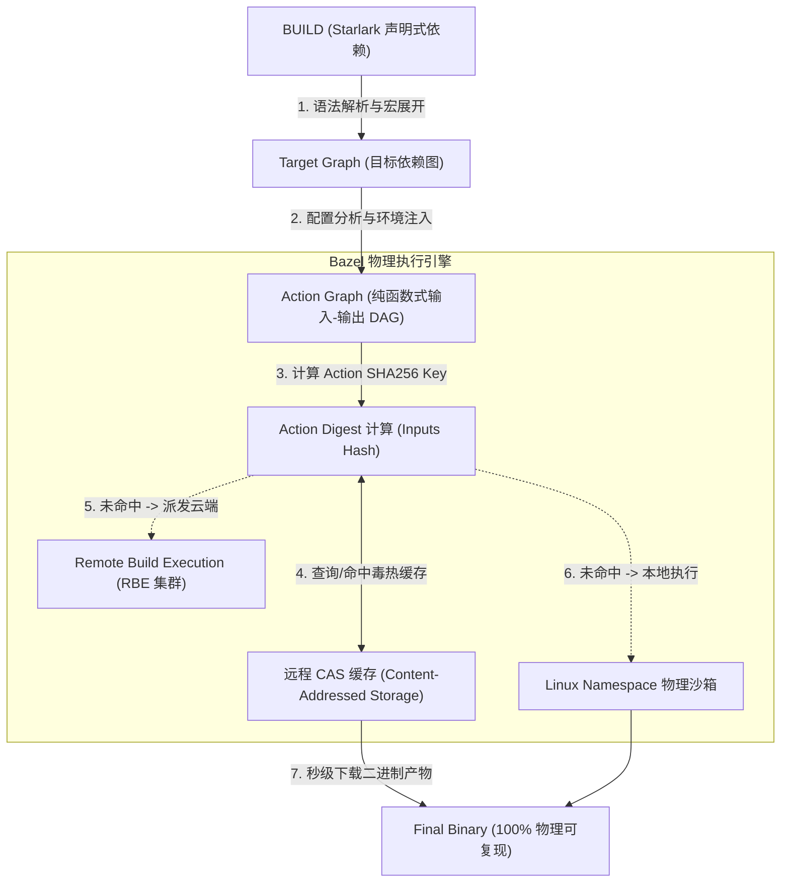
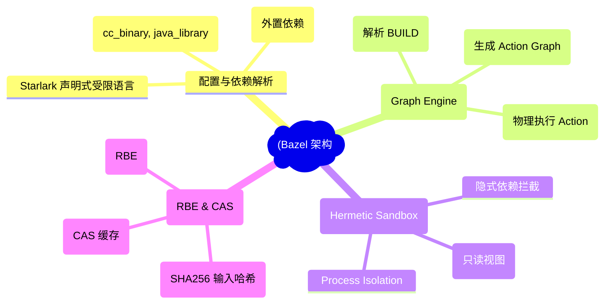
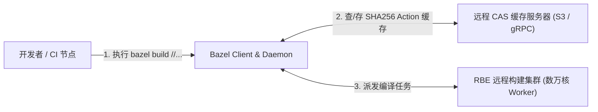
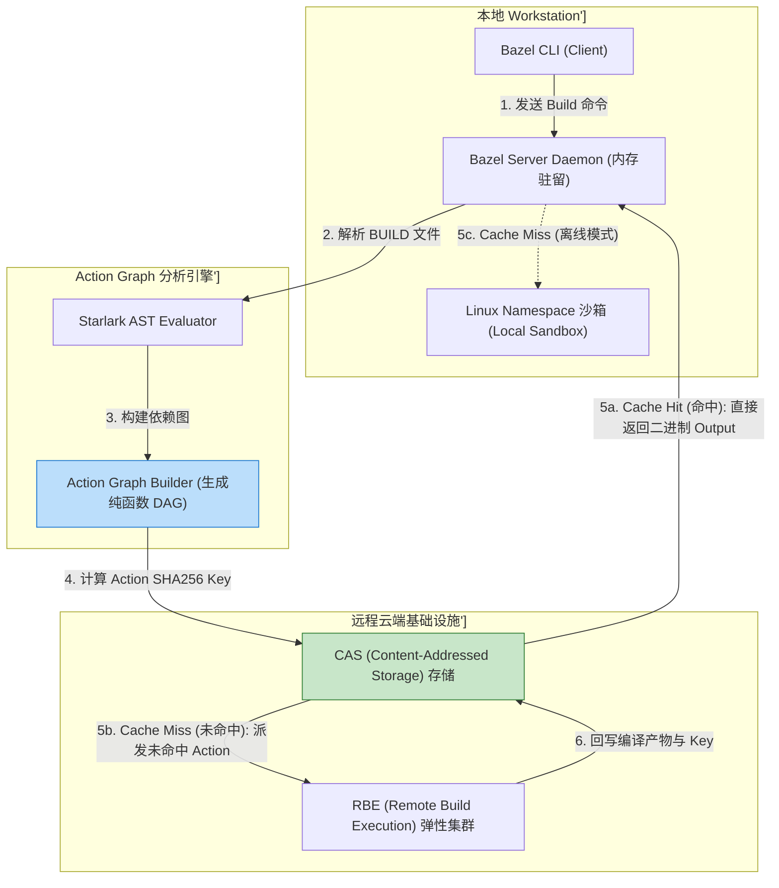
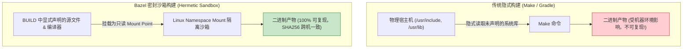
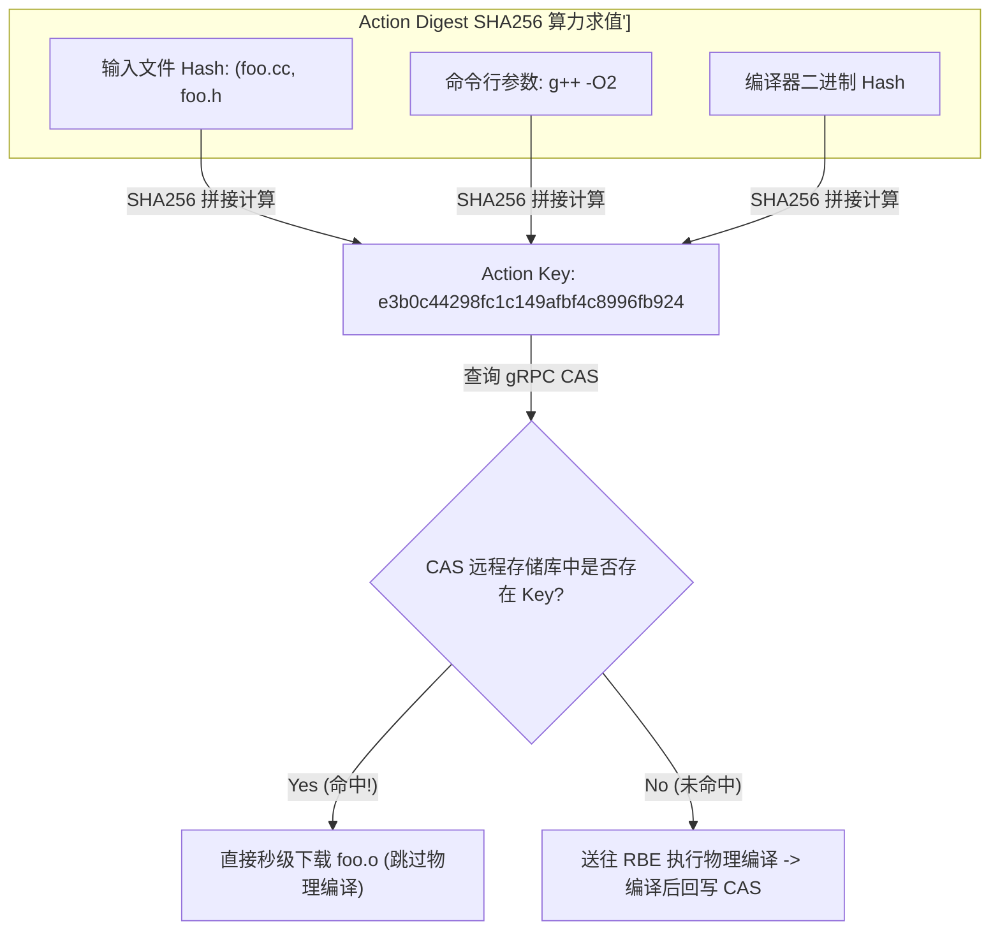
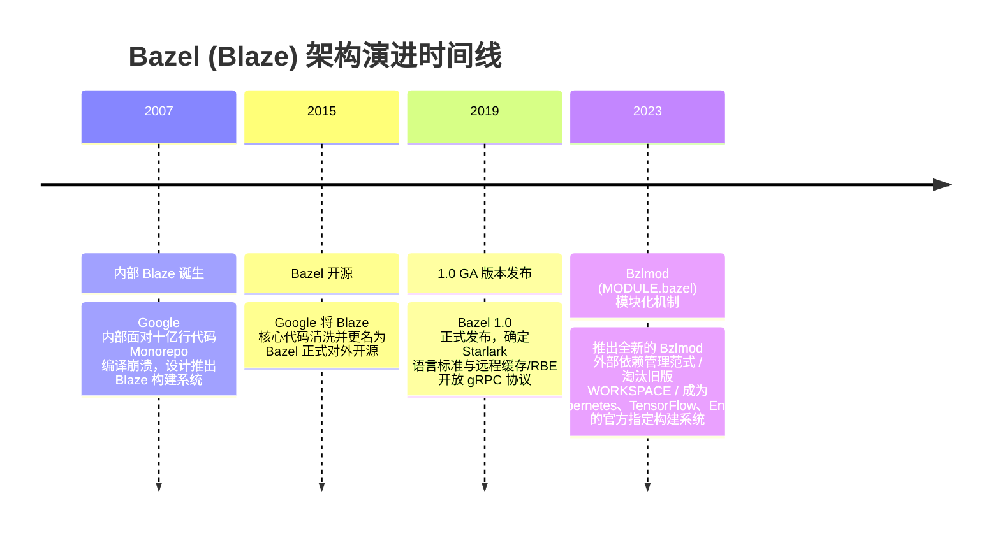

import CaseStudyHeader from '@site/src/components/CaseStudyHeader';
import DesignIntent from '@site/src/components/DesignIntent';
import ArchitectureEvolution from '@site/src/components/ArchitectureEvolution';
import TradeoffExplorer from '@site/src/components/TradeoffExplorer';
import GlossaryTerm from '@site/src/components/GlossaryTerm';
import ResearchNote from '@site/src/components/ResearchNote';
import QuizCard from '@site/src/components/QuizCard';
import CompareSlider from '@site/src/components/CompareSlider';
import GuidedExercise from '@site/src/components/GuidedExercise';
import PyRunner from '@site/src/components/PyRunner';

# Bazel：Google 单仓库工程学与可复现构建

<CaseStudyHeader
  oneLiner="Bazel（源于 Google 内部的 Blaze 系统）通过严格的 Starlark 声明式依赖图、Linux Namespace 进程沙箱隔离以及基于 SHA256 内容寻址存储（CAS）的分布式远程缓存与远程执行（RBE），实现了支撑数十亿行代码 Monorepo 的 100% 可复现（Hermetic）与秒级增量构建。"
  stats={[
    {label: '起源架构', value: 'Google Blaze (Monorepo 构建标准)'},
    {label: '配置语言', value: 'Starlark (Python 风格受限图声明语言)'},
    {label: '核心隔离', value: 'Hermetic Sandbox (Linux Namespaces 沙箱)'},
    {label: '中间图表达', value: 'Action Graph (严格输入-输出 Action 节点)'},
    {label: '加速引擎', value: 'CAS 远程缓存 + Remote Build Execution (RBE)'}
  ]}
/>

:::info 对应课程概念
本案例横跨 [Month 2 拓扑排序与计算图依赖构建](../foundations/programming-systems-primer)、[Month 5 分布式缓存 (CAS) 与哈希校验](../cloud-enterprise-industrial/capstone-cloud-native)、[Month 8 巨型单仓库 (Monorepo) 工程化治理](../cloud-enterprise-industrial/capstone-cloud-native)。它是系统架构师理解如何在高吞吐大型工程中消除“在我电脑上能跑，在你电脑上跑不了”的幻觉性 Bug、实现全球分布式极速编译的权威指导。
:::

## 1. 设计初衷：如何支撑十亿行 Monorepo 的精确与极速构建？

在 Google 这样拥有数十亿行代码、数万名工程师共用同一个单仓库（Monorepo）的超级企业中，传统的构建工具（如 Make、Maven、Gradle）遇到了根本性的物理崩溃：
1. **隐式依赖（Implicit Dependencies）导致构建不可复现**：传统工具依赖系统全局环境（如 `/usr/bin/gcc` 或环境变量）。不同机器上的头文件版本微小差异，会导致编译出的二进制文件行为不一致，出现极难排查的“幽灵 Bug”。
2. **“全量重编译（Rebuild All）”地狱**：由于缺乏对文件级输入-输出依赖关系的绝对掌控，传统构建工具在稍微修改一个底层头文件时，无法精确判定受影响的边界，迫使工程师花费数小时重新编译整个工程。
3. **本地 CPU 算力爆仓与资源浪费**：单机物理 CPU 核心数有限。在大规模编译时，单个开发者的笔记本电脑会被卡死数小时，且不同开发者之间重复编译了 99% 完全相同的二进制 Target，造成巨大的物理算力浪费。

Bazel 的核心设计用意在于：**基于纯函数思想构建 <GlossaryTerm term="密封构建 (Hermetic Build)" definition="密封构建 (Hermetic Build)：一种严格的可复现构建范式。构建过程完全隔离物理宿主机的环境变量、系统库与全局工具，所有的输入 (源文件、编译器、参数) 必须在 BUILD 文件中显式声明，确保在任何时间、任何机器上执行相同的 Action 都能得到二进制完全一致的输出。">密封构建（Hermetic Build）</GlossaryTerm>，并利用 <GlossaryTerm term="Action Graph" definition="Action Graph：Bazel 在构建阶段生成的底层有向无环图。图中的每一个 Action 节点都有明确的输入文件集合、命令行参数和输出文件集合。Bazel 仅基于该图节点的 Hash 校验来决定是否重新执行 Action。">Action Graph</GlossaryTerm> 实现 <GlossaryTerm term="CAS 远程缓存 (RBE)" definition="CAS 远程缓存 (RBE)：基于内容寻址存储 (Content-Addressed Storage) 的分布式远程构建与缓存系统。将 Action 输入的 SHA256 哈希作为 Key 查询远程缓存，若命中则直接下载产物，无需物理执行编译。">CAS 远程缓存与 RBE 分布式执行</GlossaryTerm>**。
- **Starlark 声明式受限语言**：强制要求开发者在 `BUILD` 文件中显式写明 `deps`。Starlark 禁用了一切文件系统读写和网络 IO，确保依赖图的绝对确定性。
- **Linux Namespace 沙箱物理隔离**：在本地执行 Action 时，Bazel 利用 Linux mount/pid namespace 构建临时只读沙箱（Sandbox）。任何未在 `BUILD` 中声明的隐式头文件访问都会被系统直接报 `Permission Denied` 拦截。
- **CAS 远程缓存与 RBE 几万核并发**：每个 Action 的输入文件内容、编译器版本和命令行被哈希化为一个 SHA256 `Action Digest`。通过查询远程 CAS 缓存，若已有同事编译过相同的 Key，直接毫秒级下载结果；若未命中，将 Action 派发至包含数万个 Cloud Worker 的 RBE 集群并行执行。



<DesignIntent
  problem="如何构建一个能支撑十亿行代码 Monorepo、绝对消除隐式依赖 Bug、实现 100% 密封可复现构建并具备全球 CAS 缓存与 RBE 云端并发编译能力的构建系统？"
  users="Google 及大型科技公司 Monorepo 基础架构工程师、C++/Java/Go 基础设施团队负责人、DevOps 构建性能专家。"
  devices="开发者 Workstation、运行 Bazel Client 的 CI 节点以及充当 RBE / CAS 缓存节点的云端 Server 集群。"
  goals={[
    '100% 密封可复现 (Hermeticity)：隔离物理机环境变量，无论在 Mac、Linux 还是 CI 上编译，产物 SHA256 绝对一致。',
    'Action Graph 文件级精准增量：精确追踪到单文件 Hash 变化，仅重算受影响的最少 Action 节点。',
    'CAS 远程缓存 (Remote Caching)：不同开发者间共享 Action 编译产物，命中率高达 80%+，编译耗时从小时级缩短至秒级。',
    'RBE (Remote Build Execution) 横向扩展：把万个 Action 节点瞬间打散到云端万核集群并行执行。'
  ]}
  constraints={[
    'Starlark 的严格受限语法曲线：不支持动态文件系统扫描或任意 Shell 脚本，开发者必须显式编写复杂的依赖关系。',
    '网络带宽与 CAS 传输瓶颈：若 Action 输出的二进制文件巨大（如数 GB 的 C++ debug symbols），高频从远程 CAS 下载可能堵塞企业网关带宽。'
  ]}
  firstStep="剖析 Bazel 依赖图解析与 Action 抽象；分析 Linux Namespace 沙箱隔离与 Action Digest 计算公式；用 Python 编写一个包含 SHA256 动作哈希、CAS 缓存与依赖图裁剪的 Bazel 仿真器。"
/>

## 2. 系统功能全景



---

## 3. 最新架构总览

Bazel 构建引擎与远程 RBE / CAS 拓扑结构如下：

### 3a. System Context (系统上下文)



### 3b. Container Diagram (容器架构)



---

## 4. 核心机制拆解

### 4a. 传统隐式构建（Make/Gradle） vs Bazel 密封沙箱（Hermetic Sandbox）对比

传统构建工具直接读取物理主机的环境，容易造成隐式依赖泄露；Bazel 利用 Linux Namespaces 在独立的文件系统视图下运行编译，确保 100% 可复现：



### 4b. Action Digest 计算与 CAS 远程缓存匹配原理

Bazel 的核心加速秘诀在于：**构建前计算 Action Digest**。
一个 Action Digest 由三部分精确内容求 SHA256 哈希得出：
1. 所有输入文件的内容 Hash（包含依赖的代码、头文件）。
2. 编译命令字符串及参数（如 `g++ -O3 -Wall`）。
3. 编译器及环境变量二进制文件的 Hash。



---

## 5. 关键数据结构与算法：Action Graph 与 Hash 校验算法

Bazel 内部维护的 **Action Graph** 节点数据结构与哈希极速碰撞计算逻辑伪代码：

```cpp
#include <string>
#include <vector>
#include <openssl/sha.h>

struct ActionNode {
    std::string action_id;
    std::string command_line;                      // 编译命令行
    std::vector<std::string> input_file_hashes;   // 所有依赖输入的 SHA256
    std::vector<std::string> output_file_paths;   // 期望产生的输出文件路径
    
    // 计算该 Action 的纯函数 Action Digest Key
    std::string CalculateActionDigest() const {
        std::string raw_payload = command_line;
        for (const auto& hash : input_file_hashes) {
            raw_payload += ":" + hash;
        }
        
        // SHA256 计算
        unsigned char digest[SHA256_DIGEST_LENGTH];
        SHA256(reinterpret_cast<const unsigned char*>(raw_payload.c_str()), raw_payload.size(), digest);
        
        // 转化为 Hex 字符串返回
        return ToHexString(digest, SHA256_DIGEST_LENGTH);
    }
};

// 执行引擎判断
void ProcessAction(const ActionNode& action, RemoteCASClient& cas_client) {
    std::string action_key = action.CalculateActionDigest();
    
    // 远程 CAS 缓存查询
    if (cas_client.Contains(action_key)) {
        std::cout << "[CAS Cache Hit] 直接从云端缓存下载: " << action_key << std::endl;
        cas_client.DownloadArtifacts(action_key, action.output_file_paths);
        return; // 零物理编译！
    }
    
    // 未命中，派发执行
    ExecuteActionInSandbox(action);
    cas_client.UploadArtifacts(action_key, action.output_file_paths);
}
```

---

## 6. 架构演进史



---

## 7. 架构对比

### 传统构建工具（Make / Maven / Gradle） vs Bazel 可复现构建引擎

<CompareSlider
  before={
    <div style={{ padding: '20px', background: '#ffebee', border: '1px solid #c62828', borderRadius: '8px', height: '100%', color: '#333' }}>
      <strong>传统构建工具 (Make / Maven)</strong>
      <p style={{ marginTop: '10px', fontSize: '0.9rem' }}>
        受宿主机物理环境变量与未声明库污染。“在你机器上能跑，在我机器上报错”。无法跨机器共享编译中间产物。
      </p>
    </div>
  }
  after={
    <div style={{ padding: '20px', background: '#e8f5e9', border: '1px solid #2e7d32', borderRadius: '8px', height: '100%', color: '#333' }}>
      <strong>Bazel 密封构建引擎</strong>
      <p style={{ marginTop: '10px', fontSize: '0.9rem' }}>
        基于 Starlark 与 Linux Namespace 沙箱，100% 密封可复现。依靠 CAS 远程缓存与 RBE 实现全球秒级分布式增量编译。
      </p>
    </div>
  }
  labels={['传统构建工具', 'Bazel 密封可复现引擎']}
/>

---

## 8. 核心决策的取舍

在为大型工程选型构建系统时，架构师对构建模型（密封纯函数 vs 动态灵活）与执行位置（本地沙箱 vs 云端 RBE）面临选型权衡：

<TradeoffExplorer
  title="Bazel 核心构建策略取舍"
  dimensions={['构建 100% 密封可复现性', '大型 Monorepo 全量编译性能', '构建配置编写门槛与灵活度', '远程网络 CAS/RBE 基础设施成本', '隐式依赖 Bug 拦截率']}
  options={[
    {
      name: 'Bazel 密封构建 + CAS 远程缓存 + RBE 云端集群策略',
      scores: [5, 5, 2, 2, 5],
      note: '完全消除隐式依赖 Bug，通过 CAS 缓存与 RBE 将万核编译拉平至秒级。缺点是 Starlark 编写门槛极高，且维护 RBE/CAS 云端集群成本高昂。',
      whenToUse: '超大型团队、数十万行代码以上的 Monorepo、对构建速度与可复现性有极致要求的工业级项目。'
    },
    {
      name: '传统 CMake / Gradle + 本地编译策略',
      scores: [2, 2, 5, 5, 2],
      note: '配置极其简单，支持动态 Shell 脚本与系统库读取，无需准备云端 CAS 服务器。缺点是容易产生隐式依赖 Bug，全量编译极慢且无法跨机共享缓存。',
      whenToUse: '小型单体项目、个人开源小工具、对物理网络环境没有云端支撑的独立开发。'
    }
  ]}
/>

---

## 9. 实践指引：实现一个带 Action Digest 哈希计算与 CAS 缓存的 Bazel 仿真器

理解 Bazel 核心的最佳路径是模拟从 Starlark 声明解析出 Action Graph、计算 SHA256 Action Digest 以及查询 CAS 远程缓存的过程。在下方练习中，通过 Python 实现一个包含 Action Hash 计算与 CAS 缓存命中的构建仿真器。

<GuidedExercise
  title="练习指引：手写 Action Graph、SHA256 Action Digest 计算与 CAS 远程缓存仿真"
  goal="构建包含 `BazelEngine` 和 `RemoteCASStore` 的仿真系统。1. 定义 2 个编译 Action：`compile_foo` (输入 `foo.cc`, 命令 `g++ -O2`) 和 `link_app` (依赖 `foo.o`)。2. 计算每个 Action 的 `Action Digest`（SHA256(inputs_content + cmd)）。3. 第一轮构建：CAS 未命中，物理执行编译并写入 CAS。4. 第二轮构建：保持输入文件不变，再次触发构建，验证 Action Digest 完全一致并触发 `CAS Cache Hit`，实现 0 秒编译。"
  hints={[
    'Action Digest 计算：`hashlib.sha256((cmd + "".join(input_hashes)).encode()).hexdigest()`。',
    'CAS 远程字典：`cas_store[action_digest] = binary_output`。'
  ]}
  steps={[
    '定义 `Action` 类包含输入、命令和期望输出。',
    '定义 `BazelEngine` 负责求 Hash 与调度。',
    '运行第一轮构建：观察输出 `[CAS Cache Miss]` 并物理执行。',
    '运行第二轮构建：观察输出 `[CAS Cache Hit]` 秒级命中，验证 Bazel CAS 缓存加速逻辑。'
  ]}
  checks={[
    '第二轮构建成功命中 CAS 缓存，未发生任何物理编译动作。',
    '当修改 `foo.cc` 内容后，Action Digest 发生改变，自动识别为 `Cache Miss` 并重新编译，验证增量判定正确。'
  ]}
/>

#### 交互式 Python 运行实验
在下方控制台中调试 Bazel Action Digest 哈希计算与 CAS 缓存命中仿真代码，观察纯函数式构建与缓存加速：

<PyRunner
  expect="远程缓存命中与增量重建验证成功"
  rows={25}
  code={`import hashlib

class Action:
    def __init__(self, name: str, cmd: str, inputs: dict, outputs: list):
        self.name = name
        self.cmd = cmd
        self.inputs = inputs # filename -> content_hash
        self.outputs = outputs

    def compute_digest(self) -> str:
        # 纯函数 Hash 计算: SHA256(cmd + sorted_inputs_hashes)
        raw_str = self.cmd
        for fname in sorted(self.inputs.keys()):
            raw_str += f":{fname}={self.inputs[fname]}"
            
        digest = hashlib.sha256(raw_str.encode('utf-8')).hexdigest()
        return digest

class RemoteCAS:
    def __init__(self):
        self.store = {} # digest -> binary_output_content

    def get(self, digest: str):
        return self.store.get(digest)

    def put(self, digest: str, output_content: str):
        self.store[digest] = output_content

class BazelEngine:
    def __init__(self, cas: RemoteCAS):
        self.cas = cas

    def execute_action(self, action: Action):
        digest = action.compute_digest()
        print(f"⚙️ [Action Graph] 分析 Action '{action.name}' -> Action Digest: {digest[:16]}...")
        
        # 1. 查询 CAS 远程缓存
        cached_output = self.cas.get(digest)
        if cached_output:
            print(f"   ⚡ [CAS Cache Hit!] 命中云端缓存 Key={digest[:16]}... 直接下载产物: '{cached_output}' (耗时: 0ms)")
            return cached_output

        # 2. 未命中，物理执行编译
        print(f"   🔨 [CAS Cache Miss] 物理执行编译命令: '{action.cmd}'...")
        output_result = f"CompiledBinary({action.name})"
        
        # 3. 将结果回写 CAS
        self.cas.put(digest, output_result)
        print(f"   📤 [CAS Upload] 编译产物已上传云端 CAS 供团队共享: Key={digest[:16]}")
        return output_result

# 运行仿真
cas = RemoteCAS()
engine = BazelEngine(cas)

# 定义输入文件
files_v1 = {"foo.cc": "hash_abc123", "foo.h": "hash_def456"}
act1 = Action("compile_foo", "g++ -O2 -c foo.cc -o foo.o", files_v1, ["foo.o"])

print("--- 1. 第一次构建 (全新代码，CAS 为空) ---")
engine.execute_action(act1)

print("\\n--- 2. 第二次构建 (代码无变化，同事在另一台机器构建) ---")
engine.execute_action(act1)

print("\\n--- 3. 第三次构建 (开发者修改了 foo.cc 代码) ---")
files_v2 = {"foo.cc": "hash_abc999_MODIFIED", "foo.h": "hash_def456"}
act2 = Action("compile_foo", "g++ -O2 -c foo.cc -o foo.o", files_v2, ["foo.o"])
engine.execute_action(act2)

print("\\n[Result] 远程缓存命中与增量重建验证成功")
`}
/>

---

## 10. 知识自测

完成自测以检验你对 Bazel 密封构建范式、Starlark 依赖图、Linux Namespace 沙箱及 CAS/RBE 缓存加速机制的掌握程度：

<QuizCard
  questions={[
    {
      q: 'Bazel（源自 Google 内部的 Blaze）提出的“密封构建（Hermetic Build）”范式主要解决了传统构建工具的什么重大致命缺陷？',
      options: [
        'A. 解决了配置文件无法用 HTML 格式编写的问题',
        'B. 彻底消除了隐式依赖（Implicit Dependencies）对构建过程的污染。通过隔离物理宿主机的环境变量和全局库，保证了在任何时间、任何机器上执行相同的 Action 都能得到 100% 完全一致的二进制输出',
        'C. 强制要求所有工程师使用同一个型号的显示器',
        'D. 允许在编译过程中自动给开发者的手机发送短信通知'
      ],
      answer: 1,
      explain: '密封构建（Hermetic Build）是 Bazel 的核心灵魂。它通过隔离物理机环境与未声明的隐式依赖，消除了“在我机器上能跑，在你机器上跑不了”的幻觉性 Bug，确保了 100% 可复现性。'
    },
    {
      q: 'Bazel 是如何实现在几千人的团队中共享编译中间产物，从而将海量代码的构建时间从小时级缩短至秒级的？',
      options: [
        'A. 强制要求所有人把电脑用网线串联在一起',
        'B. 将每个 Action 的输入文件内容、编译命令与参数组合求出 SHA256 动作哈希（Action Digest）。利用基于内容寻址存储（CAS）的远程缓存，如果别人已经编译过相同的 Digest，直接秒级下载二进制产物，无需重复编译',
        'C. 将所有的源文件全部打包上传到 GitHub Issues 中',
        'D. 依靠物理 CPU 硬件自动预测未来的代码修改'
      ],
      answer: 1,
      explain: 'CAS 远程缓存是 Bazel 极速构建的秘诀。基于输入内容与命令计算出确定的 Action SHA256 Key，直接命中远程 CAS 存储下载编译结果，实现了全球团队的算力复用。'
    },
    {
      q: 'Bazel 在本地执行编译 Action 时，是如何防止开发者在代码中偷偷访问未在 BUILD 文件中显式声明的“隐式头文件”的？',
      options: [
        'A. 依靠工程师之间的口头道德约束',
        'B. 在 Linux 系统上利用 NamespaceMount 机制为每个 Action 动态挂载只读的伪物理沙箱（Sandbox），沙箱内仅包含 BUILD 中显式声明的文件，任何未声明的隐式文件访问都会被系统报 Permission Denied 直接拦截',
        'C. 强制将物理主机的硬盘格式化',
        'D. 依靠操作系统自带的杀毒软件实时拦截'
      ],
      answer: 1,
      explain: 'Linux Namespace 沙箱是 Bazel 强行拦截隐式依赖的物理铁面壁垒。通过构建独立的 Mount 视图，非声明文件在沙箱中根本不存在，强制确保了依赖声明的 100% 准确。'
    }
  ]}
/>

<ResearchNote
  title="远程缓存 + 沙箱 = 可复现构建"
  source="Bazel 官方文档:Hermeticity"
  href="https://bazel.build/basics/hermeticity"
  insight="Bazel 要求每个构建动作声明全部输入输出并在沙箱内执行,相同输入必得相同输出(hermetic),从而可以安全地跨机器复用远程缓存——改一行只重建受影响的目标。"
  application="架构启示:可复现 = 显式声明依赖 + 隔离执行;这让缓存从「碰运气」变成「可证明命中」,是大规模单仓构建的地基。"
/>

## 来源

- [Bazel: Build and Test System Overview and Architecture (Bazel Official Specifications)](https://bazel.build/)
- [Build in the Large: Google's Experience with Blaze and Monorepo Infrastructure (ACM Queue)](https://queue.acm.org/detail.cfm?id=2857274)
- [Remote Build Execution (RBE) and Content-Addressed Storage (CAS) Protocol (Google Open Source)](https://github.com/bazelbuild/remote-apis)