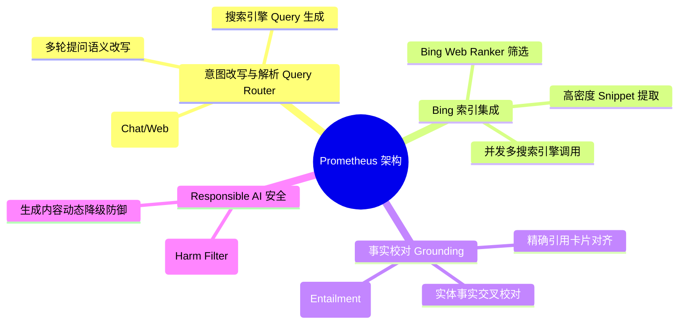
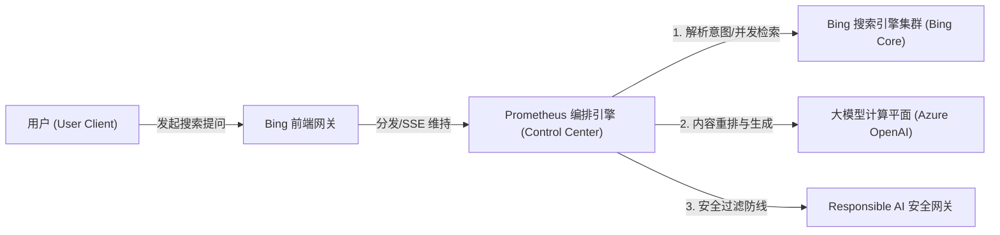
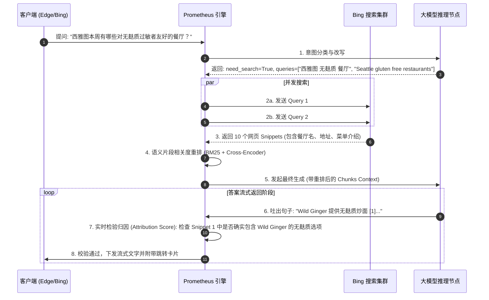
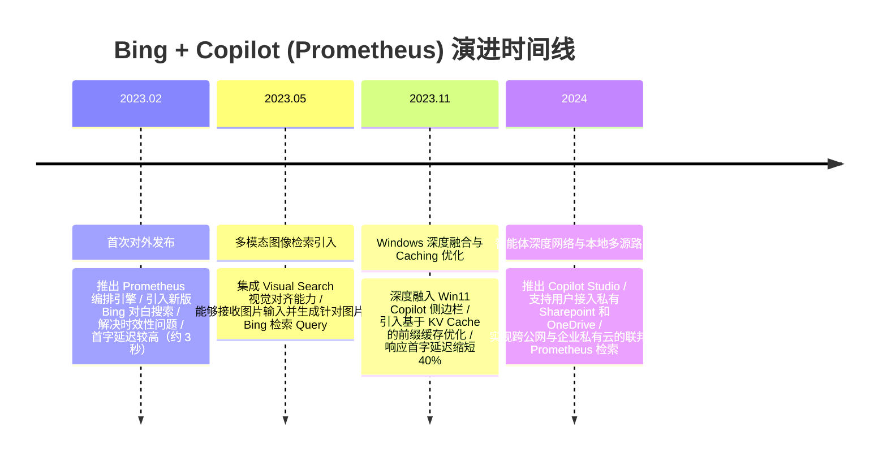

import CaseStudyHeader from '@site/src/components/CaseStudyHeader';
import DesignIntent from '@site/src/components/DesignIntent';
import ArchitectureEvolution from '@site/src/components/ArchitectureEvolution';
import TradeoffExplorer from '@site/src/components/TradeoffExplorer';
import GlossaryTerm from '@site/src/components/GlossaryTerm';
import ResearchNote from '@site/src/components/ResearchNote';
import QuizCard from '@site/src/components/QuizCard';
import CompareSlider from '@site/src/components/CompareSlider';
import GuidedExercise from '@site/src/components/GuidedExercise';

# Bing + Copilot：传统搜索与 LLM 绑定的 Prometheus 编排架构

<CaseStudyHeader
  oneLiner="微软新版 Bing 依托 Prometheus 引擎将大模型（GPT-4 级）与 Bing 搜索引擎数十年的 Web 网页索引库无缝绑定，通过多轮迭代检索（Multi-turn Query Expansion）与实时事实交叉比对，构建了兼具高时效性与高归因可信度的 RAG 编排器。"
  stats={[
    {label: '发布时间', value: '2023 年'},
    {label: '编排核心', value: 'Prometheus Engine (编排协调层)'},
    {label: '数据底座', value: 'Bing Index & Bing Ranker'},
    {label: '时有时效性', value: '秒级公网索引刷新对齐'},
    {label: '安全对齐防线', value: 'Responsible AI Classifier'}
  ]}
/>

:::info 对应课程概念
本案例横跨 [Month 8 RAG 检索增强](../rag/why-rag)、[Month 5 API 网关与路由网关](../core-components/api-gateway)、[Month 4 设计模式](../design-patterns-lld/patterns-through-change)。它全面解析了在大算力、低延迟以及海量实时信息的极值约束下，传统搜索引擎的分布式集群是如何与现代黑盒大模型做协同计算的。
:::

## 1. 设计初衷：打破传统搜索与 LLM 幻觉的双向壁垒

传统搜索引擎在检索实时信息时速度极快，但面对“我需要为全家组织一个包含素食者和无麸质患者的西雅图三日游计划”这类复杂的长尾意图时，用户只能拿到一堆碎片化网页链接，必须手动逐个整理。而纯大模型（如 ChatGPT）虽然逻辑组织力强，但极易发生“胡说八道”，且其知识完全被锁定在训练数据的截止时间前。

微软团队设计的 **Prometheus 编排引擎** 旨在将这两者的优势进行底层融合：它将大模型作为一个**意图解析器与答案生成/检验器**，而将 Bing 搜索引擎作为一个**超大规模、秒级更新的活体内存（Active Memory）**，在两者之间实现双向信息流转。

<DesignIntent
  problem="在保持传统搜索极速响应（< 2秒）的前提下，无缝引入千亿参数的大模型计算，改写用户问题，获取实时网页黄金事实，合成条理清晰且带有精准引用的回答。"
  users="寻求实时新闻解答、长篇调研整理、多维比较、旅游或日程规划的高频搜索用户。"
  devices="与 Windows 操作系统（如 Copilot 侧边栏）、Bing Web 端、Edge 浏览器、手机客户端深度绑定的实时交互界面。"
  goals={[
    'Prometheus 闭环编排：构建一个包含 Query 解析器、Search Grounder 与 Response Synthesizer 的中介编排总线，将外部检索与模型推理管线化。',
    '多轮动态查询扩展（Query Expansion）：大模型分析提问，生成 2-3 个并发搜索 Query；根据首轮搜索返回的事实，动态判断是否需要发起下一轮追加搜索。',
    '实时事实一致性过滤（Grounding）：在模型生成答案时，Prometheus 会交叉对比大模型输出的每一个实体（数字、名字）是否能与 Bing 返回的原始网页匹配，剔除无根据的幻觉表达。',
    '安全隐私与审查网关（Responsible AI）：在请求进入和生成流出两端拦截敏感及有害词汇，动态阻断违规生成。'
  ]}
  constraints={[
    '大模型超高并发的首字延迟（TTFT）：大模型流式输出本就慢，再加上搜索的网络跳数，极易引起高延迟，必须在 Prometheus 内部做精细的异步流水线处理。',
    '网络爬虫的质量损耗：公网返回的大体积 HTML 存在大量噪声，需要 Bing 排行榜服务（Ranker）在底层提前清洗并提供高可信 Snippets。',
    '模型推理的窗口大小：早期 GPT-4 上下文有限，Prometheus 必须在重排阶段进行强力内容裁剪，仅保留与问题语义余弦相似度最高的核心段落。'
  ]}
  firstStep="设计 Prometheus 控制环（Control Loop），将单次问题拆解为 意图改写 -> 并发 Bing Search -> 内容裁剪与 Rank -> 大模型带 Context 生成 -> Grounding 校验 -> 渲染输出 6 个核心阶段。"
/>

## 2. 系统功能全景

以下是新版 Bing Copilot 的 Prometheus 编排底座功能全景图：



---

## 3. 架构总览

Prometheus 引擎作为控制中心，协调客户端、Bing 搜索引擎与大模型集群进行联合计算：

### 3a. 系统上下文图 (System Context)



### 3b. 容器架构图 (Container)

```mermaid
graph TB
  subgraph ClientSide["客户端端点"]
    EdgeBrowser["Edge 浏览器 / Copilot 面板"]
    SSEDecoder["流式解析与引用上标匹配组件"]
  end

  subgraph PrometheusCore["Prometheus 核心服务 (C++ / Go)"]
    ControlLoop["Prometheus 控制环 (Orchestration Loop)"]
    QueryGenerator["Query 生成与重写器"]
    ContextAggregator["Context 组装与重排模块"]
    AttributionVerifier["事实归因与校对器 (Grounder)"]
  end

  subgraph BingEngine["Bing 传统计算集群"]
    BingIndexer["Bing 网页爬虫与倒排索引库"]
    BingRanker["Bing 实时网页重排算法服务 (Snippets Generator)"]
  end

  subgraph AzureLLM["大模型计算平面 (Azure)"]
    GPTInference["GPT-4 / Copilot 专属模型节点"]
  end

  EdgeBrowser <-->|WebSocket / EventSource 长连接| ControlLoop
  ControlLoop <--> QueryGenerator
  ControlLoop <--> ContextAggregator
  ControlLoop <--> AttributionVerifier

  QueryGenerator -->|1. 触发实时搜索指令| BingRanker
  BingRanker <-->|2. 读取倒排索引与网页快照| BingIndexer
  BingRanker -->|3. 返回 Top-N 优质网页片段| ContextAggregator
  
  ContextAggregator -->|4. 拼接 Prompt (Context + User Query)| GPTInference
  GPTInference -->|5. 流式返回生成的候选答案| ControlLoop
  
  ControlLoop <-->|6. 生成结果双向校对| AttributionVerifier
  ControlLoop -->|7. 输出带引用上标的安全流| EdgeBrowser
```

---

## 4. 核心机制拆解

### 4a. Prometheus 动态闭环编排时序

不同于一般的单向 RAG（即直接检索后生成），Prometheus 在网关与大模型之间设计了一个**闭环控制环（Control Loop）**，支持多轮递进式交互寻址：



### 4b. 多轮动态查询扩展与语义降阶

在用户问题极度复杂时，单一的关键词搜索往往无法获取完全的信息。
Prometheus 支持**多轮递进式搜索（Multi-turn Iterative Search）**：
- **第一轮扩展**：将用户长文本模糊问题降阶拆分为 3 个核心词组，先抓取基本定义信息。
- **动态追加决策**：若大模型在推理过程中发现“缺乏某个核心事实”（例如“我知道了该处理器的晶体管密度，但我还没查到其官方发售价”），Prometheus 会实时再次向 Bing 发起第二轮定向搜索追加，合并上下文后再继续生成。

### 4c. 事实双向校对与 Responsible AI 安全防护网

为防止大模型出现“安全穿透”或“幻觉假引用”，Prometheus 设计了双向防线：
1. **输入过滤器（Input Guardrails）**：在用户 Query 进入系统之初，通过多分类敏感词分类器（Harm Classifier）进行语义过滤。若发现违规，直接在网关层截断返回友好提示，**不向大模型平面发送请求，节省推理算力**。
2. **事实校对器（Search Grounder）**：实时计算输出句与 Context 片段的交叉相似度（Entailment Predictor）。如果发现模型强行编造了网页 Snippet 中不存在的数字（例如网页里写“销量数十万”，模型生成为“销量 52 万”），Grounder 会强行把模型生成的该数字擦除，防止模型借助引用外衣输出更高迷惑性的幻觉。

---

## 5. 架构演进史

微软搜索与大模型绑定编排的升级历程：



---

## 6. 架构对比

### 经典单向 RAG (Naive RAG) vs Prometheus 闭环 RAG 编排

<CompareSlider
  before={
    <div style={{ padding: '20px', background: '#ffebee', border: '1px solid #c62828', borderRadius: '8px', height: '100%', color: '#333' }}>
      <strong>单向 RAG (检索 $\to$ 生成)</strong>
      <p style={{ marginTop: '10px', fontSize: '0.9rem' }}>
        用户问题一次性转化为向量检索本地知识库，将检索出来的 Top-K 段落一股脑打包塞给大模型，模型生成完直接返回。如果检索阶段召回了错误或垃圾信息，模型将毫无纠错能力，全盘吞下并输出“看似正确”的幻觉。
      </p>
    </div>
  }
  after={
    <div style={{ padding: '20px', background: '#e8f5e9', border: '1px solid #2e7d32', borderRadius: '8px', height: '100%', color: '#333' }}>
      <strong>Prometheus 闭环编排 RAG</strong>
      <p style={{ marginTop: '10px', fontSize: '0.9rem' }}>
        大模型和搜索引擎处于双向交互的控制环（Control Loop）中。支持多轮动态查询扩展、中间事实不足时追加搜索；并在流式生成阶段进行句级交叉事实校对（Attribution Engine），不实实体强行擦除或降级，确保 100% 来源真实。
      </p>
    </div>
  }
  labels={['经典单向 RAG', 'Prometheus 闭环编排']}
/>

---

## 7. 核心决策的取舍

在将万亿级网页搜索引擎与大模型编排绑定时，架构师必须在响应效率、时效与事实校验深度上做出取舍：

<TradeoffExplorer
  title="Prometheus 搜索编排路由策略取舍"
  dimensions={['时有时效性 (网页秒级捕获)', '首字到达时间 (TTFT)', '模型调用Token消耗成本', '事实归因可信度', '复杂长尾提问理解深度']}
  options={[
    {
      name: '动态多轮迭代追加检索 (Prometheus 深度编排)',
      scores: [5, 2, 2, 5, 5],
      note: '对于极端复杂的长尾逻辑问题，能够通过 2-3 轮追加检索获取最详实的事实源，幻觉率低。但多轮交互会导致整体 TTFT 劣化。',
      whenToUse: '科研文献调研、复杂行程规划、长篇事实对账分析。'
    },
    {
      name: '单次检索重排后直接生成 (Naive-like RAG)',
      scores: [3, 4, 4, 3, 3],
      note: '只发起一次外部搜索调用，首字响应快，调用 Token 消耗低。但如果首次检索未能召回核心要点，生成结果无法纠错。',
      whenToUse: '高频常规问答、实时新闻速递、低延迟搜索助手的默认路由。'
    },
    {
      name: '高频热点搜索结果静态缓存 (Redis Grounding Cache)',
      scores: [1, 5, 5, 3, 1],
      note: '响应速度达到毫秒级，几乎零模型消耗成本。但对于发生于几秒钟内的全球最新突发事件完全丧失感知。',
      whenToUse: '高频共性问题（如“昨晚超级碗谁赢了”）的快速响应分支、大流量熔断防护。'
    }
  ]}
/>

---

## 8. 实践指引：实现一个微型的 Prometheus 动态搜索控制环

在构建高可靠的 AI 搜索引擎时，编排控制环（Control Loop）的设计至关重要。

在 `labs/month08/prometheus_control_loop/` 目录下（或在下方练习中），编写一个可以动态决定是否需要追加搜索并执行事实验证的 Python 编排器。

<GuidedExercise
  title="练习指引：写一个 Prometheus 搜索控制环模拟器"
  goal="用 Python 实现一个简单的 Prometheus 编排核心类，模拟处理用户的复杂查询，决定是否需要追加检索，并校对生成文本的事实对齐度。"
  hints={[
    '你可以使用一个轻量大模型 API（或用 Mock 类模拟模型分类意图）来输出 `need_more_search: True/False`。',
    '第一步：分析输入 Query。第二步：模拟调用 Bing Search API 返回文本。第三步：大模型评估现有上下文是否能闭环解答，若不能，生成追加 Query 发起二次检索。',
    '最后：实现一个简单的句级关键词对齐校验，防止输出的实体在 Context 中不存在。'
  ]}
  steps={[
    '定义 `PrometheusOrchestrator` 类。',
    '编写 `execute_loop(user_query: str) -> dict` 主编排算法。',
    '使用 Mock 类模拟外部 Bing 搜索在不同 Query 下返回的结构化 Snipets。',
    '实现追加检索路由分支：当首轮搜索返回的信息不包含核心数据时，触发 `_append_search()` 检索追加事实。',
    '编写单元测试，模拟用户查询“微软当前的股价是多少”，验证系统是否能够自动合并首轮的“微软股价”与第二轮的“当日走势”并正确归纳输出。'
  ]}
  checks={[
    '如果模拟数据中包含自相矛盾的事实，校对器能够捕获到异常并发出 GroundingWarning 警告。',
    '多轮检索能正确终止，不会陷入无限循环搜索中。'
  ]}
/>

---

## 9. 知识自测

完成自测以检验你对 Prometheus 控制环、Bing 检索集成与事实 Grounding 机制的理解：

<QuizCard
  questions={[
    {
      q: '新版 Bing Copilot 的 Prometheus 编排引擎中，其最核心的设计特点“闭环控制（Control Loop）”如何打破了 Naive RAG 的“单向线性”瓶颈？',
      options: [
        'A. 它使得大模型能够完全接管物理服务器的内核，自主决定磁盘读写',
        'B. 它在网关大模型之间建立了双向循环链路：大模型负责意图分析与检索 Query 生成；搜索引擎返回片段后由大模型在内存评估是否足够，若不够能动态发起第二轮/第三轮针对性追加搜索；并在最终生成流式回答时，对每句话进行实时句级交叉事实归因验证，防止单向 RAG “喂啥信啥”的致命缺陷',
        'C. 它彻底取消了搜索引擎的作用，完全依靠大模型的本地缓存来回答',
        'D. 它通过把用户每次提问自动翻译为多国语言，从而实现了全球同步'
      ],
      answer: 1,
      explain: 'Naive RAG（Month 8 已讨论）最大的问题是“一槌子买卖”。如果首次向量检索召回的数据偏软或包含垃圾噪声，模型在生成时完全无能为力。Prometheus 引入了闭环控制：把大模型作为决策主体，Bing 作为实时知识库，通过“搜索 -> 评估 -> 动态追加搜索 -> 交叉 Grounding 校对”的闭环机制，保证了回答在极高复杂意图下的完备性与真实性。'
    },
    {
      q: '在 Prometheus 事实校对（Search Grounding）阶段，如果模型流式吐出了一句“西雅图 Wild Ginger 餐厅的无麸质面条售价为 28 美元”，而 Bing 召回的原始网页片段中只有“Wild Ginger 提供无麸质面条，售价 18 美元”，Attribution 校验器在架构上最应该采取什么措施？',
      options: [
        'A. 将错就错，直接把 28 美元发送给客户端展示，相信大模型能自我修复',
        'B. 立即终止当前的流式推理，在网关层强行将该句不实表达（如将 28 美元降级或擦除，甚至替换为网页中的 18 美元黄金事实，或标记该实体无法归因），从而阻止幻觉数字传递给用户',
        'C. 重新把这 28 美元信息存入 Bing 索引库，将其固化为新的真理',
        'D. 强制让用户的 Edge 浏览器崩溃以提醒用户注意安全'
      ],
      answer: 1,
      explain: '事实大于生成。在大模型事实对齐边界（Month 8 Grounding）中，只要输出的特定实体（如价格数字、人名）与 Bing 搜索引擎抓取出来的 Context（黄金事实源）不一致，Attributor 事实校对器就必须进行动态干预——通过在流式 SSE 管道中强行拦截擦除，或者在句尾不打引用标签并发出警告，阻止具有迷惑性的幻觉信息漏到用户端。'
    },
    {
      q: '从算力与延迟优化的角度看，为什么 Prometheus 需要在用户提问进入的第一时间，先在 API 网关层进行 Responsible AI 安全前置拦截，而不是让大模型生成完答案后再行审查过滤？',
      options: [
        'A. 因为大模型本身完全不具备任何安全防范的能力，只能依靠网关',
        'B. 因为大模型（如 GPT-4 级）的推理算力极度昂贵，且生成需要消耗几秒钟时间。在网关最前端通过高性能轻量分类器（如前置拦截有害 Query）能直接在 10 毫秒内低成本熔断恶意请求，彻底省去后续的大模型推理计算开销，极大提升系统高并发下的吞吐率和节约服务器成本',
        'C. 因为如果让大模型读取了有害信息，大模型会在物理上发生损坏',
        'D. 为了强迫用户购买高阶会员，否则禁止使用安全过滤器'
      ],
      answer: 1,
      explain: '这是高并发系统典型的“提早熔断（Fail-Fast）”优化模式（Month 4）。用户提问是极轻量级的文本，使用毫秒级轻量模型拦截敏感 Query 成本极低。如果先让大模型算了几秒钟，消耗了上百个 Token 的昂贵算力后才在输出端说“这不合规”，不仅对用户体验是极大的延迟劣化，更是对云厂商计算资源的极大浪费。'
    }
  ]}
/>

## 来源

- [Microsoft Research: The Prometheus Engine - Integration of LLMs with Web Search Indexes](https://blogs.bing.com/search/february-2023/Building-the-New-Bing)
- [Retrieval-Augmented Generation for Knowledge-Intensive NLP Tasks (Lewis et al., NeurIPS '20)](https://arxiv.org/abs/2005.11401)
- [Demonstrating the New Bing Search Experience Grounded with OpenAI Collaboration](https://news.microsoft.com/the-new-bing/)
- [Cross-Encoder Re-Ranking Models for High-Precision Information Retrieval Specs](https://sbert.net/examples/applications/cross-encoder/README.html)
